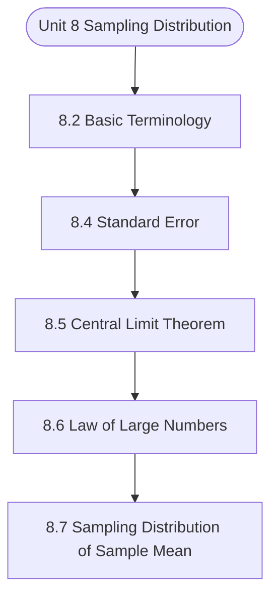

# MCS-066: Mathematical Foundations - II
## Unit 8: Sampling Distribution

> 📚 **Programme:** M.Sc. (Data Science and Analytics) | **Semester:** Semester 2  
> ⏱️ **Estimated Study Time:** ~61 mins | 📄 **Textbook Pages:** 26 Pages  
> 📥 **Original PDF:** [Download & View Textbook](../../../pdfs/Semester_2/MCS-066_Mathematical_Foundations_-_II/Unit-8_Sampling_Distribution.pdf)

---

### 🎯 Executive Concept & Data Science Relevance
In modern data systems, **Sampling Distribution** forms a vital conceptual pillar. Statistical inference bridges sample data to population reality. In A/B testing, feature significance testing, and model benchmarking, hypothesis tests determine whether performance gains are statistically significant or merely random fluctuations.

> [!NOTE]
> **Why this matters for your career:** Mastering sampling distribution equips you with the foundational principles required to reason mathematically about high-dimensional datasets, evaluate algorithm performance, and avoid statistical pitfalls in production machine learning pipelines.

### 🗺️ Visual Knowledge Architecture
The following concept map illustrates the structural hierarchy and learning trajectory of this module:

### 📖 Core Definitions & Terminology Cards

> 📌 **Central Limit Theorem (CLT)**  
> - **Formal Definition:** For any population with mean $\mu$ and finite variance $\sigma^2$, the sampling distribution of sample mean $\bar{X}$ approaches a Normal distribution $\mathcal{N}(\mu, \sigma^2/n)$ as sample size $n \to \infty$, regardless of population shape.  
> - 💡 **Practical Intuition & Analogy:** *Averages of independent random variables always look Gaussian in large samples ( $n \ge 30$ ).*

> 📌 **Standard Error (SE)**  
> - **Formal Definition:** The standard deviation of the sampling distribution of a statistic: $\text{SE}(\bar{X}) = \frac{\sigma}{\sqrt{n}}$ (or $\frac{s}{\sqrt{n}}$ when $\sigma$ is unknown).  
> - 💡 **Practical Intuition & Analogy:** *Uncertainty of your sample estimate: larger sample sizes dramatically reduce estimation error.*

> 📌 **Null ($H_0$) and Alternative ($H_1$) Hypotheses**  
> - **Formal Definition:** $H_0$ represents the baseline status quo of no effect or no difference. $H_1$ represents the research claim of a true non-zero effect.  
> - 💡 **Practical Intuition & Analogy:** *In a courtroom: $H_0$ is presumed innocent; $H_1$ is guilty upon convincing evidence.*

> 📌 **Type I Error ( $\alpha$ ) and Type II Error ( $\beta$ )**  
> - **Formal Definition:** Type I error is rejecting true $H_0$ (false positive, rate $\alpha$). Type II error is failing to reject false $H_0$ (false negative, rate $\beta$). Statistical power is $1 - \beta$.  
> - 💡 **Practical Intuition & Analogy:** *Type I: Innocent person convicted. Type II: Guilty person acquitted.*

### ⚡ Governing Mathematical Laws & Formula Cheatsheet
#### 🔹 Confidence Interval for Population Mean
$$
\bar{x} \pm z_{\alpha/2} \left(\frac{\sigma}{\sqrt{n}}\right) \quad \text{or} \quad \bar{x} \pm t_{\alpha/2, n-1} \left(\frac{s}{\sqrt{n}}\right)
$$
- **Explanation:** Interval providing $1-\alpha$ confidence of containing true population parameter $\mu$.

#### 🔹 One-Sample Z-Test Statistic
$$
Z = \frac{\bar{x} - \mu_0}{\sigma / \sqrt{n}} \sim \mathcal{N}(0, 1)
$$
- **Explanation:** Used when population standard deviation $\sigma$ is known and sample size is large.

#### 🔹 One-Sample Student's t-Test Statistic
$$
t = \frac{\bar{x} - \mu_0}{s / \sqrt{n}} \sim t_{n-1}
$$
- **Explanation:** Used when population $\sigma$ is unknown and estimated using sample standard deviation $s$.

#### 🔹 Chi-Square Test of Independence Statistic
$$
\chi^2 = \sum_{i=1}^r \sum_{j=1}^c \frac{(O_{ij} - E_{ij})^2}{E_{ij}} \quad \text{where } E_{ij} = \frac{R_i \times C_j}{N}
$$
- **Explanation:** Tests whether two categorical attributes are statistically independent, with degrees of freedom $(r-1)(c-1)$.

#### 🔹 One-Way ANOVA F-Ratio Statistic
$$
F = \frac{\text{MS}_{\text{between}}}{\text{MS}_{\text{within}}} = \frac{\text{SSB} / (k - 1)}{\text{SSW} / (N - k)}
$$
- **Explanation:** Compares variance between $k$ group means against variance within groups to test equality of multiple population means.

### 📌 Detailed Section-by-Section Study Breakdown
#### `8.2` Basic Terminology
- **Core Concept:** Establishes theoretical foundations, axiomatic formulations, and properties of basic terminology.
- **Core Concept:** Analyzes standard algorithmic workflows and mathematical transformations relevant to sampling distribution.
- **Core Concept:** Applies computational bounds and optimization guarantees across data processing workflows.
- **Data Science Application:** Provides foundational structures used directly in statistical modeling, query execution, and machine learning pipelines.

> [!TIP]
> **Exam & Interview Tip:** Be prepared to state the formal definition of basic terminology and derive its primary equations step-by-step.

#### `8.4` Standard Error
- **Core Concept:** As we have seen in the previous section that the values of sample statistic may vary from sample to sample and all the sample values are not equal to the population parameter.
- **Core Concept:** Now, one can be interested to measure how much the values of sample statistic vary from the population parameter on average.
- **Core Concept:** You may use the standard deviation as a measure of variation.
- **Data Science Application:** Provides foundational structures used directly in statistical modeling, query execution, and machine learning pipelines.

> [!TIP]
> **Exam & Interview Tip:** Be prepared to state the formal definition of standard error and derive its primary equations step-by-step.

#### `8.5` Central Limit Theorem
- **Core Concept:** The central limit theorem is the most important theorem of Statistics.
- **Core Concept:** It was first introduced by De Movers in the early eighteenth century.
- **Core Concept:** Here, we will also try to show how large must the sample size be for which we can assume that the central limit theorem applies?
- **Data Science Application:** Provides foundational structures used directly in statistical modeling, query execution, and machine learning pipelines.

> [!TIP]
> **Exam & Interview Tip:** Be prepared to state the formal definition of central limit theorem and derive its primary equations step-by-step.

#### `8.6` Law of Large Numbers
- **Core Concept:** for all samples and with the help of these values we form sampling distribution of that statistic.
- **Core Concept:** Then we draw inference about the population parameters.
- **Core Concept:** But in real-world the sampling distributions are never really observed.
- **Data Science Application:** Provides foundational structures used directly in statistical modeling, query execution, and machine learning pipelines.

> [!TIP]
> **Exam & Interview Tip:** Be prepared to state the formal definition of law of large numbers and derive its primary equations step-by-step.

#### `8.7` Sampling Distribution of Sample Mean
- **Core Concept:** One of the most important sample statistics, which is used to draw a conclusion about the population mean, is the sample mean.
- **Core Concept:** In the above cases, an estimate of the population mean is required, and one may estimate this on the basis of a sample taken from that population.
- **Core Concept:** For this, the sampling distribution of sample mean is required.
- **Data Science Application:** Provides foundational structures used directly in statistical modeling, query execution, and machine learning pipelines.

> [!TIP]
> **Exam & Interview Tip:** Be prepared to state the formal definition of sampling distribution of sample mean and derive its primary equations step-by-step.

#### `8.8` Sampling Distribution of Difference of Two Sample Means
- **Core Concept:** There are so many problems where someone may be interested to draw the inference about the difference of two population means.
- **Core Concept:** Therefore, in such situations, to draw the inference we require the sampling distribution of difference of two sample means.
- **Core Concept:** Let the same characteristic measures from two populations be represented by X and Y variables and the variation in the values of these constitute two populations, say, population-I for variation in X and population-II for variation in Y.
- **Data Science Application:** Provides foundational structures used directly in statistical modeling, query execution, and machine learning pipelines.

> [!TIP]
> **Exam & Interview Tip:** Be prepared to state the formal definition of sampling distribution of difference of two sample means and derive its primary equations step-by-step.

### 💡 Interactive Self-Assessment Checkpoints
Test your comprehension before proceeding. Tap each question to reveal the comprehensive explanation:

<b>Checkpoint 1:</b> What is the Central Limit Theorem and why is it crucial in Data Science? <i>(Tap to reveal answer)</i>

> **Answer & Analysis:**  
> The CLT states that the sample mean $\bar{X}$ becomes approximately normally distributed with mean $\mu$ and variance $\sigma^2/n$ for large $n$, allowing parametric statistical inference even on skewed non-normal real-world data.

<b>Checkpoint 2:</b> What is a p-value? <i>(Tap to reveal answer)</i>

> **Answer & Analysis:**  
> The probability of obtaining a test statistic as extreme as, or more extreme than, the observed value, assuming the null hypothesis $H_0$ is strictly true. If $p < \alpha$, reject $H_0$.

<b>Checkpoint 3:</b> Define Type I error and Type II error. <i>(Tap to reveal answer)</i>

> **Answer & Analysis:**  
> Type I error ( $\alpha$ ): Rejecting $H_0$ when $H_0$ is actually true (False Positive).
Type II error ( $\beta$ ): Failing to reject $H_0$ when $H_0$ is actually false (False Negative).

<b>Checkpoint 4:</b> If the lives of 3 Televisions of a certain company are 8, 6 and 10 years then construct the sampling distribution of average life of Televisions by taking all samples of size <i>(Tap to reveal answer)</i>

> **Answer & Analysis:**  
> This question tests your conceptual mastery of Sampling Distribution. Review the governing formulas and section breakdowns above to formulate a complete, rigorous proof or derivation.

<b>Checkpoint 5:</b> A machine produces a large number of items of which 15% are found to be defective. If a random sample of <i>(Tap to reveal answer)</i>

> **Answer & Analysis:**  
> This question tests your conceptual mastery of Sampling Distribution. Review the governing formulas and section breakdowns above to formulate a complete, rigorous proof or derivation.

<b>Checkpoint 6:</b> The mean of a population is unknown and having a variance equal to 2. Find out that how large a sample must be taken, so that the probability will be at least <i>(Tap to reveal answer)</i>

> **Answer & Analysis:**  
> This question tests your conceptual mastery of Sampling Distribution. Review the governing formulas and section breakdowns above to formulate a complete, rigorous proof or derivation.

### 🎯 Executive Module Wrap-Up
- **Central Idea:** Sampling Distribution provides essential mathematical and algorithmic tools directly utilized in Data Science.
- **Mathematical Rigor:** Formulas and laws must be memorized with attention to boundary conditions and assumptions.
- **Full Textbook Coverage:** For exhaustive multi-page derivations, proofs, and supplementary exercises, consult the [Authentic IGNOU Textbook](../../../pdfs/Semester_2/MCS-066_Mathematical_Foundations_-_II/Unit-8_Sampling_Distribution.pdf).

---
### 🧭 Navigation & Syllabus Index
[⬅ Previous: Unit 7](unit_07_Continuous_Probability_Distributions_and_Exact_Sam.md) | [📑 Course Index](README.md) | [Next: Unit 9 ➡](unit_09_Estimating_Parameters.md)
