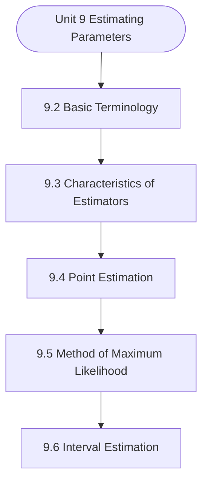

# MCS-066: Mathematical Foundations - II
## Unit 9: Estimating Parameters

> 📚 **Programme:** M.Sc. (Data Science and Analytics) | **Semester:** Semester 2  
> ⏱️ **Estimated Study Time:** ~70 mins | 📄 **Textbook Pages:** 32 Pages  
> 📥 **Original PDF:** [Download & View Authentic Textbook](../../../pdfs/Semester_2/MCS-066_Mathematical_Foundations_-_II/Unit-9_Estimating_Parameters.pdf)

---

### 🎯 Executive Concept & Data Science Relevance
In modern data systems, **Estimating Parameters** forms a vital conceptual pillar. Statistical inference bridges sample data to population reality. In A/B testing, feature significance testing, and model benchmarking, hypothesis tests determine whether performance gains are statistically significant or merely random fluctuations.

> [!NOTE]
> **Why this matters for your career:** Mastering estimating parameters equips you with the foundational principles required to reason mathematically about high-dimensional datasets, evaluate algorithm performance, and avoid statistical pitfalls in production machine learning pipelines.

### 🗺️ Visual Knowledge Architecture
The following concept map illustrates the structural hierarchy and learning trajectory of this module:



### 📖 Core Definitions & Terminology Cards

> 📌 **Central Limit Theorem (CLT)**  
> - **Formal Definition:** For any population with mean $\mu$ and finite variance $\sigma^2$, the sampling distribution of sample mean $\bar{X}$ approaches a Normal distribution $\mathcal{N}(\mu, \sigma^2/n)$ as sample size $n \to \infty$, regardless of population shape.  
> - 💡 **Practical Intuition & Analogy:** *Averages of independent random variables always look Gaussian in large samples ( $n \ge 30$ ).*

> 📌 **Standard Error (SE)**  
> - **Formal Definition:** The standard deviation of the sampling distribution of a statistic: $\text{SE}(\bar{X}) = \frac{\sigma}{\sqrt{n}}$ (or $\frac{s}{\sqrt{n}}$ when $\sigma$ is unknown).  
> - 💡 **Practical Intuition & Analogy:** *Uncertainty of your sample estimate: larger sample sizes dramatically reduce estimation error.*

> 📌 **Null ($H_0$) and Alternative ($H_1$) Hypotheses**  
> - **Formal Definition:** $H_0$ represents the baseline status quo of no effect or no difference. $H_1$ represents the research claim of a true non-zero effect.  
> - 💡 **Practical Intuition & Analogy:** *In a courtroom: $H_0$ is presumed innocent; $H_1$ is guilty upon convincing evidence.*

> 📌 **Type I Error ( $\alpha$ ) and Type II Error ( $\beta$ )**  
> - **Formal Definition:** Type I error is rejecting true $H_0$ (false positive, rate $\alpha$). Type II error is failing to reject false $H_0$ (false negative, rate $\beta$). Statistical power is $1 - \beta$.  
> - 💡 **Practical Intuition & Analogy:** *Type I: Innocent person convicted. Type II: Guilty person acquitted.*

### ⚡ Governing Mathematical Laws & Formula Cheatsheet
#### 🔹 Confidence Interval for Population Mean
$$
\bar{x} \pm z_{\alpha/2} \left(\frac{\sigma}{\sqrt{n}}\right) \quad \text{or} \quad \bar{x} \pm t_{\alpha/2, n-1} \left(\frac{s}{\sqrt{n}}\right)
$$
- **Explanation:** Interval providing $1-\alpha$ confidence of containing true population parameter $\mu$.

#### 🔹 One-Sample Z-Test Statistic
$$
Z = \frac{\bar{x} - \mu_0}{\sigma / \sqrt{n}} \sim \mathcal{N}(0, 1)
$$
- **Explanation:** Used when population standard deviation $\sigma$ is known and sample size is large.

#### 🔹 One-Sample Student's t-Test Statistic
$$
t = \frac{\bar{x} - \mu_0}{s / \sqrt{n}} \sim t_{n-1}
$$
- **Explanation:** Used when population $\sigma$ is unknown and estimated using sample standard deviation $s$.

#### 🔹 Chi-Square Test of Independence Statistic
$$
\chi^2 = \sum_{i=1}^r \sum_{j=1}^c \frac{(O_{ij} - E_{ij})^2}{E_{ij}} \quad \text{where } E_{ij} = \frac{R_i \times C_j}{N}
$$
- **Explanation:** Tests whether two categorical attributes are statistically independent, with degrees of freedom $(r-1)(c-1)$.

#### 🔹 One-Way ANOVA F-Ratio Statistic
$$
F = \frac{\text{MS}_{\text{between}}}{\text{MS}_{\text{within}}} = \frac{\text{SSB} / (k - 1)}{\text{SSW} / (N - k)}
$$
- **Explanation:** Compares variance between $k$ group means against variance within groups to test equality of multiple population means.

### ⚖️ Axiomatic Properties & Governing Laws
The mathematical formulations of this module are anchored by foundational algebraic and structural laws:

- **Decision Rule:** $p\text{-value} < \alpha \implies \text{Reject } H_0$
- **Degrees of Freedom (t-Test):** $df = n - 1$
- **Degrees of Freedom (Chi-Square):** $df = (r - 1)(c - 1)$

### 📌 Comprehensive Section-by-Section Study Breakdown
#### `9.2` Basic Terminology
##### 📘 Theoretical Principles & In-Depth Exposition
The section on **Basic Terminology** establishes rigorous theoretical foundations necessary for advanced computational modeling. It introduces formal mathematical structures and symbolic notations that guarantee consistency across proofs and algorithms.

In the broader scope of **Estimating Parameters**, understanding basic terminology is essential to formalizing data representations, verifying boundary constraints, and ensuring computational determinism across multidimensional feature spaces.

##### ⚙️ Mathematical & Algorithmic Mechanics
- **Formal Mechanics:** Establishes symbolic transformations and state invariants governing basic terminology.
- **Boundary Invariants:** Ensures robust error-handling, non-empty set guarantees, and strict asymptotic bounds.

##### 📊 Practical Data Science & Production Relevance
- **Industry Application:** Directly implemented in production workflows such as SQL query filters, pandas vectorized operations, and feature transformation pipelines.
- **Production Pitfall:** Failing to verify membership bounds or missing edge cases in basic terminology can cause silent data corruption or performance bottlenecks.

> [!TIP]
> **Key Exam & Technical Interview Takeaway:** Be prepared to define basic terminology formally, cite its core mathematical invariants, and solve step-by-step numerical/proof questions.

#### `9.3` Characteristics of Estimators
##### 📘 Theoretical Principles & In-Depth Exposition
It is to be noted that a large number of estimators can be proposed for an unknown parameter. For example, if we want to estimate the average income of the persons living in a city then the sample mean, sample median, sample mode, etc. can be used to estimate the average income. Now, the question arises, “Are some of the possible estimators better, in some sense, than the others?” Generally, an estimator can be called good for two different situations: (i) When the true value of the parameter is being estimated is known− An estimator might be called good if its value is close to the true value of the parameter to be estimated.

In other words, the estimator whose sampling distribution concentrates as closely as possible near the true value of the parameter may be regarded as the good estimator. (ii) When the true value of the parameter is unknown− An estimator may be called good if the data give good reason to believe that the estimate will be close to the true value.

In the whole estimation, we estimate the parameter when the true value of the parameter is unknown. Hence, we must choose estimates not because they are certainly close to the true value, but because there is a good reason to believe that the estimated value will be close to the true value of the parameter.

##### ⚙️ Mathematical & Algorithmic Mechanics
- **Formal Mechanics:** Establishes symbolic transformations and state invariants governing characteristics of estimators.
- **Boundary Invariants:** Ensures robust error-handling, non-empty set guarantees, and strict asymptotic bounds.

##### 📊 Practical Data Science & Production Relevance
- **Industry Application:** Directly implemented in production workflows such as SQL query filters, pandas vectorized operations, and feature transformation pipelines.
- **Production Pitfall:** Failing to verify membership bounds or missing edge cases in characteristics of estimators can cause silent data corruption or performance bottlenecks.

> [!TIP]
> **Key Exam & Technical Interview Takeaway:** Be prepared to define characteristics of estimators formally, cite its core mathematical invariants, and solve step-by-step numerical/proof questions.

#### `9.4` Point Estimation
##### 📘 Theoretical Principles & In-Depth Exposition
There are so many situations in our day to day life where we need to estimate some unknown parameter(s) of the population on the basis of the sample observations. For example, a housewife may want to estimate the monthly expenditure, a sweet shopkeeper may want to estimate the sales of sweets on a day, a student may want to estimate the study hours for the reading of a particular unit of this course, etc.

This need is fulfilled by the technique of estimation. So the technique of finding an estimator to produce an estimate of the unknown parameter is called estimation. Estimation is broadly divided into two categories namely: • Point estimation and • Interval estimation If we find a single value with the help of sample observations which is taken as the estimated value of unknown parameter then this value is known as a point estimate and the technique of estimating the unknown parameter with a single value is known as “point estimation”.

If instead of finding a single value to estimate the unknown parameter if we find two values between which the parameter may be considered to lie with a certain probability(confidence) is known as interval estimate of the parameter and this technique of estimating is known as “interval estimation”.

##### ⚙️ Mathematical & Algorithmic Mechanics
- **Formal Mechanics:** Establishes symbolic transformations and state invariants governing point estimation.
- **Boundary Invariants:** Ensures robust error-handling, non-empty set guarantees, and strict asymptotic bounds.

##### 📊 Practical Data Science & Production Relevance
- **Industry Application:** Directly implemented in production workflows such as SQL query filters, pandas vectorized operations, and feature transformation pipelines.
- **Production Pitfall:** Failing to verify membership bounds or missing edge cases in point estimation can cause silent data corruption or performance bottlenecks.

> [!TIP]
> **Key Exam & Technical Interview Takeaway:** Be prepared to define point estimation formally, cite its core mathematical invariants, and solve step-by-step numerical/proof questions.

#### `9.5` Method of Maximum Likelihood
##### 📘 Theoretical Principles & In-Depth Exposition
For describing the method of maximum likelihood, first, we have to define likelihood function. Likelihood Function If n X ,X , ..., X is a random sample of size n taken from a population with joint probability density (mass) function ( ) n f x ,x ,...,x , of sample values then likelihood function is denoted by L(θ) and is defined as follows: ( ) ( ) n L f x ,x ,...,x , =  Parameter Estimation and Hypothesis Testing For discrete case, ( )      n n L P X x P X x ...P X x = = = = For continuous case, ( ) ( ) ( ) ( ) n L f x , .f x , ...

f x , =    From the theoretical point of view, one of the most important methods of point estimation is method of maximum likelihood because it generally gives very good estimators as judged from various criteria. It was initially given by Prof. Gauss but later on, it was used as a general method of estimation by Prof.

The principle of maximum likelihood estimation is to find /estimate /choose the value of the unknown parameter which would most likely generate the observed data. We know that the likelihood function gives the relative likelihoods for different values of the parameters for the observed data.

##### ⚙️ Mathematical & Algorithmic Mechanics
- **Formal Mechanics:** Establishes symbolic transformations and state invariants governing method of maximum likelihood.
- **Boundary Invariants:** Ensures robust error-handling, non-empty set guarantees, and strict asymptotic bounds.

##### 📊 Practical Data Science & Production Relevance
- **Industry Application:** Directly implemented in production workflows such as SQL query filters, pandas vectorized operations, and feature transformation pipelines.
- **Production Pitfall:** Failing to verify membership bounds or missing edge cases in method of maximum likelihood can cause silent data corruption or performance bottlenecks.

> [!TIP]
> **Key Exam & Technical Interview Takeaway:** Be prepared to define method of maximum likelihood formally, cite its core mathematical invariants, and solve step-by-step numerical/proof questions.

#### `9.6` Interval Estimation
##### 📘 Theoretical Principles & In-Depth Exposition
When we find two values with the help of sample observations and constitute an interval such that it contains the true value of the parameter with a certain probability, then it is known as an interval estimate of the parameter. This technique of estimation is known as “Interval Estimation”.

In this section, we will define: • Confidence Interval and Confidence Coefficient • One-sided Confidence Intervals in the following two sub-sections. Confidence Interval and Confidence Coefficient Let n X ,X , ...,X be a random sample of size n taken from a population whose probability density (mass) function is f(x, ).

Let T1 = t1( n X ,X , ...,X ) and T2 = t2( n X ,X , ...,X ) ( ) T T where  be two statistics such that the probability that the random interval [T1, T2] includes the true value of population parameter  is (1− α), that is,   P T T  = − as shown in the Fig.9.1, where,  does not depend on .

##### ⚙️ Mathematical & Algorithmic Mechanics
- **Formal Mechanics:** Establishes symbolic transformations and state invariants governing interval estimation.
- **Boundary Invariants:** Ensures robust error-handling, non-empty set guarantees, and strict asymptotic bounds.

##### 📊 Practical Data Science & Production Relevance
- **Industry Application:** Directly implemented in production workflows such as SQL query filters, pandas vectorized operations, and feature transformation pipelines.
- **Production Pitfall:** Failing to verify membership bounds or missing edge cases in interval estimation can cause silent data corruption or performance bottlenecks.

> [!TIP]
> **Key Exam & Technical Interview Takeaway:** Be prepared to define interval estimation formally, cite its core mathematical invariants, and solve step-by-step numerical/proof questions.

#### `9.7` Confidence Interval for Population Mean
##### 📘 Theoretical Principles & In-Depth Exposition
MEAN There are so many problems in real life where it becomes necessary to obtain the confidence interval of the population mean. For example, an investigator may interest to find the interval estimate of the average income of the people living in a particular geographical area, a product manager may want to find the interval estimate of the average life of electric bulbs manufactured by a company, a pathologist may want to obtain the interval estimate of the mean time required to complete a certain analysis, etc.

For describing confidence interval for population mean, let n X ,X , ...,X be a random sample of size n taken from a normal population having mean  and variance σ2. We can determine confidence interval for population mean  under the following two cases: 1. When population variance σ2 is known Estimation Parameters 2.

When population variance σ2 is unknown. These two cases for one population are discussed in Sections 9.7.1 and 9.7.2, and for two populations in Sections 9.7.3 and 9.7.4.

##### ⚙️ Mathematical & Algorithmic Mechanics
- **Formal Mechanics:** Establishes symbolic transformations and state invariants governing confidence interval for population mean.
- **Boundary Invariants:** Ensures robust error-handling, non-empty set guarantees, and strict asymptotic bounds.

##### 📊 Practical Data Science & Production Relevance
- **Industry Application:** Directly implemented in production workflows such as SQL query filters, pandas vectorized operations, and feature transformation pipelines.
- **Production Pitfall:** Failing to verify membership bounds or missing edge cases in confidence interval for population mean can cause silent data corruption or performance bottlenecks.

> [!TIP]
> **Key Exam & Technical Interview Takeaway:** Be prepared to define confidence interval for population mean formally, cite its core mathematical invariants, and solve step-by-step numerical/proof questions.

### 📐 Step-by-Step Solved Mathematical Examples
To solidify your theoretical understanding, work through these fully solved, step-by-step mathematical problems:

#### 🧮 Example 1: One-Sample t-Test for Page Latency Benchmark
> **Problem Statement:**  
> An engineering team claims server latency is at most $\mu_0 = 200\text{ms}$. A sample of $n = 25$ runs yields sample mean $\bar{x} = 210\text{ms}$ and sample standard deviation $s = 20\text{ms}$. Test the claim at significance level $\alpha = 0.05$.

**Detailed Step-by-Step Solution:**

1. **Hypotheses:** $H_0: \mu \le 200\text{ms}$ vs $H_1: \mu > 200\text{ms}$ (One-tailed test).

2. **Standard Error:**
$$
\text{SE} = \frac{s}{\sqrt{n}} = \frac{20}{\sqrt{25}} = \frac{20}{5} = 4\text{ms}
$$

3. **Test Statistic:**
$$
t = \frac{\bar{x} - \mu_0}{\text{SE}} = \frac{210 - 200}{4} = 2.50
$$

4. **Critical Value ($df = 24, \alpha = 0.05$):** $t_{\text{crit}} = 1.711$.

5. **Conclusion:** Since $t = 2.50 > 1.711$, we **Reject $H_0$**. The latency is statistically significantly higher than 200ms.

#### 🧮 Example 2: 95% Confidence Interval Calculation
> **Problem Statement:**  
> Given sample size $n = 64$, sample mean $\bar{x} = 52.0$, and known $\sigma = 8.0$. Calculate the 95% Confidence Interval for population mean $\mu$.

**Detailed Step-by-Step Solution:**

For 95% confidence, $z_{0.025} = 1.96$:
$$
\text{Margin of Error} = z \frac{\sigma}{\sqrt{n}} = 1.96 \left(\frac{8}{\sqrt{64}}\right) = 1.96(1.0) = 1.96
$$
$$
\text{CI} = 52.0 \pm 1.96 = [50.04, 53.96]
$$

### 💻 Practical Data Science Implementation (Python)
Theory translates directly into production algorithms. Below is a self-contained, commented Python implementation illustrating the core operations of this unit:

```python
from scipy import stats
import numpy as np

# A/B Testing: Two-Sample t-Test
group_a = np.array([12.1, 14.5, 13.2, 12.8, 15.0, 13.9, 14.2]) # Control
group_b = np.array([15.2, 16.1, 14.8, 15.9, 17.0, 16.4, 15.8]) # Treatment

t_stat, p_val = stats.ttest_ind(group_a, group_b)

print(f"Group A Mean: {np.mean(group_a):.2f}")
print(f"Group B Mean: {np.mean(group_b):.2f}")
print(f"t-statistic: {t_stat:.4f} | p-value: {p_val:.5f}")

if p_val < 0.05:
    print("Result: Statistically significant uplift detected (Reject H0)!")
else:
    print("Result: Insufficient evidence to reject H0.")
```

### 💡 Interactive Self-Assessment Checkpoints
Test your comprehension before proceeding. Tap each question to reveal the comprehensive explanation:

<details>
<summary><b>Checkpoint 1:</b> What is the Central Limit Theorem and why is it crucial in Data Science? <i>(Tap to reveal answer)</i></summary>

> **Answer & Analysis:**  
> The CLT states that the sample mean $\bar{X}$ becomes approximately normally distributed with mean $\mu$ and variance $\sigma^2/n$ for large $n$, allowing parametric statistical inference even on skewed non-normal real-world data.
</details>

<details>
<summary><b>Checkpoint 2:</b> What is a p-value? <i>(Tap to reveal answer)</i></summary>

> **Answer & Analysis:**  
> The probability of obtaining a test statistic as extreme as, or more extreme than, the observed value, assuming the null hypothesis $H_0$ is strictly true. If $p < \alpha$, reject $H_0$.
</details>

<details>
<summary><b>Checkpoint 3:</b> Define Type I error and Type II error. <i>(Tap to reveal answer)</i></summary>

> **Answer & Analysis:**  
> Type I error ( $\alpha$ ): Rejecting $H_0$ when $H_0$ is actually true (False Positive).
> Type II error ( $\beta$ ): Failing to reject $H_0$ when $H_0$ is actually false (False Negative).
</details>

<details>
<summary><b>Checkpoint 4:</b> Write the four properties of a good estimator. <i>(Tap to reveal answer)</i></summary>

> **Answer & Analysis:**  
> This question tests your conceptual mastery of Estimating Parameters. Review the governing formulas and section breakdowns above to formulate a complete, rigorous proof or derivation.
</details>

<details>
<summary><b>Checkpoint 5:</b> Find which technique of estimation (point estimation or interval estimation) is used in each case given below: (i) An investigator estimates average income Rs. <i>(Tap to reveal answer)</i></summary>

> **Answer & Analysis:**  
> This question tests your conceptual mastery of Estimating Parameters. Review the governing formulas and section breakdowns above to formulate a complete, rigorous proof or derivation.
</details>

<details>
<summary><b>Checkpoint 6:</b> 5 lakh per annum of the people living in a particular geographical area, on the basis of a sample of <i>(Tap to reveal answer)</i></summary>

> **Answer & Analysis:**  
> This question tests your conceptual mastery of Estimating Parameters. Review the governing formulas and section breakdowns above to formulate a complete, rigorous proof or derivation.
</details>

### 🎯 Executive Module Wrap-Up
- **Central Idea:** Estimating Parameters provides essential mathematical and algorithmic tools directly utilized in Data Science.
- **Mathematical Rigor:** Formulas and laws must be memorized with attention to boundary conditions and assumptions.
- **Full Textbook Coverage:** For exhaustive multi-page derivations, proofs, and supplementary exercises, consult the [Authentic IGNOU Textbook](../../../pdfs/Semester_2/MCS-066_Mathematical_Foundations_-_II/Unit-9_Estimating_Parameters.pdf).

---
### 🧭 Navigation & Syllabus Index
[⬅ Previous: Unit 8](unit_08_Sampling_Distribution.md) | [📑 Course Index](README.md) | [Next: Unit 10 ➡](unit_10_Hypothesis_Testing.md)
