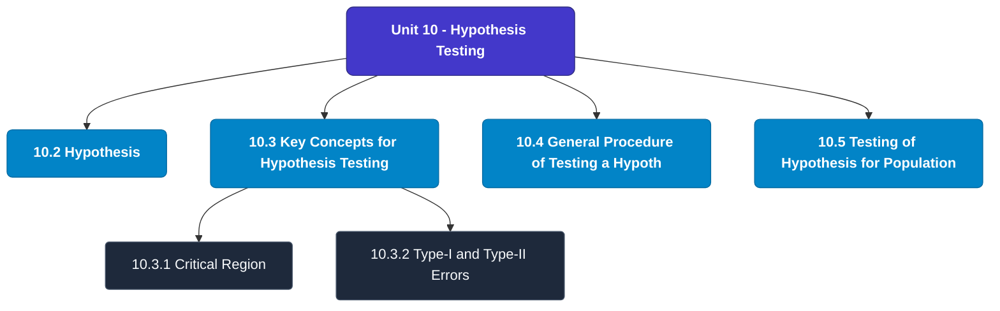

# MCS-066: Mathematical Foundations - II
## Unit 10: Hypothesis Testing

> 📚 **Programme:** M.Sc. (Data Science and Analytics) | **Semester:** Semester 2  
> ⏱️ **Estimated Study Time:** ~88 mins | 📄 **Textbook Pages:** 36 Pages  
> 📥 **Original PDF:** [Download & View Textbook](../../../pdfs/Semester_2/MCS-066_Mathematical_Foundations_-_II/Unit-10_Hypothesis_Testing.pdf)

---

### 🎯 Executive Concept & Data Science Relevance
In modern data systems, **Hypothesis Testing** forms a vital conceptual pillar. Statistical inference bridges sample data to population reality. In A/B testing, feature significance testing, and model benchmarking, hypothesis tests determine whether performance gains are statistically significant or merely random fluctuations.

> [!NOTE]
> **Why this matters for your career:** Mastering hypothesis testing equips you with the foundational principles required to reason mathematically about high-dimensional datasets, evaluate algorithm performance, and avoid statistical pitfalls in production machine learning pipelines.

### 🗺️ Visual Knowledge Architecture
The following concept map illustrates the structural hierarchy and learning trajectory of this module:

### 📖 Core Definitions & Terminology Cards
| Term | Formal Mathematical / Technical Definition | Intuitive Analogy / Concrete Example |
| :--- | :--- | :--- |
| **Central Limit Theorem (CLT)** | For any population with mean $\mu$ and finite variance $\sigma^2$, the sampling distribution of sample mean $\bar{X}$ approaches a Normal distribution $\mathcal{N}(\mu, \sigma^2/n)$ as sample size $n \to \infty$, regardless of population shape. | *Averages of independent random variables always look Gaussian in large samples ($n \ge 30$).* |
| **Standard Error (SE)** | The standard deviation of the sampling distribution of a statistic: $\text{SE}(\bar{X}) = \frac{\sigma}{\sqrt{n}}$ (or $\frac{s}{\sqrt{n}}$ when $\sigma$ is unknown). | *Uncertainty of your sample estimate: larger sample sizes dramatically reduce estimation error.* |
| **Null ($H_0$) and Alternative ($H_1$) Hypotheses** | $H_0$ represents the baseline status quo of no effect or no difference. $H_1$ represents the research claim of a true non-zero effect. | *In a courtroom: $H_0$ is presumed innocent; $H_1$ is guilty upon convincing evidence.* |
| **Type I Error ($\alpha$) and Type II Error ($\beta$)** | Type I error is rejecting true $H_0$ (false positive, rate $\alpha$). Type II error is failing to reject false $H_0$ (false negative, rate $\beta$). Statistical power is $1 - \beta$. | *Type I: Innocent person convicted. Type II: Guilty person acquitted.* |

### ⚡ Governing Mathematical Laws & Formula Cheatsheet
#### 🔹 Confidence Interval for Population Mean
$$\bar{x} \pm z_{\alpha/2} \left(\frac{\sigma}{\sqrt{n}}\right) \quad \text{or} \quad \bar{x} \pm t_{\alpha/2, n-1} \left(\frac{s}{\sqrt{n}}\right)$$
- **Explanation:** Interval providing $1-\alpha$ confidence of containing true population parameter $\mu$.

#### 🔹 One-Sample Z-Test Statistic
$$Z = \frac{\bar{x} - \mu_0}{\sigma / \sqrt{n}} \sim \mathcal{N}(0, 1)$$
- **Explanation:** Used when population standard deviation $\sigma$ is known and sample size is large.

#### 🔹 One-Sample Student's t-Test Statistic
$$t = \frac{\bar{x} - \mu_0}{s / \sqrt{n}} \sim t_{n-1}$$
- **Explanation:** Used when population $\sigma$ is unknown and estimated using sample standard deviation $s$.

#### 🔹 Chi-Square Test of Independence Statistic
$$\chi^2 = \sum_{i=1}^r \sum_{j=1}^c \frac{(O_{ij} - E_{ij})^2}{E_{ij}} \quad \text{where } E_{ij} = \frac{R_i \times C_j}{N}$$
- **Explanation:** Tests whether two categorical attributes are statistically independent, with degrees of freedom $(r-1)(c-1)$.

#### 🔹 One-Way ANOVA F-Ratio Statistic
$$F = \frac{\text{MS}_{\text{between}}}{\text{MS}_{\text{within}}} = \frac{\text{SSB} / (k - 1)}{\text{SSW} / (N - k)}$$
- **Explanation:** Compares variance between $k$ group means against variance within groups to test equality of multiple population means.

### 📌 Detailed Section-by-Section Study Breakdown
#### `10.2` Hypothesis
- **Core Concept:** Establishes rigorous theoretical formulations and computational bounds for hypothesis.
- **Core Concept:** Applies standard algorithmic procedures and mathematical invariants relevant to hypothesis testing.
- **Core Concept:** Ensures deterministic performance guarantees across high-dimensional feature spaces.
- **Data Science Application:** Provides foundational structures used directly in statistical modeling, query execution, and machine learning pipelines.

> [!TIP]
> **Exam & Interview Tip:** Be prepared to state the formal definition of hypothesis and derive its primary equations step-by-step.

#### `10.3` Key Concepts for Hypothesis Testing
- **Core Concept:** After describing the hypothesis, let us discuss some basic concepts needed for hypothesis testing.
- **Core Concept:** Critical Region In order to test a hypothesis, the entire sample space is partitioned into two disjoint sub-spaces, say and S .
- **Core Concept:**  −=  If calculated value of the test statistic lies in , then we reject the null hypothesis and if it lies in , then we do not reject the null hypothesis.
- **Data Science Application:** Provides foundational structures used directly in statistical modeling, query execution, and machine learning pipelines.

> [!TIP]
> **Exam & Interview Tip:** Be prepared to state the formal definition of key concepts for hypothesis testing and derive its primary equations step-by-step.

#### `10.3.1` Critical Region
- **Core Concept:** In order to test a hypothesis, the entire sample space is partitioned into two disjoint sub-spaces, say and S .
- **Core Concept:**  −=  If calculated value of the test statistic lies in , then we reject the null hypothesis and if it lies in , then we do not reject the null hypothesis.
- **Core Concept:** The region is called a “rejection region or critical region” and the region is called a “non-rejection region”.
- **Data Science Application:** Provides foundational structures used directly in statistical modeling, query execution, and machine learning pipelines.

> [!TIP]
> **Exam & Interview Tip:** Be prepared to state the formal definition of critical region and derive its primary equations step-by-step.

#### `10.3.2` Type-I and Type-II Errors
- **Core Concept:** A test statistic is calculated on the basis of observed sample observations.
- **Core Concept:** But a sample is a small part of the population about which decision is to be taken.
- **Core Concept:** A random sample may or may not be a good representative of the population.
- **Data Science Application:** Provides foundational structures used directly in statistical modeling, query execution, and machine learning pipelines.

> [!TIP]
> **Exam & Interview Tip:** Be prepared to state the formal definition of type-i and type-ii errors and derive its primary equations step-by-step.

#### `10.3.3` Level of Significance
- **Core Concept:** So far in this unit, we have discussed the hypothesis, types of hypothesis, critical region and types of errors.
- **Core Concept:** In this section, we shall discuss a very useful concept “level of significance”, which plays an important role in decision making while testing a hypothesis.
- **Core Concept:** The probability of type-I error is known as level of significance of a test.
- **Data Science Application:** Provides foundational structures used directly in statistical modeling, query execution, and machine learning pipelines.

> [!TIP]
> **Exam & Interview Tip:** Be prepared to state the formal definition of level of significance and derive its primary equations step-by-step.

#### `10.3.4` One-Tailed and Two-Tailed Tests
- **Core Concept:** We have seen that rejection (critical) region lies at one-tail or two-tails on the probability curve of sampling distribution of the test statistic, depending on the form of alternative hypothesis.
- **Core Concept:** Similarly, the test of testing the null hypothesis also depends on the alternative hypothesis.
- **Core Concept:** If the null and alternative hypotheses are 0 0 1 0 H : and H :   then the test for testing the null hypothesis is right-tailed because the alternative hypothesis is right-tailed.
- **Data Science Application:** Provides foundational structures used directly in statistical modeling, query execution, and machine learning pipelines.

> [!TIP]
> **Exam & Interview Tip:** Be prepared to state the formal definition of one-tailed and two-tailed tests and derive its primary equations step-by-step.

### 💡 Interactive Self-Assessment Checkpoints
Test your comprehension before proceeding. Tap each question to reveal the comprehensive explanation:

<b>Checkpoint 1:</b> What is the Central Limit Theorem and why is it crucial in Data Science? <i>(Tap to reveal answer)</i>

> **Answer & Analysis:**  
> The CLT states that the sample mean $\bar{X}$ becomes approximately normally distributed with mean $\mu$ and variance $\sigma^2/n$ for large $n$, allowing parametric statistical inference even on skewed non-normal real-world data.

<b>Checkpoint 2:</b> What is a p-value? <i>(Tap to reveal answer)</i>

> **Answer & Analysis:**  
> The probability of obtaining a test statistic as extreme as, or more extreme than, the observed value, assuming the null hypothesis $H_0$ is strictly true. If $p < \alpha$, reject $H_0$.

<b>Checkpoint 3:</b> Define Type I error and Type II error. <i>(Tap to reveal answer)</i>

> **Answer & Analysis:**  
> Type I error ($\\alpha$): Rejecting $H_0$ when $H_0$ is actually true (False Positive).
Type II error ($\\beta$): Failing to reject $H_0$ when $H_0$ is actually false (False Negative).

<b>Checkpoint 4:</b> A company manufactures car tyres. The company claims that the average life of its tyres is <i>(Tap to reveal answer)</i>

> **Answer & Analysis:**  
> This question tests your conceptual mastery of Hypothesis Testing. Review the governing formulas and section breakdowns above to formulate a complete, rigorous proof or derivation.

<b>Checkpoint 5:</b> Write the null and alternative hypotheses in cases (iii), (iv) and (v) of example given in Section <i>(Tap to reveal answer)</i>

> **Answer & Analysis:**  
> This question tests your conceptual mastery of Hypothesis Testing. Review the governing formulas and section breakdowns above to formulate a complete, rigorous proof or derivation.

<b>Checkpoint 6:</b> If H0: θ = 60 and H1: θ ≠ 60 then critical region lies in one-tail or two-tails. <i>(Tap to reveal answer)</i>

> **Answer & Analysis:**  
> This question tests your conceptual mastery of Hypothesis Testing. Review the governing formulas and section breakdowns above to formulate a complete, rigorous proof or derivation.

### 🎯 Executive Module Wrap-Up
- **Central Idea:** Hypothesis Testing provides essential mathematical and algorithmic tools directly utilized in Data Science.
- **Mathematical Rigor:** Formulas and laws must be memorized with attention to boundary conditions and assumptions.
- **Full Textbook Coverage:** For exhaustive multi-page derivations, proofs, and supplementary exercises, consult the [Authentic IGNOU Textbook](../../../pdfs/Semester_2/MCS-066_Mathematical_Foundations_-_II/Unit-10_Hypothesis_Testing.pdf).

---
### 🧭 Navigation & Syllabus Index
[⬅ Previous: Unit 9](unit_09_Estimating_Parameters.md) | [📑 Course Index](README.md) | [Next: Unit 11 ➡](unit_11_Analysis_of_Variance.md)
