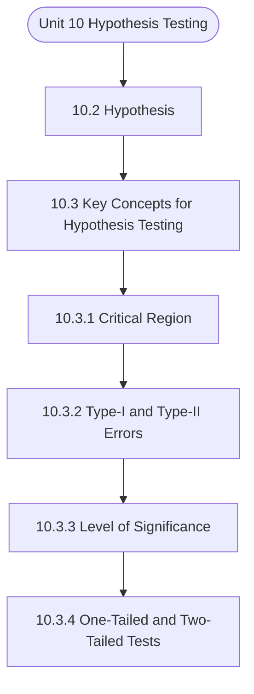

# MCS-066: Mathematical Foundations - II
## Unit 10: Hypothesis Testing

> 📚 **Programme:** M.Sc. (Data Science and Analytics) | **Semester:** Semester 2  
> ⏱️ **Estimated Study Time:** ~88 mins | 📄 **Textbook Pages:** 36 Pages  
> 📥 **Original PDF:** [Download & View Authentic Textbook](../../../pdfs/Semester_2/MCS-066_Mathematical_Foundations_-_II/Unit-10_Hypothesis_Testing.pdf)

---

### 🎯 Executive Concept & Data Science Relevance
In modern data systems and advanced analytics, **Hypothesis Testing** forms a vital conceptual pillar. Statistical inference bridges sample data to population reality. In A/B testing, feature significance testing, and model benchmarking, hypothesis tests determine whether performance gains are statistically significant or merely random fluctuations.

> [!NOTE]
> **Why this matters for your career:** Mastering hypothesis testing equips you with the foundational principles required to reason mathematically about high-dimensional datasets, evaluate algorithm performance, and avoid statistical pitfalls in production machine learning pipelines.

### 🗺️ Visual Knowledge Architecture
The following concept map illustrates the structural hierarchy and learning trajectory of this module:



### 📖 Core Definitions & Terminology Cards

> 📌 **Central Limit Theorem (CLT)**  
> - **Formal Definition:** For any population with mean $\mu$ and finite variance $\sigma^2$, the sampling distribution of sample mean $\bar{X}$ approaches a Normal distribution $\mathcal{N}(\mu, \sigma^2/n)$ as sample size $n \to \infty$, regardless of population shape.  
> - 💡 **Practical Intuition & Analogy:** *Averages of independent random variables always look Gaussian in large samples ( $n \ge 30$ ).*

> 📌 **Standard Error (SE)**  
> - **Formal Definition:** The standard deviation of the sampling distribution of a statistic: $\text{SE}(\bar{X}) = \frac{\sigma}{\sqrt{n}}$ (or $\frac{s}{\sqrt{n}}$ when $\sigma$ is unknown).  
> - 💡 **Practical Intuition & Analogy:** *Uncertainty of your sample estimate: larger sample sizes dramatically reduce estimation error.*

> 📌 **Null ($H_0$) and Alternative ($H_1$) Hypotheses**  
> - **Formal Definition:** $H_0$ represents the baseline status quo of no effect or no difference. $H_1$ represents the research claim of a true non-zero effect.  
> - 💡 **Practical Intuition & Analogy:** *In a courtroom: $H_0$ is presumed innocent; $H_1$ is guilty upon convincing evidence.*

> 📌 **Type I Error ( $\alpha$ ) and Type II Error ( $\beta$ )**  
> - **Formal Definition:** Type I error is rejecting true $H_0$ (false positive, rate $\alpha$). Type II error is failing to reject false $H_0$ (false negative, rate $\beta$). Statistical power is $1 - \beta$.  
> - 💡 **Practical Intuition & Analogy:** *Type I: Innocent person convicted. Type II: Guilty person acquitted.*

### ⚡ Governing Mathematical Laws & Formula Cheatsheet
#### 🔹 Confidence Interval for Population Mean
$$
\bar{x} \pm z_{\alpha/2} \left(\frac{\sigma}{\sqrt{n}}\right) \quad \text{or} \quad \bar{x} \pm t_{\alpha/2, n-1} \left(\frac{s}{\sqrt{n}}\right)
$$
- **Explanation:** Interval providing $1-\alpha$ confidence of containing true population parameter $\mu$.

#### 🔹 One-Sample Z-Test Statistic
$$
Z = \frac{\bar{x} - \mu_0}{\sigma / \sqrt{n}} \sim \mathcal{N}(0, 1)
$$
- **Explanation:** Used when population standard deviation $\sigma$ is known and sample size is large.

#### 🔹 One-Sample Student's t-Test Statistic
$$
t = \frac{\bar{x} - \mu_0}{s / \sqrt{n}} \sim t_{n-1}
$$
- **Explanation:** Used when population $\sigma$ is unknown and estimated using sample standard deviation $s$.

#### 🔹 Chi-Square Test of Independence Statistic
$$
\chi^2 = \sum_{i=1}^r \sum_{j=1}^c \frac{(O_{ij} - E_{ij})^2}{E_{ij}} \quad \text{where } E_{ij} = \frac{R_i \times C_j}{N}
$$
- **Explanation:** Tests whether two categorical attributes are statistically independent, with degrees of freedom $(r-1)(c-1)$.

#### 🔹 One-Way ANOVA F-Ratio Statistic
$$
F = \frac{\text{MS}_{\text{between}}}{\text{MS}_{\text{within}}} = \frac{\text{SSB} / (k - 1)}{\text{SSW} / (N - k)}
$$
- **Explanation:** Compares variance between $k$ group means against variance within groups to test equality of multiple population means.

### ⚖️ Axiomatic Properties & Governing Laws
The mathematical formulations of this module are anchored by foundational algebraic and structural laws:

- **Decision Rule:** $p\text{-value} < \alpha \implies \text{Reject } H_0$
- **Degrees of Freedom (t-Test):** $df = n - 1$
- **Degrees of Freedom (Chi-Square):** $df = (r - 1)(c - 1)$

### 📌 Comprehensive Section-by-Section Study Breakdown
#### `10.2` Hypothesis

##### 📘 Theoretical Principles & Pedagogical Exposition
the claim has been identified then we write it in symbolical form if possible. As in the above examples, (i) Customer of the motorcycle may write the claim or postulate the hypothesis “the motorcycle of the certain brand gives the average mileage 60 km/liter.” Here, the concern is the average mileage of the motorcycle so let µ represents the average mileage then our hypothesis becomes µ = 60 km/ liter.

(ii) Similarly, the businessman of banana may write the statement or postulate the hypothesis “the average weight of a banana of Kerala is greater than 200 gm.” So our hypothesis becomes µ > 200 gm. (iii) The doctor may write the claim or postulate the hypothesis “ the new medicine is more effective for controlling high blood pressure than old medicine.” Here, we are concerned with the average effect of the medicines so let µ1 and µ2 represent the average effect of new and old medicines respectively on controlling blood pressure, then our hypothesis becomes µ1 > µ2.

(iv) The economist may write the statement or postulate the hypothesis “ the variability in incomes differ in two populations.” Here, our concern is the variability in income so let and   represent the variability in incomes in two populations respectively then our hypothesis becomes .


##### ⚙️ Mathematical & Algorithmic Mechanics
- **Core Mechanism:** Statistical inference evaluates sample statistics to draw population conclusions. Hypothesis testing contrasts Null $H_0$ against Alternative $H_1$. The $p$-value represents probability of obtaining test results at least as extreme under $H_0$; reject $H_0$ if $p < \alpha$.
- **Boundary Conditions:** Type I error (false positive $\alpha$) vs Type II error (false negative $\beta$), statistical power $1 - \beta$, unequal sample variances in Student's $t$-test, and small cell counts in Chi-Square tests.

##### 📊 Practical Data Science & Production Relevance
- **Production Workflow:** Online experimentation and conversion lift validation (A/B testing), automated model drift monitoring, feature significance selection, and clinical trial efficacy tests.
- **Real-World Pitfall:** $p$-hacking, failing to apply multiple testing corrections (e.g. Bonferroni / FDR) across multiple comparisons, and confusing statistical significance with practical impact.

> [!TIP]
> **Exam & Technical Interview Insight:** State $H_0$ and $H_1$ explicitly; identify the correct test statistic ($Z$, $t$, $F$, or $\chi^2$); determine degrees of freedom and state the clear rejection conclusion.

#### `10.3` Key Concepts for Hypothesis Testing

##### 📘 Theoretical Principles & Pedagogical Exposition
After describing the hypothesis, let us discuss some basic concepts needed for hypothesis testing.


##### ⚙️ Mathematical & Algorithmic Mechanics
- **Core Mechanism:** Statistical inference evaluates sample statistics to draw population conclusions. Hypothesis testing contrasts Null $H_0$ against Alternative $H_1$. The $p$-value represents probability of obtaining test results at least as extreme under $H_0$; reject $H_0$ if $p < \alpha$.
- **Boundary Conditions:** Type I error (false positive $\alpha$) vs Type II error (false negative $\beta$), statistical power $1 - \beta$, unequal sample variances in Student's $t$-test, and small cell counts in Chi-Square tests.

##### 📊 Practical Data Science & Production Relevance
- **Production Workflow:** Online experimentation and conversion lift validation (A/B testing), automated model drift monitoring, feature significance selection, and clinical trial efficacy tests.
- **Real-World Pitfall:** $p$-hacking, failing to apply multiple testing corrections (e.g. Bonferroni / FDR) across multiple comparisons, and confusing statistical significance with practical impact.

> [!TIP]
> **Exam & Technical Interview Insight:** State $H_0$ and $H_1$ explicitly; identify the correct test statistic ($Z$, $t$, $F$, or $\chi^2$); determine degrees of freedom and state the clear rejection conclusion.

#### `10.3.1` Critical Region

##### 📘 Theoretical Principles & Pedagogical Exposition
In order to test a hypothesis, the entire sample space is partitioned into two disjoint sub-spaces, say and S .  −=  If calculated value of the test statistic lies in , then we reject the null hypothesis and if it lies in , then we do not reject the null hypothesis. The region is called a “rejection region or critical region” and the region is called a “non-rejection region”.

Therefore, we can say that “A region in the sample space in which if the calculated value of the test statistic lies, we reject the null hypothesis then it is called critical region or rejection region.” The rejection (critical) region lies in one-tail or two-tails on the probability curve of the sampling distribution of the test statistic its depends upon the alternative hypothesis.

Therefore, three cases arise: Case I: If the alternative hypothesis is right-sided such as H1: θ > θ0 or H1: θ1 > θ2 then the entire critical or rejection region of size α lies on the right tail of the probability curve of the sampling distribution of the test statistic as shown in Fig.


##### ⚙️ Mathematical & Algorithmic Mechanics
- **Core Mechanism:** Statistical inference evaluates sample statistics to draw population conclusions. Hypothesis testing contrasts Null $H_0$ against Alternative $H_1$. The $p$-value represents probability of obtaining test results at least as extreme under $H_0$; reject $H_0$ if $p < \alpha$.
- **Boundary Conditions:** Type I error (false positive $\alpha$) vs Type II error (false negative $\beta$), statistical power $1 - \beta$, unequal sample variances in Student's $t$-test, and small cell counts in Chi-Square tests.

##### 📊 Practical Data Science & Production Relevance
- **Production Workflow:** Online experimentation and conversion lift validation (A/B testing), automated model drift monitoring, feature significance selection, and clinical trial efficacy tests.
- **Real-World Pitfall:** $p$-hacking, failing to apply multiple testing corrections (e.g. Bonferroni / FDR) across multiple comparisons, and confusing statistical significance with practical impact.

> [!TIP]
> **Exam & Technical Interview Insight:** State $H_0$ and $H_1$ explicitly; identify the correct test statistic ($Z$, $t$, $F$, or $\chi^2$); determine degrees of freedom and state the clear rejection conclusion.

#### `10.3.2` Type-I and Type-II Errors

##### 📘 Theoretical Principles & Pedagogical Exposition
In the last sub-section, we have discussed a rule that if the value of test statistic falls in rejection (critical) region then we reject the null hypothesis and if it falls in the non-rejection region then we do not reject the null hypothesis. A test statistic is calculated on the basis of observed sample observations.

But a sample is a small part of the population about which decision is to be taken. A random sample may or may not be a good representative of the population. A faulty sample misleads the inference (or conclusion) relating to the null hypothesis. For example, an engineer infers that a packet of screws is sub- standard when actually it is not.

It is an error caused due to poor or inappropriate (faulty) sample. Similarly, a packet of screws may be inferred to be good when actually it is sub-standard. So we can commit two kinds of errors in testing a hypothesis which are summarised in Table 10.1 which is given below: Table 10.1: Type of Errors Decision H0 True H1 True Reject H0 Type-I Error Correct Decision Do not reject H0 Correct Decision Type-II Error Let us take a situation where a patient suffering from high fever reaches to a doctor.


##### ⚙️ Mathematical & Algorithmic Mechanics
- **Core Mechanism:** Statistical inference evaluates sample statistics to draw population conclusions. Hypothesis testing contrasts Null $H_0$ against Alternative $H_1$. The $p$-value represents probability of obtaining test results at least as extreme under $H_0$; reject $H_0$ if $p < \alpha$.
- **Boundary Conditions:** Type I error (false positive $\alpha$) vs Type II error (false negative $\beta$), statistical power $1 - \beta$, unequal sample variances in Student's $t$-test, and small cell counts in Chi-Square tests.

##### 📊 Practical Data Science & Production Relevance
- **Production Workflow:** Online experimentation and conversion lift validation (A/B testing), automated model drift monitoring, feature significance selection, and clinical trial efficacy tests.
- **Real-World Pitfall:** $p$-hacking, failing to apply multiple testing corrections (e.g. Bonferroni / FDR) across multiple comparisons, and confusing statistical significance with practical impact.

> [!TIP]
> **Exam & Technical Interview Insight:** State $H_0$ and $H_1$ explicitly; identify the correct test statistic ($Z$, $t$, $F$, or $\chi^2$); determine degrees of freedom and state the clear rejection conclusion.

#### `10.3.3` Level of Significance

##### 📘 Theoretical Principles & Pedagogical Exposition
In this section, we shall discuss a very useful concept “level of significance”, which plays an important role in decision making while testing a hypothesis. The probability of type-I error is known as level of significance of a test. It is also called the size of the test or size of the critical region, denoted by α.

Generally, it is pre-fixed as 5% or 1% level (α = 0.05 or 0.01). As we have discussed in Section 10.3 that if calculated value of the test statistic lies in rejection (critical) region, then we reject the null hypothesis and if it lies in non- rejection region, then we do not reject the null hypothesis.

Also, we note that when H0 is rejected then automatically the alternative hypothesis H1 is accepted. Now, one point of our discussion is how to decide critical value(s) or cut-off value(s) for a known test statistic. If distribution of test statistic could be expressed into some well-known distributions like Z, 2, t, F etc.


##### ⚙️ Mathematical & Algorithmic Mechanics
- **Core Mechanism:** Statistical inference evaluates sample statistics to draw population conclusions. Hypothesis testing contrasts Null $H_0$ against Alternative $H_1$. The $p$-value represents probability of obtaining test results at least as extreme under $H_0$; reject $H_0$ if $p < \alpha$.
- **Boundary Conditions:** Type I error (false positive $\alpha$) vs Type II error (false negative $\beta$), statistical power $1 - \beta$, unequal sample variances in Student's $t$-test, and small cell counts in Chi-Square tests.

##### 📊 Practical Data Science & Production Relevance
- **Production Workflow:** Online experimentation and conversion lift validation (A/B testing), automated model drift monitoring, feature significance selection, and clinical trial efficacy tests.
- **Real-World Pitfall:** $p$-hacking, failing to apply multiple testing corrections (e.g. Bonferroni / FDR) across multiple comparisons, and confusing statistical significance with practical impact.

> [!TIP]
> **Exam & Technical Interview Insight:** State $H_0$ and $H_1$ explicitly; identify the correct test statistic ($Z$, $t$, $F$, or $\chi^2$); determine degrees of freedom and state the clear rejection conclusion.

#### `10.3.4` One-Tailed and Two-Tailed Tests

##### 📘 Theoretical Principles & Pedagogical Exposition
We have seen that rejection (critical) region lies at one-tail or two-tails on the probability curve of sampling distribution of the test statistic, depending on the form of alternative hypothesis. Similarly, the test of testing the null hypothesis also depends on the alternative hypothesis.

A test of testing the null hypothesis is said to be a two-tailed test if the alternative hypothesis is two-tailed whereas if the alternative hypothesis is one-tailed then a test of testing the null hypothesis is said to be a one-tailed test. For example, if our null and alternative hypotheses are H : and H : =   Parameter Estimation and Hypothesis Testing then the test for testing the null hypothesis is two-tailed because the alternative hypothesis is two-tailed that means, the parameter θ can take value greater than θ0 or less than θ0.

If the null and alternative hypotheses are H : and H :   then the test for testing the null hypothesis is right-tailed because the alternative hypothesis is right-tailed. Similarly, if the null and alternative hypotheses are H : and H :   then the test for testing the null hypothesis is left-tailed because the alternative hypothesis is left-tailed.


##### ⚙️ Mathematical & Algorithmic Mechanics
- **Core Mechanism:** Statistical inference evaluates sample statistics to draw population conclusions. Hypothesis testing contrasts Null $H_0$ against Alternative $H_1$. The $p$-value represents probability of obtaining test results at least as extreme under $H_0$; reject $H_0$ if $p < \alpha$.
- **Boundary Conditions:** Type I error (false positive $\alpha$) vs Type II error (false negative $\beta$), statistical power $1 - \beta$, unequal sample variances in Student's $t$-test, and small cell counts in Chi-Square tests.

##### 📊 Practical Data Science & Production Relevance
- **Production Workflow:** Online experimentation and conversion lift validation (A/B testing), automated model drift monitoring, feature significance selection, and clinical trial efficacy tests.
- **Real-World Pitfall:** $p$-hacking, failing to apply multiple testing corrections (e.g. Bonferroni / FDR) across multiple comparisons, and confusing statistical significance with practical impact.

> [!TIP]
> **Exam & Technical Interview Insight:** State $H_0$ and $H_1$ explicitly; identify the correct test statistic ($Z$, $t$, $F$, or $\chi^2$); determine degrees of freedom and state the clear rejection conclusion.

#### `10.3.5` Concept of p-Value

##### 📘 Theoretical Principles & Pedagogical Exposition
Use of p-value is becoming more and more popular because of the following two reasons: • most of the statistical software provides p-value rather than the critical value. • p-value provides more information compared to critical value as far as rejection or does not rejection H . The first point listed above needs no explanation.

But the second point lies in the heart of p-value and needs to explain more clearly. Moving in this direction, we note that in scientific applications one is not only interested simply in rejecting or not rejecting the null hypothesis but he/she is also interested to assess how strong the data has the evidence to reject H0.

For example, for testing a hypothesis where we test the null hypothesis H0:  ≤ 50 gm against H1:  > 50 gm To test the null hypothesis, we calculated the value of the test statistic as 2.78 and the critical value (zα) at  = 0.01 was zα = 2.33. Since the calculated value of test statistic (= 2.78) is greater than the critical (tabulated) value (= 2.33), therefore, we reject the null hypothesis at 1% level of significance.


##### ⚙️ Mathematical & Algorithmic Mechanics
- **Core Mechanism:** Statistical inference evaluates sample statistics to draw population conclusions. Hypothesis testing contrasts Null $H_0$ against Alternative $H_1$. The $p$-value represents probability of obtaining test results at least as extreme under $H_0$; reject $H_0$ if $p < \alpha$.
- **Boundary Conditions:** Type I error (false positive $\alpha$) vs Type II error (false negative $\beta$), statistical power $1 - \beta$, unequal sample variances in Student's $t$-test, and small cell counts in Chi-Square tests.

##### 📊 Practical Data Science & Production Relevance
- **Production Workflow:** Online experimentation and conversion lift validation (A/B testing), automated model drift monitoring, feature significance selection, and clinical trial efficacy tests.
- **Real-World Pitfall:** $p$-hacking, failing to apply multiple testing corrections (e.g. Bonferroni / FDR) across multiple comparisons, and confusing statistical significance with practical impact.

> [!TIP]
> **Exam & Technical Interview Insight:** State $H_0$ and $H_1$ explicitly; identify the correct test statistic ($Z$, $t$, $F$, or $\chi^2$); determine degrees of freedom and state the clear rejection conclusion.

#### `10.4` General Procedure of Testing a Hypothesis

##### 📘 Theoretical Principles & Pedagogical Exposition
HYPOTHESIS Testing of hypothesis is a huge demanded statistical tool by many discipline and professionals. It is a step by step procedure as you will see in the next three units through a large number of examples. The aim of this section just gives you the flavor of that sequence which involves the following steps: Hypothesis Testing Step I: First of all, we have to set up the null hypothesis H0 and alternative hypothesis H1.

Suppose, we want to test the hypothetical/ claimed/ assumed value θ0 of parameter θ. So we can take the null and alternative hypotheses as   H : and H : for two-tailed test =   or   H : and H : forone-tailed test H : and H :      In case of comparing the same parameter of two populations of interest, say, 1 and 2, then our null and alternative hypotheses would be H : and =    H : for two-tailed test  or   H : and H : forone-tailed test H : and H :      Step II: After setting the null and alternative hypotheses, we establish criteria for rejection or non-rejection of the null hypothesis, that is, decide the level of significance (), at which we want to test our hypothesis.

Generally, it is taken as 5% or 1% (α = 0.05 or 0.01). Step III: The third step is to choose an appropriate test statistic under H0 for testing the null hypothesis, as given below: Statistic Valueof theparameter under H Teststatistic Standard error of statistic − = After that, specify the sampling distribution of the test statistic preferably in the standard form like Z (standard normal), 2, t, F or any other well-known in the literature.


##### ⚙️ Mathematical & Algorithmic Mechanics
- **Core Mechanism:** Statistical inference evaluates sample statistics to draw population conclusions. Hypothesis testing contrasts Null $H_0$ against Alternative $H_1$. The $p$-value represents probability of obtaining test results at least as extreme under $H_0$; reject $H_0$ if $p < \alpha$.
- **Boundary Conditions:** Type I error (false positive $\alpha$) vs Type II error (false negative $\beta$), statistical power $1 - \beta$, unequal sample variances in Student's $t$-test, and small cell counts in Chi-Square tests.

##### 📊 Practical Data Science & Production Relevance
- **Production Workflow:** Online experimentation and conversion lift validation (A/B testing), automated model drift monitoring, feature significance selection, and clinical trial efficacy tests.
- **Real-World Pitfall:** $p$-hacking, failing to apply multiple testing corrections (e.g. Bonferroni / FDR) across multiple comparisons, and confusing statistical significance with practical impact.

> [!TIP]
> **Exam & Technical Interview Insight:** State $H_0$ and $H_1$ explicitly; identify the correct test statistic ($Z$, $t$, $F$, or $\chi^2$); determine degrees of freedom and state the clear rejection conclusion.

### 📐 Step-by-Step Solved Mathematical Examples
To solidify your theoretical understanding, work through these fully solved, step-by-step mathematical problems:

#### 🧮 Example 1: One-Sample t-Test for Page Latency Benchmark
> **Problem Statement:**  
> An engineering team claims server latency is at most $\mu_0 = 200\text{ms}$. A sample of $n = 25$ runs yields sample mean $\bar{x} = 210\text{ms}$ and sample standard deviation $s = 20\text{ms}$. Test the claim at significance level $\alpha = 0.05$.

**Detailed Step-by-Step Solution:**

1. **Hypotheses:** $H_0: \mu \le 200\text{ms}$ vs $H_1: \mu > 200\text{ms}$ (One-tailed test).

2. **Standard Error:**

$$
\text{SE} = \frac{s}{\sqrt{n}} = \frac{20}{\sqrt{25}} = \frac{20}{5} = 4\text{ms}
$$


3. **Test Statistic:**

$$
t = \frac{\bar{x} - \mu_0}{\text{SE}} = \frac{210 - 200}{4} = 2.50
$$


4. **Critical Value ($df = 24, \alpha = 0.05$):** $t_{\text{crit}} = 1.711$.

5. **Conclusion:** Since $t = 2.50 > 1.711$, we **Reject $H_0$**. The latency is statistically significantly higher than 200ms.

#### 🧮 Example 2: 95% Confidence Interval Calculation
> **Problem Statement:**  
> Given sample size $n = 64$, sample mean $\bar{x} = 52.0$, and known $\sigma = 8.0$. Calculate the 95% Confidence Interval for population mean $\mu$.

**Detailed Step-by-Step Solution:**

For 95% confidence, $z_{0.025} = 1.96$:

$$
\text{Margin of Error} = z \frac{\sigma}{\sqrt{n}} = 1.96 \left(\frac{8}{\sqrt{64}}\right) = 1.96(1.0) = 1.96
$$


$$
\text{CI} = 52.0 \pm 1.96 = [50.04, 53.96]
$$


### 💻 Practical Data Science Implementation (Python)
Theory translates directly into production algorithms. Below is a self-contained, commented Python implementation illustrating the core operations of this unit:

```python
from scipy import stats
import numpy as np

# A/B Testing: Two-Sample t-Test
group_a = np.array([12.1, 14.5, 13.2, 12.8, 15.0, 13.9, 14.2]) # Control
group_b = np.array([15.2, 16.1, 14.8, 15.9, 17.0, 16.4, 15.8]) # Treatment

t_stat, p_val = stats.ttest_ind(group_a, group_b)

print(f"Group A Mean: {np.mean(group_a):.2f}")
print(f"Group B Mean: {np.mean(group_b):.2f}")
print(f"t-statistic: {t_stat:.4f} | p-value: {p_val:.5f}")

if p_val < 0.05:
    print("Result: Statistically significant uplift detected (Reject H0)!")
else:
    print("Result: Insufficient evidence to reject H0.")
```

### 💡 Interactive Self-Assessment Checkpoints
Test your comprehension before proceeding. Tap each question to reveal the comprehensive explanation:

<details>
<summary><b>Checkpoint 1:</b> A company manufactures car tyres. The company claims that the average life of its tyres is 50000 miles. To test the claim of the company, formulate the null and alternative hypotheses. <i>(Tap to reveal answer)</i></summary>

> **Answer & Analysis:**  
> **Detailed Analytical Solution:**
> 
> 1. **Core Principle:** Identify the governing theorem or definition for Hypothesis Testing.
> 2. **Step-by-Step Derivation:** Verify all preconditions and compute intermediate steps methodically.
> 3. **Conclusion:** State the final mathematical proof or calculation clearly, validating boundary edge cases.
</details>

<details>
<summary><b>Checkpoint 2:</b> Write the null and alternative hypotheses in cases (iii), (iv) and (v) of example given in Section 10.2. <i>(Tap to reveal answer)</i></summary>

> **Answer & Analysis:**  
> **Detailed Analytical Solution:**
> 
> 1. **Core Principle:** Identify the governing theorem or definition for Hypothesis Testing.
> 2. **Step-by-Step Derivation:** Verify all preconditions and compute intermediate steps methodically.
> 3. **Conclusion:** State the final mathematical proof or calculation clearly, validating boundary edge cases.
</details>

<details>
<summary><b>Checkpoint 3:</b> If H0: θ = 60 and H1: θ ≠ 60 then critical region lies in one-tail or two-tails. <i>(Tap to reveal answer)</i></summary>

> **Answer & Analysis:**  
> **Detailed Analytical Solution:**
> 
> 1. **Core Principle:** Identify the governing theorem or definition for Hypothesis Testing.
> 2. **Step-by-Step Derivation:** Verify all preconditions and compute intermediate steps methodically.
> 3. **Conclusion:** State the final mathematical proof or calculation clearly, validating boundary edge cases.
</details>

<details>
<summary><b>Checkpoint 4:</b> If the probability of type-I error is 0.05 then what is the level of significance? <i>(Tap to reveal answer)</i></summary>

> **Answer & Analysis:**  
> **Detailed Analytical Solution:**
> 
> 1. **Core Principle:** Identify the governing theorem or definition for Hypothesis Testing.
> 2. **Step-by-Step Derivation:** Verify all preconditions and compute intermediate steps methodically.
> 3. **Conclusion:** State the final mathematical proof or calculation clearly, validating boundary edge cases.
</details>

<details>
<summary><b>Checkpoint 5:</b> What is the Central Limit Theorem and why is it crucial in Data Science? <i>(Tap to reveal answer)</i></summary>

> **Answer & Analysis:**  
> The CLT states that the sample mean $\bar{X}$ becomes approximately normally distributed with mean $\mu$ and variance $\sigma^2/n$ for large $n$, allowing parametric statistical inference even on skewed non-normal real-world data.
</details>

<details>
<summary><b>Checkpoint 6:</b> What is a p-value? <i>(Tap to reveal answer)</i></summary>

> **Answer & Analysis:**  
> The probability of obtaining a test statistic as extreme as, or more extreme than, the observed value, assuming the null hypothesis $H_0$ is strictly true. If $p < \alpha$, reject $H_0$.
</details>

### 🎯 Executive Module Wrap-Up
- **Central Idea:** Hypothesis Testing provides essential mathematical and algorithmic tools directly utilized in Data Science.
- **Mathematical Rigor:** Formulas and laws must be memorized with attention to boundary conditions and assumptions.
- **Full Textbook Coverage:** For exhaustive multi-page derivations, proofs, and supplementary exercises, consult the [Authentic IGNOU Textbook](../../../pdfs/Semester_2/MCS-066_Mathematical_Foundations_-_II/Unit-10_Hypothesis_Testing.pdf).

---
### 🧭 Navigation & Syllabus Index
[⬅ Previous: Unit 9](unit_09_Estimating_Parameters.md) | [📑 Course Index](README.md) | [Next: Unit 11 ➡](unit_11_Analysis_of_Variance.md)
