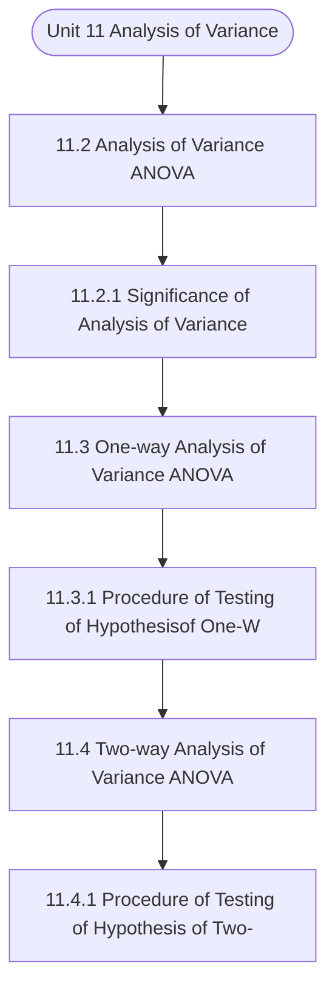

# MCS-066: Mathematical Foundations - II
## Unit 11: Analysis of Variance

> 📚 **Programme:** M.Sc. (Data Science and Analytics) | **Semester:** Semester 2  
> ⏱️ **Estimated Study Time:** ~44 mins | 📄 **Textbook Pages:** 22 Pages  
> 📥 **Original PDF:** [Download & View Authentic Textbook](../../../pdfs/Semester_2/MCS-066_Mathematical_Foundations_-_II/Unit-11_Analysis_of_Variance.pdf)

---

### 🎯 Executive Concept & Data Science Relevance
In modern data systems and advanced analytics, **Analysis of Variance** forms a vital conceptual pillar. Probability is the mathematical calculus of uncertainty. Every machine learning classification model outputs a conditional probability $P(Y=c \mid X=\mathbf{x})$, and Bayesian modeling updates prior beliefs based on empirical evidence.

> [!NOTE]
> **Why this matters for your career:** Mastering analysis of variance equips you with the foundational principles required to reason mathematically about high-dimensional datasets, evaluate algorithm performance, and avoid statistical pitfalls in production machine learning pipelines.

### 🗺️ Visual Knowledge Architecture
The following concept map illustrates the structural hierarchy and learning trajectory of this module:



### 📖 Core Definitions & Terminology Cards

> 📌 **Conditional Probability $P(A \mid B)$**  
> - **Formal Definition:** The probability of event $A$ occurring given that event $B$ has already occurred: $P(A \mid B) = \frac{P(A \cap B)}{P(B)}$, defined for $P(B) > 0$.  
> - 💡 **Practical Intuition & Analogy:** *Updating the likelihood of fraud given that a transaction occurred in an unusual country.*

> 📌 **Independent Events**  
> - **Formal Definition:** Events $A$ and $B$ are independent if the occurrence of one does not affect the other: $P(A \cap B) = P(A)P(B)$, or equivalently $P(A \mid B) = P(A)$.  
> - 💡 **Practical Intuition & Analogy:** *Coin tosses: Getting heads on flip 1 gives zero information about flip 2.*

> 📌 **Random Variable $X$**  
> - **Formal Definition:** A real-valued function $X: \Omega \to \mathbb{R}$ mapping outcomes of a random sample space $\Omega$ to real numbers. Can be discrete or continuous.  
> - 💡 **Practical Intuition & Analogy:** *Counting customer website visits per hour or measuring response latency in milliseconds.*

> 📌 **Mathematical Expectation $E[X]$**  
> - **Formal Definition:** The probability-weighted average value of a random variable: $E[X] = \sum x_i P(X = x_i)$ for discrete, or $\int_{-\infty}^\infty x f(x)dx$ for continuous.  
> - 💡 **Practical Intuition & Analogy:** *Long-run average payout of a game of chance.*

### ⚡ Governing Mathematical Laws & Formula Cheatsheet
#### 🔹 Bayes' Theorem
$$
P(B_i \mid A) = \frac{P(A \mid B_i) P(B_i)}{\sum_{j=1}^k P(A \mid B_j) P(B_j)} = \frac{P(A \mid B_i) P(B_i)}{P(A)}
$$
- **Explanation:** Calculates posterior probability by multiplying prior probability by likelihood, normalized by marginal evidence.

#### 🔹 Variance of a Random Variable
$$
\text{Var}(X) = E[X^2] - (E[X])^2
$$
- **Explanation:** Measures spread around the expected value. For constants: $\text{Var}(aX + b) = a^2 \text{Var}(X)$.

#### 🔹 Binomial Distribution PMF
$$
\begin{aligned} P(X = k) & = \binom{n}{k} p^k (1 - p)^{n - k} \\ E[X] & = np, \quad \text{Var}(X) = np(1 - p) \end{aligned}
$$
- **Explanation:** Models $k$ successes in $n$ independent Bernoulli trials with success probability $p$.

#### 🔹 Poisson Distribution PMF
$$
\begin{aligned} P(X = k) & = \frac{\lambda^k e^{-\lambda}}{k!} \\ E[X] & = \lambda, \quad \text{Var}(X) = \lambda \end{aligned}
$$
- **Explanation:** Models counts of rare independent events occurring in a fixed interval at constant average rate $\lambda$.

#### 🔹 Normal (Gaussian) Distribution PDF
$$
\begin{aligned} f(x) & = \frac{1}{\sigma \sqrt{2\pi}} e^{-\frac{1}{2}\left(\frac{x - \mu}{\sigma}\right)^2} \\ Z & = \frac{X - \mu}{\sigma} \sim \mathcal{N}(0, 1) \end{aligned}
$$
- **Explanation:** Symmetric bell-shaped curve governed entirely by mean $\mu$ and standard deviation $\sigma$.

### ⚖️ Axiomatic Properties & Governing Laws
The mathematical formulations of this module are anchored by foundational algebraic and structural laws:

- **Law of Total Probability:** $P(A) = \sum_{i=1}^k P(A \mid B_i) P(B_i)$
- **Linearity of Expectation:** $E[aX + bY] = aE[X] + bE[Y] \quad (\text{always holds})$
- **Variance of Sum:** $\text{Var}(X + Y) = \text{Var}(X) + \text{Var}(Y) + 2\text{Cov}(X, Y)$

### 📌 Comprehensive Section-by-Section Study Breakdown
#### `11.2` Analysis of Variance (ANOVA)

##### 📘 Theoretical Principles & Pedagogical Exposition
In probability theory and statistical inference, **Analysis of Variance (ANOVA)** formalizes the stochastic behavior of random phenomena. Within **Analysis of Variance**, this framework allows data scientists to infer population parameters from finite empirical samples while quantifying uncertainty via confidence intervals and hypothesis tests.

The mathematical rigor here prevents statistical misinterpretations, such as confusing correlation with causation, overlooking sample selection bias, or violating distributional assumptions.

##### ⚙️ Mathematical & Algorithmic Mechanics
- **Core Mechanism:** Probability measure satisfying Kolmogorov axioms: $P(S)=1, P(A) \ge 0$, and countable additivity. Bayes' Theorem computes posterior probability: $P(A \mid B) = \frac{P(B \mid A)P(A)}{P(B)}$. Variance measures dispersion: $\text{Var}(X) = \mathbb{E}[X^2] - (\mathbb{E}[X])^2$.
- **Boundary Conditions:** Zero probability conditioning events ($P(B) = 0$), distinguishing mutually exclusive events ($A \cap B = \emptyset$) from independent events ($P(A \cap B) = P(A)P(B)$), and heavy-tailed infinite variance.

##### 📊 Practical Data Science & Production Relevance
- **Production Workflow:** A/B test statistical significance, Naive Bayes spam classifiers, Bayesian hyperparameter optimization, and stochastic risk quantification in financial algorithms.
- **Real-World Pitfall:** Confusing conditional probability $P(A \mid B)$ with $P(B \mid A)$ (the Prosecutor's Fallacy), or falsely assuming independence between correlated feature variables.

> [!TIP]
> **Exam & Technical Interview Insight:** Calculate conditional probabilities using the Law of Total Probability and Bayes' Theorem; calculate expectation $\mathbb{E}[X]$ and variance for discrete and continuous random variables.

#### `11.2.1` Significance of Analysis of Variance

##### 📘 Theoretical Principles & Pedagogical Exposition
In probability theory and statistical inference, **Significance of Analysis of Variance** formalizes the stochastic behavior of random phenomena. Within **Analysis of Variance**, this framework allows data scientists to infer population parameters from finite empirical samples while quantifying uncertainty via confidence intervals and hypothesis tests.

The mathematical rigor here prevents statistical misinterpretations, such as confusing correlation with causation, overlooking sample selection bias, or violating distributional assumptions.

##### ⚙️ Mathematical & Algorithmic Mechanics
- **Core Mechanism:** Probability measure satisfying Kolmogorov axioms: $P(S)=1, P(A) \ge 0$, and countable additivity. Bayes' Theorem computes posterior probability: $P(A \mid B) = \frac{P(B \mid A)P(A)}{P(B)}$. Variance measures dispersion: $\text{Var}(X) = \mathbb{E}[X^2] - (\mathbb{E}[X])^2$.
- **Boundary Conditions:** Zero probability conditioning events ($P(B) = 0$), distinguishing mutually exclusive events ($A \cap B = \emptyset$) from independent events ($P(A \cap B) = P(A)P(B)$), and heavy-tailed infinite variance.

##### 📊 Practical Data Science & Production Relevance
- **Production Workflow:** A/B test statistical significance, Naive Bayes spam classifiers, Bayesian hyperparameter optimization, and stochastic risk quantification in financial algorithms.
- **Real-World Pitfall:** Confusing conditional probability $P(A \mid B)$ with $P(B \mid A)$ (the Prosecutor's Fallacy), or falsely assuming independence between correlated feature variables.

> [!TIP]
> **Exam & Technical Interview Insight:** Calculate conditional probabilities using the Law of Total Probability and Bayes' Theorem; calculate expectation $\mathbb{E}[X]$ and variance for discrete and continuous random variables.

#### `11.3` One-way Analysis of Variance (ANOVA)

##### 📘 Theoretical Principles & Pedagogical Exposition
If we consider only one independent variable which affects the response / dependent variable then it is called One-way ANOVA. It is used to test the equality of more than two means when the observations are classified according to one factor/treatment at different levels. For example, we may wish to study the simultaneous effects of five varieties of wheat (independent variable) on the yield (dependent variable) or test the stress level of employees in three different organisations, and so on.

In such situations, we can also apply one-way ANOVA for each treatment/factor. As we have studied that two samples t-test is used to decide whether two groups (two levels) of a factor have the same mean. So one- way ANOVA generalises this problem to k levels (greater than two) of a factor.

Suppose there are k normal populations or k levels of a factor/treatment with mean/average effect μ1, μ2 ,. ., μk with common variance  . Also let us draw k random samples one from each population of size ni (i = 1,2, …, k). The observations of different samples or on different levels of a factor can be exhibited as shown on the next page.


##### ⚙️ Mathematical & Algorithmic Mechanics
- **Core Mechanism:** Probability measure satisfying Kolmogorov axioms: $P(S)=1, P(A) \ge 0$, and countable additivity. Bayes' Theorem computes posterior probability: $P(A \mid B) = \frac{P(B \mid A)P(A)}{P(B)}$. Variance measures dispersion: $\text{Var}(X) = \mathbb{E}[X^2] - (\mathbb{E}[X])^2$.
- **Boundary Conditions:** Zero probability conditioning events ($P(B) = 0$), distinguishing mutually exclusive events ($A \cap B = \emptyset$) from independent events ($P(A \cap B) = P(A)P(B)$), and heavy-tailed infinite variance.

##### 📊 Practical Data Science & Production Relevance
- **Production Workflow:** A/B test statistical significance, Naive Bayes spam classifiers, Bayesian hyperparameter optimization, and stochastic risk quantification in financial algorithms.
- **Real-World Pitfall:** Confusing conditional probability $P(A \mid B)$ with $P(B \mid A)$ (the Prosecutor's Fallacy), or falsely assuming independence between correlated feature variables.

> [!TIP]
> **Exam & Technical Interview Insight:** Calculate conditional probabilities using the Law of Total Probability and Bayes' Theorem; calculate expectation $\mathbb{E}[X]$ and variance for discrete and continuous random variables.

#### `11.3.1` Procedure of Testing of Hypothesisof One-Way ANOVA

##### 📘 Theoretical Principles & Pedagogical Exposition
In this section, we discuss the step-by-step computation procedure for one-way analysis of variance for k independent samples as Step 1: We first formulate the null hypothesis (H0) and the alternative hypothesis(H1). We want to test the equality of the population means μ1, μ2 ,. ., μk or test the homogeneity of the effect of different levels of a factor.

Hence, the null and alternative hypotheses are H0: μ1 = μ2 = . = μk the alternative hypothesis H1: At least two are not equal Step 2:We calculate the total sum of squares of variation (TSS) as ( ) in k ij i 1 j 1 TSS y y = = = −  where in k ij i 1 j 1 y y N = = =  Or in k ij i 1 j 1 TSS y CF = = = −  where in k ij i 1 j 1 y = =  is called raw sum of squares and is calculated as ( ) ( ) ( ) i k n k ij 1n 2n k1 k2 kn i 1 j 1 y y y ...

y = = = + + + + + + + + + + + +  And CF is called correction factor and is calculated as CF ( ) andTotal Totalnumb N v Gr erof obser ations G = = Step 3:We calculate the sum of squares of variation between the samples (SSB) or sum of squares of variation due to different levels of a factor as Analysing data and Optimisation ( ) k k i i i 1 k T T T SSB n y y or SSB ...


##### ⚙️ Mathematical & Algorithmic Mechanics
- **Core Mechanism:** Probability measure satisfying Kolmogorov axioms: $P(S)=1, P(A) \ge 0$, and countable additivity. Bayes' Theorem computes posterior probability: $P(A \mid B) = \frac{P(B \mid A)P(A)}{P(B)}$. Variance measures dispersion: $\text{Var}(X) = \mathbb{E}[X^2] - (\mathbb{E}[X])^2$.
- **Boundary Conditions:** Zero probability conditioning events ($P(B) = 0$), distinguishing mutually exclusive events ($A \cap B = \emptyset$) from independent events ($P(A \cap B) = P(A)P(B)$), and heavy-tailed infinite variance.

##### 📊 Practical Data Science & Production Relevance
- **Production Workflow:** A/B test statistical significance, Naive Bayes spam classifiers, Bayesian hyperparameter optimization, and stochastic risk quantification in financial algorithms.
- **Real-World Pitfall:** Confusing conditional probability $P(A \mid B)$ with $P(B \mid A)$ (the Prosecutor's Fallacy), or falsely assuming independence between correlated feature variables.

> [!TIP]
> **Exam & Technical Interview Insight:** Calculate conditional probabilities using the Law of Total Probability and Bayes' Theorem; calculate expectation $\mathbb{E}[X]$ and variance for discrete and continuous random variables.

#### `11.4` Two-way Analysis of Variance (ANOVA)

##### 📘 Theoretical Principles & Pedagogical Exposition
In the previous section, we considered the case where only one predictor/ independent/ explanatory variable was categorised at different levels. If we are interested in studying the simultaneous effect of two independent factors each at different levels on the dependent variable, we use two-way ANOVA.

For example, we may wish to study the simultaneous effects of five varieties of wheat (first criterion) and four different types of fertilisers (second criterion) on the yield (dependent variable) or test the stress level of employees in three different organisations in different regions, and so on.

In such situations, we can also apply two separate one-way ANOVA for each treatment/factor. However, it is more advantageous to use two-way ANOVA because the variance can be reduced by introducing the second factor. In such an ANOVA, generally, we have an experiment in which we simultaneously study the effect of two factors in the same experiment.


##### ⚙️ Mathematical & Algorithmic Mechanics
- **Core Mechanism:** Probability measure satisfying Kolmogorov axioms: $P(S)=1, P(A) \ge 0$, and countable additivity. Bayes' Theorem computes posterior probability: $P(A \mid B) = \frac{P(B \mid A)P(A)}{P(B)}$. Variance measures dispersion: $\text{Var}(X) = \mathbb{E}[X^2] - (\mathbb{E}[X])^2$.
- **Boundary Conditions:** Zero probability conditioning events ($P(B) = 0$), distinguishing mutually exclusive events ($A \cap B = \emptyset$) from independent events ($P(A \cap B) = P(A)P(B)$), and heavy-tailed infinite variance.

##### 📊 Practical Data Science & Production Relevance
- **Production Workflow:** A/B test statistical significance, Naive Bayes spam classifiers, Bayesian hyperparameter optimization, and stochastic risk quantification in financial algorithms.
- **Real-World Pitfall:** Confusing conditional probability $P(A \mid B)$ with $P(B \mid A)$ (the Prosecutor's Fallacy), or falsely assuming independence between correlated feature variables.

> [!TIP]
> **Exam & Technical Interview Insight:** Calculate conditional probabilities using the Law of Total Probability and Bayes' Theorem; calculate expectation $\mathbb{E}[X]$ and variance for discrete and continuous random variables.

#### `11.4.1` Procedure of Testing of Hypothesis of Two-way ANOVA

##### 📘 Theoretical Principles & Pedagogical Exposition
In two-way ANOVA, the total variation in the data is divided into three components: variation due to the first criterion (factor), variation due to the second criterion (factor) and variation due to error. Now, let us discuss the testing procedure of two-way ANOVA briefly mentioning the main steps and formulae as follows: Step 1: We first formulate the null hypothesis (H0) and the alternative hypothesis (H1).

In two-way ANOVA, we can test two hypotheses simultaneously: one for different levels of factor A and the other for different levels of factor B. If factor A has r levels and i is the average effect of ith level of factor A then we can set up the null and alternative hypotheses as follows: r A ...

: H  = =  =  )r ,..., 2,1 j i( one least At H j i A =     = Similarly, if factor B has s levels and j is the average effect of jth level of factor B thenwe can set up the null and alternative hypotheses as follows: s B ... : H  = =  =  )s ,..., 2,1 j i( one least At H j i B =     = Step 2:In this step, we calculate the total sum of squares of variation (TSS) as calulate in the case of one-way ANOVA as ( ) r s ij i 1 j 1 TSS y y = = = −  where r s ij i 1 j 1 y y N = = =  grand mean Or r s ij i 1 j 1 TSS y CF = = = −  where r s ij i 1 j 1 y = =  it is called raw sum of squares and calculated as Analysis of Variance ( ) ( ) ( ) r s ij 1s 2s r1 r2 rs i 1 j 1 y y y ...


##### ⚙️ Mathematical & Algorithmic Mechanics
- **Core Mechanism:** Probability measure satisfying Kolmogorov axioms: $P(S)=1, P(A) \ge 0$, and countable additivity. Bayes' Theorem computes posterior probability: $P(A \mid B) = \frac{P(B \mid A)P(A)}{P(B)}$. Variance measures dispersion: $\text{Var}(X) = \mathbb{E}[X^2] - (\mathbb{E}[X])^2$.
- **Boundary Conditions:** Zero probability conditioning events ($P(B) = 0$), distinguishing mutually exclusive events ($A \cap B = \emptyset$) from independent events ($P(A \cap B) = P(A)P(B)$), and heavy-tailed infinite variance.

##### 📊 Practical Data Science & Production Relevance
- **Production Workflow:** A/B test statistical significance, Naive Bayes spam classifiers, Bayesian hyperparameter optimization, and stochastic risk quantification in financial algorithms.
- **Real-World Pitfall:** Confusing conditional probability $P(A \mid B)$ with $P(B \mid A)$ (the Prosecutor's Fallacy), or falsely assuming independence between correlated feature variables.

> [!TIP]
> **Exam & Technical Interview Insight:** Calculate conditional probabilities using the Law of Total Probability and Bayes' Theorem; calculate expectation $\mathbb{E}[X]$ and variance for discrete and continuous random variables.

### 📐 Step-by-Step Solved Mathematical Examples
To solidify your theoretical understanding, work through these fully solved, step-by-step mathematical problems:

#### 🧮 Example 1: Bayes' Theorem in Rare Event Detection
> **Problem Statement:**  
> A medical diagnostic test for a disease has Sensitivity $P(+ \mid D) = 0.95$ and Specificity $P(- \mid D^c) = 0.90$. The disease prevalence in population is $P(D) = 0.01$. If a patient tests positive, what is the probability they actually have the disease?

**Detailed Step-by-Step Solution:**

1. **Identify components:**
- Prior: $P(D) = 0.01 \implies P(D^c) = 0.99$
- Likelihood: $P(+ \mid D) = 0.95$
- False Positive Rate: $P(+ \mid D^c) = 1 - 0.90 = 0.10$

2. **Total Probability of testing positive:**

$$
P(+) = P(+ \mid D)P(D) + P(+ \mid D^c)P(D^c) = (0.95)(0.01) + (0.10)(0.99) = 0.0095 + 0.0990 = 0.1085
$$


3. **Posterior Probability via Bayes' Theorem:**

$$
P(D \mid +) = \frac{P(+ \mid D)P(D)}{P(+)} = \frac{0.0095}{0.1085} \approx 0.08755 \implies 8.76\%
$$


Insight: Despite 95% sensitivity, because the disease is rare, a positive test only implies an 8.76% probability of disease (Base Rate Fallacy).

#### 🧮 Example 2: Binomial Distribution Probability Calculation
> **Problem Statement:**  
> An automated testing suite runs $n = 5$ independent integration tests. Each test has failure rate $p = 0.1$. Calculate the probability that exactly 1 test fails.

**Detailed Step-by-Step Solution:**


$$
\begin{aligned} P(X = 1) & = \binom{5}{1} (0.1)^1 (0.9)^{5-1} \\ & = 5 \times 0.1 \times (0.9)^4 \\ & = 0.5 \times 0.6561 = 0.32805 \implies 32.81\% \end{aligned}
$$


### 💻 Practical Data Science Implementation (Python)
Theory translates directly into production algorithms. Below is a self-contained, commented Python implementation illustrating the core operations of this unit:

```python
import scipy.stats as stats

# Bayes Theorem Calculator
def bayes_posterior(prior, sensitivity, specificity):
    false_positive_rate = 1.0 - specificity
    p_evidence = (sensitivity * prior) + (false_positive_rate * (1 - prior))
    posterior = (sensitivity * prior) / p_evidence
    return posterior

prior_fraud = 0.02
sens = 0.98
spec = 0.95

p_fraud_given_flag = bayes_posterior(prior_fraud, sens, spec)
print(f"P(Fraud | System Flag): {p_fraud_given_flag * 100:.2f}%")
```

### 💡 Interactive Self-Assessment Checkpoints
Test your comprehension before proceeding. Tap each question to reveal the comprehensive explanation:

<details>
<summary><b>Checkpoint 1:</b> Describe the analysis of variance and differentiate between one-way and two-way ANOVA. <i>(Tap to reveal answer)</i></summary>

> **Answer & Analysis:**  
> **Detailed Analytical Solution:**
> 
> 1. **Core Principle:** Identify the governing theorem or definition for Analysis of Variance.
> 2. **Step-by-Step Derivation:** Verify all preconditions and compute intermediate steps methodically.
> 3. **Conclusion:** State the final mathematical proof or calculation clearly, validating boundary edge cases.
</details>

<details>
<summary><b>Checkpoint 2:</b> Explain the significance of analysis of variance briefly. <i>(Tap to reveal answer)</i></summary>

> **Answer & Analysis:**  
> **Detailed Analytical Solution:**
> 
> 1. **Core Principle:** Identify the governing theorem or definition for Analysis of Variance.
> 2. **Step-by-Step Derivation:** Verify all preconditions and compute intermediate steps methodically.
> 3. **Conclusion:** State the final mathematical proof or calculation clearly, validating boundary edge cases.
</details>

<details>
<summary><b>Checkpoint 3:</b> Referred to Section 11.2. <i>(Tap to reveal answer)</i></summary>

> **Answer & Analysis:**  
> **Detailed Analytical Solution:**
> 
> 1. **Core Principle:** Identify the governing theorem or definition for Analysis of Variance.
> 2. **Step-by-Step Derivation:** Verify all preconditions and compute intermediate steps methodically.
> 3. **Conclusion:** State the final mathematical proof or calculation clearly, validating boundary edge cases.
</details>

<details>
<summary><b>Checkpoint 4:</b> Referred to sub-section 11.2.1. <i>(Tap to reveal answer)</i></summary>

> **Answer & Analysis:**  
> **Detailed Analytical Solution:**
> 
> 1. **Core Principle:** Identify the governing theorem or definition for Analysis of Variance.
> 2. **Step-by-Step Derivation:** Verify all preconditions and compute intermediate steps methodically.
> 3. **Conclusion:** State the final mathematical proof or calculation clearly, validating boundary edge cases.
</details>

<details>
<summary><b>Checkpoint 5:</b> State Bayes' Theorem formula for event hypothesis $H$ given evidence $E$. <i>(Tap to reveal answer)</i></summary>

> **Answer & Analysis:**  
> $P(H \mid E) = \frac{P(E \mid H)P(H)}{P(E)}$
</details>

<details>
<summary><b>Checkpoint 6:</b> What is the expected value and variance of a Binomial distribution $B(n, p)$? <i>(Tap to reveal answer)</i></summary>

> **Answer & Analysis:**  
> Mean $E[X] = np$, and Variance $\text{Var}(X) = np(1 - p)$.
</details>

### 🎯 Executive Module Wrap-Up
- **Central Idea:** Analysis of Variance provides essential mathematical and algorithmic tools directly utilized in Data Science.
- **Mathematical Rigor:** Formulas and laws must be memorized with attention to boundary conditions and assumptions.
- **Full Textbook Coverage:** For exhaustive multi-page derivations, proofs, and supplementary exercises, consult the [Authentic IGNOU Textbook](../../../pdfs/Semester_2/MCS-066_Mathematical_Foundations_-_II/Unit-11_Analysis_of_Variance.pdf).

---
### 🧭 Navigation & Syllabus Index
[⬅ Previous: Unit 10](unit_10_Hypothesis_Testing.md) | [📑 Course Index](README.md) | [Next: Unit 12 ➡](unit_12_Categorical_Data_Analysis.md)
