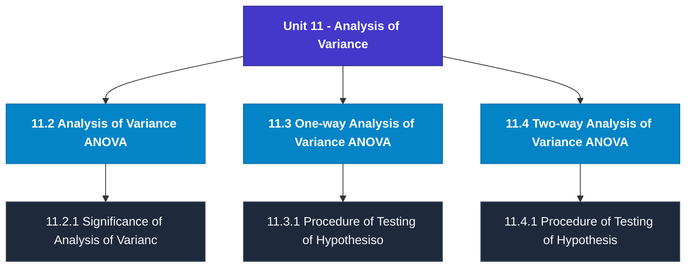

# MCS-066: Mathematical Foundations - II
## Unit 11: Analysis of Variance

> 📚 **Programme:** M.Sc. (Data Science and Analytics) | **Semester:** Semester 2  
> ⏱️ **Estimated Study Time:** ~44 mins | 📄 **Textbook Pages:** 22 Pages  
> 📥 **Original PDF:** [Download & View Textbook](../../../pdfs/Semester_2/MCS-066_Mathematical_Foundations_-_II/Unit-11_Analysis_of_Variance.pdf)

---

### 🎯 Executive Concept & Data Science Relevance
In modern data systems, **Analysis of Variance** forms a vital conceptual pillar. Probability is the mathematical calculus of uncertainty. Every machine learning classification model outputs a conditional probability $P(Y=c \mid X=\mathbf{x})$, and Bayesian modeling updates prior beliefs based on empirical evidence.

> [!NOTE]
> **Why this matters for your career:** Mastering analysis of variance equips you with the foundational principles required to reason mathematically about high-dimensional datasets, evaluate algorithm performance, and avoid statistical pitfalls in production machine learning pipelines.

### 🗺️ Visual Knowledge Architecture
The following concept map illustrates the structural hierarchy and learning trajectory of this module:

### 📖 Core Definitions & Terminology Cards
| Term | Formal Mathematical / Technical Definition | Intuitive Analogy / Concrete Example |
| :--- | :--- | :--- |
| **Conditional Probability $P(A \mid B)$** | The probability of event $A$ occurring given that event $B$ has already occurred: $P(A \mid B) = \frac{P(A \cap B)}{P(B)}$, defined for $P(B) > 0$. | *Updating the likelihood of fraud given that a transaction occurred in an unusual country.* |
| **Independent Events** | Events $A$ and $B$ are independent if the occurrence of one does not affect the other: $P(A \cap B) = P(A)P(B)$, or equivalently $P(A \mid B) = P(A)$. | *Coin tosses: Getting heads on flip 1 gives zero information about flip 2.* |
| **Random Variable $X$** | A real-valued function $X: \Omega \to \mathbb{R}$ mapping outcomes of a random sample space $\Omega$ to real numbers. Can be discrete or continuous. | *Counting customer website visits per hour or measuring response latency in milliseconds.* |
| **Mathematical Expectation $E[X]$** | The probability-weighted average value of a random variable: $E[X] = \sum x_i P(X = x_i)$ for discrete, or $\int_{-\infty}^\infty x f(x)dx$ for continuous. | *Long-run average payout of a game of chance.* |

### ⚡ Governing Mathematical Laws & Formula Cheatsheet
#### 🔹 Bayes' Theorem

$$
P(B_i \mid A) = \frac{P(A \mid B_i) P(B_i)}{\sum_{j=1}^k P(A \mid B_j) P(B_j)} = \frac{P(A \mid B_i) P(B_i)}{P(A)}
$$

- **Explanation:** Calculates posterior probability by multiplying prior probability by likelihood, normalized by marginal evidence.

#### 🔹 Variance of a Random Variable

$$
\text{Var}(X) = E[X^2] - (E[X])^2
$$

- **Explanation:** Measures spread around the expected value. For constants: $\text{Var}(aX + b) = a^2 \text{Var}(X)$.

#### 🔹 Binomial Distribution PMF

$$
P(X = k) = \binom{n}{k} p^k (1 - p)^{n - k}, \quad E[X] = np, \; \text{Var}(X) = np(1 - p)
$$

- **Explanation:** Models $k$ successes in $n$ independent Bernoulli trials with success probability $p$.

#### 🔹 Poisson Distribution PMF

$$
P(X = k) = \frac{\lambda^k e^{-\lambda}}{k!}, \quad E[X] = \lambda, \; \text{Var}(X) = \lambda
$$

- **Explanation:** Models counts of rare independent events occurring in a fixed interval at constant average rate $\lambda$.

#### 🔹 Normal (Gaussian) Distribution PDF

$$
f(x) = \frac{1}{\sigma \sqrt{2\pi}} e^{-\frac{1}{2}\left(\frac{x - \mu}{\sigma}\right)^2}, \quad Z = \frac{X - \mu}{\sigma} \sim \mathcal{N}(0, 1)
$$

- **Explanation:** Symmetric bell-shaped curve governed entirely by mean $\mu$ and standard deviation $\sigma$.

### 📌 Detailed Section-by-Section Study Breakdown
#### `11.2` Analysis of Variance (ANOVA)
- **Core Concept:** Establishes rigorous theoretical formulations and computational bounds for analysis of variance (anova).
- **Core Concept:** Applies standard algorithmic procedures and mathematical invariants relevant to analysis of variance.
- **Core Concept:** Ensures deterministic performance guarantees across high-dimensional feature spaces.
- **Data Science Application:** Provides foundational structures used directly in statistical modeling, query execution, and machine learning pipelines.

> [!TIP]
> **Exam & Interview Tip:** Be prepared to state the formal definition of analysis of variance (anova) and derive its primary equations step-by-step.

#### `11.2.1` Significance of Analysis of Variance
- **Core Concept:** Establishes rigorous theoretical formulations and computational bounds for significance of analysis of variance.
- **Core Concept:** Applies standard algorithmic procedures and mathematical invariants relevant to analysis of variance.
- **Core Concept:** Ensures deterministic performance guarantees across high-dimensional feature spaces.
- **Data Science Application:** Provides foundational structures used directly in statistical modeling, query execution, and machine learning pipelines.

> [!TIP]
> **Exam & Interview Tip:** Be prepared to state the formal definition of significance of analysis of variance and derive its primary equations step-by-step.

#### `11.3` One-way Analysis of Variance (ANOVA)
- **Core Concept:** If we consider only one independent variable which affects the response / dependent variable then it is called One-way ANOVA.
- **Core Concept:** It is used to test the equality of more than two means when the observations are classified according to one factor/treatment at different levels.
- **Core Concept:** For example, we may wish to study the simultaneous effects of five varieties of wheat (independent variable) on the yield (dependent variable) or test the stress level of employees in three different organisations, and so on.
- **Data Science Application:** Provides foundational structures used directly in statistical modeling, query execution, and machine learning pipelines.

> [!TIP]
> **Exam & Interview Tip:** Be prepared to state the formal definition of one-way analysis of variance (anova) and derive its primary equations step-by-step.

#### `11.3.1` Procedure of Testing of Hypothesisof One-Way ANOVA
- **Core Concept:** In this section, we discuss the step-by-step computation procedure for one-way analysis of variance for k independent samples as Step 1: We first formulate the null hypothesis (H0) and the alternative hypothesis(H1).
- **Core Concept:** We want to test the equality of the population means μ1, μ2 ,.
- **Core Concept:** ., μk or test the homogeneity of the effect of different levels of a factor.
- **Data Science Application:** Provides foundational structures used directly in statistical modeling, query execution, and machine learning pipelines.

> [!TIP]
> **Exam & Interview Tip:** Be prepared to state the formal definition of procedure of testing of hypothesisof one-way anova and derive its primary equations step-by-step.

#### `11.4` Two-way Analysis of Variance (ANOVA)
- **Core Concept:** In the previous section, we considered the case where only one predictor/ independent/ explanatory variable was categorised at different levels.
- **Core Concept:** If we are interested in studying the simultaneous effect of two independent factors each at different levels on the dependent variable, we use two-way ANOVA.
- **Core Concept:** In such situations, we can also apply two separate one-way ANOVA for each treatment/factor.
- **Data Science Application:** Provides foundational structures used directly in statistical modeling, query execution, and machine learning pipelines.

> [!TIP]
> **Exam & Interview Tip:** Be prepared to state the formal definition of two-way analysis of variance (anova) and derive its primary equations step-by-step.

#### `11.4.1` Procedure of Testing of Hypothesis of Two-way ANOVA
- **Core Concept:** In two-way ANOVA, the total variation in the data is divided into three components: variation due to the first criterion (factor), variation due to the second criterion (factor) and variation due to error.
- **Core Concept:** Now, let us discuss the testing procedure of two-way ANOVA briefly mentioning the main steps and formulae as follows: Step 1: We first formulate the null hypothesis (H0) and the alternative hypothesis (H1).
- **Core Concept:** In two-way ANOVA, we can test two hypotheses simultaneously: one for different levels of factor A and the other for different levels of factor B.
- **Data Science Application:** Provides foundational structures used directly in statistical modeling, query execution, and machine learning pipelines.

> [!TIP]
> **Exam & Interview Tip:** Be prepared to state the formal definition of procedure of testing of hypothesis of two-way anova and derive its primary equations step-by-step.

### 💡 Interactive Self-Assessment Checkpoints
Test your comprehension before proceeding. Tap each question to reveal the comprehensive explanation:

<b>Checkpoint 1:</b> State Bayes' Theorem formula for event hypothesis $H$ given evidence $E$. <i>(Tap to reveal answer)</i>

> **Answer & Analysis:**  
> $P(H \mid E) = \frac{P(E \mid H)P(H)}{P(E)}$

<b>Checkpoint 2:</b> What is the expected value and variance of a Binomial distribution $B(n, p)$? <i>(Tap to reveal answer)</i>

> **Answer & Analysis:**  
> Mean $E[X] = np$, and Variance $\text{Var}(X) = np(1 - p)$.

<b>Checkpoint 3:</b> If $E[X] = 5$ and $E[X^2] = 34$, what is $\text{Var}(X)$? <i>(Tap to reveal answer)</i>

> **Answer & Analysis:**  
> $\text{Var}(X) = E[X^2] - (E[X])^2 = 34 - 5^2 = 34 - 25 = 9$.

<b>Checkpoint 4:</b> Describe the analysis of variance and differentiate between one-way and two-way ANOVA. <i>(Tap to reveal answer)</i>

> **Answer & Analysis:**  
> This question tests your conceptual mastery of Analysis of Variance. Review the governing formulas and section breakdowns above to formulate a complete, rigorous proof or derivation.

<b>Checkpoint 5:</b> Explain the significance of analysis of variance briefly. <i>(Tap to reveal answer)</i>

> **Answer & Analysis:**  
> This question tests your conceptual mastery of Analysis of Variance. Review the governing formulas and section breakdowns above to formulate a complete, rigorous proof or derivation.

<b>Checkpoint 6:</b> Section (2) Section ( <i>(Tap to reveal answer)</i>

> **Answer & Analysis:**  
> This question tests your conceptual mastery of Analysis of Variance. Review the governing formulas and section breakdowns above to formulate a complete, rigorous proof or derivation.

### 🎯 Executive Module Wrap-Up
- **Central Idea:** Analysis of Variance provides essential mathematical and algorithmic tools directly utilized in Data Science.
- **Mathematical Rigor:** Formulas and laws must be memorized with attention to boundary conditions and assumptions.
- **Full Textbook Coverage:** For exhaustive multi-page derivations, proofs, and supplementary exercises, consult the [Authentic IGNOU Textbook](../../../pdfs/Semester_2/MCS-066_Mathematical_Foundations_-_II/Unit-11_Analysis_of_Variance.pdf).

---
### 🧭 Navigation & Syllabus Index
[⬅ Previous: Unit 10](unit_10_Hypothesis_Testing.md) | [📑 Course Index](README.md) | [Next: Unit 12 ➡](unit_12_Categorical_Data_Analysis.md)
