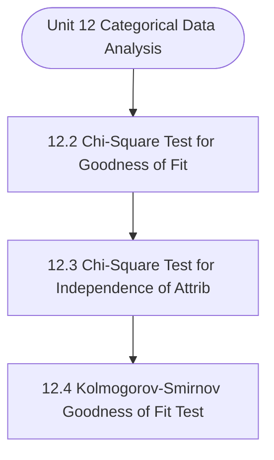

# MCS-066: Mathematical Foundations - II
## Unit 12: Categorical Data Analysis

> 📚 **Programme:** M.Sc. (Data Science and Analytics) | **Semester:** Semester 2  
> ⏱️ **Estimated Study Time:** ~75 mins | 📄 **Textbook Pages:** 32 Pages  
> 📥 **Original PDF:** [Download & View Authentic Textbook](../../../pdfs/Semester_2/MCS-066_Mathematical_Foundations_-_II/Unit-12_Categorical_Data_Analysis.pdf)

---

### 🎯 Executive Concept & Data Science Relevance
In modern data systems and advanced analytics, **Categorical Data Analysis** forms a vital conceptual pillar. Statistical inference bridges sample data to population reality. In A/B testing, feature significance testing, and model benchmarking, hypothesis tests determine whether performance gains are statistically significant or merely random fluctuations.

> [!NOTE]
> **Why this matters for your career:** Mastering categorical data analysis equips you with the foundational principles required to reason mathematically about high-dimensional datasets, evaluate algorithm performance, and avoid statistical pitfalls in production machine learning pipelines.

### 🗺️ Visual Knowledge Architecture
The following concept map illustrates the structural hierarchy and learning trajectory of this module:



### 📖 Core Definitions & Terminology Cards

> 📌 **Central Limit Theorem (CLT)**  
> - **Formal Definition:** For any population with mean $\mu$ and finite variance $\sigma^2$, the sampling distribution of sample mean $\bar{X}$ approaches a Normal distribution $\mathcal{N}(\mu, \sigma^2/n)$ as sample size $n \to \infty$, regardless of population shape.  
> - 💡 **Practical Intuition & Analogy:** *Averages of independent random variables always look Gaussian in large samples ( $n \ge 30$ ).*

> 📌 **Standard Error (SE)**  
> - **Formal Definition:** The standard deviation of the sampling distribution of a statistic: $\text{SE}(\bar{X}) = \frac{\sigma}{\sqrt{n}}$ (or $\frac{s}{\sqrt{n}}$ when $\sigma$ is unknown).  
> - 💡 **Practical Intuition & Analogy:** *Uncertainty of your sample estimate: larger sample sizes dramatically reduce estimation error.*

> 📌 **Null ($H_0$) and Alternative ($H_1$) Hypotheses**  
> - **Formal Definition:** $H_0$ represents the baseline status quo of no effect or no difference. $H_1$ represents the research claim of a true non-zero effect.  
> - 💡 **Practical Intuition & Analogy:** *In a courtroom: $H_0$ is presumed innocent; $H_1$ is guilty upon convincing evidence.*

> 📌 **Type I Error ( $\alpha$ ) and Type II Error ( $\beta$ )**  
> - **Formal Definition:** Type I error is rejecting true $H_0$ (false positive, rate $\alpha$). Type II error is failing to reject false $H_0$ (false negative, rate $\beta$). Statistical power is $1 - \beta$.  
> - 💡 **Practical Intuition & Analogy:** *Type I: Innocent person convicted. Type II: Guilty person acquitted.*

### ⚡ Governing Mathematical Laws & Formula Cheatsheet
#### 🔹 Confidence Interval for Population Mean
$$
\bar{x} \pm z_{\alpha/2} \left(\frac{\sigma}{\sqrt{n}}\right) \quad \text{or} \quad \bar{x} \pm t_{\alpha/2, n-1} \left(\frac{s}{\sqrt{n}}\right)
$$
- **Explanation:** Interval providing $1-\alpha$ confidence of containing true population parameter $\mu$.

#### 🔹 One-Sample Z-Test Statistic
$$
Z = \frac{\bar{x} - \mu_0}{\sigma / \sqrt{n}} \sim \mathcal{N}(0, 1)
$$
- **Explanation:** Used when population standard deviation $\sigma$ is known and sample size is large.

#### 🔹 One-Sample Student's t-Test Statistic
$$
t = \frac{\bar{x} - \mu_0}{s / \sqrt{n}} \sim t_{n-1}
$$
- **Explanation:** Used when population $\sigma$ is unknown and estimated using sample standard deviation $s$.

#### 🔹 Chi-Square Test of Independence Statistic
$$
\chi^2 = \sum_{i=1}^r \sum_{j=1}^c \frac{(O_{ij} - E_{ij})^2}{E_{ij}} \quad \text{where } E_{ij} = \frac{R_i \times C_j}{N}
$$
- **Explanation:** Tests whether two categorical attributes are statistically independent, with degrees of freedom $(r-1)(c-1)$.

#### 🔹 One-Way ANOVA F-Ratio Statistic
$$
F = \frac{\text{MS}_{\text{between}}}{\text{MS}_{\text{within}}} = \frac{\text{SSB} / (k - 1)}{\text{SSW} / (N - k)}
$$
- **Explanation:** Compares variance between $k$ group means against variance within groups to test equality of multiple population means.

### ⚖️ Axiomatic Properties & Governing Laws
The mathematical formulations of this module are anchored by foundational algebraic and structural laws:

- **Decision Rule:** $p\text{-value} < \alpha \implies \text{Reject } H_0$
- **Degrees of Freedom (t-Test):** $df = n - 1$
- **Degrees of Freedom (Chi-Square):** $df = (r - 1)(c - 1)$

### 📌 Comprehensive Section-by-Section Study Breakdown
#### `12.2` Chi-Square Test for Goodness of Fit

##### 📘 Theoretical Principles & Pedagogical Exposition
In probability theory and statistical inference, **Chi-Square Test for Goodness of Fit** formalizes the stochastic behavior of random phenomena. Within **Categorical Data Analysis**, this framework allows data scientists to infer population parameters from finite empirical samples while quantifying uncertainty via confidence intervals and hypothesis tests.

The mathematical rigor here prevents statistical misinterpretations, such as confusing correlation with causation, overlooking sample selection bias, or violating distributional assumptions.

##### ⚙️ Mathematical & Algorithmic Mechanics
- **Core Mechanism:** Statistical inference evaluates sample statistics to draw population conclusions. Hypothesis testing contrasts Null $H_0$ against Alternative $H_1$. The $p$-value represents probability of obtaining test results at least as extreme under $H_0$; reject $H_0$ if $p < \alpha$.
- **Boundary Conditions:** Type I error (false positive $\alpha$) vs Type II error (false negative $\beta$), statistical power $1 - \beta$, unequal sample variances in Student's $t$-test, and small cell counts in Chi-Square tests.

##### 📊 Practical Data Science & Production Relevance
- **Production Workflow:** Online experimentation and conversion lift validation (A/B testing), automated model drift monitoring, feature significance selection, and clinical trial efficacy tests.
- **Real-World Pitfall:** $p$-hacking, failing to apply multiple testing corrections (e.g. Bonferroni / FDR) across multiple comparisons, and confusing statistical significance with practical impact.

> [!TIP]
> **Exam & Technical Interview Insight:** State $H_0$ and $H_1$ explicitly; identify the correct test statistic ($Z$, $t$, $F$, or $\chi^2$); determine degrees of freedom and state the clear rejection conclusion.

#### `12.3` Chi-Square Test for Independence of Attributes

##### 📘 Theoretical Principles & Pedagogical Exposition
ATTRIBUTES There are many situations where we need to test the independence of two characteristics or attributes of categorical data. For example, a sociologist may wish to know whether the level of formal education is independent of income, whether the height of sons depending on the height of their fathers or not, etc.

If there is no association between two variables, we say that they are independent. In other words, we can say that two variables are independent if the distribution of one is not depending on the distribution of another. To test the independence of two variables when observations in a population are classified according to some attributes we may use the chi-square test for independence.

This test will indicate only whether or not any association exists between the attributes. To conduct the test, a sample is drawn from the population and the observed frequencies are cross-classified according to the two characteristics so that each observation belongs to one and only one level of each characteristic.


##### ⚙️ Mathematical & Algorithmic Mechanics
- **Core Mechanism:** Statistical inference evaluates sample statistics to draw population conclusions. Hypothesis testing contrasts Null $H_0$ against Alternative $H_1$. The $p$-value represents probability of obtaining test results at least as extreme under $H_0$; reject $H_0$ if $p < \alpha$.
- **Boundary Conditions:** Type I error (false positive $\alpha$) vs Type II error (false negative $\beta$), statistical power $1 - \beta$, unequal sample variances in Student's $t$-test, and small cell counts in Chi-Square tests.

##### 📊 Practical Data Science & Production Relevance
- **Production Workflow:** Online experimentation and conversion lift validation (A/B testing), automated model drift monitoring, feature significance selection, and clinical trial efficacy tests.
- **Real-World Pitfall:** $p$-hacking, failing to apply multiple testing corrections (e.g. Bonferroni / FDR) across multiple comparisons, and confusing statistical significance with practical impact.

> [!TIP]
> **Exam & Technical Interview Insight:** State $H_0$ and $H_1$ explicitly; identify the correct test statistic ($Z$, $t$, $F$, or $\chi^2$); determine degrees of freedom and state the clear rejection conclusion.

#### `12.4` Kolmogorov–Smirnov Goodness of Fit Test

##### 📘 Theoretical Principles & Pedagogical Exposition
FIT TEST This test has its name on the names of its discovers A. It is a simple non-parametric test for testing whether data follow a specified or assumed distribution or sample has come from a specified or assumed distribution or there is a significant difference between an observed distribution and a theoretical distribution.

Therefore, it is a measure of goodness of fit to a theoretical distribution. The main difference between the chi-square test and Kolmogorov-Smirnov (K-S) test is that the chi-square test is designed for categorical data whereas the K-S test is designed for continuous data. Assumptions This test works under the following assumptions: (i) The sample is randomly selected from some unknown distribution.

(ii) The observations are independent. (iii) The variable under study is continuous. (iv) The variable under study is measured on at least ordinal scale. Let X1, X2,..., Xn be a random sample from a population with unknown continuous distribution function F(x). Generally, we are interested to test whether data follow a specified distribution F0(x) or a sample has come from a specified or assumed distribution or not.


##### ⚙️ Mathematical & Algorithmic Mechanics
- **Core Mechanism:** Applies statistical and probabilistic modeling for categorical data analysis. Formulates parameter estimation, variance reduction, and data distribution validation.
- **Boundary Conditions:** Small sample size limitations, extreme skewness, and violating underlying distribution assumptions.

##### 📊 Practical Data Science & Production Relevance
- **Production Workflow:** Production metric experimentation, automated anomaly detection, and data validation pipelines.
- **Real-World Pitfall:** Confusing correlation with causation or overlooking selection bias in data collection samples.

> [!TIP]
> **Exam & Technical Interview Insight:** State the governing formulas for kolmogorov–smirnov goodness of fit test, compute summary statistics, and interpret numerical findings accurately.

### 📐 Step-by-Step Solved Mathematical Examples
To solidify your theoretical understanding, work through these fully solved, step-by-step mathematical problems:

#### 🧮 Example 1: One-Sample t-Test for Page Latency Benchmark
> **Problem Statement:**  
> An engineering team claims server latency is at most $\mu_0 = 200\text{ms}$. A sample of $n = 25$ runs yields sample mean $\bar{x} = 210\text{ms}$ and sample standard deviation $s = 20\text{ms}$. Test the claim at significance level $\alpha = 0.05$.

**Detailed Step-by-Step Solution:**

1. **Hypotheses:** $H_0: \mu \le 200\text{ms}$ vs $H_1: \mu > 200\text{ms}$ (One-tailed test).

2. **Standard Error:**

$$
\text{SE} = \frac{s}{\sqrt{n}} = \frac{20}{\sqrt{25}} = \frac{20}{5} = 4\text{ms}
$$


3. **Test Statistic:**

$$
t = \frac{\bar{x} - \mu_0}{\text{SE}} = \frac{210 - 200}{4} = 2.50
$$


4. **Critical Value ($df = 24, \alpha = 0.05$):** $t_{\text{crit}} = 1.711$.

5. **Conclusion:** Since $t = 2.50 > 1.711$, we **Reject $H_0$**. The latency is statistically significantly higher than 200ms.

#### 🧮 Example 2: 95% Confidence Interval Calculation
> **Problem Statement:**  
> Given sample size $n = 64$, sample mean $\bar{x} = 52.0$, and known $\sigma = 8.0$. Calculate the 95% Confidence Interval for population mean $\mu$.

**Detailed Step-by-Step Solution:**

For 95% confidence, $z_{0.025} = 1.96$:

$$
\text{Margin of Error} = z \frac{\sigma}{\sqrt{n}} = 1.96 \left(\frac{8}{\sqrt{64}}\right) = 1.96(1.0) = 1.96
$$


$$
\text{CI} = 52.0 \pm 1.96 = [50.04, 53.96]
$$


### 💻 Practical Data Science Implementation (Python)
Theory translates directly into production algorithms. Below is a self-contained, commented Python implementation illustrating the core operations of this unit:

```python
from scipy import stats
import numpy as np

# A/B Testing: Two-Sample t-Test
group_a = np.array([12.1, 14.5, 13.2, 12.8, 15.0, 13.9, 14.2]) # Control
group_b = np.array([15.2, 16.1, 14.8, 15.9, 17.0, 16.4, 15.8]) # Treatment

t_stat, p_val = stats.ttest_ind(group_a, group_b)

print(f"Group A Mean: {np.mean(group_a):.2f}")
print(f"Group B Mean: {np.mean(group_b):.2f}")
print(f"t-statistic: {t_stat:.4f} | p-value: {p_val:.5f}")

if p_val < 0.05:
    print("Result: Statistically significant uplift detected (Reject H0)!")
else:
    print("Result: Insufficient evidence to reject H0.")
```

### 💡 Interactive Self-Assessment Checkpoints
Test your comprehension before proceeding. Tap each question to reveal the comprehensive explanation:

<details>
<summary><b>Checkpoint 1:</b> Write one difference between the chi-square test and Kolmogorov- Smirnov test for goodness of fit. <i>(Tap to reveal answer)</i></summary>

> **Answer & Analysis:**  
> **Detailed Analytical Solution:**
> 
> 1. **Core Principle:** Identify the governing theorem or definition for Categorical Data Analysis.
> 2. **Step-by-Step Derivation:** Verify all preconditions and compute intermediate steps methodically.
> 3. **Conclusion:** State the final mathematical proof or calculation clearly, validating boundary edge cases.
</details>

<details>
<summary><b>Checkpoint 2:</b> Write the main difference between the chi-square test and Kolmogorov- Smirnov (K-S) test for goodness of fit. <i>(Tap to reveal answer)</i></summary>

> **Answer & Analysis:**  
> **Detailed Analytical Solution:**
> 
> 1. **Core Principle:** Identify the governing theorem or definition for Categorical Data Analysis.
> 2. **Step-by-Step Derivation:** Verify all preconditions and compute intermediate steps methodically.
> 3. **Conclusion:** State the final mathematical proof or calculation clearly, validating boundary edge cases.
</details>

<details>
<summary><b>Checkpoint 3:</b> The following data were obtained from a table of random numbers of a normal distribution with mean 5.6 and standard deviation 1.2: <i>(Tap to reveal answer)</i></summary>

> **Answer & Analysis:**  
> **Detailed Analytical Solution:**
> 
> 1. **Core Principle:** Identify the governing theorem or definition for Categorical Data Analysis.
> 2. **Step-by-Step Derivation:** Verify all preconditions and compute intermediate steps methodically.
> 3. **Conclusion:** State the final mathematical proof or calculation clearly, validating boundary edge cases.
</details>

<details>
<summary><b>Checkpoint 4:</b> The main difference between the chi-square test and Kolmogorov- Smirnov (K-S) test for goodness of fit is that the chi-square test is designed for categorical data whereas the K-S test is designed for continuous data. <i>(Tap to reveal answer)</i></summary>

> **Answer & Analysis:**  
> **Detailed Analytical Solution:**
> 
> 1. **Core Principle:** Identify the governing theorem or definition for Categorical Data Analysis.
> 2. **Step-by-Step Derivation:** Verify all preconditions and compute intermediate steps methodically.
> 3. **Conclusion:** State the final mathematical proof or calculation clearly, validating boundary edge cases.
</details>

<details>
<summary><b>Checkpoint 5:</b> What is the Central Limit Theorem and why is it crucial in Data Science? <i>(Tap to reveal answer)</i></summary>

> **Answer & Analysis:**  
> The CLT states that the sample mean $\bar{X}$ becomes approximately normally distributed with mean $\mu$ and variance $\sigma^2/n$ for large $n$, allowing parametric statistical inference even on skewed non-normal real-world data.
</details>

<details>
<summary><b>Checkpoint 6:</b> What is a p-value? <i>(Tap to reveal answer)</i></summary>

> **Answer & Analysis:**  
> The probability of obtaining a test statistic as extreme as, or more extreme than, the observed value, assuming the null hypothesis $H_0$ is strictly true. If $p < \alpha$, reject $H_0$.
</details>

### 🎯 Executive Module Wrap-Up
- **Central Idea:** Categorical Data Analysis provides essential mathematical and algorithmic tools directly utilized in Data Science.
- **Mathematical Rigor:** Formulas and laws must be memorized with attention to boundary conditions and assumptions.
- **Full Textbook Coverage:** For exhaustive multi-page derivations, proofs, and supplementary exercises, consult the [Authentic IGNOU Textbook](../../../pdfs/Semester_2/MCS-066_Mathematical_Foundations_-_II/Unit-12_Categorical_Data_Analysis.pdf).

---
### 🧭 Navigation & Syllabus Index
[⬅ Previous: Unit 11](unit_11_Analysis_of_Variance.md) | [📑 Course Index](README.md) | [Next: Unit 13 ➡](unit_13_Introduction_to_Optimisation.md)
