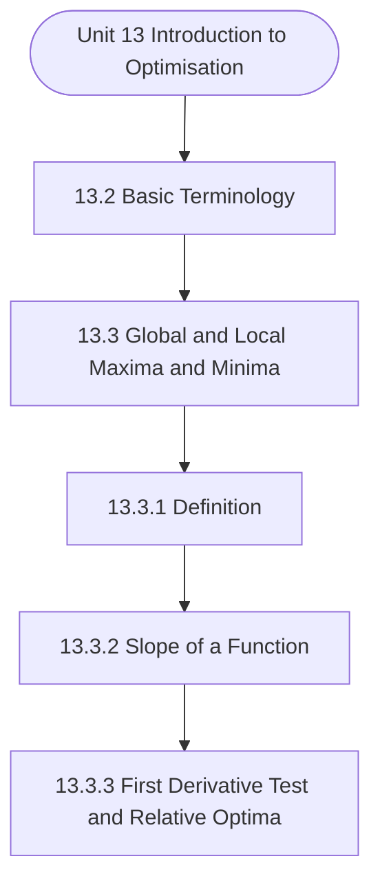

# MCS-066: Mathematical Foundations - II
## Unit 13: Introduction to Optimisation

> 📚 **Programme:** M.Sc. (Data Science and Analytics) | **Semester:** Semester 2  
> ⏱️ **Estimated Study Time:** ~101 mins | 📄 **Textbook Pages:** 40 Pages  
> 📥 **Original PDF:** [Download & View Authentic Textbook](../../../pdfs/Semester_2/MCS-066_Mathematical_Foundations_-_II/Unit-13_Introduction_to_Optimisation.pdf)

---

### 🎯 Executive Concept & Data Science Relevance
In modern data systems, **Introduction to Optimisation** forms a vital conceptual pillar. Calculus powers continuous optimization in Machine Learning. Loss function minimization via Gradient Descent, backpropagation in deep neural networks, and probability density integration all require derivatives, partial differentials, and definite integrals.

> [!NOTE]
> **Why this matters for your career:** Mastering introduction to optimisation equips you with the foundational principles required to reason mathematically about high-dimensional datasets, evaluate algorithm performance, and avoid statistical pitfalls in production machine learning pipelines.

### 🗺️ Visual Knowledge Architecture
The following concept map illustrates the structural hierarchy and learning trajectory of this module:



### 📖 Core Definitions & Terminology Cards

> 📌 **Derivative $f'(x)$**  
> - **Formal Definition:** The instantaneous rate of change of $f(x)$ with respect to $x$: $f'(x) = \lim_{h \to 0} \frac{f(x+h) - f(x)}{h}$.  
> - 💡 **Practical Intuition & Analogy:** *The slope of the tangent line to the curve at point $x$, indicating direction of steepest increase.*

> 📌 **Gradient $\nabla f(\mathbf{x})$**  
> - **Formal Definition:** The vector of first-order partial derivatives of a multivariate function: $\nabla f = \left[\frac{\partial f}{\partial x_1}, \dots, \frac{\partial f}{\partial x_n}\right]^T$. Points in the direction of greatest rate of increase.  
> - 💡 **Practical Intuition & Analogy:** *The compass pointing uphill on a multidimensional loss landscape.*

> 📌 **Definite Integral**  
> - **Formal Definition:** The signed area under curve $f(x)$ bounded by $[a, b]$: $\int_a^b f(x) dx = F(b) - F(a)$ where $F'(x) = f(x)$.  
> - 💡 **Practical Intuition & Analogy:** *Accumulating continuous probabilities or continuous signals across a range of values.*

> 📌 **Critical Point**  
> - **Formal Definition:** A point $x_0$ where $f'(x_0) = 0$ or the derivative is undefined. Evaluated with second derivative $f''(x_0) > 0$ (local min) or $f''(x_0) < 0$ (local max).  
> - 💡 **Practical Intuition & Analogy:** *The bottom of the valley where model training reaches minimal loss.*

### ⚡ Governing Mathematical Laws & Formula Cheatsheet
#### 🔹 Chain Rule for Composite Functions
$$
\frac{d}{dx}[f(g(x))] = f'(g(x)) \cdot g'(x)
$$
- **Explanation:** The mathematical foundation of deep learning backpropagation through multi-layer neural networks.

#### 🔹 Product and Quotient Rules
$$
(uv)' = u'v + uv', \quad \left(\frac{u}{v}\right)' = \frac{u'v - uv'}{v^2}
$$
- **Explanation:** Rules for differentiating multiplied or divided feature combinations.

#### 🔹 Gradient Descent Parameter Update
$$
\mathbf{w}^{(t+1)} = \mathbf{w}^{(t)} - \alpha \nabla_{\mathbf{w}} \mathcal{L}(\mathbf{w})
$$
- **Explanation:** Iterative step against the gradient direction scaled by learning rate $\alpha$ to reach minimal loss.

#### 🔹 Taylor Series Expansion (First-Order Approximation)
$$
f(x) \approx f(a) + f'(a)(x - a) + \frac{f''(a)}{2!}(x - a)^2
$$
- **Explanation:** Approximates complex non-linear loss surfaces locally using tangent hyperplanes and quadratic forms.

### ⚖️ Axiomatic Properties & Governing Laws
The mathematical formulations of this module are anchored by foundational algebraic and structural laws:

- **Linearity of Differentiation:** $\frac{d}{dx}[a f(x) + b g(x)] = a f'(x) + b g'(x)$
- **Second Derivative Test:** $f'(x_0) = 0 \land f''(x_0) > 0 \implies \text{Local Minimum}$
- **Convexity Condition:** $\nabla^2 f(\mathbf{x}) \succeq 0 \quad (\text{Hessian is Positive Semi-Definite})$

### 📌 Comprehensive Section-by-Section Study Breakdown
#### `13.2` Basic Terminology
##### 📘 Theoretical Principles & In-Depth Exposition
The concept of global and local optima 3. Use derivatives to find the extrema’s 4. Extreme cases when extrema are cannot be addressed. Use of Gradient descent to find the minima and use of gradient ascent to find maxima. Define stochastic gradient descent. Explain the concept of randomisation Analysing data and Optimisation

##### ⚙️ Mathematical & Algorithmic Mechanics
- **Formal Mechanics:** Establishes symbolic transformations and state invariants governing basic terminology.
- **Boundary Invariants:** Ensures robust error-handling, non-empty set guarantees, and strict asymptotic bounds.

##### 📊 Practical Data Science & Production Relevance
- **Industry Application:** Directly implemented in production workflows such as SQL query filters, pandas vectorized operations, and feature transformation pipelines.
- **Production Pitfall:** Failing to verify membership bounds or missing edge cases in basic terminology can cause silent data corruption or performance bottlenecks.

> [!TIP]
> **Key Exam & Technical Interview Takeaway:** Be prepared to define basic terminology formally, cite its core mathematical invariants, and solve step-by-step numerical/proof questions.

#### `13.3` Global and Local Maxima and Minima
##### 📘 Theoretical Principles & In-Depth Exposition
GLOBAL AND LOCAL MAXIMA AND MINIMA Several computer science problems, called optimisation problems, require you to find the maximum or the minimum value for an objective function. These extreme points, which form the solution to the problem, are called maxima or minima. For example, the Knapsack problem maximises the profit while packing a number of items in a sack/bag of finite capacity (weight), given the weight and profit of each item.

On the other hand, a travelling salesman minimises the distance covered by a salesperson in their visit to several destinations. Let us mathematically define the concept of maxima and minima. Suppose the relationship between y and x can be graphically represented by Fig. The point at which the graph of the function stops increasing and starts declining (see point A) looks like a little hilltop, and the value that the function attains at this point is the largest it attains in its immediate vicinity.

Conversely, the point on the graph (see point B) where the function stops decreasing and begins increasing looks like a little valley, and the value that the function attains at this point is the minimum in its immediate vicinity. Definition 1: If f (x0)  f (x) for all x sufficiently close to x0, then f (x0) is said to be a relative maximum.

##### ⚙️ Mathematical & Algorithmic Mechanics
- **Formal Mechanics:** Establishes symbolic transformations and state invariants governing global and local maxima and minima.
- **Boundary Invariants:** Ensures robust error-handling, non-empty set guarantees, and strict asymptotic bounds.

##### 📊 Practical Data Science & Production Relevance
- **Industry Application:** Directly implemented in production workflows such as SQL query filters, pandas vectorized operations, and feature transformation pipelines.
- **Production Pitfall:** Failing to verify membership bounds or missing edge cases in global and local maxima and minima can cause silent data corruption or performance bottlenecks.

> [!TIP]
> **Key Exam & Technical Interview Takeaway:** Be prepared to define global and local maxima and minima formally, cite its core mathematical invariants, and solve step-by-step numerical/proof questions.

#### `13.3.1` Definition
##### 📘 Theoretical Principles & In-Depth Exposition
Let us first define basic terms: local minima, local maxima, global minimum and global maximum. Local Minima (Maxima): A function y = f(x) is said to have local minima (maxima) at a point x = a in its domain if there exists a  0, such that: f(x)  f(a) (f(x)  f(a))  x  ((a − ), (a+ )) For example, in Fig.13.3, the function y = f(x) has local minima at the points x2, x4 and x6, while this function has local maxima at the points x1, x3, and x5.

Global Minimum (Maximum): A function y = f(x) is said to have a global minimum (maximum) at a point x = a in its domain D if: f(x)  f(a) (f(x)  f(a))  x  D For example, if D = [x1, x6], then graphically (see Fig. 13.3), we see that the global minimum of the function is at the point x = x2, while the global maximum of the function is at the point x = x3.

So, a global minimum means the function takes the minimum value at that point compared to the values of the function at all other points of the domain of the function. Similarly, global maximum means function takes maxima value at that point compared to the values of the function at all other points of the domain of the function.

##### ⚙️ Mathematical & Algorithmic Mechanics
- **Formal Mechanics:** Establishes symbolic transformations and state invariants governing definition.
- **Boundary Invariants:** Ensures robust error-handling, non-empty set guarantees, and strict asymptotic bounds.

##### 📊 Practical Data Science & Production Relevance
- **Industry Application:** Directly implemented in production workflows such as SQL query filters, pandas vectorized operations, and feature transformation pipelines.
- **Production Pitfall:** Failing to verify membership bounds or missing edge cases in definition can cause silent data corruption or performance bottlenecks.

> [!TIP]
> **Key Exam & Technical Interview Takeaway:** Be prepared to define definition formally, cite its core mathematical invariants, and solve step-by-step numerical/proof questions.

#### `13.3.2` Slope of a Function
##### 📘 Theoretical Principles & In-Depth Exposition
The relative extreme values of a function can also be characterised in terms of its slope. Assume that the total cost (C) incurred by a producer depends on his output (Q) alone. The relationship between total cost and output is represented by the inverse S-shaped curve shown in Fig.

Analysing data and Optimisation Figure 13.4: Slope of a function Suppose, to begin with, the producer is producing OQ1 level of output at a cost of OC1. This output-cost combination corresponds to point T at the total cost curve. To produce an additional output of Q1Q3, the producer has to increase his cost by the amount C1C3, thus C/Q = C1C3 / Q1Q3.

Geometrically, this is the ratio of the two line segments, BR/TR and is equal to the slope of the chord TB. This ratio measures the average rate of change in cost for a particular change in output. If we vary the magnitude of change in output, reducing it to smaller margins, what happens to the total cost?

##### ⚙️ Mathematical & Algorithmic Mechanics
- **Formal Mechanics:** Establishes symbolic transformations and state invariants governing slope of a function.
- **Boundary Invariants:** Ensures robust error-handling, non-empty set guarantees, and strict asymptotic bounds.

##### 📊 Practical Data Science & Production Relevance
- **Industry Application:** Directly implemented in production workflows such as SQL query filters, pandas vectorized operations, and feature transformation pipelines.
- **Production Pitfall:** Failing to verify membership bounds or missing edge cases in slope of a function can cause silent data corruption or performance bottlenecks.

> [!TIP]
> **Key Exam & Technical Interview Takeaway:** Be prepared to define slope of a function formally, cite its core mathematical invariants, and solve step-by-step numerical/proof questions.

#### `13.3.3` First Derivative Test and Relative Optima
##### 📘 Theoretical Principles & In-Depth Exposition
If the first derivative of a function f (x) at x = x0 i.e., if f (x0) = 0, then the value of the function at x0 i.e., f (x0) will be (i) A relative maximum - if the derivative f (x) changes its sign from positive to negative from the immediate left of the point x0 to its immediate right.

(ii) A relative minimum - if the derivative f (x) changes its sign from negative to positive from the immediate left of the point x0 to its immediate right. Introduction to Optimisation (iii) Neither a relative maximum nor a relative minimum if f (x) has the same sign on both the immediate left and right of the point x0.

The value of the dependent variable, at which the first derivative of the function is equal to zero, i.e. at x0, is referred to as the critical value of x. The value of the function at its critical point i.e. f (x0) is known as the stationary value. The point with the coordinates equal to x0 and f (x0) is accordingly called the stationary point.

##### ⚙️ Mathematical & Algorithmic Mechanics
- **Formal Mechanics:** Establishes symbolic transformations and state invariants governing first derivative test and relative optima.
- **Boundary Invariants:** Ensures robust error-handling, non-empty set guarantees, and strict asymptotic bounds.

##### 📊 Practical Data Science & Production Relevance
- **Industry Application:** Directly implemented in production workflows such as SQL query filters, pandas vectorized operations, and feature transformation pipelines.
- **Production Pitfall:** Failing to verify membership bounds or missing edge cases in first derivative test and relative optima can cause silent data corruption or performance bottlenecks.

> [!TIP]
> **Key Exam & Technical Interview Takeaway:** Be prepared to define first derivative test and relative optima formally, cite its core mathematical invariants, and solve step-by-step numerical/proof questions.

#### `13.3.4` The Problem of Non-Differentiability
##### 📘 Theoretical Principles & In-Depth Exposition
So far, we have assumed that the function is a continuous, differentiable function. In this section, we will look into two cases where this restrictive assumption is relaxed. Introduction to Optimisation In Fig. 13.8 and 13.9, we represent relationships between x and y that exhibit two important types of irregularities.

13.8, the function is discontinuous at x1. At x1, the graph has a complete break or discontinuity AB. The difficulty is that in this discontinuous stretch, the first derivative of the function is not even defined. It is not possible to draw a unique tangent to the curve at these points.

However, note at A, the function attains a maxima i.e., at x1 the dependent variable y attains the largest possible value. A similar kind of problem is also encountered in case of the function exhibited in Fig. In this case, the graph of the function has a kink at point C corresponding to x2.

##### ⚙️ Mathematical & Algorithmic Mechanics
- **Formal Mechanics:** Establishes symbolic transformations and state invariants governing the problem of non-differentiability.
- **Boundary Invariants:** Ensures robust error-handling, non-empty set guarantees, and strict asymptotic bounds.

##### 📊 Practical Data Science & Production Relevance
- **Industry Application:** Directly implemented in production workflows such as SQL query filters, pandas vectorized operations, and feature transformation pipelines.
- **Production Pitfall:** Failing to verify membership bounds or missing edge cases in the problem of non-differentiability can cause silent data corruption or performance bottlenecks.

> [!TIP]
> **Key Exam & Technical Interview Takeaway:** Be prepared to define the problem of non-differentiability formally, cite its core mathematical invariants, and solve step-by-step numerical/proof questions.

#### `13.3.5` The Second-Order Derivative and Condition for Optima
##### 📘 Theoretical Principles & In-Depth Exposition
Assuming that the first derivative f (x) is itself a function of x, the second derivative of the function is obtained by differentiating this function again with respect to x. Symbolically, the second derivative is represented as f (x). The double prime indicates that the function y = f (x) has been differentiated twice with respect to x.

The expression (x) following the double prime indicates that the second derivative is also a function of x. If the second derivative f (x) exists for all values in the domain, the function f (x) is said to be twice differentiable; if, in addition, f (x) is continuous, the function f (x) is said to be twice continuously differentiable.

Example 5: Find the second derivative of the following function y = f (x) = 4x3 + 5x 2 − 3x + 10 Step 1: Differentiate the equation in Example 5 with respect to x to find the first derivative. We obtain the following equation: f (x) = 12x2 + 10x − 3 Step 2: Now differentiate this equation with respect to x to obtain the second derivative of the original function: f ''(x) = 24x + 10 The first derivative of the function i.e., f (x) measures the slope of the function or the rate of change of the function.

##### ⚙️ Mathematical & Algorithmic Mechanics
- **Formal Mechanics:** Establishes symbolic transformations and state invariants governing the second-order derivative and condition for optima.
- **Boundary Invariants:** Ensures robust error-handling, non-empty set guarantees, and strict asymptotic bounds.

##### 📊 Practical Data Science & Production Relevance
- **Industry Application:** Directly implemented in production workflows such as SQL query filters, pandas vectorized operations, and feature transformation pipelines.
- **Production Pitfall:** Failing to verify membership bounds or missing edge cases in the second-order derivative and condition for optima can cause silent data corruption or performance bottlenecks.

> [!TIP]
> **Key Exam & Technical Interview Takeaway:** Be prepared to define the second-order derivative and condition for optima formally, cite its core mathematical invariants, and solve step-by-step numerical/proof questions.

#### `13.4` Gradient Descent and Ascent
##### 📘 Theoretical Principles & In-Depth Exposition
Sometimes, analytic methods do not work to solve optimisation problems. So, we need some method that, if not exact, at least can provide an approximate solution. The gradient descent method is one such method that is discussed in this section. But, before we discuss the gradient descent method, let us describe some terms.

Suppose we have a function: ( ) n w f x , x , x , , x = ฀ then the Gradient of this function is given by (using partial derivatives) n f x f x f f x               =               ฀ …(13.1) Analysing data and Optimisation Similarly, the Jacobian of f is a row vector given by f n f f f f J x x x x       =         ฀ … (13.2) From (13.1) and (13.2) note that ( ) T fJ f =  … (13.3) Hessian matrix is an n by n matrix formed by all second-order partial derivatives and is given by n n n n n n n f f f f x x x x x x x f f f f x x x x x x x H f f f f x x x x x x x f f f f x x x x x x x                                  =                                       ฀ ฀ ฀ ฀฀฀฀฀ ฀ … (13.4) Taylor’s theorem for this can be written as follows.

( ) ( )   (a, b) (a, b) h f f f a h , b h f a, b h x y f f h x y x 1 h h h f f y x y       + + = +                       + +               ฀ … (13.5) Or ( ) ( ) ( ) ( ) T T f f a h , b h f a, b f X h h H X h + + = +  + +฀ … (13.6) where ( ) h f f f X evaluated at the point X (a, b), h h x y        = = =           and … (13.7) f (a, b) f f x y x H f f y x y           = =           value of Hessian matrix evaluated at the point (a, b) … (13.8) The gradient descent method is an iterative method.

##### ⚙️ Mathematical & Algorithmic Mechanics
- **Formal Mechanics:** Establishes symbolic transformations and state invariants governing gradient descent and ascent.
- **Boundary Invariants:** Ensures robust error-handling, non-empty set guarantees, and strict asymptotic bounds.

##### 📊 Practical Data Science & Production Relevance
- **Industry Application:** Directly implemented in production workflows such as SQL query filters, pandas vectorized operations, and feature transformation pipelines.
- **Production Pitfall:** Failing to verify membership bounds or missing edge cases in gradient descent and ascent can cause silent data corruption or performance bottlenecks.

> [!TIP]
> **Key Exam & Technical Interview Takeaway:** Be prepared to define gradient descent and ascent formally, cite its core mathematical invariants, and solve step-by-step numerical/proof questions.

### 📐 Step-by-Step Solved Mathematical Examples
To solidify your theoretical understanding, work through these fully solved, step-by-step mathematical problems:

#### 🧮 Example 1: Analytical Loss Minimization (Ordinary Least Squares)
> **Problem Statement:**  
> Given simple Mean Squared Error $\mathcal{L}(w) = \frac{1}{2} \sum_{i=1}^n (y_i - w x_i)^2$. Find the optimal parameter $w^*$ that minimizes $\mathcal{L}(w)$ using calculus.

**Detailed Step-by-Step Solution:**

1. **Differentiate loss with respect to parameter $w$:**
$$
\frac{d\mathcal{L}}{dw} = \frac{1}{2} \sum_{i=1}^n 2(y_i - w x_i)(-x_i) = -\sum_{i=1}^n (x_i y_i - w x_i^2)
$$

2. **Set derivative to zero for critical point:**
$$
-\sum x_i y_i + w \sum x_i^2 = 0 \implies w^* = \frac{\sum x_i y_i}{\sum x_i^2}
$$

3. **Second Derivative Test:** $\frac{d^2\mathcal{L}}{dw^2} = \sum x_i^2 > 0$ for non-zero data. Guarantees global minimum.

#### 🧮 Example 2: Gradient Descent Numerical Step
> **Problem Statement:**  
> Given quadratic loss $f(w) = w^2 - 6w + 10$. Starting from $w^{(0)} = 0$ with learning rate $\alpha = 0.2$, perform two iterations of Gradient Descent.

**Detailed Step-by-Step Solution:**

1. **Gradient:** $f'(w) = 2w - 6$.

2. **Iteration 1:**
$$
abla f(0) = 2(0) - 6 = -6
$$
$$
w^{(1)} = w^{(0)} - \alpha f'(0) = 0 - 0.2(-6) = 1.2
$$

3. **Iteration 2:**
$$
abla f(1.2) = 2(1.2) - 6 = 2.4 - 6 = -3.6
$$
$$
w^{(2)} = 1.2 - 0.2(-3.6) = 1.2 + 0.72 = 1.92
$$

(Approaches true analytical minimum $w^* = 3$ rapidly).

### 💻 Practical Data Science Implementation (Python)
Theory translates directly into production algorithms. Below is a self-contained, commented Python implementation illustrating the core operations of this unit:

```python
# Gradient Descent Optimizer from scratch
import numpy as np

def loss_func(w):
    return (w - 3.0)**2 + 1.0

def grad_func(w):
    return 2 * (w - 3.0)

# Optimization loop
w = 0.0
lr = 0.1
for step in range(25):
    grad = grad_func(w)
    w = w - lr * grad
    if step % 5 == 0:
        print(f"Step {step:2d} | w = {w:.4f} | Loss = {loss_func(w):.4f}")

print(f"Converged optimal weight: {w:.4f} (True: 3.0000)")
```

### 💡 Interactive Self-Assessment Checkpoints
Test your comprehension before proceeding. Tap each question to reveal the comprehensive explanation:

<details>
<summary><b>Checkpoint 1:</b> What is the Chain Rule and why is it essential in Deep Learning? <i>(Tap to reveal answer)</i></summary>

> **Answer & Analysis:**  
> The Chain Rule states $\frac{dy}{dx} = \frac{dy}{du} \cdot \frac{du}{dx}$. In deep networks, it allows computing the gradient of the loss with respect to early layer weights by propagating backwards layer-by-layer.
</details>

<details>
<summary><b>Checkpoint 2:</b> How do you classify a critical point where $f'(x) = 0$ using the Second Derivative Test? <i>(Tap to reveal answer)</i></summary>

> **Answer & Analysis:**  
> If $f''(x) > 0$, the point is a **local minimum**. If $f''(x) < 0$, it is a **local maximum**. If $f''(x) = 0$, the test is inconclusive (inflection point).
</details>

<details>
<summary><b>Checkpoint 3:</b> What is the derivative of $\ln(x)$ and $e^x$? <i>(Tap to reveal answer)</i></summary>

> **Answer & Analysis:**  
> $\frac{d}{dx}[\ln(x)] = \frac{1}{x}$ (for $x > 0$), and $\frac{d}{dx}[e^x] = e^x$.
</details>

<details>
<summary><b>Checkpoint 4:</b> Find the maximum and minimum values of (a) y = x <i>(Tap to reveal answer)</i></summary>

> **Answer & Analysis:**  
> This question tests your conceptual mastery of Introduction to Optimisation. Review the governing formulas and section breakdowns above to formulate a complete, rigorous proof or derivation.
</details>

<details>
<summary><b>Checkpoint 5:</b> Find the relative maxima and minima of y by the second-derivative test: (a) y = x <i>(Tap to reveal answer)</i></summary>

> **Answer & Analysis:**  
> This question tests your conceptual mastery of Introduction to Optimisation. Review the governing formulas and section breakdowns above to formulate a complete, rigorous proof or derivation.
</details>

<details>
<summary><b>Checkpoint 6:</b> In the gradient descent method, instead of selecting an optimal value of k  at each step, what are the possible problems that we may face if we take a fixed constant value of k  in each iteration? <i>(Tap to reveal answer)</i></summary>

> **Answer & Analysis:**  
> This question tests your conceptual mastery of Introduction to Optimisation. Review the governing formulas and section breakdowns above to formulate a complete, rigorous proof or derivation.
</details>

### 🎯 Executive Module Wrap-Up
- **Central Idea:** Introduction to Optimisation provides essential mathematical and algorithmic tools directly utilized in Data Science.
- **Mathematical Rigor:** Formulas and laws must be memorized with attention to boundary conditions and assumptions.
- **Full Textbook Coverage:** For exhaustive multi-page derivations, proofs, and supplementary exercises, consult the [Authentic IGNOU Textbook](../../../pdfs/Semester_2/MCS-066_Mathematical_Foundations_-_II/Unit-13_Introduction_to_Optimisation.pdf).

---
### 🧭 Navigation & Syllabus Index
[⬅ Previous: Unit 12](unit_12_Categorical_Data_Analysis.md) | [📑 Course Index](README.md)
