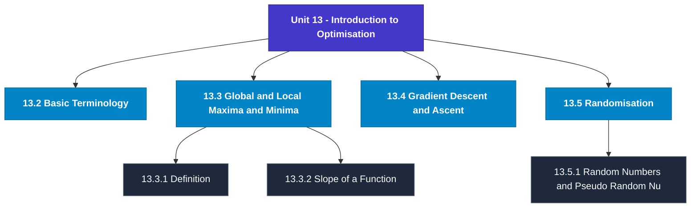

# MCS-066: Mathematical Foundations - II
## Unit 13: Introduction to Optimisation

> 📚 **Programme:** M.Sc. (Data Science and Analytics) | **Semester:** Semester 2  
> ⏱️ **Estimated Study Time:** ~101 mins | 📄 **Textbook Pages:** 40 Pages  
> 📥 **Original PDF:** [Download & View Textbook](../../../pdfs/Semester_2/MCS-066_Mathematical_Foundations_-_II/Unit-13_Introduction_to_Optimisation.pdf)

---

### 🎯 Executive Concept & Data Science Relevance
In modern data systems, **Introduction to Optimisation** forms a vital conceptual pillar. Probability is the mathematical calculus of uncertainty. Every machine learning classification model outputs a conditional probability $P(Y=c \mid X=\mathbf{x})$, and Bayesian modeling updates prior beliefs based on empirical evidence.

> [!NOTE]
> **Why this matters for your career:** Mastering introduction to optimisation equips you with the foundational principles required to reason mathematically about high-dimensional datasets, evaluate algorithm performance, and avoid statistical pitfalls in production machine learning pipelines.

### 🗺️ Visual Knowledge Architecture
The following concept map illustrates the structural hierarchy and learning trajectory of this module:

### 📖 Core Definitions & Terminology Cards
| Term | Formal Mathematical / Technical Definition | Intuitive Analogy / Concrete Example |
| :--- | :--- | :--- |
| **Conditional Probability $P(A \mid B)$** | The probability of event $A$ occurring given that event $B$ has already occurred: $P(A \mid B) = \frac{P(A \cap B)}{P(B)}$, defined for $P(B) > 0$. | *Updating the likelihood of fraud given that a transaction occurred in an unusual country.* |
| **Independent Events** | Events $A$ and $B$ are independent if the occurrence of one does not affect the other: $P(A \cap B) = P(A)P(B)$, or equivalently $P(A \mid B) = P(A)$. | *Coin tosses: Getting heads on flip 1 gives zero information about flip 2.* |
| **Random Variable $X$** | A real-valued function $X: \Omega \to \mathbb{R}$ mapping outcomes of a random sample space $\Omega$ to real numbers. Can be discrete or continuous. | *Counting customer website visits per hour or measuring response latency in milliseconds.* |
| **Mathematical Expectation $E[X]$** | The probability-weighted average value of a random variable: $E[X] = \sum x_i P(X = x_i)$ for discrete, or $\int_{-\infty}^\infty x f(x)dx$ for continuous. | *Long-run average payout of a game of chance.* |

### ⚡ Governing Mathematical Laws & Formula Cheatsheet
#### 🔹 Bayes' Theorem

$$
P(B_i \mid A) = \frac{P(A \mid B_i) P(B_i)}{\sum_{j=1}^k P(A \mid B_j) P(B_j)} = \frac{P(A \mid B_i) P(B_i)}{P(A)}
$$

- **Explanation:** Calculates posterior probability by multiplying prior probability by likelihood, normalized by marginal evidence.

#### 🔹 Variance of a Random Variable

$$
\text{Var}(X) = E[X^2] - (E[X])^2
$$

- **Explanation:** Measures spread around the expected value. For constants: $\text{Var}(aX + b) = a^2 \text{Var}(X)$.

#### 🔹 Binomial Distribution PMF

$$
P(X = k) = \binom{n}{k} p^k (1 - p)^{n - k}, \quad E[X] = np, \; \text{Var}(X) = np(1 - p)
$$

- **Explanation:** Models $k$ successes in $n$ independent Bernoulli trials with success probability $p$.

#### 🔹 Poisson Distribution PMF

$$
P(X = k) = \frac{\lambda^k e^{-\lambda}}{k!}, \quad E[X] = \lambda, \; \text{Var}(X) = \lambda
$$

- **Explanation:** Models counts of rare independent events occurring in a fixed interval at constant average rate $\lambda$.

#### 🔹 Normal (Gaussian) Distribution PDF

$$
f(x) = \frac{1}{\sigma \sqrt{2\pi}} e^{-\frac{1}{2}\left(\frac{x - \mu}{\sigma}\right)^2}, \quad Z = \frac{X - \mu}{\sigma} \sim \mathcal{N}(0, 1)
$$

- **Explanation:** Symmetric bell-shaped curve governed entirely by mean $\mu$ and standard deviation $\sigma$.

### 📌 Detailed Section-by-Section Study Breakdown
#### `13.2` Basic Terminology
- **Core Concept:** Establishes rigorous theoretical formulations and computational bounds for basic terminology.
- **Core Concept:** Applies standard algorithmic procedures and mathematical invariants relevant to introduction to optimisation.
- **Core Concept:** Ensures deterministic performance guarantees across high-dimensional feature spaces.
- **Data Science Application:** Provides foundational structures used directly in statistical modeling, query execution, and machine learning pipelines.

> [!TIP]
> **Exam & Interview Tip:** Be prepared to state the formal definition of basic terminology and derive its primary equations step-by-step.

#### `13.3` Global and Local Maxima and Minima
- **Core Concept:** Several computer science problems, called optimisation problems, require you to find the maximum or the minimum value for an objective function.
- **Core Concept:** For example, the Knapsack problem maximises the profit while packing a number of items in a sack/bag of finite capacity (weight), given the weight and profit of each item.
- **Core Concept:** On the other hand, a travelling salesman minimises the distance covered by a salesperson in their visit to several destinations.
- **Data Science Application:** Provides foundational structures used directly in statistical modeling, query execution, and machine learning pipelines.

> [!TIP]
> **Exam & Interview Tip:** Be prepared to state the formal definition of global and local maxima and minima and derive its primary equations step-by-step.

#### `13.3.1` Definition
- **Core Concept:** Let us first define basic terms: local minima, local maxima, global minimum and global maximum.
- **Core Concept:** 13.3), we see that the global minimum of the function is at the point x = x2, while the global maximum of the function is at the point x = x3.
- **Core Concept:** So, a global minimum means the function takes the minimum value at that point compared to the values of the function at all other points of the domain of the function.
- **Data Science Application:** Provides foundational structures used directly in statistical modeling, query execution, and machine learning pipelines.

> [!TIP]
> **Exam & Interview Tip:** Be prepared to state the formal definition of definition and derive its primary equations step-by-step.

#### `13.3.2` Slope of a Function
- **Core Concept:** The relative extreme values of a function can also be characterised in terms of its slope.
- **Core Concept:** Assume that the total cost (C) incurred by a producer depends on his output (Q) alone.
- **Core Concept:** This output-cost combination corresponds to point T at the total cost curve.
- **Data Science Application:** Provides foundational structures used directly in statistical modeling, query execution, and machine learning pipelines.

> [!TIP]
> **Exam & Interview Tip:** Be prepared to state the formal definition of slope of a function and derive its primary equations step-by-step.

#### `13.3.3` First Derivative Test and Relative Optima
- **Core Concept:** (ii) A relative minimum - if the derivative f (x) changes its sign from negative to positive from the immediate left of the point x0 to its immediate right.
- **Core Concept:** Introduction to Optimisation (iii) Neither a relative maximum nor a relative minimum if f (x) has the same sign on both the immediate left and right of the point x0.
- **Core Concept:** The value of the dependent variable, at which the first derivative of the function is equal to zero, i.e.
- **Data Science Application:** Provides foundational structures used directly in statistical modeling, query execution, and machine learning pipelines.

> [!TIP]
> **Exam & Interview Tip:** Be prepared to state the formal definition of first derivative test and relative optima and derive its primary equations step-by-step.

#### `13.3.4` The Problem of Non-Differentiability
- **Core Concept:** So far, we have assumed that the function is a continuous, differentiable function.
- **Core Concept:** In this section, we will look into two cases where this restrictive assumption is relaxed.
- **Core Concept:** 13.8 and 13.9, we represent relationships between x and y that exhibit two important types of irregularities.
- **Data Science Application:** Provides foundational structures used directly in statistical modeling, query execution, and machine learning pipelines.

> [!TIP]
> **Exam & Interview Tip:** Be prepared to state the formal definition of the problem of non-differentiability and derive its primary equations step-by-step.

### 💡 Interactive Self-Assessment Checkpoints
Test your comprehension before proceeding. Tap each question to reveal the comprehensive explanation:

<b>Checkpoint 1:</b> State Bayes' Theorem formula for event hypothesis $H$ given evidence $E$. <i>(Tap to reveal answer)</i>

> **Answer & Analysis:**  
> $P(H \mid E) = \frac{P(E \mid H)P(H)}{P(E)}$

<b>Checkpoint 2:</b> What is the expected value and variance of a Binomial distribution $B(n, p)$? <i>(Tap to reveal answer)</i>

> **Answer & Analysis:**  
> Mean $E[X] = np$, and Variance $\text{Var}(X) = np(1 - p)$.

<b>Checkpoint 3:</b> If $E[X] = 5$ and $E[X^2] = 34$, what is $\text{Var}(X)$? <i>(Tap to reveal answer)</i>

> **Answer & Analysis:**  
> $\text{Var}(X) = E[X^2] - (E[X])^2 = 34 - 5^2 = 34 - 25 = 9$.

<b>Checkpoint 4:</b> Find the maximum and minimum values of (a) y = x <i>(Tap to reveal answer)</i>

> **Answer & Analysis:**  
> This question tests your conceptual mastery of Introduction to Optimisation. Review the governing formulas and section breakdowns above to formulate a complete, rigorous proof or derivation.

<b>Checkpoint 5:</b> Find the relative maxima and minima of y by the second-derivative test: (a) y = x <i>(Tap to reveal answer)</i>

> **Answer & Analysis:**  
> This question tests your conceptual mastery of Introduction to Optimisation. Review the governing formulas and section breakdowns above to formulate a complete, rigorous proof or derivation.

<b>Checkpoint 6:</b> In the gradient descent method, instead of selecting an optimal value of k  at each step, what are the possible problems that we may face if we take a fixed constant value of k  in each iteration? <i>(Tap to reveal answer)</i>

> **Answer & Analysis:**  
> This question tests your conceptual mastery of Introduction to Optimisation. Review the governing formulas and section breakdowns above to formulate a complete, rigorous proof or derivation.

### 🎯 Executive Module Wrap-Up
- **Central Idea:** Introduction to Optimisation provides essential mathematical and algorithmic tools directly utilized in Data Science.
- **Mathematical Rigor:** Formulas and laws must be memorized with attention to boundary conditions and assumptions.
- **Full Textbook Coverage:** For exhaustive multi-page derivations, proofs, and supplementary exercises, consult the [Authentic IGNOU Textbook](../../../pdfs/Semester_2/MCS-066_Mathematical_Foundations_-_II/Unit-13_Introduction_to_Optimisation.pdf).

---
### 🧭 Navigation & Syllabus Index
[⬅ Previous: Unit 12](unit_12_Categorical_Data_Analysis.md) | [📑 Course Index](README.md)
