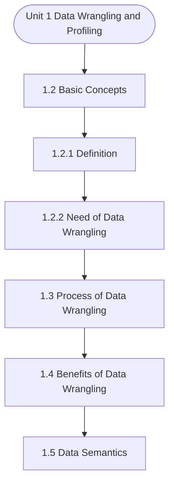

# MCS-067: Data Wrangling and Visualization
## Unit 1: Data Wrangling and Profiling

> 📚 **Programme:** M.Sc. (Data Science and Analytics) | **Semester:** Semester 2  
> ⏱️ **Estimated Study Time:** ~37 mins | 📄 **Textbook Pages:** 20 Pages  
> 📥 **Original PDF:** [Download & View Authentic Textbook](../../../pdfs/Semester_2/MCS-067_Data_Wrangling_and_Visualization/Unit-1_Data_Wrangling_and_Profiling.pdf)

---

### 🎯 Executive Concept & Data Science Relevance
In modern data systems and advanced analytics, **Data Wrangling and Profiling** forms a vital conceptual pillar. Descriptive statistics provide quantitative summaries of dataset properties. Measures of central tendency identify typical values, while measures of dispersion quantify data spread, uncertainty, and variability—critical for feature normalization and anomaly detection.

> [!NOTE]
> **Why this matters for your career:** Mastering data wrangling and profiling equips you with the foundational principles required to reason mathematically about high-dimensional datasets, evaluate algorithm performance, and avoid statistical pitfalls in production machine learning pipelines.

### 🗺️ Visual Knowledge Architecture
The following concept map illustrates the structural hierarchy and learning trajectory of this module:



### 📖 Core Definitions & Terminology Cards

> 📌 **Arithmetic Mean $\bar{x}$ or $\mu$**  
> - **Formal Definition:** The sum of all observations divided by the total number of observations: $\bar{x} = \frac{1}{n}\sum_{i=1}^n x_i$. Sensitive to extreme outliers.  
> - 💡 **Practical Intuition & Analogy:** *The center of mass or balance point of the distribution.*

> 📌 **Median**  
> - **Formal Definition:** The physical middle value separating the higher half from the lower half of an ordered dataset. Robust against outliers.  
> - 💡 **Practical Intuition & Analogy:** *The 50th percentile value where exactly half the data lies above and half below.*

> 📌 **Standard Deviation $\sigma$ or $s$**  
> - **Formal Definition:** The square root of variance, measuring average dispersion in original units: $s = \sqrt{\frac{1}{n-1}\sum (x_i - \bar{x})^2}$.  
> - 💡 **Practical Intuition & Analogy:** *The typical distance data points deviate from the mean.*

> 📌 **Coefficient of Variation ($CV$)**  
> - **Formal Definition:** Relative dispersion measure expressed as a percentage: $CV = \frac{\sigma}{\mu} \times 100\%$. Enables comparison across different measurement scales.  
> - 💡 **Practical Intuition & Analogy:** *Comparing stock volatility across assets priced at 10 USD vs 1,000 USD.*

### ⚡ Governing Mathematical Laws & Formula Cheatsheet
#### 🔹 Sample Variance Formula (Bessel's Correction)
$$
\begin{aligned} s^2 & = \frac{1}{n - 1} \sum_{i=1}^n (x_i - \bar{x})^2 \\ & = \frac{\sum x_i^2 - \frac{(\sum x_i)^2}{n}}{n - 1} \end{aligned}
$$
- **Explanation:** Using $n-1$ in the denominator corrects for downward sample bias, yielding an unbiased estimator of population variance $\sigma^2$.

#### 🔹 Interquartile Range (IQR) & Outlier Bounds
$$
\text{IQR} = Q_3 - Q_1, \quad \text{Outliers} < Q_1 - 1.5(\text{IQR}) \;\lor\; > Q_3 + 1.5(\text{IQR})
$$
- **Explanation:** Standard Tukey boxplot rule for identifying extreme data points robustly.

#### 🔹 Pearson's First Coefficient of Skewness
$$
Sk_1 = \frac{\text{Mean} - \text{Mode}}{\sigma} \quad \text{or} \quad Sk_2 = \frac{3(\text{Mean} - \text{Median})}{\sigma}
$$
- **Explanation:** Measures asymmetry: Positive skew means mean > median (right tail); negative skew means mean < median (left tail).

### ⚖️ Axiomatic Properties & Governing Laws
The mathematical formulations of this module are anchored by foundational algebraic and structural laws:

- **Variance Scaling Rule:** $\text{Var}(aX + b) = a^2 \text{Var}(X)$
- **Standard Deviation Scaling:** $\sigma(aX + b) = \vert a\vert \sigma(X)$
- **Empirical Rule (Normal Distribution):** 68% within $\mu \pm 1\sigma$, 95% within $\mu \pm 2\sigma$, 99.7% within $\mu \pm 3\sigma$

### 📌 Comprehensive Section-by-Section Study Breakdown
#### `1.2` Basic Concepts

##### 📘 Theoretical Principles & Pedagogical Exposition
In probability theory and statistical inference, **Basic Concepts** formalizes the stochastic behavior of random phenomena. Within **Data Wrangling and Profiling**, this framework allows data scientists to infer population parameters from finite empirical samples while quantifying uncertainty via confidence intervals and hypothesis tests.

The mathematical rigor here prevents statistical misinterpretations, such as confusing correlation with causation, overlooking sample selection bias, or violating distributional assumptions.

##### ⚙️ Mathematical & Algorithmic Mechanics
- **Core Mechanism:** Separates operational transaction systems (OLTP) from analytical reporting (OLAP). Organizes analytics into Fact tables (quantitative metrics) and Dimension tables (contextual attributes) in Star or Snowflake schemas. ETL pipelines extract, transform, and load clean data.
- **Boundary Conditions:** Slowly Changing Dimensions (SCD Type 1, 2, 3), late-arriving dimension records, null imputation distortion, and massive distributed partition skew.

##### 📊 Practical Data Science & Production Relevance
- **Production Workflow:** Modern Cloud Data Warehouses (Snowflake, BigQuery, Databricks), automated dbt transformations, and executive business intelligence dashboards (Tableau, PowerBI).
- **Real-World Pitfall:** Over-normalizing OLAP analytical schemas into deeply nested snowflake structures, severely degrading vectorized columnar scan query performance.

> [!TIP]
> **Exam & Technical Interview Insight:** Design a Star Schema for a given business domain (identifying facts and dimensions); contrast OLTP vs OLAP; define Roll-up, Drill-down, Slice, and Dice operations.

#### `1.2.1` Definition

##### 📘 Theoretical Principles & Pedagogical Exposition
In probability theory and statistical inference, **Definition** formalizes the stochastic behavior of random phenomena. Within **Data Wrangling and Profiling**, this framework allows data scientists to infer population parameters from finite empirical samples while quantifying uncertainty via confidence intervals and hypothesis tests.

The mathematical rigor here prevents statistical misinterpretations, such as confusing correlation with causation, overlooking sample selection bias, or violating distributional assumptions.

##### ⚙️ Mathematical & Algorithmic Mechanics
- **Core Mechanism:** Separates operational transaction systems (OLTP) from analytical reporting (OLAP). Organizes analytics into Fact tables (quantitative metrics) and Dimension tables (contextual attributes) in Star or Snowflake schemas. ETL pipelines extract, transform, and load clean data.
- **Boundary Conditions:** Slowly Changing Dimensions (SCD Type 1, 2, 3), late-arriving dimension records, null imputation distortion, and massive distributed partition skew.

##### 📊 Practical Data Science & Production Relevance
- **Production Workflow:** Modern Cloud Data Warehouses (Snowflake, BigQuery, Databricks), automated dbt transformations, and executive business intelligence dashboards (Tableau, PowerBI).
- **Real-World Pitfall:** Over-normalizing OLAP analytical schemas into deeply nested snowflake structures, severely degrading vectorized columnar scan query performance.

> [!TIP]
> **Exam & Technical Interview Insight:** Design a Star Schema for a given business domain (identifying facts and dimensions); contrast OLTP vs OLAP; define Roll-up, Drill-down, Slice, and Dice operations.

#### `1.2.2` Need of Data Wrangling

##### 📘 Theoretical Principles & Pedagogical Exposition
In probability theory and statistical inference, **Need of Data Wrangling** formalizes the stochastic behavior of random phenomena. Within **Data Wrangling and Profiling**, this framework allows data scientists to infer population parameters from finite empirical samples while quantifying uncertainty via confidence intervals and hypothesis tests.

The mathematical rigor here prevents statistical misinterpretations, such as confusing correlation with causation, overlooking sample selection bias, or violating distributional assumptions.

##### ⚙️ Mathematical & Algorithmic Mechanics
- **Core Mechanism:** Separates operational transaction systems (OLTP) from analytical reporting (OLAP). Organizes analytics into Fact tables (quantitative metrics) and Dimension tables (contextual attributes) in Star or Snowflake schemas. ETL pipelines extract, transform, and load clean data.
- **Boundary Conditions:** Slowly Changing Dimensions (SCD Type 1, 2, 3), late-arriving dimension records, null imputation distortion, and massive distributed partition skew.

##### 📊 Practical Data Science & Production Relevance
- **Production Workflow:** Modern Cloud Data Warehouses (Snowflake, BigQuery, Databricks), automated dbt transformations, and executive business intelligence dashboards (Tableau, PowerBI).
- **Real-World Pitfall:** Over-normalizing OLAP analytical schemas into deeply nested snowflake structures, severely degrading vectorized columnar scan query performance.

> [!TIP]
> **Exam & Technical Interview Insight:** Design a Star Schema for a given business domain (identifying facts and dimensions); contrast OLTP vs OLAP; define Roll-up, Drill-down, Slice, and Dice operations.

#### `1.3` Process of Data Wrangling

##### 📘 Theoretical Principles & Pedagogical Exposition
Data wrangling involves several steps to convert raw data into a form which can be readily used. Following steps show how data wrangling works: 1. Collection First step in data wrangling is collecting required data from several sources. These sources include files, databases, IoT device data input, data extraction from websites, and numerous other data streams.

Collected data may be semi-structured (like JSON/ XML files), unstructured (like text documents, images, audio or video files), or structured (such as SQL databases). Cleaning Cleaning process starts as soon as the data is collected. Oversights, inconsistencies, and duplication are removed in this step since they may skew analysis results.

It might include: • eliminating information that is not important to the analysis. • fixing data mistakes, like misspellings, inaccurate and Null values. • lower case and upper case normalisation, • addressing missing values by eliminating them, assigning them to other data points, or using statistical techniques to estimate them.


##### ⚙️ Mathematical & Algorithmic Mechanics
- **Core Mechanism:** Operating systems manage hardware resource virtualization. Processes encapsulate private address spaces; threads share virtual memory within a process. Virtual memory uses multi-level page tables to translate virtual addresses to physical RAM frames.
- **Boundary Conditions:** Coffman deadlock conditions (Mutual Exclusion, Hold and Wait, No Preemption, Circular Wait), thrashing from excessive page faults, and multi-thread race conditions.

##### 📊 Practical Data Science & Production Relevance
- **Production Workflow:** Multi-process Python workloads (`multiprocessing`), asynchronous I/O architectures (`asyncio`), WSGI worker scaling (Gunicorn/Celery), and container resource bounds in Docker/K8s.
- **Real-World Pitfall:** Python Global Interpreter Lock (GIL) bottlenecks on CPU-bound multi-threaded code, or memory leaks triggering Linux kernel Out-Of-Memory (OOM) process termination.

> [!TIP]
> **Exam & Technical Interview Insight:** Calculate turnaround and waiting times for CPU scheduling algorithms (FCFS, SJF, Round Robin); determine safe execution states using the Banker's Algorithm.

#### `1.4` Benefits of Data Wrangling

##### 📘 Theoretical Principles & Pedagogical Exposition
Data wrangling has numerous advantages that significantly increase the worth of data for companies and organisations. Data wrangling opens the door to more accurate, effective, and insightful research by transforming unstructured data into more structured and clean format. Here are a few specific advantages of data wrangling: 1) Improved Data Quality The notable improvement of data quality is one of the primary benefits of data wrangling.

Inaccuracies, inconsistencies, missing values, and repetitions are common in raw data, which can skew analysis and can lead to inaccurate conclusions. To solve these problems, the data wrangling process - cleaning is used, and later the validation step assures that the accurate, consistent and reliable data is used in the analysis.

To obtain reliable insights so that decision makers can make wise judgments, high-quality data is essential. 2) Enhanced Analytical Efficiency By streamlining the data preparation procedure, data wrangling improves the effectiveness of data analysis. By automating repetitive operations and utilising advanced data cleansing and organising tools, data scientists and analysts spend more time on analytical work and less time on data preparation.


##### ⚙️ Mathematical & Algorithmic Mechanics
- **Core Mechanism:** Separates operational transaction systems (OLTP) from analytical reporting (OLAP). Organizes analytics into Fact tables (quantitative metrics) and Dimension tables (contextual attributes) in Star or Snowflake schemas. ETL pipelines extract, transform, and load clean data.
- **Boundary Conditions:** Slowly Changing Dimensions (SCD Type 1, 2, 3), late-arriving dimension records, null imputation distortion, and massive distributed partition skew.

##### 📊 Practical Data Science & Production Relevance
- **Production Workflow:** Modern Cloud Data Warehouses (Snowflake, BigQuery, Databricks), automated dbt transformations, and executive business intelligence dashboards (Tableau, PowerBI).
- **Real-World Pitfall:** Over-normalizing OLAP analytical schemas into deeply nested snowflake structures, severely degrading vectorized columnar scan query performance.

> [!TIP]
> **Exam & Technical Interview Insight:** Design a Star Schema for a given business domain (identifying facts and dimensions); contrast OLTP vs OLAP; define Roll-up, Drill-down, Slice, and Dice operations.

#### `1.5` Data Semantics

##### 📘 Theoretical Principles & Pedagogical Exposition
Data Semantics represents the meaning and structure of data. By transforming unstructured, confusing data into information with a common meaning, it helps you enforce data integrity and data integration and enhances data analysis. Semantic data models can be produced via an abstraction process that selects real-world data elements and creates links between these attributes to generate organised, meaningful data.

Sometimes, raw data can be confusing. Additionally, metadata—data about data—is frequently poorly defined. Sometimes a higher-level abstraction of the data is required in order to represent the data in an organised manner. This leads to data format or standardisation in addition to making the data's meaning more understandable.

Better data interpretation and integration result from this. The notion of data standardisation will be further explained by the example that follows: Example: Numerous department stores in several cities are part of a nationwide chain. It keeps track of retail purchases made by several clients in a single data file.


##### ⚙️ Mathematical & Algorithmic Mechanics
- **Core Mechanism:** Separates operational transaction systems (OLTP) from analytical reporting (OLAP). Organizes analytics into Fact tables (quantitative metrics) and Dimension tables (contextual attributes) in Star or Snowflake schemas. ETL pipelines extract, transform, and load clean data.
- **Boundary Conditions:** Slowly Changing Dimensions (SCD Type 1, 2, 3), late-arriving dimension records, null imputation distortion, and massive distributed partition skew.

##### 📊 Practical Data Science & Production Relevance
- **Production Workflow:** Modern Cloud Data Warehouses (Snowflake, BigQuery, Databricks), automated dbt transformations, and executive business intelligence dashboards (Tableau, PowerBI).
- **Real-World Pitfall:** Over-normalizing OLAP analytical schemas into deeply nested snowflake structures, severely degrading vectorized columnar scan query performance.

> [!TIP]
> **Exam & Technical Interview Insight:** Design a Star Schema for a given business domain (identifying facts and dimensions); contrast OLTP vs OLAP; define Roll-up, Drill-down, Slice, and Dice operations.

#### `1.5.1` Data Semantic Process

##### 📘 Theoretical Principles & Pedagogical Exposition
The data semantic process is the generic process that operates on raw data to make it more meaningful and interpretable. The following example shows the basic steps that may be used in data semantic process Example: 1. Data Collection: Raw data is gathered from sources. For example, the following raw data may be obtained as a series of data bytes: Name | Value A | 25 B | 30 2.

Data Structuring: The raw data is organised into a structured format, such as tables, JSON, etc. The first record of the raw data, as shown in point 1 above, is organised as JSON object as: { "person": "A", "value": 25 } Introduction to Data Wrangling It is still unclear what “person” and "value" means.

Assigning Meaning(Semantic Annotation): we will define what each data field means. For example: { "person_name": "A", "age": 25 } Now "25" clearly means it is the age of the person whose name is given. Using Ontology/Schema: we define relationships and rules like (Age-> must be a number, Age-> belongs to a person; PersonàhasàAge Data Interpretation: Now system can understand and use the data meaningfully.


##### ⚙️ Mathematical & Algorithmic Mechanics
- **Core Mechanism:** Operating systems manage hardware resource virtualization. Processes encapsulate private address spaces; threads share virtual memory within a process. Virtual memory uses multi-level page tables to translate virtual addresses to physical RAM frames.
- **Boundary Conditions:** Coffman deadlock conditions (Mutual Exclusion, Hold and Wait, No Preemption, Circular Wait), thrashing from excessive page faults, and multi-thread race conditions.

##### 📊 Practical Data Science & Production Relevance
- **Production Workflow:** Multi-process Python workloads (`multiprocessing`), asynchronous I/O architectures (`asyncio`), WSGI worker scaling (Gunicorn/Celery), and container resource bounds in Docker/K8s.
- **Real-World Pitfall:** Python Global Interpreter Lock (GIL) bottlenecks on CPU-bound multi-threaded code, or memory leaks triggering Linux kernel Out-Of-Memory (OOM) process termination.

> [!TIP]
> **Exam & Technical Interview Insight:** Calculate turnaround and waiting times for CPU scheduling algorithms (FCFS, SJF, Round Robin); determine safe execution states using the Banker's Algorithm.

#### `1.5.2` Semantic Wrangling using Data Abstraction

##### 📘 Theoretical Principles & Pedagogical Exposition
Sometimes the available data may need to be generalised or aggregated into different categories. In such situations, you may use data abstraction terms like "is a" (generalisation), "has a" (aggregation), and "instance of" (classification) to perform semantic wrangling. The following semantic relationships describe the connections between the attributes: o Generalisation (Is A): For example, a manager "is a" type of employee.

You can establish generalisation ("is a") for a more general object. o Aggregation (Has A): Combine multiple component objects or attributes to define a new object. For example, an employee "has" a name, age, and contact details. o Classification (Instance Of): Sort certain items into groups or "instances of" according to common traits.

Modeling Semantic Data: You can create a semantic data model by utilising the stated abstraction approaches to specify the context and meaning of the data. In addition, you can add metadata, which ensures a common understanding and use. Please note that metadata can also explain the relationships, significance, and limitations of the data.


##### ⚙️ Mathematical & Algorithmic Mechanics
- **Core Mechanism:** Hierarchical acyclic data structure. Binary Search Trees enforce $\text{left} < \text{root} \le \text{right}$. Self-balancing AVL and Red-Black trees execute pointer rotations to maintain $\mathcal{O}(\log n)$ depth invariants.
- **Boundary Conditions:** Degenerate skewed trees degenerating to $\mathcal{O}(n)$ singly linked lists, empty roots, and deletions of nodes with two children requiring in-order successor replacements.

##### 📊 Practical Data Science & Production Relevance
- **Production Workflow:** B+ tree indexing in SQL relational databases, ensemble decision trees (Random Forest, XGBoost), and Min/Max Heaps in priority queues for top-$k$ recommendation retrieval.
- **Real-World Pitfall:** Unbalanced sequential insertions degrading search times from $\mathcal{O}(\log n)$ to $\mathcal{O}(n)$, or failing to update parent pointers during tree rebalancing.

> [!TIP]
> **Exam & Technical Interview Insight:** Draw step-by-step tree insertion and deletion states; write recursive traversals (Pre-order, In-order, Post-order); illustrate AVL single/double rotations.

### 📐 Step-by-Step Solved Mathematical Examples
To solidify your theoretical understanding, work through these fully solved, step-by-step mathematical problems:

#### 🧮 Example 1: Sample Variance and Standard Deviation Computation
> **Problem Statement:**  
> Given sample observations: $X = \lbrace 4, 8, 6, 5, 7 \rbrace$. Compute sample mean $\bar{x}$, sample variance $s^2$, and standard deviation $s$ step-by-step.

**Detailed Step-by-Step Solution:**

1. **Mean:** $\bar{x} = \frac{4 + 8 + 6 + 5 + 7}{5} = \frac{30}{5} = 6$.

2. **Squared deviations:**
- $(4 - 6)^2 = (-2)^2 = 4$
- $(8 - 6)^2 = 2^2 = 4$
- $(6 - 6)^2 = 0^2 = 0$
- $(5 - 6)^2 = (-1)^2 = 1$
- $(7 - 6)^2 = 1^2 = 1$
Sum of squared deviations $= 4 + 4 + 0 + 1 + 1 = 10$.

3. **Sample Variance with Bessel's Correction ($n-1 = 4$):**

$$
s^2 = \frac{10}{5 - 1} = \frac{10}{4} = 2.5
$$


4. **Standard Deviation:** $s = \sqrt{2.5} \approx 1.581$.

#### 🧮 Example 2: Tukey's IQR Outlier Detection Rule
> **Problem Statement:**  
> A customer spend dataset has $Q_1 = 30$ and $Q_3 = 70$. Determine whether transactions of $135$ and $25$ are classified as outliers.

**Detailed Step-by-Step Solution:**

1. **IQR:** $\text{IQR} = Q_3 - Q_1 = 70 - 30 = 40$.
2. **Lower Bound:** $Q_1 - 1.5(\text{IQR}) = 30 - 1.5(40) = 30 - 60 = -30$.
3. **Upper Bound:** $Q_3 + 1.5(\text{IQR}) = 70 + 1.5(40) = 70 + 60 = 130$.

Conclusion:
- Spend of 135 exceeds Upper Bound ($135 > 130$): **Classified as Outlier**.
- Spend of 25 is within $[-30, 130]$: **Normal observation**.

### 💻 Practical Data Science Implementation (Python)
Theory translates directly into production algorithms. Below is a self-contained, commented Python implementation illustrating the core operations of this unit:

```python
import numpy as np
import pandas as pd

# Statistical profiling on production dataset
data = np.array([12, 15, 18, 22, 25, 29, 34, 45, 95])

mean_val = np.mean(data)
median_val = np.median(data)
std_val = np.std(data, ddof=1) # Bessel's correction

q1, q3 = np.percentile(data, [25, 75])
iqr = q3 - q1
outlier_upper = q3 + 1.5 * iqr

outliers = data[data > outlier_upper]

print(f"Mean: {mean_val:.2f} | Median: {median_val:.2f} | Std: {std_val:.2f}")
print(f"IQR: {iqr:.2f} | Upper Bound: {outlier_upper:.2f}")
print(f"Detected Outliers: {outliers}")
```

### 💡 Interactive Self-Assessment Checkpoints
Test your comprehension before proceeding. Tap each question to reveal the comprehensive explanation:

<details>
<summary><b>Checkpoint 1:</b> Why is data wrangling important for AI and Machine Learning? 12 Data wrangling and profiling <i>(Tap to reveal answer)</i></summary>

> **Answer & Analysis:**  
> **Detailed Analytical Solution:**
> 
> 1. **Core Principle:** Identify the governing theorem or definition for Data Wrangling and Profiling.
> 2. **Step-by-Step Derivation:** Verify all preconditions and compute intermediate steps methodically.
> 3. **Conclusion:** State the final mathematical proof or calculation clearly, validating boundary edge cases.
</details>

<details>
<summary><b>Checkpoint 2:</b> What is the primary goal of data wrangling? Define data profiling. <i>(Tap to reveal answer)</i></summary>

> **Answer & Analysis:**  
> **Detailed Analytical Solution:**
> 
> 1. **Core Principle:** Identify the governing theorem or definition for Data Wrangling and Profiling.
> 2. **Step-by-Step Derivation:** Verify all preconditions and compute intermediate steps methodically.
> 3. **Conclusion:** State the final mathematical proof or calculation clearly, validating boundary edge cases.
</details>

<details>
<summary><b>Checkpoint 3:</b> Why is data wrangling needed? <i>(Tap to reveal answer)</i></summary>

> **Answer & Analysis:**  
> **Detailed Analytical Solution:**
> 
> 1. **Core Principle:** Identify the governing theorem or definition for Data Wrangling and Profiling.
> 2. **Step-by-Step Derivation:** Verify all preconditions and compute intermediate steps methodically.
> 3. **Conclusion:** State the final mathematical proof or calculation clearly, validating boundary edge cases.
</details>

<details>
<summary><b>Checkpoint 4:</b> What is the main purpose of using data semantics? <i>(Tap to reveal answer)</i></summary>

> **Answer & Analysis:**  
> **Detailed Analytical Solution:**
> 
> 1. **Core Principle:** Identify the governing theorem or definition for Data Wrangling and Profiling.
> 2. **Step-by-Step Derivation:** Verify all preconditions and compute intermediate steps methodically.
> 3. **Conclusion:** State the final mathematical proof or calculation clearly, validating boundary edge cases.
</details>

<details>
<summary><b>Checkpoint 5:</b> Why is sample variance divided by $n-1$ instead of $n$? <i>(Tap to reveal answer)</i></summary>

> **Answer & Analysis:**  
> Dividing by $n-1$ applies **Bessel's correction**, which removes downward bias caused by using the sample mean $\bar{x}$ instead of the true population mean $\mu$.
</details>

<details>
<summary><b>Checkpoint 6:</b> Which measure of central tendency is most robust to extreme outliers? <i>(Tap to reveal answer)</i></summary>

> **Answer & Analysis:**  
> The **Median**, because it depends on positional rank rather than magnitude summation.
</details>

### 🎯 Executive Module Wrap-Up
- **Central Idea:** Data Wrangling and Profiling provides essential mathematical and algorithmic tools directly utilized in Data Science.
- **Mathematical Rigor:** Formulas and laws must be memorized with attention to boundary conditions and assumptions.
- **Full Textbook Coverage:** For exhaustive multi-page derivations, proofs, and supplementary exercises, consult the [Authentic IGNOU Textbook](../../../pdfs/Semester_2/MCS-067_Data_Wrangling_and_Visualization/Unit-1_Data_Wrangling_and_Profiling.pdf).

---
### 🧭 Navigation & Syllabus Index
[📑 Course Index](README.md) | [Next: Unit 2 ➡](unit_02_Data_Cleaning_and_Preparation.md)
