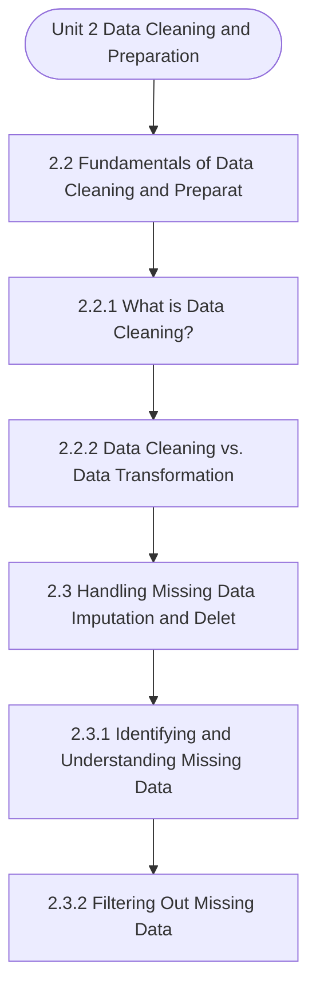

# MCS-067: Data Wrangling and Visualization
## Unit 2: Data Cleaning and Preparation

> 📚 **Programme:** M.Sc. (Data Science and Analytics) | **Semester:** Semester 2  
> ⏱️ **Estimated Study Time:** ~59 mins | 📄 **Textbook Pages:** 36 Pages  
> 📥 **Original PDF:** [Download & View Authentic Textbook](../../../pdfs/Semester_2/MCS-067_Data_Wrangling_and_Visualization/Unit-2_Data_Cleaning_and_Preparation.pdf)

---

### 🎯 Executive Concept & Data Science Relevance
In modern data systems and advanced analytics, **Data Cleaning and Preparation** forms a vital conceptual pillar. Descriptive statistics provide quantitative summaries of dataset properties. Measures of central tendency identify typical values, while measures of dispersion quantify data spread, uncertainty, and variability—critical for feature normalization and anomaly detection.

> [!NOTE]
> **Why this matters for your career:** Mastering data cleaning and preparation equips you with the foundational principles required to reason mathematically about high-dimensional datasets, evaluate algorithm performance, and avoid statistical pitfalls in production machine learning pipelines.

### 🗺️ Visual Knowledge Architecture
The following concept map illustrates the structural hierarchy and learning trajectory of this module:



### 📖 Core Definitions & Terminology Cards

> 📌 **Arithmetic Mean $\bar{x}$ or $\mu$**  
> - **Formal Definition:** The sum of all observations divided by the total number of observations: $\bar{x} = \frac{1}{n}\sum_{i=1}^n x_i$. Sensitive to extreme outliers.  
> - 💡 **Practical Intuition & Analogy:** *The center of mass or balance point of the distribution.*

> 📌 **Median**  
> - **Formal Definition:** The physical middle value separating the higher half from the lower half of an ordered dataset. Robust against outliers.  
> - 💡 **Practical Intuition & Analogy:** *The 50th percentile value where exactly half the data lies above and half below.*

> 📌 **Standard Deviation $\sigma$ or $s$**  
> - **Formal Definition:** The square root of variance, measuring average dispersion in original units: $s = \sqrt{\frac{1}{n-1}\sum (x_i - \bar{x})^2}$.  
> - 💡 **Practical Intuition & Analogy:** *The typical distance data points deviate from the mean.*

> 📌 **Coefficient of Variation ($CV$)**  
> - **Formal Definition:** Relative dispersion measure expressed as a percentage: $CV = \frac{\sigma}{\mu} \times 100\%$. Enables comparison across different measurement scales.  
> - 💡 **Practical Intuition & Analogy:** *Comparing stock volatility across assets priced at 10 USD vs 1,000 USD.*

### ⚡ Governing Mathematical Laws & Formula Cheatsheet
#### 🔹 Sample Variance Formula (Bessel's Correction)
$$
\begin{aligned} s^2 & = \frac{1}{n - 1} \sum_{i=1}^n (x_i - \bar{x})^2 \\ & = \frac{\sum x_i^2 - \frac{(\sum x_i)^2}{n}}{n - 1} \end{aligned}
$$
- **Explanation:** Using $n-1$ in the denominator corrects for downward sample bias, yielding an unbiased estimator of population variance $\sigma^2$.

#### 🔹 Interquartile Range (IQR) & Outlier Bounds
$$
\text{IQR} = Q_3 - Q_1, \quad \text{Outliers} < Q_1 - 1.5(\text{IQR}) \;\lor\; > Q_3 + 1.5(\text{IQR})
$$
- **Explanation:** Standard Tukey boxplot rule for identifying extreme data points robustly.

#### 🔹 Pearson's First Coefficient of Skewness
$$
Sk_1 = \frac{\text{Mean} - \text{Mode}}{\sigma} \quad \text{or} \quad Sk_2 = \frac{3(\text{Mean} - \text{Median})}{\sigma}
$$
- **Explanation:** Measures asymmetry: Positive skew means mean > median (right tail); negative skew means mean < median (left tail).

### ⚖️ Axiomatic Properties & Governing Laws
The mathematical formulations of this module are anchored by foundational algebraic and structural laws:

- **Variance Scaling Rule:** $\text{Var}(aX + b) = a^2 \text{Var}(X)$
- **Standard Deviation Scaling:** $\sigma(aX + b) = \vert a\vert \sigma(X)$
- **Empirical Rule (Normal Distribution):** 68% within $\mu \pm 1\sigma$, 95% within $\mu \pm 2\sigma$, 99.7% within $\mu \pm 3\sigma$

### 📌 Comprehensive Section-by-Section Study Breakdown
#### `2.2` Fundamentals of Data Cleaning and Preparation

##### 📘 Theoretical Principles & Pedagogical Exposition
If you are new to data science, you may be tempted to treat data cleaning and data transformation as the same thing. However, it is crucial that we maintain their conceptual separation, because they occur in sequence and serve different purposes in the data preparation workflow. The goal of data cleaning is to correct errors in the raw data.

In this phase, you work on enforcing integrity and consistency by dealing with typos, missing values, duplicates, and other quality issues. The goal is to ensure that the data you keep is trustworthy. Data transformation, by contrast, starts after the data has been cleaned. At this stage, we assume the data is reliable, and we transform it into a form that is more suitable for a particular analysis or machine learning model.

Here, you may: • Standardise variables, for example, by converting all measurements into the same unit. • Aggregate data, such as summarising daily records into weekly or monthly totals. • Create derived variables, like computing a “total_revenue” column by multiplying “price” by “quantity”.


##### ⚙️ Mathematical & Algorithmic Mechanics
- **Core Mechanism:** Separates operational transaction systems (OLTP) from analytical reporting (OLAP). Organizes analytics into Fact tables (quantitative metrics) and Dimension tables (contextual attributes) in Star or Snowflake schemas. ETL pipelines extract, transform, and load clean data.
- **Boundary Conditions:** Slowly Changing Dimensions (SCD Type 1, 2, 3), late-arriving dimension records, null imputation distortion, and massive distributed partition skew.

##### 📊 Practical Data Science & Production Relevance
- **Production Workflow:** Modern Cloud Data Warehouses (Snowflake, BigQuery, Databricks), automated dbt transformations, and executive business intelligence dashboards (Tableau, PowerBI).
- **Real-World Pitfall:** Over-normalizing OLAP analytical schemas into deeply nested snowflake structures, severely degrading vectorized columnar scan query performance.

> [!TIP]
> **Exam & Technical Interview Insight:** Design a Star Schema for a given business domain (identifying facts and dimensions); contrast OLTP vs OLAP; define Roll-up, Drill-down, Slice, and Dice operations.

#### `2.2.1` What is Data Cleaning?

##### 📘 Theoretical Principles & Pedagogical Exposition
In probability theory and statistical inference, **What is Data Cleaning?** formalizes the stochastic behavior of random phenomena. Within **Data Cleaning and Preparation**, this framework allows data scientists to infer population parameters from finite empirical samples while quantifying uncertainty via confidence intervals and hypothesis tests.

The mathematical rigor here prevents statistical misinterpretations, such as confusing correlation with causation, overlooking sample selection bias, or violating distributional assumptions.

##### ⚙️ Mathematical & Algorithmic Mechanics
- **Core Mechanism:** Separates operational transaction systems (OLTP) from analytical reporting (OLAP). Organizes analytics into Fact tables (quantitative metrics) and Dimension tables (contextual attributes) in Star or Snowflake schemas. ETL pipelines extract, transform, and load clean data.
- **Boundary Conditions:** Slowly Changing Dimensions (SCD Type 1, 2, 3), late-arriving dimension records, null imputation distortion, and massive distributed partition skew.

##### 📊 Practical Data Science & Production Relevance
- **Production Workflow:** Modern Cloud Data Warehouses (Snowflake, BigQuery, Databricks), automated dbt transformations, and executive business intelligence dashboards (Tableau, PowerBI).
- **Real-World Pitfall:** Over-normalizing OLAP analytical schemas into deeply nested snowflake structures, severely degrading vectorized columnar scan query performance.

> [!TIP]
> **Exam & Technical Interview Insight:** Design a Star Schema for a given business domain (identifying facts and dimensions); contrast OLTP vs OLAP; define Roll-up, Drill-down, Slice, and Dice operations.

#### `2.2.2` Data Cleaning vs. Data Transformation

##### 📘 Theoretical Principles & Pedagogical Exposition
If you are new to data science, you may be tempted to treat data cleaning and data transformation as the same thing. However, it is crucial that we maintain their conceptual separation, because they occur in sequence and serve different purposes in the data preparation workflow. The goal of data cleaning is to correct errors in the raw data.

In this phase, you work on enforcing integrity and consistency by dealing with typos, missing values, duplicates, and other quality issues. The goal is to ensure that the data you keep is trustworthy. Data transformation, by contrast, starts after the data has been cleaned. At this stage, we assume the data is reliable, and we transform it into a form that is more suitable for a particular analysis or machine learning model.

Here, you may: • Standardise variables, for example, by converting all measurements into the same unit. • Aggregate data, such as summarising daily records into weekly or monthly totals. • Create derived variables, like computing a “total_revenue” column by multiplying “price” by “quantity”.


##### ⚙️ Mathematical & Algorithmic Mechanics
- **Core Mechanism:** Separates operational transaction systems (OLTP) from analytical reporting (OLAP). Organizes analytics into Fact tables (quantitative metrics) and Dimension tables (contextual attributes) in Star or Snowflake schemas. ETL pipelines extract, transform, and load clean data.
- **Boundary Conditions:** Slowly Changing Dimensions (SCD Type 1, 2, 3), late-arriving dimension records, null imputation distortion, and massive distributed partition skew.

##### 📊 Practical Data Science & Production Relevance
- **Production Workflow:** Modern Cloud Data Warehouses (Snowflake, BigQuery, Databricks), automated dbt transformations, and executive business intelligence dashboards (Tableau, PowerBI).
- **Real-World Pitfall:** Over-normalizing OLAP analytical schemas into deeply nested snowflake structures, severely degrading vectorized columnar scan query performance.

> [!TIP]
> **Exam & Technical Interview Insight:** Design a Star Schema for a given business domain (identifying facts and dimensions); contrast OLTP vs OLAP; define Roll-up, Drill-down, Slice, and Dice operations.

#### `2.3` Handling Missing Data (Imputation and Deletion)

##### 📘 Theoretical Principles & Pedagogical Exposition
AND DELETION) Missing data refers to the absence of a value for a variable in a dataset, commonly represented as NaN (Not a Number) or None in Pandas, which must be addressed before analytical algorithms can be applied. This critical section is divided into three key steps for managing these gaps: 1.

Identifying the missing values and classifying their underlying nature (2.4.1), 2. Filtering out incomplete rows or columns using deletion methods (2.4.2), and 3. Employing imputation techniques, such as statistical measures, to fill in the absent values (2.4.3).


##### ⚙️ Mathematical & Algorithmic Mechanics
- **Core Mechanism:** Separates operational transaction systems (OLTP) from analytical reporting (OLAP). Organizes analytics into Fact tables (quantitative metrics) and Dimension tables (contextual attributes) in Star or Snowflake schemas. ETL pipelines extract, transform, and load clean data.
- **Boundary Conditions:** Slowly Changing Dimensions (SCD Type 1, 2, 3), late-arriving dimension records, null imputation distortion, and massive distributed partition skew.

##### 📊 Practical Data Science & Production Relevance
- **Production Workflow:** Modern Cloud Data Warehouses (Snowflake, BigQuery, Databricks), automated dbt transformations, and executive business intelligence dashboards (Tableau, PowerBI).
- **Real-World Pitfall:** Over-normalizing OLAP analytical schemas into deeply nested snowflake structures, severely degrading vectorized columnar scan query performance.

> [!TIP]
> **Exam & Technical Interview Insight:** Design a Star Schema for a given business domain (identifying facts and dimensions); contrast OLTP vs OLAP; define Roll-up, Drill-down, Slice, and Dice operations.

#### `2.3.1` Identifying and Understanding Missing Data

##### 📘 Theoretical Principles & Pedagogical Exposition
The approach we take to handle missing data must be guided by why the data is missing. Understanding this mechanism is vital, as ignoring it can introduce significant bias into our analysis. Missing Data Samples and Reasons Let us discuss the missing data issues with the help of an example.

Emergency Department Triage Log Let us look at how emergency care settings frequently have missing data. Here, you may observe that staff members occasionally omit non-essential fields during data entry due to the intense time constraints and large patient load. As a result, missing data regularly occurs—not necessarily due to mistakes, but rather as a result of clinical teams concentrating on gathering only the most crucial information when time is of the essence.

Introduction to Data Wrangling Remote Telehealth Monitoring When you collect data remotely, you may find that device problems, internet issues, or even the way a patient follows instructions can all affect the completeness of your records. Because of these factors, we sometimes see entire sections of data missing.


##### ⚙️ Mathematical & Algorithmic Mechanics
- **Core Mechanism:** Separates operational transaction systems (OLTP) from analytical reporting (OLAP). Organizes analytics into Fact tables (quantitative metrics) and Dimension tables (contextual attributes) in Star or Snowflake schemas. ETL pipelines extract, transform, and load clean data.
- **Boundary Conditions:** Slowly Changing Dimensions (SCD Type 1, 2, 3), late-arriving dimension records, null imputation distortion, and massive distributed partition skew.

##### 📊 Practical Data Science & Production Relevance
- **Production Workflow:** Modern Cloud Data Warehouses (Snowflake, BigQuery, Databricks), automated dbt transformations, and executive business intelligence dashboards (Tableau, PowerBI).
- **Real-World Pitfall:** Over-normalizing OLAP analytical schemas into deeply nested snowflake structures, severely degrading vectorized columnar scan query performance.

> [!TIP]
> **Exam & Technical Interview Insight:** Design a Star Schema for a given business domain (identifying facts and dimensions); contrast OLTP vs OLAP; define Roll-up, Drill-down, Slice, and Dice operations.

#### `2.3.2` Filtering Out Missing Data

##### 📘 Theoretical Principles & Pedagogical Exposition
Once we have identified the missing values, we face a decision: do we remove the incomplete records or attempt to fill them? Filtering, or dropping data, is often the safest route when the amount of missingness is small or when the missing data occurs in a critical variable that cannot be reliably estimated.

The dropna() method is your primary tool for this. However, you must use it with caution. By default, df.dropna() will remove any row that contains even a single NaN value. This aggressive approach might lead to the loss of valuable information. Imagine Introduction to Data Wrangling a row where only the 'Age' is missing, but the 'Python_Score' and 'Student_ID' are valid.

By dropping the entire row, we lose the score data. To prevent this, Pandas offers several parameters: DataFrame.dropna(axis=0, how='any', thresh=None, subset=None, inplace=False, ignore_index=False) Parameter Type Description Default axis int or str Specifies row-wise (0 or 'index') or column- wise (1 or 'columns') removal.


##### ⚙️ Mathematical & Algorithmic Mechanics
- **Core Mechanism:** Separates operational transaction systems (OLTP) from analytical reporting (OLAP). Organizes analytics into Fact tables (quantitative metrics) and Dimension tables (contextual attributes) in Star or Snowflake schemas. ETL pipelines extract, transform, and load clean data.
- **Boundary Conditions:** Slowly Changing Dimensions (SCD Type 1, 2, 3), late-arriving dimension records, null imputation distortion, and massive distributed partition skew.

##### 📊 Practical Data Science & Production Relevance
- **Production Workflow:** Modern Cloud Data Warehouses (Snowflake, BigQuery, Databricks), automated dbt transformations, and executive business intelligence dashboards (Tableau, PowerBI).
- **Real-World Pitfall:** Over-normalizing OLAP analytical schemas into deeply nested snowflake structures, severely degrading vectorized columnar scan query performance.

> [!TIP]
> **Exam & Technical Interview Insight:** Design a Star Schema for a given business domain (identifying facts and dimensions); contrast OLTP vs OLAP; define Roll-up, Drill-down, Slice, and Dice operations.

#### `2.3.3` Filling in Missing Data

##### 📘 Theoretical Principles & Pedagogical Exposition
In our previous discussions, we explored how to identify and remove incomplete records. However, as a data scientist, you will often find that simply deleting data is too "expensive" in terms of information loss. Let us try to understand how we can keep our datasets robust without throwing away valuable observations.

We have seen that deletion is easy, but it can destroy your model if you are not careful. A more refined and often more effective approach is imputation, which involves filling in missing values with a substituted value. In the pandas library, our primary tool for this is the fillna() function.

Let us prepare a sample dataset to see how this works in a real-world scenario, such as an HR employee database. import pandas as pd import numpy as np # Let us create a sample dataset with missing values data = { Data Cleaning and Preparation 'Employee_ID': ['E101', 'E102', 'E103', 'E104', 'E105', 'E106', 'E107'], 'Department': ['HR', 'Finance','IT', 'Finance', np.nan, 'IT', 'HR'], 'Salary': [45000, 54000, np.nan, 58000, 60000, np.nan, 52000], 'Experience_Years': [2, np.nan, 5, 7, np.nan, 3, 4], 'Join_Date': ['2021-06-01', '2020-08-15', np.nan, '2019- 11-20', '2021-02-10', '2020-05-30', np.nan] } df = pd.DataFrame(data) print("Initial DataFrame with Missing Values:") print(df) # We can check the extent of missingness using isnull() print("\nCount of Missing Values per Column:") print(df.isnull().sum()) Output: Initial DataFrame with Missing Values: Employee_ID Department Salary Experience_Years Join_Date 0 E101 HR 45000.0 2.0 2021-06-01 1 E102 Finance 54000.0 NaN 2020-08-15 2 E103 IT NaN 5.0 NaN 3 E104 Finance 58000.0 7.0 2019-11-20 4 E105 NaN 60000.0 NaN 2021-02-10 5 E106 IT NaN 3.0 2020-05-30 6 E107 HR 52000.0 4.0 NaN Count of Missing Values per Column: Employee_ID 0 Department 1 Salary 2 Experience_Years 2 Join_Date 2 dtype: int64 Fill Missing Data with a Fixed Value Sometimes, you might want to replace missing values with a specific "placeholder" or a default number.


##### ⚙️ Mathematical & Algorithmic Mechanics
- **Core Mechanism:** Separates operational transaction systems (OLTP) from analytical reporting (OLAP). Organizes analytics into Fact tables (quantitative metrics) and Dimension tables (contextual attributes) in Star or Snowflake schemas. ETL pipelines extract, transform, and load clean data.
- **Boundary Conditions:** Slowly Changing Dimensions (SCD Type 1, 2, 3), late-arriving dimension records, null imputation distortion, and massive distributed partition skew.

##### 📊 Practical Data Science & Production Relevance
- **Production Workflow:** Modern Cloud Data Warehouses (Snowflake, BigQuery, Databricks), automated dbt transformations, and executive business intelligence dashboards (Tableau, PowerBI).
- **Real-World Pitfall:** Over-normalizing OLAP analytical schemas into deeply nested snowflake structures, severely degrading vectorized columnar scan query performance.

> [!TIP]
> **Exam & Technical Interview Insight:** Design a Star Schema for a given business domain (identifying facts and dimensions); contrast OLTP vs OLAP; define Roll-up, Drill-down, Slice, and Dice operations.

#### `2.4` Data Transformation

##### 📘 Theoretical Principles & Pedagogical Exposition
By now, you have probably realized that raw data is rarely "ready-to-use." After we do basic cleaning (like handling blank spaces), we enter the phase of data transformation. Think of data transformation as the process of polishing and reshaping our clean data so that it is in the absolute best format for analysis.

It is the bridge between raw, chaotic data and high-performing machine learning models.


##### ⚙️ Mathematical & Algorithmic Mechanics
- **Core Mechanism:** Separates operational transaction systems (OLTP) from analytical reporting (OLAP). Organizes analytics into Fact tables (quantitative metrics) and Dimension tables (contextual attributes) in Star or Snowflake schemas. ETL pipelines extract, transform, and load clean data.
- **Boundary Conditions:** Slowly Changing Dimensions (SCD Type 1, 2, 3), late-arriving dimension records, null imputation distortion, and massive distributed partition skew.

##### 📊 Practical Data Science & Production Relevance
- **Production Workflow:** Modern Cloud Data Warehouses (Snowflake, BigQuery, Databricks), automated dbt transformations, and executive business intelligence dashboards (Tableau, PowerBI).
- **Real-World Pitfall:** Over-normalizing OLAP analytical schemas into deeply nested snowflake structures, severely degrading vectorized columnar scan query performance.

> [!TIP]
> **Exam & Technical Interview Insight:** Design a Star Schema for a given business domain (identifying facts and dimensions); contrast OLTP vs OLAP; define Roll-up, Drill-down, Slice, and Dice operations.

### 📐 Step-by-Step Solved Mathematical Examples
To solidify your theoretical understanding, work through these fully solved, step-by-step mathematical problems:

#### 🧮 Example 1: Sample Variance and Standard Deviation Computation
> **Problem Statement:**  
> Given sample observations: $X = \lbrace 4, 8, 6, 5, 7 \rbrace$. Compute sample mean $\bar{x}$, sample variance $s^2$, and standard deviation $s$ step-by-step.

**Detailed Step-by-Step Solution:**

1. **Mean:** $\bar{x} = \frac{4 + 8 + 6 + 5 + 7}{5} = \frac{30}{5} = 6$.

2. **Squared deviations:**
- $(4 - 6)^2 = (-2)^2 = 4$
- $(8 - 6)^2 = 2^2 = 4$
- $(6 - 6)^2 = 0^2 = 0$
- $(5 - 6)^2 = (-1)^2 = 1$
- $(7 - 6)^2 = 1^2 = 1$
Sum of squared deviations $= 4 + 4 + 0 + 1 + 1 = 10$.

3. **Sample Variance with Bessel's Correction ($n-1 = 4$):**

$$
s^2 = \frac{10}{5 - 1} = \frac{10}{4} = 2.5
$$


4. **Standard Deviation:** $s = \sqrt{2.5} \approx 1.581$.

#### 🧮 Example 2: Tukey's IQR Outlier Detection Rule
> **Problem Statement:**  
> A customer spend dataset has $Q_1 = 30$ and $Q_3 = 70$. Determine whether transactions of $135$ and $25$ are classified as outliers.

**Detailed Step-by-Step Solution:**

1. **IQR:** $\text{IQR} = Q_3 - Q_1 = 70 - 30 = 40$.
2. **Lower Bound:** $Q_1 - 1.5(\text{IQR}) = 30 - 1.5(40) = 30 - 60 = -30$.
3. **Upper Bound:** $Q_3 + 1.5(\text{IQR}) = 70 + 1.5(40) = 70 + 60 = 130$.

Conclusion:
- Spend of 135 exceeds Upper Bound ($135 > 130$): **Classified as Outlier**.
- Spend of 25 is within $[-30, 130]$: **Normal observation**.

### 💻 Practical Data Science Implementation (Python)
Theory translates directly into production algorithms. Below is a self-contained, commented Python implementation illustrating the core operations of this unit:

```python
import numpy as np
import pandas as pd

# Statistical profiling on production dataset
data = np.array([12, 15, 18, 22, 25, 29, 34, 45, 95])

mean_val = np.mean(data)
median_val = np.median(data)
std_val = np.std(data, ddof=1) # Bessel's correction

q1, q3 = np.percentile(data, [25, 75])
iqr = q3 - q1
outlier_upper = q3 + 1.5 * iqr

outliers = data[data > outlier_upper]

print(f"Mean: {mean_val:.2f} | Median: {median_val:.2f} | Std: {std_val:.2f}")
print(f"IQR: {iqr:.2f} | Upper Bound: {outlier_upper:.2f}")
print(f"Detected Outliers: {outliers}")
```

### 💡 Interactive Self-Assessment Checkpoints
Test your comprehension before proceeding. Tap each question to reveal the comprehensive explanation:

<details>
<summary><b>Checkpoint 1:</b> Why is data cleaning considered the most time-consuming yet crucial step in data science projects? (3-5 lines) 30 Data Cleaning and Preparation <i>(Tap to reveal answer)</i></summary>

> **Answer & Analysis:**  
> **Detailed Analytical Solution:**
> 
> 1. **Core Principle:** Identify the governing theorem or definition for Data Cleaning and Preparation.
> 2. **Step-by-Step Derivation:** Verify all preconditions and compute intermediate steps methodically.
> 3. **Conclusion:** State the final mathematical proof or calculation clearly, validating boundary edge cases.
</details>

<details>
<summary><b>Checkpoint 2:</b> We have data where India, india, and IN are all used to represent the same country. Which primary data cleaning activity would address this issue? <i>(Tap to reveal answer)</i></summary>

> **Answer & Analysis:**  
> **Detailed Analytical Solution:**
> 
> 1. **Core Principle:** Identify the governing theorem or definition for Data Cleaning and Preparation.
> 2. **Step-by-Step Derivation:** Verify all preconditions and compute intermediate steps methodically.
> 3. **Conclusion:** State the final mathematical proof or calculation clearly, validating boundary edge cases.
</details>

<details>
<summary><b>Checkpoint 3:</b> State whether the following statement is True or False: Data Transformation is performed before Data Cleaning to ensure the data is standardised for error detection. <i>(Tap to reveal answer)</i></summary>

> **Answer & Analysis:**  
> **Detailed Analytical Solution:**
> 
> 1. **Core Principle:** Identify the governing theorem or definition for Data Cleaning and Preparation.
> 2. **Step-by-Step Derivation:** Verify all preconditions and compute intermediate steps methodically.
> 3. **Conclusion:** State the final mathematical proof or calculation clearly, validating boundary edge cases.
</details>

<details>
<summary><b>Checkpoint 4:</b> If a dataset includes a column for purchase_price and discount_amount, and you create a new column called final_price using these two, what type of activity is this? <i>(Tap to reveal answer)</i></summary>

> **Answer & Analysis:**  
> **Detailed Analytical Solution:**
> 
> 1. **Core Principle:** Identify the governing theorem or definition for Data Cleaning and Preparation.
> 2. **Step-by-Step Derivation:** Verify all preconditions and compute intermediate steps methodically.
> 3. **Conclusion:** State the final mathematical proof or calculation clearly, validating boundary edge cases.
</details>

<details>
<summary><b>Checkpoint 5:</b> Why is sample variance divided by $n-1$ instead of $n$? <i>(Tap to reveal answer)</i></summary>

> **Answer & Analysis:**  
> Dividing by $n-1$ applies **Bessel's correction**, which removes downward bias caused by using the sample mean $\bar{x}$ instead of the true population mean $\mu$.
</details>

<details>
<summary><b>Checkpoint 6:</b> Which measure of central tendency is most robust to extreme outliers? <i>(Tap to reveal answer)</i></summary>

> **Answer & Analysis:**  
> The **Median**, because it depends on positional rank rather than magnitude summation.
</details>

### 🎯 Executive Module Wrap-Up
- **Central Idea:** Data Cleaning and Preparation provides essential mathematical and algorithmic tools directly utilized in Data Science.
- **Mathematical Rigor:** Formulas and laws must be memorized with attention to boundary conditions and assumptions.
- **Full Textbook Coverage:** For exhaustive multi-page derivations, proofs, and supplementary exercises, consult the [Authentic IGNOU Textbook](../../../pdfs/Semester_2/MCS-067_Data_Wrangling_and_Visualization/Unit-2_Data_Cleaning_and_Preparation.pdf).

---
### 🧭 Navigation & Syllabus Index
[⬅ Previous: Unit 1](unit_01_Data_Wrangling_and_Profiling.md) | [📑 Course Index](README.md) | [Next: Unit 3 ➡](unit_03_Data_Transformation.md)
