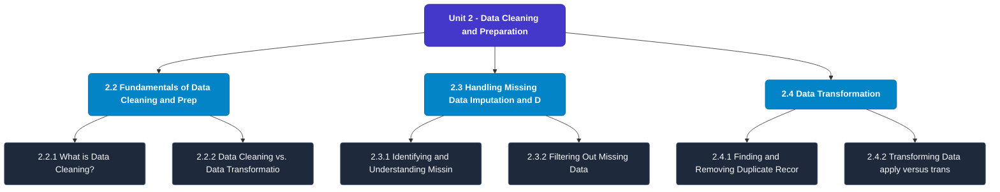

# MCS-067: Data Wrangling and Visualization
## Unit 2: Data Cleaning and Preparation

> 📚 **Programme:** M.Sc. (Data Science and Analytics) | **Semester:** Semester 2  
> ⏱️ **Estimated Study Time:** ~59 mins | 📄 **Textbook Pages:** 36 Pages  
> 📥 **Original PDF:** [Download & View Textbook](../../../pdfs/Semester_2/MCS-067_Data_Wrangling_and_Visualization/Unit-2_Data_Cleaning_and_Preparation.pdf)

---

### 🎯 Executive Concept & Data Science Relevance
In modern data systems, **Data Cleaning and Preparation** forms a vital conceptual pillar. Descriptive statistics provide quantitative summaries of dataset properties. Measures of central tendency identify typical values, while measures of dispersion quantify data spread, uncertainty, and variability—critical for feature normalization and anomaly detection.

> [!NOTE]
> **Why this matters for your career:** Mastering data cleaning and preparation equips you with the foundational principles required to reason mathematically about high-dimensional datasets, evaluate algorithm performance, and avoid statistical pitfalls in production machine learning pipelines.

### 🗺️ Visual Knowledge Architecture
The following concept map illustrates the structural hierarchy and learning trajectory of this module:

### 📖 Core Definitions & Terminology Cards
| Term | Formal Mathematical / Technical Definition | Intuitive Analogy / Concrete Example |
| :--- | :--- | :--- |
| **Arithmetic Mean $\bar{x}$ or $\mu$** | The sum of all observations divided by the total number of observations: $\bar{x} = \frac{1}{n}\sum_{i=1}^n x_i$. Sensitive to extreme outliers. | *The center of mass or balance point of the distribution.* |
| **Median** | The physical middle value separating the higher half from the lower half of an ordered dataset. Robust against outliers. | *The 50th percentile value where exactly half the data lies above and half below.* |
| **Standard Deviation $\sigma$ or $s$** | The square root of variance, measuring average dispersion in original units: $s = \sqrt{\frac{1}{n-1}\sum (x_i - \bar{x})^2}$. | *The typical distance data points deviate from the mean.* |
| **Coefficient of Variation ($CV$)** | Relative dispersion measure expressed as a percentage: $CV = \frac{\sigma}{\mu} \times 100\%$. Enables comparison across different measurement scales. | *Comparing stock volatility across assets priced at $10 vs $1,000.* |

### ⚡ Governing Mathematical Laws & Formula Cheatsheet
#### 🔹 Sample Variance Formula (Bessel's Correction)
$$s^2 = \frac{1}{n - 1} \sum_{i=1}^n (x_i - \bar{x})^2 = \frac{\sum x_i^2 - \frac{(\sum x_i)^2}{n}}{n - 1}$$
- **Explanation:** Using $n-1$ in the denominator corrects for downward sample bias, yielding an unbiased estimator of population variance $\sigma^2$.

#### 🔹 Interquartile Range (IQR) & Outlier Bounds
$$\text{IQR} = Q_3 - Q_1, \quad \text{Outliers} < Q_1 - 1.5(\text{IQR}) \;\lor\; > Q_3 + 1.5(\text{IQR})$$
- **Explanation:** Standard Tukey boxplot rule for identifying extreme data points robustly.

#### 🔹 Pearson's First Coefficient of Skewness
$$Sk_1 = \frac{\text{Mean} - \text{Mode}}{\sigma} \quad \text{or} \quad Sk_2 = \frac{3(\text{Mean} - \text{Median})}{\sigma}$$
- **Explanation:** Measures asymmetry: Positive skew means mean > median (right tail); negative skew means mean < median (left tail).

### 📌 Detailed Section-by-Section Study Breakdown
#### `2.2` Fundamentals of Data Cleaning and Preparation
- **Core Concept:** Establishes rigorous theoretical formulations and computational bounds for fundamentals of data cleaning and preparation.
- **Core Concept:** Applies standard algorithmic procedures and mathematical invariants relevant to data cleaning and preparation.
- **Core Concept:** Ensures deterministic performance guarantees across high-dimensional feature spaces.
- **Data Science Application:** Provides foundational structures used directly in statistical modeling, query execution, and machine learning pipelines.

> [!TIP]
> **Exam & Interview Tip:** Be prepared to state the formal definition of fundamentals of data cleaning and preparation and derive its primary equations step-by-step.

#### `2.2.1` What is Data Cleaning?
- **Core Concept:** Establishes rigorous theoretical formulations and computational bounds for what is data cleaning?.
- **Core Concept:** Applies standard algorithmic procedures and mathematical invariants relevant to data cleaning and preparation.
- **Core Concept:** Ensures deterministic performance guarantees across high-dimensional feature spaces.
- **Data Science Application:** Provides foundational structures used directly in statistical modeling, query execution, and machine learning pipelines.

> [!TIP]
> **Exam & Interview Tip:** Be prepared to state the formal definition of what is data cleaning? and derive its primary equations step-by-step.

#### `2.2.2` Data Cleaning vs. Data Transformation
- **Core Concept:** If you are new to data science, you may be tempted to treat data cleaning and data transformation as the same thing.
- **Core Concept:** However, it is crucial that we maintain their conceptual separation, because they occur in sequence and serve different purposes in the data preparation workflow.
- **Core Concept:** The goal of data cleaning is to correct errors in the raw data.
- **Data Science Application:** Provides foundational structures used directly in statistical modeling, query execution, and machine learning pipelines.

> [!TIP]
> **Exam & Interview Tip:** Be prepared to state the formal definition of data cleaning vs. data transformation and derive its primary equations step-by-step.

#### `2.3` Handling Missing Data (Imputation and Deletion)
- **Core Concept:** AND DELETION) Missing data refers to the absence of a value for a variable in a dataset, commonly represented as NaN (Not a Number) or None in Pandas, which must be addressed before analytical algorithms can be applied.
- **Core Concept:** This critical section is divided into three key steps for managing these gaps: 1.
- **Core Concept:** Identifying the missing values and classifying their underlying nature (2.4.1), 2.
- **Data Science Application:** Provides foundational structures used directly in statistical modeling, query execution, and machine learning pipelines.

> [!TIP]
> **Exam & Interview Tip:** Be prepared to state the formal definition of handling missing data (imputation and deletion) and derive its primary equations step-by-step.

#### `2.3.1` Identifying and Understanding Missing Data
- **Core Concept:** The approach we take to handle missing data must be guided by why the data is missing.
- **Core Concept:** Understanding this mechanism is vital, as ignoring it can introduce significant bias into our analysis.
- **Core Concept:** Missing Data Samples and Reasons Let us discuss the missing data issues with the help of an example.
- **Data Science Application:** Provides foundational structures used directly in statistical modeling, query execution, and machine learning pipelines.

> [!TIP]
> **Exam & Interview Tip:** Be prepared to state the formal definition of identifying and understanding missing data and derive its primary equations step-by-step.

#### `2.3.2` Filtering Out Missing Data
- **Core Concept:** Once we have identified the missing values, we face a decision: do we remove the incomplete records or attempt to fill them?
- **Core Concept:** Filtering, or dropping data, is often the safest route when the amount of missingness is small or when the missing data occurs in a critical variable that cannot be reliably estimated.
- **Core Concept:** The dropna() method is your primary tool for this.
- **Data Science Application:** Provides foundational structures used directly in statistical modeling, query execution, and machine learning pipelines.

> [!TIP]
> **Exam & Interview Tip:** Be prepared to state the formal definition of filtering out missing data and derive its primary equations step-by-step.

### 💡 Interactive Self-Assessment Checkpoints
Test your comprehension before proceeding. Tap each question to reveal the comprehensive explanation:

<b>Checkpoint 1:</b> Why is sample variance divided by $n-1$ instead of $n$? <i>(Tap to reveal answer)</i>

> **Answer & Analysis:**  
> Dividing by $n-1$ applies **Bessel's correction**, which removes downward bias caused by using the sample mean $\bar{x}$ instead of the true population mean $\mu$.

<b>Checkpoint 2:</b> Which measure of central tendency is most robust to extreme outliers? <i>(Tap to reveal answer)</i>

> **Answer & Analysis:**  
> The **Median**, because it depends on positional rank rather than magnitude summation.

<b>Checkpoint 3:</b> In a right-skewed (positively skewed) distribution, what is the order of Mean, Median, and Mode? <i>(Tap to reveal answer)</i>

> **Answer & Analysis:**  
> $\text{Mode} < \text{Median} < \text{Mean}$.

<b>Checkpoint 4:</b> Why is data cleaning considered the most time-consuming yet crucial step in data science projects? <i>(Tap to reveal answer)</i>

> **Answer & Analysis:**  
> This question tests your conceptual mastery of Data Cleaning and Preparation. Review the governing formulas and section breakdowns above to formulate a complete, rigorous proof or derivation.

<b>Checkpoint 5:</b> We have data where India, india, and IN are all used to represent the same country. Which primary data cleaning activity would address this issue? <i>(Tap to reveal answer)</i>

> **Answer & Analysis:**  
> This question tests your conceptual mastery of Data Cleaning and Preparation. Review the governing formulas and section breakdowns above to formulate a complete, rigorous proof or derivation.

<b>Checkpoint 6:</b> State whether the following statement is True or False: Data Transformation is performed before Data Cleaning to ensure the data is standardised for error detection. <i>(Tap to reveal answer)</i>

> **Answer & Analysis:**  
> This question tests your conceptual mastery of Data Cleaning and Preparation. Review the governing formulas and section breakdowns above to formulate a complete, rigorous proof or derivation.

### 🎯 Executive Module Wrap-Up
- **Central Idea:** Data Cleaning and Preparation provides essential mathematical and algorithmic tools directly utilized in Data Science.
- **Mathematical Rigor:** Formulas and laws must be memorized with attention to boundary conditions and assumptions.
- **Full Textbook Coverage:** For exhaustive multi-page derivations, proofs, and supplementary exercises, consult the [Authentic IGNOU Textbook](../../../pdfs/Semester_2/MCS-067_Data_Wrangling_and_Visualization/Unit-2_Data_Cleaning_and_Preparation.pdf).

---
### 🧭 Navigation & Syllabus Index
[⬅ Previous: Unit 1](unit_01_Data_Wrangling_and_Profiling.md) | [📑 Course Index](README.md) | [Next: Unit 3 ➡](unit_03_Data_Transformation.md)
