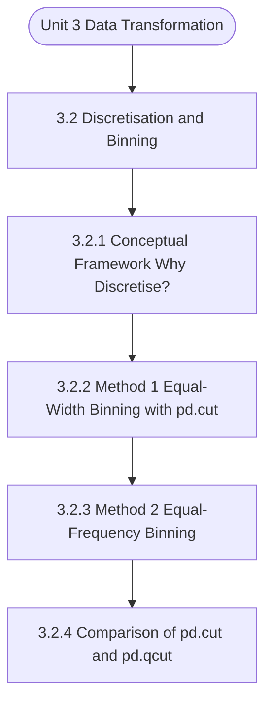

# MCS-067: Data Wrangling and Visualization
## Unit 3: Data Transformation

> 📚 **Programme:** M.Sc. (Data Science and Analytics) | **Semester:** Semester 2  
> ⏱️ **Estimated Study Time:** ~51 mins | 📄 **Textbook Pages:** 28 Pages  
> 📥 **Original PDF:** [Download & View Authentic Textbook](../../../pdfs/Semester_2/MCS-067_Data_Wrangling_and_Visualization/Unit-3_Data_Transformation.pdf)

---

### 🎯 Executive Concept & Data Science Relevance
In modern data systems, **Data Transformation** forms a vital conceptual pillar. Descriptive statistics provide quantitative summaries of dataset properties. Measures of central tendency identify typical values, while measures of dispersion quantify data spread, uncertainty, and variability—critical for feature normalization and anomaly detection.

> [!NOTE]
> **Why this matters for your career:** Mastering data transformation equips you with the foundational principles required to reason mathematically about high-dimensional datasets, evaluate algorithm performance, and avoid statistical pitfalls in production machine learning pipelines.

### 🗺️ Visual Knowledge Architecture
The following concept map illustrates the structural hierarchy and learning trajectory of this module:



### 📖 Core Definitions & Terminology Cards

> 📌 **Arithmetic Mean $\bar{x}$ or $\mu$**  
> - **Formal Definition:** The sum of all observations divided by the total number of observations: $\bar{x} = \frac{1}{n}\sum_{i=1}^n x_i$. Sensitive to extreme outliers.  
> - 💡 **Practical Intuition & Analogy:** *The center of mass or balance point of the distribution.*

> 📌 **Median**  
> - **Formal Definition:** The physical middle value separating the higher half from the lower half of an ordered dataset. Robust against outliers.  
> - 💡 **Practical Intuition & Analogy:** *The 50th percentile value where exactly half the data lies above and half below.*

> 📌 **Standard Deviation $\sigma$ or $s$**  
> - **Formal Definition:** The square root of variance, measuring average dispersion in original units: $s = \sqrt{\frac{1}{n-1}\sum (x_i - \bar{x})^2}$.  
> - 💡 **Practical Intuition & Analogy:** *The typical distance data points deviate from the mean.*

> 📌 **Coefficient of Variation ($CV$)**  
> - **Formal Definition:** Relative dispersion measure expressed as a percentage: $CV = \frac{\sigma}{\mu} \times 100\%$. Enables comparison across different measurement scales.  
> - 💡 **Practical Intuition & Analogy:** *Comparing stock volatility across assets priced at 10 USD vs 1,000 USD.*

### ⚡ Governing Mathematical Laws & Formula Cheatsheet
#### 🔹 Sample Variance Formula (Bessel's Correction)
$$
\begin{aligned} s^2 & = \frac{1}{n - 1} \sum_{i=1}^n (x_i - \bar{x})^2 \\ & = \frac{\sum x_i^2 - \frac{(\sum x_i)^2}{n}}{n - 1} \end{aligned}
$$
- **Explanation:** Using $n-1$ in the denominator corrects for downward sample bias, yielding an unbiased estimator of population variance $\sigma^2$.

#### 🔹 Interquartile Range (IQR) & Outlier Bounds
$$
\text{IQR} = Q_3 - Q_1, \quad \text{Outliers} < Q_1 - 1.5(\text{IQR}) \;\lor\; > Q_3 + 1.5(\text{IQR})
$$
- **Explanation:** Standard Tukey boxplot rule for identifying extreme data points robustly.

#### 🔹 Pearson's First Coefficient of Skewness
$$
Sk_1 = \frac{\text{Mean} - \text{Mode}}{\sigma} \quad \text{or} \quad Sk_2 = \frac{3(\text{Mean} - \text{Median})}{\sigma}
$$
- **Explanation:** Measures asymmetry: Positive skew means mean > median (right tail); negative skew means mean < median (left tail).

### ⚖️ Axiomatic Properties & Governing Laws
The mathematical formulations of this module are anchored by foundational algebraic and structural laws:

- **Variance Scaling Rule:** $\text{Var}(aX + b) = a^2 \text{Var}(X)$
- **Standard Deviation Scaling:** $\sigma(aX + b) = \vert a\vert \sigma(X)$
- **Empirical Rule (Normal Distribution):** 68% within $\mu \pm 1\sigma$, 95% within $\mu \pm 2\sigma$, 99.7% within $\mu \pm 3\sigma$

### 📌 Comprehensive Section-by-Section Study Breakdown
#### `3.2` Discretisation and Binning
##### 📘 Theoretical Principles & In-Depth Exposition
In Equal-Width Binning, the range of the variable (calculated as Maximum value minus Minimum value) is divided into a predetermined number of intervals (N), where each interval has the exact same width. For example, if marks range from 40 to 100 (range of 60), and we choose N=4 bins, each bin will have a width of 15 (60/4).

We use the Pandas function pd.cut() for this method. Let us try an example using the above dataset. #Include the CODE of Program 1, or else this program will give an error # Define the number of bins num_bins = 5 # Apply equal-width binning using pd.cut() # This divides the 18-70 range into 4 equally sized chunks df['Age_Group']= pd.cut(df['Age'], bins=num_bins) print("\n--- Data after Equal-Width Binning ---") print(df) print("\nValue Counts for Bins:") print(df['Age_Group'].value_counts()) Program 2: Code for Simple Equal-Width Segmentation on Age column Data Transformation Program 2 shows the code for creating equal width segmentation of data of Age column.

Please note that this code has to be appended after the code of Program 1 that contains the sample data. The program simply creates a new column named Age_Group in the dataframe using equal width binning. The last line of the code counts the frequency of Age_Group categories. The output of this code is shown in Table 2.

##### ⚙️ Mathematical & Algorithmic Mechanics
- **Formal Mechanics:** Establishes symbolic transformations and state invariants governing discretisation and binning.
- **Boundary Invariants:** Ensures robust error-handling, non-empty set guarantees, and strict asymptotic bounds.

##### 📊 Practical Data Science & Production Relevance
- **Industry Application:** Directly implemented in production workflows such as SQL query filters, pandas vectorized operations, and feature transformation pipelines.
- **Production Pitfall:** Failing to verify membership bounds or missing edge cases in discretisation and binning can cause silent data corruption or performance bottlenecks.

> [!TIP]
> **Key Exam & Technical Interview Takeaway:** Be prepared to define discretisation and binning formally, cite its core mathematical invariants, and solve step-by-step numerical/proof questions.

#### `3.2.1` Conceptual Framework: Why Discretise?
##### 📘 Theoretical Principles & In-Depth Exposition
The section on **Conceptual Framework: Why Discretise?** establishes rigorous theoretical foundations necessary for advanced computational modeling. It introduces formal mathematical structures and symbolic notations that guarantee consistency across proofs and algorithms.

In the broader scope of **Data Transformation**, understanding conceptual framework: why discretise? is essential to formalizing data representations, verifying boundary constraints, and ensuring computational determinism across multidimensional feature spaces.

##### ⚙️ Mathematical & Algorithmic Mechanics
- **Formal Mechanics:** Establishes symbolic transformations and state invariants governing conceptual framework: why discretise?.
- **Boundary Invariants:** Ensures robust error-handling, non-empty set guarantees, and strict asymptotic bounds.

##### 📊 Practical Data Science & Production Relevance
- **Industry Application:** Directly implemented in production workflows such as SQL query filters, pandas vectorized operations, and feature transformation pipelines.
- **Production Pitfall:** Failing to verify membership bounds or missing edge cases in conceptual framework: why discretise? can cause silent data corruption or performance bottlenecks.

> [!TIP]
> **Key Exam & Technical Interview Takeaway:** Be prepared to define conceptual framework: why discretise? formally, cite its core mathematical invariants, and solve step-by-step numerical/proof questions.

#### `3.2.2` Method 1: Equal-Width Binning with pd.cut()
##### 📘 Theoretical Principles & In-Depth Exposition
In Equal-Width Binning, the range of the variable (calculated as Maximum value minus Minimum value) is divided into a predetermined number of intervals (N), where each interval has the exact same width. For example, if marks range from 40 to 100 (range of 60), and we choose N=4 bins, each bin will have a width of 15 (60/4).

We use the Pandas function pd.cut() for this method. Let us try an example using the above dataset. #Include the CODE of Program 1, or else this program will give an error # Define the number of bins num_bins = 5 # Apply equal-width binning using pd.cut() # This divides the 18-70 range into 4 equally sized chunks df['Age_Group']= pd.cut(df['Age'], bins=num_bins) print("\n--- Data after Equal-Width Binning ---") print(df) print("\nValue Counts for Bins:") print(df['Age_Group'].value_counts()) Program 2: Code for Simple Equal-Width Segmentation on Age column Data Transformation Program 2 shows the code for creating equal width segmentation of data of Age column.

Please note that this code has to be appended after the code of Program 1 that contains the sample data. The program simply creates a new column named Age_Group in the dataframe using equal width binning. The last line of the code counts the frequency of Age_Group categories. The output of this code is shown in Table 2.

##### ⚙️ Mathematical & Algorithmic Mechanics
- **Formal Mechanics:** Establishes symbolic transformations and state invariants governing method 1: equal-width binning with pd.cut().
- **Boundary Invariants:** Ensures robust error-handling, non-empty set guarantees, and strict asymptotic bounds.

##### 📊 Practical Data Science & Production Relevance
- **Industry Application:** Directly implemented in production workflows such as SQL query filters, pandas vectorized operations, and feature transformation pipelines.
- **Production Pitfall:** Failing to verify membership bounds or missing edge cases in method 1: equal-width binning with pd.cut() can cause silent data corruption or performance bottlenecks.

> [!TIP]
> **Key Exam & Technical Interview Takeaway:** Be prepared to define method 1: equal-width binning with pd.cut() formally, cite its core mathematical invariants, and solve step-by-step numerical/proof questions.

#### `3.2.3` Method 2: Equal-Frequency Binning
##### 📘 Theoretical Principles & In-Depth Exposition
pd.qcut() Equal-Frequency Binning, implemented using pd.qcut(), focuses on balancing the number of observations in each bin, rather than balancing the range. This method uses percentiles, or quantiles, to define the bin boundaries. For instance, if we request four bins (quartiles), the boundaries will be defined such that the 25th, 50th, 75th, and 100th percentiles split the data, resulting in approximately equal counts in each bin.

This approach is particularly valuable when the underlying data distribution is highly skewed, preventing all or most data points from clustering into one or two large bins. #Include the CODE of Program 1, or else this program will give an error # Apply equal-frequency binning using pd.qcut() # We request 4 bins (quartiles) df['Income_Quartile'] = pd.qcut(df['Annual_Income'], q=4, labels=['Low', 'Medium', 'High', 'Very High']) df[['Annual_Income', 'Income_Quartile']].head(10) print("\n--- Data after Equal-Frequency (Quantile) Binning --- ") print(df[['Annual_Income', 'Income_Quartile']]) print("\nValue Counts for Quantile Bins:") print(df['Income_Quartile'].value_counts()) Program 4: Code for Implementing Quantile Binning The program 4 uses labels to create a new column named Income_Quantile.

You may observe that the output shows equal frequency in each category. Data Transformation Output: --- Data after Equal-Frequency (Quantile) Binning --- Annual_Income Income_Quartile 0 15000 Low 1 18000 Low 2 25000 Low 3 27000 Low 4 29000 Low 5 31000 Medium 6 33000 Medium 7 35000 Medium 8 38000 Medium 9 40000 Medium 10 42000 High 11 45000 High 12 47000 High 13 49000 High 14 50000 High 15 55000 Very High 16 70000 Very High 17 85000 Very High 18 120000 Very High 19 200000 Very High Value Counts for Quantile Bins: Income_Quartile Low 5 Medium 5 High 5 Very High 5 Name: count, dtype: int64 The output confirms that the frequency of observations across the four bins is now much more balanced (5).

##### ⚙️ Mathematical & Algorithmic Mechanics
- **Formal Mechanics:** Establishes symbolic transformations and state invariants governing method 2: equal-frequency binning.
- **Boundary Invariants:** Ensures robust error-handling, non-empty set guarantees, and strict asymptotic bounds.

##### 📊 Practical Data Science & Production Relevance
- **Industry Application:** Directly implemented in production workflows such as SQL query filters, pandas vectorized operations, and feature transformation pipelines.
- **Production Pitfall:** Failing to verify membership bounds or missing edge cases in method 2: equal-frequency binning can cause silent data corruption or performance bottlenecks.

> [!TIP]
> **Key Exam & Technical Interview Takeaway:** Be prepared to define method 2: equal-frequency binning formally, cite its core mathematical invariants, and solve step-by-step numerical/proof questions.

#### `3.2.4` Comparison of pd.cut() and pd.qcut()
##### 📘 Theoretical Principles & In-Depth Exposition
Let us look at the fundamental difference between these two powerful discretization tools: Function Basis of Division Focus/Criteria Best Used When... pd.cut() Equal Value Range (Equal Width) The distance between the bin edges must be equal. Domain knowledge dictates fixed ranges (e.g., age groups, scores out of 100).

pd.qcut() Equal Observation Count (Equal Frequency) The number of data points in each bin must be equal (or nearly equal). Data is highly skewed, and you need to ensure sufficient samples in every bin for comparison.

##### ⚙️ Mathematical & Algorithmic Mechanics
- **Formal Mechanics:** Establishes symbolic transformations and state invariants governing comparison of pd.cut() and pd.qcut().
- **Boundary Invariants:** Ensures robust error-handling, non-empty set guarantees, and strict asymptotic bounds.

##### 📊 Practical Data Science & Production Relevance
- **Industry Application:** Directly implemented in production workflows such as SQL query filters, pandas vectorized operations, and feature transformation pipelines.
- **Production Pitfall:** Failing to verify membership bounds or missing edge cases in comparison of pd.cut() and pd.qcut() can cause silent data corruption or performance bottlenecks.

> [!TIP]
> **Key Exam & Technical Interview Takeaway:** Be prepared to define comparison of pd.cut() and pd.qcut() formally, cite its core mathematical invariants, and solve step-by-step numerical/proof questions.

#### `3.3` Detecting and Filtering Outliers
##### 📘 Theoretical Principles & In-Depth Exposition
Outliers are data points that deviate significantly from other observations. They represent rare occurrences, measurement errors, or genuine extreme values. If ignored, outliers can skew statistical averages (like the mean) and standard deviations, potentially leading to poorly generalised analytical models.

Effective data transformation requires robust methods for detecting and managing these anomalies. Outliers can arise from: 1. Genuine Errors: Data entry mistakes (e.g., typing 150000 instead of 15000) or sensor malfunctions. True Extremes: A legitimate, rare observation (e.g., a CEO's salary in an average employee dataset).

The Danger of Outliers: Outliers have a disproportionate impact on statistical measures. They inflate the mean and dramatically increase the standard deviation. For models, they heavily bias results, especially in distance-based algorithms like Linear Regression, by pulling the regression line towards themselves.

##### ⚙️ Mathematical & Algorithmic Mechanics
- **Formal Mechanics:** Establishes symbolic transformations and state invariants governing detecting and filtering outliers.
- **Boundary Invariants:** Ensures robust error-handling, non-empty set guarantees, and strict asymptotic bounds.

##### 📊 Practical Data Science & Production Relevance
- **Industry Application:** Directly implemented in production workflows such as SQL query filters, pandas vectorized operations, and feature transformation pipelines.
- **Production Pitfall:** Failing to verify membership bounds or missing edge cases in detecting and filtering outliers can cause silent data corruption or performance bottlenecks.

> [!TIP]
> **Key Exam & Technical Interview Takeaway:** Be prepared to define detecting and filtering outliers formally, cite its core mathematical invariants, and solve step-by-step numerical/proof questions.

#### `3.3.1` Visualisation: Identifying Outliers with Box Plots
##### 📘 Theoretical Principles & In-Depth Exposition
The essential first step in outlier management is visualisation. The Box Plot (or Box- and-Whisker Plot) is the standard tool for quickly identifying data spread and potential outliers. It provides a clear graphical representation, showing the median and quartiles. Any points that fall outside the defined "whiskers", determined by the Interquartile Range (IQR) rule, typically represent potential outliers Let us introduce a dataset of annual income (in thousands) that contains one extremely high salary to simulate an outlier scenario.

Program 4 shows the code of this program. Please note it uses seaborn library of Python, which is used for making the box plot on Annual Income. In addition, please note that this box plot has a title. #Include the CODE of Program 1, or else this program will give an error import seaborn as sns import matplotlib.pyplot as plt # Visualising Outliers using a Box Plot (Conceptual) # Visualization of Annual_Income distribution sns.boxplot(df['Annual_Income']) plt.title('Boxplot of Annual Income Distribution') plt.show() # Observations outside the whiskers are potentialoutliers.

Program 5: Visualising Outliers Data Transformation In the following output, please note that three points shown as rhombus above the top whisker are potential outliers, as they exceed the value 1.5* IQR.

##### ⚙️ Mathematical & Algorithmic Mechanics
- **Formal Mechanics:** Establishes symbolic transformations and state invariants governing visualisation: identifying outliers with box plots.
- **Boundary Invariants:** Ensures robust error-handling, non-empty set guarantees, and strict asymptotic bounds.

##### 📊 Practical Data Science & Production Relevance
- **Industry Application:** Directly implemented in production workflows such as SQL query filters, pandas vectorized operations, and feature transformation pipelines.
- **Production Pitfall:** Failing to verify membership bounds or missing edge cases in visualisation: identifying outliers with box plots can cause silent data corruption or performance bottlenecks.

> [!TIP]
> **Key Exam & Technical Interview Takeaway:** Be prepared to define visualisation: identifying outliers with box plots formally, cite its core mathematical invariants, and solve step-by-step numerical/proof questions.

#### `3.3.2` Method Selection: Z-score versus IQR
##### 📘 Theoretical Principles & In-Depth Exposition
The choice of numerical detection method depends critically on the underlying data distribution. Z-Score Method The Z-score method assumes that the data is normally (Gaussian) distributed. It measures how many standard deviations a data point deviates from the mean. Outliers are typically defined as values with a Z-score greater than a threshold, commonly ±2 or ±3.

Interquartile Range (IQR) Method The IQR method is preferred for skewed distributions because it relies on quartiles (percentiles), which are less sensitive to extreme values than the mean and standard deviation. The boundaries, often called Tukey's Fences, are calculated using the 25th percentile (Q1) and the 75th percentile (Q3).

Data points falling outside Q1 - 1.5 × IQR or Q3 + 1.5 × IQR are flagged as outliers. This method is considered more robust than the Z-score for non-normal data.

##### ⚙️ Mathematical & Algorithmic Mechanics
- **Formal Mechanics:** Establishes symbolic transformations and state invariants governing method selection: z-score versus iqr.
- **Boundary Invariants:** Ensures robust error-handling, non-empty set guarantees, and strict asymptotic bounds.

##### 📊 Practical Data Science & Production Relevance
- **Industry Application:** Directly implemented in production workflows such as SQL query filters, pandas vectorized operations, and feature transformation pipelines.
- **Production Pitfall:** Failing to verify membership bounds or missing edge cases in method selection: z-score versus iqr can cause silent data corruption or performance bottlenecks.

> [!TIP]
> **Key Exam & Technical Interview Takeaway:** Be prepared to define method selection: z-score versus iqr formally, cite its core mathematical invariants, and solve step-by-step numerical/proof questions.

### 📐 Step-by-Step Solved Mathematical Examples
To solidify your theoretical understanding, work through these fully solved, step-by-step mathematical problems:

#### 🧮 Example 1: Sample Variance and Standard Deviation Computation
> **Problem Statement:**  
> Given sample observations: $X = \lbrace 4, 8, 6, 5, 7 \rbrace$. Compute sample mean $\bar{x}$, sample variance $s^2$, and standard deviation $s$ step-by-step.

**Detailed Step-by-Step Solution:**

1. **Mean:** $\bar{x} = \frac{4 + 8 + 6 + 5 + 7}{5} = \frac{30}{5} = 6$.

2. **Squared deviations:**
- $(4 - 6)^2 = (-2)^2 = 4$
- $(8 - 6)^2 = 2^2 = 4$
- $(6 - 6)^2 = 0^2 = 0$
- $(5 - 6)^2 = (-1)^2 = 1$
- $(7 - 6)^2 = 1^2 = 1$
Sum of squared deviations $= 4 + 4 + 0 + 1 + 1 = 10$.

3. **Sample Variance with Bessel's Correction ($n-1 = 4$):**
$$
s^2 = \frac{10}{5 - 1} = \frac{10}{4} = 2.5
$$

4. **Standard Deviation:** $s = \sqrt{2.5} \approx 1.581$.

#### 🧮 Example 2: Tukey's IQR Outlier Detection Rule
> **Problem Statement:**  
> A customer spend dataset has $Q_1 = 30$ and $Q_3 = 70$. Determine whether transactions of $135$ and $25$ are classified as outliers.

**Detailed Step-by-Step Solution:**

1. **IQR:** $\text{IQR} = Q_3 - Q_1 = 70 - 30 = 40$.
2. **Lower Bound:** $Q_1 - 1.5(\text{IQR}) = 30 - 1.5(40) = 30 - 60 = -30$.
3. **Upper Bound:** $Q_3 + 1.5(\text{IQR}) = 70 + 1.5(40) = 70 + 60 = 130$.

Conclusion:
- Spend of 135 exceeds Upper Bound ($135 > 130$): **Classified as Outlier**.
- Spend of 25 is within $[-30, 130]$: **Normal observation**.

### 💻 Practical Data Science Implementation (Python)
Theory translates directly into production algorithms. Below is a self-contained, commented Python implementation illustrating the core operations of this unit:

```python
import numpy as np
import pandas as pd

# Statistical profiling on production dataset
data = np.array([12, 15, 18, 22, 25, 29, 34, 45, 95])

mean_val = np.mean(data)
median_val = np.median(data)
std_val = np.std(data, ddof=1) # Bessel's correction

q1, q3 = np.percentile(data, [25, 75])
iqr = q3 - q1
outlier_upper = q3 + 1.5 * iqr

outliers = data[data > outlier_upper]

print(f"Mean: {mean_val:.2f} | Median: {median_val:.2f} | Std: {std_val:.2f}")
print(f"IQR: {iqr:.2f} | Upper Bound: {outlier_upper:.2f}")
print(f"Detected Outliers: {outliers}")
```

### 💡 Interactive Self-Assessment Checkpoints
Test your comprehension before proceeding. Tap each question to reveal the comprehensive explanation:

<details>
<summary><b>Checkpoint 1:</b> Why is sample variance divided by $n-1$ instead of $n$? <i>(Tap to reveal answer)</i></summary>

> **Answer & Analysis:**  
> Dividing by $n-1$ applies **Bessel's correction**, which removes downward bias caused by using the sample mean $\bar{x}$ instead of the true population mean $\mu$.
</details>

<details>
<summary><b>Checkpoint 2:</b> Which measure of central tendency is most robust to extreme outliers? <i>(Tap to reveal answer)</i></summary>

> **Answer & Analysis:**  
> The **Median**, because it depends on positional rank rather than magnitude summation.
</details>

<details>
<summary><b>Checkpoint 3:</b> In a right-skewed (positively skewed) distribution, what is the order of Mean, Median, and Mode? <i>(Tap to reveal answer)</i></summary>

> **Answer & Analysis:**  
> $\text{Mode} < \text{Median} < \text{Mean}$.
</details>

<details>
<summary><b>Checkpoint 4:</b> Explain the primary advantage of converting a continuous feature into discrete bins before training a Decision Tree model. <i>(Tap to reveal answer)</i></summary>

> **Answer & Analysis:**  
> This question tests your conceptual mastery of Data Transformation. Review the governing formulas and section breakdowns above to formulate a complete, rigorous proof or derivation.
</details>

<details>
<summary><b>Checkpoint 5:</b> A dataset ranges from 0 to 100. If you use pd.cut with bins=5, what is the exact width of each interval? <i>(Tap to reveal answer)</i></summary>

> **Answer & Analysis:**  
> This question tests your conceptual mastery of Data Transformation. Review the governing formulas and section breakdowns above to formulate a complete, rigorous proof or derivation.
</details>

<details>
<summary><b>Checkpoint 6:</b> A feature has Q1 = 150 and Q3 = 250. Calculate the Interquartile Range (IQR) and the upper fence boundary for outlier detection. <i>(Tap to reveal answer)</i></summary>

> **Answer & Analysis:**  
> This question tests your conceptual mastery of Data Transformation. Review the governing formulas and section breakdowns above to formulate a complete, rigorous proof or derivation.
</details>

### 🎯 Executive Module Wrap-Up
- **Central Idea:** Data Transformation provides essential mathematical and algorithmic tools directly utilized in Data Science.
- **Mathematical Rigor:** Formulas and laws must be memorized with attention to boundary conditions and assumptions.
- **Full Textbook Coverage:** For exhaustive multi-page derivations, proofs, and supplementary exercises, consult the [Authentic IGNOU Textbook](../../../pdfs/Semester_2/MCS-067_Data_Wrangling_and_Visualization/Unit-3_Data_Transformation.pdf).

---
### 🧭 Navigation & Syllabus Index
[⬅ Previous: Unit 2](unit_02_Data_Cleaning_and_Preparation.md) | [📑 Course Index](README.md) | [Next: Unit 4 ➡](unit_04_Combining_and_Reshaping_Datasets.md)
