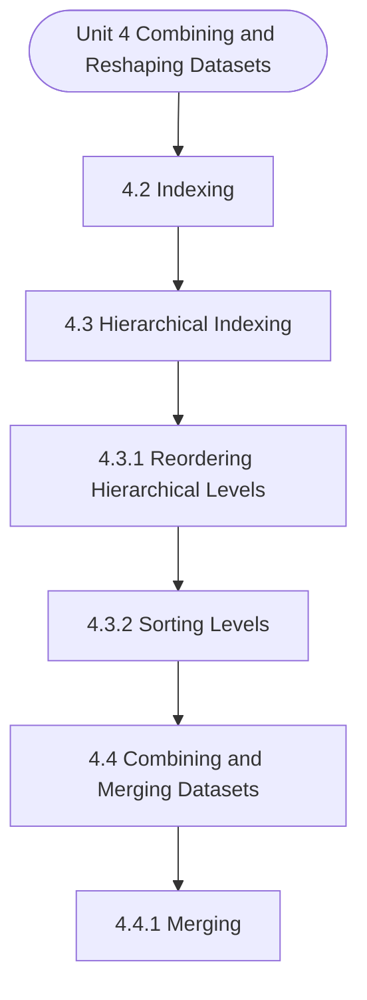

# MCS-067: Data Wrangling and Visualization
## Unit 4: Combining and Reshaping Datasets

> 📚 **Programme:** M.Sc. (Data Science and Analytics) | **Semester:** Semester 2  
> ⏱️ **Estimated Study Time:** ~46 mins | 📄 **Textbook Pages:** 24 Pages  
> 📥 **Original PDF:** [Download & View Authentic Textbook](../../../pdfs/Semester_2/MCS-067_Data_Wrangling_and_Visualization/Unit-4_Combining_and_Reshaping_Datasets.pdf)

---

### 🎯 Executive Concept & Data Science Relevance
In modern data systems and advanced analytics, **Combining and Reshaping Datasets** forms a vital conceptual pillar. Set theory is the fundamental bedrock of discrete mathematics, computer science, and data engineering. Relational database operations (SQL JOIN, UNION, INTERSECT), feature spaces, probability sample spaces, and categorical groupings are direct applications of set theory.

> [!NOTE]
> **Why this matters for your career:** Mastering combining and reshaping datasets equips you with the foundational principles required to reason mathematically about high-dimensional datasets, evaluate algorithm performance, and avoid statistical pitfalls in production machine learning pipelines.

### 🗺️ Visual Knowledge Architecture
The following concept map illustrates the structural hierarchy and learning trajectory of this module:



### 📖 Core Definitions & Terminology Cards

> 📌 **Set**  
> - **Formal Definition:** A well-defined collection of distinct objects, denoted typically by uppercase letters $A, B, X$. Distinctness implies no duplicate elements, and well-defined means for any entity $x$, either $x \in A$ or $x \notin A$ is deterministically decidable.  
> - 💡 **Practical Intuition & Analogy:** *Think of a Python `set({1, 2, 3})` where duplicate elements are collapsed and lookup is based on unique membership.*

> 📌 **Cardinality $\vert A \vert$ or $n(A)$**  
> - **Formal Definition:** The total count of distinct elements in a finite set $A$. If $\vert A \vert = n$, the set contains exactly $n$ distinct members. For infinite sets, cardinality characterizes transfinite sizes (e.g. countable $\aleph_0$ vs uncountable $c$).  
> - 💡 **Practical Intuition & Analogy:** *The output of `len(my_set)` in programming.*

> 📌 **Power Set $\mathcal{P}(A)$**  
> - **Formal Definition:** The set of all possible subsets of $A$, including the empty set $\emptyset$ and $A$ itself: $\mathcal{P}(A) = \lbrace S \mid S \subseteq A \rbrace$. If $\vert A \vert = n$, then $\vert \mathcal{P}(A) \vert = 2^n$.  
> - 💡 **Practical Intuition & Analogy:** *In feature selection, evaluating all possible combinations of $n$ features requires searching through the power set of features ( $2^n$ candidate models ).*

> 📌 **Subset & Proper Subset**  
> - **Formal Definition:** A set $A$ is a subset of $B$ ( $A \subseteq B$ ) if $\forall x \in A \implies x \in B$. It is a proper subset ( $A \subset B$ ) if $A \subseteq B$ and $A \neq B$ (i.e. $\exists y \in B$ such that $y \notin A$).  
> - 💡 **Practical Intuition & Analogy:** *All Data Scientists are Analysts ( $A \subseteq B$ ), but not all Analysts are Data Scientists ( $A \subset B$ ).*

> 📌 **Universal Set $U$**  
> - **Formal Definition:** A designated superset containing all objects and entities under active consideration in a given problem or domain. Every set $X$ in that context satisfies $X \subseteq U$.  
> - 💡 **Practical Intuition & Analogy:** *The entire master database table or global population before applying any filter conditions.*

> 📌 **Complement $A^c$ or $A'$**  
> - **Formal Definition:** The set of all elements in the universal set $U$ that do not belong to $A$: $A^c = \lbrace x \in U \mid x \notin A \rbrace = U \setminus A$.  
> - 💡 **Practical Intuition & Analogy:** *The NOT condition in filtering: selecting all records that do NOT match a criteria.*

### ⚡ Governing Mathematical Laws & Formula Cheatsheet
#### 🔹 Power Set Cardinality Theorem
$$
\vert\mathcal{P}(A)\vert = 2^n \quad \text{where } n = \vert A\vert
$$
- **Explanation:** Proved by induction or combinatorics: each of the $n$ elements has exactly 2 binary choices (to be included or excluded from a subset).

#### 🔹 Principle of Inclusion-Exclusion (2 Sets)
$$
\vert A \cup B\vert = \vert A\vert + \vert B\vert - \vert A \cap B\vert
$$
- **Explanation:** Prevents double-counting the elements present in the intersection when calculating the total union size.

#### 🔹 Principle of Inclusion-Exclusion (3 Sets)
$$
\begin{aligned} \vert A \cup B \cup C\vert = & \;\vert A\vert + \vert B\vert + \vert C\vert \\ & - (\vert A \cap B\vert + \vert B \cap C\vert + \vert A \cap C\vert) \\ & + \vert A \cap B \cap C\vert \end{aligned}
$$
- **Explanation:** Alternates adding singletons, subtracting pairwise overlaps, and re-adding the three-way intersection.

#### 🔹 De Morgan's Laws for Sets
$$
(A \cup B)^c = A^c \cap B^c \quad \text{and} \quad (A \cap B)^c = A^c \cup B^c
$$
- **Explanation:** The complement of a union is the intersection of the complements, and vice versa. Fundamental to query optimization and boolean logic.

#### 🔹 Cartesian Product Cardinality
$$
\vert A \times B\vert = \vert A\vert \times \vert B\vert = \lbrace (a, b) \mid a \in A, b \in B \rbrace
$$
- **Explanation:** Basis of relational database CROSS JOIN, generating every ordered pair between two entities.

### ⚖️ Axiomatic Properties & Governing Laws
The mathematical formulations of this module are anchored by foundational algebraic and structural laws:

- **Idempotent Laws:** $A \cup A = A \quad \text{and} \quad A \cap A = A$
- **Identity Laws:** $A \cup \emptyset = A \quad \text{and} \quad A \cap U = A$
- **Domination Laws:** $A \cup U = U \quad \text{and} \quad A \cap \emptyset = \emptyset$
- **Commutative Laws:** $A \cup B = B \cup A \quad \text{and} \quad A \cap B = B \cap A$
- **Associative Laws:** $(A \cup B) \cup C = A \cup (B \cup C) \quad \text{and} \quad (A \cap B) \cap C = A \cap (B \cap C)$
- **Distributive Laws:** $A \cap (B \cup C) = (A \cap B) \cup (A \cap C) \quad \text{and} \quad A \cup (B \cap C) = (A \cup B) \cap (A \cup C)$
- **Complement Laws:** $A \cup A^c = U, \quad A \cap A^c = \emptyset, \quad (A^c)^c = A$

### 📌 Comprehensive Section-by-Section Study Breakdown
#### `4.2` Indexing

##### 📘 Theoretical Principles & Pedagogical Exposition
In probability theory and statistical inference, **Indexing** formalizes the stochastic behavior of random phenomena. Within **Combining and Reshaping Datasets**, this framework allows data scientists to infer population parameters from finite empirical samples while quantifying uncertainty via confidence intervals and hypothesis tests.

The mathematical rigor here prevents statistical misinterpretations, such as confusing correlation with causation, overlooking sample selection bias, or violating distributional assumptions.

##### ⚙️ Mathematical & Algorithmic Mechanics
- **Core Mechanism:** Applies statistical and probabilistic modeling for combining and reshaping datasets. Formulates parameter estimation, variance reduction, and data distribution validation.
- **Boundary Conditions:** Small sample size limitations, extreme skewness, and violating underlying distribution assumptions.

##### 📊 Practical Data Science & Production Relevance
- **Production Workflow:** Production metric experimentation, automated anomaly detection, and data validation pipelines.
- **Real-World Pitfall:** Confusing correlation with causation or overlooking selection bias in data collection samples.

> [!TIP]
> **Exam & Technical Interview Insight:** State the governing formulas for indexing, compute summary statistics, and interpret numerical findings accurately.

#### `4.3` Hierarchical Indexing

##### 📘 Theoretical Principles & Pedagogical Exposition
Hierarchical indexing is used to create several levels of indexes within the same data frame or data structure. These indexes are also sometimes referred to as multi-indexing. For example, in Figure 1, you may create hierarchical indexes on Department and Specialisation. Why are they needed?

Hierarchical indexing is useful when a query on data uses data from multiple unrelated data attributes. They allow efficient data access and processing. For example, the hierarchical index on Department and Specialisation may allow efficient execution of the query: “List Name and Salary of employees in Database department who have SQL specialisation”, as data access using a hierarchical index on Department and Data Wrangling - II Specialisation would be much faster for this query.

The hierarchical query also helps in efficient grouping of data. Advantages of Hierarchical Indexing The following are the advantages of hierarchical indexing: • An interesting advantage of hierarchical indexing is that it allows data analysis, which involves multiple dimensions, even if the data is stored in a data frame.


##### ⚙️ Mathematical & Algorithmic Mechanics
- **Core Mechanism:** Applies statistical and probabilistic modeling for combining and reshaping datasets. Formulates parameter estimation, variance reduction, and data distribution validation.
- **Boundary Conditions:** Small sample size limitations, extreme skewness, and violating underlying distribution assumptions.

##### 📊 Practical Data Science & Production Relevance
- **Production Workflow:** Production metric experimentation, automated anomaly detection, and data validation pipelines.
- **Real-World Pitfall:** Confusing correlation with causation or overlooking selection bias in data collection samples.

> [!TIP]
> **Exam & Technical Interview Insight:** State the governing formulas for hierarchical indexing, compute summary statistics, and interpret numerical findings accurately.

#### `4.3.1` Reordering Hierarchical Levels

##### 📘 Theoretical Principles & Pedagogical Exposition
Reordering and sorting are two important operations on index levels of a hierarchical index. Reordering allows swapping of levels of indexes. For example, in Program 6, we have created a hierarchical index on Department and within department Specialisation. This is one of the logical hierarchy, as most of the queries would require grouping of data on Department and within department on Specialisation.

However, in certain cases you may want to reverse the order. For example, in Part(f) of Figure 6, we want to find employees who are specialised in SQL. However, the index on Department, Specialisation will not give efficient answer. However, changing the levels as Specialisation, Department will group all the employees with a specialisation in a same group.

Thus, enabling efficient data access. Reordering Hierarchical Index Using Pandas Reordering of index is done using swaplevel( )method. This method swaps the level of two indexing attributes. The format is: SwappedIndexName = ExistingIndexName.swaplevel(‘L1’, ‘L2’) The method is called by an existing hierarchical index consisting of hierarchy levels as L1, L2.


##### ⚙️ Mathematical & Algorithmic Mechanics
- **Core Mechanism:** Applies statistical and probabilistic modeling for combining and reshaping datasets. Formulates parameter estimation, variance reduction, and data distribution validation.
- **Boundary Conditions:** Small sample size limitations, extreme skewness, and violating underlying distribution assumptions.

##### 📊 Practical Data Science & Production Relevance
- **Production Workflow:** Production metric experimentation, automated anomaly detection, and data validation pipelines.
- **Real-World Pitfall:** Confusing correlation with causation or overlooking selection bias in data collection samples.

> [!TIP]
> **Exam & Technical Interview Insight:** State the governing formulas for reordering hierarchical levels, compute summary statistics, and interpret numerical findings accurately.

#### `4.3.2` Sorting Levels

##### 📘 Theoretical Principles & Pedagogical Exposition
In general, when you create a hierarchical index, it does not sort the data frames, which remain in the order of the default index, which starts from value 0, as shown in Figure 1. Sorting on levels allows sorting of data frames as per the hierarchical levels of an index. For example, in Program 6 Part (b), we have created a hierarchical index on Department and within the department Specialisation.

However, when we use this index to display the data frame, it is displayed as Part (b) of Figure 7. You may check that order of display is same as that of default index, as shown in Figure 1. This hierarchical index is then sorted, as shown in Part (c) of Figure 6, and now the data frame is printed using the index.

You may please note that after sorting the index, the data frame is displayed as shown in Part (c) of Figure 7. You may observe that all the department names are now being displayed in sorted order, and within each department, the specialisation is also being displayed in sorted order.


##### ⚙️ Mathematical & Algorithmic Mechanics
- **Core Mechanism:** Applies statistical and probabilistic modeling for combining and reshaping datasets. Formulates parameter estimation, variance reduction, and data distribution validation.
- **Boundary Conditions:** Small sample size limitations, extreme skewness, and violating underlying distribution assumptions.

##### 📊 Practical Data Science & Production Relevance
- **Production Workflow:** Production metric experimentation, automated anomaly detection, and data validation pipelines.
- **Real-World Pitfall:** Confusing correlation with causation or overlooking selection bias in data collection samples.

> [!TIP]
> **Exam & Technical Interview Insight:** State the governing formulas for sorting levels, compute summary statistics, and interpret numerical findings accurately.

#### `4.4` Combining and Merging Datasets

##### 📘 Theoretical Principles & Pedagogical Exposition
The hierarchical indexing, as discussed in the previous session, is used to organise data using different indexes. However, data from different sources is often combined to create a single, consistent dataset. This process is termed as combining the Datasets. You may please note that you can combine two datasets if some key attribute, index, or attribute is common to both datasets.

In case you are using the Pandas library of Python, then the combining operation is performed on objects having a structure similar to a series or a data frame. In this section, we discuss the two important data wrangling processes, namely merging and concatenating.


##### ⚙️ Mathematical & Algorithmic Mechanics
- **Core Mechanism:** Applies statistical and probabilistic modeling for combining and reshaping datasets. Formulates parameter estimation, variance reduction, and data distribution validation.
- **Boundary Conditions:** Small sample size limitations, extreme skewness, and violating underlying distribution assumptions.

##### 📊 Practical Data Science & Production Relevance
- **Production Workflow:** Production metric experimentation, automated anomaly detection, and data validation pipelines.
- **Real-World Pitfall:** Confusing correlation with causation or overlooking selection bias in data collection samples.

> [!TIP]
> **Exam & Technical Interview Insight:** State the governing formulas for combining and merging datasets, compute summary statistics, and interpret numerical findings accurately.

#### `4.4.1` Merging

##### 📘 Theoretical Principles & Pedagogical Exposition
Merging combines two data frames, which have at least one common key attribute. The objective of merging is to combine data from two different data frames into a single logical data frame that contains merged data of the two data frames based on the identical value of the merged key in the two data frames.

You may please note that the logic of merging two data frames is almost identical to that of the relational join operation. Merging can be performed on one or more keys. We will demonstrate merging with the help of an example. Consider the data of employees of an organisation as given in Figure 1.

Consider that the organisation also stores the data of the Projects on which each employee is working. A separate data frame is being maintained to keep this information. Figure 8 shows this data. Name Project Arav S XYZ Web Arav S Ecommerce Books Ravi M Ecommerce Books Rehan D XYZ Web Ben A ABC Web Figure 8: The Project Data of Employees given in Figure 1 You may please note that ‘Rai Y’ is a new employee and has not been assigned to any project, whereas ‘Arav D’ is working on two projects.


##### ⚙️ Mathematical & Algorithmic Mechanics
- **Core Mechanism:** Applies statistical and probabilistic modeling for combining and reshaping datasets. Formulates parameter estimation, variance reduction, and data distribution validation.
- **Boundary Conditions:** Small sample size limitations, extreme skewness, and violating underlying distribution assumptions.

##### 📊 Practical Data Science & Production Relevance
- **Production Workflow:** Production metric experimentation, automated anomaly detection, and data validation pipelines.
- **Real-World Pitfall:** Confusing correlation with causation or overlooking selection bias in data collection samples.

> [!TIP]
> **Exam & Technical Interview Insight:** State the governing formulas for merging, compute summary statistics, and interpret numerical findings accurately.

#### `4.4.2` Concatenating

##### 📘 Theoretical Principles & Pedagogical Exposition
Concatenation is the process of adding two data frames or series objects either horizontally or vertically. Let us explain some of the basic ways of concatenating data. Combining and Reshaping Datasets For example, assuming that an organisation has a second office at a different location, which has only one Department -Database.

Figure 11 shows the list of the employees of that office. Index # Name Department Specialisation Salary Priya Y Database SQL Pramod N Database SQL Ben A Database Web Development 200000 Figure 11: List of employees in the second office. Now, you are required to create a single list of all the employees, then you will be using the concat() method.

Program 4, as shown in Figure 12, shows an example of the use of the concat() method with different options for concatenation of rows, while Figure 13 shows the output of Figure 12. #Program 4 Part (a) import pandas as pd Figure1 = {'Name': ['Arav S', 'Ravi M', 'Rehan D', 'Ben A', 'Rai Y'], 'Department': ['Design', 'Database', 'Design', 'Database', 'Design'], 'Specialisation': ['Web Development', 'SQL', 'SQL', 'Web Development', 'SQL'], 'Salary': [100000, 200000, 150000, 200000, 100000]} employeedata = pd.DataFrame(Figure1) Figure11={'Name': ['Priya Y', 'Pramod N', 'Ben A'], 'Department': ['Database', 'Database', 'Database'], 'Specialisation': ['SQL', 'SQL', 'Web Development'], 'Salary': [150000, 100000, 200000]} employeedata2 = pd.DataFrame(Figure11) print(employeedata) print("\n") print(employeedata2) print("\n") #Program 4 Part (b) print("Part (b): Concatenating data of Figure 1 and Figure 11") ListOfEmployee = pd.concat([employeedata, employeedata2]) print(ListOfEmployee) print("\n") #Program 4 Part (c) print("Part (c): Concatenating data of Figure 1 and Figure 11 No Duplicate Data Frame and Reseting the Index") ListOfEmployeeNoDup = pd.concat([employeedata, employeedata2]).drop_duplicates().reset_index(drop=True) print(ListOfEmployeeNoDup) print("\n") Figure 12: Program of Concatenation of data of Figure 1 and Figure 11 Name Department Specialisation Salary 0 Arav S Design Web Development 100000 1 Ravi M Database SQL 200000 2 Rehan D Design SQL 150000 3 Ben A Database Web Development 200000 4 Rai Y Design SQL 100000 Name Department Specialisation Salary 0 Priya Y Database SQL 150000 1 Pramod N Database SQL 100000 2 Ben A Database Web Development 200000 Data Wrangling - II Part (b): Concatenating data of Figure 1 and Figure 11 Name Department Specialisation Salary 0 Arav S Design Web Development 100000 1 Ravi M Database SQL 200000 2 Rehan D Design SQL 150000 3 Ben A Database Web Development 200000 4 Rai Y Design SQL 100000 0 Priya Y Database SQL 150000 1 Pramod N Database SQL 100000 2 Ben A Database Web Development 200000 Part (c): Concatenating data of Figure 1 and Figure 11 No Duplicate Data Frame and Reseting the Index Name Department Specialisation Salary 0 Arav S Design Web Development 100000 1 Ravi M Database SQL 200000 2 Rehan D Design SQL 150000 3 Ben A Database Web Development 200000 4 Rai Y Design SQL 100000 5 Priya Y Database SQL 150000 6 Pramod N Database SQL 100000 Figure 13: Output of Concatenation of data of Figure 1 and Figure 11 Please observe the following points about Figure 12 and Figure 13: 1.


##### ⚙️ Mathematical & Algorithmic Mechanics
- **Core Mechanism:** Applies statistical and probabilistic modeling for combining and reshaping datasets. Formulates parameter estimation, variance reduction, and data distribution validation.
- **Boundary Conditions:** Small sample size limitations, extreme skewness, and violating underlying distribution assumptions.

##### 📊 Practical Data Science & Production Relevance
- **Production Workflow:** Production metric experimentation, automated anomaly detection, and data validation pipelines.
- **Real-World Pitfall:** Confusing correlation with causation or overlooking selection bias in data collection samples.

> [!TIP]
> **Exam & Technical Interview Insight:** State the governing formulas for concatenating, compute summary statistics, and interpret numerical findings accurately.

#### `4.4.3` Combining Data with Overlap

##### 📘 Theoretical Principles & Pedagogical Exposition
Combining data frames is a very interesting way of combining the data from two different sources. It differs from merging and concatenating, as it tries to combine missing data in a row with available data in another file. Consider an example, suppose the data of employees of an organisation (Figure 1) got corrupted.

The file was recovered, but it lost part of the data in a few columns. An old backup of this file was found and is used to recover the data of the file. Please note that such recovery will not guarantee complete correctness. We are showing the process of performing such actions using Pandas of Python.

Figure 16 shows the program for combining two files using Pandas, while Figure 17 shows the output of the Program of Figure 16. #Program 6: Part (a) #Import the Pandas library import pandas as pd import numpy as np #Create a New Employee data from Part of Data of Figure 1 Figure1New = {'Name': ['Arav S', 'Ravi M', 'Ben A', 'Rai Y'], 'Department': ['Design', np.nan, np.nan , 'Design'], 'Specialisation': [np.nan, 'SQL', 'Web Development', np.nan], 'Salary': [100000, 200000, 200000, 100000]} Data Wrangling - II employeedataNew = pd.DataFrame(Figure1New) #Create the OLD employee data Frame without Salary data Figure1Old = {'Name': ['Arav S', 'Ravi M', 'Rehan D', 'Ben A', 'Rai Y'], 'Department': ['Design', 'Database', 'Design', 'Database', 'Design'], 'Specialisation': ['Web Development', 'SQL', 'SQL', 'Web Development', 'SQL']} employeedataOld = pd.DataFrame(Figure1Old) # Part (a): Create sorted index on 'Name' for both the data frames print("Part(a): Create sorted index on 'Name' for both the data frames") Employeedata_New_sorted = employeedataNew.set_index(['Name']).sort_index() print("Sorted Index on Name for New Employee data") print(Employeedata_New_sorted) Employeedata_Old_sorted = employeedataOld.set_index(['Name']).sort_index() print("\n") print("Sorted Index on Name for Old Employee data") print(Employeedata_Old_sorted) print("\n") # Part (b): Combining data using Combine.first method print("Part(b): Combining data using Combine.first method") finalList = Employeedata_New_sorted.combine_first(Employeedata_Old_sorted) print(finalList) print("\n") Figure 16: Program to combine two data frames Part(a): Create sorted index on 'Name' for both the data frames Sorted Index on Name for New Employee data Department Specialisation Salary Name Arav S Design NaN 100000 Ben A NaN Web Development 200000 Rai Y Design NaN 100000 Ravi M NaN SQL 200000 Sorted Index on Name for Old Employee data Department Specialisation Name Arav S Design Web Development Ben A Database Web Development Rai Y Design SQL Ravi M Database SQL Rehan D Design SQL Part(b): Combining data using Combine.first method Department Salary Specialisation Name Arav S Design 100000.0 Web Development Ben A Database 200000.0 Web Development Rai Y Design 100000.0 SQL Ravi M Database 200000.0 SQL Rehan D Design NaN SQL Figure 17:Results of combining two data frames Please observe the following points about Figure 16 and Figure 17: 1.


##### ⚙️ Mathematical & Algorithmic Mechanics
- **Core Mechanism:** Applies statistical and probabilistic modeling for combining and reshaping datasets. Formulates parameter estimation, variance reduction, and data distribution validation.
- **Boundary Conditions:** Small sample size limitations, extreme skewness, and violating underlying distribution assumptions.

##### 📊 Practical Data Science & Production Relevance
- **Production Workflow:** Production metric experimentation, automated anomaly detection, and data validation pipelines.
- **Real-World Pitfall:** Confusing correlation with causation or overlooking selection bias in data collection samples.

> [!TIP]
> **Exam & Technical Interview Insight:** State the governing formulas for combining data with overlap, compute summary statistics, and interpret numerical findings accurately.

### 📐 Step-by-Step Solved Mathematical Examples
To solidify your theoretical understanding, work through these fully solved, step-by-step mathematical problems:

#### 🧮 Example 1: Three-Set Inclusion-Exclusion Survey Analysis
> **Problem Statement:**  
> In a cohort of 120 Data Science students, 65 know Python ( $P$ ), 50 know SQL ( $S$ ), and 40 know R ( $R$ ). Furthermore, 25 know both Python and SQL, 20 know both Python and R, 15 know both SQL and R, and 8 know all three technologies. How many students know at least one technology, and how many know none?

**Detailed Step-by-Step Solution:**

Applying the Principle of Inclusion-Exclusion for 3 sets:


$$
\begin{aligned} \vert P \cup S \cup R\vert & = \vert P\vert + \vert S\vert + \vert R\vert - (\vert P \cap S\vert + \vert P \cap R\vert + \vert S \cap R\vert) + \vert P \cap S \cap R\vert \\ & = 65 + 50 + 40 - (25 + 20 + 15) + 8 \\ & = 155 - 60 + 8 = 103 \text{ students.} \end{aligned}
$$


The count of students who know none of the three languages is:


$$
\vert(P \cup S \cup R)^c\vert = \vert U\vert - \vert P \cup S \cup R\vert = 120 - 103 = 17 \text{ students.}
$$


#### 🧮 Example 2: Power Set Enumeration and Proper Subset Calculation
> **Problem Statement:**  
> Given $S = \lbrace 1, 2, 3 \rbrace$. Calculate $\vert\mathcal{P}(S)\vert$, enumerate every element, and find the number of proper subsets.

**Detailed Step-by-Step Solution:**

1. **Cardinality:** With $n = \vert S\vert = 3$, the total subsets are $\vert\mathcal{P}(S)\vert = 2^3 = 8$.

2. **Enumeration:**

$$
\mathcal{P}(S) = \lbrace \emptyset, \lbrace 1\rbrace, \lbrace 2\rbrace, \lbrace 3\rbrace, \lbrace 1, 2\rbrace, \lbrace 1, 3\rbrace, \lbrace 2, 3\rbrace, \lbrace 1, 2, 3\rbrace \rbrace
$$


3. **Proper Subsets:** Since proper subsets exclude the set itself, the total count is $2^n - 1 = 8 - 1 = 7$.

### 💻 Practical Data Science Implementation (Python)
Theory translates directly into production algorithms. Below is a self-contained, commented Python implementation illustrating the core operations of this unit:

```python
# Practical Set Operations in Data Science
python_devs = {"Alice", "Bob", "Charlie", "David", "Eva"}
sql_devs = {"Charlie", "David", "Eva", "Frank", "Grace"}

# 1. Union (Full talent pool)
all_talent = python_devs | sql_devs
print(f"Total Unique Talent: {len(all_talent)} -> {all_talent}")

# 2. Intersection (Full-Stack Data Engineers)
full_stack = python_devs & sql_devs
print(f"Full-Stack Talent (Python & SQL): {len(full_stack)} -> {full_stack}")

# 3. Difference (Python Specialists without SQL)
python_only = python_devs - sql_devs
print(f"Python Only: {python_only}")

# 4. Jaccard Similarity Coefficient: |A ∩ B| / |A ∪ B|
jaccard_sim = len(full_stack) / len(all_talent)
print(f"Jaccard Skill Overlap: {jaccard_sim:.3f}")
```

### 💡 Interactive Self-Assessment Checkpoints
Test your comprehension before proceeding. Tap each question to reveal the comprehensive explanation:

<details>
<summary><b>Checkpoint 1:</b> Create a data frame for the Student Results in courses and create a sorted index on Course for the data frame. <i>(Tap to reveal answer)</i></summary>

> **Answer & Analysis:**  
> **Detailed Analytical Solution:**
> 
> 1. **Core Principle:** Identify the governing theorem or definition for Combining and Reshaping Datasets.
> 2. **Step-by-Step Derivation:** Verify all preconditions and compute intermediate steps methodically.
> 3. **Conclusion:** State the final mathematical proof or calculation clearly, validating boundary edge cases.
</details>

<details>
<summary><b>Checkpoint 2:</b> Use the index to display the results of the course MCS211. <i>(Tap to reveal answer)</i></summary>

> **Answer & Analysis:**  
> **Detailed Analytical Solution:**
> 
> 1. **Core Principle:** Identify the governing theorem or definition for Combining and Reshaping Datasets.
> 2. **Step-by-Step Derivation:** Verify all preconditions and compute intermediate steps methodically.
> 3. **Conclusion:** State the final mathematical proof or calculation clearly, validating boundary edge cases.
</details>

<details>
<summary><b>Checkpoint 3:</b> Create a Hierarchical index on Student Name and Course, and display the results if the sorted index. 101 Data Wrangling - II <i>(Tap to reveal answer)</i></summary>

> **Answer & Analysis:**  
> **Detailed Analytical Solution:**
> 
> 1. **Core Principle:** Identify the governing theorem or definition for Combining and Reshaping Datasets.
> 2. **Step-by-Step Derivation:** Verify all preconditions and compute intermediate steps methodically.
> 3. **Conclusion:** State the final mathematical proof or calculation clearly, validating boundary edge cases.
</details>

<details>
<summary><b>Checkpoint 4:</b> Find the Result of the student named Z in the MCS211 course using the index made in question 3. <i>(Tap to reveal answer)</i></summary>

> **Answer & Analysis:**  
> **Detailed Analytical Solution:**
> 
> 1. **Core Principle:** Identify the governing theorem or definition for Combining and Reshaping Datasets.
> 2. **Step-by-Step Derivation:** Verify all preconditions and compute intermediate steps methodically.
> 3. **Conclusion:** State the final mathematical proof or calculation clearly, validating boundary edge cases.
</details>

<details>
<summary><b>Checkpoint 5:</b> If a set $A$ has 5 elements, how many proper subsets does it possess? <i>(Tap to reveal answer)</i></summary>

> **Answer & Analysis:**  
> A set with $n=5$ elements has total subsets $\vert\mathcal{P}(A)\vert = 2^5 = 32$. Proper subsets exclude the set itself, so the number of proper subsets is $2^n - 1 = 32 - 1 = 31$.
</details>

<details>
<summary><b>Checkpoint 6:</b> What is the difference between $x \in A$ and $\lbrace x\rbrace \subseteq A$? <i>(Tap to reveal answer)</i></summary>

> **Answer & Analysis:**  
> $x \in A$ denotes that element $x$ is a direct member of set $A$. In contrast, $\lbrace x\rbrace \subseteq A$ denotes that the singleton set containing $x$ is a subset of $A$.
</details>

### 🎯 Executive Module Wrap-Up
- **Central Idea:** Combining and Reshaping Datasets provides essential mathematical and algorithmic tools directly utilized in Data Science.
- **Mathematical Rigor:** Formulas and laws must be memorized with attention to boundary conditions and assumptions.
- **Full Textbook Coverage:** For exhaustive multi-page derivations, proofs, and supplementary exercises, consult the [Authentic IGNOU Textbook](../../../pdfs/Semester_2/MCS-067_Data_Wrangling_and_Visualization/Unit-4_Combining_and_Reshaping_Datasets.pdf).

---
### 🧭 Navigation & Syllabus Index
[⬅ Previous: Unit 3](unit_03_Data_Transformation.md) | [📑 Course Index](README.md) | [Next: Unit 5 ➡](unit_05_Data_Aggregation_and_Group_Operations.md)
