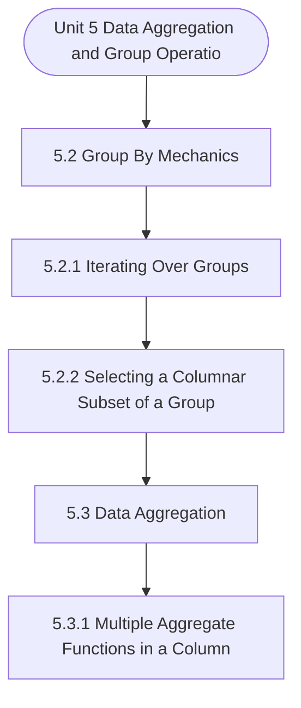

# MCS-067: Data Wrangling and Visualization
## Unit 5: Data Aggregation and Group Operations

> 📚 **Programme:** M.Sc. (Data Science and Analytics) | **Semester:** Semester 2  
> ⏱️ **Estimated Study Time:** ~44 mins | 📄 **Textbook Pages:** 22 Pages  
> 📥 **Original PDF:** [Download & View Authentic Textbook](../../../pdfs/Semester_2/MCS-067_Data_Wrangling_and_Visualization/Unit-5_Data_Aggregation_and_Group_Operations.pdf)

---

### 🎯 Executive Concept & Data Science Relevance
In modern data systems, **Data Aggregation and Group Operations** forms a vital conceptual pillar. Descriptive statistics provide quantitative summaries of dataset properties. Measures of central tendency identify typical values, while measures of dispersion quantify data spread, uncertainty, and variability—critical for feature normalization and anomaly detection.

> [!NOTE]
> **Why this matters for your career:** Mastering data aggregation and group operations equips you with the foundational principles required to reason mathematically about high-dimensional datasets, evaluate algorithm performance, and avoid statistical pitfalls in production machine learning pipelines.

### 🗺️ Visual Knowledge Architecture
The following concept map illustrates the structural hierarchy and learning trajectory of this module:



### 📖 Core Definitions & Terminology Cards

> 📌 **Arithmetic Mean $\bar{x}$ or $\mu$**  
> - **Formal Definition:** The sum of all observations divided by the total number of observations: $\bar{x} = \frac{1}{n}\sum_{i=1}^n x_i$. Sensitive to extreme outliers.  
> - 💡 **Practical Intuition & Analogy:** *The center of mass or balance point of the distribution.*

> 📌 **Median**  
> - **Formal Definition:** The physical middle value separating the higher half from the lower half of an ordered dataset. Robust against outliers.  
> - 💡 **Practical Intuition & Analogy:** *The 50th percentile value where exactly half the data lies above and half below.*

> 📌 **Standard Deviation $\sigma$ or $s$**  
> - **Formal Definition:** The square root of variance, measuring average dispersion in original units: $s = \sqrt{\frac{1}{n-1}\sum (x_i - \bar{x})^2}$.  
> - 💡 **Practical Intuition & Analogy:** *The typical distance data points deviate from the mean.*

> 📌 **Coefficient of Variation ($CV$)**  
> - **Formal Definition:** Relative dispersion measure expressed as a percentage: $CV = \frac{\sigma}{\mu} \times 100\%$. Enables comparison across different measurement scales.  
> - 💡 **Practical Intuition & Analogy:** *Comparing stock volatility across assets priced at 10 USD vs 1,000 USD.*

### ⚡ Governing Mathematical Laws & Formula Cheatsheet
#### 🔹 Sample Variance Formula (Bessel's Correction)
$$
\begin{aligned} s^2 & = \frac{1}{n - 1} \sum_{i=1}^n (x_i - \bar{x})^2 \\ & = \frac{\sum x_i^2 - \frac{(\sum x_i)^2}{n}}{n - 1} \end{aligned}
$$
- **Explanation:** Using $n-1$ in the denominator corrects for downward sample bias, yielding an unbiased estimator of population variance $\sigma^2$.

#### 🔹 Interquartile Range (IQR) & Outlier Bounds
$$
\text{IQR} = Q_3 - Q_1, \quad \text{Outliers} < Q_1 - 1.5(\text{IQR}) \;\lor\; > Q_3 + 1.5(\text{IQR})
$$
- **Explanation:** Standard Tukey boxplot rule for identifying extreme data points robustly.

#### 🔹 Pearson's First Coefficient of Skewness
$$
Sk_1 = \frac{\text{Mean} - \text{Mode}}{\sigma} \quad \text{or} \quad Sk_2 = \frac{3(\text{Mean} - \text{Median})}{\sigma}
$$
- **Explanation:** Measures asymmetry: Positive skew means mean > median (right tail); negative skew means mean < median (left tail).

### ⚖️ Axiomatic Properties & Governing Laws
The mathematical formulations of this module are anchored by foundational algebraic and structural laws:

- **Variance Scaling Rule:** $\text{Var}(aX + b) = a^2 \text{Var}(X)$
- **Standard Deviation Scaling:** $\sigma(aX + b) = \vert a\vert \sigma(X)$
- **Empirical Rule (Normal Distribution):** 68% within $\mu \pm 1\sigma$, 95% within $\mu \pm 2\sigma$, 99.7% within $\mu \pm 3\sigma$

### 📌 Comprehensive Section-by-Section Study Breakdown
#### `5.2` Group By Mechanics
##### 📘 Theoretical Principles & In-Depth Exposition
Groups are created to perform a basic set of analytical functions on the data of the group. How will you be able to access data in each group or sub-group? One such method is to iterate over groups. This process can help in creating a separate list of records in an object, which can then be handled separately.

Figure 2 part (b) shows an example of ways of handling groups by iterating over them. Please note that the for loop is performed on two objects: employee_department and employee_data. The first of the two objects contains the group name value, and the second object contains the records or rows that are part of the group.

For example, in Figure 2, we have created grouping on ‘Department’ column. Since, there are only two values of ‘Department’ column, viz. ‘Database’ and ‘Design’, only two subgroups will be formed – one on ‘Database’ (with record numbers 1 and 3) and other on ‘Design” (with record numbers 0, 2 and 4).

##### ⚙️ Mathematical & Algorithmic Mechanics
- **Formal Mechanics:** Establishes symbolic transformations and state invariants governing group by mechanics.
- **Boundary Invariants:** Ensures robust error-handling, non-empty set guarantees, and strict asymptotic bounds.

##### 📊 Practical Data Science & Production Relevance
- **Industry Application:** Directly implemented in production workflows such as SQL query filters, pandas vectorized operations, and feature transformation pipelines.
- **Production Pitfall:** Failing to verify membership bounds or missing edge cases in group by mechanics can cause silent data corruption or performance bottlenecks.

> [!TIP]
> **Key Exam & Technical Interview Takeaway:** Be prepared to define group by mechanics formally, cite its core mathematical invariants, and solve step-by-step numerical/proof questions.

#### `5.2.1` Iterating Over Groups
##### 📘 Theoretical Principles & In-Depth Exposition
Groups are created to perform a basic set of analytical functions on the data of the group. How will you be able to access data in each group or sub-group? One such method is to iterate over groups. This process can help in creating a separate list of records in an object, which can then be handled separately.

Figure 2 part (b) shows an example of ways of handling groups by iterating over them. Please note that the for loop is performed on two objects: employee_department and employee_data. The first of the two objects contains the group name value, and the second object contains the records or rows that are part of the group.

For example, in Figure 2, we have created grouping on ‘Department’ column. Since, there are only two values of ‘Department’ column, viz. ‘Database’ and ‘Design’, only two subgroups will be formed – one on ‘Database’ (with record numbers 1 and 3) and other on ‘Design” (with record numbers 0, 2 and 4).

##### ⚙️ Mathematical & Algorithmic Mechanics
- **Formal Mechanics:** Establishes symbolic transformations and state invariants governing iterating over groups.
- **Boundary Invariants:** Ensures robust error-handling, non-empty set guarantees, and strict asymptotic bounds.

##### 📊 Practical Data Science & Production Relevance
- **Industry Application:** Directly implemented in production workflows such as SQL query filters, pandas vectorized operations, and feature transformation pipelines.
- **Production Pitfall:** Failing to verify membership bounds or missing edge cases in iterating over groups can cause silent data corruption or performance bottlenecks.

> [!TIP]
> **Key Exam & Technical Interview Takeaway:** Be prepared to define iterating over groups formally, cite its core mathematical invariants, and solve step-by-step numerical/proof questions.

#### `5.2.2` Selecting a Columnar Subset of a Group
##### 📘 Theoretical Principles & In-Depth Exposition
After grouping the data, you may like to perform separate group operations on the data. Further, you may not like to display some columns of the data frame at all. In addition, some of these columns can be used to compute the aggregated data. The program code of Figure 6 presents an example for the selection of columns.

import pandas as pd #Part (a) Create the data of the employees empdata = {'Name': ['Arav S', 'Ravi M', 'Rehan D', 'Ben A', 'Rai Y'], 'Department': ['Design', 'Database', 'Design', 'Database', 'Design'], 'Specialisation': ['Web Development', 'SQL', 'SQL', 'Web Development', 'SQL'], 'Salary': [100000, 200000, 150000, 200000, 100000], 'YearsWorking': [3.5, 2.5, 1.5, 2.0, 1.0]} #Creating a data frame of the data of employees Employee_data = pd.DataFrame(empdata) #Create a Group on the Department Employee_groups = Employee_data.groupby('Department') #Part (b): Selecting only the Salary and YearsWorking columns of data along with the grouped column.

selected_columns = Employee_groups[['Salary', 'YearsWorking']] print("Part (b): Selecting only Salary and YearsWorking columns of data along with the grouped column.") for employee_department, employee_data in selected_columns: print(employee_department) print(employee_data) Data Aggregation and Group Operations #Part (c): Showing the Grouped Columns using the Aggregate functions on Salary and YearsWorking data.

##### ⚙️ Mathematical & Algorithmic Mechanics
- **Formal Mechanics:** Establishes symbolic transformations and state invariants governing selecting a columnar subset of a group.
- **Boundary Invariants:** Ensures robust error-handling, non-empty set guarantees, and strict asymptotic bounds.

##### 📊 Practical Data Science & Production Relevance
- **Industry Application:** Directly implemented in production workflows such as SQL query filters, pandas vectorized operations, and feature transformation pipelines.
- **Production Pitfall:** Failing to verify membership bounds or missing edge cases in selecting a columnar subset of a group can cause silent data corruption or performance bottlenecks.

> [!TIP]
> **Key Exam & Technical Interview Takeaway:** Be prepared to define selecting a columnar subset of a group formally, cite its core mathematical invariants, and solve step-by-step numerical/proof questions.

#### `5.3` Data Aggregation
##### 📘 Theoretical Principles & In-Depth Exposition
In the context of data wrangling, data aggregation primarily involves the process of summarising data. Such summarisation of data is possible only if the data is well organised. Thus, raw data is first processed and combined to create structured data. For example, a University may keep information about students’ assignment results in several files.

This data may be processed to create consistent data about the student’s grade cards. This data can then be summarised to create information about the number of students who passed in a University programme. The following table displays the list of the most useful aggregate functions: Data Aggregation and Group Operations Figure 8: Functions/Methods of Data Aggregation You can apply several aggregation functions to a column.

##### ⚙️ Mathematical & Algorithmic Mechanics
- **Formal Mechanics:** Establishes symbolic transformations and state invariants governing data aggregation.
- **Boundary Invariants:** Ensures robust error-handling, non-empty set guarantees, and strict asymptotic bounds.

##### 📊 Practical Data Science & Production Relevance
- **Industry Application:** Directly implemented in production workflows such as SQL query filters, pandas vectorized operations, and feature transformation pipelines.
- **Production Pitfall:** Failing to verify membership bounds or missing edge cases in data aggregation can cause silent data corruption or performance bottlenecks.

> [!TIP]
> **Key Exam & Technical Interview Takeaway:** Be prepared to define data aggregation formally, cite its core mathematical invariants, and solve step-by-step numerical/proof questions.

#### `5.3.1` Multiple Aggregate Functions in a Column
##### 📘 Theoretical Principles & In-Depth Exposition
Multiple Aggregate Functions in a Column Aggregate functions provide a summarised view of data. In certain situations, you want to apply several aggregate functions on a column. This enhances the efficiency of data processing. For example, if you want to find the average salary, total salary and maximum in a department, you will be required to apply multiple aggregate functions in a single aggregation operation.

Figure 9, Part (a) applies multiple aggregate functions, viz. 'count', 'mean' and 'std' on the column named ‘YearsWorking’. You may observe the output given in Figure 10, Part (a), which clearly shows the separate values of each aggregated output. Please also note that the overall aggregation of data is for every department, and the values of count, mean, and standard deviation are calculated for each department’s data in the column ‘YearsWorking’.

import pandas as pd #Create the data of the employees empdata = {'Name': ['Arav S', 'Ravi M', 'Rehan D', 'Ben A', 'Rai Y'], 'Department': ['Design', 'Database', 'Design', 'Database', 'Design'], 'Specialisation': ['Web Development', 'SQL', 'SQL', 'Web Development', 'SQL'], 'Salary': [100000, 200000, 150000, 200000, 100000], 'YearsWorking': [3.5, 2.5, 1.5, 2.0, 1.0]} #Creating a data frame of the data of employees Employee_data = pd.DataFrame(empdata) #Part (a): Performing Multiple Functions on YearsWorking column.

##### ⚙️ Mathematical & Algorithmic Mechanics
- **Formal Mechanics:** Establishes symbolic transformations and state invariants governing multiple aggregate functions in a column.
- **Boundary Invariants:** Ensures robust error-handling, non-empty set guarantees, and strict asymptotic bounds.

##### 📊 Practical Data Science & Production Relevance
- **Industry Application:** Directly implemented in production workflows such as SQL query filters, pandas vectorized operations, and feature transformation pipelines.
- **Production Pitfall:** Failing to verify membership bounds or missing edge cases in multiple aggregate functions in a column can cause silent data corruption or performance bottlenecks.

> [!TIP]
> **Key Exam & Technical Interview Takeaway:** Be prepared to define multiple aggregate functions in a column formally, cite its core mathematical invariants, and solve step-by-step numerical/proof questions.

#### `5.3.2` Column-wise Aggregation
##### 📘 Theoretical Principles & In-Depth Exposition
Interestingly, Python also allows you to perform separate aggregations for separate columns of the data. One such example of this feature is shown in Part (c) of Program 6, where different aggregate functions have been selected on a group by object selected_columns using the. aggregate method call.

You may notice that the ‘Salary’ column is aggregated using the sum method, whereas the ‘YearsWorking’ column is aggregated using the max and min methods. Another example of aggregation is presented in Figure 11. import pandas as pd #Part (a) Create the data of the employees empdata = {'Name': ['Arav S', 'Ravi M', 'Rehan D', 'Ben A', 'Rai Y'], 'Department': ['Design', 'Database', 'Design', 'Database', 'Design'], 'Specialisation': ['Web Development', 'SQL', 'SQL', 'Web Development', 'SQL'], 'Salary': [100000, 200000, 150000, 200000, 100000], 'YearsWorking': [3.5, 2.5, 1.5, 2.0, 1.0]} #Creating a data frame of the data of employees Employee_data = pd.DataFrame(empdata) #Part (a): Create Groups on the Department and Specialisation and print them by iterating over groups print("Part (a): The Groups on Department and Specialisation: \n") Data Aggregation and Group Operations Employee_Multi_group = Employee_data.groupby(['Department','Specialisation']) for employee_depart_Spec, employee_data_multi in Employee_Multi_group: print(employee_depart_Spec) print(employee_data_multi,"\n") #Part (b) Aggregating Data using different methods AggregateOfData = Employee_Multi_group.aggregate( NoOfEmployees = ('Name', 'count'), Total_Salary=('Salary', 'sum'), Mean_Exp=('YearsWorking', 'mean') ).reset_index() print("\nPart (b) Aggregated Data using different methods:") print(AggregateOfData) Figure 11: Aggregating Data The program given in Figure 11 is explained as under: 1.

Figure 11 Part (a) creates the data frame Employee_data, which contains the hypothetical data of the employees. This data frame is then grouped on multiple columns, namely ‘Department’ and ‘Specialisation’. This grouped data is printed by iterating over the groups. You can observe the output of this grouped data in Figure 12, part(a).

##### ⚙️ Mathematical & Algorithmic Mechanics
- **Formal Mechanics:** Establishes symbolic transformations and state invariants governing column-wise aggregation.
- **Boundary Invariants:** Ensures robust error-handling, non-empty set guarantees, and strict asymptotic bounds.

##### 📊 Practical Data Science & Production Relevance
- **Industry Application:** Directly implemented in production workflows such as SQL query filters, pandas vectorized operations, and feature transformation pipelines.
- **Production Pitfall:** Failing to verify membership bounds or missing edge cases in column-wise aggregation can cause silent data corruption or performance bottlenecks.

> [!TIP]
> **Key Exam & Technical Interview Takeaway:** Be prepared to define column-wise aggregation formally, cite its core mathematical invariants, and solve step-by-step numerical/proof questions.

#### `5.4` Grouping with Dictionaries and Series
##### 📘 Theoretical Principles & In-Depth Exposition
SERIES In the previous sections, we have discussed about grouping a dataframe using one or multiple columns. In this section, we will discuss how grouping can be done with the help of a dictionary or a series. When grouping by dictionary, you create a mapping of a different set of values or column names, whereas a series is used to assign certain labels on which grouping can be performed in rows.

Grouping is performed using a dictionary or a series when no column is available for grouping or when grouping is needed on metadata. import pandas as pd #Part (a) Create the data of the employees, which is indexed by the employee name empdata = {'Name': ['Arav S', 'Ravi M', 'Rehan D', 'Ben A', 'Rai Y'], 'Department': ['Design', 'Database', 'Design', 'Database', 'Design'], 'Specialisation': ['Web Development', 'SQL', 'SQL', 'Web Development', 'SQL'], 'Salary': [100000, 200000, 150000, 200000, 100000], 'YearsWorking': [3.5, 2.5, 1.5, 2.0, 1.0]} #Part (a.1): Creating a data frame of the data of employees Employee_data = pd.DataFrame(empdata) Indexed_Emp_data = Employee_data.set_index('Name').sort_index() print("Part (a.1): Employee Data Frame indexed on Name and sorted:\n", Indexed_Emp_data) #Part (a.2) Create Project mapping using a Dictionary assigned_project = {'Arav S': 'e-commerce','BenA':'e-commerce', 'Rai Y':'M-commerce','Ravi M': 'M-commerce', 'Rehan D':'e- commerce'} print("\nPart (a.2): Dictionary used for Grouping:\n",assigned_project) Data Aggregation and Group Operations # Part (a.3): Performing GroupBy of a Dataframe using a Dictionary.

Please note the use of 'axis=0', as this creates a grouping by row indexes. For column grouping, use 'axis=1'. grouped_by_projects = Indexed_Emp_data.groupby(assigned_project, axis=0).aggregate({ 'YearsWorking': ['count', 'mean'], 'Salary': ['sum', 'max']}) #Please note that aggregation is also performed using a dictionary.

##### ⚙️ Mathematical & Algorithmic Mechanics
- **Formal Mechanics:** Establishes symbolic transformations and state invariants governing grouping with dictionaries and series.
- **Boundary Invariants:** Ensures robust error-handling, non-empty set guarantees, and strict asymptotic bounds.

##### 📊 Practical Data Science & Production Relevance
- **Industry Application:** Directly implemented in production workflows such as SQL query filters, pandas vectorized operations, and feature transformation pipelines.
- **Production Pitfall:** Failing to verify membership bounds or missing edge cases in grouping with dictionaries and series can cause silent data corruption or performance bottlenecks.

> [!TIP]
> **Key Exam & Technical Interview Takeaway:** Be prepared to define grouping with dictionaries and series formally, cite its core mathematical invariants, and solve step-by-step numerical/proof questions.

#### `5.5` Grouping with Functions
##### 📘 Theoretical Principles & In-Depth Exposition
Functions are, in general, useful for grouping data on date/time columns or a part of a string. Further, the functions can be used to group data frames by index or by column. In this section, the grouping by function has been explained with the help of an example involving grouping by date and the first character of the name.

For this example, we have changed one of the columns of the data, i.e., instead of years of working, we have created a column named DateOfJoining, which contains the data of date type. Since Python does not have a built-in date type, we use the datetime module of Python for dealing with dates.

Please refer to line 2 of Figure 15, which imports the datetime Data Aggregation and Group Operations module. Figure 15 shows a program for grouping by functions, and Figure 16 shows the results of this program. import pandas as pd from datetime import datetime #Part (a) Create the data of the employees, which is indexed by the employee name empdata = {'Name': ['Arav S', 'Ravi M', 'Rehan D', 'Ben A', 'Rai Y'], 'Department': ['Design', 'Database', 'Design', 'Database', 'Design'], 'Specialisation': ['Web Development', 'SQL', 'SQL', 'Web Development', 'SQL'], 'Salary': [100000, 200000, 150000, 200000, 100000], 'DateOfJoining': [datetime(2023, 2, 16), datetime(2024, 12, 2), datetime(2024, 10, 23), datetime(2025, 4, 13), datetime(2023, 8, 31)]} #Creating a data frame of the data of employees and print it Employee_data = pd.DataFrame(empdata) print("Part (a): Employee Data Frame i:\n", Employee_data) # Part (b): Creating a Group on the First character of the 'Name' by using a Lambda function GroupbyFirstCharacterofName = Employee_data.groupby(lambda x: Employee_data.loc[x, "Name"][0]) # Displaying the group using an iterator print("\nPart(b): Grouping using First Character of the Name") for Name_first_char, employees in GroupbyFirstCharacterofName: print("\nEmployee with Name starting with", Name_first_char,":") print(employees) # Part (c): Creating a Group on DateOfJoining column 'using a Lambda function and performing aggregate functions yearly_joined = Employee_data.groupby( lambda x: Employee_data.loc[x, "DateOfJoining"].strftime("%Y") ).aggregate({ 'Name': ['count'], 'Salary': ['mean']}) print("\nPart (c): Grouping by using Year") print("\nAnnual employees joining count with Mean Salary", yearly_joined) Figure 15: Grouping with Functions The details of the Figure 15 and Figure 16 are explained below: 1.

##### ⚙️ Mathematical & Algorithmic Mechanics
- **Formal Mechanics:** Establishes symbolic transformations and state invariants governing grouping with functions.
- **Boundary Invariants:** Ensures robust error-handling, non-empty set guarantees, and strict asymptotic bounds.

##### 📊 Practical Data Science & Production Relevance
- **Industry Application:** Directly implemented in production workflows such as SQL query filters, pandas vectorized operations, and feature transformation pipelines.
- **Production Pitfall:** Failing to verify membership bounds or missing edge cases in grouping with functions can cause silent data corruption or performance bottlenecks.

> [!TIP]
> **Key Exam & Technical Interview Takeaway:** Be prepared to define grouping with functions formally, cite its core mathematical invariants, and solve step-by-step numerical/proof questions.

### 📐 Step-by-Step Solved Mathematical Examples
To solidify your theoretical understanding, work through these fully solved, step-by-step mathematical problems:

#### 🧮 Example 1: Sample Variance and Standard Deviation Computation
> **Problem Statement:**  
> Given sample observations: $X = \lbrace 4, 8, 6, 5, 7 \rbrace$. Compute sample mean $\bar{x}$, sample variance $s^2$, and standard deviation $s$ step-by-step.

**Detailed Step-by-Step Solution:**

1. **Mean:** $\bar{x} = \frac{4 + 8 + 6 + 5 + 7}{5} = \frac{30}{5} = 6$.

2. **Squared deviations:**
- $(4 - 6)^2 = (-2)^2 = 4$
- $(8 - 6)^2 = 2^2 = 4$
- $(6 - 6)^2 = 0^2 = 0$
- $(5 - 6)^2 = (-1)^2 = 1$
- $(7 - 6)^2 = 1^2 = 1$
Sum of squared deviations $= 4 + 4 + 0 + 1 + 1 = 10$.

3. **Sample Variance with Bessel's Correction ($n-1 = 4$):**
$$
s^2 = \frac{10}{5 - 1} = \frac{10}{4} = 2.5
$$

4. **Standard Deviation:** $s = \sqrt{2.5} \approx 1.581$.

#### 🧮 Example 2: Tukey's IQR Outlier Detection Rule
> **Problem Statement:**  
> A customer spend dataset has $Q_1 = 30$ and $Q_3 = 70$. Determine whether transactions of $135$ and $25$ are classified as outliers.

**Detailed Step-by-Step Solution:**

1. **IQR:** $\text{IQR} = Q_3 - Q_1 = 70 - 30 = 40$.
2. **Lower Bound:** $Q_1 - 1.5(\text{IQR}) = 30 - 1.5(40) = 30 - 60 = -30$.
3. **Upper Bound:** $Q_3 + 1.5(\text{IQR}) = 70 + 1.5(40) = 70 + 60 = 130$.

Conclusion:
- Spend of 135 exceeds Upper Bound ($135 > 130$): **Classified as Outlier**.
- Spend of 25 is within $[-30, 130]$: **Normal observation**.

### 💻 Practical Data Science Implementation (Python)
Theory translates directly into production algorithms. Below is a self-contained, commented Python implementation illustrating the core operations of this unit:

```python
import numpy as np
import pandas as pd

# Statistical profiling on production dataset
data = np.array([12, 15, 18, 22, 25, 29, 34, 45, 95])

mean_val = np.mean(data)
median_val = np.median(data)
std_val = np.std(data, ddof=1) # Bessel's correction

q1, q3 = np.percentile(data, [25, 75])
iqr = q3 - q1
outlier_upper = q3 + 1.5 * iqr

outliers = data[data > outlier_upper]

print(f"Mean: {mean_val:.2f} | Median: {median_val:.2f} | Std: {std_val:.2f}")
print(f"IQR: {iqr:.2f} | Upper Bound: {outlier_upper:.2f}")
print(f"Detected Outliers: {outliers}")
```

### 💡 Interactive Self-Assessment Checkpoints
Test your comprehension before proceeding. Tap each question to reveal the comprehensive explanation:

<details>
<summary><b>Checkpoint 1:</b> Why is sample variance divided by $n-1$ instead of $n$? <i>(Tap to reveal answer)</i></summary>

> **Answer & Analysis:**  
> Dividing by $n-1$ applies **Bessel's correction**, which removes downward bias caused by using the sample mean $\bar{x}$ instead of the true population mean $\mu$.
</details>

<details>
<summary><b>Checkpoint 2:</b> Which measure of central tendency is most robust to extreme outliers? <i>(Tap to reveal answer)</i></summary>

> **Answer & Analysis:**  
> The **Median**, because it depends on positional rank rather than magnitude summation.
</details>

<details>
<summary><b>Checkpoint 3:</b> In a right-skewed (positively skewed) distribution, what is the order of Mean, Median, and Mode? <i>(Tap to reveal answer)</i></summary>

> **Answer & Analysis:**  
> $\text{Mode} < \text{Median} < \text{Mean}$.
</details>

<details>
<summary><b>Checkpoint 4:</b> Rearrange the data in groups using the Category of product and display these subgroups. <i>(Tap to reveal answer)</i></summary>

> **Answer & Analysis:**  
> This question tests your conceptual mastery of Data Aggregation and Group Operations. Review the governing formulas and section breakdowns above to formulate a complete, rigorous proof or derivation.
</details>

<details>
<summary><b>Checkpoint 5:</b> Rearrange the data to display the total sales of the ‘Educational’ Category only. <i>(Tap to reveal answer)</i></summary>

> **Answer & Analysis:**  
> This question tests your conceptual mastery of Data Aggregation and Group Operations. Review the governing formulas and section breakdowns above to formulate a complete, rigorous proof or derivation.
</details>

<details>
<summary><b>Checkpoint 6:</b> Rearrange the data to show Region-wise total sales of each category. <i>(Tap to reveal answer)</i></summary>

> **Answer & Analysis:**  
> This question tests your conceptual mastery of Data Aggregation and Group Operations. Review the governing formulas and section breakdowns above to formulate a complete, rigorous proof or derivation.
</details>

### 🎯 Executive Module Wrap-Up
- **Central Idea:** Data Aggregation and Group Operations provides essential mathematical and algorithmic tools directly utilized in Data Science.
- **Mathematical Rigor:** Formulas and laws must be memorized with attention to boundary conditions and assumptions.
- **Full Textbook Coverage:** For exhaustive multi-page derivations, proofs, and supplementary exercises, consult the [Authentic IGNOU Textbook](../../../pdfs/Semester_2/MCS-067_Data_Wrangling_and_Visualization/Unit-5_Data_Aggregation_and_Group_Operations.pdf).

---
### 🧭 Navigation & Syllabus Index
[⬅ Previous: Unit 4](unit_04_Combining_and_Reshaping_Datasets.md) | [📑 Course Index](README.md) | [Next: Unit 6 ➡](unit_06_Plotting_and_Visualisation_using_Python.md)
