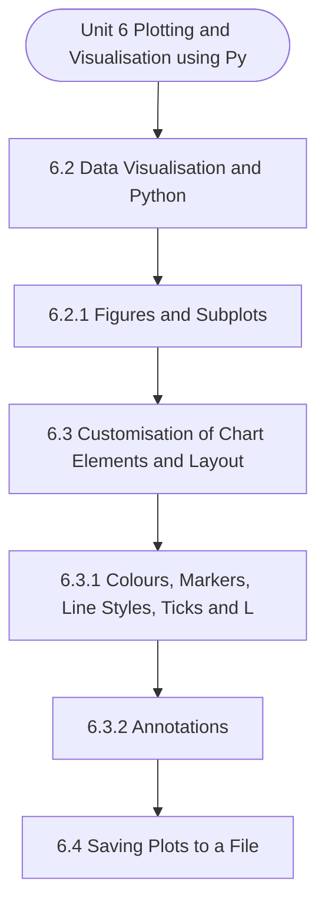

# MCS-067: Data Wrangling and Visualization
## Unit 6: Plotting and Visualisation using Python

> 📚 **Programme:** M.Sc. (Data Science and Analytics) | **Semester:** Semester 2  
> ⏱️ **Estimated Study Time:** ~41 mins | 📄 **Textbook Pages:** 25 Pages  
> 📥 **Original PDF:** [Download & View Authentic Textbook](../../../pdfs/Semester_2/MCS-067_Data_Wrangling_and_Visualization/Unit-6_Plotting_and_Visualisation_using_Python.pdf)

---

### 🎯 Executive Concept & Data Science Relevance
In modern data systems and advanced analytics, **Plotting and Visualisation using Python** forms a vital conceptual pillar. Descriptive statistics provide quantitative summaries of dataset properties. Measures of central tendency identify typical values, while measures of dispersion quantify data spread, uncertainty, and variability—critical for feature normalization and anomaly detection.

> [!NOTE]
> **Why this matters for your career:** Mastering plotting and visualisation using python equips you with the foundational principles required to reason mathematically about high-dimensional datasets, evaluate algorithm performance, and avoid statistical pitfalls in production machine learning pipelines.

### 🗺️ Visual Knowledge Architecture
The following concept map illustrates the structural hierarchy and learning trajectory of this module:



### 📖 Core Definitions & Terminology Cards

> 📌 **Arithmetic Mean $\bar{x}$ or $\mu$**  
> - **Formal Definition:** The sum of all observations divided by the total number of observations: $\bar{x} = \frac{1}{n}\sum_{i=1}^n x_i$. Sensitive to extreme outliers.  
> - 💡 **Practical Intuition & Analogy:** *The center of mass or balance point of the distribution.*

> 📌 **Median**  
> - **Formal Definition:** The physical middle value separating the higher half from the lower half of an ordered dataset. Robust against outliers.  
> - 💡 **Practical Intuition & Analogy:** *The 50th percentile value where exactly half the data lies above and half below.*

> 📌 **Standard Deviation $\sigma$ or $s$**  
> - **Formal Definition:** The square root of variance, measuring average dispersion in original units: $s = \sqrt{\frac{1}{n-1}\sum (x_i - \bar{x})^2}$.  
> - 💡 **Practical Intuition & Analogy:** *The typical distance data points deviate from the mean.*

> 📌 **Coefficient of Variation ($CV$)**  
> - **Formal Definition:** Relative dispersion measure expressed as a percentage: $CV = \frac{\sigma}{\mu} \times 100\%$. Enables comparison across different measurement scales.  
> - 💡 **Practical Intuition & Analogy:** *Comparing stock volatility across assets priced at 10 USD vs 1,000 USD.*

### ⚡ Governing Mathematical Laws & Formula Cheatsheet
#### 🔹 Sample Variance Formula (Bessel's Correction)
$$
\begin{aligned} s^2 & = \frac{1}{n - 1} \sum_{i=1}^n (x_i - \bar{x})^2 \\ & = \frac{\sum x_i^2 - \frac{(\sum x_i)^2}{n}}{n - 1} \end{aligned}
$$
- **Explanation:** Using $n-1$ in the denominator corrects for downward sample bias, yielding an unbiased estimator of population variance $\sigma^2$.

#### 🔹 Interquartile Range (IQR) & Outlier Bounds
$$
\text{IQR} = Q_3 - Q_1, \quad \text{Outliers} < Q_1 - 1.5(\text{IQR}) \;\lor\; > Q_3 + 1.5(\text{IQR})
$$
- **Explanation:** Standard Tukey boxplot rule for identifying extreme data points robustly.

#### 🔹 Pearson's First Coefficient of Skewness
$$
Sk_1 = \frac{\text{Mean} - \text{Mode}}{\sigma} \quad \text{or} \quad Sk_2 = \frac{3(\text{Mean} - \text{Median})}{\sigma}
$$
- **Explanation:** Measures asymmetry: Positive skew means mean > median (right tail); negative skew means mean < median (left tail).

### ⚖️ Axiomatic Properties & Governing Laws
The mathematical formulations of this module are anchored by foundational algebraic and structural laws:

- **Variance Scaling Rule:** $\text{Var}(aX + b) = a^2 \text{Var}(X)$
- **Standard Deviation Scaling:** $\sigma(aX + b) = \vert a\vert \sigma(X)$
- **Empirical Rule (Normal Distribution):** 68% within $\mu \pm 1\sigma$, 95% within $\mu \pm 2\sigma$, 99.7% within $\mu \pm 3\sigma$

### 📌 Comprehensive Section-by-Section Study Breakdown
#### `6.2` Data Visualisation and Python

##### 📘 Theoretical Principles & Pedagogical Exposition
In certain cases, you would like to plot several sub-plots in a diagram or Figure. This can be achieved in Python by using figure, which defines a canvas. In a single canvas, you can create several sub-plots. We demonstrate this with the help of an example. Consider you want to draw following four sub-plots in a single canvas or figure: i) A scatter plot between YearsWorking and Salary.

ii) A bar chart of Department and Total Salary iii) A pie chart on Specialisation and Total Salary and iv) A line chart on Department and Average of YearsWorking. The code for this is shown in Figure 4. Data Wrangling-II import pandas as pd # Part (0): Code to Create the data frame Employee_data empdata = {'Name': ['Arav S', 'Ravi M', 'Rehan D', 'Ben A', 'Rai Y'], 'Department': ['Design', 'Database', 'Design', 'Database', 'Design'], 'Specialisation': ['Web Development', 'SQL', 'SQL', 'Web Development', 'SQL'], 'Salary': [100000, 200000, 150000, 200000, 100000], 'YearsWorking': [3.5, 2.5, 1.5, 2.0, 1.0]} #Creating a data frame of the data of employees Employee_data = pd.DataFrame(empdata) #Part (a): Import matplotlib and create a Canvas of 2 by 2 subplots of 10 * 10 inches import matplotlib.pyplot as plt canvas, subplot = plt.subplots(2, 2, figsize=(10, 10)) # Part (b): Top-Left Corner: A Scatter plot betweenYearsWorking and Salary # Create the lists for X-axis and Y-axis from data frame yrswork_list = Employee_data['YearsWorking'].tolist() salary_list = Employee_data['Salary'].tolist() #Draw the subplot with Title and Axis Labels.

subplot [0, 0].scatter(yrswork_list, salary_list) subplot [0, 0].set_title("Scatter plot of Salary vs Years worked") subplot [0, 0].set_xlabel("Years Worked") subplot [0, 0].set_ylabel ("Salary") # Part (c): Top-right Corner: A bar chart between Department and Total Salary # Create the lists for X-axis and Y-axis by grouping over Department GroupOnDept=Employee_data.groupby('Department') TotalSalFrame=GroupOnDept['Salary'].sum() department_list = TotalSalFrame.index.tolist() sumsalary_list = TotalSalFrame.values.tolist() #Draw the subplot with Title and Axis Labels.


##### ⚙️ Mathematical & Algorithmic Mechanics
- **Core Mechanism:** Applies statistical and probabilistic modeling for plotting and visualisation using python. Formulates parameter estimation, variance reduction, and data distribution validation.
- **Boundary Conditions:** Small sample size limitations, extreme skewness, and violating underlying distribution assumptions.

##### 📊 Practical Data Science & Production Relevance
- **Production Workflow:** Production metric experimentation, automated anomaly detection, and data validation pipelines.
- **Real-World Pitfall:** Confusing correlation with causation or overlooking selection bias in data collection samples.

> [!TIP]
> **Exam & Technical Interview Insight:** State the governing formulas for data visualisation and python, compute summary statistics, and interpret numerical findings accurately.

#### `6.2.1` Figures and Subplots

##### 📘 Theoretical Principles & Pedagogical Exposition
In certain cases, you would like to plot several sub-plots in a diagram or Figure. This can be achieved in Python by using figure, which defines a canvas. In a single canvas, you can create several sub-plots. We demonstrate this with the help of an example. Consider you want to draw following four sub-plots in a single canvas or figure: i) A scatter plot between YearsWorking and Salary.

ii) A bar chart of Department and Total Salary iii) A pie chart on Specialisation and Total Salary and iv) A line chart on Department and Average of YearsWorking. The code for this is shown in Figure 4. Data Wrangling-II import pandas as pd # Part (0): Code to Create the data frame Employee_data empdata = {'Name': ['Arav S', 'Ravi M', 'Rehan D', 'Ben A', 'Rai Y'], 'Department': ['Design', 'Database', 'Design', 'Database', 'Design'], 'Specialisation': ['Web Development', 'SQL', 'SQL', 'Web Development', 'SQL'], 'Salary': [100000, 200000, 150000, 200000, 100000], 'YearsWorking': [3.5, 2.5, 1.5, 2.0, 1.0]} #Creating a data frame of the data of employees Employee_data = pd.DataFrame(empdata) #Part (a): Import matplotlib and create a Canvas of 2 by 2 subplots of 10 * 10 inches import matplotlib.pyplot as plt canvas, subplot = plt.subplots(2, 2, figsize=(10, 10)) # Part (b): Top-Left Corner: A Scatter plot betweenYearsWorking and Salary # Create the lists for X-axis and Y-axis from data frame yrswork_list = Employee_data['YearsWorking'].tolist() salary_list = Employee_data['Salary'].tolist() #Draw the subplot with Title and Axis Labels.

subplot [0, 0].scatter(yrswork_list, salary_list) subplot [0, 0].set_title("Scatter plot of Salary vs Years worked") subplot [0, 0].set_xlabel("Years Worked") subplot [0, 0].set_ylabel ("Salary") # Part (c): Top-right Corner: A bar chart between Department and Total Salary # Create the lists for X-axis and Y-axis by grouping over Department GroupOnDept=Employee_data.groupby('Department') TotalSalFrame=GroupOnDept['Salary'].sum() department_list = TotalSalFrame.index.tolist() sumsalary_list = TotalSalFrame.values.tolist() #Draw the subplot with Title and Axis Labels.


##### ⚙️ Mathematical & Algorithmic Mechanics
- **Core Mechanism:** Applies statistical and probabilistic modeling for plotting and visualisation using python. Formulates parameter estimation, variance reduction, and data distribution validation.
- **Boundary Conditions:** Small sample size limitations, extreme skewness, and violating underlying distribution assumptions.

##### 📊 Practical Data Science & Production Relevance
- **Production Workflow:** Production metric experimentation, automated anomaly detection, and data validation pipelines.
- **Real-World Pitfall:** Confusing correlation with causation or overlooking selection bias in data collection samples.

> [!TIP]
> **Exam & Technical Interview Insight:** State the governing formulas for figures and subplots, compute summary statistics, and interpret numerical findings accurately.

#### `6.3` Customisation of Chart Elements and Layout

##### 📘 Theoretical Principles & Pedagogical Exposition
CUSTOMISATION OF CHART ELEMENTS AND LAYOUT Data visualisation is an art of representing data in a form that can help interpret the basic characteristics of data. Therefore, a graph should have proper layout, labels, colour, etc. so that it can be interpreted effectively. This section explains how the matplotlib library can be used to add different features to a graph.


##### ⚙️ Mathematical & Algorithmic Mechanics
- **Core Mechanism:** Applies statistical and probabilistic modeling for plotting and visualisation using python. Formulates parameter estimation, variance reduction, and data distribution validation.
- **Boundary Conditions:** Small sample size limitations, extreme skewness, and violating underlying distribution assumptions.

##### 📊 Practical Data Science & Production Relevance
- **Production Workflow:** Production metric experimentation, automated anomaly detection, and data validation pipelines.
- **Real-World Pitfall:** Confusing correlation with causation or overlooking selection bias in data collection samples.

> [!TIP]
> **Exam & Technical Interview Insight:** State the governing formulas for customisation of chart elements and layout, compute summary statistics, and interpret numerical findings accurately.

#### `6.3.1` Colours, Markers, Line Styles, Ticks and Legends

##### 📘 Theoretical Principles & Pedagogical Exposition
Colours are useful in highlighting information in a graph where you want to draw the attention of a person. Markers, on the other hand, point to an exact location in a graph. And line styles can be used to distinguish the importance of different types of lines in a graph. Ticks are useful guides if your scale of display is very large.

Legends are useful in communicating the meaning of different symbols or lines used in a chart. Figure 6 illustrates the use of these with the help of a program. Figure 7 shows the output of Figure 6. import pandas as pd # Part (0): Code to Create a modified data frame Employee_data with only two columns empdata = {'Department': ['Web Design', 'Database', 'Design', 'Database', 'Design','Web Design', 'Design', 'Database', 'Web Design', 'Database'],'Salary': [100000, 190000, 150000, 200000, 110000,120000, 160000, 130000, 170000, 140000]} #Creating a data frame of the data of employees Employee_data = pd.DataFrame(empdata) #Part (a): Import matplotlib and create a Canvas of just one subplot of 10 inches by 6 inches import matplotlib.pyplot as plt canvas, subplot = plt.subplots(figsize=(10, 6)) # Part (b): Computing and displaying mean, minimum and maximum salary.

GroupOnDept=(Employee_data.groupby('Department')['Salary'].agg( meansal='mean', maxsal='max', minsal='min')) print(GroupOnDept) # Creating the list for displaying department, mean, minimum,and maximum salaries. department_list = GroupOnDept.index.tolist() #use of index for department meansalary_list = GroupOnDept['meansal'].tolist() #create the aggregate lists maxsalary_list = GroupOnDept['maxsal'].tolist() minsalary_list = GroupOnDept['minsal'].tolist() Data Wrangling-II #Part (c.1): Plot the first line withcolour, line style, and markers and Label for legend.


##### ⚙️ Mathematical & Algorithmic Mechanics
- **Core Mechanism:** Applies statistical and probabilistic modeling for plotting and visualisation using python. Formulates parameter estimation, variance reduction, and data distribution validation.
- **Boundary Conditions:** Small sample size limitations, extreme skewness, and violating underlying distribution assumptions.

##### 📊 Practical Data Science & Production Relevance
- **Production Workflow:** Production metric experimentation, automated anomaly detection, and data validation pipelines.
- **Real-World Pitfall:** Confusing correlation with causation or overlooking selection bias in data collection samples.

> [!TIP]
> **Exam & Technical Interview Insight:** State the governing formulas for colours, markers, line styles, ticks and legends, compute summary statistics, and interpret numerical findings accurately.

#### `6.3.2` Annotations

##### 📘 Theoretical Principles & Pedagogical Exposition
Annotations can be used to highlight some of the key points of a graph. The main purpose is to draw attention to certain important aspects of the graphs. Annotations help in increasing the clarity of information being represented by graphs. How do you annotate a graph? There are several ways of annotating a graph, such as you can add an arrow or a label, etc.

An annotation can be added to a graph using the following function: annotate(“textTOdisplay”, xy, xytext, arrowprops) There are four basic parameters of an annotation. These are: • “textTOdisplay” parameter contains the text that is to be displayed as annotation; • xy defines the data point for which the annotation is to be displayed; • xytext defines the position at which annotation text is to be displayed, and Data Wrangling-II • arrowprops can be used to change the characteristics of the arrow if it is to be shown in an annotation.

The following program creates two subplots in a canvas. The first subplot is a bar chart of employee salary, as given in Figure 1,with a proper title and axis labels. This subplot also annotates the maximum salary. Please note that two person draw maximum salary, so our program should annotate both the instances.


##### ⚙️ Mathematical & Algorithmic Mechanics
- **Core Mechanism:** Applies statistical and probabilistic modeling for plotting and visualisation using python. Formulates parameter estimation, variance reduction, and data distribution validation.
- **Boundary Conditions:** Small sample size limitations, extreme skewness, and violating underlying distribution assumptions.

##### 📊 Practical Data Science & Production Relevance
- **Production Workflow:** Production metric experimentation, automated anomaly detection, and data validation pipelines.
- **Real-World Pitfall:** Confusing correlation with causation or overlooking selection bias in data collection samples.

> [!TIP]
> **Exam & Technical Interview Insight:** State the governing formulas for annotations, compute summary statistics, and interpret numerical findings accurately.

#### `6.4` Saving Plots to a File

##### 📘 Theoretical Principles & Pedagogical Exposition
Graphs are visual data. They are drawn to represent certain characteristics of data so that users and decision makers can interpret them easily. Therefore, plots are to be shared with decision makers and other stakeholders. This requires graphs to be saved in a format such that they can be included in different reports.

Python allows plots to be saved in different standard image formats, like Portable Network Graphics (.png), Portable Document Format (.pdf), Joint Photographic Experts Group (.jpg) and Scalable Vector Graphics (.svg). It may be noted that png files are made up of pixels (called raster Plotting and Visualisation Using Python images), pdf is a format of documents in which both text and graphics are included, svg files are files which store vector graphics and jpeg is a standard that uses lossy compression.

import pandas as pd # Part (a): Code to Create the data frame Employee_data empdata = {'Name': ['Arav S', 'Ravi M', 'Rehan D', 'Ben A', 'Rai Y'], 'Department': ['Design', 'Database', 'Design', 'Database', 'Design'], 'Specialisation': ['Web Development', 'SQL', 'SQL', 'Web Development', 'SQL'], 'Salary': [100000, 200000, 150000, 200000, 100000], 'YearsWorking': [3.5, 2.5, 1.5, 2.0, 1.0]} #Creating a data frame of the data of employees Employee_data = pd.DataFrame(empdata) #Part (b): Create two canvases – one each for each plotof 8 inches width by 4 inches length import matplotlib.pyplot as plt canvas1, plot1 = plt.subplots(figsize=(8, 4)) canvas2, plot2 = plt.subplots(figsize=(8, 4)) #Part (c): Prepare the data to create the bar plot in plot1 with Title and axis Labels name_list = Employee_data['Name'].tolist() salary_list = Employee_data['Salary'].tolist() plot1.bar(name_list, salary_list) plot1.set_title("Name vs Salary", fontsize=12) plot1.set_xlabel("Name", fontsize=10) plot1.set_ylabel("Salary", fontsize=10) # Part (d): plot2 is a line chart between Department and Total Salary GroupOnDept=Employee_data.groupby('Department') TotalSalFrame=GroupOnDept['Salary'].sum() department_list = TotalSalFrame.index.tolist() sumsalary_list = TotalSalFrame.values.tolist() #Draw the plot2 with Title and Axis Labels plot2.plot(department_list, sumsalary_list, marker='o') plot2.set_title("Department vs Total Salary") plot2.set_xlabel("Department") plot2.set_ylabel ("Total Salary in INR") plot2.set_facecolor('lightyellow') #Part (e): Saving plot1 #Saving plot1 in jpg file at 200 dpi canvas1.savefig("NameandSal.jpg", dpi=200) #Saving plot1 in pdf file canvas1.savefig("NameandSal.pdf") #Saving plot1 in svgfile canvas1.savefig("NameandSal.svg") #Part (f): Saving plot2 #Saving the plot2 as a png file with DPI of 200 canvas2.savefig("DeptandSal.png", dpi=200) #Saving plot2 as a png file with Transparent Background canvas2.savefig("NobackDeptandSal.png", transparent=True) Figure 10: Program to Save Figures in different File formats Data Wrangling-II Figure 10 shows a program to save plots in different file formats.


##### ⚙️ Mathematical & Algorithmic Mechanics
- **Core Mechanism:** Applies statistical and probabilistic modeling for plotting and visualisation using python. Formulates parameter estimation, variance reduction, and data distribution validation.
- **Boundary Conditions:** Small sample size limitations, extreme skewness, and violating underlying distribution assumptions.

##### 📊 Practical Data Science & Production Relevance
- **Production Workflow:** Production metric experimentation, automated anomaly detection, and data validation pipelines.
- **Real-World Pitfall:** Confusing correlation with causation or overlooking selection bias in data collection samples.

> [!TIP]
> **Exam & Technical Interview Insight:** State the governing formulas for saving plots to a file, compute summary statistics, and interpret numerical findings accurately.

#### `6.5` Use of Configuration in Matplotlib

##### 📘 Theoretical Principles & Pedagogical Exposition
Configurations are an important part of matplotlib library that allows you to set a consistent look and feel for your visualisations. Matplotlib library also supports standard configurations. The matplotlib library uses a dictionary, named rcParams, to store the default configurations related to plots.

You can set different parameters in this file using this dictionary. For example, the following code will set the font size of the axis labels in a figure to 14 points. plt.rcParams['axes.labelsize'] = 14 Alternatively, you can use a function plt.rc() to change parameters. For example, to change the line width to size 2 and to change the marker to a square marker, you may use the configuration function call as: plt.rc('lines', linewidth=2, marker='s') Data Wrangling-II You may change the axes labels to 14 point size and title size to 16 points and to set the background colour of graph to light blue, you may use the following function call: plt.rc('axes', labelsize=14, titlesize=16, facecolor='lightblue') Matplotlib also has a list of predefined styles, which can be used for specific style configuration.

For example, one of the popular style is ggplot. It can be used by using the following command: plt.style.use('ggplot') You can set a custom style layout of your plots using the configuration. A detailed discussion on this topic is beyond the scope of this unit. You may refer to any Python documentation for more details.


##### ⚙️ Mathematical & Algorithmic Mechanics
- **Core Mechanism:** Applies statistical and probabilistic modeling for plotting and visualisation using python. Formulates parameter estimation, variance reduction, and data distribution validation.
- **Boundary Conditions:** Small sample size limitations, extreme skewness, and violating underlying distribution assumptions.

##### 📊 Practical Data Science & Production Relevance
- **Production Workflow:** Production metric experimentation, automated anomaly detection, and data validation pipelines.
- **Real-World Pitfall:** Confusing correlation with causation or overlooking selection bias in data collection samples.

> [!TIP]
> **Exam & Technical Interview Insight:** State the governing formulas for use of configuration in matplotlib, compute summary statistics, and interpret numerical findings accurately.

#### `6.6` Plotting with pandas and seaborn

##### 📘 Theoretical Principles & Pedagogical Exposition
In addition to matplotlib library, you can plot with pandas and seaborn libraries. The following are some of the functions that you can use to make plots. The pandas library has a plot() function that can be used to plot a graph and seaborn library can be used for advanced statistical plots.

For example, program given in Figure 13 uses pandas plot() function to draw the first plot and then uses seaborn library bar chart function to plot department and average salary of that department. #Part (0) import different libraries import matplotlib.pyplot as plt import numpy as np import pandas as pd import seaborn as sns #Part (a): Code to Create the data frame Employee_data empdata = {'Name': ['Arav S', 'Ravi M', 'Rehan D', 'Ben A', 'Rai Y'], 'Department': ['Design', 'Database', 'Design', 'Database', 'Design'], 'Specialisation': ['Web Development', 'SQL', 'SQL', 'Web Development', 'SQL'], 'Salary': [100000, 200000, 150000, 200000, 100000], 'YearsWorking': [3.5, 2.5, 1.5, 2.0, 1.0]} #Creating a data frame of the data of employees Employee_data = pd.DataFrame(empdata) #Part (b): Create two canvases – one each for each plot of 8 inches width by 4 inches length canvas1, plot1 = plt.subplots(figsize=(8, 4)) canvas2, plot2 = plt.subplots(figsize=(8, 4)) #Part (c): Make the line plot in plot1 using pandas’ plot() Employee_data.plot(kind='line', x='Name', y='Salary', marker='o', ax=plot1, legend=False) #Add the Title, axis labels, and change the face colour plot1.set_title("Name vs Salary") plot1.set_xlabel("Name") plot1.set_ylabel("Salary in INR") plot1.set_facecolor('lightyellow') Plotting and Visualisation Using Python #Part (d): plot2 is a bar chart on categorical data - Department, against the average salary of each department.

Created using the seaborn library sns.barplot(data=Employee_data, x="Department", y="Salary", ax=plot2, errorbar=None) plt.title("Average Salary of Each Department using Seaborn") #Display the two plots plt.show() Figure 13:Plotting pandas function plot() and seaborn Library The Part(0) in Figure 13 imports different libraries including matplotlib, pandas, numpy and seaborn.


##### ⚙️ Mathematical & Algorithmic Mechanics
- **Core Mechanism:** Applies statistical and probabilistic modeling for plotting and visualisation using python. Formulates parameter estimation, variance reduction, and data distribution validation.
- **Boundary Conditions:** Small sample size limitations, extreme skewness, and violating underlying distribution assumptions.

##### 📊 Practical Data Science & Production Relevance
- **Production Workflow:** Production metric experimentation, automated anomaly detection, and data validation pipelines.
- **Real-World Pitfall:** Confusing correlation with causation or overlooking selection bias in data collection samples.

> [!TIP]
> **Exam & Technical Interview Insight:** State the governing formulas for plotting with pandas and seaborn, compute summary statistics, and interpret numerical findings accurately.

### 📐 Step-by-Step Solved Mathematical Examples
To solidify your theoretical understanding, work through these fully solved, step-by-step mathematical problems:

#### 🧮 Example 1: Sample Variance and Standard Deviation Computation
> **Problem Statement:**  
> Given sample observations: $X = \lbrace 4, 8, 6, 5, 7 \rbrace$. Compute sample mean $\bar{x}$, sample variance $s^2$, and standard deviation $s$ step-by-step.

**Detailed Step-by-Step Solution:**

1. **Mean:** $\bar{x} = \frac{4 + 8 + 6 + 5 + 7}{5} = \frac{30}{5} = 6$.

2. **Squared deviations:**
- $(4 - 6)^2 = (-2)^2 = 4$
- $(8 - 6)^2 = 2^2 = 4$
- $(6 - 6)^2 = 0^2 = 0$
- $(5 - 6)^2 = (-1)^2 = 1$
- $(7 - 6)^2 = 1^2 = 1$
Sum of squared deviations $= 4 + 4 + 0 + 1 + 1 = 10$.

3. **Sample Variance with Bessel's Correction ($n-1 = 4$):**

$$
s^2 = \frac{10}{5 - 1} = \frac{10}{4} = 2.5
$$


4. **Standard Deviation:** $s = \sqrt{2.5} \approx 1.581$.

#### 🧮 Example 2: Tukey's IQR Outlier Detection Rule
> **Problem Statement:**  
> A customer spend dataset has $Q_1 = 30$ and $Q_3 = 70$. Determine whether transactions of $135$ and $25$ are classified as outliers.

**Detailed Step-by-Step Solution:**

1. **IQR:** $\text{IQR} = Q_3 - Q_1 = 70 - 30 = 40$.
2. **Lower Bound:** $Q_1 - 1.5(\text{IQR}) = 30 - 1.5(40) = 30 - 60 = -30$.
3. **Upper Bound:** $Q_3 + 1.5(\text{IQR}) = 70 + 1.5(40) = 70 + 60 = 130$.

Conclusion:
- Spend of 135 exceeds Upper Bound ($135 > 130$): **Classified as Outlier**.
- Spend of 25 is within $[-30, 130]$: **Normal observation**.

### 💻 Practical Data Science Implementation (Python)
Theory translates directly into production algorithms. Below is a self-contained, commented Python implementation illustrating the core operations of this unit:

```python
import numpy as np
import pandas as pd

# Statistical profiling on production dataset
data = np.array([12, 15, 18, 22, 25, 29, 34, 45, 95])

mean_val = np.mean(data)
median_val = np.median(data)
std_val = np.std(data, ddof=1) # Bessel's correction

q1, q3 = np.percentile(data, [25, 75])
iqr = q3 - q1
outlier_upper = q3 + 1.5 * iqr

outliers = data[data > outlier_upper]

print(f"Mean: {mean_val:.2f} | Median: {median_val:.2f} | Std: {std_val:.2f}")
print(f"IQR: {iqr:.2f} | Upper Bound: {outlier_upper:.2f}")
print(f"Detected Outliers: {outliers}")
```

### 💡 Interactive Self-Assessment Checkpoints
Test your comprehension before proceeding. Tap each question to reveal the comprehensive explanation:

<details>
<summary><b>Checkpoint 1:</b> List the set of commands which are essential to make a bar chart. 146 Plotting and Visualisation Using Python <i>(Tap to reveal answer)</i></summary>

> **Answer & Analysis:**  
> **Detailed Analytical Solution:**
> 
> 1. **Core Principle:** Identify the governing theorem or definition for Plotting and Visualisation using Python.
> 2. **Step-by-Step Derivation:** Verify all preconditions and compute intermediate steps methodically.
> 3. **Conclusion:** State the final mathematical proof or calculation clearly, validating boundary edge cases.
</details>

<details>
<summary><b>Checkpoint 2:</b> How can you show more than one subplot in a single figure or plot? <i>(Tap to reveal answer)</i></summary>

> **Answer & Analysis:**  
> **Detailed Analytical Solution:**
> 
> 1. **Core Principle:** Identify the governing theorem or definition for Plotting and Visualisation using Python.
> 2. **Step-by-Step Derivation:** Verify all preconditions and compute intermediate steps methodically.
> 3. **Conclusion:** State the final mathematical proof or calculation clearly, validating boundary edge cases.
</details>

<details>
<summary><b>Checkpoint 3:</b> How can you make a plot with a title and axis labels? <i>(Tap to reveal answer)</i></summary>

> **Answer & Analysis:**  
> **Detailed Analytical Solution:**
> 
> 1. **Core Principle:** Identify the governing theorem or definition for Plotting and Visualisation using Python.
> 2. **Step-by-Step Derivation:** Verify all preconditions and compute intermediate steps methodically.
> 3. **Conclusion:** State the final mathematical proof or calculation clearly, validating boundary edge cases.
</details>

<details>
<summary><b>Checkpoint 4:</b> How can you change line colour, line marker, ticks and legends in a plot? <i>(Tap to reveal answer)</i></summary>

> **Answer & Analysis:**  
> **Detailed Analytical Solution:**
> 
> 1. **Core Principle:** Identify the governing theorem or definition for Plotting and Visualisation using Python.
> 2. **Step-by-Step Derivation:** Verify all preconditions and compute intermediate steps methodically.
> 3. **Conclusion:** State the final mathematical proof or calculation clearly, validating boundary edge cases.
</details>

<details>
<summary><b>Checkpoint 5:</b> Why is sample variance divided by $n-1$ instead of $n$? <i>(Tap to reveal answer)</i></summary>

> **Answer & Analysis:**  
> Dividing by $n-1$ applies **Bessel's correction**, which removes downward bias caused by using the sample mean $\bar{x}$ instead of the true population mean $\mu$.
</details>

<details>
<summary><b>Checkpoint 6:</b> Which measure of central tendency is most robust to extreme outliers? <i>(Tap to reveal answer)</i></summary>

> **Answer & Analysis:**  
> The **Median**, because it depends on positional rank rather than magnitude summation.
</details>

### 🎯 Executive Module Wrap-Up
- **Central Idea:** Plotting and Visualisation using Python provides essential mathematical and algorithmic tools directly utilized in Data Science.
- **Mathematical Rigor:** Formulas and laws must be memorized with attention to boundary conditions and assumptions.
- **Full Textbook Coverage:** For exhaustive multi-page derivations, proofs, and supplementary exercises, consult the [Authentic IGNOU Textbook](../../../pdfs/Semester_2/MCS-067_Data_Wrangling_and_Visualization/Unit-6_Plotting_and_Visualisation_using_Python.pdf).

---
### 🧭 Navigation & Syllabus Index
[⬅ Previous: Unit 5](unit_05_Data_Aggregation_and_Group_Operations.md) | [📑 Course Index](README.md)
