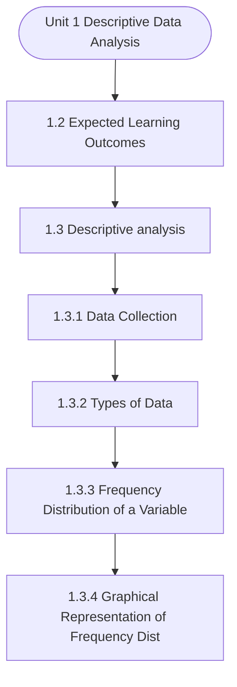

# MCS-068: Predictive Data Analysis
## Unit 1: Descriptive Data Analysis

> 📚 **Programme:** M.Sc. (Data Science and Analytics) | **Semester:** Semester 2  
> ⏱️ **Estimated Study Time:** ~72 mins | 📄 **Textbook Pages:** 42 Pages  
> 📥 **Original PDF:** [Download & View Authentic Textbook](../../../pdfs/Semester_2/MCS-068_Predictive_Data_Analysis/Unit-1_Descriptive_Data_Analysis.pdf)

---

### 🎯 Executive Concept & Data Science Relevance
In modern data systems and advanced analytics, **Descriptive Data Analysis** forms a vital conceptual pillar. Regression analysis estimates relationships between dependent targets and independent explanatory variables. Linear models, regularization penalties, and gradient updates form the computational core of supervised machine learning.

> [!NOTE]
> **Why this matters for your career:** Mastering descriptive data analysis equips you with the foundational principles required to reason mathematically about high-dimensional datasets, evaluate algorithm performance, and avoid statistical pitfalls in production machine learning pipelines.

### 🗺️ Visual Knowledge Architecture
The following concept map illustrates the structural hierarchy and learning trajectory of this module:



### 📖 Core Definitions & Terminology Cards

> 📌 **Ordinary Least Squares (OLS)**  
> - **Formal Definition:** Estimation method that minimizes the sum of squared differences (residuals) between observed values and predictions: $\min_\beta \sum (y_i - \hat{y}_i)^2$.  
> - 💡 **Practical Intuition & Analogy:** *Finding the single line that minimizes total vertical squared distance to all data points.*

> 📌 **Coefficient of Determination ($R^2$)**  
> - **Formal Definition:** The proportion of variance in the dependent variable explained by independent features: $R^2 = 1 - \frac{SS_{\text{res}}}{SS_{\text{tot}}}$. Ranges from 0 to 1.  
> - 💡 **Practical Intuition & Analogy:** *An $R^2 = 0.85$ means 85% of target variability is captured by your model.*

> 📌 **Ridge Regularization ($L_2$)**  
> - **Formal Definition:** Adds squared magnitude penalty to the loss function: $\mathcal{L} + \lambda \sum_{j=1}^p \beta_j^2$. Shrinks weights toward zero to prevent overfitting under multicollinearity.  
> - 💡 **Practical Intuition & Analogy:** *Discourages extreme weight spikes without setting any coefficient entirely to zero.*

> 📌 **Lasso Regularization ($L_1$)**  
> - **Formal Definition:** Adds absolute magnitude penalty to the loss function: $\mathcal{L} + \lambda \sum_{j=1}^p \vert\beta_j\vert$. Drives non-essential coefficients exactly to zero, performing automated feature selection.  
> - 💡 **Practical Intuition & Analogy:** *Selects a sparse subset of impactful features by zeroing out noise variables.*

### ⚡ Governing Mathematical Laws & Formula Cheatsheet
#### 🔹 Simple Linear Regression OLS Parameters
$$
\begin{aligned} \hat{\beta}_1 & = \frac{\sum (x_i - \bar{x})(y_i - \bar{y})}{\sum (x_i - \bar{x})^2} = \frac{\text{Cov}(x, y)}{\text{Var}(x)} \\ \hat{\beta}_0 & = \bar{y} - \hat{\beta}_1 \bar{x} \end{aligned}
$$
- **Explanation:** Closed-form slope and intercept formulas for single-feature linear regression.

#### 🔹 Multiple Linear Regression Normal Equation
$$
\hat{\mathbf{\beta}} = (\mathbf{X}^T \mathbf{X})^{-1} \mathbf{X}^T \mathbf{y}
$$
- **Explanation:** Direct analytic matrix solution for OLS regression weights.

#### 🔹 Ridge Regression Closed-Form Estimator
$$
\hat{\mathbf{\beta}}_{\text{Ridge}} = (\mathbf{X}^T \mathbf{X} + \lambda \mathbf{I})^{-1} \mathbf{X}^T \mathbf{y}
$$
- **Explanation:** Adding $\lambda \mathbf{I}$ ensures invertibility even when $\mathbf{X}^T \mathbf{X}$ is ill-conditioned or collinear.

#### 🔹 Logistic Regression Sigmoid Function
$$
P(Y = 1 \mid X = \mathbf{x}) = \sigma(\mathbf{w}^T \mathbf{x} + b) = \frac{1}{1 + e^{-(\mathbf{w}^T \mathbf{x} + b)}}
$$
- **Explanation:** Maps any real-valued linear score into a calibrated probability interval $[0, 1]$.

### ⚖️ Axiomatic Properties & Governing Laws
The mathematical formulations of this module are anchored by foundational algebraic and structural laws:

- **Gauss-Markov Theorem:** Under standard OLS assumptions, the OLS estimator is BLUE (Best Linear Unbiased Estimator).
- **Orthogonality of Residuals:** $\mathbf{X}^T \mathbf{e} = \mathbf{0} \quad (\text{Residuals are orthogonal to feature space})$
- **Variance Inflation Factor (VIF):** $\text{VIF}_j = \frac{1}{1 - R_j^2} \quad (\text{VIF} > 5 \implies \text{Severe Multicollinearity})$

### 📌 Comprehensive Section-by-Section Study Breakdown
#### `1.2` Expected Learning Outcomes

##### 📘 Theoretical Principles & Pedagogical Exposition
In probability theory and statistical inference, **Expected Learning Outcomes** formalizes the stochastic behavior of random phenomena. Within **Descriptive Data Analysis**, this framework allows data scientists to infer population parameters from finite empirical samples while quantifying uncertainty via confidence intervals and hypothesis tests.

The mathematical rigor here prevents statistical misinterpretations, such as confusing correlation with causation, overlooking sample selection bias, or violating distributional assumptions.

##### ⚙️ Mathematical & Algorithmic Mechanics
- **Core Mechanism:** Establishes analytical principles and computational workflows for descriptive data analysis.
- **Boundary Conditions:** Missing data values, extreme outliers, and non-standard data types.

##### 📊 Practical Data Science & Production Relevance
- **Production Workflow:** End-to-end data science processing stacks (Pandas, Scikit-learn, PyTorch).
- **Real-World Pitfall:** Failing to validate inputs before feeding data into production analytics pipelines.

> [!TIP]
> **Exam & Technical Interview Insight:** Define key concepts in expected learning outcomes and articulate practical applications in real-world scenarios.

#### `1.3` Descriptive analysis

##### 📘 Theoretical Principles & Pedagogical Exposition
DATA COLLECTION Data collection is the first and one of the most important steps in any data analysis. It means carefully gathering the information you need to study a topic or answer a question. Whether you're doing research, running a project, or making business choices, the data you collect is the foundation for your work.

If the data is not collected properly, your results might be wrong and lead to bad decisions. But if the data is collected correctly, it helps you understand the situation better and make smarter, more accurate decisions. One needs to understand that this step is quite crucial, as it is just the beginning of any study/analysis, if error persists in the beginning itself i.e.

at the stage of data collection itself, then it may amplify the errors and inaccuracy of results at later stages. When working with data for analysis, it’s important to know where your data is coming from, is it coming from the primary source or the secondary source? Depending on the source of data collection the data is broadly classified into two categories i.e.


##### ⚙️ Mathematical & Algorithmic Mechanics
- **Core Mechanism:** Establishes analytical principles and computational workflows for descriptive data analysis.
- **Boundary Conditions:** Missing data values, extreme outliers, and non-standard data types.

##### 📊 Practical Data Science & Production Relevance
- **Production Workflow:** End-to-end data science processing stacks (Pandas, Scikit-learn, PyTorch).
- **Real-World Pitfall:** Failing to validate inputs before feeding data into production analytics pipelines.

> [!TIP]
> **Exam & Technical Interview Insight:** Define key concepts in descriptive analysis and articulate practical applications in real-world scenarios.

#### `1.3.1` Data Collection

##### 📘 Theoretical Principles & Pedagogical Exposition
DATA COLLECTION Data collection is the first and one of the most important steps in any data analysis. It means carefully gathering the information you need to study a topic or answer a question. Whether you're doing research, running a project, or making business choices, the data you collect is the foundation for your work.

If the data is not collected properly, your results might be wrong and lead to bad decisions. But if the data is collected correctly, it helps you understand the situation better and make smarter, more accurate decisions. One needs to understand that this step is quite crucial, as it is just the beginning of any study/analysis, if error persists in the beginning itself i.e.

at the stage of data collection itself, then it may amplify the errors and inaccuracy of results at later stages. When working with data for analysis, it’s important to know where your data is coming from, is it coming from the primary source or the secondary source? Depending on the source of data collection the data is broadly classified into two categories i.e.


##### ⚙️ Mathematical & Algorithmic Mechanics
- **Core Mechanism:** Establishes analytical principles and computational workflows for descriptive data analysis.
- **Boundary Conditions:** Missing data values, extreme outliers, and non-standard data types.

##### 📊 Practical Data Science & Production Relevance
- **Production Workflow:** End-to-end data science processing stacks (Pandas, Scikit-learn, PyTorch).
- **Real-World Pitfall:** Failing to validate inputs before feeding data into production analytics pipelines.

> [!TIP]
> **Exam & Technical Interview Insight:** Define key concepts in data collection and articulate practical applications in real-world scenarios.

#### `1.3.2` Types of Data

##### 📘 Theoretical Principles & Pedagogical Exposition
TYPES OF DATA Before you begin any kind of data analysis, it’s important to understand the type of data you’re working with. This is because different types of data require different methods of analysis, visual representation, and interpretation. We learned from the above section 1.4 that depending on the source of data collection the data is broadly classified in to two categories i.e.

Primary data and Secondary Data, and we learned about them. Now we are in position to take a deeper dive and understand the various types of the data which contributes towards the data analysis. Although a brief introduction for the types of data was made in the introduction section 1.1, now we will elaborate and discuss these data types here.

Broadly, data can be classified into two main categories: qualitative (or categorical) data and quantitative (or numerical) data. Each of these has subtypes, and some data types have more structure than others. Qualitative Data (Categorical Data): It describes qualities or characteristics.


##### ⚙️ Mathematical & Algorithmic Mechanics
- **Core Mechanism:** Establishes analytical principles and computational workflows for descriptive data analysis.
- **Boundary Conditions:** Missing data values, extreme outliers, and non-standard data types.

##### 📊 Practical Data Science & Production Relevance
- **Production Workflow:** End-to-end data science processing stacks (Pandas, Scikit-learn, PyTorch).
- **Real-World Pitfall:** Failing to validate inputs before feeding data into production analytics pipelines.

> [!TIP]
> **Exam & Technical Interview Insight:** Define key concepts in types of data and articulate practical applications in real-world scenarios.

#### `1.3.3` Frequency Distribution of a Variable

##### 📘 Theoretical Principles & Pedagogical Exposition
A frequency distribution is a powerful tool that transforms raw data into an organized format, making it easier to analyse. Whether you use a simple table for small datasets or a grouped one for larger values, frequency distributions help identify patterns, trends, and key summary statistics like the most frequent (modal) class, range, and central values.

In short, frequency distribution is your first step toward understanding and visualizing data effectively. When you collect a set of raw data, it can be messy and hard to understand at first glance— especially if the number of observations is large. To make sense of such data, one of the first steps in descriptive data analysis is to organize it into a frequency distribution.

A frequency distribution is a way to arrange data values to show how often each value or range of values (called a class) occurs. This helps reveal patterns, trends, and how the values are spread across the dataset. Imagine you conducted a survey among 30 students to find out how many hours they studied in a week.


##### ⚙️ Mathematical & Algorithmic Mechanics
- **Core Mechanism:** Probability distributions characterize probability mass (PMF) or density (PDF). The Central Limit Theorem (CLT) establishes that the sample mean of $n$ independent, identically distributed random variables converges to Gaussian $\mathcal{N}(\mu, \sigma^2/n)$ as $n \to \infty$.
- **Boundary Conditions:** Cauchy distributions violating CLT due to undefined variance, extreme skewness in small samples ($n < 30$), and fat-tailed catastrophic risk events.

##### 📊 Practical Data Science & Production Relevance
- **Production Workflow:** Standardizing features via Z-score normalization, anomaly detection using Gaussian Mixture Models, calculating $p$-values in hypothesis testing, and Monte Carlo simulation.
- **Real-World Pitfall:** Assuming Gaussian normality for heavy-tailed operational metrics (e.g. web server latency or stock returns), severely underestimating extreme tail probabilities.

> [!TIP]
> **Exam & Technical Interview Insight:** Compute probabilities by standardizing to the standard normal distribution $Z = \frac{X - \mu}{\sigma}$; recognize when to approximate Binomial with Poisson or Normal.

#### `1.3.4` Graphical Representation of Frequency Distribution

##### 📘 Theoretical Principles & Pedagogical Exposition
GRAPHICAL REPRESENTATION OF FREQUENCY DISTRIBUTION Graphical representation of frequency distribution is a method used to visually summarize and interpret data. Instead of examining rows and columns of numbers in a table, graphs provide a clear picture of how data is spread across different values or intervals.

This makes it easier to identify trends, patterns, outliers, and the overall shape of the distribution. Several types of graphs are commonly used depending on the nature of the data and the purpose of the analysis. One of the most frequently used graphs for continuous numerical data is the histogram.

A histogram consists of adjacent (touching) bars where the horizontal axis (X-axis) represents the class intervals, and the vertical axis (Y-axis) shows the frequencies—the number of data values that fall within each interval. Each bar’s height corresponds to the frequency for that class.


##### ⚙️ Mathematical & Algorithmic Mechanics
- **Core Mechanism:** Graph $G = (V, E)$ represented via Adjacency Matrix $\mathcal{O}(V^2)$ or Adjacency List $\mathcal{O}(V + E)$. BFS discovers shortest paths on unweighted graphs; Dijkstra greedily extracts minimum-distance vertices using priority queues; DFS detects cycles and topological orderings.
- **Boundary Conditions:** Disconnected subgraphs, negative weight cycles (violating Dijkstra preconditions), self-loops, and dense graph edge explosions $|E| \approx |V|^2$.

##### 📊 Practical Data Science & Production Relevance
- **Production Workflow:** Social network connection graphs, Graph Neural Networks (GNNs), dependency DAG resolution in build compilers, and routing optimization in supply chain logistics.
- **Real-World Pitfall:** Invoking Dijkstra's algorithm on graphs with negative edge weights instead of Bellman-Ford, resulting in erroneous distance derivations.

> [!TIP]
> **Exam & Technical Interview Insight:** Trace Dijkstra's algorithm or Kruskal's/Prim's MST algorithm table step-by-step; show vertex distance updates and predecessor pointers at each iteration.

#### `1.3.5` Measures of Central Tendency

##### 📘 Theoretical Principles & Pedagogical Exposition
MEASUREMENT OF CENTRAL TENDENCY Measures of central tendency help us summarize a large amount of data using a single representative value. This makes it easier to understand and analyse the overall trend in the data. For instance, it’s not practical to remember the individual incomes of millions of people in India.

However, knowing the average income gives us a general idea of the income level of the population as a whole. These measures also make it easier to compare different data sets. For example, the average sales in April can be compared with those of previous months to understand whether performance has improved or declined.

A good measure of central tendency is one that effectively represents a dataset with a single, meaningful value. To be truly useful, such a measure should have certain key characteristics. First, it should be easy to understand, so that people without technical backgrounds can interpret it.


##### ⚙️ Mathematical & Algorithmic Mechanics
- **Core Mechanism:** Establishes analytical principles and computational workflows for descriptive data analysis.
- **Boundary Conditions:** Missing data values, extreme outliers, and non-standard data types.

##### 📊 Practical Data Science & Production Relevance
- **Production Workflow:** End-to-end data science processing stacks (Pandas, Scikit-learn, PyTorch).
- **Real-World Pitfall:** Failing to validate inputs before feeding data into production analytics pipelines.

> [!TIP]
> **Exam & Technical Interview Insight:** Define key concepts in measures of central tendency and articulate practical applications in real-world scenarios.

#### `1.3.6` Measures of Dispersion

##### 📘 Theoretical Principles & Pedagogical Exposition
MEASUREMENT OF DISPERSION In above section 1.3.5 we learned about the measure of central tendency of data, now we extend our discussion towards the understanding of the dispersion of data and how it is measured. It is to be noted that the degree to which numerical data tend to spread about an average value is called the variation or dispersion of data.

Actually, there are two basic kinds of a measure of dispersion (i) Absolute measures and (ii) Relative measures. The absolute measures of dispersion are used to measure the variability of a given data expressed in the same unit, while the relative measures are used to compare the variability of two or more sets of observations.

Following are the different measures of dispersion: 1. Quartile Deviation 3. Standard Deviation and Variance Before extending our discussion for the different measures of dispersion, firstly we need to understand the significance of Measures of dispersion, actually they are needed for the following purposes: ● They show how much the data values vary or spread around the average.


##### ⚙️ Mathematical & Algorithmic Mechanics
- **Core Mechanism:** Establishes analytical principles and computational workflows for descriptive data analysis.
- **Boundary Conditions:** Missing data values, extreme outliers, and non-standard data types.

##### 📊 Practical Data Science & Production Relevance
- **Production Workflow:** End-to-end data science processing stacks (Pandas, Scikit-learn, PyTorch).
- **Real-World Pitfall:** Failing to validate inputs before feeding data into production analytics pipelines.

> [!TIP]
> **Exam & Technical Interview Insight:** Define key concepts in measures of dispersion and articulate practical applications in real-world scenarios.

### 📐 Step-by-Step Solved Mathematical Examples
To solidify your theoretical understanding, work through these fully solved, step-by-step mathematical problems:

#### 🧮 Example 1: Simple Linear Regression OLS Computation
> **Problem Statement:**  
> Given data points $(x, y)$: $(1, 2), (2, 3), (3, 5), (4, 4), (5, 6)$. Compute OLS slope $\hat{\beta}_1$, intercept $\hat{\beta}_0$, and regression line.

**Detailed Step-by-Step Solution:**

1. **Means:** $\bar{x} = 3.0, \; \bar{y} = 4.0$.
2. **Deviations & Products:**
- $(x_1 - \bar{x}) = -2, \; (y_1 - \bar{y}) = -2 \implies (-2)(-2) = 4, \; (-2)^2 = 4$
- $(x_2 - \bar{x}) = -1, \; (y_2 - \bar{y}) = -1 \implies (-1)(-1) = 1, \; (-1)^2 = 1$
- $(x_3 - \bar{x}) = 0, \; (y_3 - \bar{y}) = 1 \implies (0)(1) = 0, \; 0^2 = 0$
- $(x_4 - \bar{x}) = 1, \; (y_4 - \bar{y}) = 0 \implies (1)(0) = 0, \; 1^2 = 1$
- $(x_5 - \bar{x}) = 2, \; (y_5 - \bar{y}) = 2 \implies (2)(2) = 4, \; 2^2 = 4$

3. **Summation:** $\sum (x_i - \bar{x})(y_i - \bar{y}) = 9, \; \sum (x_i - \bar{x})^2 = 10$.

4. **Parameters:**

$$
\hat{\beta}_1 = \frac{9}{10} = 0.90
$$


$$
\hat{\beta}_0 = \bar{y} - \hat{\beta}_1 \bar{x} = 4.0 - 0.9(3.0) = 4.0 - 2.7 = 1.30
$$


Regression Equation: $\hat{y} = 1.30 + 0.90 x$.

#### 🧮 Example 2: Coefficient of Determination $R^2$ Calculation
> **Problem Statement:**  
> For the model above, total sum of squares $SS_{\text{tot}} = 10.0$ and sum of squared residuals $SS_{\text{res}} = 1.90$. Calculate $R^2$ and interpret.

**Detailed Step-by-Step Solution:**


$$
R^2 = 1 - \frac{SS_{\text{res}}}{SS_{\text{tot}}} = 1 - \frac{1.90}{10.0} = 1 - 0.19 = 0.81 \implies 81\%
$$


Interpretation: 81% of the variation in target $y$ is explained by feature $x$.

### 💻 Practical Data Science Implementation (Python)
Theory translates directly into production algorithms. Below is a self-contained, commented Python implementation illustrating the core operations of this unit:

```python
from sklearn.linear_model import LinearRegression, Ridge, Lasso
import numpy as np

# Dataset with multicollinearity
X = np.array([[1, 2], [2, 4.1], [3, 5.9], [4, 8.2], [5, 9.9]])
y = np.array([2.2, 4.1, 6.2, 7.9, 10.1])

# 1. Standard OLS
ols = LinearRegression().fit(X, y)
print("OLS Coefficients:", ols.coef_)

# 2. Ridge (L2 penalty shrinks weights smoothly)
ridge = Ridge(alpha=1.0).fit(X, y)
print("Ridge Coefficients:", ridge.coef_)

# 3. Lasso (L1 penalty induces sparsity)
lasso = Lasso(alpha=0.1).fit(X, y)
print("Lasso Coefficients (Sparse):", lasso.coef_)
```

### 💡 Interactive Self-Assessment Checkpoints
Test your comprehension before proceeding. Tap each question to reveal the comprehensive explanation:

<details>
<summary><b>Checkpoint 1:</b> What are Measures of Central Tendency and Dispersion? Explain briefly. …………………………………………………………………………………………… …………………………………………………………………………………………… <i>(Tap to reveal answer)</i></summary>

> **Answer & Analysis:**  
> **Detailed Analytical Solution:**
> 
> 1. **Core Principle:** Identify the governing theorem or definition for Descriptive Data Analysis.
> 2. **Step-by-Step Derivation:** Verify all preconditions and compute intermediate steps methodically.
> 3. **Conclusion:** State the final mathematical proof or calculation clearly, validating boundary edge cases.
</details>

<details>
<summary><b>Checkpoint 2:</b> What is Data Collection? Why is it considered a crucial step in data analysis? …………………………………………………………………………………………… …………………………………………………………………………………………… <i>(Tap to reveal answer)</i></summary>

> **Answer & Analysis:**  
> **Detailed Analytical Solution:**
> 
> 1. **Core Principle:** Identify the governing theorem or definition for Descriptive Data Analysis.
> 2. **Step-by-Step Derivation:** Verify all preconditions and compute intermediate steps methodically.
> 3. **Conclusion:** State the final mathematical proof or calculation clearly, validating boundary edge cases.
</details>

<details>
<summary><b>Checkpoint 3:</b> Differentiate between Primary Data and Secondary Data. …………………………………………………………………………………………… …………………………………………………………………………………………… <i>(Tap to reveal answer)</i></summary>

> **Answer & Analysis:**  
> **Detailed Analytical Solution:**
> 
> 1. **Core Principle:** Identify the governing theorem or definition for Descriptive Data Analysis.
> 2. **Step-by-Step Derivation:** Verify all preconditions and compute intermediate steps methodically.
> 3. **Conclusion:** State the final mathematical proof or calculation clearly, validating boundary edge cases.
</details>

<details>
<summary><b>Checkpoint 4:</b> Explain any three methods of collecting Primary Data with examples. …………………………………………………………………………………………… …………………………………………………………………………………………… <i>(Tap to reveal answer)</i></summary>

> **Answer & Analysis:**  
> **Detailed Analytical Solution:**
> 
> 1. **Core Principle:** Identify the governing theorem or definition for Descriptive Data Analysis.
> 2. **Step-by-Step Derivation:** Verify all preconditions and compute intermediate steps methodically.
> 3. **Conclusion:** State the final mathematical proof or calculation clearly, validating boundary edge cases.
</details>

<details>
<summary><b>Checkpoint 5:</b> What is the key difference between Ridge ($L_2$) and Lasso ($L_1$) regression? <i>(Tap to reveal answer)</i></summary>

> **Answer & Analysis:**  
> Ridge shrinks coefficients continuously toward zero without zeroing them out, whereas Lasso drives coefficients to exactly zero, producing sparse models and automated feature selection.
</details>

<details>
<summary><b>Checkpoint 6:</b> What is the matrix Normal Equation for Ordinary Least Squares? <i>(Tap to reveal answer)</i></summary>

> **Answer & Analysis:**  
> $\hat{\mathbf{\beta}} = (\mathbf{X}^T \mathbf{X})^{-1} \mathbf{X}^T \mathbf{y}$
</details>

### 🎯 Executive Module Wrap-Up
- **Central Idea:** Descriptive Data Analysis provides essential mathematical and algorithmic tools directly utilized in Data Science.
- **Mathematical Rigor:** Formulas and laws must be memorized with attention to boundary conditions and assumptions.
- **Full Textbook Coverage:** For exhaustive multi-page derivations, proofs, and supplementary exercises, consult the [Authentic IGNOU Textbook](../../../pdfs/Semester_2/MCS-068_Predictive_Data_Analysis/Unit-1_Descriptive_Data_Analysis.pdf).

---
### 🧭 Navigation & Syllabus Index
[📑 Course Index](README.md) | [Next: Unit 2 ➡](unit_02_Diagnostic_Data_Analysis.md)
