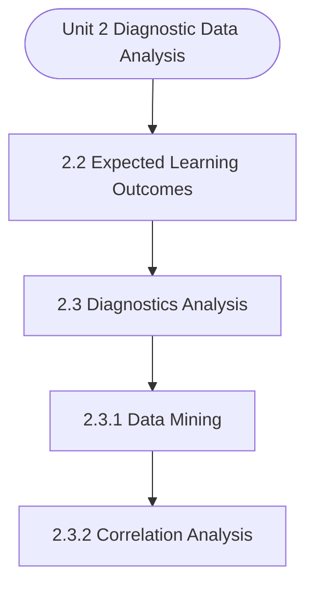

# MCS-068: Predictive Data Analysis
## Unit 2: Diagnostic Data Analysis

> 📚 **Programme:** M.Sc. (Data Science and Analytics) | **Semester:** Semester 2  
> ⏱️ **Estimated Study Time:** ~44 mins | 📄 **Textbook Pages:** 24 Pages  
> 📥 **Original PDF:** [Download & View Authentic Textbook](../../../pdfs/Semester_2/MCS-068_Predictive_Data_Analysis/Unit-2_Diagnostic_Data_Analysis.pdf)

---

### 🎯 Executive Concept & Data Science Relevance
In modern data systems, **Diagnostic Data Analysis** forms a vital conceptual pillar. Regression analysis estimates relationships between dependent targets and independent explanatory variables. Linear models, regularization penalties, and gradient updates form the computational core of supervised machine learning.

> [!NOTE]
> **Why this matters for your career:** Mastering diagnostic data analysis equips you with the foundational principles required to reason mathematically about high-dimensional datasets, evaluate algorithm performance, and avoid statistical pitfalls in production machine learning pipelines.

### 🗺️ Visual Knowledge Architecture
The following concept map illustrates the structural hierarchy and learning trajectory of this module:



### 📖 Core Definitions & Terminology Cards

> 📌 **Ordinary Least Squares (OLS)**  
> - **Formal Definition:** Estimation method that minimizes the sum of squared differences (residuals) between observed values and predictions: $\min_\beta \sum (y_i - \hat{y}_i)^2$.  
> - 💡 **Practical Intuition & Analogy:** *Finding the single line that minimizes total vertical squared distance to all data points.*

> 📌 **Coefficient of Determination ($R^2$)**  
> - **Formal Definition:** The proportion of variance in the dependent variable explained by independent features: $R^2 = 1 - \frac{SS_{\text{res}}}{SS_{\text{tot}}}$. Ranges from 0 to 1.  
> - 💡 **Practical Intuition & Analogy:** *An $R^2 = 0.85$ means 85% of target variability is captured by your model.*

> 📌 **Ridge Regularization ($L_2$)**  
> - **Formal Definition:** Adds squared magnitude penalty to the loss function: $\mathcal{L} + \lambda \sum_{j=1}^p \beta_j^2$. Shrinks weights toward zero to prevent overfitting under multicollinearity.  
> - 💡 **Practical Intuition & Analogy:** *Discourages extreme weight spikes without setting any coefficient entirely to zero.*

> 📌 **Lasso Regularization ($L_1$)**  
> - **Formal Definition:** Adds absolute magnitude penalty to the loss function: $\mathcal{L} + \lambda \sum_{j=1}^p \vert\beta_j\vert$. Drives non-essential coefficients exactly to zero, performing automated feature selection.  
> - 💡 **Practical Intuition & Analogy:** *Selects a sparse subset of impactful features by zeroing out noise variables.*

### ⚡ Governing Mathematical Laws & Formula Cheatsheet
#### 🔹 Simple Linear Regression OLS Parameters
$$
\begin{aligned} \hat{\beta}_1 & = \frac{\sum (x_i - \bar{x})(y_i - \bar{y})}{\sum (x_i - \bar{x})^2} = \frac{\text{Cov}(x, y)}{\text{Var}(x)} \\ \hat{\beta}_0 & = \bar{y} - \hat{\beta}_1 \bar{x} \end{aligned}
$$
- **Explanation:** Closed-form slope and intercept formulas for single-feature linear regression.

#### 🔹 Multiple Linear Regression Normal Equation
$$
\hat{\mathbf{\beta}} = (\mathbf{X}^T \mathbf{X})^{-1} \mathbf{X}^T \mathbf{y}
$$
- **Explanation:** Direct analytic matrix solution for OLS regression weights.

#### 🔹 Ridge Regression Closed-Form Estimator
$$
\hat{\mathbf{\beta}}_{\text{Ridge}} = (\mathbf{X}^T \mathbf{X} + \lambda \mathbf{I})^{-1} \mathbf{X}^T \mathbf{y}
$$
- **Explanation:** Adding $\lambda \mathbf{I}$ ensures invertibility even when $\mathbf{X}^T \mathbf{X}$ is ill-conditioned or collinear.

#### 🔹 Logistic Regression Sigmoid Function
$$
P(Y = 1 \mid X = \mathbf{x}) = \sigma(\mathbf{w}^T \mathbf{x} + b) = \frac{1}{1 + e^{-(\mathbf{w}^T \mathbf{x} + b)}}
$$
- **Explanation:** Maps any real-valued linear score into a calibrated probability interval $[0, 1]$.

### ⚖️ Axiomatic Properties & Governing Laws
The mathematical formulations of this module are anchored by foundational algebraic and structural laws:

- **Gauss-Markov Theorem:** Under standard OLS assumptions, the OLS estimator is BLUE (Best Linear Unbiased Estimator).
- **Orthogonality of Residuals:** $\mathbf{X}^T \mathbf{e} = \mathbf{0} \quad (\text{Residuals are orthogonal to feature space})$
- **Variance Inflation Factor (VIF):** $\text{VIF}_j = \frac{1}{1 - R_j^2} \quad (\text{VIF} > 5 \implies \text{Severe Multicollinearity})$

### 📌 Comprehensive Section-by-Section Study Breakdown
#### `2.2` Expected Learning Outcomes
##### 📘 Theoretical Principles & In-Depth Exposition
The section on **Expected Learning Outcomes** establishes rigorous theoretical foundations necessary for advanced computational modeling. It introduces formal mathematical structures and symbolic notations that guarantee consistency across proofs and algorithms.

In the broader scope of **Diagnostic Data Analysis**, understanding expected learning outcomes is essential to formalizing data representations, verifying boundary constraints, and ensuring computational determinism across multidimensional feature spaces.

##### ⚙️ Mathematical & Algorithmic Mechanics
- **Formal Mechanics:** Establishes symbolic transformations and state invariants governing expected learning outcomes.
- **Boundary Invariants:** Ensures robust error-handling, non-empty set guarantees, and strict asymptotic bounds.

##### 📊 Practical Data Science & Production Relevance
- **Industry Application:** Directly implemented in production workflows such as SQL query filters, pandas vectorized operations, and feature transformation pipelines.
- **Production Pitfall:** Failing to verify membership bounds or missing edge cases in expected learning outcomes can cause silent data corruption or performance bottlenecks.

> [!TIP]
> **Key Exam & Technical Interview Takeaway:** Be prepared to define expected learning outcomes formally, cite its core mathematical invariants, and solve step-by-step numerical/proof questions.

#### `2.3` Diagnostics Analysis
##### 📘 Theoretical Principles & In-Depth Exposition
DATA MINING Data mining provides the computational and algorithmic foundation for diagnostic analysis. It involves extracting useful patterns, relationships, and knowledge from large and complex datasets that are otherwise difficult to analyse manually. We learned from the examples cited above in section 2.3 that, while performing diagnostic analysis, data mining helps to: ● Identify root causes behind outcomes such as declining sales, system failures, or customer churn ● Discover hidden patterns that are not immediately visible through simple summaries ● Segment the data into meaningful groups to compare behavior across categories ● Detect anomalies and exceptions that may explain unusual events Several data mining algorithms are particularly useful in performing diagnostic analysis a few are listed below: 1.

Classification algorithms (Decision Trees, Naïve Bayes, k-Nearest Neighbours): Used to determine factors responsible for categorical outcomes, such as loan default or disease diagnosis. Clustering algorithms (K-Means, Hierarchical Clustering, DBSCAN): Help identify groups with similar characteristics to compare behaviors and diagnose differences.

Association Rule Mining (Apriori, FP-Growth): Discovers relationships between variables, such as product combinations influencing sales or symptoms linked to diseases. Anomaly / Outlier Detection: Identifies unusual patterns that may signal errors, fraud, or rare events influencing results.

##### ⚙️ Mathematical & Algorithmic Mechanics
- **Formal Mechanics:** Establishes symbolic transformations and state invariants governing diagnostics analysis.
- **Boundary Invariants:** Ensures robust error-handling, non-empty set guarantees, and strict asymptotic bounds.

##### 📊 Practical Data Science & Production Relevance
- **Industry Application:** Directly implemented in production workflows such as SQL query filters, pandas vectorized operations, and feature transformation pipelines.
- **Production Pitfall:** Failing to verify membership bounds or missing edge cases in diagnostics analysis can cause silent data corruption or performance bottlenecks.

> [!TIP]
> **Key Exam & Technical Interview Takeaway:** Be prepared to define diagnostics analysis formally, cite its core mathematical invariants, and solve step-by-step numerical/proof questions.

#### `2.3.1` Data Mining
##### 📘 Theoretical Principles & In-Depth Exposition
DATA MINING Data mining provides the computational and algorithmic foundation for diagnostic analysis. It involves extracting useful patterns, relationships, and knowledge from large and complex datasets that are otherwise difficult to analyse manually. We learned from the examples cited above in section 2.3 that, while performing diagnostic analysis, data mining helps to: ● Identify root causes behind outcomes such as declining sales, system failures, or customer churn ● Discover hidden patterns that are not immediately visible through simple summaries ● Segment the data into meaningful groups to compare behavior across categories ● Detect anomalies and exceptions that may explain unusual events Several data mining algorithms are particularly useful in performing diagnostic analysis a few are listed below: 1.

Classification algorithms (Decision Trees, Naïve Bayes, k-Nearest Neighbours): Used to determine factors responsible for categorical outcomes, such as loan default or disease diagnosis. Clustering algorithms (K-Means, Hierarchical Clustering, DBSCAN): Help identify groups with similar characteristics to compare behaviors and diagnose differences.

Association Rule Mining (Apriori, FP-Growth): Discovers relationships between variables, such as product combinations influencing sales or symptoms linked to diseases. Anomaly / Outlier Detection: Identifies unusual patterns that may signal errors, fraud, or rare events influencing results.

##### ⚙️ Mathematical & Algorithmic Mechanics
- **Formal Mechanics:** Establishes symbolic transformations and state invariants governing data mining.
- **Boundary Invariants:** Ensures robust error-handling, non-empty set guarantees, and strict asymptotic bounds.

##### 📊 Practical Data Science & Production Relevance
- **Industry Application:** Directly implemented in production workflows such as SQL query filters, pandas vectorized operations, and feature transformation pipelines.
- **Production Pitfall:** Failing to verify membership bounds or missing edge cases in data mining can cause silent data corruption or performance bottlenecks.

> [!TIP]
> **Key Exam & Technical Interview Takeaway:** Be prepared to define data mining formally, cite its core mathematical invariants, and solve step-by-step numerical/proof questions.

#### `2.3.2` Correlation Analysis
##### 📘 Theoretical Principles & In-Depth Exposition
CORRELATION ANALYSIS Correlation analysis is a core statistical technique in diagnostic data analysis, whose primary objective is to explain why certain outcomes occur by examining relationships among variables. While descriptive analysis tells us what has happened, diagnostic analysis seeks to uncover why it happened, and correlation analysis provides one of the most powerful tools for this investigation.

You have already learned various statistical measures such as measures of central tendency, measures of dispersion, moments, skewness, and kurtosis, all of which analyze variables individually. However, in many practical situations, it is necessary to examine two variables simultaneously in order to understand the relationship between them.

This section introduces the concept of correlation, which focuses on studying the linear relationship between two or more variables. For the sake of basic understanding, one can say that “when two variables are related in such a way that change in the value of one variable affects the value of another variable, then variables are said to be correlated or there is correlation between these two variables.” You will learn how to compute the correlation coefficient under different conditions and understand its properties.

##### ⚙️ Mathematical & Algorithmic Mechanics
- **Formal Mechanics:** Establishes symbolic transformations and state invariants governing correlation analysis.
- **Boundary Invariants:** Ensures robust error-handling, non-empty set guarantees, and strict asymptotic bounds.

##### 📊 Practical Data Science & Production Relevance
- **Industry Application:** Directly implemented in production workflows such as SQL query filters, pandas vectorized operations, and feature transformation pipelines.
- **Production Pitfall:** Failing to verify membership bounds or missing edge cases in correlation analysis can cause silent data corruption or performance bottlenecks.

> [!TIP]
> **Key Exam & Technical Interview Takeaway:** Be prepared to define correlation analysis formally, cite its core mathematical invariants, and solve step-by-step numerical/proof questions.

### 📐 Step-by-Step Solved Mathematical Examples
To solidify your theoretical understanding, work through these fully solved, step-by-step mathematical problems:

#### 🧮 Example 1: Simple Linear Regression OLS Computation
> **Problem Statement:**  
> Given data points $(x, y)$: $(1, 2), (2, 3), (3, 5), (4, 4), (5, 6)$. Compute OLS slope $\hat{\beta}_1$, intercept $\hat{\beta}_0$, and regression line.

**Detailed Step-by-Step Solution:**

1. **Means:** $\bar{x} = 3.0, \; \bar{y} = 4.0$.
2. **Deviations & Products:**
- $(x_1 - \bar{x}) = -2, \; (y_1 - \bar{y}) = -2 \implies (-2)(-2) = 4, \; (-2)^2 = 4$
- $(x_2 - \bar{x}) = -1, \; (y_2 - \bar{y}) = -1 \implies (-1)(-1) = 1, \; (-1)^2 = 1$
- $(x_3 - \bar{x}) = 0, \; (y_3 - \bar{y}) = 1 \implies (0)(1) = 0, \; 0^2 = 0$
- $(x_4 - \bar{x}) = 1, \; (y_4 - \bar{y}) = 0 \implies (1)(0) = 0, \; 1^2 = 1$
- $(x_5 - \bar{x}) = 2, \; (y_5 - \bar{y}) = 2 \implies (2)(2) = 4, \; 2^2 = 4$

3. **Summation:** $\sum (x_i - \bar{x})(y_i - \bar{y}) = 9, \; \sum (x_i - \bar{x})^2 = 10$.

4. **Parameters:**
$$
\hat{\beta}_1 = \frac{9}{10} = 0.90
$$
$$
\hat{\beta}_0 = \bar{y} - \hat{\beta}_1 \bar{x} = 4.0 - 0.9(3.0) = 4.0 - 2.7 = 1.30
$$

Regression Equation: $\hat{y} = 1.30 + 0.90 x$.

#### 🧮 Example 2: Coefficient of Determination $R^2$ Calculation
> **Problem Statement:**  
> For the model above, total sum of squares $SS_{\text{tot}} = 10.0$ and sum of squared residuals $SS_{\text{res}} = 1.90$. Calculate $R^2$ and interpret.

**Detailed Step-by-Step Solution:**

$$
R^2 = 1 - \frac{SS_{\text{res}}}{SS_{\text{tot}}} = 1 - \frac{1.90}{10.0} = 1 - 0.19 = 0.81 \implies 81\%
$$

Interpretation: 81% of the variation in target $y$ is explained by feature $x$.

### 💻 Practical Data Science Implementation (Python)
Theory translates directly into production algorithms. Below is a self-contained, commented Python implementation illustrating the core operations of this unit:

```python
from sklearn.linear_model import LinearRegression, Ridge, Lasso
import numpy as np

# Dataset with multicollinearity
X = np.array([[1, 2], [2, 4.1], [3, 5.9], [4, 8.2], [5, 9.9]])
y = np.array([2.2, 4.1, 6.2, 7.9, 10.1])

# 1. Standard OLS
ols = LinearRegression().fit(X, y)
print("OLS Coefficients:", ols.coef_)

# 2. Ridge (L2 penalty shrinks weights smoothly)
ridge = Ridge(alpha=1.0).fit(X, y)
print("Ridge Coefficients:", ridge.coef_)

# 3. Lasso (L1 penalty induces sparsity)
lasso = Lasso(alpha=0.1).fit(X, y)
print("Lasso Coefficients (Sparse):", lasso.coef_)
```

### 💡 Interactive Self-Assessment Checkpoints
Test your comprehension before proceeding. Tap each question to reveal the comprehensive explanation:

<details>
<summary><b>Checkpoint 1:</b> What is the key difference between Ridge ($L_2$) and Lasso ($L_1$) regression? <i>(Tap to reveal answer)</i></summary>

> **Answer & Analysis:**  
> Ridge shrinks coefficients continuously toward zero without zeroing them out, whereas Lasso drives coefficients to exactly zero, producing sparse models and automated feature selection.
</details>

<details>
<summary><b>Checkpoint 2:</b> What is the matrix Normal Equation for Ordinary Least Squares? <i>(Tap to reveal answer)</i></summary>

> **Answer & Analysis:**  
> $\hat{\mathbf{\beta}} = (\mathbf{X}^T \mathbf{X})^{-1} \mathbf{X}^T \mathbf{y}$
</details>

<details>
<summary><b>Checkpoint 3:</b> What does a high Variance Inflation Factor (VIF > 5) indicate? <i>(Tap to reveal answer)</i></summary>

> **Answer & Analysis:**  
> Severe **multicollinearity**, meaning independent features are highly correlated with each other, destabilizing coefficient estimation.
</details>

<details>
<summary><b>Checkpoint 4:</b> Differentiate between Descriptive Data Analysis and Diagnostic Data Analysis. …………………………………………………………………………………………… …………………………………………………………………………………………… Q <i>(Tap to reveal answer)</i></summary>

> **Answer & Analysis:**  
> This question tests your conceptual mastery of Diagnostic Data Analysis. Review the governing formulas and section breakdowns above to formulate a complete, rigorous proof or derivation.
</details>

<details>
<summary><b>Checkpoint 5:</b> What is Diagnostic Data Analysis? Explain its importance in decision-making. …………………………………………………………………………………………… …………………………………………………………………………………………… Q <i>(Tap to reveal answer)</i></summary>

> **Answer & Analysis:**  
> This question tests your conceptual mastery of Diagnostic Data Analysis. Review the governing formulas and section breakdowns above to formulate a complete, rigorous proof or derivation.
</details>

<details>
<summary><b>Checkpoint 6:</b> Explain the role of Data Mining and Correlation Analysis in Diagnostic Analysis with examples. …………………………………………………………………………………………… …………………………………………………………………………………………… <i>(Tap to reveal answer)</i></summary>

> **Answer & Analysis:**  
> This question tests your conceptual mastery of Diagnostic Data Analysis. Review the governing formulas and section breakdowns above to formulate a complete, rigorous proof or derivation.
</details>

### 🎯 Executive Module Wrap-Up
- **Central Idea:** Diagnostic Data Analysis provides essential mathematical and algorithmic tools directly utilized in Data Science.
- **Mathematical Rigor:** Formulas and laws must be memorized with attention to boundary conditions and assumptions.
- **Full Textbook Coverage:** For exhaustive multi-page derivations, proofs, and supplementary exercises, consult the [Authentic IGNOU Textbook](../../../pdfs/Semester_2/MCS-068_Predictive_Data_Analysis/Unit-2_Diagnostic_Data_Analysis.pdf).

---
### 🧭 Navigation & Syllabus Index
[⬅ Previous: Unit 1](unit_01_Descriptive_Data_Analysis.md) | [📑 Course Index](README.md) | [Next: Unit 3 ➡](unit_03_Predictive_Data_Analysis.md)
