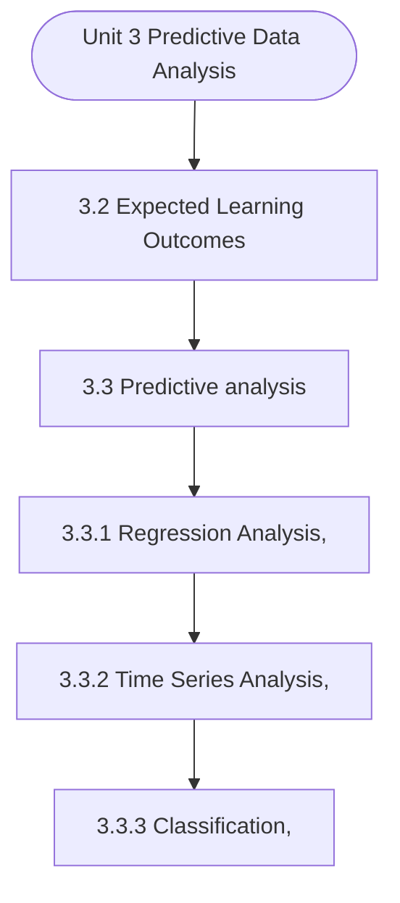

# MCS-068: Predictive Data Analysis
## Unit 3: Predictive Data Analysis

> 📚 **Programme:** M.Sc. (Data Science and Analytics) | **Semester:** Semester 2  
> ⏱️ **Estimated Study Time:** ~50 mins | 📄 **Textbook Pages:** 30 Pages  
> 📥 **Original PDF:** [Download & View Textbook](../../../pdfs/Semester_2/MCS-068_Predictive_Data_Analysis/Unit-3_Predictive_Data_Analysis.pdf)

---

### 🎯 Executive Concept & Data Science Relevance
In modern data systems, **Predictive Data Analysis** forms a vital conceptual pillar. Regression analysis estimates relationships between dependent targets and independent explanatory variables. Linear models, regularization penalties, and gradient updates form the computational core of supervised machine learning.

> [!NOTE]
> **Why this matters for your career:** Mastering predictive data analysis equips you with the foundational principles required to reason mathematically about high-dimensional datasets, evaluate algorithm performance, and avoid statistical pitfalls in production machine learning pipelines.

### 🗺️ Visual Knowledge Architecture
The following concept map illustrates the structural hierarchy and learning trajectory of this module:

### 📖 Core Definitions & Terminology Cards

> 📌 **Ordinary Least Squares (OLS)**  
> - **Formal Definition:** Estimation method that minimizes the sum of squared differences (residuals) between observed values and predictions: $\min_\beta \sum (y_i - \hat{y}_i)^2$.  
> - 💡 **Practical Intuition & Analogy:** *Finding the single line that minimizes total vertical squared distance to all data points.*

> 📌 **Coefficient of Determination ($R^2$)**  
> - **Formal Definition:** The proportion of variance in the dependent variable explained by independent features: $R^2 = 1 - \frac{SS_{\text{res}}}{SS_{\text{tot}}}$. Ranges from 0 to 1.  
> - 💡 **Practical Intuition & Analogy:** *An $R^2 = 0.85$ means 85% of target variability is captured by your model.*

> 📌 **Ridge Regularization ($L_2$)**  
> - **Formal Definition:** Adds squared magnitude penalty to the loss function: $\mathcal{L} + \lambda \sum_{j=1}^p \beta_j^2$. Shrinks weights toward zero to prevent overfitting under multicollinearity.  
> - 💡 **Practical Intuition & Analogy:** *Discourages extreme weight spikes without setting any coefficient entirely to zero.*

> 📌 **Lasso Regularization ($L_1$)**  
> - **Formal Definition:** Adds absolute magnitude penalty to the loss function: $\mathcal{L} + \lambda \sum_{j=1}^p \vert\beta_j\vert$. Drives non-essential coefficients exactly to zero, performing automated feature selection.  
> - 💡 **Practical Intuition & Analogy:** *Selects a sparse subset of impactful features by zeroing out noise variables.*

### ⚡ Governing Mathematical Laws & Formula Cheatsheet
#### 🔹 Simple Linear Regression OLS Parameters
$$
\begin{aligned} \hat{\beta}_1 & = \frac{\sum (x_i - \bar{x})(y_i - \bar{y})}{\sum (x_i - \bar{x})^2} = \frac{\text{Cov}(x, y)}{\text{Var}(x)} \\ \hat{\beta}_0 & = \bar{y} - \hat{\beta}_1 \bar{x} \end{aligned}
$$
- **Explanation:** Closed-form slope and intercept formulas for single-feature linear regression.

#### 🔹 Multiple Linear Regression Normal Equation
$$
\hat{\mathbf{\beta}} = (\mathbf{X}^T \mathbf{X})^{-1} \mathbf{X}^T \mathbf{y}
$$
- **Explanation:** Direct analytic matrix solution for OLS regression weights.

#### 🔹 Ridge Regression Closed-Form Estimator
$$
\hat{\mathbf{\beta}}_{\text{Ridge}} = (\mathbf{X}^T \mathbf{X} + \lambda \mathbf{I})^{-1} \mathbf{X}^T \mathbf{y}
$$
- **Explanation:** Adding $\lambda \mathbf{I}$ ensures invertibility even when $\mathbf{X}^T \mathbf{X}$ is ill-conditioned or collinear.

#### 🔹 Logistic Regression Sigmoid Function
$$
P(Y = 1 \mid X = \mathbf{x}) = \sigma(\mathbf{w}^T \mathbf{x} + b) = \frac{1}{1 + e^{-(\mathbf{w}^T \mathbf{x} + b)}}
$$
- **Explanation:** Maps any real-valued linear score into a calibrated probability interval $[0, 1]$.

### 📌 Detailed Section-by-Section Study Breakdown
#### `3.2` Expected Learning Outcomes
- **Core Concept:** Establishes theoretical foundations, axiomatic formulations, and properties of expected learning outcomes.
- **Core Concept:** Analyzes standard algorithmic workflows and mathematical transformations relevant to predictive data analysis.
- **Core Concept:** Applies computational bounds and optimization guarantees across data processing workflows.
- **Data Science Application:** Provides foundational structures used directly in statistical modeling, query execution, and machine learning pipelines.

> [!TIP]
> **Exam & Interview Tip:** Be prepared to state the formal definition of expected learning outcomes and derive its primary equations step-by-step.

#### `3.3` Predictive analysis
- **Core Concept:** Establishes theoretical foundations, axiomatic formulations, and properties of predictive analysis.
- **Core Concept:** Analyzes standard algorithmic workflows and mathematical transformations relevant to predictive data analysis.
- **Core Concept:** Applies computational bounds and optimization guarantees across data processing workflows.
- **Data Science Application:** Provides foundational structures used directly in statistical modeling, query execution, and machine learning pipelines.

> [!TIP]
> **Exam & Interview Tip:** Be prepared to state the formal definition of predictive analysis and derive its primary equations step-by-step.

#### `3.3.1` Regression Analysis,
- **Core Concept:** Regression analysis is one of the most important and widely used tools in predictive data analysis.
- **Core Concept:** It helps data scientists model relationships between variables and use those relationships to predict future outcomes.
- **Core Concept:** By learning this relationship from past data, a regression model can be used to estimate or forecast unknown or future values.
- **Data Science Application:** Provides foundational structures used directly in statistical modeling, query execution, and machine learning pipelines.

> [!TIP]
> **Exam & Interview Tip:** Be prepared to state the formal definition of regression analysis, and derive its primary equations step-by-step.

#### `3.3.2` Time Series Analysis,
- **Core Concept:** Unlike other forms of data analysis where the order of observations may not matter, time series analysis treats time as a critical dimension, meaning that the sequence and spacing of observations directly influence the analysis and results.
- **Core Concept:** In the context of predictive data analytics, time series analysis plays a central role because it focuses explicitly on predicting future outcomes based on historical time-dependent data.
- **Core Concept:** By learning from past behaviour, time series models enable data scientists to forecast variables such as future sales, demand, stock prices, energy consumption, and website traffic.
- **Data Science Application:** Provides foundational structures used directly in statistical modeling, query execution, and machine learning pipelines.

> [!TIP]
> **Exam & Interview Tip:** Be prepared to state the formal definition of time series analysis, and derive its primary equations step-by-step.

#### `3.3.3` Classification,
- **Core Concept:** Classification is one of the most widely used techniques in Predictive Data Analysis.
- **Core Concept:** It is a supervised learning approach in which a model is trained using a labelled dataset to predict the category or class of new observations.
- **Core Concept:** In classification problems, the target variable is categorical, meaning it represents predefined classes such as yes/no, fraud/not fraud, spam/not spam, or high/medium/low risk.
- **Data Science Application:** Provides foundational structures used directly in statistical modeling, query execution, and machine learning pipelines.

> [!TIP]
> **Exam & Interview Tip:** Be prepared to state the formal definition of classification, and derive its primary equations step-by-step.

#### `3.3.4` Clustering
- **Core Concept:** Clustering is an important technique used in predictive data analysis to group similar data points into clusters based on shared characteristics or patterns.
- **Core Concept:** Unlike classification, clustering is an unsupervised learning method, meaning that it does not rely on predefined class labels.
- **Core Concept:** Instead, it identifies natural groupings within the dataset by measuring similarities or distances between observations.
- **Data Science Application:** Provides foundational structures used directly in statistical modeling, query execution, and machine learning pipelines.

> [!TIP]
> **Exam & Interview Tip:** Be prepared to state the formal definition of clustering and derive its primary equations step-by-step.

### 💡 Interactive Self-Assessment Checkpoints
Test your comprehension before proceeding. Tap each question to reveal the comprehensive explanation:

<b>Checkpoint 1:</b> What is the key difference between Ridge ($L_2$) and Lasso ($L_1$) regression? <i>(Tap to reveal answer)</i>

> **Answer & Analysis:**  
> Ridge shrinks coefficients continuously toward zero without zeroing them out, whereas Lasso drives coefficients to exactly zero, producing sparse models and automated feature selection.

<b>Checkpoint 2:</b> What is the matrix Normal Equation for Ordinary Least Squares? <i>(Tap to reveal answer)</i>

> **Answer & Analysis:**  
> $\hat{\mathbf{\beta}} = (\mathbf{X}^T \mathbf{X})^{-1} \mathbf{X}^T \mathbf{y}$

<b>Checkpoint 3:</b> What does a high Variance Inflation Factor (VIF > 5) indicate? <i>(Tap to reveal answer)</i>

> **Answer & Analysis:**  
> Severe **multicollinearity**, meaning independent features are highly correlated with each other, destabilizing coefficient estimation.

<b>Checkpoint 4:</b> Explain the continuum of data analytics from descriptive to prescriptive analysis. …………………………………………………………………………………………… …………………………………………………………………………………………… <i>(Tap to reveal answer)</i>

> **Answer & Analysis:**  
> This question tests your conceptual mastery of Predictive Data Analysis. Review the governing formulas and section breakdowns above to formulate a complete, rigorous proof or derivation.

<b>Checkpoint 5:</b> What is Predictive Data Analysis? How does it differ from descriptive and diagnostic analysis? …………………………………………………………………………………………… …………………………………………………………………………………………… Q <i>(Tap to reveal answer)</i>

> **Answer & Analysis:**  
> This question tests your conceptual mastery of Predictive Data Analysis. Review the governing formulas and section breakdowns above to formulate a complete, rigorous proof or derivation.

<b>Checkpoint 6:</b> List and briefly explain the main techniques used in Predictive Data Analysis.…………………………………………………………………………………………… …………………………………………………………………………………………… <i>(Tap to reveal answer)</i>

> **Answer & Analysis:**  
> This question tests your conceptual mastery of Predictive Data Analysis. Review the governing formulas and section breakdowns above to formulate a complete, rigorous proof or derivation.

### 🎯 Executive Module Wrap-Up
- **Central Idea:** Predictive Data Analysis provides essential mathematical and algorithmic tools directly utilized in Data Science.
- **Mathematical Rigor:** Formulas and laws must be memorized with attention to boundary conditions and assumptions.
- **Full Textbook Coverage:** For exhaustive multi-page derivations, proofs, and supplementary exercises, consult the [Authentic IGNOU Textbook](../../../pdfs/Semester_2/MCS-068_Predictive_Data_Analysis/Unit-3_Predictive_Data_Analysis.pdf).

---
### 🧭 Navigation & Syllabus Index
[⬅ Previous: Unit 2](unit_02_Diagnostic_Data_Analysis.md) | [📑 Course Index](README.md) | [Next: Unit 4 ➡](unit_04_Prescriptive_Data_Analysis.md)
