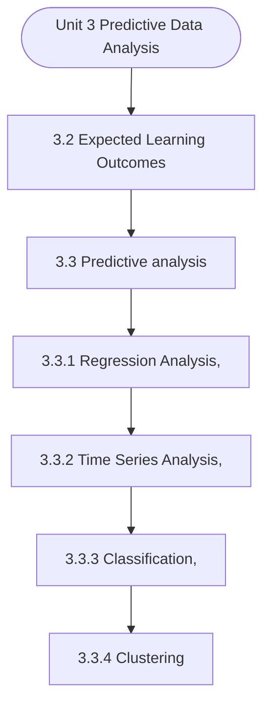

# MCS-068: Predictive Data Analysis
## Unit 3: Predictive Data Analysis

> 📚 **Programme:** M.Sc. (Data Science and Analytics) | **Semester:** Semester 2  
> ⏱️ **Estimated Study Time:** ~50 mins | 📄 **Textbook Pages:** 30 Pages  
> 📥 **Original PDF:** [Download & View Authentic Textbook](../../../pdfs/Semester_2/MCS-068_Predictive_Data_Analysis/Unit-3_Predictive_Data_Analysis.pdf)

---

### 🎯 Executive Concept & Data Science Relevance
In modern data systems and advanced analytics, **Predictive Data Analysis** forms a vital conceptual pillar. Regression analysis estimates relationships between dependent targets and independent explanatory variables. Linear models, regularization penalties, and gradient updates form the computational core of supervised machine learning.

> [!NOTE]
> **Why this matters for your career:** Mastering predictive data analysis equips you with the foundational principles required to reason mathematically about high-dimensional datasets, evaluate algorithm performance, and avoid statistical pitfalls in production machine learning pipelines.

### 🗺️ Visual Knowledge Architecture
The following concept map illustrates the structural hierarchy and learning trajectory of this module:



### 📖 Core Definitions & Terminology Cards

> 📌 **Ordinary Least Squares (OLS)**  
> - **Formal Definition:** Estimation method that minimizes the sum of squared differences (residuals) between observed values and predictions: $\min_\beta \sum (y_i - \hat{y}_i)^2$.  
> - 💡 **Practical Intuition & Analogy:** *Finding the single line that minimizes total vertical squared distance to all data points.*

> 📌 **Coefficient of Determination ($R^2$)**  
> - **Formal Definition:** The proportion of variance in the dependent variable explained by independent features: $R^2 = 1 - \frac{SS_{\text{res}}}{SS_{\text{tot}}}$. Ranges from 0 to 1.  
> - 💡 **Practical Intuition & Analogy:** *An $R^2 = 0.85$ means 85% of target variability is captured by your model.*

> 📌 **Ridge Regularization ($L_2$)**  
> - **Formal Definition:** Adds squared magnitude penalty to the loss function: $\mathcal{L} + \lambda \sum_{j=1}^p \beta_j^2$. Shrinks weights toward zero to prevent overfitting under multicollinearity.  
> - 💡 **Practical Intuition & Analogy:** *Discourages extreme weight spikes without setting any coefficient entirely to zero.*

> 📌 **Lasso Regularization ($L_1$)**  
> - **Formal Definition:** Adds absolute magnitude penalty to the loss function: $\mathcal{L} + \lambda \sum_{j=1}^p \vert\beta_j\vert$. Drives non-essential coefficients exactly to zero, performing automated feature selection.  
> - 💡 **Practical Intuition & Analogy:** *Selects a sparse subset of impactful features by zeroing out noise variables.*

### ⚡ Governing Mathematical Laws & Formula Cheatsheet
#### 🔹 Simple Linear Regression OLS Parameters
$$
\begin{aligned} \hat{\beta}_1 & = \frac{\sum (x_i - \bar{x})(y_i - \bar{y})}{\sum (x_i - \bar{x})^2} = \frac{\text{Cov}(x, y)}{\text{Var}(x)} \\ \hat{\beta}_0 & = \bar{y} - \hat{\beta}_1 \bar{x} \end{aligned}
$$
- **Explanation:** Closed-form slope and intercept formulas for single-feature linear regression.

#### 🔹 Multiple Linear Regression Normal Equation
$$
\hat{\mathbf{\beta}} = (\mathbf{X}^T \mathbf{X})^{-1} \mathbf{X}^T \mathbf{y}
$$
- **Explanation:** Direct analytic matrix solution for OLS regression weights.

#### 🔹 Ridge Regression Closed-Form Estimator
$$
\hat{\mathbf{\beta}}_{\text{Ridge}} = (\mathbf{X}^T \mathbf{X} + \lambda \mathbf{I})^{-1} \mathbf{X}^T \mathbf{y}
$$
- **Explanation:** Adding $\lambda \mathbf{I}$ ensures invertibility even when $\mathbf{X}^T \mathbf{X}$ is ill-conditioned or collinear.

#### 🔹 Logistic Regression Sigmoid Function
$$
P(Y = 1 \mid X = \mathbf{x}) = \sigma(\mathbf{w}^T \mathbf{x} + b) = \frac{1}{1 + e^{-(\mathbf{w}^T \mathbf{x} + b)}}
$$
- **Explanation:** Maps any real-valued linear score into a calibrated probability interval $[0, 1]$.

### ⚖️ Axiomatic Properties & Governing Laws
The mathematical formulations of this module are anchored by foundational algebraic and structural laws:

- **Gauss-Markov Theorem:** Under standard OLS assumptions, the OLS estimator is BLUE (Best Linear Unbiased Estimator).
- **Orthogonality of Residuals:** $\mathbf{X}^T \mathbf{e} = \mathbf{0} \quad (\text{Residuals are orthogonal to feature space})$
- **Variance Inflation Factor (VIF):** $\text{VIF}_j = \frac{1}{1 - R_j^2} \quad (\text{VIF} > 5 \implies \text{Severe Multicollinearity})$

### 📌 Comprehensive Section-by-Section Study Breakdown
#### `3.2` Expected Learning Outcomes

##### 📘 Theoretical Principles & Pedagogical Exposition
In probability theory and statistical inference, **Expected Learning Outcomes** formalizes the stochastic behavior of random phenomena. Within **Predictive Data Analysis**, this framework allows data scientists to infer population parameters from finite empirical samples while quantifying uncertainty via confidence intervals and hypothesis tests.

The mathematical rigor here prevents statistical misinterpretations, such as confusing correlation with causation, overlooking sample selection bias, or violating distributional assumptions.

##### ⚙️ Mathematical & Algorithmic Mechanics
- **Core Mechanism:** Establishes analytical principles and computational workflows for predictive data analysis.
- **Boundary Conditions:** Missing data values, extreme outliers, and non-standard data types.

##### 📊 Practical Data Science & Production Relevance
- **Production Workflow:** End-to-end data science processing stacks (Pandas, Scikit-learn, PyTorch).
- **Real-World Pitfall:** Failing to validate inputs before feeding data into production analytics pipelines.

> [!TIP]
> **Exam & Technical Interview Insight:** Define key concepts in expected learning outcomes and articulate practical applications in real-world scenarios.

#### `3.3` Predictive analysis

##### 📘 Theoretical Principles & Pedagogical Exposition
REGRESSION ANALYSIS Regression analysis is one of the most important and widely used tools in predictive data analysis. It helps data scientists model relationships between variables and use those relationships to predict future outcomes. In predictive analytics, regression answers the core question: “Given what we know from historical data, what value is likely to occur next?” At its core, regression analysis studies how a dependent variable (output) changes with respect to one or more independent variables (inputs).

By learning this relationship from past data, a regression model can be used to estimate or forecast unknown or future values. Because of this capability, regression forms the backbone of prediction tasks in domains such as sales forecasting, demand estimation, price prediction, risk assessment, and performance analysis.

Regression analysis is highly valued in predictive analytics because it produces predictions that are easy to interpret and understand, clearly explains how different predictors influence the outcome, and supports forecasting as well as scenario-based analysis. Additionally, regression forms the foundation for many machine learning algorithms, which is why regression models are often developed first before progressing to more complex predictive techniques.


##### ⚙️ Mathematical & Algorithmic Mechanics
- **Core Mechanism:** Establishes analytical principles and computational workflows for predictive data analysis.
- **Boundary Conditions:** Missing data values, extreme outliers, and non-standard data types.

##### 📊 Practical Data Science & Production Relevance
- **Production Workflow:** End-to-end data science processing stacks (Pandas, Scikit-learn, PyTorch).
- **Real-World Pitfall:** Failing to validate inputs before feeding data into production analytics pipelines.

> [!TIP]
> **Exam & Technical Interview Insight:** Define key concepts in predictive analysis and articulate practical applications in real-world scenarios.

#### `3.3.1` Regression Analysis,

##### 📘 Theoretical Principles & Pedagogical Exposition
REGRESSION ANALYSIS Regression analysis is one of the most important and widely used tools in predictive data analysis. It helps data scientists model relationships between variables and use those relationships to predict future outcomes. In predictive analytics, regression answers the core question: “Given what we know from historical data, what value is likely to occur next?” At its core, regression analysis studies how a dependent variable (output) changes with respect to one or more independent variables (inputs).

By learning this relationship from past data, a regression model can be used to estimate or forecast unknown or future values. Because of this capability, regression forms the backbone of prediction tasks in domains such as sales forecasting, demand estimation, price prediction, risk assessment, and performance analysis.

Regression analysis is highly valued in predictive analytics because it produces predictions that are easy to interpret and understand, clearly explains how different predictors influence the outcome, and supports forecasting as well as scenario-based analysis. Additionally, regression forms the foundation for many machine learning algorithms, which is why regression models are often developed first before progressing to more complex predictive techniques.


##### ⚙️ Mathematical & Algorithmic Mechanics
- **Core Mechanism:** Ordinary Least Squares (OLS) minimizes residual sum of squares: $\min_\beta \sum (y_i - x_i^T \beta)^2$. Normal equation analytical solution: $\hat{\beta} = (X^T X)^{-1} X^T y$. Logistic regression applies sigmoid link $\sigma(z) = \frac{1}{1 + e^{-z}}$ optimizing log-likelihood.
- **Boundary Conditions:** Perfect multicollinearity causing singular non-invertible $X^T X$, heteroscedasticity (non-constant residual variance), and high-leverage outlier leverage points.

##### 📊 Practical Data Science & Production Relevance
- **Production Workflow:** Predictive target forecasting, econometric attribution modeling, risk scoring models, and baseline benchmark modeling in data science pipelines.
- **Real-World Pitfall:** High multicollinearity inflating coefficient standard errors, or fitting linear models without verifying residual normality and homoscedasticity plots.

> [!TIP]
> **Exam & Technical Interview Insight:** Derive OLS normal equations; interpret slope $\beta_1$ and intercept $\beta_0$; calculate $R^2 = 1 - \frac{SS_{\text{res}}}{SS_{\text{tot}}}$ and conduct $F$-tests for overall model significance.

#### `3.3.2` Time Series Analysis,

##### 📘 Theoretical Principles & Pedagogical Exposition
TIME SERIES ANALYSIS Time Series Analysis is a statistical and analytical technique used to study data points collected sequentially over time, with the objective of identifying patterns such as trend, seasonality, and cyclic behaviour, and using these patterns to forecast future values.

Unlike other forms of data analysis where the order of observations may not matter, time series analysis treats time as a critical dimension, meaning that the sequence and spacing of observations directly influence the analysis and results. In the context of predictive data analytics, time series analysis plays a central role because it focuses explicitly on predicting future outcomes based on historical time-dependent data.

By learning from past behaviour, time series models enable data scientists to forecast variables such as future sales, demand, stock prices, energy consumption, and website traffic. Predictive analytics relies on these forecasts to anticipate events, plan resources, and make proactive decisions.


##### ⚙️ Mathematical & Algorithmic Mechanics
- **Core Mechanism:** Asymptotic bounds evaluate algorithmic scalability as input size $n \to \infty$: upper bound $\mathcal{O}(g(n))$, lower bound $\Omega(g(n))$, and tight bound $\Theta(g(n))$. Recurrences are solved via the Master Theorem: $T(n) = a T(n/b) + f(n)$.
- **Boundary Conditions:** Degenerate input permutations (e.g. sorted inputs triggering $\mathcal{O}(n^2)$ worst-case Quicksort), and recursion call stack memory limits.

##### 📊 Practical Data Science & Production Relevance
- **Production Workflow:** Selecting optimal data structures (hash tables $\mathcal{O}(1)$ vs BSTs $\mathcal{O}(\log n)$), minimizing latency in real-time query engines, and optimizing Big Data batch workloads.
- **Real-World Pitfall:** Ignoring hardware cache locality and constant factors, or inadvertently nesting linear scans within iterative loops yielding hidden $\mathcal{O}(n^2)$ complexity.

> [!TIP]
> **Exam & Technical Interview Insight:** Solve recurrences step-by-step using substitution or Master Theorem; state tight $\mathcal{O}$, $\Omega$, and $\Theta$ bounds for best, average, and worst-case scenarios.

#### `3.3.3` Classification,

##### 📘 Theoretical Principles & Pedagogical Exposition
CLASSIFICATION Classification is one of the most widely used techniques in Predictive Data Analysis. It is a supervised learning approach in which a model is trained using a labelled dataset to predict the category or class of new observations. In classification problems, the target variable is categorical, meaning it represents predefined classes such as yes/no, fraud/not fraud, spam/not spam, or high/medium/low risk.

The objective of classification is to learn patterns from historical data so that the model can accurately assign new data points to the appropriate class. This technique is widely applied in areas such as medical diagnosis, credit risk analysis, customer churn prediction, fraud detection, and email spam filtering.

The classification process generally involves several stages, including data collection, preprocessing, feature selection, model training, evaluation, and prediction. During preprocessing, missing values, noise, and inconsistencies in the dataset are handled to improve data quality.


##### ⚙️ Mathematical & Algorithmic Mechanics
- **Core Mechanism:** Supervised algorithms learn function approximations $f: \mathcal{X} \to \mathcal{Y}$ minimizing empirical loss. Unsupervised clustering minimizes intra-cluster inertia $\sum ||x_i - \mu_k||^2$. The Bias-Variance Tradeoff balances underfitting against overfitting.
- **Boundary Conditions:** Curse of dimensionality in high dimensions, severe class imbalance (requiring SMOTE or class-weighted loss), and poor centroid initialization in K-Means.

##### 📊 Practical Data Science & Production Relevance
- **Production Workflow:** Customer segmentation, churn prediction, recommendation systems, automated fraud scoring, and cross-validated model selection with regularization ($L_1, L_2$).
- **Real-World Pitfall:** Data leakage during preprocessing prior to train-test splits, producing falsely inflated validation scores that fail in production deployment.

> [!TIP]
> **Exam & Technical Interview Insight:** Calculate precision, recall, F1-score, and ROC-AUC; explain the mathematical difference between generative and discriminative models; trace K-Means iterations.

#### `3.3.4` Clustering

##### 📘 Theoretical Principles & Pedagogical Exposition
CLUSTERING Clustering is an important technique used in predictive data analysis to group similar data points into clusters based on shared characteristics or patterns. Unlike classification, clustering is an unsupervised learning method, meaning that it does not rely on predefined class labels.

Instead, it identifies natural groupings within the dataset by measuring similarities or distances between observations. The main objective of clustering is to discover hidden structures in large datasets, which can help analysts understand patterns, segment data, and support decision- making processes in fields such as marketing, healthcare, finance, and social sciences.

In predictive analytics, clustering is often used as a preliminary data exploration technique. By grouping similar observations together, analysts can identify patterns that may not be immediately visible in raw data. For example, businesses frequently use clustering to perform customer segmentation, where customers with similar purchasing behaviors, preferences, or demographics are grouped together.


##### ⚙️ Mathematical & Algorithmic Mechanics
- **Core Mechanism:** Supervised algorithms learn function approximations $f: \mathcal{X} \to \mathcal{Y}$ minimizing empirical loss. Unsupervised clustering minimizes intra-cluster inertia $\sum ||x_i - \mu_k||^2$. The Bias-Variance Tradeoff balances underfitting against overfitting.
- **Boundary Conditions:** Curse of dimensionality in high dimensions, severe class imbalance (requiring SMOTE or class-weighted loss), and poor centroid initialization in K-Means.

##### 📊 Practical Data Science & Production Relevance
- **Production Workflow:** Customer segmentation, churn prediction, recommendation systems, automated fraud scoring, and cross-validated model selection with regularization ($L_1, L_2$).
- **Real-World Pitfall:** Data leakage during preprocessing prior to train-test splits, producing falsely inflated validation scores that fail in production deployment.

> [!TIP]
> **Exam & Technical Interview Insight:** Calculate precision, recall, F1-score, and ROC-AUC; explain the mathematical difference between generative and discriminative models; trace K-Means iterations.

### 📐 Step-by-Step Solved Mathematical Examples
To solidify your theoretical understanding, work through these fully solved, step-by-step mathematical problems:

#### 🧮 Example 1: Simple Linear Regression OLS Computation
> **Problem Statement:**  
> Given data points $(x, y)$: $(1, 2), (2, 3), (3, 5), (4, 4), (5, 6)$. Compute OLS slope $\hat{\beta}_1$, intercept $\hat{\beta}_0$, and regression line.

**Detailed Step-by-Step Solution:**

1. **Means:** $\bar{x} = 3.0, \; \bar{y} = 4.0$.
2. **Deviations & Products:**
- $(x_1 - \bar{x}) = -2, \; (y_1 - \bar{y}) = -2 \implies (-2)(-2) = 4, \; (-2)^2 = 4$
- $(x_2 - \bar{x}) = -1, \; (y_2 - \bar{y}) = -1 \implies (-1)(-1) = 1, \; (-1)^2 = 1$
- $(x_3 - \bar{x}) = 0, \; (y_3 - \bar{y}) = 1 \implies (0)(1) = 0, \; 0^2 = 0$
- $(x_4 - \bar{x}) = 1, \; (y_4 - \bar{y}) = 0 \implies (1)(0) = 0, \; 1^2 = 1$
- $(x_5 - \bar{x}) = 2, \; (y_5 - \bar{y}) = 2 \implies (2)(2) = 4, \; 2^2 = 4$

3. **Summation:** $\sum (x_i - \bar{x})(y_i - \bar{y}) = 9, \; \sum (x_i - \bar{x})^2 = 10$.

4. **Parameters:**

$$
\hat{\beta}_1 = \frac{9}{10} = 0.90
$$


$$
\hat{\beta}_0 = \bar{y} - \hat{\beta}_1 \bar{x} = 4.0 - 0.9(3.0) = 4.0 - 2.7 = 1.30
$$


Regression Equation: $\hat{y} = 1.30 + 0.90 x$.

#### 🧮 Example 2: Coefficient of Determination $R^2$ Calculation
> **Problem Statement:**  
> For the model above, total sum of squares $SS_{\text{tot}} = 10.0$ and sum of squared residuals $SS_{\text{res}} = 1.90$. Calculate $R^2$ and interpret.

**Detailed Step-by-Step Solution:**


$$
R^2 = 1 - \frac{SS_{\text{res}}}{SS_{\text{tot}}} = 1 - \frac{1.90}{10.0} = 1 - 0.19 = 0.81 \implies 81\%
$$


Interpretation: 81% of the variation in target $y$ is explained by feature $x$.

### 💻 Practical Data Science Implementation (Python)
Theory translates directly into production algorithms. Below is a self-contained, commented Python implementation illustrating the core operations of this unit:

```python
from sklearn.linear_model import LinearRegression, Ridge, Lasso
import numpy as np

# Dataset with multicollinearity
X = np.array([[1, 2], [2, 4.1], [3, 5.9], [4, 8.2], [5, 9.9]])
y = np.array([2.2, 4.1, 6.2, 7.9, 10.1])

# 1. Standard OLS
ols = LinearRegression().fit(X, y)
print("OLS Coefficients:", ols.coef_)

# 2. Ridge (L2 penalty shrinks weights smoothly)
ridge = Ridge(alpha=1.0).fit(X, y)
print("Ridge Coefficients:", ridge.coef_)

# 3. Lasso (L1 penalty induces sparsity)
lasso = Lasso(alpha=0.1).fit(X, y)
print("Lasso Coefficients (Sparse):", lasso.coef_)
```

### 💡 Interactive Self-Assessment Checkpoints
Test your comprehension before proceeding. Tap each question to reveal the comprehensive explanation:

<details>
<summary><b>Checkpoint 1:</b> Explain the continuum of data analytics from descriptive to prescriptive analysis. …………………………………………………………………………………………… …………………………………………………………………………………………… <i>(Tap to reveal answer)</i></summary>

> **Answer & Analysis:**  
> **Detailed Analytical Solution:**
> 
> 1. **Core Principle:** Identify the governing theorem or definition for Predictive Data Analysis.
> 2. **Step-by-Step Derivation:** Verify all preconditions and compute intermediate steps methodically.
> 3. **Conclusion:** State the final mathematical proof or calculation clearly, validating boundary edge cases.
</details>

<details>
<summary><b>Checkpoint 2:</b> What is Predictive Data Analysis? How does it differ from descriptive and diagnostic analysis? …………………………………………………………………………………………… …………………………………………………………………………………………… <i>(Tap to reveal answer)</i></summary>

> **Answer & Analysis:**  
> **Detailed Analytical Solution:**
> 
> 1. **Core Principle:** Identify the governing theorem or definition for Predictive Data Analysis.
> 2. **Step-by-Step Derivation:** Verify all preconditions and compute intermediate steps methodically.
> 3. **Conclusion:** State the final mathematical proof or calculation clearly, validating boundary edge cases.
</details>

<details>
<summary><b>Checkpoint 3:</b> List and briefly explain the main techniques used in Predictive Data Analysis.…………………………………………………………………………………………… …………………………………………………………………………………………… <i>(Tap to reveal answer)</i></summary>

> **Answer & Analysis:**  
> **Detailed Analytical Solution:**
> 
> 1. **Core Principle:** Identify the governing theorem or definition for Predictive Data Analysis.
> 2. **Step-by-Step Derivation:** Verify all preconditions and compute intermediate steps methodically.
> 3. **Conclusion:** State the final mathematical proof or calculation clearly, validating boundary edge cases.
</details>

<details>
<summary><b>Checkpoint 4:</b> What is Regression Analysis? Explain its role in Predictive Data Analysis .…………………………………………………………………………………………………………… …………………………………………………………………………………………………………… <i>(Tap to reveal answer)</i></summary>

> **Answer & Analysis:**  
> **Detailed Analytical Solution:**
> 
> 1. **Core Principle:** Identify the governing theorem or definition for Predictive Data Analysis.
> 2. **Step-by-Step Derivation:** Verify all preconditions and compute intermediate steps methodically.
> 3. **Conclusion:** State the final mathematical proof or calculation clearly, validating boundary edge cases.
</details>

<details>
<summary><b>Checkpoint 5:</b> What is the key difference between Ridge ($L_2$) and Lasso ($L_1$) regression? <i>(Tap to reveal answer)</i></summary>

> **Answer & Analysis:**  
> Ridge shrinks coefficients continuously toward zero without zeroing them out, whereas Lasso drives coefficients to exactly zero, producing sparse models and automated feature selection.
</details>

<details>
<summary><b>Checkpoint 6:</b> What is the matrix Normal Equation for Ordinary Least Squares? <i>(Tap to reveal answer)</i></summary>

> **Answer & Analysis:**  
> $\hat{\mathbf{\beta}} = (\mathbf{X}^T \mathbf{X})^{-1} \mathbf{X}^T \mathbf{y}$
</details>

### 🎯 Executive Module Wrap-Up
- **Central Idea:** Predictive Data Analysis provides essential mathematical and algorithmic tools directly utilized in Data Science.
- **Mathematical Rigor:** Formulas and laws must be memorized with attention to boundary conditions and assumptions.
- **Full Textbook Coverage:** For exhaustive multi-page derivations, proofs, and supplementary exercises, consult the [Authentic IGNOU Textbook](../../../pdfs/Semester_2/MCS-068_Predictive_Data_Analysis/Unit-3_Predictive_Data_Analysis.pdf).

---
### 🧭 Navigation & Syllabus Index
[⬅ Previous: Unit 2](unit_02_Diagnostic_Data_Analysis.md) | [📑 Course Index](README.md) | [Next: Unit 4 ➡](unit_04_Prescriptive_Data_Analysis.md)
