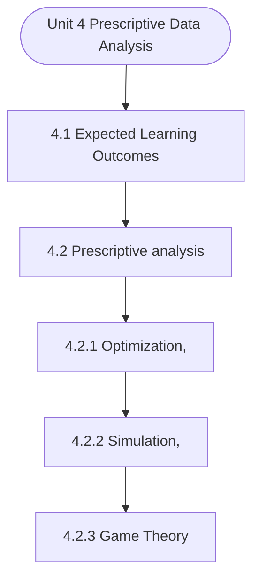

# MCS-068: Predictive Data Analysis
## Unit 4: Prescriptive Data Analysis

> 📚 **Programme:** M.Sc. (Data Science and Analytics) | **Semester:** Semester 2  
> ⏱️ **Estimated Study Time:** ~44 mins | 📄 **Textbook Pages:** 24 Pages  
> 📥 **Original PDF:** [Download & View Textbook](../../../pdfs/Semester_2/MCS-068_Predictive_Data_Analysis/Unit-4_Prescriptive_Data_Analysis.pdf)

---

### 🎯 Executive Concept & Data Science Relevance
In modern data systems, **Prescriptive Data Analysis** forms a vital conceptual pillar. Regression analysis estimates relationships between dependent targets and independent explanatory variables. Linear models, regularization penalties, and gradient updates form the computational core of supervised machine learning.

> [!NOTE]
> **Why this matters for your career:** Mastering prescriptive data analysis equips you with the foundational principles required to reason mathematically about high-dimensional datasets, evaluate algorithm performance, and avoid statistical pitfalls in production machine learning pipelines.

### 🗺️ Visual Knowledge Architecture
The following concept map illustrates the structural hierarchy and learning trajectory of this module:

### 📖 Core Definitions & Terminology Cards

> 📌 **Ordinary Least Squares (OLS)**  
> - **Formal Definition:** Estimation method that minimizes the sum of squared differences (residuals) between observed values and predictions: $\min_\beta \sum (y_i - \hat{y}_i)^2$.  
> - 💡 **Practical Intuition & Analogy:** *Finding the single line that minimizes total vertical squared distance to all data points.*

> 📌 **Coefficient of Determination ($R^2$)**  
> - **Formal Definition:** The proportion of variance in the dependent variable explained by independent features: $R^2 = 1 - \frac{SS_{\text{res}}}{SS_{\text{tot}}}$. Ranges from 0 to 1.  
> - 💡 **Practical Intuition & Analogy:** *An $R^2 = 0.85$ means 85% of target variability is captured by your model.*

> 📌 **Ridge Regularization ($L_2$)**  
> - **Formal Definition:** Adds squared magnitude penalty to the loss function: $\mathcal{L} + \lambda \sum_{j=1}^p \beta_j^2$. Shrinks weights toward zero to prevent overfitting under multicollinearity.  
> - 💡 **Practical Intuition & Analogy:** *Discourages extreme weight spikes without setting any coefficient entirely to zero.*

> 📌 **Lasso Regularization ($L_1$)**  
> - **Formal Definition:** Adds absolute magnitude penalty to the loss function: $\mathcal{L} + \lambda \sum_{j=1}^p \vert\beta_j\vert$. Drives non-essential coefficients exactly to zero, performing automated feature selection.  
> - 💡 **Practical Intuition & Analogy:** *Selects a sparse subset of impactful features by zeroing out noise variables.*

### ⚡ Governing Mathematical Laws & Formula Cheatsheet
#### 🔹 Simple Linear Regression OLS Parameters
$$
\begin{aligned} \hat{\beta}_1 & = \frac{\sum (x_i - \bar{x})(y_i - \bar{y})}{\sum (x_i - \bar{x})^2} = \frac{\text{Cov}(x, y)}{\text{Var}(x)} \\ \hat{\beta}_0 & = \bar{y} - \hat{\beta}_1 \bar{x} \end{aligned}
$$
- **Explanation:** Closed-form slope and intercept formulas for single-feature linear regression.

#### 🔹 Multiple Linear Regression Normal Equation
$$
\hat{\mathbf{\beta}} = (\mathbf{X}^T \mathbf{X})^{-1} \mathbf{X}^T \mathbf{y}
$$
- **Explanation:** Direct analytic matrix solution for OLS regression weights.

#### 🔹 Ridge Regression Closed-Form Estimator
$$
\hat{\mathbf{\beta}}_{\text{Ridge}} = (\mathbf{X}^T \mathbf{X} + \lambda \mathbf{I})^{-1} \mathbf{X}^T \mathbf{y}
$$
- **Explanation:** Adding $\lambda \mathbf{I}$ ensures invertibility even when $\mathbf{X}^T \mathbf{X}$ is ill-conditioned or collinear.

#### 🔹 Logistic Regression Sigmoid Function
$$
P(Y = 1 \mid X = \mathbf{x}) = \sigma(\mathbf{w}^T \mathbf{x} + b) = \frac{1}{1 + e^{-(\mathbf{w}^T \mathbf{x} + b)}}
$$
- **Explanation:** Maps any real-valued linear score into a calibrated probability interval $[0, 1]$.

### 📌 Detailed Section-by-Section Study Breakdown
#### `4.1` Expected Learning Outcomes
- **Core Concept:** Establishes theoretical foundations, axiomatic formulations, and properties of expected learning outcomes.
- **Core Concept:** Analyzes standard algorithmic workflows and mathematical transformations relevant to prescriptive data analysis.
- **Core Concept:** Applies computational bounds and optimization guarantees across data processing workflows.
- **Data Science Application:** Provides foundational structures used directly in statistical modeling, query execution, and machine learning pipelines.

> [!TIP]
> **Exam & Interview Tip:** Be prepared to state the formal definition of expected learning outcomes and derive its primary equations step-by-step.

#### `4.2` Prescriptive analysis
- **Core Concept:** Establishes theoretical foundations, axiomatic formulations, and properties of prescriptive analysis.
- **Core Concept:** Analyzes standard algorithmic workflows and mathematical transformations relevant to prescriptive data analysis.
- **Core Concept:** Applies computational bounds and optimization guarantees across data processing workflows.
- **Data Science Application:** Provides foundational structures used directly in statistical modeling, query execution, and machine learning pipelines.

> [!TIP]
> **Exam & Interview Tip:** Be prepared to state the formal definition of prescriptive analysis and derive its primary equations step-by-step.

#### `4.2.1` Optimization,
- **Core Concept:** Optimization is a fundamental concept in data science, operations research, and prescriptive analytics.
- **Core Concept:** In prescriptive analytics, optimization models analyse available data and recommend actions that maximize benefits or minimize costs under specific limitations such as resources, time, budget, or operational capacity.
- **Core Concept:** Optimization techniques are widely used in areas such as supply chain management, production planning, financial portfolio management, transportation systems, and scheduling problems.
- **Data Science Application:** Provides foundational structures used directly in statistical modeling, query execution, and machine learning pipelines.

> [!TIP]
> **Exam & Interview Tip:** Be prepared to state the formal definition of optimization, and derive its primary equations step-by-step.

#### `4.2.2` Simulation,
- **Core Concept:** Simulation is an important analytical technique used to model and analyse complex systems in order to understand their behaviour under different conditions.
- **Core Concept:** In many real-world situations, systems are affected by uncertainty, randomness, and dynamic interactions, making it difficult to predict outcomes using simple mathematical models.
- **Core Concept:** Simulation helps decision-makers evaluate the potential consequences of different decisions or scenarios without having to experiment directly in the real world.
- **Data Science Application:** Provides foundational structures used directly in statistical modeling, query execution, and machine learning pipelines.

> [!TIP]
> **Exam & Interview Tip:** Be prepared to state the formal definition of simulation, and derive its primary equations step-by-step.

#### `4.2.3` Game Theory
- **Core Concept:** Game Theory is a mathematical framework used to analyse situations in which the outcome of a decision depends not only on one participant’s actions but also on the actions of other participants.
- **Core Concept:** In many real-world environments such as markets, negotiations, and policy decisions, multiple decision-makers interact strategically, each trying to maximize their own benefit.
- **Core Concept:** Game theory provides tools to study such interactions and predict the possible outcomes of strategic behaviour.
- **Data Science Application:** Provides foundational structures used directly in statistical modeling, query execution, and machine learning pipelines.

> [!TIP]
> **Exam & Interview Tip:** Be prepared to state the formal definition of game theory and derive its primary equations step-by-step.

#### `4.2.4` Decision-Analysis methods
- **Core Concept:** Decision-analysis methods provide systematic approaches for evaluating and selecting among different alternatives, particularly in situations involving uncertainty, multiple Objectives, and incomplete information.
- **Core Concept:** In real-world decision-making, organizations often face complex problems where several possible actions exist, and each action may lead to different outcomes with varying probabilities and consequences.
- **Core Concept:** Decision analysis helps decision-makers examine these alternatives in a structured and logical manner.
- **Data Science Application:** Provides foundational structures used directly in statistical modeling, query execution, and machine learning pipelines.

> [!TIP]
> **Exam & Interview Tip:** Be prepared to state the formal definition of decision-analysis methods and derive its primary equations step-by-step.

### 💡 Interactive Self-Assessment Checkpoints
Test your comprehension before proceeding. Tap each question to reveal the comprehensive explanation:

<b>Checkpoint 1:</b> What is the key difference between Ridge ($L_2$) and Lasso ($L_1$) regression? <i>(Tap to reveal answer)</i>

> **Answer & Analysis:**  
> Ridge shrinks coefficients continuously toward zero without zeroing them out, whereas Lasso drives coefficients to exactly zero, producing sparse models and automated feature selection.

<b>Checkpoint 2:</b> What is the matrix Normal Equation for Ordinary Least Squares? <i>(Tap to reveal answer)</i>

> **Answer & Analysis:**  
> $\hat{\mathbf{\beta}} = (\mathbf{X}^T \mathbf{X})^{-1} \mathbf{X}^T \mathbf{y}$

<b>Checkpoint 3:</b> What does a high Variance Inflation Factor (VIF > 5) indicate? <i>(Tap to reveal answer)</i>

> **Answer & Analysis:**  
> Severe **multicollinearity**, meaning independent features are highly correlated with each other, destabilizing coefficient estimation.

<b>Checkpoint 4:</b> Explain the role of Prescriptive Data Analysis in the data analytics continuum. …………………………………………………………………………………………… …………………………………………………………………………………………… Q <i>(Tap to reveal answer)</i>

> **Answer & Analysis:**  
> This question tests your conceptual mastery of Prescriptive Data Analysis. Review the governing formulas and section breakdowns above to formulate a complete, rigorous proof or derivation.

<b>Checkpoint 5:</b> What is Prescriptive Data Analysis? How does it differ from Predictive Analysis? …………………………………………………………………………………………… …………………………………………………………………………………………… Q <i>(Tap to reveal answer)</i>

> **Answer & Analysis:**  
> This question tests your conceptual mastery of Prescriptive Data Analysis. Review the governing formulas and section breakdowns above to formulate a complete, rigorous proof or derivation.

<b>Checkpoint 6:</b> List and briefly explain the key methodologies used in Prescriptive Data Analysis. .…………………………………………………………………………………………… …………………………………………………………………………………………… <i>(Tap to reveal answer)</i>

> **Answer & Analysis:**  
> This question tests your conceptual mastery of Prescriptive Data Analysis. Review the governing formulas and section breakdowns above to formulate a complete, rigorous proof or derivation.

### 🎯 Executive Module Wrap-Up
- **Central Idea:** Prescriptive Data Analysis provides essential mathematical and algorithmic tools directly utilized in Data Science.
- **Mathematical Rigor:** Formulas and laws must be memorized with attention to boundary conditions and assumptions.
- **Full Textbook Coverage:** For exhaustive multi-page derivations, proofs, and supplementary exercises, consult the [Authentic IGNOU Textbook](../../../pdfs/Semester_2/MCS-068_Predictive_Data_Analysis/Unit-4_Prescriptive_Data_Analysis.pdf).

---
### 🧭 Navigation & Syllabus Index
[⬅ Previous: Unit 3](unit_03_Predictive_Data_Analysis.md) | [📑 Course Index](README.md) | [Next: Unit 5 ➡](unit_05_Mining_Big_Data.md)
