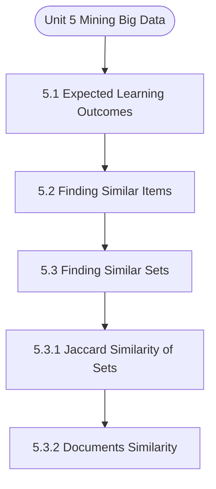

# MCS-068: Predictive Data Analysis
## Unit 5: Mining Big Data

> 📚 **Programme:** M.Sc. (Data Science and Analytics) | **Semester:** Semester 2  
> ⏱️ **Estimated Study Time:** ~41 mins | 📄 **Textbook Pages:** 18 Pages  
> 📥 **Original PDF:** [Download & View Authentic Textbook](../../../pdfs/Semester_2/MCS-068_Predictive_Data_Analysis/Unit-5_Mining_Big_Data.pdf)

---

### 🎯 Executive Concept & Data Science Relevance
In modern data systems, **Mining Big Data** forms a vital conceptual pillar. Regression analysis estimates relationships between dependent targets and independent explanatory variables. Linear models, regularization penalties, and gradient updates form the computational core of supervised machine learning.

> [!NOTE]
> **Why this matters for your career:** Mastering mining big data equips you with the foundational principles required to reason mathematically about high-dimensional datasets, evaluate algorithm performance, and avoid statistical pitfalls in production machine learning pipelines.

### 🗺️ Visual Knowledge Architecture
The following concept map illustrates the structural hierarchy and learning trajectory of this module:



### 📖 Core Definitions & Terminology Cards

> 📌 **Ordinary Least Squares (OLS)**  
> - **Formal Definition:** Estimation method that minimizes the sum of squared differences (residuals) between observed values and predictions: $\min_\beta \sum (y_i - \hat{y}_i)^2$.  
> - 💡 **Practical Intuition & Analogy:** *Finding the single line that minimizes total vertical squared distance to all data points.*

> 📌 **Coefficient of Determination ($R^2$)**  
> - **Formal Definition:** The proportion of variance in the dependent variable explained by independent features: $R^2 = 1 - \frac{SS_{\text{res}}}{SS_{\text{tot}}}$. Ranges from 0 to 1.  
> - 💡 **Practical Intuition & Analogy:** *An $R^2 = 0.85$ means 85% of target variability is captured by your model.*

> 📌 **Ridge Regularization ($L_2$)**  
> - **Formal Definition:** Adds squared magnitude penalty to the loss function: $\mathcal{L} + \lambda \sum_{j=1}^p \beta_j^2$. Shrinks weights toward zero to prevent overfitting under multicollinearity.  
> - 💡 **Practical Intuition & Analogy:** *Discourages extreme weight spikes without setting any coefficient entirely to zero.*

> 📌 **Lasso Regularization ($L_1$)**  
> - **Formal Definition:** Adds absolute magnitude penalty to the loss function: $\mathcal{L} + \lambda \sum_{j=1}^p \vert\beta_j\vert$. Drives non-essential coefficients exactly to zero, performing automated feature selection.  
> - 💡 **Practical Intuition & Analogy:** *Selects a sparse subset of impactful features by zeroing out noise variables.*

### ⚡ Governing Mathematical Laws & Formula Cheatsheet
#### 🔹 Simple Linear Regression OLS Parameters
$$
\begin{aligned} \hat{\beta}_1 & = \frac{\sum (x_i - \bar{x})(y_i - \bar{y})}{\sum (x_i - \bar{x})^2} = \frac{\text{Cov}(x, y)}{\text{Var}(x)} \\ \hat{\beta}_0 & = \bar{y} - \hat{\beta}_1 \bar{x} \end{aligned}
$$
- **Explanation:** Closed-form slope and intercept formulas for single-feature linear regression.

#### 🔹 Multiple Linear Regression Normal Equation
$$
\hat{\mathbf{\beta}} = (\mathbf{X}^T \mathbf{X})^{-1} \mathbf{X}^T \mathbf{y}
$$
- **Explanation:** Direct analytic matrix solution for OLS regression weights.

#### 🔹 Ridge Regression Closed-Form Estimator
$$
\hat{\mathbf{\beta}}_{\text{Ridge}} = (\mathbf{X}^T \mathbf{X} + \lambda \mathbf{I})^{-1} \mathbf{X}^T \mathbf{y}
$$
- **Explanation:** Adding $\lambda \mathbf{I}$ ensures invertibility even when $\mathbf{X}^T \mathbf{X}$ is ill-conditioned or collinear.

#### 🔹 Logistic Regression Sigmoid Function
$$
P(Y = 1 \mid X = \mathbf{x}) = \sigma(\mathbf{w}^T \mathbf{x} + b) = \frac{1}{1 + e^{-(\mathbf{w}^T \mathbf{x} + b)}}
$$
- **Explanation:** Maps any real-valued linear score into a calibrated probability interval $[0, 1]$.

### ⚖️ Axiomatic Properties & Governing Laws
The mathematical formulations of this module are anchored by foundational algebraic and structural laws:

- **Gauss-Markov Theorem:** Under standard OLS assumptions, the OLS estimator is BLUE (Best Linear Unbiased Estimator).
- **Orthogonality of Residuals:** $\mathbf{X}^T \mathbf{e} = \mathbf{0} \quad (\text{Residuals are orthogonal to feature space})$
- **Variance Inflation Factor (VIF):** $\text{VIF}_j = \frac{1}{1 - R_j^2} \quad (\text{VIF} > 5 \implies \text{Severe Multicollinearity})$

### 📌 Comprehensive Section-by-Section Study Breakdown
#### `5.1` Expected Learning Outcomes
##### 📘 Theoretical Principles & In-Depth Exposition
The section on **Expected Learning Outcomes** establishes rigorous theoretical foundations necessary for advanced computational modeling. It introduces formal mathematical structures and symbolic notations that guarantee consistency across proofs and algorithms.

In the broader scope of **Mining Big Data**, understanding expected learning outcomes is essential to formalizing data representations, verifying boundary constraints, and ensuring computational determinism across multidimensional feature spaces.

##### ⚙️ Mathematical & Algorithmic Mechanics
- **Formal Mechanics:** Establishes symbolic transformations and state invariants governing expected learning outcomes.
- **Boundary Invariants:** Ensures robust error-handling, non-empty set guarantees, and strict asymptotic bounds.

##### 📊 Practical Data Science & Production Relevance
- **Industry Application:** Directly implemented in production workflows such as SQL query filters, pandas vectorized operations, and feature transformation pipelines.
- **Production Pitfall:** Failing to verify membership bounds or missing edge cases in expected learning outcomes can cause silent data corruption or performance bottlenecks.

> [!TIP]
> **Key Exam & Technical Interview Takeaway:** Be prepared to define expected learning outcomes formally, cite its core mathematical invariants, and solve step-by-step numerical/proof questions.

#### `5.2` Finding Similar Items
##### 📘 Theoretical Principles & In-Depth Exposition
The section on **Finding Similar Items** establishes rigorous theoretical foundations necessary for advanced computational modeling. It introduces formal mathematical structures and symbolic notations that guarantee consistency across proofs and algorithms.

In the broader scope of **Mining Big Data**, understanding finding similar items is essential to formalizing data representations, verifying boundary constraints, and ensuring computational determinism across multidimensional feature spaces.

##### ⚙️ Mathematical & Algorithmic Mechanics
- **Formal Mechanics:** Establishes symbolic transformations and state invariants governing finding similar items.
- **Boundary Invariants:** Ensures robust error-handling, non-empty set guarantees, and strict asymptotic bounds.

##### 📊 Practical Data Science & Production Relevance
- **Industry Application:** Directly implemented in production workflows such as SQL query filters, pandas vectorized operations, and feature transformation pipelines.
- **Production Pitfall:** Failing to verify membership bounds or missing edge cases in finding similar items can cause silent data corruption or performance bottlenecks.

> [!TIP]
> **Key Exam & Technical Interview Takeaway:** Be prepared to define finding similar items formally, cite its core mathematical invariants, and solve step-by-step numerical/proof questions.

#### `5.3` Finding Similar Sets
##### 📘 Theoretical Principles & In-Depth Exposition
Finding document similarity is an interesting domain of use of Jaccard similarity. It can be used to identify a collection of almost similar documents, news items, web pages or reports. This is also referred to as the character- level similarity of documents. Another kind of document similarity also looks at documents having similar meanings.

This kind of similarity requires you to identify similar words and sometimes the meaning of the words. This is also a very useful similarity, but it can be solved using different types of techniques. How can you identify, if two documents are identical? This can be done simply by character-by-character matching.

However, this algorithm may be of little use as many documents may be mostly similar though not exactly. The following cases specify this situation: Plagiarism Checking: The plagiarized text may differ in small segments, as some portions of the document may have been changed or even the ordering of some of the sentences may be changed.

##### ⚙️ Mathematical & Algorithmic Mechanics
- **Formal Mechanics:** Establishes symbolic transformations and state invariants governing finding similar sets.
- **Boundary Invariants:** Ensures robust error-handling, non-empty set guarantees, and strict asymptotic bounds.

##### 📊 Practical Data Science & Production Relevance
- **Industry Application:** Directly implemented in production workflows such as SQL query filters, pandas vectorized operations, and feature transformation pipelines.
- **Production Pitfall:** Failing to verify membership bounds or missing edge cases in finding similar sets can cause silent data corruption or performance bottlenecks.

> [!TIP]
> **Key Exam & Technical Interview Takeaway:** Be prepared to define finding similar sets formally, cite its core mathematical invariants, and solve step-by-step numerical/proof questions.

#### `5.3.1` Jaccard Similarity of Sets
##### 📘 Theoretical Principles & In-Depth Exposition
The section on **Jaccard Similarity of Sets** establishes rigorous theoretical foundations necessary for advanced computational modeling. It introduces formal mathematical structures and symbolic notations that guarantee consistency across proofs and algorithms.

In the broader scope of **Mining Big Data**, understanding jaccard similarity of sets is essential to formalizing data representations, verifying boundary constraints, and ensuring computational determinism across multidimensional feature spaces.

##### ⚙️ Mathematical & Algorithmic Mechanics
- **Formal Mechanics:** Establishes symbolic transformations and state invariants governing jaccard similarity of sets.
- **Boundary Invariants:** Ensures robust error-handling, non-empty set guarantees, and strict asymptotic bounds.

##### 📊 Practical Data Science & Production Relevance
- **Industry Application:** Directly implemented in production workflows such as SQL query filters, pandas vectorized operations, and feature transformation pipelines.
- **Production Pitfall:** Failing to verify membership bounds or missing edge cases in jaccard similarity of sets can cause silent data corruption or performance bottlenecks.

> [!TIP]
> **Key Exam & Technical Interview Takeaway:** Be prepared to define jaccard similarity of sets formally, cite its core mathematical invariants, and solve step-by-step numerical/proof questions.

#### `5.3.2` Documents Similarity
##### 📘 Theoretical Principles & In-Depth Exposition
Finding document similarity is an interesting domain of use of Jaccard similarity. It can be used to identify a collection of almost similar documents, news items, web pages or reports. This is also referred to as the character- level similarity of documents. Another kind of document similarity also looks at documents having similar meanings.

This kind of similarity requires you to identify similar words and sometimes the meaning of the words. This is also a very useful similarity, but it can be solved using different types of techniques. How can you identify, if two documents are identical? This can be done simply by character-by-character matching.

However, this algorithm may be of little use as many documents may be mostly similar though not exactly. The following cases specify this situation: Plagiarism Checking: The plagiarized text may differ in small segments, as some portions of the document may have been changed or even the ordering of some of the sentences may be changed.

##### ⚙️ Mathematical & Algorithmic Mechanics
- **Formal Mechanics:** Establishes symbolic transformations and state invariants governing documents similarity.
- **Boundary Invariants:** Ensures robust error-handling, non-empty set guarantees, and strict asymptotic bounds.

##### 📊 Practical Data Science & Production Relevance
- **Industry Application:** Directly implemented in production workflows such as SQL query filters, pandas vectorized operations, and feature transformation pipelines.
- **Production Pitfall:** Failing to verify membership bounds or missing edge cases in documents similarity can cause silent data corruption or performance bottlenecks.

> [!TIP]
> **Key Exam & Technical Interview Takeaway:** Be prepared to define documents similarity formally, cite its core mathematical invariants, and solve step-by-step numerical/proof questions.

#### `5.3.3` Collaborative Filtering and Set Similarity
##### 📘 Theoretical Principles & In-Depth Exposition
In the past decade, e-commerce has gained acceptance by customers. Many of you, who have purchased and have liked various items on these e-commerce websites, get online recommendations for the purchase of certain items. You may have observed that many times those recommendations are very close to purchases that you would like to do in the near future.

This is achieved by the process of collaborative filtering, which tries to group you based on your purchases and likes with other users making similar purchases and likes and then recommending you the products that another person in the group has purchased and liked. Similarity of the sets is used to address this problem.

Two customers can be in a similar customer group if they purchase and like similar products. This similarity is determined by the Jaccard set similarity. However, please note that the number of customers, as well as the products that can be purchased on an e-commerce website, are very large.

##### ⚙️ Mathematical & Algorithmic Mechanics
- **Formal Mechanics:** Establishes symbolic transformations and state invariants governing collaborative filtering and set similarity.
- **Boundary Invariants:** Ensures robust error-handling, non-empty set guarantees, and strict asymptotic bounds.

##### 📊 Practical Data Science & Production Relevance
- **Industry Application:** Directly implemented in production workflows such as SQL query filters, pandas vectorized operations, and feature transformation pipelines.
- **Production Pitfall:** Failing to verify membership bounds or missing edge cases in collaborative filtering and set similarity can cause silent data corruption or performance bottlenecks.

> [!TIP]
> **Key Exam & Technical Interview Takeaway:** Be prepared to define collaborative filtering and set similarity formally, cite its core mathematical invariants, and solve step-by-step numerical/proof questions.

#### `5.4` Finding Similar Documents
##### 📘 Theoretical Principles & In-Depth Exposition
FINDING SIMILAR DOCUMENTS In the last section, we discussed the Jaccard similarity in the context of sets. We also explained the issues of document similarity. The document similarity can be checked using the following process: Step 1: Create Sets of items from the document (Shingles are used) Step 2: Perform Minhashing and create documents Signatures that can be tested for similarity checking.

This reduces the number of shingles to be tested for checking the similarity of two documents. Step 3: Perform Locality Sense Hashing produces pairs of documents that should be checked for similarity rather than all the possible pairs In this section, we discuss these three important concepts of document similarity analysis.

##### ⚙️ Mathematical & Algorithmic Mechanics
- **Formal Mechanics:** Establishes symbolic transformations and state invariants governing finding similar documents.
- **Boundary Invariants:** Ensures robust error-handling, non-empty set guarantees, and strict asymptotic bounds.

##### 📊 Practical Data Science & Production Relevance
- **Industry Application:** Directly implemented in production workflows such as SQL query filters, pandas vectorized operations, and feature transformation pipelines.
- **Production Pitfall:** Failing to verify membership bounds or missing edge cases in finding similar documents can cause silent data corruption or performance bottlenecks.

> [!TIP]
> **Key Exam & Technical Interview Takeaway:** Be prepared to define finding similar documents formally, cite its core mathematical invariants, and solve step-by-step numerical/proof questions.

#### `5.4.1` Shingles
##### 📘 Theoretical Principles & In-Depth Exposition
In order to define the term shingle, let us first try to answer the question: How to represent a document as a set of items so that you can find lexicographically similar documents? One way would be to identify words in the document. However, the identification of words itself is a time-consuming problem and would be more useful if you are trying to find the semantics of sentences.

One of the simplest and efficient ways would be to divide the document into smaller substrings of characters, say of size 3 to 7. The advantage of this division is that for almost common sentences many of these substrings would match despite small changes in those sentences or changes in the ordering of sentences.

Big Data Analysis A k-shingle is defined as any substring of the document of size k. A document has many shingles, which may occur at least once. For example, consider a document that consists of the following string: “bit-by-bit” Assuming the value of k=3 and even using a blank character as part of substrings.

##### ⚙️ Mathematical & Algorithmic Mechanics
- **Formal Mechanics:** Establishes symbolic transformations and state invariants governing shingles.
- **Boundary Invariants:** Ensures robust error-handling, non-empty set guarantees, and strict asymptotic bounds.

##### 📊 Practical Data Science & Production Relevance
- **Industry Application:** Directly implemented in production workflows such as SQL query filters, pandas vectorized operations, and feature transformation pipelines.
- **Production Pitfall:** Failing to verify membership bounds or missing edge cases in shingles can cause silent data corruption or performance bottlenecks.

> [!TIP]
> **Key Exam & Technical Interview Takeaway:** Be prepared to define shingles formally, cite its core mathematical invariants, and solve step-by-step numerical/proof questions.

### 📐 Step-by-Step Solved Mathematical Examples
To solidify your theoretical understanding, work through these fully solved, step-by-step mathematical problems:

#### 🧮 Example 1: Simple Linear Regression OLS Computation
> **Problem Statement:**  
> Given data points $(x, y)$: $(1, 2), (2, 3), (3, 5), (4, 4), (5, 6)$. Compute OLS slope $\hat{\beta}_1$, intercept $\hat{\beta}_0$, and regression line.

**Detailed Step-by-Step Solution:**

1. **Means:** $\bar{x} = 3.0, \; \bar{y} = 4.0$.
2. **Deviations & Products:**
- $(x_1 - \bar{x}) = -2, \; (y_1 - \bar{y}) = -2 \implies (-2)(-2) = 4, \; (-2)^2 = 4$
- $(x_2 - \bar{x}) = -1, \; (y_2 - \bar{y}) = -1 \implies (-1)(-1) = 1, \; (-1)^2 = 1$
- $(x_3 - \bar{x}) = 0, \; (y_3 - \bar{y}) = 1 \implies (0)(1) = 0, \; 0^2 = 0$
- $(x_4 - \bar{x}) = 1, \; (y_4 - \bar{y}) = 0 \implies (1)(0) = 0, \; 1^2 = 1$
- $(x_5 - \bar{x}) = 2, \; (y_5 - \bar{y}) = 2 \implies (2)(2) = 4, \; 2^2 = 4$

3. **Summation:** $\sum (x_i - \bar{x})(y_i - \bar{y}) = 9, \; \sum (x_i - \bar{x})^2 = 10$.

4. **Parameters:**
$$
\hat{\beta}_1 = \frac{9}{10} = 0.90
$$
$$
\hat{\beta}_0 = \bar{y} - \hat{\beta}_1 \bar{x} = 4.0 - 0.9(3.0) = 4.0 - 2.7 = 1.30
$$

Regression Equation: $\hat{y} = 1.30 + 0.90 x$.

#### 🧮 Example 2: Coefficient of Determination $R^2$ Calculation
> **Problem Statement:**  
> For the model above, total sum of squares $SS_{\text{tot}} = 10.0$ and sum of squared residuals $SS_{\text{res}} = 1.90$. Calculate $R^2$ and interpret.

**Detailed Step-by-Step Solution:**

$$
R^2 = 1 - \frac{SS_{\text{res}}}{SS_{\text{tot}}} = 1 - \frac{1.90}{10.0} = 1 - 0.19 = 0.81 \implies 81\%
$$

Interpretation: 81% of the variation in target $y$ is explained by feature $x$.

### 💻 Practical Data Science Implementation (Python)
Theory translates directly into production algorithms. Below is a self-contained, commented Python implementation illustrating the core operations of this unit:

```python
from sklearn.linear_model import LinearRegression, Ridge, Lasso
import numpy as np

# Dataset with multicollinearity
X = np.array([[1, 2], [2, 4.1], [3, 5.9], [4, 8.2], [5, 9.9]])
y = np.array([2.2, 4.1, 6.2, 7.9, 10.1])

# 1. Standard OLS
ols = LinearRegression().fit(X, y)
print("OLS Coefficients:", ols.coef_)

# 2. Ridge (L2 penalty shrinks weights smoothly)
ridge = Ridge(alpha=1.0).fit(X, y)
print("Ridge Coefficients:", ridge.coef_)

# 3. Lasso (L1 penalty induces sparsity)
lasso = Lasso(alpha=0.1).fit(X, y)
print("Lasso Coefficients (Sparse):", lasso.coef_)
```

### 💡 Interactive Self-Assessment Checkpoints
Test your comprehension before proceeding. Tap each question to reveal the comprehensive explanation:

<details>
<summary><b>Checkpoint 1:</b> What is the key difference between Ridge ($L_2$) and Lasso ($L_1$) regression? <i>(Tap to reveal answer)</i></summary>

> **Answer & Analysis:**  
> Ridge shrinks coefficients continuously toward zero without zeroing them out, whereas Lasso drives coefficients to exactly zero, producing sparse models and automated feature selection.
</details>

<details>
<summary><b>Checkpoint 2:</b> What is the matrix Normal Equation for Ordinary Least Squares? <i>(Tap to reveal answer)</i></summary>

> **Answer & Analysis:**  
> $\hat{\mathbf{\beta}} = (\mathbf{X}^T \mathbf{X})^{-1} \mathbf{X}^T \mathbf{y}$
</details>

<details>
<summary><b>Checkpoint 3:</b> What does a high Variance Inflation Factor (VIF > 5) indicate? <i>(Tap to reveal answer)</i></summary>

> **Answer & Analysis:**  
> Severe **multicollinearity**, meaning independent features are highly correlated with each other, destabilizing coefficient estimation.
</details>

<details>
<summary><b>Checkpoint 4:</b> What is the purpose of a distance measure? What are the characteristics of distance measures? <i>(Tap to reveal answer)</i></summary>

> **Answer & Analysis:**  
> This question tests your conceptual mastery of Mining Big Data. Review the governing formulas and section breakdowns above to formulate a complete, rigorous proof or derivation.
</details>

<details>
<summary><b>Checkpoint 5:</b> What is the Cosine distance measure? How is it different from Hamming's distance? <i>(Tap to reveal answer)</i></summary>

> **Answer & Analysis:**  
> This question tests your conceptual mastery of Mining Big Data. Review the governing formulas and section breakdowns above to formulate a complete, rigorous proof or derivation.
</details>

<details>
<summary><b>Checkpoint 6:</b> Explain the purpose of text analysis. <i>(Tap to reveal answer)</i></summary>

> **Answer & Analysis:**  
> This question tests your conceptual mastery of Mining Big Data. Review the governing formulas and section breakdowns above to formulate a complete, rigorous proof or derivation.
</details>

### 🎯 Executive Module Wrap-Up
- **Central Idea:** Mining Big Data provides essential mathematical and algorithmic tools directly utilized in Data Science.
- **Mathematical Rigor:** Formulas and laws must be memorized with attention to boundary conditions and assumptions.
- **Full Textbook Coverage:** For exhaustive multi-page derivations, proofs, and supplementary exercises, consult the [Authentic IGNOU Textbook](../../../pdfs/Semester_2/MCS-068_Predictive_Data_Analysis/Unit-5_Mining_Big_Data.pdf).

---
### 🧭 Navigation & Syllabus Index
[⬅ Previous: Unit 4](unit_04_Prescriptive_Data_Analysis.md) | [📑 Course Index](README.md) | [Next: Unit 6 ➡](unit_06_Outlier_Detection.md)
