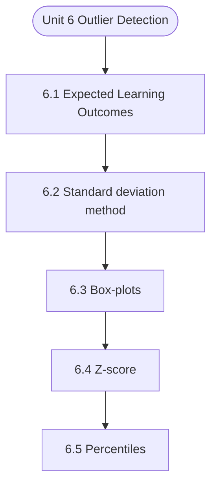

# MCS-068: Predictive Data Analysis
## Unit 6: Outlier Detection

> 📚 **Programme:** M.Sc. (Data Science and Analytics) | **Semester:** Semester 2  
> ⏱️ **Estimated Study Time:** ~67 mins | 📄 **Textbook Pages:** 38 Pages  
> 📥 **Original PDF:** [Download & View Authentic Textbook](../../../pdfs/Semester_2/MCS-068_Predictive_Data_Analysis/Unit-6_Outlier_Detection.pdf)

---

### 🎯 Executive Concept & Data Science Relevance
In modern data systems, **Outlier Detection** forms a vital conceptual pillar. Regression analysis estimates relationships between dependent targets and independent explanatory variables. Linear models, regularization penalties, and gradient updates form the computational core of supervised machine learning.

> [!NOTE]
> **Why this matters for your career:** Mastering outlier detection equips you with the foundational principles required to reason mathematically about high-dimensional datasets, evaluate algorithm performance, and avoid statistical pitfalls in production machine learning pipelines.

### 🗺️ Visual Knowledge Architecture
The following concept map illustrates the structural hierarchy and learning trajectory of this module:



### 📖 Core Definitions & Terminology Cards

> 📌 **Ordinary Least Squares (OLS)**  
> - **Formal Definition:** Estimation method that minimizes the sum of squared differences (residuals) between observed values and predictions: $\min_\beta \sum (y_i - \hat{y}_i)^2$.  
> - 💡 **Practical Intuition & Analogy:** *Finding the single line that minimizes total vertical squared distance to all data points.*

> 📌 **Coefficient of Determination ($R^2$)**  
> - **Formal Definition:** The proportion of variance in the dependent variable explained by independent features: $R^2 = 1 - \frac{SS_{\text{res}}}{SS_{\text{tot}}}$. Ranges from 0 to 1.  
> - 💡 **Practical Intuition & Analogy:** *An $R^2 = 0.85$ means 85% of target variability is captured by your model.*

> 📌 **Ridge Regularization ($L_2$)**  
> - **Formal Definition:** Adds squared magnitude penalty to the loss function: $\mathcal{L} + \lambda \sum_{j=1}^p \beta_j^2$. Shrinks weights toward zero to prevent overfitting under multicollinearity.  
> - 💡 **Practical Intuition & Analogy:** *Discourages extreme weight spikes without setting any coefficient entirely to zero.*

> 📌 **Lasso Regularization ($L_1$)**  
> - **Formal Definition:** Adds absolute magnitude penalty to the loss function: $\mathcal{L} + \lambda \sum_{j=1}^p \vert\beta_j\vert$. Drives non-essential coefficients exactly to zero, performing automated feature selection.  
> - 💡 **Practical Intuition & Analogy:** *Selects a sparse subset of impactful features by zeroing out noise variables.*

### ⚡ Governing Mathematical Laws & Formula Cheatsheet
#### 🔹 Simple Linear Regression OLS Parameters
$$
\begin{aligned} \hat{\beta}_1 & = \frac{\sum (x_i - \bar{x})(y_i - \bar{y})}{\sum (x_i - \bar{x})^2} = \frac{\text{Cov}(x, y)}{\text{Var}(x)} \\ \hat{\beta}_0 & = \bar{y} - \hat{\beta}_1 \bar{x} \end{aligned}
$$
- **Explanation:** Closed-form slope and intercept formulas for single-feature linear regression.

#### 🔹 Multiple Linear Regression Normal Equation
$$
\hat{\mathbf{\beta}} = (\mathbf{X}^T \mathbf{X})^{-1} \mathbf{X}^T \mathbf{y}
$$
- **Explanation:** Direct analytic matrix solution for OLS regression weights.

#### 🔹 Ridge Regression Closed-Form Estimator
$$
\hat{\mathbf{\beta}}_{\text{Ridge}} = (\mathbf{X}^T \mathbf{X} + \lambda \mathbf{I})^{-1} \mathbf{X}^T \mathbf{y}
$$
- **Explanation:** Adding $\lambda \mathbf{I}$ ensures invertibility even when $\mathbf{X}^T \mathbf{X}$ is ill-conditioned or collinear.

#### 🔹 Logistic Regression Sigmoid Function
$$
P(Y = 1 \mid X = \mathbf{x}) = \sigma(\mathbf{w}^T \mathbf{x} + b) = \frac{1}{1 + e^{-(\mathbf{w}^T \mathbf{x} + b)}}
$$
- **Explanation:** Maps any real-valued linear score into a calibrated probability interval $[0, 1]$.

### ⚖️ Axiomatic Properties & Governing Laws
The mathematical formulations of this module are anchored by foundational algebraic and structural laws:

- **Gauss-Markov Theorem:** Under standard OLS assumptions, the OLS estimator is BLUE (Best Linear Unbiased Estimator).
- **Orthogonality of Residuals:** $\mathbf{X}^T \mathbf{e} = \mathbf{0} \quad (\text{Residuals are orthogonal to feature space})$
- **Variance Inflation Factor (VIF):** $\text{VIF}_j = \frac{1}{1 - R_j^2} \quad (\text{VIF} > 5 \implies \text{Severe Multicollinearity})$

### 📌 Comprehensive Section-by-Section Study Breakdown
#### `6.1` Expected Learning Outcomes
##### 📘 Theoretical Principles & In-Depth Exposition
The section on **Expected Learning Outcomes** establishes rigorous theoretical foundations necessary for advanced computational modeling. It introduces formal mathematical structures and symbolic notations that guarantee consistency across proofs and algorithms.

In the broader scope of **Outlier Detection**, understanding expected learning outcomes is essential to formalizing data representations, verifying boundary constraints, and ensuring computational determinism across multidimensional feature spaces.

##### ⚙️ Mathematical & Algorithmic Mechanics
- **Formal Mechanics:** Establishes symbolic transformations and state invariants governing expected learning outcomes.
- **Boundary Invariants:** Ensures robust error-handling, non-empty set guarantees, and strict asymptotic bounds.

##### 📊 Practical Data Science & Production Relevance
- **Industry Application:** Directly implemented in production workflows such as SQL query filters, pandas vectorized operations, and feature transformation pipelines.
- **Production Pitfall:** Failing to verify membership bounds or missing edge cases in expected learning outcomes can cause silent data corruption or performance bottlenecks.

> [!TIP]
> **Key Exam & Technical Interview Takeaway:** Be prepared to define expected learning outcomes formally, cite its core mathematical invariants, and solve step-by-step numerical/proof questions.

#### `6.2` Standard deviation method
##### 📘 Theoretical Principles & In-Depth Exposition
The section on **Standard deviation method** establishes rigorous theoretical foundations necessary for advanced computational modeling. It introduces formal mathematical structures and symbolic notations that guarantee consistency across proofs and algorithms.

In the broader scope of **Outlier Detection**, understanding standard deviation method is essential to formalizing data representations, verifying boundary constraints, and ensuring computational determinism across multidimensional feature spaces.

##### ⚙️ Mathematical & Algorithmic Mechanics
- **Formal Mechanics:** Establishes symbolic transformations and state invariants governing standard deviation method.
- **Boundary Invariants:** Ensures robust error-handling, non-empty set guarantees, and strict asymptotic bounds.

##### 📊 Practical Data Science & Production Relevance
- **Industry Application:** Directly implemented in production workflows such as SQL query filters, pandas vectorized operations, and feature transformation pipelines.
- **Production Pitfall:** Failing to verify membership bounds or missing edge cases in standard deviation method can cause silent data corruption or performance bottlenecks.

> [!TIP]
> **Key Exam & Technical Interview Takeaway:** Be prepared to define standard deviation method formally, cite its core mathematical invariants, and solve step-by-step numerical/proof questions.

#### `6.3` Box-plots
##### 📘 Theoretical Principles & In-Depth Exposition
We learned about the role of standard deviation in outlier detection, in the section 6.2 above. Here in this section 6.3, we are going to discuss the next important characteristic for outlier detection i.e. The Z-score (or standard score) is a statistical measure that indicates how far a data point lies from the mean in terms of standard deviations.

It standardizes data, allowing us to compare observations across different scales. In outlier detection, the Z-score is especially useful because it provides a clear numerical measure of extremeness—helping identify values that deviate significantly from the norm. Z-score, represents a standardized value that indicates how many standard deviations a particular data point is away from the mean of a dataset.

The Z-score is essentially a normalized form of deviation that expresses distance from the mean in units of standard deviation. This relationship makes it a powerful tool in predictive data analysis, especially for detecting outliers, comparing datasets, and standardizing variables for further modeling.

##### ⚙️ Mathematical & Algorithmic Mechanics
- **Formal Mechanics:** Establishes symbolic transformations and state invariants governing box-plots.
- **Boundary Invariants:** Ensures robust error-handling, non-empty set guarantees, and strict asymptotic bounds.

##### 📊 Practical Data Science & Production Relevance
- **Industry Application:** Directly implemented in production workflows such as SQL query filters, pandas vectorized operations, and feature transformation pipelines.
- **Production Pitfall:** Failing to verify membership bounds or missing edge cases in box-plots can cause silent data corruption or performance bottlenecks.

> [!TIP]
> **Key Exam & Technical Interview Takeaway:** Be prepared to define box-plots formally, cite its core mathematical invariants, and solve step-by-step numerical/proof questions.

#### `6.4` Z-score
##### 📘 Theoretical Principles & In-Depth Exposition
Quantiles are positional measures that divide a dataset into equal parts and provide a deeper understanding of the distribution of data. Unlike measures such as mean, quantiles focus on the relative position of observations, making them highly useful in identifying the spread, concentration, and presence of extreme values (outliers).

The most commonly used quantiles are quartiles, deciles, and percentiles. In this section we are going to discuss these Quantiles with their relevance to Outlier detection. Outlier detection is an important aspect of data analysis as extreme values can significantly distort results and lead to incorrect interpretations.

In this context, positional measures such as quantiles, percentiles, deciles, and median play a crucial role because they are based on the relative position of data rather than its magnitude. This makes them robust and less sensitive to extreme values, unlike the arithmetic mean.

##### ⚙️ Mathematical & Algorithmic Mechanics
- **Formal Mechanics:** Establishes symbolic transformations and state invariants governing z-score.
- **Boundary Invariants:** Ensures robust error-handling, non-empty set guarantees, and strict asymptotic bounds.

##### 📊 Practical Data Science & Production Relevance
- **Industry Application:** Directly implemented in production workflows such as SQL query filters, pandas vectorized operations, and feature transformation pipelines.
- **Production Pitfall:** Failing to verify membership bounds or missing edge cases in z-score can cause silent data corruption or performance bottlenecks.

> [!TIP]
> **Key Exam & Technical Interview Takeaway:** Be prepared to define z-score formally, cite its core mathematical invariants, and solve step-by-step numerical/proof questions.

#### `6.5` Percentiles
##### 📘 Theoretical Principles & In-Depth Exposition
The Box plots are widely used for outlier detection, skewness analysis, and spread visualization. Actually, Box Plot (or Box-and-Whisker Plot) is a graphical representation of data distribution that summarizes a dataset using five key statistics given below: ● Minimum ● First Quartile (Q1) ● Median (Q2) ● Third Quartile (Q3) ● Maximum To construct a box plot, we first compute: 1.

Q1 (25th percentile) 3. Q3 (75th percentile) 5. Maximum value Then calculate: 𝐼𝑄𝑅= 𝑄3 −𝑄1 Outlier Detection Rule 𝐿𝑜𝑤𝑒𝑟 𝐵𝑜𝑢𝑛𝑑= 𝑄1 −1.5 × 𝐼𝑄𝑅𝑈𝑝𝑝𝑒𝑟 𝐵𝑜𝑢𝑛𝑑= 𝑄3 + 1.5 × 𝐼𝑄𝑅 ● Values outside these bounds are referred as Outliers ● Values within bounds are referred as Normal data We already learned the calculation of these statistical parameters in the section 6.4 , given above.

Now let’s discuss the Steps to Create a Box Plot : 1. Arrange data in ascending order 2. Identify outliers using bounds 6. Draw: o A box from Q1 to Q3 o A line inside box at median o Whiskers to min & max (excluding outliers) o Plot outliers as separate points Example: Draw Box Plot for the Data: 5, 7, 8, 9, 10, 12, 13, 15, 18, 22, 50 Solution: Step 1: Calculate Median (Q2) : Total observations = 11 𝑄2 = 6௧௛ 𝑣𝑎𝑙𝑢𝑒= 12 Step 2: Q1 (Median of lower half) : Lower half: 5, 7, 8, 9, 10 𝑄1 = 8 Step 3: Q3 (Median of upper half) : Upper half: 13, 15, 18, 22, 50 𝑄3 = 18 Step 4: IQR: = 𝑄3 −𝑄1 = 18 −8 = 10 Step 5: Outlier Bounds 𝐿𝑜𝑤𝑒𝑟 𝐵𝑜𝑢𝑛𝑑= 8 −1.5(10) = 8 −15 = −7𝑈𝑝𝑝𝑒𝑟 𝐵𝑜𝑢𝑛𝑑= 18 + 1.5(10) = 18 + 15 = 33 Step 6: Identify Outliers ● Data values > 33 i.e.

##### ⚙️ Mathematical & Algorithmic Mechanics
- **Formal Mechanics:** Establishes symbolic transformations and state invariants governing percentiles.
- **Boundary Invariants:** Ensures robust error-handling, non-empty set guarantees, and strict asymptotic bounds.

##### 📊 Practical Data Science & Production Relevance
- **Industry Application:** Directly implemented in production workflows such as SQL query filters, pandas vectorized operations, and feature transformation pipelines.
- **Production Pitfall:** Failing to verify membership bounds or missing edge cases in percentiles can cause silent data corruption or performance bottlenecks.

> [!TIP]
> **Key Exam & Technical Interview Takeaway:** Be prepared to define percentiles formally, cite its core mathematical invariants, and solve step-by-step numerical/proof questions.

#### `6.6` DBSCAN
##### 📘 Theoretical Principles & In-Depth Exposition
DBSCAN stands for Density-Based Spatial Clustering of Applications with Noise. It is a density-based clustering algorithm used to identify groups of closely packed data points and, at the same time, detect points that do not belong to any dense region. These isolated points are treated as outliers or noise.

DBSCAN is especially useful when the data contains irregularly shaped clusters and when outlier detection is an important objective. Unlike partition-based methods such as K-means, DBSCAN does not require the number of clusters to be specified in advance. Instead, it uses two parameters, namely Eps and MinPts, to determine whether a region is dense enough to form a cluster.

Because of this density-based logic, DBSCAN is widely used in anomaly detection, fraud analysis, geographic data analysis, image processing, and spatial mining. The main idea of DBSCAN is simple: if a point lies in a sufficiently dense neighbourhood, then it belongs to a cluster.

##### ⚙️ Mathematical & Algorithmic Mechanics
- **Formal Mechanics:** Establishes symbolic transformations and state invariants governing dbscan.
- **Boundary Invariants:** Ensures robust error-handling, non-empty set guarantees, and strict asymptotic bounds.

##### 📊 Practical Data Science & Production Relevance
- **Industry Application:** Directly implemented in production workflows such as SQL query filters, pandas vectorized operations, and feature transformation pipelines.
- **Production Pitfall:** Failing to verify membership bounds or missing edge cases in dbscan can cause silent data corruption or performance bottlenecks.

> [!TIP]
> **Key Exam & Technical Interview Takeaway:** Be prepared to define dbscan formally, cite its core mathematical invariants, and solve step-by-step numerical/proof questions.

#### `6.7` Local Outlier factor
##### 📘 Theoretical Principles & In-Depth Exposition
6.7 LOCAL OUTLIER FACTOR The Local Outlier Factor (LOF) is a powerful density-based technique used in anomaly detection to identify observations that deviate significantly from their local neighbourhood. Unlike traditional global outlier detection methods, which evaluate a data point against the entire dataset, LOF focuses on the local structure of the data.

This makes it particularly useful in real-world datasets where data is not uniformly distributed, and different regions exhibit varying densities. The fundamental idea behind LOF is intuitive yet mathematically grounded, where a data point is considered an outlier if its local density is substantially lower than that of its surrounding neighbours.

In other words, LOF does not simply label points far from the centre as anomalies; instead, it detects points that are isolated relative to their immediate context. For instance, a point in a sparse region may not be an outlier if its neighbours are equally sparse, whereas a point in a dense cluster that is relatively isolated from nearby points would be flagged as anomalous.

##### ⚙️ Mathematical & Algorithmic Mechanics
- **Formal Mechanics:** Establishes symbolic transformations and state invariants governing local outlier factor.
- **Boundary Invariants:** Ensures robust error-handling, non-empty set guarantees, and strict asymptotic bounds.

##### 📊 Practical Data Science & Production Relevance
- **Industry Application:** Directly implemented in production workflows such as SQL query filters, pandas vectorized operations, and feature transformation pipelines.
- **Production Pitfall:** Failing to verify membership bounds or missing edge cases in local outlier factor can cause silent data corruption or performance bottlenecks.

> [!TIP]
> **Key Exam & Technical Interview Takeaway:** Be prepared to define local outlier factor formally, cite its core mathematical invariants, and solve step-by-step numerical/proof questions.

### 📐 Step-by-Step Solved Mathematical Examples
To solidify your theoretical understanding, work through these fully solved, step-by-step mathematical problems:

#### 🧮 Example 1: Simple Linear Regression OLS Computation
> **Problem Statement:**  
> Given data points $(x, y)$: $(1, 2), (2, 3), (3, 5), (4, 4), (5, 6)$. Compute OLS slope $\hat{\beta}_1$, intercept $\hat{\beta}_0$, and regression line.

**Detailed Step-by-Step Solution:**

1. **Means:** $\bar{x} = 3.0, \; \bar{y} = 4.0$.
2. **Deviations & Products:**
- $(x_1 - \bar{x}) = -2, \; (y_1 - \bar{y}) = -2 \implies (-2)(-2) = 4, \; (-2)^2 = 4$
- $(x_2 - \bar{x}) = -1, \; (y_2 - \bar{y}) = -1 \implies (-1)(-1) = 1, \; (-1)^2 = 1$
- $(x_3 - \bar{x}) = 0, \; (y_3 - \bar{y}) = 1 \implies (0)(1) = 0, \; 0^2 = 0$
- $(x_4 - \bar{x}) = 1, \; (y_4 - \bar{y}) = 0 \implies (1)(0) = 0, \; 1^2 = 1$
- $(x_5 - \bar{x}) = 2, \; (y_5 - \bar{y}) = 2 \implies (2)(2) = 4, \; 2^2 = 4$

3. **Summation:** $\sum (x_i - \bar{x})(y_i - \bar{y}) = 9, \; \sum (x_i - \bar{x})^2 = 10$.

4. **Parameters:**
$$
\hat{\beta}_1 = \frac{9}{10} = 0.90
$$
$$
\hat{\beta}_0 = \bar{y} - \hat{\beta}_1 \bar{x} = 4.0 - 0.9(3.0) = 4.0 - 2.7 = 1.30
$$

Regression Equation: $\hat{y} = 1.30 + 0.90 x$.

#### 🧮 Example 2: Coefficient of Determination $R^2$ Calculation
> **Problem Statement:**  
> For the model above, total sum of squares $SS_{\text{tot}} = 10.0$ and sum of squared residuals $SS_{\text{res}} = 1.90$. Calculate $R^2$ and interpret.

**Detailed Step-by-Step Solution:**

$$
R^2 = 1 - \frac{SS_{\text{res}}}{SS_{\text{tot}}} = 1 - \frac{1.90}{10.0} = 1 - 0.19 = 0.81 \implies 81\%
$$

Interpretation: 81% of the variation in target $y$ is explained by feature $x$.

### 💻 Practical Data Science Implementation (Python)
Theory translates directly into production algorithms. Below is a self-contained, commented Python implementation illustrating the core operations of this unit:

```python
from sklearn.linear_model import LinearRegression, Ridge, Lasso
import numpy as np

# Dataset with multicollinearity
X = np.array([[1, 2], [2, 4.1], [3, 5.9], [4, 8.2], [5, 9.9]])
y = np.array([2.2, 4.1, 6.2, 7.9, 10.1])

# 1. Standard OLS
ols = LinearRegression().fit(X, y)
print("OLS Coefficients:", ols.coef_)

# 2. Ridge (L2 penalty shrinks weights smoothly)
ridge = Ridge(alpha=1.0).fit(X, y)
print("Ridge Coefficients:", ridge.coef_)

# 3. Lasso (L1 penalty induces sparsity)
lasso = Lasso(alpha=0.1).fit(X, y)
print("Lasso Coefficients (Sparse):", lasso.coef_)
```

### 💡 Interactive Self-Assessment Checkpoints
Test your comprehension before proceeding. Tap each question to reveal the comprehensive explanation:

<details>
<summary><b>Checkpoint 1:</b> What is the key difference between Ridge ($L_2$) and Lasso ($L_1$) regression? <i>(Tap to reveal answer)</i></summary>

> **Answer & Analysis:**  
> Ridge shrinks coefficients continuously toward zero without zeroing them out, whereas Lasso drives coefficients to exactly zero, producing sparse models and automated feature selection.
</details>

<details>
<summary><b>Checkpoint 2:</b> What is the matrix Normal Equation for Ordinary Least Squares? <i>(Tap to reveal answer)</i></summary>

> **Answer & Analysis:**  
> $\hat{\mathbf{\beta}} = (\mathbf{X}^T \mathbf{X})^{-1} \mathbf{X}^T \mathbf{y}$
</details>

<details>
<summary><b>Checkpoint 3:</b> What does a high Variance Inflation Factor (VIF > 5) indicate? <i>(Tap to reveal answer)</i></summary>

> **Answer & Analysis:**  
> Severe **multicollinearity**, meaning independent features are highly correlated with each other, destabilizing coefficient estimation.
</details>

<details>
<summary><b>Checkpoint 4:</b> What are outliers? Explain their significance in predictive data analysis. …………………………………………………………………………………………… <i>(Tap to reveal answer)</i></summary>

> **Answer & Analysis:**  
> This question tests your conceptual mastery of Outlier Detection. Review the governing formulas and section breakdowns above to formulate a complete, rigorous proof or derivation.
</details>

<details>
<summary><b>Checkpoint 5:</b> Explain the Standard Deviation method for detecting outliers. …………………………………………………………………………………………… …………………………………………………………………………………………… Q <i>(Tap to reveal answer)</i></summary>

> **Answer & Analysis:**  
> This question tests your conceptual mastery of Outlier Detection. Review the governing formulas and section breakdowns above to formulate a complete, rigorous proof or derivation.
</details>

<details>
<summary><b>Checkpoint 6:</b> Define Z-score and explain its role in outlier detection. .…………………………………………………………………………………………… …………………………………………………………………………………………… Q <i>(Tap to reveal answer)</i></summary>

> **Answer & Analysis:**  
> This question tests your conceptual mastery of Outlier Detection. Review the governing formulas and section breakdowns above to formulate a complete, rigorous proof or derivation.
</details>

### 🎯 Executive Module Wrap-Up
- **Central Idea:** Outlier Detection provides essential mathematical and algorithmic tools directly utilized in Data Science.
- **Mathematical Rigor:** Formulas and laws must be memorized with attention to boundary conditions and assumptions.
- **Full Textbook Coverage:** For exhaustive multi-page derivations, proofs, and supplementary exercises, consult the [Authentic IGNOU Textbook](../../../pdfs/Semester_2/MCS-068_Predictive_Data_Analysis/Unit-6_Outlier_Detection.pdf).

---
### 🧭 Navigation & Syllabus Index
[⬅ Previous: Unit 5](unit_05_Mining_Big_Data.md) | [📑 Course Index](README.md) | [Next: Unit 7 ➡](unit_07_Predictive_Analytics_Models.md)
