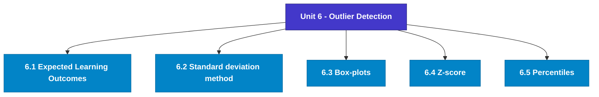

# MCS-068: Predictive Data Analysis
## Unit 6: Outlier Detection

> 📚 **Programme:** M.Sc. (Data Science and Analytics) | **Semester:** Semester 2  
> ⏱️ **Estimated Study Time:** ~67 mins | 📄 **Textbook Pages:** 38 Pages  
> 📥 **Original PDF:** [Download & View Textbook](../../../pdfs/Semester_2/MCS-068_Predictive_Data_Analysis/Unit-6_Outlier_Detection.pdf)

---

### 🎯 Executive Concept & Data Science Relevance
In modern data systems, **Outlier Detection** forms a vital conceptual pillar. Regression analysis estimates relationships between dependent targets and independent explanatory variables. Linear models, regularization penalties, and gradient updates form the computational core of supervised machine learning.

> [!NOTE]
> **Why this matters for your career:** Mastering outlier detection equips you with the foundational principles required to reason mathematically about high-dimensional datasets, evaluate algorithm performance, and avoid statistical pitfalls in production machine learning pipelines.

### 🗺️ Visual Knowledge Architecture
The following concept map illustrates the structural hierarchy and learning trajectory of this module:

### 📖 Core Definitions & Terminology Cards
| Term | Formal Mathematical / Technical Definition | Intuitive Analogy / Concrete Example |
| :--- | :--- | :--- |
| **Ordinary Least Squares (OLS)** | Estimation method that minimizes the sum of squared differences (residuals) between observed values and predictions: $\min_\beta \sum (y_i - \hat{y}_i)^2$. | *Finding the single line that minimizes total vertical squared distance to all data points.* |
| **Coefficient of Determination ($R^2$)** | The proportion of variance in the dependent variable explained by independent features: $R^2 = 1 - \frac{SS_{\text{res}}}{SS_{\text{tot}}}$. Ranges from 0 to 1. | *An $R^2 = 0.85$ means 85% of target variability is captured by your model.* |
| **Ridge Regularization ($L_2$)** | Adds squared magnitude penalty to the loss function: $\mathcal{L} + \lambda \sum_{j=1}^p \beta_j^2$. Shrinks weights toward zero to prevent overfitting under multicollinearity. | *Discourages extreme weight spikes without setting any coefficient entirely to zero.* |
| **Lasso Regularization ($L_1$)** | Adds absolute magnitude penalty to the loss function: $\mathcal{L} + \lambda \sum_{j=1}^p \vert\beta_j\vert$. Drives non-essential coefficients exactly to zero, performing automated feature selection. | *Selects a sparse subset of impactful features by zeroing out noise variables.* |

### ⚡ Governing Mathematical Laws & Formula Cheatsheet
#### 🔹 Simple Linear Regression OLS Parameters

$$
\hat{\beta}_1 = \frac{\sum (x_i - \bar{x})(y_i - \bar{y})}{\sum (x_i - \bar{x})^2} = \frac{\text{Cov}(x, y)}{\text{Var}(x)}, \quad \hat{\beta}_0 = \bar{y} - \hat{\beta}_1 \bar{x}
$$

- **Explanation:** Closed-form slope and intercept formulas for single-feature linear regression.

#### 🔹 Multiple Linear Regression Normal Equation

$$
\hat{\mathbf{\beta}} = (\mathbf{X}^T \mathbf{X})^{-1} \mathbf{X}^T \mathbf{y}
$$

- **Explanation:** Direct analytic matrix solution for OLS regression weights.

#### 🔹 Ridge Regression Closed-Form Estimator

$$
\hat{\mathbf{\beta}}_{\text{Ridge}} = (\mathbf{X}^T \mathbf{X} + \lambda \mathbf{I})^{-1} \mathbf{X}^T \mathbf{y}
$$

- **Explanation:** Adding $\lambda \mathbf{I}$ ensures invertibility even when $\mathbf{X}^T \mathbf{X}$ is ill-conditioned or collinear.

#### 🔹 Logistic Regression Sigmoid Function

$$
P(Y = 1 \mid X = \mathbf{x}) = \sigma(\mathbf{w}^T \mathbf{x} + b) = \frac{1}{1 + e^{-(\mathbf{w}^T \mathbf{x} + b)}}
$$

- **Explanation:** Maps any real-valued linear score into a calibrated probability interval $[0, 1]$.

### 📌 Detailed Section-by-Section Study Breakdown
#### `6.1` Expected Learning Outcomes
- **Core Concept:** Establishes rigorous theoretical formulations and computational bounds for expected learning outcomes.
- **Core Concept:** Applies standard algorithmic procedures and mathematical invariants relevant to outlier detection.
- **Core Concept:** Ensures deterministic performance guarantees across high-dimensional feature spaces.
- **Data Science Application:** Provides foundational structures used directly in statistical modeling, query execution, and machine learning pipelines.

> [!TIP]
> **Exam & Interview Tip:** Be prepared to state the formal definition of expected learning outcomes and derive its primary equations step-by-step.

#### `6.2` Standard deviation method
- **Core Concept:** Establishes rigorous theoretical formulations and computational bounds for standard deviation method.
- **Core Concept:** Applies standard algorithmic procedures and mathematical invariants relevant to outlier detection.
- **Core Concept:** Ensures deterministic performance guarantees across high-dimensional feature spaces.
- **Data Science Application:** Provides foundational structures used directly in statistical modeling, query execution, and machine learning pipelines.

> [!TIP]
> **Exam & Interview Tip:** Be prepared to state the formal definition of standard deviation method and derive its primary equations step-by-step.

#### `6.3` Box-plots
- **Core Concept:** We learned about the role of standard deviation in outlier detection, in the section 6.2 above.
- **Core Concept:** Here in this section 6.3, we are going to discuss the next important characteristic for outlier detection i.e.
- **Core Concept:** The Z-score (or standard score) is a statistical measure that indicates how far a data point lies from the mean in terms of standard deviations.
- **Data Science Application:** Provides foundational structures used directly in statistical modeling, query execution, and machine learning pipelines.

> [!TIP]
> **Exam & Interview Tip:** Be prepared to state the formal definition of box-plots and derive its primary equations step-by-step.

#### `6.4` Z-score
- **Core Concept:** Quantiles are positional measures that divide a dataset into equal parts and provide a deeper understanding of the distribution of data.
- **Core Concept:** Unlike measures such as mean, quantiles focus on the relative position of observations, making them highly useful in identifying the spread, concentration, and presence of extreme values (outliers).
- **Core Concept:** The most commonly used quantiles are quartiles, deciles, and percentiles.
- **Data Science Application:** Provides foundational structures used directly in statistical modeling, query execution, and machine learning pipelines.

> [!TIP]
> **Exam & Interview Tip:** Be prepared to state the formal definition of z-score and derive its primary equations step-by-step.

#### `6.5` Percentiles
- **Core Concept:** The Box plots are widely used for outlier detection, skewness analysis, and spread visualization.
- **Core Concept:** Now let’s discuss the Steps to Create a Box Plot : 1.
- **Core Concept:** Median = 12 and the Box ends at Q3 = 18.
- **Data Science Application:** Provides foundational structures used directly in statistical modeling, query execution, and machine learning pipelines.

> [!TIP]
> **Exam & Interview Tip:** Be prepared to state the formal definition of percentiles and derive its primary equations step-by-step.

#### `6.6` DBSCAN
- **Core Concept:** DBSCAN stands for Density-Based Spatial Clustering of Applications with Noise.
- **Core Concept:** It is a density-based clustering algorithm used to identify groups of closely packed data points and, at the same time, detect points that do not belong to any dense region.
- **Core Concept:** These isolated points are treated as outliers or noise.
- **Data Science Application:** Provides foundational structures used directly in statistical modeling, query execution, and machine learning pipelines.

> [!TIP]
> **Exam & Interview Tip:** Be prepared to state the formal definition of dbscan and derive its primary equations step-by-step.

### 💡 Interactive Self-Assessment Checkpoints
Test your comprehension before proceeding. Tap each question to reveal the comprehensive explanation:

<b>Checkpoint 1:</b> What is the key difference between Ridge ($L_2$) and Lasso ($L_1$) regression? <i>(Tap to reveal answer)</i>

> **Answer & Analysis:**  
> Ridge shrinks coefficients continuously toward zero without zeroing them out, whereas Lasso drives coefficients to exactly zero, producing sparse models and automated feature selection.

<b>Checkpoint 2:</b> What is the matrix Normal Equation for Ordinary Least Squares? <i>(Tap to reveal answer)</i>

> **Answer & Analysis:**  
> $\hat{\mathbf{\beta}} = (\mathbf{X}^T \mathbf{X})^{-1} \mathbf{X}^T \mathbf{y}$

<b>Checkpoint 3:</b> What does a high Variance Inflation Factor (VIF > 5) indicate? <i>(Tap to reveal answer)</i>

> **Answer & Analysis:**  
> Severe **multicollinearity**, meaning independent features are highly correlated with each other, destabilizing coefficient estimation.

<b>Checkpoint 4:</b> What are outliers? Explain their significance in predictive data analysis. …………………………………………………………………………………………… <i>(Tap to reveal answer)</i>

> **Answer & Analysis:**  
> This question tests your conceptual mastery of Outlier Detection. Review the governing formulas and section breakdowns above to formulate a complete, rigorous proof or derivation.

<b>Checkpoint 5:</b> Explain the Standard Deviation method for detecting outliers. …………………………………………………………………………………………… …………………………………………………………………………………………… Q <i>(Tap to reveal answer)</i>

> **Answer & Analysis:**  
> This question tests your conceptual mastery of Outlier Detection. Review the governing formulas and section breakdowns above to formulate a complete, rigorous proof or derivation.

<b>Checkpoint 6:</b> Define Z-score and explain its role in outlier detection. .…………………………………………………………………………………………… …………………………………………………………………………………………… Q <i>(Tap to reveal answer)</i>

> **Answer & Analysis:**  
> This question tests your conceptual mastery of Outlier Detection. Review the governing formulas and section breakdowns above to formulate a complete, rigorous proof or derivation.

### 🎯 Executive Module Wrap-Up
- **Central Idea:** Outlier Detection provides essential mathematical and algorithmic tools directly utilized in Data Science.
- **Mathematical Rigor:** Formulas and laws must be memorized with attention to boundary conditions and assumptions.
- **Full Textbook Coverage:** For exhaustive multi-page derivations, proofs, and supplementary exercises, consult the [Authentic IGNOU Textbook](../../../pdfs/Semester_2/MCS-068_Predictive_Data_Analysis/Unit-6_Outlier_Detection.pdf).

---
### 🧭 Navigation & Syllabus Index
[⬅ Previous: Unit 5](unit_05_Mining_Big_Data.md) | [📑 Course Index](README.md) | [Next: Unit 7 ➡](unit_07_Predictive_Analytics_Models.md)
