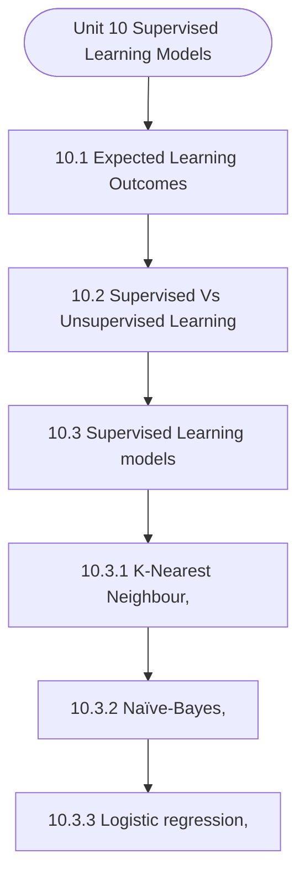

# MCS-068: Predictive Data Analysis
## Unit 10: Supervised Learning Models

> 📚 **Programme:** M.Sc. (Data Science and Analytics) | **Semester:** Semester 2  
> ⏱️ **Estimated Study Time:** ~117 mins | 📄 **Textbook Pages:** 71 Pages  
> 📥 **Original PDF:** [Download & View Authentic Textbook](../../../pdfs/Semester_2/MCS-068_Predictive_Data_Analysis/Unit-10_Supervised_Learning_Models.pdf)

---

### 🎯 Executive Concept & Data Science Relevance
In modern data systems and advanced analytics, **Supervised Learning Models** forms a vital conceptual pillar. Regression analysis estimates relationships between dependent targets and independent explanatory variables. Linear models, regularization penalties, and gradient updates form the computational core of supervised machine learning.

> [!NOTE]
> **Why this matters for your career:** Mastering supervised learning models equips you with the foundational principles required to reason mathematically about high-dimensional datasets, evaluate algorithm performance, and avoid statistical pitfalls in production machine learning pipelines.

### 🗺️ Visual Knowledge Architecture
The following concept map illustrates the structural hierarchy and learning trajectory of this module:



### 📖 Core Definitions & Terminology Cards

> 📌 **Ordinary Least Squares (OLS)**  
> - **Formal Definition:** Estimation method that minimizes the sum of squared differences (residuals) between observed values and predictions: $\min_\beta \sum (y_i - \hat{y}_i)^2$.  
> - 💡 **Practical Intuition & Analogy:** *Finding the single line that minimizes total vertical squared distance to all data points.*

> 📌 **Coefficient of Determination ($R^2$)**  
> - **Formal Definition:** The proportion of variance in the dependent variable explained by independent features: $R^2 = 1 - \frac{SS_{\text{res}}}{SS_{\text{tot}}}$. Ranges from 0 to 1.  
> - 💡 **Practical Intuition & Analogy:** *An $R^2 = 0.85$ means 85% of target variability is captured by your model.*

> 📌 **Ridge Regularization ($L_2$)**  
> - **Formal Definition:** Adds squared magnitude penalty to the loss function: $\mathcal{L} + \lambda \sum_{j=1}^p \beta_j^2$. Shrinks weights toward zero to prevent overfitting under multicollinearity.  
> - 💡 **Practical Intuition & Analogy:** *Discourages extreme weight spikes without setting any coefficient entirely to zero.*

> 📌 **Lasso Regularization ($L_1$)**  
> - **Formal Definition:** Adds absolute magnitude penalty to the loss function: $\mathcal{L} + \lambda \sum_{j=1}^p \vert\beta_j\vert$. Drives non-essential coefficients exactly to zero, performing automated feature selection.  
> - 💡 **Practical Intuition & Analogy:** *Selects a sparse subset of impactful features by zeroing out noise variables.*

### ⚡ Governing Mathematical Laws & Formula Cheatsheet
#### 🔹 Simple Linear Regression OLS Parameters
$$
\begin{aligned} \hat{\beta}_1 & = \frac{\sum (x_i - \bar{x})(y_i - \bar{y})}{\sum (x_i - \bar{x})^2} = \frac{\text{Cov}(x, y)}{\text{Var}(x)} \\ \hat{\beta}_0 & = \bar{y} - \hat{\beta}_1 \bar{x} \end{aligned}
$$
- **Explanation:** Closed-form slope and intercept formulas for single-feature linear regression.

#### 🔹 Multiple Linear Regression Normal Equation
$$
\hat{\mathbf{\beta}} = (\mathbf{X}^T \mathbf{X})^{-1} \mathbf{X}^T \mathbf{y}
$$
- **Explanation:** Direct analytic matrix solution for OLS regression weights.

#### 🔹 Ridge Regression Closed-Form Estimator
$$
\hat{\mathbf{\beta}}_{\text{Ridge}} = (\mathbf{X}^T \mathbf{X} + \lambda \mathbf{I})^{-1} \mathbf{X}^T \mathbf{y}
$$
- **Explanation:** Adding $\lambda \mathbf{I}$ ensures invertibility even when $\mathbf{X}^T \mathbf{X}$ is ill-conditioned or collinear.

#### 🔹 Logistic Regression Sigmoid Function
$$
P(Y = 1 \mid X = \mathbf{x}) = \sigma(\mathbf{w}^T \mathbf{x} + b) = \frac{1}{1 + e^{-(\mathbf{w}^T \mathbf{x} + b)}}
$$
- **Explanation:** Maps any real-valued linear score into a calibrated probability interval $[0, 1]$.

### ⚖️ Axiomatic Properties & Governing Laws
The mathematical formulations of this module are anchored by foundational algebraic and structural laws:

- **Gauss-Markov Theorem:** Under standard OLS assumptions, the OLS estimator is BLUE (Best Linear Unbiased Estimator).
- **Orthogonality of Residuals:** $\mathbf{X}^T \mathbf{e} = \mathbf{0} \quad (\text{Residuals are orthogonal to feature space})$
- **Variance Inflation Factor (VIF):** $\text{VIF}_j = \frac{1}{1 - R_j^2} \quad (\text{VIF} > 5 \implies \text{Severe Multicollinearity})$

### 📌 Comprehensive Section-by-Section Study Breakdown
#### `10.1` Expected Learning Outcomes

##### 📘 Theoretical Principles & Pedagogical Exposition
In probability theory and statistical inference, **Expected Learning Outcomes** formalizes the stochastic behavior of random phenomena. Within **Supervised Learning Models**, this framework allows data scientists to infer population parameters from finite empirical samples while quantifying uncertainty via confidence intervals and hypothesis tests.

The mathematical rigor here prevents statistical misinterpretations, such as confusing correlation with causation, overlooking sample selection bias, or violating distributional assumptions.

##### ⚙️ Mathematical & Algorithmic Mechanics
- **Core Mechanism:** Supervised algorithms learn function approximations $f: \mathcal{X} \to \mathcal{Y}$ minimizing empirical loss. Unsupervised clustering minimizes intra-cluster inertia $\sum ||x_i - \mu_k||^2$. The Bias-Variance Tradeoff balances underfitting against overfitting.
- **Boundary Conditions:** Curse of dimensionality in high dimensions, severe class imbalance (requiring SMOTE or class-weighted loss), and poor centroid initialization in K-Means.

##### 📊 Practical Data Science & Production Relevance
- **Production Workflow:** Customer segmentation, churn prediction, recommendation systems, automated fraud scoring, and cross-validated model selection with regularization ($L_1, L_2$).
- **Real-World Pitfall:** Data leakage during preprocessing prior to train-test splits, producing falsely inflated validation scores that fail in production deployment.

> [!TIP]
> **Exam & Technical Interview Insight:** Calculate precision, recall, F1-score, and ROC-AUC; explain the mathematical difference between generative and discriminative models; trace K-Means iterations.

#### `10.2` Supervised Vs Unsupervised Learning

##### 📘 Theoretical Principles & Pedagogical Exposition
LEARNING In the previous section, we learned that Supervised learning mainly focuses on two types of problems based on the type of output (Y): classification and regression. These two approaches help in solving different kinds of real-world prediction problems depending on whether the output is categorical or continuous.

Classification tasks are used when we need to predict a category or label. In this case, the output is discrete, meaning it belongs to a fixed set of classes. For example, an email can be classified as spam or not spam, a user may or may not click on an advertisement, or an image can be identified as a specific object.

The main goal of classification models is to correctly assign the right label to each input. These models are designed to improve accuracy and clearly separate different classes using techniques like Logistic Regression or Support Vector Machines. Regression tasks, on the other hand, are used when the output is a continuous value.


##### ⚙️ Mathematical & Algorithmic Mechanics
- **Core Mechanism:** Supervised algorithms learn function approximations $f: \mathcal{X} \to \mathcal{Y}$ minimizing empirical loss. Unsupervised clustering minimizes intra-cluster inertia $\sum ||x_i - \mu_k||^2$. The Bias-Variance Tradeoff balances underfitting against overfitting.
- **Boundary Conditions:** Curse of dimensionality in high dimensions, severe class imbalance (requiring SMOTE or class-weighted loss), and poor centroid initialization in K-Means.

##### 📊 Practical Data Science & Production Relevance
- **Production Workflow:** Customer segmentation, churn prediction, recommendation systems, automated fraud scoring, and cross-validated model selection with regularization ($L_1, L_2$).
- **Real-World Pitfall:** Data leakage during preprocessing prior to train-test splits, producing falsely inflated validation scores that fail in production deployment.

> [!TIP]
> **Exam & Technical Interview Insight:** Calculate precision, recall, F1-score, and ROC-AUC; explain the mathematical difference between generative and discriminative models; trace K-Means iterations.

#### `10.3` Supervised Learning models

##### 📘 Theoretical Principles & Pedagogical Exposition
In the above we learned about Supervised learning and compared it with Unsupervised learning, on the basis of various aspects. Now, in this section we are going to discuss about various Supervised learning models, which are widely used in data analysis, and they learn from labeled data to make predictions or classifications.

These models identify patterns between input features and known outputs, enabling them to classify/predict outcomes for new, unseen data. Different supervised learning algorithms are designed to handle various types of problems such as classification and regression, each with its own strengths and applications.

The prominent supervised learning models are as follows:  K-Nearest Neighbours (KNN) is a simple and intuitive algorithm that classifies a data point based on the majority class of its nearest neighbours. It relies on distance measures such as Euclidean or Manhattan distance and does not require an explicit training phase.


##### ⚙️ Mathematical & Algorithmic Mechanics
- **Core Mechanism:** Supervised algorithms learn function approximations $f: \mathcal{X} \to \mathcal{Y}$ minimizing empirical loss. Unsupervised clustering minimizes intra-cluster inertia $\sum ||x_i - \mu_k||^2$. The Bias-Variance Tradeoff balances underfitting against overfitting.
- **Boundary Conditions:** Curse of dimensionality in high dimensions, severe class imbalance (requiring SMOTE or class-weighted loss), and poor centroid initialization in K-Means.

##### 📊 Practical Data Science & Production Relevance
- **Production Workflow:** Customer segmentation, churn prediction, recommendation systems, automated fraud scoring, and cross-validated model selection with regularization ($L_1, L_2$).
- **Real-World Pitfall:** Data leakage during preprocessing prior to train-test splits, producing falsely inflated validation scores that fail in production deployment.

> [!TIP]
> **Exam & Technical Interview Insight:** Calculate precision, recall, F1-score, and ROC-AUC; explain the mathematical difference between generative and discriminative models; trace K-Means iterations.

#### `10.3.1` K-Nearest Neighbour,

##### 📘 Theoretical Principles & Pedagogical Exposition
The K-Nearest Neighbors (KNN) algorithm is one of the simplest and most intuitive supervised learning techniques used for both classification and regression tasks. It is a non- parametric and instance-based learning algorithm, meaning it does not build an explicit model during training but instead makes predictions based on the stored training data.

The core idea behind KNN is that similar data points exist close to each other in the feature space. Therefore, the class or value of a new data point can be determined by examining its nearest neighbors. In simple terms, KNN works on the principle of “Similarity” or “Closeness.” For example, in real life, if a new student joins a class and we want to guess their performance, we may compare them with students who have similar study habits or background.

Similarly, in a movie recommendation system, if a user likes certain movies, the system recommends movies liked by users with similar preferences. These are practical examples of how KNN operates. The working of the KNN algorithm involves the following steps:  first, choose the value of K (the number of nearest neighbors).


##### ⚙️ Mathematical & Algorithmic Mechanics
- **Core Mechanism:** Supervised algorithms learn function approximations $f: \mathcal{X} \to \mathcal{Y}$ minimizing empirical loss. Unsupervised clustering minimizes intra-cluster inertia $\sum ||x_i - \mu_k||^2$. The Bias-Variance Tradeoff balances underfitting against overfitting.
- **Boundary Conditions:** Curse of dimensionality in high dimensions, severe class imbalance (requiring SMOTE or class-weighted loss), and poor centroid initialization in K-Means.

##### 📊 Practical Data Science & Production Relevance
- **Production Workflow:** Customer segmentation, churn prediction, recommendation systems, automated fraud scoring, and cross-validated model selection with regularization ($L_1, L_2$).
- **Real-World Pitfall:** Data leakage during preprocessing prior to train-test splits, producing falsely inflated validation scores that fail in production deployment.

> [!TIP]
> **Exam & Technical Interview Insight:** Calculate precision, recall, F1-score, and ROC-AUC; explain the mathematical difference between generative and discriminative models; trace K-Means iterations.

#### `10.3.2` Naïve-Bayes,

##### 📘 Theoretical Principles & Pedagogical Exposition
TYPES OF NAÏVE BAYES ALGORITHM Now we extend our discussion to explore further details on Naïve Bayes algorithm, In practical scenarios, Naïve Bayes is often implemented in different forms such as:  Gaussian Naïve Bayes (for continuous data),  Multinomial Naïve Bayes (for text data), and  Bernoulli Naïve Bayes (for binary features).

One common issue is the occurrence of zero probability, which can be handled using techniques like Laplace smoothing, where a small value is added to all probabilities to avoid multiplication by zero. A brief introduction to each of the Naïve Bayes algorithm, which are implemented as different variants, depending on the nature of data, such as Gaussian, Multinomial, and Bernoulli Naïve Bayes is as follows: 1.

Gaussian Naïve Bayes (for Continuous Data) :Gaussian Naïve Bayes is used when the input features are continuous in nature, such as height, weight, marks, or income. It assumes that the values of these features follow a normal (Gaussian) distribution. Instead of counting frequencies, this method uses the mean and variance of the data to estimate probabilities.


##### ⚙️ Mathematical & Algorithmic Mechanics
- **Core Mechanism:** Probability measure satisfying Kolmogorov axioms: $P(S)=1, P(A) \ge 0$, and countable additivity. Bayes' Theorem computes posterior probability: $P(A \mid B) = \frac{P(B \mid A)P(A)}{P(B)}$. Variance measures dispersion: $\text{Var}(X) = \mathbb{E}[X^2] - (\mathbb{E}[X])^2$.
- **Boundary Conditions:** Zero probability conditioning events ($P(B) = 0$), distinguishing mutually exclusive events ($A \cap B = \emptyset$) from independent events ($P(A \cap B) = P(A)P(B)$), and heavy-tailed infinite variance.

##### 📊 Practical Data Science & Production Relevance
- **Production Workflow:** A/B test statistical significance, Naive Bayes spam classifiers, Bayesian hyperparameter optimization, and stochastic risk quantification in financial algorithms.
- **Real-World Pitfall:** Confusing conditional probability $P(A \mid B)$ with $P(B \mid A)$ (the Prosecutor's Fallacy), or falsely assuming independence between correlated feature variables.

> [!TIP]
> **Exam & Technical Interview Insight:** Calculate conditional probabilities using the Law of Total Probability and Bayes' Theorem; calculate expectation $\mathbb{E}[X]$ and variance for discrete and continuous random variables.

#### `10.3.3` Logistic regression,

##### 📘 Theoretical Principles & Pedagogical Exposition
Logistic Regression is one of t algorithms for solving classificat (such as Yes/No, 0/1, True/Fals traditional sense; instead, it is us particular class. At its core, Logistic Regression probability of an outcome usin Function. Important Note: The Sigmoid Regression to convert any real-va Mathematical Expression fo Where:  𝑧= linear combination  𝑒= Euler’s number (≈  𝜎(𝑧)= output probabi The sigmoid curve shown in transforming values in range between 0 and 1, value of 𝑧 is very large a indicating a very low pro of 0.5, which represents a ……………………………………………………………… …………………………………………………………… EGRESSION the most fundamental and widely used superv tion problems, especially when the output is bin e).

Despite its name, it is not a regression alg sed to estimate the probability that a given inpu n builds a relationship between the input fea ng a mathematical function called the Sigmo d Function is a mathematical function used alued input into a probability value between 0 a for Sigmoid Function is: 𝜎(𝑧) = ଵ ଵା௘ష೥ n of inputs (e.g., 𝛽଴+ 𝛽ଵ𝑥) ≈ 2.718) ility between 0 and 1 n above is an S-shaped smooth curve that plays n Logistic Regression.

It maps any real-valued i making it suitable for probability interpretatio and negative, the output of the sigmoid function obability. When 𝑧= 0, the sigmoid function gi an uncertain or neutral state. As the value of 𝑧 b … vised learning nary in nature gorithm in the ut belongs to a tures and the oid (Logistic) d in Logistic nd 1.


##### ⚙️ Mathematical & Algorithmic Mechanics
- **Core Mechanism:** Ordinary Least Squares (OLS) minimizes residual sum of squares: $\min_\beta \sum (y_i - x_i^T \beta)^2$. Normal equation analytical solution: $\hat{\beta} = (X^T X)^{-1} X^T y$. Logistic regression applies sigmoid link $\sigma(z) = \frac{1}{1 + e^{-z}}$ optimizing log-likelihood.
- **Boundary Conditions:** Perfect multicollinearity causing singular non-invertible $X^T X$, heteroscedasticity (non-constant residual variance), and high-leverage outlier leverage points.

##### 📊 Practical Data Science & Production Relevance
- **Production Workflow:** Predictive target forecasting, econometric attribution modeling, risk scoring models, and baseline benchmark modeling in data science pipelines.
- **Real-World Pitfall:** High multicollinearity inflating coefficient standard errors, or fitting linear models without verifying residual normality and homoscedasticity plots.

> [!TIP]
> **Exam & Technical Interview Insight:** Derive OLS normal equations; interpret slope $\beta_1$ and intercept $\beta_0$; calculate $R^2 = 1 - \frac{SS_{\text{res}}}{SS_{\text{tot}}}$ and conduct $F$-tests for overall model significance.

#### `10.3.4` Decision trees

##### 📘 Theoretical Principles & Pedagogical Exposition
Decision Trees are one of the most intuitive and widely used supervised learning algorithms for both classification and regression problems. The core idea of a Decision Tree is to break down a complex decision-making process into a series of simple, sequential decisions, represented in the form of a tree-like structure.

Each internal node of the tree represents a test on a feature, each branch represents the outcome of that test, and each leaf node represents the final prediction or class label. This structure closely resembles human decision-making, making Decision Trees easy to understand and interpret.

In a typical Decision Tree, the algorithm starts from the root node and recursively splits the dataset into smaller subsets based on the feature that best separates the data. The goal is to create pure subsets, where most of the data points belong to a single class. To determine the best feature for splitting, the algorithm uses measures such as Entropy, Information Gain, or Gini Index.


##### ⚙️ Mathematical & Algorithmic Mechanics
- **Core Mechanism:** Hierarchical acyclic data structure. Binary Search Trees enforce $\text{left} < \text{root} \le \text{right}$. Self-balancing AVL and Red-Black trees execute pointer rotations to maintain $\mathcal{O}(\log n)$ depth invariants.
- **Boundary Conditions:** Degenerate skewed trees degenerating to $\mathcal{O}(n)$ singly linked lists, empty roots, and deletions of nodes with two children requiring in-order successor replacements.

##### 📊 Practical Data Science & Production Relevance
- **Production Workflow:** B+ tree indexing in SQL relational databases, ensemble decision trees (Random Forest, XGBoost), and Min/Max Heaps in priority queues for top-$k$ recommendation retrieval.
- **Real-World Pitfall:** Unbalanced sequential insertions degrading search times from $\mathcal{O}(\log n)$ to $\mathcal{O}(n)$, or failing to update parent pointers during tree rebalancing.

> [!TIP]
> **Exam & Technical Interview Insight:** Draw step-by-step tree insertion and deletion states; write recursive traversals (Pre-order, In-order, Post-order); illustrate AVL single/double rotations.

#### `10.3.5` Random Forest

##### 📘 Theoretical Principles & Pedagogical Exposition
Decision Trees and Random Forest are both supervised learning algorithms based on tree structures, but they differ significantly in their approach and performance. A Decision Tree is a single model that splits the dataset into smaller subsets based on feature conditions, forming a tree-like structure of decisions.

It is simple, easy to understand, and highly interpretable, as the decision-making process can be clearly visualized through rules. However, this simplicity comes with a drawback: Decision Trees are highly prone to overfitting, especially when the tree becomes deep and captures noise in the data.

They are also sensitive to small changes in the dataset, which can lead to completely different tree structures. On the other hand, Random Forest is an ensemble learning technique that builds multiple Decision Trees and combines their predictions to produce a final result. Instead of relying on a single tree, it uses techniques such as bootstrapping (random sampling of data) and random feature selection to create diversity among trees.


##### ⚙️ Mathematical & Algorithmic Mechanics
- **Core Mechanism:** Supervised algorithms learn function approximations $f: \mathcal{X} \to \mathcal{Y}$ minimizing empirical loss. Unsupervised clustering minimizes intra-cluster inertia $\sum ||x_i - \mu_k||^2$. The Bias-Variance Tradeoff balances underfitting against overfitting.
- **Boundary Conditions:** Curse of dimensionality in high dimensions, severe class imbalance (requiring SMOTE or class-weighted loss), and poor centroid initialization in K-Means.

##### 📊 Practical Data Science & Production Relevance
- **Production Workflow:** Customer segmentation, churn prediction, recommendation systems, automated fraud scoring, and cross-validated model selection with regularization ($L_1, L_2$).
- **Real-World Pitfall:** Data leakage during preprocessing prior to train-test splits, producing falsely inflated validation scores that fail in production deployment.

> [!TIP]
> **Exam & Technical Interview Insight:** Calculate precision, recall, F1-score, and ROC-AUC; explain the mathematical difference between generative and discriminative models; trace K-Means iterations.

### 📐 Step-by-Step Solved Mathematical Examples
To solidify your theoretical understanding, work through these fully solved, step-by-step mathematical problems:

#### 🧮 Example 1: Simple Linear Regression OLS Computation
> **Problem Statement:**  
> Given data points $(x, y)$: $(1, 2), (2, 3), (3, 5), (4, 4), (5, 6)$. Compute OLS slope $\hat{\beta}_1$, intercept $\hat{\beta}_0$, and regression line.

**Detailed Step-by-Step Solution:**

1. **Means:** $\bar{x} = 3.0, \; \bar{y} = 4.0$.
2. **Deviations & Products:**
- $(x_1 - \bar{x}) = -2, \; (y_1 - \bar{y}) = -2 \implies (-2)(-2) = 4, \; (-2)^2 = 4$
- $(x_2 - \bar{x}) = -1, \; (y_2 - \bar{y}) = -1 \implies (-1)(-1) = 1, \; (-1)^2 = 1$
- $(x_3 - \bar{x}) = 0, \; (y_3 - \bar{y}) = 1 \implies (0)(1) = 0, \; 0^2 = 0$
- $(x_4 - \bar{x}) = 1, \; (y_4 - \bar{y}) = 0 \implies (1)(0) = 0, \; 1^2 = 1$
- $(x_5 - \bar{x}) = 2, \; (y_5 - \bar{y}) = 2 \implies (2)(2) = 4, \; 2^2 = 4$

3. **Summation:** $\sum (x_i - \bar{x})(y_i - \bar{y}) = 9, \; \sum (x_i - \bar{x})^2 = 10$.

4. **Parameters:**

$$
\hat{\beta}_1 = \frac{9}{10} = 0.90
$$


$$
\hat{\beta}_0 = \bar{y} - \hat{\beta}_1 \bar{x} = 4.0 - 0.9(3.0) = 4.0 - 2.7 = 1.30
$$


Regression Equation: $\hat{y} = 1.30 + 0.90 x$.

#### 🧮 Example 2: Coefficient of Determination $R^2$ Calculation
> **Problem Statement:**  
> For the model above, total sum of squares $SS_{\text{tot}} = 10.0$ and sum of squared residuals $SS_{\text{res}} = 1.90$. Calculate $R^2$ and interpret.

**Detailed Step-by-Step Solution:**


$$
R^2 = 1 - \frac{SS_{\text{res}}}{SS_{\text{tot}}} = 1 - \frac{1.90}{10.0} = 1 - 0.19 = 0.81 \implies 81\%
$$


Interpretation: 81% of the variation in target $y$ is explained by feature $x$.

### 💻 Practical Data Science Implementation (Python)
Theory translates directly into production algorithms. Below is a self-contained, commented Python implementation illustrating the core operations of this unit:

```python
from sklearn.linear_model import LinearRegression, Ridge, Lasso
import numpy as np

# Dataset with multicollinearity
X = np.array([[1, 2], [2, 4.1], [3, 5.9], [4, 8.2], [5, 9.9]])
y = np.array([2.2, 4.1, 6.2, 7.9, 10.1])

# 1. Standard OLS
ols = LinearRegression().fit(X, y)
print("OLS Coefficients:", ols.coef_)

# 2. Ridge (L2 penalty shrinks weights smoothly)
ridge = Ridge(alpha=1.0).fit(X, y)
print("Ridge Coefficients:", ridge.coef_)

# 3. Lasso (L1 penalty induces sparsity)
lasso = Lasso(alpha=0.1).fit(X, y)
print("Lasso Coefficients (Sparse):", lasso.coef_)
```

### 💡 Interactive Self-Assessment Checkpoints
Test your comprehension before proceeding. Tap each question to reveal the comprehensive explanation:

<details>
<summary><b>Checkpoint 1:</b> What is the main difference between supervised and unsupervised learning? …………………………………………………………………………………………… …………………………………………………………………………………………… <i>(Tap to reveal answer)</i></summary>

> **Answer & Analysis:**  
> **Detailed Analytical Solution:**
> 
> 1. **Core Principle:** Identify the governing theorem or definition for Supervised Learning Models.
> 2. **Step-by-Step Derivation:** Verify all preconditions and compute intermediate steps methodically.
> 3. **Conclusion:** State the final mathematical proof or calculation clearly, validating boundary edge cases.
</details>

<details>
<summary><b>Checkpoint 2:</b> Which type of learning is used for predicting house prices and why? …………………………………………………………………………………………… …………………………………………………………………………………………… <i>(Tap to reveal answer)</i></summary>

> **Answer & Analysis:**  
> **Detailed Analytical Solution:**
> 
> 1. **Core Principle:** Identify the governing theorem or definition for Supervised Learning Models.
> 2. **Step-by-Step Derivation:** Verify all preconditions and compute intermediate steps methodically.
> 3. **Conclusion:** State the final mathematical proof or calculation clearly, validating boundary edge cases.
</details>

<details>
<summary><b>Checkpoint 3:</b> Give one real-life example of unsupervised learning. …………………………………………………………………………………………… …………………………………………………………………………………………… <i>(Tap to reveal answer)</i></summary>

> **Answer & Analysis:**  
> **Detailed Analytical Solution:**
> 
> 1. **Core Principle:** Identify the governing theorem or definition for Supervised Learning Models.
> 2. **Step-by-Step Derivation:** Verify all preconditions and compute intermediate steps methodically.
> 3. **Conclusion:** State the final mathematical proof or calculation clearly, validating boundary edge cases.
</details>

<details>
<summary><b>Checkpoint 4:</b> Why is data preprocessing important in machine learning? …………………………………………………………………………………………… …………………………………………………………………………………………… <i>(Tap to reveal answer)</i></summary>

> **Answer & Analysis:**  
> **Detailed Analytical Solution:**
> 
> 1. **Core Principle:** Identify the governing theorem or definition for Supervised Learning Models.
> 2. **Step-by-Step Derivation:** Verify all preconditions and compute intermediate steps methodically.
> 3. **Conclusion:** State the final mathematical proof or calculation clearly, validating boundary edge cases.
</details>

<details>
<summary><b>Checkpoint 5:</b> What is the key difference between Ridge ($L_2$) and Lasso ($L_1$) regression? <i>(Tap to reveal answer)</i></summary>

> **Answer & Analysis:**  
> Ridge shrinks coefficients continuously toward zero without zeroing them out, whereas Lasso drives coefficients to exactly zero, producing sparse models and automated feature selection.
</details>

<details>
<summary><b>Checkpoint 6:</b> What is the matrix Normal Equation for Ordinary Least Squares? <i>(Tap to reveal answer)</i></summary>

> **Answer & Analysis:**  
> $\hat{\mathbf{\beta}} = (\mathbf{X}^T \mathbf{X})^{-1} \mathbf{X}^T \mathbf{y}$
</details>

### 🎯 Executive Module Wrap-Up
- **Central Idea:** Supervised Learning Models provides essential mathematical and algorithmic tools directly utilized in Data Science.
- **Mathematical Rigor:** Formulas and laws must be memorized with attention to boundary conditions and assumptions.
- **Full Textbook Coverage:** For exhaustive multi-page derivations, proofs, and supplementary exercises, consult the [Authentic IGNOU Textbook](../../../pdfs/Semester_2/MCS-068_Predictive_Data_Analysis/Unit-10_Supervised_Learning_Models.pdf).

---
### 🧭 Navigation & Syllabus Index
[⬅ Previous: Unit 9](unit_09_Mining_Big_Data.md) | [📑 Course Index](README.md) | [Next: Unit 11 ➡](unit_11_Unsupervised_Learning_Models.md)
