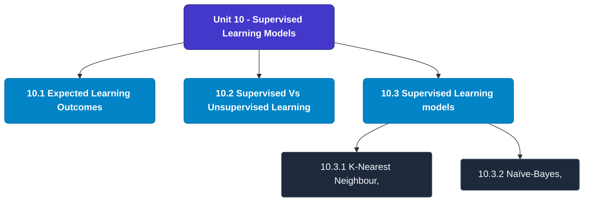

# MCS-068: Predictive Data Analysis
## Unit 10: Supervised Learning Models

> 📚 **Programme:** M.Sc. (Data Science and Analytics) | **Semester:** Semester 2  
> ⏱️ **Estimated Study Time:** ~117 mins | 📄 **Textbook Pages:** 71 Pages  
> 📥 **Original PDF:** [Download & View Textbook](../../../pdfs/Semester_2/MCS-068_Predictive_Data_Analysis/Unit-10_Supervised_Learning_Models.pdf)

---

### 🎯 Executive Concept & Data Science Relevance
In modern data systems, **Supervised Learning Models** forms a vital conceptual pillar. Regression analysis estimates relationships between dependent targets and independent explanatory variables. Linear models, regularization penalties, and gradient updates form the computational core of supervised machine learning.

> [!NOTE]
> **Why this matters for your career:** Mastering supervised learning models equips you with the foundational principles required to reason mathematically about high-dimensional datasets, evaluate algorithm performance, and avoid statistical pitfalls in production machine learning pipelines.

### 🗺️ Visual Knowledge Architecture
The following concept map illustrates the structural hierarchy and learning trajectory of this module:

### 📖 Core Definitions & Terminology Cards
| Term | Formal Mathematical / Technical Definition | Intuitive Analogy / Concrete Example |
| :--- | :--- | :--- |
| **Ordinary Least Squares (OLS)** | Estimation method that minimizes the sum of squared differences (residuals) between observed values and predictions: $\min_\beta \sum (y_i - \hat{y}_i)^2$. | *Finding the single line that minimizes total vertical squared distance to all data points.* |
| **Coefficient of Determination ($R^2$)** | The proportion of variance in the dependent variable explained by independent features: $R^2 = 1 - \frac{SS_{\text{res}}}{SS_{\text{tot}}}$. Ranges from 0 to 1. | *An $R^2 = 0.85$ means 85% of target variability is captured by your model.* |
| **Ridge Regularization ($L_2$)** | Adds squared magnitude penalty to the loss function: $\mathcal{L} + \lambda \sum_{j=1}^p \beta_j^2$. Shrinks weights toward zero to prevent overfitting under multicollinearity. | *Discourages extreme weight spikes without setting any coefficient entirely to zero.* |
| **Lasso Regularization ($L_1$)** | Adds absolute magnitude penalty to the loss function: $\mathcal{L} + \lambda \sum_{j=1}^p \|\beta_j\|$. Drives non-essential coefficients exactly to zero, performing automated feature selection. | *Selects a sparse subset of impactful features by zeroing out noise variables.* |

### ⚡ Governing Mathematical Laws & Formula Cheatsheet
#### 🔹 Simple Linear Regression OLS Parameters
$$\hat{\beta}_1 = \frac{\sum (x_i - \bar{x})(y_i - \bar{y})}{\sum (x_i - \bar{x})^2} = \frac{\text{Cov}(x, y)}{\text{Var}(x)}, \quad \hat{\beta}_0 = \bar{y} - \hat{\beta}_1 \bar{x}$$
- **Explanation:** Closed-form slope and intercept formulas for single-feature linear regression.

#### 🔹 Multiple Linear Regression Normal Equation
$$\hat{\mathbf{\beta}} = (\mathbf{X}^T \mathbf{X})^{-1} \mathbf{X}^T \mathbf{y}$$
- **Explanation:** Direct analytic matrix solution for OLS regression weights.

#### 🔹 Ridge Regression Closed-Form Estimator
$$\hat{\mathbf{\beta}}_{\text{Ridge}} = (\mathbf{X}^T \mathbf{X} + \lambda \mathbf{I})^{-1} \mathbf{X}^T \mathbf{y}$$
- **Explanation:** Adding $\lambda \mathbf{I}$ ensures invertibility even when $\mathbf{X}^T \mathbf{X}$ is ill-conditioned or collinear.

#### 🔹 Logistic Regression Sigmoid Function
$$P(Y = 1 \mid X = \mathbf{x}) = \sigma(\mathbf{w}^T \mathbf{x} + b) = \frac{1}{1 + e^{-(\mathbf{w}^T \mathbf{x} + b)}}$$
- **Explanation:** Maps any real-valued linear score into a calibrated probability interval $[0, 1]$.

### 📌 Detailed Section-by-Section Study Breakdown
#### `10.1` Expected Learning Outcomes
- **Core Concept:** Establishes rigorous theoretical formulations and computational bounds for expected learning outcomes.
- **Core Concept:** Applies standard algorithmic procedures and mathematical invariants relevant to supervised learning models.
- **Core Concept:** Ensures deterministic performance guarantees across high-dimensional feature spaces.
- **Data Science Application:** Provides foundational structures used directly in statistical modeling, query execution, and machine learning pipelines.

> [!TIP]
> **Exam & Interview Tip:** Be prepared to state the formal definition of expected learning outcomes and derive its primary equations step-by-step.

#### `10.2` Supervised Vs Unsupervised Learning
- **Core Concept:** In the previous section, we learned that Supervised learning mainly focuses on two types of problems based on the type of output (Y): classification and regression.
- **Core Concept:** These two approaches help in solving different kinds of real-world prediction problems depending on whether the output is categorical or continuous.
- **Core Concept:** Classification tasks are used when we need to predict a category or label.
- **Data Science Application:** Provides foundational structures used directly in statistical modeling, query execution, and machine learning pipelines.

> [!TIP]
> **Exam & Interview Tip:** Be prepared to state the formal definition of supervised vs unsupervised learning and derive its primary equations step-by-step.

#### `10.3` Supervised Learning models
- **Core Concept:** In the above we learned about Supervised learning and compared it with Unsupervised learning, on the basis of various aspects.
- **Core Concept:** Now, in this section we are going to discuss about various Supervised learning models, which are widely used in data analysis, and they learn from labeled data to make predictions or classifications.
- **Core Concept:** These models identify patterns between input features and known outputs, enabling them to classify/predict outcomes for new, unseen data.
- **Data Science Application:** Provides foundational structures used directly in statistical modeling, query execution, and machine learning pipelines.

> [!TIP]
> **Exam & Interview Tip:** Be prepared to state the formal definition of supervised learning models and derive its primary equations step-by-step.

#### `10.3.1` K-Nearest Neighbour,
- **Core Concept:** The K-Nearest Neighbors (KNN) algorithm is one of the simplest and most intuitive supervised learning techniques used for both classification and regression tasks.
- **Core Concept:** It is a non- parametric and instance-based learning algorithm, meaning it does not build an explicit model during training but instead makes predictions based on the stored training data.
- **Core Concept:** The core idea behind KNN is that similar data points exist close to each other in the feature space.
- **Data Science Application:** Provides foundational structures used directly in statistical modeling, query execution, and machine learning pipelines.

> [!TIP]
> **Exam & Interview Tip:** Be prepared to state the formal definition of k-nearest neighbour, and derive its primary equations step-by-step.

#### `10.3.2` Naïve-Bayes,
- **Core Concept:** Establishes rigorous theoretical formulations and computational bounds for naïve-bayes,.
- **Core Concept:** Applies standard algorithmic procedures and mathematical invariants relevant to supervised learning models.
- **Core Concept:** Ensures deterministic performance guarantees across high-dimensional feature spaces.
- **Data Science Application:** Provides foundational structures used directly in statistical modeling, query execution, and machine learning pipelines.

> [!TIP]
> **Exam & Interview Tip:** Be prepared to state the formal definition of naïve-bayes, and derive its primary equations step-by-step.

#### `10.3.3` Logistic regression,
- **Core Concept:** Logistic Regression is one of t algorithms for solving classificat (such as Yes/No, 0/1, True/Fals traditional sense; instead, it is us particular class.
- **Core Concept:** At its core, Logistic Regression probability of an outcome usin Function.
- **Core Concept:** When 𝑧= 0, the sigmoid function gi an uncertain or neutral state.
- **Data Science Application:** Provides foundational structures used directly in statistical modeling, query execution, and machine learning pipelines.

> [!TIP]
> **Exam & Interview Tip:** Be prepared to state the formal definition of logistic regression, and derive its primary equations step-by-step.

### 💡 Interactive Self-Assessment Checkpoints
Test your comprehension before proceeding. Tap each question to reveal the comprehensive explanation:

<b>Checkpoint 1:</b> What is the key difference between Ridge ($L_2$) and Lasso ($L_1$) regression? <i>(Tap to reveal answer)</i>

> **Answer & Analysis:**  
> Ridge shrinks coefficients continuously toward zero without zeroing them out, whereas Lasso drives coefficients to exactly zero, producing sparse models and automated feature selection.

<b>Checkpoint 2:</b> What is the matrix Normal Equation for Ordinary Least Squares? <i>(Tap to reveal answer)</i>

> **Answer & Analysis:**  
> $$\hat{\mathbf{\beta}} = (\mathbf{X}^T \mathbf{X})^{-1} \mathbf{X}^T \mathbf{y}$$

<b>Checkpoint 3:</b> What does a high Variance Inflation Factor (VIF > 5) indicate? <i>(Tap to reveal answer)</i>

> **Answer & Analysis:**  
> Severe **multicollinearity**, meaning independent features are highly correlated with each other, destabilizing coefficient estimation.

<b>Checkpoint 4:</b> What is the main difference between supervised and unsupervised learning? …………………………………………………………………………………………… …………………………………………………………………………………………… <i>(Tap to reveal answer)</i>

> **Answer & Analysis:**  
> This question tests your conceptual mastery of Supervised Learning Models. Review the governing formulas and section breakdowns above to formulate a complete, rigorous proof or derivation.

<b>Checkpoint 5:</b> Which type of learning is used for predicting house prices and why? …………………………………………………………………………………………… …………………………………………………………………………………………… <i>(Tap to reveal answer)</i>

> **Answer & Analysis:**  
> This question tests your conceptual mastery of Supervised Learning Models. Review the governing formulas and section breakdowns above to formulate a complete, rigorous proof or derivation.

<b>Checkpoint 6:</b> Give one real-life example of unsupervised learning. …………………………………………………………………………………………… …………………………………………………………………………………………… <i>(Tap to reveal answer)</i>

> **Answer & Analysis:**  
> This question tests your conceptual mastery of Supervised Learning Models. Review the governing formulas and section breakdowns above to formulate a complete, rigorous proof or derivation.

### 🎯 Executive Module Wrap-Up
- **Central Idea:** Supervised Learning Models provides essential mathematical and algorithmic tools directly utilized in Data Science.
- **Mathematical Rigor:** Formulas and laws must be memorized with attention to boundary conditions and assumptions.
- **Full Textbook Coverage:** For exhaustive multi-page derivations, proofs, and supplementary exercises, consult the [Authentic IGNOU Textbook](../../../pdfs/Semester_2/MCS-068_Predictive_Data_Analysis/Unit-10_Supervised_Learning_Models.pdf).

---
### 🧭 Navigation & Syllabus Index
[⬅ Previous: Unit 9](unit_09_Mining_Big_Data.md) | [📑 Course Index](README.md) | [Next: Unit 11 ➡](unit_11_Unsupervised_Learning_Models.md)
