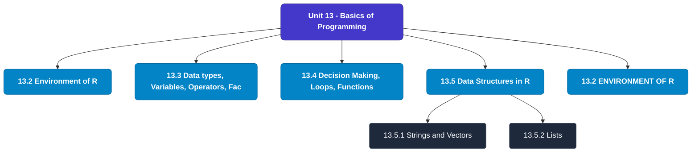

# MCS-068: Predictive Data Analysis
## Unit 13: Basics of Programming

> 📚 **Programme:** M.Sc. (Data Science and Analytics) | **Semester:** Semester 2  
> ⏱️ **Estimated Study Time:** ~19 mins | 📄 **Textbook Pages:** 20 Pages  
> 📥 **Original PDF:** [Download & View Textbook](../../../pdfs/Semester_2/MCS-068_Predictive_Data_Analysis/Unit-13_Basics_of_Programming.pdf)

---

### 🎯 Executive Concept & Data Science Relevance
In modern data systems, **Basics of Programming** forms a vital conceptual pillar. Regression analysis estimates relationships between dependent targets and independent explanatory variables. Linear models, regularization penalties, and gradient updates form the computational core of supervised machine learning.

> [!NOTE]
> **Why this matters for your career:** Mastering basics of programming equips you with the foundational principles required to reason mathematically about high-dimensional datasets, evaluate algorithm performance, and avoid statistical pitfalls in production machine learning pipelines.

### 🗺️ Visual Knowledge Architecture
The following concept map illustrates the structural hierarchy and learning trajectory of this module:

### 📖 Core Definitions & Terminology Cards
| Term | Formal Mathematical / Technical Definition | Intuitive Analogy / Concrete Example |
| :--- | :--- | :--- |
| **Ordinary Least Squares (OLS)** | Estimation method that minimizes the sum of squared differences (residuals) between observed values and predictions: $\min_\beta \sum (y_i - \hat{y}_i)^2$. | *Finding the single line that minimizes total vertical squared distance to all data points.* |
| **Coefficient of Determination ($R^2$)** | The proportion of variance in the dependent variable explained by independent features: $R^2 = 1 - \frac{SS_{\text{res}}}{SS_{\text{tot}}}$. Ranges from 0 to 1. | *An $R^2 = 0.85$ means 85% of target variability is captured by your model.* |
| **Ridge Regularization ($L_2$)** | Adds squared magnitude penalty to the loss function: $\mathcal{L} + \lambda \sum_{j=1}^p \beta_j^2$. Shrinks weights toward zero to prevent overfitting under multicollinearity. | *Discourages extreme weight spikes without setting any coefficient entirely to zero.* |
| **Lasso Regularization ($L_1$)** | Adds absolute magnitude penalty to the loss function: $\mathcal{L} + \lambda \sum_{j=1}^p \|\beta_j\|$. Drives non-essential coefficients exactly to zero, performing automated feature selection. | *Selects a sparse subset of impactful features by zeroing out noise variables.* |

### ⚡ Governing Mathematical Laws & Formula Cheatsheet
#### 🔹 Simple Linear Regression OLS Parameters
$$\hat{\beta}_1 = \frac{\sum (x_i - \bar{x})(y_i - \bar{y})}{\sum (x_i - \bar{x})^2} = \frac{\text{Cov}(x, y)}{\text{Var}(x)}, \quad \hat{\beta}_0 = \bar{y} - \hat{\beta}_1 \bar{x}$$
- **Explanation:** Closed-form slope and intercept formulas for single-feature linear regression.

#### 🔹 Multiple Linear Regression Normal Equation
$$\hat{\mathbf{\beta}} = (\mathbf{X}^T \mathbf{X})^{-1} \mathbf{X}^T \mathbf{y}$$
- **Explanation:** Direct analytic matrix solution for OLS regression weights.

#### 🔹 Ridge Regression Closed-Form Estimator
$$\hat{\mathbf{\beta}}_{\text{Ridge}} = (\mathbf{X}^T \mathbf{X} + \lambda \mathbf{I})^{-1} \mathbf{X}^T \mathbf{y}$$
- **Explanation:** Adding $\lambda \mathbf{I}$ ensures invertibility even when $\mathbf{X}^T \mathbf{X}$ is ill-conditioned or collinear.

#### 🔹 Logistic Regression Sigmoid Function
$$P(Y = 1 \mid X = \mathbf{x}) = \sigma(\mathbf{w}^T \mathbf{x} + b) = \frac{1}{1 + e^{-(\mathbf{w}^T \mathbf{x} + b)}}$$
- **Explanation:** Maps any real-valued linear score into a calibrated probability interval $[0, 1]$.

### 📌 Detailed Section-by-Section Study Breakdown
#### `13.2` Environment of R
- **Core Concept:** Establishes rigorous theoretical formulations and computational bounds for environment of r.
- **Core Concept:** Applies standard algorithmic procedures and mathematical invariants relevant to basics of programming.
- **Core Concept:** Ensures deterministic performance guarantees across high-dimensional feature spaces.
- **Data Science Application:** Provides foundational structures used directly in statistical modeling, query execution, and machine learning pipelines.

> [!TIP]
> **Exam & Interview Tip:** Be prepared to state the formal definition of environment of r and derive its primary equations step-by-step.

#### `13.3` Data types, Variables, Operators, Factors
- **Core Concept:** Every variable in R has an associated data type, which is known as the reserved memory.
- **Core Concept:** This reserved memory is needed for storing the values.
- **Core Concept:** Whenever a number is stored in R, it gets converted into a decimal type with at least 2 decimal points or the “double” value.
- **Data Science Application:** Provides foundational structures used directly in statistical modeling, query execution, and machine learning pipelines.

> [!TIP]
> **Exam & Interview Tip:** Be prepared to state the formal definition of data types, variables, operators, factors and derive its primary equations step-by-step.

#### `13.4` Decision Making, Loops, Functions
- **Core Concept:** In the case of loops, the statements are executed sequentially.
- **Core Concept:** Loop Type and Description: ● Repeat loop: Executes sequence of statements multiple times.
- **Core Concept:** ● While loop: Repeat a given statement while the given condition is true, executes before executing the loop body.
- **Data Science Application:** Provides foundational structures used directly in statistical modeling, query execution, and machine learning pipelines.

> [!TIP]
> **Exam & Interview Tip:** Be prepared to state the formal definition of decision making, loops, functions and derive its primary equations step-by-step.

#### `13.5` Data Structures in R
- **Core Concept:** R’s basic data structures include Vector, Strings, Lists, Frames, Matrices and Arrays.
- **Core Concept:** Strings and Vectors Vectors: A vector is a one-dimensional array of data elements that have the same data type.
- **Core Concept:** The most basic data structures are the Vectors, which supports logical, integer, double, complex, character data types.
- **Data Science Application:** Provides foundational structures used directly in statistical modeling, query execution, and machine learning pipelines.

> [!TIP]
> **Exam & Interview Tip:** Be prepared to state the formal definition of data structures in r and derive its primary equations step-by-step.

#### `13.5.1` Strings and Vectors
- **Core Concept:** Vectors: A vector is a one-dimensional array of data elements that have the same data type.
- **Core Concept:** The most basic data structures are the Vectors, which supports logical, integer, double, complex, character data types.
- **Core Concept:** Strings: Any value written within a pair of single quotes or double quotes in R is treated as a string.
- **Data Science Application:** Provides foundational structures used directly in statistical modeling, query execution, and machine learning pipelines.

> [!TIP]
> **Exam & Interview Tip:** Be prepared to state the formal definition of strings and vectors and derive its primary equations step-by-step.

#### `13.5.2` Lists
- **Core Concept:** Lists are the objects in R that contain different types of objects within itself like number, string, vectors or even another list, matrix or any function as its element It is created by calling list() function.
- **Core Concept:** Matrices, Arrays and Frames Matrices are R objects which are arranged in 2-D layout.
- **Core Concept:** Accessing the elements of the matrix: Elements of a matrix can be accessed by specifying the row and column number.
- **Data Science Application:** Provides foundational structures used directly in statistical modeling, query execution, and machine learning pipelines.

> [!TIP]
> **Exam & Interview Tip:** Be prepared to state the formal definition of lists and derive its primary equations step-by-step.

### 💡 Interactive Self-Assessment Checkpoints
Test your comprehension before proceeding. Tap each question to reveal the comprehensive explanation:

<b>Checkpoint 1:</b> What is the key difference between Ridge ($L_2$) and Lasso ($L_1$) regression? <i>(Tap to reveal answer)</i>

> **Answer & Analysis:**  
> Ridge shrinks coefficients continuously toward zero without zeroing them out, whereas Lasso drives coefficients to exactly zero, producing sparse models and automated feature selection.

<b>Checkpoint 2:</b> What is the matrix Normal Equation for Ordinary Least Squares? <i>(Tap to reveal answer)</i>

> **Answer & Analysis:**  
> $$\hat{\mathbf{\beta}} = (\mathbf{X}^T \mathbf{X})^{-1} \mathbf{X}^T \mathbf{y}$$

<b>Checkpoint 3:</b> What does a high Variance Inflation Factor (VIF > 5) indicate? <i>(Tap to reveal answer)</i>

> **Answer & Analysis:**  
> Severe **multicollinearity**, meaning independent features are highly correlated with each other, destabilizing coefficient estimation.

<b>Checkpoint 4:</b> What are various Operators in R? …………………………………………………………………………… …………………………………………………………………………… <i>(Tap to reveal answer)</i>

> **Answer & Analysis:**  
> This question tests your conceptual mastery of Basics of Programming. Review the governing formulas and section breakdowns above to formulate a complete, rigorous proof or derivation.

<b>Checkpoint 5:</b> What does %*% operator do? ……………………………………………………………………………. ……………………………………………………………………………… <i>(Tap to reveal answer)</i>

> **Answer & Analysis:**  
> This question tests your conceptual mastery of Basics of Programming. Review the governing formulas and section breakdowns above to formulate a complete, rigorous proof or derivation.

<b>Checkpoint 6:</b> Is .5Var a valid variable name? Give reason in support of your answer. ……………………………………………………………………………… ……………………………………………………………………………… <i>(Tap to reveal answer)</i>

> **Answer & Analysis:**  
> This question tests your conceptual mastery of Basics of Programming. Review the governing formulas and section breakdowns above to formulate a complete, rigorous proof or derivation.

### 🎯 Executive Module Wrap-Up
- **Central Idea:** Basics of Programming provides essential mathematical and algorithmic tools directly utilized in Data Science.
- **Mathematical Rigor:** Formulas and laws must be memorized with attention to boundary conditions and assumptions.
- **Full Textbook Coverage:** For exhaustive multi-page derivations, proofs, and supplementary exercises, consult the [Authentic IGNOU Textbook](../../../pdfs/Semester_2/MCS-068_Predictive_Data_Analysis/Unit-13_Basics_of_Programming.pdf).

---
### 🧭 Navigation & Syllabus Index
[⬅ Previous: Unit 12](unit_12_Performance_Evaluation_Measures.md) | [📑 Course Index](README.md) | [Next: Unit 14 ➡](unit_14_Data_Interfacing_and_Visualisation_in_R.md)
