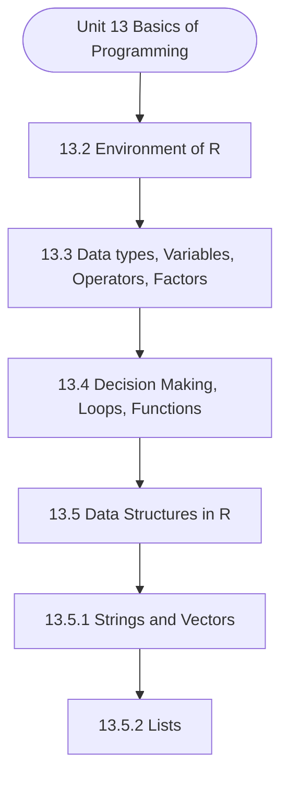

# MCS-068: Predictive Data Analysis
## Unit 13: Basics of Programming

> 📚 **Programme:** M.Sc. (Data Science and Analytics) | **Semester:** Semester 2  
> ⏱️ **Estimated Study Time:** ~19 mins | 📄 **Textbook Pages:** 20 Pages  
> 📥 **Original PDF:** [Download & View Authentic Textbook](../../../pdfs/Semester_2/MCS-068_Predictive_Data_Analysis/Unit-13_Basics_of_Programming.pdf)

---

### 🎯 Executive Concept & Data Science Relevance
In modern data systems and advanced analytics, **Basics of Programming** forms a vital conceptual pillar. Regression analysis estimates relationships between dependent targets and independent explanatory variables. Linear models, regularization penalties, and gradient updates form the computational core of supervised machine learning.

> [!NOTE]
> **Why this matters for your career:** Mastering basics of programming equips you with the foundational principles required to reason mathematically about high-dimensional datasets, evaluate algorithm performance, and avoid statistical pitfalls in production machine learning pipelines.

### 🗺️ Visual Knowledge Architecture
The following concept map illustrates the structural hierarchy and learning trajectory of this module:



### 📖 Core Definitions & Terminology Cards

> 📌 **Ordinary Least Squares (OLS)**  
> - **Formal Definition:** Estimation method that minimizes the sum of squared differences (residuals) between observed values and predictions: $\min_\beta \sum (y_i - \hat{y}_i)^2$.  
> - 💡 **Practical Intuition & Analogy:** *Finding the single line that minimizes total vertical squared distance to all data points.*

> 📌 **Coefficient of Determination ($R^2$)**  
> - **Formal Definition:** The proportion of variance in the dependent variable explained by independent features: $R^2 = 1 - \frac{SS_{\text{res}}}{SS_{\text{tot}}}$. Ranges from 0 to 1.  
> - 💡 **Practical Intuition & Analogy:** *An $R^2 = 0.85$ means 85% of target variability is captured by your model.*

> 📌 **Ridge Regularization ($L_2$)**  
> - **Formal Definition:** Adds squared magnitude penalty to the loss function: $\mathcal{L} + \lambda \sum_{j=1}^p \beta_j^2$. Shrinks weights toward zero to prevent overfitting under multicollinearity.  
> - 💡 **Practical Intuition & Analogy:** *Discourages extreme weight spikes without setting any coefficient entirely to zero.*

> 📌 **Lasso Regularization ($L_1$)**  
> - **Formal Definition:** Adds absolute magnitude penalty to the loss function: $\mathcal{L} + \lambda \sum_{j=1}^p \vert\beta_j\vert$. Drives non-essential coefficients exactly to zero, performing automated feature selection.  
> - 💡 **Practical Intuition & Analogy:** *Selects a sparse subset of impactful features by zeroing out noise variables.*

### ⚡ Governing Mathematical Laws & Formula Cheatsheet
#### 🔹 Simple Linear Regression OLS Parameters
$$
\begin{aligned} \hat{\beta}_1 & = \frac{\sum (x_i - \bar{x})(y_i - \bar{y})}{\sum (x_i - \bar{x})^2} = \frac{\text{Cov}(x, y)}{\text{Var}(x)} \\ \hat{\beta}_0 & = \bar{y} - \hat{\beta}_1 \bar{x} \end{aligned}
$$
- **Explanation:** Closed-form slope and intercept formulas for single-feature linear regression.

#### 🔹 Multiple Linear Regression Normal Equation
$$
\hat{\mathbf{\beta}} = (\mathbf{X}^T \mathbf{X})^{-1} \mathbf{X}^T \mathbf{y}
$$
- **Explanation:** Direct analytic matrix solution for OLS regression weights.

#### 🔹 Ridge Regression Closed-Form Estimator
$$
\hat{\mathbf{\beta}}_{\text{Ridge}} = (\mathbf{X}^T \mathbf{X} + \lambda \mathbf{I})^{-1} \mathbf{X}^T \mathbf{y}
$$
- **Explanation:** Adding $\lambda \mathbf{I}$ ensures invertibility even when $\mathbf{X}^T \mathbf{X}$ is ill-conditioned or collinear.

#### 🔹 Logistic Regression Sigmoid Function
$$
P(Y = 1 \mid X = \mathbf{x}) = \sigma(\mathbf{w}^T \mathbf{x} + b) = \frac{1}{1 + e^{-(\mathbf{w}^T \mathbf{x} + b)}}
$$
- **Explanation:** Maps any real-valued linear score into a calibrated probability interval $[0, 1]$.

### ⚖️ Axiomatic Properties & Governing Laws
The mathematical formulations of this module are anchored by foundational algebraic and structural laws:

- **Gauss-Markov Theorem:** Under standard OLS assumptions, the OLS estimator is BLUE (Best Linear Unbiased Estimator).
- **Orthogonality of Residuals:** $\mathbf{X}^T \mathbf{e} = \mathbf{0} \quad (\text{Residuals are orthogonal to feature space})$
- **Variance Inflation Factor (VIF):** $\text{VIF}_j = \frac{1}{1 - R_j^2} \quad (\text{VIF} > 5 \implies \text{Severe Multicollinearity})$

### 📌 Comprehensive Section-by-Section Study Breakdown
#### `13.2` Environment of R

##### 📘 Theoretical Principles & Pedagogical Exposition
environment can be created within the global environment. The unit also explains about the various types of data associated with the variables that allocate a memory space and store the values that can be manipulated. It also gives the details of the five types of operators in R programming.

It also explains about factors that are the data objects used for organising and storing the data as levels. The concept of decision making has also been discussed in Basic of R Programming detail that requires the programmer to specify one or more conditions to be evaluated or tested by the program.

It gives the details of a function in R that is a set of instructions that is required to execute a command to achieve a task in R. There are several built-in functions available in R. Further, users may create a function based on their requirements. The concept of matrices, arrays, dataframes etc have also been discussed in detail.


##### ⚙️ Mathematical & Algorithmic Mechanics
- **Core Mechanism:** Establishes analytical principles and computational workflows for basics of programming.
- **Boundary Conditions:** Missing data values, extreme outliers, and non-standard data types.

##### 📊 Practical Data Science & Production Relevance
- **Production Workflow:** End-to-end data science processing stacks (Pandas, Scikit-learn, PyTorch).
- **Real-World Pitfall:** Failing to validate inputs before feeding data into production analytics pipelines.

> [!TIP]
> **Exam & Technical Interview Insight:** Define key concepts in environment of r and articulate practical applications in real-world scenarios.

#### `13.3` Data types, Variables, Operators, Factors

##### 📘 Theoretical Principles & Pedagogical Exposition
FACTORS Every variable in R has an associated data type, which is known as the reserved memory. This reserved memory is needed for storing the values. Given below is a list of basic data types available in R programming: DATA TYPE Allowable Values Integer Values from the Set of Integers, Z Numeric Values from the Set of Real Numbers, R Complex Values from the Set of Complex numbers, C Logical Only allowable values are True ; False Character Possible values are -“x”, “@”, “1”, etc.

Table 1: Basic Data Types Numeric Datatype: Decimal values are known to be numeric in R and is the default datatype for any number in R. Whenever a number is stored in R, it gets converted into a decimal type with at least 2 decimal points or the “double” value. So, if you enter a normal integer value also, for example 10, then the R interpreter will convert it into double i.e.


##### ⚙️ Mathematical & Algorithmic Mechanics
- **Core Mechanism:** Establishes analytical principles and computational workflows for basics of programming.
- **Boundary Conditions:** Missing data values, extreme outliers, and non-standard data types.

##### 📊 Practical Data Science & Production Relevance
- **Production Workflow:** End-to-end data science processing stacks (Pandas, Scikit-learn, PyTorch).
- **Real-World Pitfall:** Failing to validate inputs before feeding data into production analytics pipelines.

> [!TIP]
> **Exam & Technical Interview Insight:** Define key concepts in data types, variables, operators, factors and articulate practical applications in real-world scenarios.

#### `13.4` Decision Making, Loops, Functions

##### 📘 Theoretical Principles & Pedagogical Exposition
Decision making requires the programmer to specify one or more conditions which will be evaluated or tested by the program, along with the statements to be executed if the condition is determined to be true, and optional statements to be executed if the condition is determined to be false.

Given below is the general form of a typical decision making structure found in most of the programming languages– The format of if statement in R is as follows: if (conditional statement, may include relational and logical operator) { R statements to be executed, if the conditional statement is true } else { R statements to be executed, if the conditional statement is FALSE Condition If condition is true If condition is false Conditional code } You may use else if instead of else LOOPS: A loop is defined as a situation where we need to execute a block of code several times.

In the case of loops, the statements are executed sequentially. Loop Type and Description: ● Repeat loop: Executes sequence of statements multiple times. ● While loop: Repeat a given statement while the given condition is true, executes before executing the loop body. Syntax: Example: If condition is false Conditional code Condition If condition is true Basic of R Programming ● For loop: Like while statement, executes the test condition at the end of the loop body.


##### ⚙️ Mathematical & Algorithmic Mechanics
- **Core Mechanism:** A function $f: A \to B$ maps each domain element to exactly one codomain element. Injections guarantee unique mappings ($f(a)=f(b) \implies a=b$); surjections cover the entire codomain; bijections admit two-sided inverses $f^{-1}: B \to A$.
- **Boundary Conditions:** Division by zero singularities, non-injective hash collisions in hash tables, and undefined out-of-domain evaluation.

##### 📊 Practical Data Science & Production Relevance
- **Production Workflow:** Feature transformations $X \mapsto \phi(X)$, hash functions in distributed partitions, non-linear activation functions (ReLU, Sigmoid, Softmax), and invertible normalizing flows.
- **Real-World Pitfall:** Applying inverse transformations to non-injective functions, creating multi-valued ambiguities or silent data destruction.

> [!TIP]
> **Exam & Technical Interview Insight:** In exams, demonstrate injectivity by showing $f(x_1) = f(x_2) \implies x_1 = x_2$, and surjectivity by expressing domain variable $x$ in terms of codomain target $y$.

#### `13.5` Data Structures in R

##### 📘 Theoretical Principles & Pedagogical Exposition
R’s basic data structures include Vector, Strings, Lists, Frames, Matrices and Arrays.


##### ⚙️ Mathematical & Algorithmic Mechanics
- **Core Mechanism:** Establishes analytical principles and computational workflows for basics of programming.
- **Boundary Conditions:** Missing data values, extreme outliers, and non-standard data types.

##### 📊 Practical Data Science & Production Relevance
- **Production Workflow:** End-to-end data science processing stacks (Pandas, Scikit-learn, PyTorch).
- **Real-World Pitfall:** Failing to validate inputs before feeding data into production analytics pipelines.

> [!TIP]
> **Exam & Technical Interview Insight:** Define key concepts in data structures in r and articulate practical applications in real-world scenarios.

#### `13.5.1` Strings and Vectors

##### 📘 Theoretical Principles & Pedagogical Exposition
Vectors: A vector is a one-dimensional array of data elements that have the same data type. The most basic data structures are the Vectors, which supports logical, integer, double, complex, character data types. Strings: Any value written within a pair of single quotes or double quotes in R is treated as a string.

Internally R stores every string within double quotes, even when you create them with a single quote. Rules Applied in String Construction ● The quotes at the beginning and end of a string should be either both double quotes or both single quotes. They cannot be mixed. ● Double quotes can be inserted into a string starting and ending with a single quote.

● Single quote can be inserted into a string starting and ending with double quotes. ● Double quotes cannot be inserted into a string starting and ending with double quotes. ● Single quote cannot be inserted into a string starting and ending with a single quote. Basic of R Programming Length of String: The length of strings tells the number of characters in a string.


##### ⚙️ Mathematical & Algorithmic Mechanics
- **Core Mechanism:** Linear transformations represented by $A \in \mathbb{R}^{m \times n}$. Matrix invertibility requires non-zero determinant $\det(A) \neq 0$ and full column/row rank. Eigen-decomposition $A v = \lambda v$ identifies invariant directional axes and scaling factors.
- **Boundary Conditions:** Singular matrices (det = 0), ill-conditioned matrices with condition number $\kappa(A) \gg 1$, and rank deficiency under collinear feature dimensions.

##### 📊 Practical Data Science & Production Relevance
- **Production Workflow:** Principal Component Analysis (PCA covariance decomposition), Ordinary Least Squares (OLS) normal equations $(X^T X)^{-1} X^T y$, and embedding projection transformations in transformers.
- **Real-World Pitfall:** Inverting ill-conditioned matrices directly instead of using singular value decomposition (SVD) or QR decomposition, triggering catastrophic floating-point cancellation.

> [!TIP]
> **Exam & Technical Interview Insight:** Practice row reduction to Row Echelon Form (REF) to find matrix rank, determinant expansion by minors, and computing characteristic equations $\det(A - \lambda I) = 0$.

#### `13.5.2` Lists

##### 📘 Theoretical Principles & Pedagogical Exposition
Lists are the objects in R that contain different types of objects within itself like number, string, vectors or even another list, matrix or any function as its element It is created by calling list() function.


##### ⚙️ Mathematical & Algorithmic Mechanics
- **Core Mechanism:** Establishes analytical principles and computational workflows for basics of programming.
- **Boundary Conditions:** Missing data values, extreme outliers, and non-standard data types.

##### 📊 Practical Data Science & Production Relevance
- **Production Workflow:** End-to-end data science processing stacks (Pandas, Scikit-learn, PyTorch).
- **Real-World Pitfall:** Failing to validate inputs before feeding data into production analytics pipelines.

> [!TIP]
> **Exam & Technical Interview Insight:** Define key concepts in lists and articulate practical applications in real-world scenarios.

#### `13.5.3` Matrices, Arrays and Frames

##### 📘 Theoretical Principles & Pedagogical Exposition
Matrices are R objects which are arranged in 2-D layout. They contain elementsof the same type. The basic syntax of creating a matrix in R is: matrix(data, nrow, ncol, byrow, dimnames), where data is the name of input vector, nrow is no of rows, ncol is no of columns, byrow is to specify either row matrix or column matrix and dimnameis the name assigned to rows and columns.

Accessing the elements of the matrix: Elements of a matrix can be accessed by specifying the row and column number. Matrix Manipulations: Mathematical operations can be performed on the matrix like addition, subtraction, multiplication and division. You may please note that matrix division is not defined mathematically, but in R each element of a matrix is divided by the corresponding element of another matrix.

Basic of R Programming Arrays: An array is a data object in R that can store multidimensional data that have the same data type. It is used using the array() function and can accept vectors as an input. An array is created using the values passed in the dim parameter. For instance, an array is created with dimensions (2,3,5); then R would create 5 rectangular matrices consisting of 2 rows and 3 columns each.


##### ⚙️ Mathematical & Algorithmic Mechanics
- **Core Mechanism:** Establishes analytical principles and computational workflows for basics of programming.
- **Boundary Conditions:** Missing data values, extreme outliers, and non-standard data types.

##### 📊 Practical Data Science & Production Relevance
- **Production Workflow:** End-to-end data science processing stacks (Pandas, Scikit-learn, PyTorch).
- **Real-World Pitfall:** Failing to validate inputs before feeding data into production analytics pipelines.

> [!TIP]
> **Exam & Technical Interview Insight:** Define key concepts in matrices, arrays and frames and articulate practical applications in real-world scenarios.

#### `13.2` ENVIRONMENT OF R

##### 📘 Theoretical Principles & Pedagogical Exposition
environment can be created within the global environment. The unit also explains about the various types of data associated with the variables that allocate a memory space and store the values that can be manipulated. It also gives the details of the five types of operators in R programming.

It also explains about factors that are the data objects used for organising and storing the data as levels. The concept of decision making has also been discussed in Basic of R Programming detail that requires the programmer to specify one or more conditions to be evaluated or tested by the program.

It gives the details of a function in R that is a set of instructions that is required to execute a command to achieve a task in R. There are several built-in functions available in R. Further, users may create a function based on their requirements. The concept of matrices, arrays, dataframes etc have also been discussed in detail.


##### ⚙️ Mathematical & Algorithmic Mechanics
- **Core Mechanism:** Establishes analytical principles and computational workflows for basics of programming.
- **Boundary Conditions:** Missing data values, extreme outliers, and non-standard data types.

##### 📊 Practical Data Science & Production Relevance
- **Production Workflow:** End-to-end data science processing stacks (Pandas, Scikit-learn, PyTorch).
- **Real-World Pitfall:** Failing to validate inputs before feeding data into production analytics pipelines.

> [!TIP]
> **Exam & Technical Interview Insight:** Define key concepts in environment of r and articulate practical applications in real-world scenarios.

### 📐 Step-by-Step Solved Mathematical Examples
To solidify your theoretical understanding, work through these fully solved, step-by-step mathematical problems:

#### 🧮 Example 1: Simple Linear Regression OLS Computation
> **Problem Statement:**  
> Given data points $(x, y)$: $(1, 2), (2, 3), (3, 5), (4, 4), (5, 6)$. Compute OLS slope $\hat{\beta}_1$, intercept $\hat{\beta}_0$, and regression line.

**Detailed Step-by-Step Solution:**

1. **Means:** $\bar{x} = 3.0, \; \bar{y} = 4.0$.
2. **Deviations & Products:**
- $(x_1 - \bar{x}) = -2, \; (y_1 - \bar{y}) = -2 \implies (-2)(-2) = 4, \; (-2)^2 = 4$
- $(x_2 - \bar{x}) = -1, \; (y_2 - \bar{y}) = -1 \implies (-1)(-1) = 1, \; (-1)^2 = 1$
- $(x_3 - \bar{x}) = 0, \; (y_3 - \bar{y}) = 1 \implies (0)(1) = 0, \; 0^2 = 0$
- $(x_4 - \bar{x}) = 1, \; (y_4 - \bar{y}) = 0 \implies (1)(0) = 0, \; 1^2 = 1$
- $(x_5 - \bar{x}) = 2, \; (y_5 - \bar{y}) = 2 \implies (2)(2) = 4, \; 2^2 = 4$

3. **Summation:** $\sum (x_i - \bar{x})(y_i - \bar{y}) = 9, \; \sum (x_i - \bar{x})^2 = 10$.

4. **Parameters:**

$$
\hat{\beta}_1 = \frac{9}{10} = 0.90
$$


$$
\hat{\beta}_0 = \bar{y} - \hat{\beta}_1 \bar{x} = 4.0 - 0.9(3.0) = 4.0 - 2.7 = 1.30
$$


Regression Equation: $\hat{y} = 1.30 + 0.90 x$.

#### 🧮 Example 2: Coefficient of Determination $R^2$ Calculation
> **Problem Statement:**  
> For the model above, total sum of squares $SS_{\text{tot}} = 10.0$ and sum of squared residuals $SS_{\text{res}} = 1.90$. Calculate $R^2$ and interpret.

**Detailed Step-by-Step Solution:**


$$
R^2 = 1 - \frac{SS_{\text{res}}}{SS_{\text{tot}}} = 1 - \frac{1.90}{10.0} = 1 - 0.19 = 0.81 \implies 81\%
$$


Interpretation: 81% of the variation in target $y$ is explained by feature $x$.

### 💻 Practical Data Science Implementation (Python)
Theory translates directly into production algorithms. Below is a self-contained, commented Python implementation illustrating the core operations of this unit:

```python
from sklearn.linear_model import LinearRegression, Ridge, Lasso
import numpy as np

# Dataset with multicollinearity
X = np.array([[1, 2], [2, 4.1], [3, 5.9], [4, 8.2], [5, 9.9]])
y = np.array([2.2, 4.1, 6.2, 7.9, 10.1])

# 1. Standard OLS
ols = LinearRegression().fit(X, y)
print("OLS Coefficients:", ols.coef_)

# 2. Ridge (L2 penalty shrinks weights smoothly)
ridge = Ridge(alpha=1.0).fit(X, y)
print("Ridge Coefficients:", ridge.coef_)

# 3. Lasso (L1 penalty induces sparsity)
lasso = Lasso(alpha=0.1).fit(X, y)
print("Lasso Coefficients (Sparse):", lasso.coef_)
```

### 💡 Interactive Self-Assessment Checkpoints
Test your comprehension before proceeding. Tap each question to reveal the comprehensive explanation:

<details>
<summary><b>Checkpoint 1:</b> What are various Operators in R? …………………………………………………………………………… …………………………………………………………………………… <i>(Tap to reveal answer)</i></summary>

> **Answer & Analysis:**  
> **Detailed Analytical Solution:**
> 
> 1. **Core Principle:** Identify the governing theorem or definition for Basics of Programming.
> 2. **Step-by-Step Derivation:** Verify all preconditions and compute intermediate steps methodically.
> 3. **Conclusion:** State the final mathematical proof or calculation clearly, validating boundary edge cases.
</details>

<details>
<summary><b>Checkpoint 2:</b> What does %*% operator do? ……………………………………………………………………………. ……………………………………………………………………………… <i>(Tap to reveal answer)</i></summary>

> **Answer & Analysis:**  
> **Detailed Analytical Solution:**
> 
> 1. **Core Principle:** Identify the governing theorem or definition for Basics of Programming.
> 2. **Step-by-Step Derivation:** Verify all preconditions and compute intermediate steps methodically.
> 3. **Conclusion:** State the final mathematical proof or calculation clearly, validating boundary edge cases.
</details>

<details>
<summary><b>Checkpoint 3:</b> Is .5Var a valid variable name? Give reason in support of your answer. ……………………………………………………………………………… ……………………………………………………………………………… <i>(Tap to reveal answer)</i></summary>

> **Answer & Analysis:**  
> **Detailed Analytical Solution:**
> 
> 1. **Core Principle:** Identify the governing theorem or definition for Basics of Programming.
> 2. **Step-by-Step Derivation:** Verify all preconditions and compute intermediate steps methodically.
> 3. **Conclusion:** State the final mathematical proof or calculation clearly, validating boundary edge cases.
</details>

<details>
<summary><b>Checkpoint 4:</b> What is the function used for adding datasets in R? ………………………………………………………………………………… ………………………………………………………………………………… <i>(Tap to reveal answer)</i></summary>

> **Answer & Analysis:**  
> **Detailed Analytical Solution:**
> 
> 1. **Core Principle:** Identify the governing theorem or definition for Basics of Programming.
> 2. **Step-by-Step Derivation:** Verify all preconditions and compute intermediate steps methodically.
> 3. **Conclusion:** State the final mathematical proof or calculation clearly, validating boundary edge cases.
</details>

<details>
<summary><b>Checkpoint 5:</b> What is the key difference between Ridge ($L_2$) and Lasso ($L_1$) regression? <i>(Tap to reveal answer)</i></summary>

> **Answer & Analysis:**  
> Ridge shrinks coefficients continuously toward zero without zeroing them out, whereas Lasso drives coefficients to exactly zero, producing sparse models and automated feature selection.
</details>

<details>
<summary><b>Checkpoint 6:</b> What is the matrix Normal Equation for Ordinary Least Squares? <i>(Tap to reveal answer)</i></summary>

> **Answer & Analysis:**  
> $\hat{\mathbf{\beta}} = (\mathbf{X}^T \mathbf{X})^{-1} \mathbf{X}^T \mathbf{y}$
</details>

### 🎯 Executive Module Wrap-Up
- **Central Idea:** Basics of Programming provides essential mathematical and algorithmic tools directly utilized in Data Science.
- **Mathematical Rigor:** Formulas and laws must be memorized with attention to boundary conditions and assumptions.
- **Full Textbook Coverage:** For exhaustive multi-page derivations, proofs, and supplementary exercises, consult the [Authentic IGNOU Textbook](../../../pdfs/Semester_2/MCS-068_Predictive_Data_Analysis/Unit-13_Basics_of_Programming.pdf).

---
### 🧭 Navigation & Syllabus Index
[⬅ Previous: Unit 12](unit_12_Performance_Evaluation_Measures.md) | [📑 Course Index](README.md) | [Next: Unit 14 ➡](unit_14_Data_Interfacing_and_Visualisation_in_R.md)
