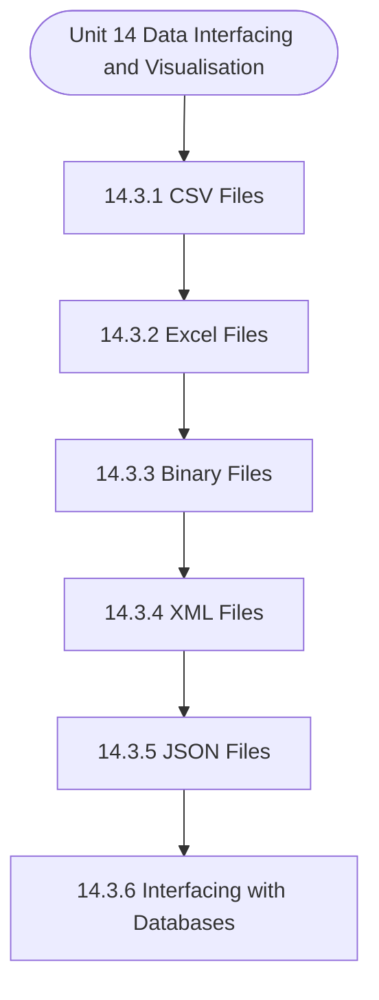

# MCS-068: Predictive Data Analysis
## Unit 14: Data Interfacing and Visualisation in R

> 📚 **Programme:** M.Sc. (Data Science and Analytics) | **Semester:** Semester 2  
> ⏱️ **Estimated Study Time:** ~19 mins | 📄 **Textbook Pages:** 16 Pages  
> 📥 **Original PDF:** [Download & View Authentic Textbook](../../../pdfs/Semester_2/MCS-068_Predictive_Data_Analysis/Unit-14_Data_Interfacing_and_Visualisation_in_R.pdf)

---

### 🎯 Executive Concept & Data Science Relevance
In modern data systems and advanced analytics, **Data Interfacing and Visualisation in R** forms a vital conceptual pillar. Descriptive statistics provide quantitative summaries of dataset properties. Measures of central tendency identify typical values, while measures of dispersion quantify data spread, uncertainty, and variability—critical for feature normalization and anomaly detection.

> [!NOTE]
> **Why this matters for your career:** Mastering data interfacing and visualisation in r equips you with the foundational principles required to reason mathematically about high-dimensional datasets, evaluate algorithm performance, and avoid statistical pitfalls in production machine learning pipelines.

### 🗺️ Visual Knowledge Architecture
The following concept map illustrates the structural hierarchy and learning trajectory of this module:



### 📖 Core Definitions & Terminology Cards

> 📌 **Arithmetic Mean $\bar{x}$ or $\mu$**  
> - **Formal Definition:** The sum of all observations divided by the total number of observations: $\bar{x} = \frac{1}{n}\sum_{i=1}^n x_i$. Sensitive to extreme outliers.  
> - 💡 **Practical Intuition & Analogy:** *The center of mass or balance point of the distribution.*

> 📌 **Median**  
> - **Formal Definition:** The physical middle value separating the higher half from the lower half of an ordered dataset. Robust against outliers.  
> - 💡 **Practical Intuition & Analogy:** *The 50th percentile value where exactly half the data lies above and half below.*

> 📌 **Standard Deviation $\sigma$ or $s$**  
> - **Formal Definition:** The square root of variance, measuring average dispersion in original units: $s = \sqrt{\frac{1}{n-1}\sum (x_i - \bar{x})^2}$.  
> - 💡 **Practical Intuition & Analogy:** *The typical distance data points deviate from the mean.*

> 📌 **Coefficient of Variation ($CV$)**  
> - **Formal Definition:** Relative dispersion measure expressed as a percentage: $CV = \frac{\sigma}{\mu} \times 100\%$. Enables comparison across different measurement scales.  
> - 💡 **Practical Intuition & Analogy:** *Comparing stock volatility across assets priced at 10 USD vs 1,000 USD.*

### ⚡ Governing Mathematical Laws & Formula Cheatsheet
#### 🔹 Sample Variance Formula (Bessel's Correction)
$$
\begin{aligned} s^2 & = \frac{1}{n - 1} \sum_{i=1}^n (x_i - \bar{x})^2 \\ & = \frac{\sum x_i^2 - \frac{(\sum x_i)^2}{n}}{n - 1} \end{aligned}
$$
- **Explanation:** Using $n-1$ in the denominator corrects for downward sample bias, yielding an unbiased estimator of population variance $\sigma^2$.

#### 🔹 Interquartile Range (IQR) & Outlier Bounds
$$
\text{IQR} = Q_3 - Q_1, \quad \text{Outliers} < Q_1 - 1.5(\text{IQR}) \;\lor\; > Q_3 + 1.5(\text{IQR})
$$
- **Explanation:** Standard Tukey boxplot rule for identifying extreme data points robustly.

#### 🔹 Pearson's First Coefficient of Skewness
$$
Sk_1 = \frac{\text{Mean} - \text{Mode}}{\sigma} \quad \text{or} \quad Sk_2 = \frac{3(\text{Mean} - \text{Median})}{\sigma}
$$
- **Explanation:** Measures asymmetry: Positive skew means mean > median (right tail); negative skew means mean < median (left tail).

### ⚖️ Axiomatic Properties & Governing Laws
The mathematical formulations of this module are anchored by foundational algebraic and structural laws:

- **Variance Scaling Rule:** $\text{Var}(aX + b) = a^2 \text{Var}(X)$
- **Standard Deviation Scaling:** $\sigma(aX + b) = \vert a\vert \sigma(X)$
- **Empirical Rule (Normal Distribution):** 68% within $\mu \pm 1\sigma$, 95% within $\mu \pm 2\sigma$, 99.7% within $\mu \pm 3\sigma$

### 📌 Comprehensive Section-by-Section Study Breakdown
#### `14.3` Reading Data From Files

##### 📘 Theoretical Principles & Pedagogical Exposition
A binary file is one that solely includes data in the form of bits and bytes. When you try to read a binary file, the sequence of bits is translated as bytes or characters, which include numerous other non-printable characters that are not human readable. Any text editor that tries to read a binary file will display characters like Ø , ð, printable characters and many other characters including beeps.

R has two functions writeBin() and readBin() to create and read binary files. Syntax: writeBin(object, con) readBin(con, what, n ) where, ● The connection object con is used to read or write a binary file. ● The binary file to be written is the object. ● The mode that represents the bytes to be read, such as character, integer, etc is what.

● The number of bytes to read from the binary file is given by n. Writing the Binary File(You should read the comments for explanation on each command.) Figure 14.4: An example of Writing data to a Binary file Reading the Binary File(You should read the comments for explanation on each command.) Figure 14.5: An example of Reading data to a Binary file


##### ⚙️ Mathematical & Algorithmic Mechanics
- **Core Mechanism:** Establishes analytical principles and computational workflows for data interfacing and visualisation in r.
- **Boundary Conditions:** Missing data values, extreme outliers, and non-standard data types.

##### 📊 Practical Data Science & Production Relevance
- **Production Workflow:** End-to-end data science processing stacks (Pandas, Scikit-learn, PyTorch).
- **Real-World Pitfall:** Failing to validate inputs before feeding data into production analytics pipelines.

> [!TIP]
> **Exam & Technical Interview Insight:** Define key concepts in reading data from files and articulate practical applications in real-world scenarios.

#### `14.3.1` CSV Files

##### 📘 Theoretical Principles & Pedagogical Exposition
In probability theory and statistical inference, **CSV Files** formalizes the stochastic behavior of random phenomena. Within **Data Interfacing and Visualisation in R**, this framework allows data scientists to infer population parameters from finite empirical samples while quantifying uncertainty via confidence intervals and hypothesis tests.

The mathematical rigor here prevents statistical misinterpretations, such as confusing correlation with causation, overlooking sample selection bias, or violating distributional assumptions.

##### ⚙️ Mathematical & Algorithmic Mechanics
- **Core Mechanism:** Establishes analytical principles and computational workflows for data interfacing and visualisation in r.
- **Boundary Conditions:** Missing data values, extreme outliers, and non-standard data types.

##### 📊 Practical Data Science & Production Relevance
- **Production Workflow:** End-to-end data science processing stacks (Pandas, Scikit-learn, PyTorch).
- **Real-World Pitfall:** Failing to validate inputs before feeding data into production analytics pipelines.

> [!TIP]
> **Exam & Technical Interview Insight:** Define key concepts in csv files and articulate practical applications in real-world scenarios.

#### `14.3.2` Excel Files

##### 📘 Theoretical Principles & Pedagogical Exposition
In probability theory and statistical inference, **Excel Files** formalizes the stochastic behavior of random phenomena. Within **Data Interfacing and Visualisation in R**, this framework allows data scientists to infer population parameters from finite empirical samples while quantifying uncertainty via confidence intervals and hypothesis tests.

The mathematical rigor here prevents statistical misinterpretations, such as confusing correlation with causation, overlooking sample selection bias, or violating distributional assumptions.

##### ⚙️ Mathematical & Algorithmic Mechanics
- **Core Mechanism:** Establishes analytical principles and computational workflows for data interfacing and visualisation in r.
- **Boundary Conditions:** Missing data values, extreme outliers, and non-standard data types.

##### 📊 Practical Data Science & Production Relevance
- **Production Workflow:** End-to-end data science processing stacks (Pandas, Scikit-learn, PyTorch).
- **Real-World Pitfall:** Failing to validate inputs before feeding data into production analytics pipelines.

> [!TIP]
> **Exam & Technical Interview Insight:** Define key concepts in excel files and articulate practical applications in real-world scenarios.

#### `14.3.3` Binary Files

##### 📘 Theoretical Principles & Pedagogical Exposition
A binary file is one that solely includes data in the form of bits and bytes. When you try to read a binary file, the sequence of bits is translated as bytes or characters, which include numerous other non-printable characters that are not human readable. Any text editor that tries to read a binary file will display characters like Ø , ð, printable characters and many other characters including beeps.

R has two functions writeBin() and readBin() to create and read binary files. Syntax: writeBin(object, con) readBin(con, what, n ) where, ● The connection object con is used to read or write a binary file. ● The binary file to be written is the object. ● The mode that represents the bytes to be read, such as character, integer, etc is what.

● The number of bytes to read from the binary file is given by n. Writing the Binary File(You should read the comments for explanation on each command.) Figure 14.4: An example of Writing data to a Binary file Reading the Binary File(You should read the comments for explanation on each command.) Figure 14.5: An example of Reading data to a Binary file


##### ⚙️ Mathematical & Algorithmic Mechanics
- **Core Mechanism:** Establishes analytical principles and computational workflows for data interfacing and visualisation in r.
- **Boundary Conditions:** Missing data values, extreme outliers, and non-standard data types.

##### 📊 Practical Data Science & Production Relevance
- **Production Workflow:** End-to-end data science processing stacks (Pandas, Scikit-learn, PyTorch).
- **Real-World Pitfall:** Failing to validate inputs before feeding data into production analytics pipelines.

> [!TIP]
> **Exam & Technical Interview Insight:** Define key concepts in binary files and articulate practical applications in real-world scenarios.

#### `14.3.4` XML Files

##### 📘 Theoretical Principles & Pedagogical Exposition
XML is an acronym for “extensible markup language”. It is a file format that allows users to share the file format as well as the data over the internet, intranet and other places, as standard ASCII text. XML uses markup tags that describe the meaning of the data stored in the file.

This is similar to the markup tags used in HTML wherein the markup tag describes the structure of the page instead. The "XML" package in R can be used to read an xml file. The following command can be used to install this package: install.packages("XML") Reading XML File R reads the xml file using the function xmlParse().

In R, it is saved as a list. Data Interfacing & Visualization in R Figure 14.6: An example of reading data from a Binary file XML to Data Frame In order to manage the data appropriately in huge files, the data in the xml file can be read as a data frame. The data frame should then be processed for data analysis.


##### ⚙️ Mathematical & Algorithmic Mechanics
- **Core Mechanism:** Establishes analytical principles and computational workflows for data interfacing and visualisation in r.
- **Boundary Conditions:** Missing data values, extreme outliers, and non-standard data types.

##### 📊 Practical Data Science & Production Relevance
- **Production Workflow:** End-to-end data science processing stacks (Pandas, Scikit-learn, PyTorch).
- **Real-World Pitfall:** Failing to validate inputs before feeding data into production analytics pipelines.

> [!TIP]
> **Exam & Technical Interview Insight:** Define key concepts in xml files and articulate practical applications in real-world scenarios.

#### `14.3.5` JSON Files

##### 📘 Theoretical Principles & Pedagogical Exposition
The data in a JSON file is stored as text in a human-readable format. JavaScript Object Notation is abbreviated as JSON. The rjson package in R can read JSON files. Install rjson Package To install the rjson package, type the following command in the R console: install.packages("rjson") Read the JSON File R reads the JSON file using the function fromJSON().

In R, it is saved as a list. Figure 14.8: An example of reading data from JSON file Convert JSON to a Data Frame Using the as.data.frame() function, you can turn the retrieved data above into a R data frame for further study. Figure 14.9: Converting read data to data frame


##### ⚙️ Mathematical & Algorithmic Mechanics
- **Core Mechanism:** Establishes analytical principles and computational workflows for data interfacing and visualisation in r.
- **Boundary Conditions:** Missing data values, extreme outliers, and non-standard data types.

##### 📊 Practical Data Science & Production Relevance
- **Production Workflow:** End-to-end data science processing stacks (Pandas, Scikit-learn, PyTorch).
- **Real-World Pitfall:** Failing to validate inputs before feeding data into production analytics pipelines.

> [!TIP]
> **Exam & Technical Interview Insight:** Define key concepts in json files and articulate practical applications in real-world scenarios.

#### `14.3.6` Interfacing with Databases

##### 📘 Theoretical Principles & Pedagogical Exposition
Data is stored in a normalised way in relational database systems. As a result, you will require quite advanced and complex SQL queries to perform statistical computing. However, R can readily connect to various relational databases, such as MySQL, Oracle, and SQL Server, and retrieve records as a data frame.

Once the data is in the R environment, it becomes a standard R data set that can be modified and analysed with all of R's sophisticated packages and functions. RMySQL Package R contains a built-in package called "RMySQL" that allows you to connect to a MySql database natively. The following command will install this package in the R environment.

install.packages("RMySQL") Connecting R to MySQL Figure 14.10: Connecting to MySQL database Querying the Tables Using the MySQL function dbSendQuery(), you can query the database tables . The query is run in MySQL, and the results are returned with the R fetch() function. Finally, it is saved in R as a data frame.


##### ⚙️ Mathematical & Algorithmic Mechanics
- **Core Mechanism:** Organizes data into mathematical relations with schema constraints. Normalization (1NF $\to$ 2NF $\to$ 3NF $\to$ BCNF) decomposes relations using functional dependencies $X \to Y$ to eliminate insertion, update, and deletion anomalies. ACID guarantees are enforced via Two-Phase Locking (2PL) and Write-Ahead Logging (WAL).
- **Boundary Conditions:** NULL values violating primary key Entity Integrity, dangling foreign key references violating Referential Integrity, lossy table decompositions, and deadlocks in concurrent schedules.

##### 📊 Practical Data Science & Production Relevance
- **Production Workflow:** Production OLTP database schemas, enterprise data warehouse dimensional modeling, SQL query optimizer explain plans, and microservice distributed transactions.
- **Real-World Pitfall:** Over-normalizing analytical (OLAP) schemas causing costly multi-table joins, or selecting inappropriate transaction isolation levels leading to dirty or phantom reads.

> [!TIP]
> **Exam & Technical Interview Insight:** Determine candidate keys using attribute closures $X^+$; test whether a table satisfies 3NF or BCNF; verify lossless join and dependency preservation.

#### `14.3.7` Web Data

##### 📘 Theoretical Principles & Pedagogical Exposition
Many websites make data available for users to consume. The World Health Organization (WHO), for example, provides reports on health and medical information in CSV, txt, and XML formats. You can programmatically extract certain data from such websites using R applications. "RCurl," "XML," and "stringr" are some R packages that are used to scrape data from the web.

They are used to connect to URLs, detect required file links, and download the files to the local environment. Install R Packages For processing the URLs and links to the files, the following packages are necessary. install.packages("RCurl") install.packages("XML") install.packages("stringr") install.packages("plyr")


##### ⚙️ Mathematical & Algorithmic Mechanics
- **Core Mechanism:** Establishes analytical principles and computational workflows for data interfacing and visualisation in r.
- **Boundary Conditions:** Missing data values, extreme outliers, and non-standard data types.

##### 📊 Practical Data Science & Production Relevance
- **Production Workflow:** End-to-end data science processing stacks (Pandas, Scikit-learn, PyTorch).
- **Real-World Pitfall:** Failing to validate inputs before feeding data into production analytics pipelines.

> [!TIP]
> **Exam & Technical Interview Insight:** Define key concepts in web data and articulate practical applications in real-world scenarios.

### 📐 Step-by-Step Solved Mathematical Examples
To solidify your theoretical understanding, work through these fully solved, step-by-step mathematical problems:

#### 🧮 Example 1: Sample Variance and Standard Deviation Computation
> **Problem Statement:**  
> Given sample observations: $X = \lbrace 4, 8, 6, 5, 7 \rbrace$. Compute sample mean $\bar{x}$, sample variance $s^2$, and standard deviation $s$ step-by-step.

**Detailed Step-by-Step Solution:**

1. **Mean:** $\bar{x} = \frac{4 + 8 + 6 + 5 + 7}{5} = \frac{30}{5} = 6$.

2. **Squared deviations:**
- $(4 - 6)^2 = (-2)^2 = 4$
- $(8 - 6)^2 = 2^2 = 4$
- $(6 - 6)^2 = 0^2 = 0$
- $(5 - 6)^2 = (-1)^2 = 1$
- $(7 - 6)^2 = 1^2 = 1$
Sum of squared deviations $= 4 + 4 + 0 + 1 + 1 = 10$.

3. **Sample Variance with Bessel's Correction ($n-1 = 4$):**

$$
s^2 = \frac{10}{5 - 1} = \frac{10}{4} = 2.5
$$


4. **Standard Deviation:** $s = \sqrt{2.5} \approx 1.581$.

#### 🧮 Example 2: Tukey's IQR Outlier Detection Rule
> **Problem Statement:**  
> A customer spend dataset has $Q_1 = 30$ and $Q_3 = 70$. Determine whether transactions of $135$ and $25$ are classified as outliers.

**Detailed Step-by-Step Solution:**

1. **IQR:** $\text{IQR} = Q_3 - Q_1 = 70 - 30 = 40$.
2. **Lower Bound:** $Q_1 - 1.5(\text{IQR}) = 30 - 1.5(40) = 30 - 60 = -30$.
3. **Upper Bound:** $Q_3 + 1.5(\text{IQR}) = 70 + 1.5(40) = 70 + 60 = 130$.

Conclusion:
- Spend of 135 exceeds Upper Bound ($135 > 130$): **Classified as Outlier**.
- Spend of 25 is within $[-30, 130]$: **Normal observation**.

### 💻 Practical Data Science Implementation (Python)
Theory translates directly into production algorithms. Below is a self-contained, commented Python implementation illustrating the core operations of this unit:

```python
import numpy as np
import pandas as pd

# Statistical profiling on production dataset
data = np.array([12, 15, 18, 22, 25, 29, 34, 45, 95])

mean_val = np.mean(data)
median_val = np.median(data)
std_val = np.std(data, ddof=1) # Bessel's correction

q1, q3 = np.percentile(data, [25, 75])
iqr = q3 - q1
outlier_upper = q3 + 1.5 * iqr

outliers = data[data > outlier_upper]

print(f"Mean: {mean_val:.2f} | Median: {median_val:.2f} | Std: {std_val:.2f}")
print(f"IQR: {iqr:.2f} | Upper Bound: {outlier_upper:.2f}")
print(f"Detected Outliers: {outliers}")
```

### 💡 Interactive Self-Assessment Checkpoints
Test your comprehension before proceeding. Tap each question to reveal the comprehensive explanation:

<details>
<summary><b>Checkpoint 1:</b> What is the package used to use JSON Files in R? …………………………………………………………………………. ……………………………………………………………. <i>(Tap to reveal answer)</i></summary>

> **Answer & Analysis:**  
> **Detailed Analytical Solution:**
> 
> 1. **Core Principle:** Identify the governing theorem or definition for Data Interfacing and Visualisation in R.
> 2. **Step-by-Step Derivation:** Verify all preconditions and compute intermediate steps methodically.
> 3. **Conclusion:** State the final mathematical proof or calculation clearly, validating boundary edge cases.
</details>

<details>
<summary><b>Checkpoint 2:</b> What are wb and rb mode while dealing with binary files? …………………………………………………………………………. ……………………………………………………………. <i>(Tap to reveal answer)</i></summary>

> **Answer & Analysis:**  
> **Detailed Analytical Solution:**
> 
> 1. **Core Principle:** Identify the governing theorem or definition for Data Interfacing and Visualisation in R.
> 2. **Step-by-Step Derivation:** Verify all preconditions and compute intermediate steps methodically.
> 3. **Conclusion:** State the final mathematical proof or calculation clearly, validating boundary edge cases.
</details>

<details>
<summary><b>Checkpoint 3:</b> Mention any 2 checklist points used for cleaning/ preparing data? …………………………………………………………………………. ……………………………………………………………. <i>(Tap to reveal answer)</i></summary>

> **Answer & Analysis:**  
> **Detailed Analytical Solution:**
> 
> 1. **Core Principle:** Identify the governing theorem or definition for Data Interfacing and Visualisation in R.
> 2. **Step-by-Step Derivation:** Verify all preconditions and compute intermediate steps methodically.
> 3. **Conclusion:** State the final mathematical proof or calculation clearly, validating boundary edge cases.
</details>

<details>
<summary><b>Checkpoint 4:</b> When you will use histogram and when you will use bar chart in R? <i>(Tap to reveal answer)</i></summary>

> **Answer & Analysis:**  
> **Detailed Analytical Solution:**
> 
> 1. **Core Principle:** Identify the governing theorem or definition for Data Interfacing and Visualisation in R.
> 2. **Step-by-Step Derivation:** Verify all preconditions and compute intermediate steps methodically.
> 3. **Conclusion:** State the final mathematical proof or calculation clearly, validating boundary edge cases.
</details>

<details>
<summary><b>Checkpoint 5:</b> Why is sample variance divided by $n-1$ instead of $n$? <i>(Tap to reveal answer)</i></summary>

> **Answer & Analysis:**  
> Dividing by $n-1$ applies **Bessel's correction**, which removes downward bias caused by using the sample mean $\bar{x}$ instead of the true population mean $\mu$.
</details>

<details>
<summary><b>Checkpoint 6:</b> Which measure of central tendency is most robust to extreme outliers? <i>(Tap to reveal answer)</i></summary>

> **Answer & Analysis:**  
> The **Median**, because it depends on positional rank rather than magnitude summation.
</details>

### 🎯 Executive Module Wrap-Up
- **Central Idea:** Data Interfacing and Visualisation in R provides essential mathematical and algorithmic tools directly utilized in Data Science.
- **Mathematical Rigor:** Formulas and laws must be memorized with attention to boundary conditions and assumptions.
- **Full Textbook Coverage:** For exhaustive multi-page derivations, proofs, and supplementary exercises, consult the [Authentic IGNOU Textbook](../../../pdfs/Semester_2/MCS-068_Predictive_Data_Analysis/Unit-14_Data_Interfacing_and_Visualisation_in_R.pdf).

---
### 🧭 Navigation & Syllabus Index
[⬅ Previous: Unit 13](unit_13_Basics_of_Programming.md) | [📑 Course Index](README.md) | [Next: Unit 15 ➡](unit_15_Data_Analysis_and_R.md)
