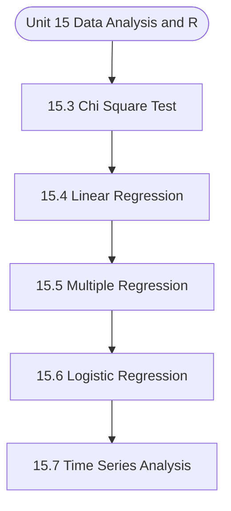

# MCS-068: Predictive Data Analysis
## Unit 15: Data Analysis and R

> 📚 **Programme:** M.Sc. (Data Science and Analytics) | **Semester:** Semester 2  
> ⏱️ **Estimated Study Time:** ~19 mins | 📄 **Textbook Pages:** 12 Pages  
> 📥 **Original PDF:** [Download & View Authentic Textbook](../../../pdfs/Semester_2/MCS-068_Predictive_Data_Analysis/Unit-15_Data_Analysis_and_R.pdf)

---

### 🎯 Executive Concept & Data Science Relevance
In modern data systems, **Data Analysis and R** forms a vital conceptual pillar. Regression analysis estimates relationships between dependent targets and independent explanatory variables. Linear models, regularization penalties, and gradient updates form the computational core of supervised machine learning.

> [!NOTE]
> **Why this matters for your career:** Mastering data analysis and r equips you with the foundational principles required to reason mathematically about high-dimensional datasets, evaluate algorithm performance, and avoid statistical pitfalls in production machine learning pipelines.

### 🗺️ Visual Knowledge Architecture
The following concept map illustrates the structural hierarchy and learning trajectory of this module:



### 📖 Core Definitions & Terminology Cards

> 📌 **Ordinary Least Squares (OLS)**  
> - **Formal Definition:** Estimation method that minimizes the sum of squared differences (residuals) between observed values and predictions: $\min_\beta \sum (y_i - \hat{y}_i)^2$.  
> - 💡 **Practical Intuition & Analogy:** *Finding the single line that minimizes total vertical squared distance to all data points.*

> 📌 **Coefficient of Determination ($R^2$)**  
> - **Formal Definition:** The proportion of variance in the dependent variable explained by independent features: $R^2 = 1 - \frac{SS_{\text{res}}}{SS_{\text{tot}}}$. Ranges from 0 to 1.  
> - 💡 **Practical Intuition & Analogy:** *An $R^2 = 0.85$ means 85% of target variability is captured by your model.*

> 📌 **Ridge Regularization ($L_2$)**  
> - **Formal Definition:** Adds squared magnitude penalty to the loss function: $\mathcal{L} + \lambda \sum_{j=1}^p \beta_j^2$. Shrinks weights toward zero to prevent overfitting under multicollinearity.  
> - 💡 **Practical Intuition & Analogy:** *Discourages extreme weight spikes without setting any coefficient entirely to zero.*

> 📌 **Lasso Regularization ($L_1$)**  
> - **Formal Definition:** Adds absolute magnitude penalty to the loss function: $\mathcal{L} + \lambda \sum_{j=1}^p \vert\beta_j\vert$. Drives non-essential coefficients exactly to zero, performing automated feature selection.  
> - 💡 **Practical Intuition & Analogy:** *Selects a sparse subset of impactful features by zeroing out noise variables.*

### ⚡ Governing Mathematical Laws & Formula Cheatsheet
#### 🔹 Simple Linear Regression OLS Parameters
$$
\begin{aligned} \hat{\beta}_1 & = \frac{\sum (x_i - \bar{x})(y_i - \bar{y})}{\sum (x_i - \bar{x})^2} = \frac{\text{Cov}(x, y)}{\text{Var}(x)} \\ \hat{\beta}_0 & = \bar{y} - \hat{\beta}_1 \bar{x} \end{aligned}
$$
- **Explanation:** Closed-form slope and intercept formulas for single-feature linear regression.

#### 🔹 Multiple Linear Regression Normal Equation
$$
\hat{\mathbf{\beta}} = (\mathbf{X}^T \mathbf{X})^{-1} \mathbf{X}^T \mathbf{y}
$$
- **Explanation:** Direct analytic matrix solution for OLS regression weights.

#### 🔹 Ridge Regression Closed-Form Estimator
$$
\hat{\mathbf{\beta}}_{\text{Ridge}} = (\mathbf{X}^T \mathbf{X} + \lambda \mathbf{I})^{-1} \mathbf{X}^T \mathbf{y}
$$
- **Explanation:** Adding $\lambda \mathbf{I}$ ensures invertibility even when $\mathbf{X}^T \mathbf{X}$ is ill-conditioned or collinear.

#### 🔹 Logistic Regression Sigmoid Function
$$
P(Y = 1 \mid X = \mathbf{x}) = \sigma(\mathbf{w}^T \mathbf{x} + b) = \frac{1}{1 + e^{-(\mathbf{w}^T \mathbf{x} + b)}}
$$
- **Explanation:** Maps any real-valued linear score into a calibrated probability interval $[0, 1]$.

### ⚖️ Axiomatic Properties & Governing Laws
The mathematical formulations of this module are anchored by foundational algebraic and structural laws:

- **Gauss-Markov Theorem:** Under standard OLS assumptions, the OLS estimator is BLUE (Best Linear Unbiased Estimator).
- **Orthogonality of Residuals:** $\mathbf{X}^T \mathbf{e} = \mathbf{0} \quad (\text{Residuals are orthogonal to feature space})$
- **Variance Inflation Factor (VIF):** $\text{VIF}_j = \frac{1}{1 - R_j^2} \quad (\text{VIF} > 5 \implies \text{Severe Multicollinearity})$

### 📌 Comprehensive Section-by-Section Study Breakdown
#### `15.3` Chi Square Test
##### 📘 Theoretical Principles & In-Depth Exposition
Figure 15.3: An example of regression model and residual Input Data Below is the sample data with the observations between weight and height, which is experimentally collected and is input in the Figure 15.4 Figure 15.4: Sample data for linear regression lm() functioncreates the relation model between the variable i.e.

predictor and response. Syntax: lm(formula, data),where formula: presenting the relation between x and y. data: data on which the formula needs to be applied. Figure 15.5 shows the use of this function. Figure 15.5: Use of lm function in linear regression residual Data Analysis and R

##### ⚙️ Mathematical & Algorithmic Mechanics
- **Formal Mechanics:** Establishes symbolic transformations and state invariants governing chi square test.
- **Boundary Invariants:** Ensures robust error-handling, non-empty set guarantees, and strict asymptotic bounds.

##### 📊 Practical Data Science & Production Relevance
- **Industry Application:** Directly implemented in production workflows such as SQL query filters, pandas vectorized operations, and feature transformation pipelines.
- **Production Pitfall:** Failing to verify membership bounds or missing edge cases in chi square test can cause silent data corruption or performance bottlenecks.

> [!TIP]
> **Key Exam & Technical Interview Takeaway:** Be prepared to define chi square test formally, cite its core mathematical invariants, and solve step-by-step numerical/proof questions.

#### `15.4` Linear Regression
##### 📘 Theoretical Principles & In-Depth Exposition
Regression analysis is a common statistical technique for establishing a relationship model between two variables. One of these variables is known as a predictor variable, and its value is derived via experimentation. The response variable, whose value is generated from the predictor variable, is the other variable.

A regression model that employs a straight line to explain the relationship between variables is known as linear regression. In Linear Regression these two variables are related through an equation, where the exponent (power) of both these variables is one. It searches for the value of the regression coefficient(s) that minimises the total error of the model to find the line of best fit through your data.

The general equation for a linear regression is – 𝑦 = 𝑎+ 𝑏 × 𝑥 In the equation given above: ● y is called response/dependent variable, whereas x is an independent/predictor variable. ● The a and b values are the coefficients used in the equation, which are to be predicted. The objective of the regression model is to determine the values of these two constants.

##### ⚙️ Mathematical & Algorithmic Mechanics
- **Formal Mechanics:** Establishes symbolic transformations and state invariants governing linear regression.
- **Boundary Invariants:** Ensures robust error-handling, non-empty set guarantees, and strict asymptotic bounds.

##### 📊 Practical Data Science & Production Relevance
- **Industry Application:** Directly implemented in production workflows such as SQL query filters, pandas vectorized operations, and feature transformation pipelines.
- **Production Pitfall:** Failing to verify membership bounds or missing edge cases in linear regression can cause silent data corruption or performance bottlenecks.

> [!TIP]
> **Key Exam & Technical Interview Takeaway:** Be prepared to define linear regression formally, cite its core mathematical invariants, and solve step-by-step numerical/proof questions.

#### `15.5` Multiple Regression
##### 📘 Theoretical Principles & In-Depth Exposition
The relationship between two or more independent variables and a single dependent variable is estimated using multiple linear regression. When you need to know the following, you can utilize multiple linear regression. ● The degree to which two or more independent variables and one dependent variable are related (e.g.

how baking soda, baking temperature, and amount of flour added affect the taste of cake). ● The dependent variable's value at a given value of the independent variables (e.g. the taste of cake for different amount of baking soda, baking temperature, and flour). The general equation for multiple linear regression is – y = a + b1X1 + b2X2 +...bnXn where, ● y is response variable.

● a, b1, b2...bn are coefficients. ● X1, X2, ...Xn are predictor variables. The lm() function in R is used to generate the regression model. Using the input data, the model calculates the coefficient values. Using these coefficients, you can then predict the value of the response variable for a given collection of predictor variables.

##### ⚙️ Mathematical & Algorithmic Mechanics
- **Formal Mechanics:** Establishes symbolic transformations and state invariants governing multiple regression.
- **Boundary Invariants:** Ensures robust error-handling, non-empty set guarantees, and strict asymptotic bounds.

##### 📊 Practical Data Science & Production Relevance
- **Industry Application:** Directly implemented in production workflows such as SQL query filters, pandas vectorized operations, and feature transformation pipelines.
- **Production Pitfall:** Failing to verify membership bounds or missing edge cases in multiple regression can cause silent data corruption or performance bottlenecks.

> [!TIP]
> **Key Exam & Technical Interview Takeaway:** Be prepared to define multiple regression formally, cite its core mathematical invariants, and solve step-by-step numerical/proof questions.

#### `15.6` Logistic Regression
##### 📘 Theoretical Principles & In-Depth Exposition
In R Programming, logistic regression is a classification algorithm for determining the probability of event success and failure. When the dependent variable is binary (0/1, True/False, Yes/No), logistic regression is utilised. In a binomial distribution, the logit function is utilised as a link function.

Binomial logistic regression is another name for logistic regression. It is based on the sigmoid function, with probability as the output and input ranging from -∞ to +∞.The sigmoid function is given below: 𝑔(𝑧) = ଵ ଵା ௘ష೥ Where 𝑧 = 𝑎 + 𝑏× 𝑥 The general equation for logistic regression is – 𝑔(𝑧) = 1 + 𝑒ି (௔ା௕భ×௫భା௕మ×௫మା௕య×௫యା...) where, y is called as the response variable, and xi are predictors.

The a and bi are coefficients. Data Analysis and R The glm() function is used to construct the regression model. Syntax: glm (formula, data,family) ● The symbol expressing the relationship between the variables is a formula. ● The data set containing the values of these variables is known as data.

##### ⚙️ Mathematical & Algorithmic Mechanics
- **Formal Mechanics:** Establishes symbolic transformations and state invariants governing logistic regression.
- **Boundary Invariants:** Ensures robust error-handling, non-empty set guarantees, and strict asymptotic bounds.

##### 📊 Practical Data Science & Production Relevance
- **Industry Application:** Directly implemented in production workflows such as SQL query filters, pandas vectorized operations, and feature transformation pipelines.
- **Production Pitfall:** Failing to verify membership bounds or missing edge cases in logistic regression can cause silent data corruption or performance bottlenecks.

> [!TIP]
> **Key Exam & Technical Interview Takeaway:** Be prepared to define logistic regression formally, cite its core mathematical invariants, and solve step-by-step numerical/proof questions.

#### `15.7` Time Series Analysis
##### 📘 Theoretical Principles & In-Depth Exposition
A Time Series is any metric that is measured at regular intervals. It entails deriving hidden insights from time-based data (years, days, hours, minutes) in order to make informed decisions. When you have serially associated data, time series models are particularly beneficial. Weather data, stock prices, industry projections, and so on are just a few examples.

A time series is represented as follows: A data point, say (Yt), at a specific time t (indicated by subscript t) is defined as the either sum or product of the following three components: Seasonality (St), Trend (Tt); and Error (et) (also known as, White Noise). Input: Import the data set and then use ts() function.

The steps to use the function are given below. However, it is pertinent to note here that the input values used in this case should ideally be a numeric vector belonging to the “numeric” or “integer” class. The following functions will generate quarterly data series from 1959: ts(inputData, frequency =4, start = c(1959,2)) #frequency 4 => QuarterlyData The following function will generate monthly data series from 1990 ts(1:10, frequency =12, start = 1990) #freq 12 => MonthlyData The following function will generate yearly data series from 2009 to 2014.

##### ⚙️ Mathematical & Algorithmic Mechanics
- **Formal Mechanics:** Establishes symbolic transformations and state invariants governing time series analysis.
- **Boundary Invariants:** Ensures robust error-handling, non-empty set guarantees, and strict asymptotic bounds.

##### 📊 Practical Data Science & Production Relevance
- **Industry Application:** Directly implemented in production workflows such as SQL query filters, pandas vectorized operations, and feature transformation pipelines.
- **Production Pitfall:** Failing to verify membership bounds or missing edge cases in time series analysis can cause silent data corruption or performance bottlenecks.

> [!TIP]
> **Key Exam & Technical Interview Takeaway:** Be prepared to define time series analysis formally, cite its core mathematical invariants, and solve step-by-step numerical/proof questions.

#### `15.3` CHI-SQUARE TEST
##### 📘 Theoretical Principles & In-Depth Exposition
Figure 15.3: An example of regression model and residual Input Data Below is the sample data with the observations between weight and height, which is experimentally collected and is input in the Figure 15.4 Figure 15.4: Sample data for linear regression lm() functioncreates the relation model between the variable i.e.

predictor and response. Syntax: lm(formula, data),where formula: presenting the relation between x and y. data: data on which the formula needs to be applied. Figure 15.5 shows the use of this function. Figure 15.5: Use of lm function in linear regression residual Data Analysis and R

##### ⚙️ Mathematical & Algorithmic Mechanics
- **Formal Mechanics:** Establishes symbolic transformations and state invariants governing chi-square test.
- **Boundary Invariants:** Ensures robust error-handling, non-empty set guarantees, and strict asymptotic bounds.

##### 📊 Practical Data Science & Production Relevance
- **Industry Application:** Directly implemented in production workflows such as SQL query filters, pandas vectorized operations, and feature transformation pipelines.
- **Production Pitfall:** Failing to verify membership bounds or missing edge cases in chi-square test can cause silent data corruption or performance bottlenecks.

> [!TIP]
> **Key Exam & Technical Interview Takeaway:** Be prepared to define chi-square test formally, cite its core mathematical invariants, and solve step-by-step numerical/proof questions.

### 📐 Step-by-Step Solved Mathematical Examples
To solidify your theoretical understanding, work through these fully solved, step-by-step mathematical problems:

#### 🧮 Example 1: Simple Linear Regression OLS Computation
> **Problem Statement:**  
> Given data points $(x, y)$: $(1, 2), (2, 3), (3, 5), (4, 4), (5, 6)$. Compute OLS slope $\hat{\beta}_1$, intercept $\hat{\beta}_0$, and regression line.

**Detailed Step-by-Step Solution:**

1. **Means:** $\bar{x} = 3.0, \; \bar{y} = 4.0$.
2. **Deviations & Products:**
- $(x_1 - \bar{x}) = -2, \; (y_1 - \bar{y}) = -2 \implies (-2)(-2) = 4, \; (-2)^2 = 4$
- $(x_2 - \bar{x}) = -1, \; (y_2 - \bar{y}) = -1 \implies (-1)(-1) = 1, \; (-1)^2 = 1$
- $(x_3 - \bar{x}) = 0, \; (y_3 - \bar{y}) = 1 \implies (0)(1) = 0, \; 0^2 = 0$
- $(x_4 - \bar{x}) = 1, \; (y_4 - \bar{y}) = 0 \implies (1)(0) = 0, \; 1^2 = 1$
- $(x_5 - \bar{x}) = 2, \; (y_5 - \bar{y}) = 2 \implies (2)(2) = 4, \; 2^2 = 4$

3. **Summation:** $\sum (x_i - \bar{x})(y_i - \bar{y}) = 9, \; \sum (x_i - \bar{x})^2 = 10$.

4. **Parameters:**
$$
\hat{\beta}_1 = \frac{9}{10} = 0.90
$$
$$
\hat{\beta}_0 = \bar{y} - \hat{\beta}_1 \bar{x} = 4.0 - 0.9(3.0) = 4.0 - 2.7 = 1.30
$$

Regression Equation: $\hat{y} = 1.30 + 0.90 x$.

#### 🧮 Example 2: Coefficient of Determination $R^2$ Calculation
> **Problem Statement:**  
> For the model above, total sum of squares $SS_{\text{tot}} = 10.0$ and sum of squared residuals $SS_{\text{res}} = 1.90$. Calculate $R^2$ and interpret.

**Detailed Step-by-Step Solution:**

$$
R^2 = 1 - \frac{SS_{\text{res}}}{SS_{\text{tot}}} = 1 - \frac{1.90}{10.0} = 1 - 0.19 = 0.81 \implies 81\%
$$

Interpretation: 81% of the variation in target $y$ is explained by feature $x$.

### 💻 Practical Data Science Implementation (Python)
Theory translates directly into production algorithms. Below is a self-contained, commented Python implementation illustrating the core operations of this unit:

```python
from sklearn.linear_model import LinearRegression, Ridge, Lasso
import numpy as np

# Dataset with multicollinearity
X = np.array([[1, 2], [2, 4.1], [3, 5.9], [4, 8.2], [5, 9.9]])
y = np.array([2.2, 4.1, 6.2, 7.9, 10.1])

# 1. Standard OLS
ols = LinearRegression().fit(X, y)
print("OLS Coefficients:", ols.coef_)

# 2. Ridge (L2 penalty shrinks weights smoothly)
ridge = Ridge(alpha=1.0).fit(X, y)
print("Ridge Coefficients:", ridge.coef_)

# 3. Lasso (L1 penalty induces sparsity)
lasso = Lasso(alpha=0.1).fit(X, y)
print("Lasso Coefficients (Sparse):", lasso.coef_)
```

### 💡 Interactive Self-Assessment Checkpoints
Test your comprehension before proceeding. Tap each question to reveal the comprehensive explanation:

<details>
<summary><b>Checkpoint 1:</b> What is the key difference between Ridge ($L_2$) and Lasso ($L_1$) regression? <i>(Tap to reveal answer)</i></summary>

> **Answer & Analysis:**  
> Ridge shrinks coefficients continuously toward zero without zeroing them out, whereas Lasso drives coefficients to exactly zero, producing sparse models and automated feature selection.
</details>

<details>
<summary><b>Checkpoint 2:</b> What is the matrix Normal Equation for Ordinary Least Squares? <i>(Tap to reveal answer)</i></summary>

> **Answer & Analysis:**  
> $\hat{\mathbf{\beta}} = (\mathbf{X}^T \mathbf{X})^{-1} \mathbf{X}^T \mathbf{y}$
</details>

<details>
<summary><b>Checkpoint 3:</b> What does a high Variance Inflation Factor (VIF > 5) indicate? <i>(Tap to reveal answer)</i></summary>

> **Answer & Analysis:**  
> Severe **multicollinearity**, meaning independent features are highly correlated with each other, destabilizing coefficient estimation.
</details>

<details>
<summary><b>Checkpoint 4:</b> What is linear regression? ………………………………………………………………………….. ………………………………………………………………………….. <i>(Tap to reveal answer)</i></summary>

> **Answer & Analysis:**  
> This question tests your conceptual mastery of Data Analysis and R. Review the governing formulas and section breakdowns above to formulate a complete, rigorous proof or derivation.
</details>

<details>
<summary><b>Checkpoint 5:</b> What do chi-square test answers? …………………………………………………………………………. …………………………………………………………………………. <i>(Tap to reveal answer)</i></summary>

> **Answer & Analysis:**  
> This question tests your conceptual mastery of Data Analysis and R. Review the governing formulas and section breakdowns above to formulate a complete, rigorous proof or derivation.
</details>

<details>
<summary><b>Checkpoint 6:</b> Difference between linear and multiple regression? …………………………………………………………………………. …………………………………………………………………………. <i>(Tap to reveal answer)</i></summary>

> **Answer & Analysis:**  
> This question tests your conceptual mastery of Data Analysis and R. Review the governing formulas and section breakdowns above to formulate a complete, rigorous proof or derivation.
</details>

### 🎯 Executive Module Wrap-Up
- **Central Idea:** Data Analysis and R provides essential mathematical and algorithmic tools directly utilized in Data Science.
- **Mathematical Rigor:** Formulas and laws must be memorized with attention to boundary conditions and assumptions.
- **Full Textbook Coverage:** For exhaustive multi-page derivations, proofs, and supplementary exercises, consult the [Authentic IGNOU Textbook](../../../pdfs/Semester_2/MCS-068_Predictive_Data_Analysis/Unit-15_Data_Analysis_and_R.pdf).

---
### 🧭 Navigation & Syllabus Index
[⬅ Previous: Unit 14](unit_14_Data_Interfacing_and_Visualisation_in_R.md) | [📑 Course Index](README.md) | [Next: Unit 16 ➡](unit_16_Advanced_Analysis_Using_R.md)
