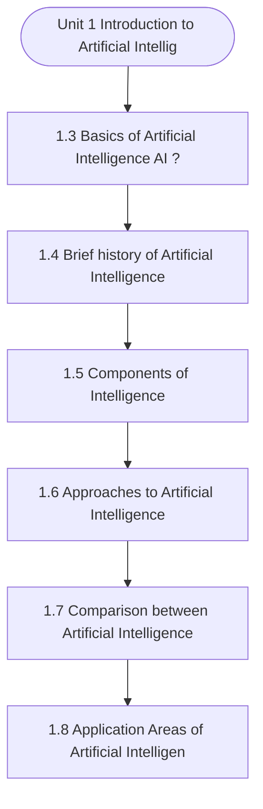

# MCS-224: Artificial Intelligence & Machine Learning
## Unit 1: Introduction to Artificial Intelligence

> 📚 **Programme:** M.Sc. (Data Science and Analytics) | **Semester:** Semester 2  
> ⏱️ **Estimated Study Time:** ~68 mins | 📄 **Textbook Pages:** 30 Pages  
> 📥 **Original PDF:** [Download & View Authentic Textbook](../../../pdfs/Semester_2/MCS-224_Artificial_Intelligence_and_Machine_Learning/Unit-1_Introduction_to_Artificial_Intelligence.pdf)

---

### 🎯 Executive Concept & Data Science Relevance
In modern data systems and advanced analytics, **Introduction to Artificial Intelligence** forms a vital conceptual pillar. Artificial Intelligence models autonomous decision-making, while Machine Learning extracts predictive statistical patterns from data. From A* pathfinding in logistics to Deep Neural Networks powering Computer Vision and LLMs, AI/ML drives modern automated systems.

> [!NOTE]
> **Why this matters for your career:** Mastering introduction to artificial intelligence equips you with the foundational principles required to reason mathematically about high-dimensional datasets, evaluate algorithm performance, and avoid statistical pitfalls in production machine learning pipelines.

### 🗺️ Visual Knowledge Architecture
The following concept map illustrates the structural hierarchy and learning trajectory of this module:



### 📖 Core Definitions & Terminology Cards

> 📌 **A* Search Algorithm**  
> - **Formal Definition:** Best-first graph search evaluating states by $f(n) = g(n) + h(n)$, where $g(n)$ is true cost from start to $n$, and $h(n)$ is heuristic estimate to goal. Guarantees optimal path if $h(n)$ is admissible ( $h(n) \le h^*(n)$ ).  
> - 💡 **Practical Intuition & Analogy:** *Finding the fastest route on GPS navigation without exploring irrelevant directions.*

> 📌 **Entropy and Information Gain**  
> - **Formal Definition:** Entropy $H(S) = -\sum p_i \log_2 p_i$ measures impurity. Information Gain $IG(S, A) = H(S) - \sum \frac{\vert S_v \vert}{\vert S \vert} H(S_v)$ measures reduction in entropy achieved by splitting on feature $A$.  
> - 💡 **Practical Intuition & Analogy:** *The mathematical criterion used by Decision Trees to select the most informative split attribute.*

> 📌 **Support Vector Machine (SVM) Margin**  
> - **Formal Definition:** Linear classifier finding the hyperplane maximizing the geometric margin $\frac{2}{\Vert\mathbf{w}\Vert}$ between classes, subject to $y_i(\mathbf{w}^T \mathbf{x}_i + b) \ge 1$. Non-linear data is separated using Kernel functions $K(\mathbf{x}, \mathbf{z}) = \phi(\mathbf{x})^T \phi(\mathbf{z})$.  
> - 💡 **Practical Intuition & Analogy:** *Finding the widest possible road separating positive and negative data clusters.*

> 📌 **Backpropagation Algorithm**  
> - **Formal Definition:** Iterative parameter optimization in neural networks utilizing the multivariate chain rule to propagate error gradients backwards from the loss function to update synaptic weights: $w_{ij} \leftarrow w_{ij} - \alpha \frac{\partial \mathcal{L}}{\partial w_{ij}}$.  
> - 💡 **Practical Intuition & Analogy:** *Automated blame assignment: adjusting each internal weight proportionally to how much it contributed to prediction error.*

### ⚡ Governing Mathematical Laws & Formula Cheatsheet
#### 🔹 A* Heuristic Evaluation Function
$$
f(n) = g(n) + h(n) \quad \text{Admissibility: } 0 \le h(n) \le h^*(n)
$$
- **Explanation:** If $h(n)$ never overestimates true remaining cost, A* tree search is guaranteed to return the optimal shortest path.

#### 🔹 Shannon Entropy Formula
$$
H(S) = -\sum_{i=1}^c p_i \log_2 p_i \quad \text{Gini Impurity: } 1 - \sum_{i=1}^c p_i^2
$$
- **Explanation:** Measures disorder in classification distributions; equals 0 when all samples belong to one class.

#### 🔹 Gradient Descent Weight Update Rule
$$
\mathbf{w}^{(t+1)} = \mathbf{w}^{(t)} - \alpha \nabla_{\mathbf{w}} \mathcal{L}(\mathbf{w})
$$
- **Explanation:** Stepping parameter vector opposite to the gradient vector scaled by learning rate $\alpha$.

#### 🔹 Neural Network Output Softmax Function
$$
\text{Softmax}(z_i) = \frac{e^{z_i}}{\sum_{j=1}^K e^{z_j}}
$$
- **Explanation:** Normalizes $K$ arbitrary logit outputs into a valid multi-class probability distribution summing to 1.

### ⚖️ Axiomatic Properties & Governing Laws
The mathematical formulations of this module are anchored by foundational algebraic and structural laws:

- **Heuristic Consistency Condition:** $h(n) \le c(n, a, n') + h(n') \implies \text{Monotonic (Guarantees A* optimality on graphs)}$
- **SVM Dual Formulation:** $\max_\alpha \sum \alpha_i - \frac{1}{2}\sum \alpha_i \alpha_j y_i y_j K(\mathbf{x}_i, \mathbf{x}_j)$
- **Universal Approximation Theorem:** A feedforward network with one non-linear hidden layer can approximate any continuous function on compact subsets of $\mathbb{R}^n$.

### 📌 Comprehensive Section-by-Section Study Breakdown
#### `1.3` Basics of Artificial Intelligence (AI)?

##### 📘 Theoretical Principles & Pedagogical Exposition
Knowledge and intelligence are two important concepts, and we were able to gain an understanding of the fundamental distinction between the two terms. Now that we have your attention, let's talk about what artificial intelligence actually is. The following is a list of eight definitions of artificial intelligence that have been provided by well-known authors of artificial intelligence textbooks.

1) According to Haugeland in 1985, "The Exciting New Effort to Make Computers Think... Machines with Minds, in the Full and Literal Sense," 2) According to Bellman, "the automation of behaviours that we connect with human thinking, activities such as decision-making, problem-solving, and learning..." 1978 3) "The study of mental capabilities through the application of computer models," (also known as "The Study of Mental Capabilities"), Charniak and McDermott's 1985.

4) According to Winston (1992), "the study of the calculations that make it possible to perceive, reason, and act." 5) "The art of building machines that execute functions that demand intellect when performed by people," as defined by Kurzweil in the year 1990. 5) "The art of building machines that execute functions that demand intellect when performed by people," as defined by Kurzweil in the year 1990.


##### ⚙️ Mathematical & Algorithmic Mechanics
- **Core Mechanism:** Establishes analytical principles and computational workflows for introduction to artificial intelligence.
- **Boundary Conditions:** Missing data values, extreme outliers, and non-standard data types.

##### 📊 Practical Data Science & Production Relevance
- **Production Workflow:** End-to-end data science processing stacks (Pandas, Scikit-learn, PyTorch).
- **Real-World Pitfall:** Failing to validate inputs before feeding data into production analytics pipelines.

> [!TIP]
> **Exam & Technical Interview Insight:** Define key concepts in basics of artificial intelligence (ai)? and articulate practical applications in real-world scenarios.

#### `1.4` Brief history of Artificial Intelligence

##### 📘 Theoretical Principles & Pedagogical Exposition
AI's ideas come from early research into how people learn and think. Also very old is the idea that a computer could act like a person. Greek mythology is where the idea of machines that can think for themselves comes from. • Aristotle, who lived from 384 BC to 322 BC, made a syllogistic logic system that was not formal.

This is where the first formal system of deductive reasoning got its start. At the start of the 17th century, Descartes said that animal bodies are just complex machines. • Pascal made the first mechanical digital calculator in the year 1642. Introduction to Artificial Intelligence In the 1800s, George Boole came up with a number system called "binary algebra" that showed (some) "laws of thought." • Charles Babbage and Ada Byron worked on programmable mechanical calculators.

In the late 19th century and early 20th century, mathematicians and philosophers like Gottlob Frege, Bertram Russell, Alfred North Whitehead, and Kurt Godel built on Boole's first ideas about logic to make mathematical representations of logic problems. When electronic computers came along, it was a big step forward in how we could study intelligence.


##### ⚙️ Mathematical & Algorithmic Mechanics
- **Core Mechanism:** Establishes analytical principles and computational workflows for introduction to artificial intelligence.
- **Boundary Conditions:** Missing data values, extreme outliers, and non-standard data types.

##### 📊 Practical Data Science & Production Relevance
- **Production Workflow:** End-to-end data science processing stacks (Pandas, Scikit-learn, PyTorch).
- **Real-World Pitfall:** Failing to validate inputs before feeding data into production analytics pipelines.

> [!TIP]
> **Exam & Technical Interview Insight:** Define key concepts in brief history of artificial intelligence and articulate practical applications in real-world scenarios.

#### `1.5` Components of Intelligence

##### 📘 Theoretical Principles & Pedagogical Exposition
According to the dominant school of thought in psychology, human intelligence should not be viewed as a singular talent or cognitive process but rather as a collection of distinct components. The majority of attention in the field of artificial intelligence research has been paid to the following aspects of intelligence: learning, reasoning, problem-solving, perception, and language comprehension.

Learning: There are numerous approaches to develop a learning system. Making mistakes is the simplest way to learn. A basic software that solves "mate in one" chess issues, for example, might test different moves until it finds one that answers the problem. The programme remembers which move worked so that the next time the computer is given the identical situation, it can provide an immediate response.

The simple act of memorising things like answers to problems, words in a vocabulary list, and so on is known as "rote learning" or memorization. We'll talk about another classification that doesn't depend on the way knowledge is represented or how it is represented. According to this system, there are five ways to learn:(ii) (i) Rote Learning or memorising.


##### ⚙️ Mathematical & Algorithmic Mechanics
- **Core Mechanism:** Establishes analytical principles and computational workflows for introduction to artificial intelligence.
- **Boundary Conditions:** Missing data values, extreme outliers, and non-standard data types.

##### 📊 Practical Data Science & Production Relevance
- **Production Workflow:** End-to-end data science processing stacks (Pandas, Scikit-learn, PyTorch).
- **Real-World Pitfall:** Failing to validate inputs before feeding data into production analytics pipelines.

> [!TIP]
> **Exam & Technical Interview Insight:** Define key concepts in components of intelligence and articulate practical applications in real-world scenarios.

#### `1.6` Approaches to Artificial Intelligence

##### 📘 Theoretical Principles & Pedagogical Exposition
INTELLIGENCE In the previous sections of this unit, we learned about various concepts of Artificial Intelligence but now the question is “how do we measure if Artificial Intelligence is making a machine to behave or act or perform like human being or not?” Perhaps, in the future, we will reach a point where AI can behave like humans, but what guarantees do we have that this will continue?

Is it possible to make a system that acts like a human to test the certainty of Artificial Intelligence? " The following approaches constitute the foundation for evaluating an AI entity's human-likeness: • Turing Test • Approach of The Cognitive Modelling Introduction to Artificial Intelligence • Approach of The Law of Thought • Approach of The Rational Agent Let’s take a look at how these approaches perform: In the past, researchers have worked hard to reach all four of these goals.

But it is hard to find a good balance between approaches that focus on people and approaches that focus on logic. People are often "irrational" in the sense of being "emotionally unstable," so it's important to tell the difference between human and rational behaviour. Researchers have found through their studies that a human-centered approach must be an empirical science with hypotheses and experiments to prove them.


##### ⚙️ Mathematical & Algorithmic Mechanics
- **Core Mechanism:** Establishes analytical principles and computational workflows for introduction to artificial intelligence.
- **Boundary Conditions:** Missing data values, extreme outliers, and non-standard data types.

##### 📊 Practical Data Science & Production Relevance
- **Production Workflow:** End-to-end data science processing stacks (Pandas, Scikit-learn, PyTorch).
- **Real-World Pitfall:** Failing to validate inputs before feeding data into production analytics pipelines.

> [!TIP]
> **Exam & Technical Interview Insight:** Define key concepts in approaches to artificial intelligence and articulate practical applications in real-world scenarios.

#### `1.7` Comparison between Artificial Intelligence (AI), Machine Learning

##### 📘 Theoretical Principles & Pedagogical Exposition
INTELLIGENCE, MACHINE LEARNING & DEEP LEARNING Artificial intelligence is a big field that includes a lot of different ways of doing things, from top-down (knowledge representation) to bottom-up (machine learning). In recent years, people have often talked about three related ideas: artificial intelligence (AI), machine learning (ML), and deep learning (DL) (DL).

AI is the most general term, machine learning is a part of AI, and deep learning is a type of machine learning. Figure 5 shows how these three ideas are related to each other. Figure 2(b) shows that AI is a broad field with many different subdomains. However, AI's recent rise in popularity is largely due to how well machine learning, especially deep learning, works.

So, this entry will talk about these two areas of AI: Machine Learning (ML) and Deep Learning (DL) Figure 2 (a) Artificial Intelligence – Introduction Fig 2(a):AI, ML, DL SUB DOMAINS OF ARTIFICIAL INTELLIGENCE Figure 2(b) : Various Sub Domains of Artificial Intelligence To make a system that is artificially intelligent, you have to carefully do Reverse- Engineering of human traits and machine abilities.


##### ⚙️ Mathematical & Algorithmic Mechanics
- **Core Mechanism:** Supervised algorithms learn function approximations $f: \mathcal{X} \to \mathcal{Y}$ minimizing empirical loss. Unsupervised clustering minimizes intra-cluster inertia $\sum ||x_i - \mu_k||^2$. The Bias-Variance Tradeoff balances underfitting against overfitting.
- **Boundary Conditions:** Curse of dimensionality in high dimensions, severe class imbalance (requiring SMOTE or class-weighted loss), and poor centroid initialization in K-Means.

##### 📊 Practical Data Science & Production Relevance
- **Production Workflow:** Customer segmentation, churn prediction, recommendation systems, automated fraud scoring, and cross-validated model selection with regularization ($L_1, L_2$).
- **Real-World Pitfall:** Data leakage during preprocessing prior to train-test splits, producing falsely inflated validation scores that fail in production deployment.

> [!TIP]
> **Exam & Technical Interview Insight:** Calculate precision, recall, F1-score, and ROC-AUC; explain the mathematical difference between generative and discriminative models; trace K-Means iterations.

#### `1.8` Application Areas of Artificial Intelligence Systems

##### 📘 Theoretical Principles & Pedagogical Exposition
INTELLIGENCE SYSTEMS Artificial intelligence is the most important factor in the transformation of economies straight from the ground up, and it is contributing as an efficient alternative. It has a lot of potential to perform optimization in any industry, whether it smart cities or the health sector or agriculture or any other prospective sector of relevance, and below we have included a few of the systems in which AI is functioning as the major source of competitive advantage: a) Healthcare: The application of AI in healthcare can help address issues of high barriers to access to healthcare facilities, particularly in rural areas that suffer from poor connectivity and a limited supply of healthcare professionals.

This is especially true in areas where the supply of healthcare professionals is limited. The deployment of use cases like as AI-driven diagnostics, personalised treatment, early diagnosis of potential pandemics, and imaging diagnostics, amongst others, is one way to accomplish this goal.

Figure 4: Potential Use of AI in Health Care b) Agriculture: AI has the potential to bring in a food revolution while simultaneously satisfying the ever-increasing need for food (global need to produce 50 percent more food and cater to an additional 2 billion people by 2050 as compared to today).


##### ⚙️ Mathematical & Algorithmic Mechanics
- **Core Mechanism:** Establishes analytical principles and computational workflows for introduction to artificial intelligence.
- **Boundary Conditions:** Missing data values, extreme outliers, and non-standard data types.

##### 📊 Practical Data Science & Production Relevance
- **Production Workflow:** End-to-end data science processing stacks (Pandas, Scikit-learn, PyTorch).
- **Real-World Pitfall:** Failing to validate inputs before feeding data into production analytics pipelines.

> [!TIP]
> **Exam & Technical Interview Insight:** Define key concepts in application areas of artificial intelligence systems and articulate practical applications in real-world scenarios.

#### `1.9` Intelligent Agents

##### 📘 Theoretical Principles & Pedagogical Exposition
An agent may be thought of as an entity that acts, generally on behalf of someone else. More precisely, an agent is an entity that perceives its environment through sensors and acts on the environment through actuators. Some experts in the field require an agent to be additionally autonomous and goal directed also.

A percept may be thought of as an input to the agent through its censors, over a unit of time, sufficient enough to make some sense from the input. Introduction to Artificial Intelligence Percept sequence is a sequence of percepts, generally long enough to allow the agent to initiate some action.

In order to further have an idea about what a computer agent is, let us consider one of the first definitions of agent, which was coined by John McCarthy and his friends at MIT. A software agent is a system which, when given a goal to be achieved, could carry out the details of the appropriate (computer) operations and further, in case it gets stuck, it can ask for advice and can receive it from humans, may even evaluate the appropriateness of the advice and then act suitably.


##### ⚙️ Mathematical & Algorithmic Mechanics
- **Core Mechanism:** Establishes analytical principles and computational workflows for introduction to artificial intelligence.
- **Boundary Conditions:** Missing data values, extreme outliers, and non-standard data types.

##### 📊 Practical Data Science & Production Relevance
- **Production Workflow:** End-to-end data science processing stacks (Pandas, Scikit-learn, PyTorch).
- **Real-World Pitfall:** Failing to validate inputs before feeding data into production analytics pipelines.

> [!TIP]
> **Exam & Technical Interview Insight:** Define key concepts in intelligent agents and articulate practical applications in real-world scenarios.

#### `1.9.1` Stimulus - Response Agents

##### 📘 Theoretical Principles & Pedagogical Exposition
In artificial intelligence and machine learning, **Stimulus - Response Agents** defines the computational mechanisms that allow autonomous systems to reason, plan, or generalize from training data. In **Introduction to Artificial Intelligence**, this concept balances model expressiveness against overfitting risks through explicit loss formulation and optimization.

Whether navigating combinatorial search spaces or minimizing empirical risk across high-dimensional parameter tensors, understanding stimulus - response agents guarantees reproducible model convergence.

##### ⚙️ Mathematical & Algorithmic Mechanics
- **Core Mechanism:** Establishes analytical principles and computational workflows for introduction to artificial intelligence.
- **Boundary Conditions:** Missing data values, extreme outliers, and non-standard data types.

##### 📊 Practical Data Science & Production Relevance
- **Production Workflow:** End-to-end data science processing stacks (Pandas, Scikit-learn, PyTorch).
- **Real-World Pitfall:** Failing to validate inputs before feeding data into production analytics pipelines.

> [!TIP]
> **Exam & Technical Interview Insight:** Define key concepts in stimulus - response agents and articulate practical applications in real-world scenarios.

### 📐 Step-by-Step Solved Mathematical Examples
To solidify your theoretical understanding, work through these fully solved, step-by-step mathematical problems:

#### 🧮 Example 1: Shannon Entropy and Information Gain Calculation
> **Problem Statement:**  
> A training dataset $S$ has 14 instances: 9 Positive ($+$) and 5 Negative ($-$). An attribute $A$ splits $S$ into $S_1$ (6 $+$, 2 $-$) and $S_2$ (3 $+$, 3 $-$). Compute Entropy $H(S)$ and Information Gain $IG(S, A)$.

**Detailed Step-by-Step Solution:**

1. **Parent Entropy $H(S)$:**

$$
H(S) = -\left(\frac{9}{14} \log_2 \frac{9}{14} + \frac{5}{14} \log_2 \frac{5}{14}\right) \approx 0.940 \text{ bits}
$$


2. **Subset Entropies:**
- For $S_1$ (total 8): $H(S_1) = -\left(\frac{6}{8}\log_2\frac{6}{8} + \frac{2}{8}\log_2\frac{2}{8}\right) = 0.811 \text{ bits}$
- For $S_2$ (total 6): $H(S_2) = -\left(\frac{3}{6}\log_2\frac{3}{6} + \frac{3}{6}\log_2\frac{3}{6}\right) = 1.000 \text{ bits}$

3. **Weighted Child Entropy:**

$$
H(S, A) = \frac{8}{14}(0.811) + \frac{6}{14}(1.000) = 0.463 + 0.429 = 0.892 \text{ bits}
$$


4. **Information Gain:**

$$
IG(S, A) = H(S) - H(S, A) = 0.940 - 0.892 = 0.048 \text{ bits}
$$

(Attribute provides 0.048 bits of entropy reduction).

#### 🧮 Example 2: A* Search Step Evaluation
> **Problem Statement:**  
> In graph navigation, node $N$ has exact path cost from start $g(N) = 14$ and straight-line heuristic to goal $h(N) = 11$. For node $M$, $g(M) = 18, h(M) = 6$. Which node is expanded next by A*?

**Detailed Step-by-Step Solution:**

1. Compute $f(n) = g(n) + h(n)$:
- $f(N) = 14 + 11 = 25$
- $f(M) = 18 + 6 = 24$

2. Decision: A* selects the node with minimal $f(n)$. Since $f(M) = 24 < f(N) = 25$, **Node $M$ is expanded next**.

### 💻 Practical Data Science Implementation (Python)
Theory translates directly into production algorithms. Below is a self-contained, commented Python implementation illustrating the core operations of this unit:

```python
import numpy as np

# Decision Tree Entropy and Information Gain from scratch
def entropy(labels):
    counts = np.bincount(labels)
    probs = counts[counts > 0] / len(labels)
    return -np.sum(probs * np.log2(probs))

def information_gain(parent_labels, left_split, right_split):
    h_parent = entropy(parent_labels)
    n = len(parent_labels)
    h_children = (len(left_split)/n)*entropy(left_split) + (len(right_split)/n)*entropy(right_split)
    return h_parent - h_children

# Sample binary targets: 9 ones, 5 zeros
y_parent = np.array([1]*9 + [0]*5)
y_left = np.array([1]*6 + [0]*2)
y_right = np.array([1]*3 + [0]*3)

ig = information_gain(y_parent, y_left, y_right)
print(f"Parent Entropy: {entropy(y_parent):.4f}")
print(f"Information Gain: {ig:.4f} bits")
```

### 💡 Interactive Self-Assessment Checkpoints
Test your comprehension before proceeding. Tap each question to reveal the comprehensive explanation:

<details>
<summary><b>Checkpoint 1:</b> Q4 Briefly discuss the various components of intelligence    Q5 How do we measure if Artificial Intelligence is making a machine to behave or act or perform like human being or not?”    Q6 What is Turing Test? What is the Criticism to the Turing Test? <i>(Tap to reveal answer)</i></summary>

> **Answer & Analysis:**  
> **Detailed Analytical Solution:**
> 
> 1. **Core Principle:** Identify the governing theorem or definition for Introduction to Artificial Intelligence.
> 2. **Step-by-Step Derivation:** Verify all preconditions and compute intermediate steps methodically.
> 3. **Conclusion:** State the final mathematical proof or calculation clearly, validating boundary edge cases.
</details>

<details>
<summary><b>Checkpoint 2:</b> Q7 Compare Artificial Intelligence (AI), Machine Learning (ML), and Deep Learning (DL).    26 Artificial Intelligence – Introduction Q8 Compare Descriptive, Predictive and Prescriptive analytics performed under Machine Learning. <i>(Tap to reveal answer)</i></summary>

> **Answer & Analysis:**  
> **Detailed Analytical Solution:**
> 
> 1. **Core Principle:** Identify the governing theorem or definition for Introduction to Artificial Intelligence.
> 2. **Step-by-Step Derivation:** Verify all preconditions and compute intermediate steps methodically.
> 3. **Conclusion:** State the final mathematical proof or calculation clearly, validating boundary edge cases.
</details>

<details>
<summary><b>Checkpoint 3:</b> Q9 What are Intelligent agents in AI? Briefly discuss the properties of Agents.    Q10 What are Task environments? Briefly discuss the standard set of measures or parameters for specifying a task environment under the heading PEAS. <i>(Tap to reveal answer)</i></summary>

> **Answer & Analysis:**  
> **Detailed Analytical Solution:**
> 
> 1. **Core Principle:** Identify the governing theorem or definition for Introduction to Artificial Intelligence.
> 2. **Step-by-Step Derivation:** Verify all preconditions and compute intermediate steps methodically.
> 3. **Conclusion:** State the final mathematical proof or calculation clearly, validating boundary edge cases.
</details>

<details>
<summary><b>Checkpoint 4:</b> What condition must a heuristic $h(n)$ satisfy for A* search to be optimal? <i>(Tap to reveal answer)</i></summary>

> **Answer & Analysis:**  
> The heuristic must be **Admissible**, meaning it never overestimates the actual minimal cost to reach the goal state ( $h(n) \le h^*(n)$ ).
</details>

<details>
<summary><b>Checkpoint 5:</b> What is the formula for Information Gain used in Decision Trees? <i>(Tap to reveal answer)</i></summary>

> **Answer & Analysis:**  
> $IG(S, A) = H(S) - \sum_{v \in \text{Values}(A)} \frac{\vert S_v \vert}{\vert S \vert} H(S_v)$
</details>

<details>
<summary><b>Checkpoint 6:</b> Why is the Softmax function used in multi-class classification neural networks? <i>(Tap to reveal answer)</i></summary>

> **Answer & Analysis:**  
> It converts unconstrained real numbers (logits) into a valid probability distribution where each value is in $[0, 1]$ and all values sum strictly to 1.
</details>

### 🎯 Executive Module Wrap-Up
- **Central Idea:** Introduction to Artificial Intelligence provides essential mathematical and algorithmic tools directly utilized in Data Science.
- **Mathematical Rigor:** Formulas and laws must be memorized with attention to boundary conditions and assumptions.
- **Full Textbook Coverage:** For exhaustive multi-page derivations, proofs, and supplementary exercises, consult the [Authentic IGNOU Textbook](../../../pdfs/Semester_2/MCS-224_Artificial_Intelligence_and_Machine_Learning/Unit-1_Introduction_to_Artificial_Intelligence.pdf).

---
### 🧭 Navigation & Syllabus Index
[📑 Course Index](README.md) | [Next: Unit 2 ➡](unit_02_Problem_Solving_Using_Search.md)
