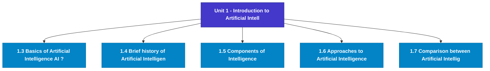

# MCS-224: Artificial Intelligence & Machine Learning
## Unit 1: Introduction to Artificial Intelligence

> 📚 **Programme:** M.Sc. (Data Science and Analytics) | **Semester:** Semester 2  
> ⏱️ **Estimated Study Time:** ~68 mins | 📄 **Textbook Pages:** 30 Pages  
> 📥 **Original PDF:** [Download & View Textbook](../../../pdfs/Semester_2/MCS-224_Artificial_Intelligence_and_Machine_Learning/Unit-1_Introduction_to_Artificial_Intelligence.pdf)

---

### 🎯 Executive Concept & Data Science Relevance
In modern data systems, **Introduction to Artificial Intelligence** forms a vital conceptual pillar. Artificial Intelligence models autonomous decision-making, while Machine Learning extracts predictive statistical patterns from data. From A* pathfinding in logistics to Deep Neural Networks powering Computer Vision and LLMs, AI/ML drives modern automated systems.

> [!NOTE]
> **Why this matters for your career:** Mastering introduction to artificial intelligence equips you with the foundational principles required to reason mathematically about high-dimensional datasets, evaluate algorithm performance, and avoid statistical pitfalls in production machine learning pipelines.

### 🗺️ Visual Knowledge Architecture
The following concept map illustrates the structural hierarchy and learning trajectory of this module:

### 📖 Core Definitions & Terminology Cards
| Term | Formal Mathematical / Technical Definition | Intuitive Analogy / Concrete Example |
| :--- | :--- | :--- |
| **A* Search Algorithm** | Best-first graph search evaluating states by $f(n) = g(n) + h(n)$, where $g(n)$ is true cost from start to $n$, and $h(n)$ is heuristic estimate to goal. Guarantees optimal path if $h(n)$ is admissible ($h(n) \le h^*(n)$). | *Finding the fastest route on GPS navigation without exploring irrelevant directions.* |
| **Entropy and Information Gain** | Entropy $H(S) = -\sum p_i \log_2 p_i$ measures impurity. Information Gain $IG(S, A) = H(S) - \sum \frac{\vert S_v \vert}{\vert S \vert} H(S_v)$ measures reduction in entropy achieved by splitting on feature $A$. | *The mathematical criterion used by Decision Trees to select the most informative split attribute.* |
| **Support Vector Machine (SVM) Margin** | Linear classifier finding the hyperplane maximizing the geometric margin $\frac{2}{\Vert\mathbf{w}\Vert}$ between classes, subject to $y_i(\mathbf{w}^T \mathbf{x}_i + b) \ge 1$. Non-linear data is separated using Kernel functions $K(\mathbf{x}, \mathbf{z}) = \phi(\mathbf{x})^T \phi(\mathbf{z})$. | *Finding the widest possible road separating positive and negative data clusters.* |
| **Backpropagation Algorithm** | Iterative parameter optimization in neural networks utilizing the multivariate chain rule to propagate error gradients backwards from the loss function to update synaptic weights: $w_{ij} \leftarrow w_{ij} - \alpha \frac{\partial \mathcal{L}}{\partial w_{ij}}$. | *Automated blame assignment: adjusting each internal weight proportionally to how much it contributed to prediction error.* |

### ⚡ Governing Mathematical Laws & Formula Cheatsheet
#### 🔹 A* Heuristic Evaluation Function

$$
f(n) = g(n) + h(n) \quad \text{Admissibility: } 0 \le h(n) \le h^*(n)
$$

- **Explanation:** If $h(n)$ never overestimates true remaining cost, A* tree search is guaranteed to return the optimal shortest path.

#### 🔹 Shannon Entropy Formula

$$
H(S) = -\sum_{i=1}^c p_i \log_2 p_i \quad \text{Gini Impurity: } 1 - \sum_{i=1}^c p_i^2
$$

- **Explanation:** Measures disorder in classification distributions; equals 0 when all samples belong to one class.

#### 🔹 Gradient Descent Weight Update Rule

$$
\mathbf{w}^{(t+1)} = \mathbf{w}^{(t)} - \alpha \nabla_{\mathbf{w}} \mathcal{L}(\mathbf{w})
$$

- **Explanation:** Stepping parameter vector opposite to the gradient vector scaled by learning rate $\alpha$.

#### 🔹 Neural Network Output Softmax Function

$$
\text{Softmax}(z_i) = \frac{e^{z_i}}{\sum_{j=1}^K e^{z_j}}
$$

- **Explanation:** Normalizes $K$ arbitrary logit outputs into a valid multi-class probability distribution summing to 1.

### 📌 Detailed Section-by-Section Study Breakdown
#### `1.3` Basics of Artificial Intelligence (AI)?
- **Core Concept:** Knowledge and intelligence are two important concepts, and we were able to gain an understanding of the fundamental distinction between the two terms.
- **Core Concept:** Now that we have your attention, let's talk about what artificial intelligence actually is.
- **Core Concept:** The following is a list of eight definitions of artificial intelligence that have been provided by well-known authors of artificial intelligence textbooks.
- **Data Science Application:** Provides foundational structures used directly in statistical modeling, query execution, and machine learning pipelines.

> [!TIP]
> **Exam & Interview Tip:** Be prepared to state the formal definition of basics of artificial intelligence (ai)? and derive its primary equations step-by-step.

#### `1.4` Brief history of Artificial Intelligence
- **Core Concept:** AI's ideas come from early research into how people learn and think.
- **Core Concept:** Also very old is the idea that a computer could act like a person.
- **Core Concept:** Greek mythology is where the idea of machines that can think for themselves comes from.
- **Data Science Application:** Provides foundational structures used directly in statistical modeling, query execution, and machine learning pipelines.

> [!TIP]
> **Exam & Interview Tip:** Be prepared to state the formal definition of brief history of artificial intelligence and derive its primary equations step-by-step.

#### `1.5` Components of Intelligence
- **Core Concept:** According to the dominant school of thought in psychology, human intelligence should not be viewed as a singular talent or cognitive process but rather as a collection of distinct components.
- **Core Concept:** The majority of attention in the field of artificial intelligence research has been paid to the following aspects of intelligence: learning, reasoning, problem-solving, perception, and language comprehension.
- **Core Concept:** Learning: There are numerous approaches to develop a learning system.
- **Data Science Application:** Provides foundational structures used directly in statistical modeling, query execution, and machine learning pipelines.

> [!TIP]
> **Exam & Interview Tip:** Be prepared to state the formal definition of components of intelligence and derive its primary equations step-by-step.

#### `1.6` Approaches to Artificial Intelligence
- **Core Concept:** Is it possible to make a system that acts like a human to test the certainty of Artificial Intelligence?
- **Core Concept:** But it is hard to find a good balance between approaches that focus on people and approaches that focus on logic.
- **Core Concept:** Researchers have found through their studies that a human-centered approach must be an empirical science with hypotheses and experiments to prove them.
- **Data Science Application:** Provides foundational structures used directly in statistical modeling, query execution, and machine learning pipelines.

> [!TIP]
> **Exam & Interview Tip:** Be prepared to state the formal definition of approaches to artificial intelligence and derive its primary equations step-by-step.

#### `1.7` Comparison between Artificial Intelligence (AI), Machine Learning
- **Core Concept:** INTELLIGENCE, MACHINE LEARNING & DEEP LEARNING Artificial intelligence is a big field that includes a lot of different ways of doing things, from top-down (knowledge representation) to bottom-up (machine learning).
- **Core Concept:** In recent years, people have often talked about three related ideas: artificial intelligence (AI), machine learning (ML), and deep learning (DL) (DL).
- **Core Concept:** AI is the most general term, machine learning is a part of AI, and deep learning is a type of machine learning.
- **Data Science Application:** Provides foundational structures used directly in statistical modeling, query execution, and machine learning pipelines.

> [!TIP]
> **Exam & Interview Tip:** Be prepared to state the formal definition of comparison between artificial intelligence (ai), machine learning and derive its primary equations step-by-step.

#### `1.8` Application Areas of Artificial Intelligence Systems
- **Core Concept:** Artificial intelligence is the most important factor in the transformation of economies straight from the ground up, and it is contributing as an efficient alternative.
- **Core Concept:** This is especially true in areas where the supply of healthcare professionals is limited.
- **Core Concept:** The deployment of use cases like as AI-driven diagnostics, personalised treatment, early diagnosis of potential pandemics, and imaging diagnostics, amongst others, is one way to accomplish this goal.
- **Data Science Application:** Provides foundational structures used directly in statistical modeling, query execution, and machine learning pipelines.

> [!TIP]
> **Exam & Interview Tip:** Be prepared to state the formal definition of application areas of artificial intelligence systems and derive its primary equations step-by-step.

### 💡 Interactive Self-Assessment Checkpoints
Test your comprehension before proceeding. Tap each question to reveal the comprehensive explanation:

<b>Checkpoint 1:</b> What condition must a heuristic $h(n)$ satisfy for A* search to be optimal? <i>(Tap to reveal answer)</i>

> **Answer & Analysis:**  
> The heuristic must be **Admissible**, meaning it never overestimates the actual minimal cost to reach the goal state ($h(n) \le h^*(n)$).

<b>Checkpoint 2:</b> What is the formula for Information Gain used in Decision Trees? <i>(Tap to reveal answer)</i>

> **Answer & Analysis:**  
> $IG(S, A) = H(S) - \sum_{v \in \text{Values}(A)} \frac{\vert S_v \vert}{\vert S \vert} H(S_v)$

<b>Checkpoint 3:</b> Why is the Softmax function used in multi-class classification neural networks? <i>(Tap to reveal answer)</i>

> **Answer & Analysis:**  
> It converts unconstrained real numbers (logits) into a valid probability distribution where each value is in $[0, 1]$ and all values sum strictly to $1$.

<b>Checkpoint 4:</b> 3 ☞ Check Your Progress <i>(Tap to reveal answer)</i>

> **Answer & Analysis:**  
> This question tests your conceptual mastery of Introduction to Artificial Intelligence. Review the governing formulas and section breakdowns above to formulate a complete, rigorous proof or derivation.

<b>Checkpoint 5:</b> 6 ☞ Check Your Progress <i>(Tap to reveal answer)</i>

> **Answer & Analysis:**  
> This question tests your conceptual mastery of Introduction to Artificial Intelligence. Review the governing formulas and section breakdowns above to formulate a complete, rigorous proof or derivation.

<b>Checkpoint 6:</b> 7 ☞ Check Your Progress <i>(Tap to reveal answer)</i>

> **Answer & Analysis:**  
> This question tests your conceptual mastery of Introduction to Artificial Intelligence. Review the governing formulas and section breakdowns above to formulate a complete, rigorous proof or derivation.

### 🎯 Executive Module Wrap-Up
- **Central Idea:** Introduction to Artificial Intelligence provides essential mathematical and algorithmic tools directly utilized in Data Science.
- **Mathematical Rigor:** Formulas and laws must be memorized with attention to boundary conditions and assumptions.
- **Full Textbook Coverage:** For exhaustive multi-page derivations, proofs, and supplementary exercises, consult the [Authentic IGNOU Textbook](../../../pdfs/Semester_2/MCS-224_Artificial_Intelligence_and_Machine_Learning/Unit-1_Introduction_to_Artificial_Intelligence.pdf).

---
### 🧭 Navigation & Syllabus Index
[📑 Course Index](README.md) | [Next: Unit 2 ➡](unit_02_Problem_Solving_Using_Search.md)
