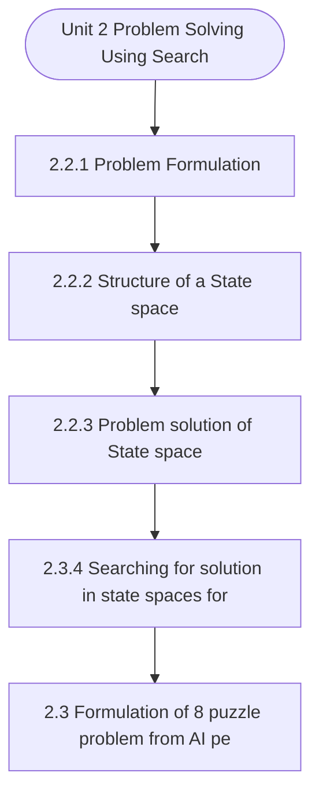

# MCS-224: Artificial Intelligence & Machine Learning
## Unit 2: Problem Solving Using Search

> 📚 **Programme:** M.Sc. (Data Science and Analytics) | **Semester:** Semester 2  
> ⏱️ **Estimated Study Time:** ~74 mins | 📄 **Textbook Pages:** 46 Pages  
> 📥 **Original PDF:** [Download & View Authentic Textbook](../../../pdfs/Semester_2/MCS-224_Artificial_Intelligence_and_Machine_Learning/Unit-2_Problem_Solving_Using_Search.pdf)

---

### 🎯 Executive Concept & Data Science Relevance
In modern data systems, **Problem Solving Using Search** forms a vital conceptual pillar. Artificial Intelligence models autonomous decision-making, while Machine Learning extracts predictive statistical patterns from data. From A* pathfinding in logistics to Deep Neural Networks powering Computer Vision and LLMs, AI/ML drives modern automated systems.

> [!NOTE]
> **Why this matters for your career:** Mastering problem solving using search equips you with the foundational principles required to reason mathematically about high-dimensional datasets, evaluate algorithm performance, and avoid statistical pitfalls in production machine learning pipelines.

### 🗺️ Visual Knowledge Architecture
The following concept map illustrates the structural hierarchy and learning trajectory of this module:



### 📖 Core Definitions & Terminology Cards

> 📌 **A* Search Algorithm**  
> - **Formal Definition:** Best-first graph search evaluating states by $f(n) = g(n) + h(n)$, where $g(n)$ is true cost from start to $n$, and $h(n)$ is heuristic estimate to goal. Guarantees optimal path if $h(n)$ is admissible ( $h(n) \le h^*(n)$ ).  
> - 💡 **Practical Intuition & Analogy:** *Finding the fastest route on GPS navigation without exploring irrelevant directions.*

> 📌 **Entropy and Information Gain**  
> - **Formal Definition:** Entropy $H(S) = -\sum p_i \log_2 p_i$ measures impurity. Information Gain $IG(S, A) = H(S) - \sum \frac{\vert S_v \vert}{\vert S \vert} H(S_v)$ measures reduction in entropy achieved by splitting on feature $A$.  
> - 💡 **Practical Intuition & Analogy:** *The mathematical criterion used by Decision Trees to select the most informative split attribute.*

> 📌 **Support Vector Machine (SVM) Margin**  
> - **Formal Definition:** Linear classifier finding the hyperplane maximizing the geometric margin $\frac{2}{\Vert\mathbf{w}\Vert}$ between classes, subject to $y_i(\mathbf{w}^T \mathbf{x}_i + b) \ge 1$. Non-linear data is separated using Kernel functions $K(\mathbf{x}, \mathbf{z}) = \phi(\mathbf{x})^T \phi(\mathbf{z})$.  
> - 💡 **Practical Intuition & Analogy:** *Finding the widest possible road separating positive and negative data clusters.*

> 📌 **Backpropagation Algorithm**  
> - **Formal Definition:** Iterative parameter optimization in neural networks utilizing the multivariate chain rule to propagate error gradients backwards from the loss function to update synaptic weights: $w_{ij} \leftarrow w_{ij} - \alpha \frac{\partial \mathcal{L}}{\partial w_{ij}}$.  
> - 💡 **Practical Intuition & Analogy:** *Automated blame assignment: adjusting each internal weight proportionally to how much it contributed to prediction error.*

### ⚡ Governing Mathematical Laws & Formula Cheatsheet
#### 🔹 A* Heuristic Evaluation Function
$$
f(n) = g(n) + h(n) \quad \text{Admissibility: } 0 \le h(n) \le h^*(n)
$$
- **Explanation:** If $h(n)$ never overestimates true remaining cost, A* tree search is guaranteed to return the optimal shortest path.

#### 🔹 Shannon Entropy Formula
$$
H(S) = -\sum_{i=1}^c p_i \log_2 p_i \quad \text{Gini Impurity: } 1 - \sum_{i=1}^c p_i^2
$$
- **Explanation:** Measures disorder in classification distributions; equals 0 when all samples belong to one class.

#### 🔹 Gradient Descent Weight Update Rule
$$
\mathbf{w}^{(t+1)} = \mathbf{w}^{(t)} - \alpha \nabla_{\mathbf{w}} \mathcal{L}(\mathbf{w})
$$
- **Explanation:** Stepping parameter vector opposite to the gradient vector scaled by learning rate $\alpha$.

#### 🔹 Neural Network Output Softmax Function
$$
\text{Softmax}(z_i) = \frac{e^{z_i}}{\sum_{j=1}^K e^{z_j}}
$$
- **Explanation:** Normalizes $K$ arbitrary logit outputs into a valid multi-class probability distribution summing to 1.

### ⚖️ Axiomatic Properties & Governing Laws
The mathematical formulations of this module are anchored by foundational algebraic and structural laws:

- **Heuristic Consistency Condition:** $h(n) \le c(n, a, n') + h(n') \implies \text{Monotonic (Guarantees A* optimality on graphs)}$
- **SVM Dual Formulation:** $\max_\alpha \sum \alpha_i - \frac{1}{2}\sum \alpha_i \alpha_j y_i y_j K(\mathbf{x}_i, \mathbf{x}_j)$
- **Universal Approximation Theorem:** A feedforward network with one non-linear hidden layer can approximate any continuous function on compact subsets of $\mathbb{R}^n$.

### 📌 Comprehensive Section-by-Section Study Breakdown
#### `2.2.1` Problem Formulation
##### 📘 Theoretical Principles & In-Depth Exposition
The structures of state space are trees and graphs. A tree has one and only one path from any point to any other point. Graph consists of a set of nodes (vertices) and a set of edges (arcs). Arcs establish relationship (connections) between the nodes, i.e., a graph has several paths to a given node.

Operators are directed arcs between nodes. The method of solving problem through AI involves the process of defining the search space, deciding start and goal states and then finding the path from start state to goal state through search space. Search process explores the state space.

In the worst case, the search explores all possible paths between the initial state and the goal state.

##### ⚙️ Mathematical & Algorithmic Mechanics
- **Formal Mechanics:** Establishes symbolic transformations and state invariants governing problem formulation.
- **Boundary Invariants:** Ensures robust error-handling, non-empty set guarantees, and strict asymptotic bounds.

##### 📊 Practical Data Science & Production Relevance
- **Industry Application:** Directly implemented in production workflows such as SQL query filters, pandas vectorized operations, and feature transformation pipelines.
- **Production Pitfall:** Failing to verify membership bounds or missing edge cases in problem formulation can cause silent data corruption or performance bottlenecks.

> [!TIP]
> **Key Exam & Technical Interview Takeaway:** Be prepared to define problem formulation formally, cite its core mathematical invariants, and solve step-by-step numerical/proof questions.

#### `2.2.2` Structure of a State space
##### 📘 Theoretical Principles & In-Depth Exposition
In a state space, a solution is a path from the initial state to a goal state or sometime just a goal state. A numeric cost is assigned to each path. It also gives the cost of applying the operators to the states. A path cost function is used to measure the quality of solution and out of all possible solutions, an optimal solution has the lowest path cost.

##### ⚙️ Mathematical & Algorithmic Mechanics
- **Formal Mechanics:** Establishes symbolic transformations and state invariants governing structure of a state space.
- **Boundary Invariants:** Ensures robust error-handling, non-empty set guarantees, and strict asymptotic bounds.

##### 📊 Practical Data Science & Production Relevance
- **Industry Application:** Directly implemented in production workflows such as SQL query filters, pandas vectorized operations, and feature transformation pipelines.
- **Production Pitfall:** Failing to verify membership bounds or missing edge cases in structure of a state space can cause silent data corruption or performance bottlenecks.

> [!TIP]
> **Key Exam & Technical Interview Takeaway:** Be prepared to define structure of a state space formally, cite its core mathematical invariants, and solve step-by-step numerical/proof questions.

#### `2.2.3` Problem solution of State space
##### 📘 Theoretical Principles & In-Depth Exposition
Many problems can be represented as state space. The state space of a problem includes: an initial state, one or more goal state, set of state transition operator (or a set of production rules), used to change the current state to another state. This is also known as actions. A control strategy is used that specifies the order in which the rules will be applied.

For example, Depth-first search (DFS), Breath-first search (BFS) etc. It helps to find the goal state or a path to the goal state. In general, a state space is represented by 4 tuples as follows: Ss: [S,s0,O,G] Where S: Set of all possible states. s0: start state (initial configuration) of the problem, s0∈S.

O: Set of production rules (or set of state transition operator) used to change the state from one state to another. It is the set of arcs (or links) between nodes. The production rule is represented in the form of a pair. Each pair consists Artificial Intelligence – Introduction of a left side that determines the applicability of the rule and a right side that describes the action to be performed, if the rule is applied.

##### ⚙️ Mathematical & Algorithmic Mechanics
- **Formal Mechanics:** Establishes symbolic transformations and state invariants governing problem solution of state space.
- **Boundary Invariants:** Ensures robust error-handling, non-empty set guarantees, and strict asymptotic bounds.

##### 📊 Practical Data Science & Production Relevance
- **Industry Application:** Directly implemented in production workflows such as SQL query filters, pandas vectorized operations, and feature transformation pipelines.
- **Production Pitfall:** Failing to verify membership bounds or missing edge cases in problem solution of state space can cause silent data corruption or performance bottlenecks.

> [!TIP]
> **Key Exam & Technical Interview Takeaway:** Be prepared to define problem solution of state space formally, cite its core mathematical invariants, and solve step-by-step numerical/proof questions.

#### `2.3.4` Searching for solution in state spaces formulated
##### 📘 Theoretical Principles & In-Depth Exposition
The section on **Searching for solution in state spaces formulated** establishes rigorous theoretical foundations necessary for advanced computational modeling. It introduces formal mathematical structures and symbolic notations that guarantee consistency across proofs and algorithms.

In the broader scope of **Problem Solving Using Search**, understanding searching for solution in state spaces formulated is essential to formalizing data representations, verifying boundary constraints, and ensuring computational determinism across multidimensional feature spaces.

##### ⚙️ Mathematical & Algorithmic Mechanics
- **Formal Mechanics:** Establishes symbolic transformations and state invariants governing searching for solution in state spaces formulated.
- **Boundary Invariants:** Ensures robust error-handling, non-empty set guarantees, and strict asymptotic bounds.

##### 📊 Practical Data Science & Production Relevance
- **Industry Application:** Directly implemented in production workflows such as SQL query filters, pandas vectorized operations, and feature transformation pipelines.
- **Production Pitfall:** Failing to verify membership bounds or missing edge cases in searching for solution in state spaces formulated can cause silent data corruption or performance bottlenecks.

> [!TIP]
> **Key Exam & Technical Interview Takeaway:** Be prepared to define searching for solution in state spaces formulated formally, cite its core mathematical invariants, and solve step-by-step numerical/proof questions.

#### `2.3` Formulation of 8 puzzle problem from AI perspective
##### 📘 Theoretical Principles & In-Depth Exposition
The eight-tile puzzle consists of a 3-by-3 (3×3) square frame board which holds eight (8) movable tiles numbered as 1 to 8. One square is empty, allowing the adjacent tiles to be shifted. The objective of the puzzle is to find a sequence of tile movements that leads from a starting configuration to a goal configuration The Eight Puzzle Problem formulation: Given a 3 × 3 grid with 8 sliding tiles and one “blank” Initial state: some other configuration of the tiles, for example Goal state: Operator: Slide tiles (Move Blank) to reach the goal (as shown below).

There are 4 operators that is, “Moving the blank”: Move the blank UP, Move the blank DOWN, Move the blank LEFT and Move the blank RIGHT. [0,0] [4,0] [0,3] [4,3] [0,0] [1,3] [4,3] [0,0] [3,0] [1,0] [0,1] [4,1] [2,3] [3,3] [4,2] [0,2] [2,0] Artificial Intelligence – Introduction Fig6Moving Blank LEFT and then UP Path Cost: Sum of the cost of each path from initial state to goal state.

Here cost of each action (blank move) = 1, so cost of a sequence of actions= the number of actions. A optimal solution is one which has a lowest cost path. Performing State-Space Search: Basic idea: If the initial state is a goal state, return it. If not, apply the operators to generate all states that are one step from the initial state (its successors) initial state Its successors Fig 7 All possible successors for a given initial state Consider the successor (and their successors…) until you find a goal state.

##### ⚙️ Mathematical & Algorithmic Mechanics
- **Formal Mechanics:** Establishes symbolic transformations and state invariants governing formulation of 8 puzzle problem from ai perspective.
- **Boundary Invariants:** Ensures robust error-handling, non-empty set guarantees, and strict asymptotic bounds.

##### 📊 Practical Data Science & Production Relevance
- **Industry Application:** Directly implemented in production workflows such as SQL query filters, pandas vectorized operations, and feature transformation pipelines.
- **Production Pitfall:** Failing to verify membership bounds or missing edge cases in formulation of 8 puzzle problem from ai perspective can cause silent data corruption or performance bottlenecks.

> [!TIP]
> **Key Exam & Technical Interview Takeaway:** Be prepared to define formulation of 8 puzzle problem from ai perspective formally, cite its core mathematical invariants, and solve step-by-step numerical/proof questions.

#### `2.4` N-queen’s problem- Formulation and Solution
##### 📘 Theoretical Principles & In-Depth Exposition
SOLUTION The N-Queen problem is the problem of placing N Queen’s (Q1,Q2,Q3,…. Qn) on an N×N chessboard so that no two queens attack each other. The colour of the queens is meaningless in this puzzle, and any queen is assumed to be attack any other. So, a solution requires that no two queens share the same row, column, or diagonal.

The N-queen problem must follow the following rules: 1. There is at most one queen in each column. There is at most one queen in each row. There is at most one queen in each diagonal. Fig-9 No two queens placed on same row, column or diagonal The N Queen’s problem was originally proposed in 1848 by the chess player Max Bazzel, and over the years, many mathematicians, including Gauss have Artificial Intelligence – Introduction worked on this puzzle.

Gunther proposed a method of finding solutions by using determinants, and J.W.L. Glaisher refined this approach. The solutions that differ only by summary operations (rotations and reflections) of the board are counted as one. For 4 queen’s problems, there are 16c4 possible arrangements on a 4×4 chessboard and there are only 2 possible solutions for 4 Queen’s problem.

##### ⚙️ Mathematical & Algorithmic Mechanics
- **Formal Mechanics:** Establishes symbolic transformations and state invariants governing n-queen’s problem- formulation and solution.
- **Boundary Invariants:** Ensures robust error-handling, non-empty set guarantees, and strict asymptotic bounds.

##### 📊 Practical Data Science & Production Relevance
- **Industry Application:** Directly implemented in production workflows such as SQL query filters, pandas vectorized operations, and feature transformation pipelines.
- **Production Pitfall:** Failing to verify membership bounds or missing edge cases in n-queen’s problem- formulation and solution can cause silent data corruption or performance bottlenecks.

> [!TIP]
> **Key Exam & Technical Interview Takeaway:** Be prepared to define n-queen’s problem- formulation and solution formally, cite its core mathematical invariants, and solve step-by-step numerical/proof questions.

#### `2.4.1` Formulation of 8 Queen’s problem
##### 📘 Theoretical Principles & In-Depth Exposition
States: any arrangement of 0 to 4 queens on the board Initial state: 0 queens on the board Successor function: Add queen in any square Goal test: 4 queens on the board, none attacked For the initial state, there are 16 successors. At the next level, each of the states has 15 successors, and so on down the line.

This search tree can be restricted by considering only those successors where No queens are attacking each other. To do that, we have to check the new queen with all the other queens on the board. In this way, the answer is found at a depth 4.For the sake of simplicity, you can consider a problem of 4-Queen’s and see how 4-queen’s problem is solved using the concept of “Backtracking”.

##### ⚙️ Mathematical & Algorithmic Mechanics
- **Formal Mechanics:** Establishes symbolic transformations and state invariants governing formulation of 8 queen’s problem.
- **Boundary Invariants:** Ensures robust error-handling, non-empty set guarantees, and strict asymptotic bounds.

##### 📊 Practical Data Science & Production Relevance
- **Industry Application:** Directly implemented in production workflows such as SQL query filters, pandas vectorized operations, and feature transformation pipelines.
- **Production Pitfall:** Failing to verify membership bounds or missing edge cases in formulation of 8 queen’s problem can cause silent data corruption or performance bottlenecks.

> [!TIP]
> **Key Exam & Technical Interview Takeaway:** Be prepared to define formulation of 8 queen’s problem formally, cite its core mathematical invariants, and solve step-by-step numerical/proof questions.

#### `2.4.2` State space tree for 4-Queen’s problem
##### 📘 Theoretical Principles & In-Depth Exposition
We place queen row-by-row (i.e.,Q_1in row 1, Q_2 in row 2 and so on). Backtracking gives “all possible solution”. If you want optimal solution, then go for Dynamic programming. Let’s see Backtracking method, there are (_4^16)C ways to place a queen on a 4x4 chess board as shown in the following state space tree (figure 12).

In a tree, the value (i,j) means in thei^(th )row, j^th queen is placed. Artificial Intelligence – Introduction Fig 12 State-space tree showing all possible ways to place a queen on a 4x4 chess board So, to reduce the size (not anywhere on chess board, since there are (_4^16)C Possibilities), we place queen row-by-row, and no Queen in same column.This tree is called a permutation tree (here we avoid same row or same columns but allowing diagonals) Total nodes=1+4+4×3+4×3×2+4×3×2×1=65 The edges are labeled by possible values of xi.

Edges from level 1 to level 2 nodes specify the values for x1. Edges from level i to level i+1 are labeled with the values of xi. The solution space is defined by all paths from root node to leaf node. = 24 leaf nodes are in the tree Nodes are numbered as depth first Search. The state space tree for 4-Queen’s problem (avoid same row or same columns but allowing diagonals) is shown in figure 13.

##### ⚙️ Mathematical & Algorithmic Mechanics
- **Formal Mechanics:** Establishes symbolic transformations and state invariants governing state space tree for 4-queen’s problem.
- **Boundary Invariants:** Ensures robust error-handling, non-empty set guarantees, and strict asymptotic bounds.

##### 📊 Practical Data Science & Production Relevance
- **Industry Application:** Directly implemented in production workflows such as SQL query filters, pandas vectorized operations, and feature transformation pipelines.
- **Production Pitfall:** Failing to verify membership bounds or missing edge cases in state space tree for 4-queen’s problem can cause silent data corruption or performance bottlenecks.

> [!TIP]
> **Key Exam & Technical Interview Takeaway:** Be prepared to define state space tree for 4-queen’s problem formally, cite its core mathematical invariants, and solve step-by-step numerical/proof questions.

### 📐 Step-by-Step Solved Mathematical Examples
To solidify your theoretical understanding, work through these fully solved, step-by-step mathematical problems:

#### 🧮 Example 1: Shannon Entropy and Information Gain Calculation
> **Problem Statement:**  
> A training dataset $S$ has 14 instances: 9 Positive ($+$) and 5 Negative ($-$). An attribute $A$ splits $S$ into $S_1$ (6 $+$, 2 $-$) and $S_2$ (3 $+$, 3 $-$). Compute Entropy $H(S)$ and Information Gain $IG(S, A)$.

**Detailed Step-by-Step Solution:**

1. **Parent Entropy $H(S)$:**
$$
H(S) = -\left(\frac{9}{14} \log_2 \frac{9}{14} + \frac{5}{14} \log_2 \frac{5}{14}\right) \approx 0.940 \text{ bits}
$$

2. **Subset Entropies:**
- For $S_1$ (total 8): $H(S_1) = -\left(\frac{6}{8}\log_2\frac{6}{8} + \frac{2}{8}\log_2\frac{2}{8}\right) = 0.811 \text{ bits}$
- For $S_2$ (total 6): $H(S_2) = -\left(\frac{3}{6}\log_2\frac{3}{6} + \frac{3}{6}\log_2\frac{3}{6}\right) = 1.000 \text{ bits}$

3. **Weighted Child Entropy:**
$$
H(S, A) = \frac{8}{14}(0.811) + \frac{6}{14}(1.000) = 0.463 + 0.429 = 0.892 \text{ bits}
$$

4. **Information Gain:**
$$
IG(S, A) = H(S) - H(S, A) = 0.940 - 0.892 = 0.048 \text{ bits}
$$
(Attribute provides 0.048 bits of entropy reduction).

#### 🧮 Example 2: A* Search Step Evaluation
> **Problem Statement:**  
> In graph navigation, node $N$ has exact path cost from start $g(N) = 14$ and straight-line heuristic to goal $h(N) = 11$. For node $M$, $g(M) = 18, h(M) = 6$. Which node is expanded next by A*?

**Detailed Step-by-Step Solution:**

1. Compute $f(n) = g(n) + h(n)$:
- $f(N) = 14 + 11 = 25$
- $f(M) = 18 + 6 = 24$

2. Decision: A* selects the node with minimal $f(n)$. Since $f(M) = 24 < f(N) = 25$, **Node $M$ is expanded next**.

### 💻 Practical Data Science Implementation (Python)
Theory translates directly into production algorithms. Below is a self-contained, commented Python implementation illustrating the core operations of this unit:

```python
import numpy as np

# Decision Tree Entropy and Information Gain from scratch
def entropy(labels):
    counts = np.bincount(labels)
    probs = counts[counts > 0] / len(labels)
    return -np.sum(probs * np.log2(probs))

def information_gain(parent_labels, left_split, right_split):
    h_parent = entropy(parent_labels)
    n = len(parent_labels)
    h_children = (len(left_split)/n)*entropy(left_split) + (len(right_split)/n)*entropy(right_split)
    return h_parent - h_children

# Sample binary targets: 9 ones, 5 zeros
y_parent = np.array([1]*9 + [0]*5)
y_left = np.array([1]*6 + [0]*2)
y_right = np.array([1]*3 + [0]*3)

ig = information_gain(y_parent, y_left, y_right)
print(f"Parent Entropy: {entropy(y_parent):.4f}")
print(f"Information Gain: {ig:.4f} bits")
```

### 💡 Interactive Self-Assessment Checkpoints
Test your comprehension before proceeding. Tap each question to reveal the comprehensive explanation:

<details>
<summary><b>Checkpoint 1:</b> What condition must a heuristic $h(n)$ satisfy for A* search to be optimal? <i>(Tap to reveal answer)</i></summary>

> **Answer & Analysis:**  
> The heuristic must be **Admissible**, meaning it never overestimates the actual minimal cost to reach the goal state ( $h(n) \le h^*(n)$ ).
</details>

<details>
<summary><b>Checkpoint 2:</b> What is the formula for Information Gain used in Decision Trees? <i>(Tap to reveal answer)</i></summary>

> **Answer & Analysis:**  
> $IG(S, A) = H(S) - \sum_{v \in \text{Values}(A)} \frac{\vert S_v \vert}{\vert S \vert} H(S_v)$
</details>

<details>
<summary><b>Checkpoint 3:</b> Why is the Softmax function used in multi-class classification neural networks? <i>(Tap to reveal answer)</i></summary>

> **Answer & Analysis:**  
> It converts unconstrained real numbers (logits) into a valid probability distribution where each value is in $[0, 1]$ and all values sum strictly to 1.
</details>

<details>
<summary><b>Checkpoint 4:</b> Q.5 Discuss a Backtracking algorithm to solve a N-Queen’s problem. Draw a state space tree to solve a <i>(Tap to reveal answer)</i></summary>

> **Answer & Analysis:**  
> This question tests your conceptual mastery of Problem Solving Using Search. Review the governing formulas and section breakdowns above to formulate a complete, rigorous proof or derivation.
</details>

<details>
<summary><b>Checkpoint 5:</b> in which root is maximizing node and children are visited from left to right. Figure <i>(Tap to reveal answer)</i></summary>

> **Answer & Analysis:**  
> This question tests your conceptual mastery of Problem Solving Using Search. Review the governing formulas and section breakdowns above to formulate a complete, rigorous proof or derivation.
</details>

<details>
<summary><b>Checkpoint 6:</b> Where #M represents Number of missionaries in the left side bank (i.e., left side of the river) #C : represents the number of cannibals in the left side bank (i.e., left side of the river) <i>(Tap to reveal answer)</i></summary>

> **Answer & Analysis:**  
> This question tests your conceptual mastery of Problem Solving Using Search. Review the governing formulas and section breakdowns above to formulate a complete, rigorous proof or derivation.
</details>

### 🎯 Executive Module Wrap-Up
- **Central Idea:** Problem Solving Using Search provides essential mathematical and algorithmic tools directly utilized in Data Science.
- **Mathematical Rigor:** Formulas and laws must be memorized with attention to boundary conditions and assumptions.
- **Full Textbook Coverage:** For exhaustive multi-page derivations, proofs, and supplementary exercises, consult the [Authentic IGNOU Textbook](../../../pdfs/Semester_2/MCS-224_Artificial_Intelligence_and_Machine_Learning/Unit-2_Problem_Solving_Using_Search.pdf).

---
### 🧭 Navigation & Syllabus Index
[⬅ Previous: Unit 1](unit_01_Introduction_to_Artificial_Intelligence.md) | [📑 Course Index](README.md) | [Next: Unit 3 ➡](unit_03_Uninformed_and_Informed_Search.md)
