# MCS-224: Artificial Intelligence & Machine Learning
## Unit 2: Problem Solving Using Search

> 📚 **Programme:** M.Sc. (Data Science and Analytics) | **Semester:** Semester 2  
> ⏱️ **Estimated Study Time:** ~74 mins | 📄 **Textbook Pages:** 46 Pages  
> 📥 **Original PDF:** [Download & View Textbook](../../../pdfs/Semester_2/MCS-224_Artificial_Intelligence_and_Machine_Learning/Unit-2_Problem_Solving_Using_Search.pdf)

---

### 🎯 Executive Concept & Data Science Relevance
In modern data systems, **Problem Solving Using Search** forms a vital conceptual pillar. Artificial Intelligence models autonomous decision-making, while Machine Learning extracts predictive statistical patterns from data. From A* pathfinding in logistics to Deep Neural Networks powering Computer Vision and LLMs, AI/ML drives modern automated systems.

> [!NOTE]
> **Why this matters for your career:** Mastering problem solving using search equips you with the foundational principles required to reason mathematically about high-dimensional datasets, evaluate algorithm performance, and avoid statistical pitfalls in production machine learning pipelines.

### 🗺️ Visual Knowledge Architecture
The following concept map illustrates the structural hierarchy and learning trajectory of this module:

```mermaid
flowchart TD
  %% Styling Definitions
  classDef head fill:#4338ca,stroke:#312e81,color:#ffffff,font-weight:bold,rx:8px,ry:8px;
  classDef topic fill:#0284c7,stroke:#0369a1,color:#ffffff,font-weight:600,rx:6px,ry:6px;
  classDef sub fill:#1e293b,stroke:#475569,color:#f8fafc,rx:4px,ry:4px;

  Root["Unit 2 - Problem Solving Using Search"]:::head
  M1["2.3 Formulation of 8 puzzle problem from A"]:::topic
  Root --> M1
  M1_1["2.3.4 Searching for solution in state spac"]:::sub
  M1 --> M1_1
  M2["2.4 N-queen’s problem- Formulation and Sol"]:::topic
  Root --> M2
  M2_1["2.4.1 Formulation of 8 Queen’s problem"]:::sub
  M2 --> M2_1
  M2_2["2.4.2 State space tree for 4-Queen’s probl"]:::sub
  M2 --> M2_2
  M3["2.5 Two agent search Adversarial search"]:::topic
  Root --> M3
  M3_1["2.5.1 Elements of Game playing search"]:::sub
  M3 --> M3_1
  M3_2["2.5.2 Types of algorithms in Adversarial s"]:::sub
  M3 --> M3_2
  M4["2.6 Minimax search strategy"]:::topic
  Root --> M4
  M4_1["2.6.1 Minimax algorithm"]:::sub
  M4 --> M4_1
  M4_2["2.6.2 Working of Minimax algorithm"]:::sub
  M4 --> M4_2
  M5["2.7 Alpha-Beta Pruning algorithm"]:::topic
  Root --> M5
  M5_1["2.7.1 Working of Alpha-Beta pruning"]:::sub
  M5 --> M5_1
  M5_2["2.7.2 Move Ordering of Alpha-Beta pruning"]:::sub
  M5 --> M5_2
```

### 📖 Core Definitions & Terminology Cards
| Term | Formal Mathematical / Technical Definition | Intuitive Analogy / Concrete Example |
| :--- | :--- | :--- |
| **A* Search Algorithm** | Best-first graph search evaluating states by $f(n) = g(n) + h(n)$, where $g(n)$ is true cost from start to $n$, and $h(n)$ is heuristic estimate to goal. Guarantees optimal path if $h(n)$ is admissible ($h(n) \le h^*(n)$). | *Finding the fastest route on GPS navigation without exploring irrelevant directions.* |
| **Entropy and Information Gain** | Entropy $H(S) = -\sum p_i \log_2 p_i$ measures impurity. Information Gain $IG(S, A) = H(S) - \sum \frac{\|S_v\|}{\|S\|} H(S_v)$ measures reduction in entropy achieved by splitting on feature $A$. | *The mathematical criterion used by Decision Trees to select the most informative split attribute.* |
| **Support Vector Machine (SVM) Margin** | Linear classifier finding the hyperplane maximizing the geometric margin $\frac{2}{\\|\mathbf{w}\\|}$ between classes, subject to $y_i(\mathbf{w}^T \mathbf{x}_i + b) \ge 1$. Non-linear data is separated using Kernel functions $K(\mathbf{x}, \mathbf{z}) = \phi(\mathbf{x})^T \phi(\mathbf{z})$. | *Finding the widest possible road separating positive and negative data clusters.* |
| **Backpropagation Algorithm** | Iterative parameter optimization in neural networks utilizing the multivariate chain rule to propagate error gradients backwards from the loss function to update synaptic weights: $w_{ij} \leftarrow w_{ij} - \alpha \frac{\partial \mathcal{L}}{\partial w_{ij}}$. | *Automated blame assignment: adjusting each internal weight proportionally to how much it contributed to prediction error.* |

### ⚡ Governing Mathematical Laws & Formula Cheatsheet
#### 🔹 A* Heuristic Evaluation Function
$$f(n) = g(n) + h(n) \quad \text{Admissibility: } 0 \le h(n) \le h^*(n)$$
- **Explanation:** If $h(n)$ never overestimates true remaining cost, A* tree search is guaranteed to return the optimal shortest path.

#### 🔹 Shannon Entropy Formula
$$H(S) = -\sum_{i=1}^c p_i \log_2 p_i \quad \text{Gini Impurity: } 1 - \sum_{i=1}^c p_i^2$$
- **Explanation:** Measures disorder in classification distributions; equals 0 when all samples belong to one class.

#### 🔹 Gradient Descent Weight Update Rule
$$\mathbf{w}^{(t+1)} = \mathbf{w}^{(t)} - \alpha \nabla_{\mathbf{w}} \mathcal{L}(\mathbf{w})$$
- **Explanation:** Stepping parameter vector opposite to the gradient vector scaled by learning rate $\alpha$.

#### 🔹 Neural Network Output Softmax Function
$$\text{Softmax}(z_i) = \frac{e^{z_i}}{\sum_{j=1}^K e^{z_j}}$$
- **Explanation:** Normalizes $K$ arbitrary logit outputs into a valid multi-class probability distribution summing to 1.

### 📌 Detailed Section-by-Section Study Breakdown
#### `2.2.1` Problem Formulation
- **Core Concept:** The structures of state space are trees and graphs.
- **Core Concept:** A tree has one and only one path from any point to any other point.
- **Core Concept:** Graph consists of a set of nodes (vertices) and a set of edges (arcs).
- **Data Science Application:** Provides foundational structures used directly in statistical modeling, query execution, and machine learning pipelines.

> [!TIP]
> **Exam & Interview Tip:** Be prepared to state the formal definition of problem formulation and derive its primary equations step-by-step.

#### `2.2.2` Structure of a State space
- **Core Concept:** A numeric cost is assigned to each path.
- **Core Concept:** It also gives the cost of applying the operators to the states.
- **Core Concept:** Problem formulation: Many problems can be represented as state space.
- **Data Science Application:** Provides foundational structures used directly in statistical modeling, query execution, and machine learning pipelines.

> [!TIP]
> **Exam & Interview Tip:** Be prepared to state the formal definition of structure of a state space and derive its primary equations step-by-step.

#### `2.2.3` Problem solution of State space
- **Core Concept:** Many problems can be represented as state space.
- **Core Concept:** The state space of a problem includes: an initial state, one or more goal state, set of state transition operator (or a set of production rules), used to change the current state to another state.
- **Core Concept:** A control strategy is used that specifies the order in which the rules will be applied.
- **Data Science Application:** Provides foundational structures used directly in statistical modeling, query execution, and machine learning pipelines.

> [!TIP]
> **Exam & Interview Tip:** Be prepared to state the formal definition of problem solution of state space and derive its primary equations step-by-step.

#### `2.3.4` Searching for solution in state spaces formulated
- **Core Concept:** Establishes rigorous theoretical formulations and computational bounds for searching for solution in state spaces formulated.
- **Core Concept:** Applies standard algorithmic procedures and mathematical invariants relevant to problem solving using search.
- **Core Concept:** Ensures deterministic performance guarantees across high-dimensional feature spaces.
- **Data Science Application:** Provides foundational structures used directly in statistical modeling, query execution, and machine learning pipelines.

> [!TIP]
> **Exam & Interview Tip:** Be prepared to state the formal definition of searching for solution in state spaces formulated and derive its primary equations step-by-step.

#### `2.3` Formulation of 8 puzzle problem from AI perspective
- **Core Concept:** The eight-tile puzzle consists of a 3-by-3 (3×3) square frame board which holds eight (8) movable tiles numbered as 1 to 8.
- **Core Concept:** One square is empty, allowing the adjacent tiles to be shifted.
- **Core Concept:** There are 4 operators that is, “Moving the blank”: Move the blank UP, Move the blank DOWN, Move the blank LEFT and Move the blank RIGHT.
- **Data Science Application:** Provides foundational structures used directly in statistical modeling, query execution, and machine learning pipelines.

> [!TIP]
> **Exam & Interview Tip:** Be prepared to state the formal definition of formulation of 8 puzzle problem from ai perspective and derive its primary equations step-by-step.

#### `2.4` N-queen’s problem- Formulation and Solution
- **Core Concept:** The N-Queen problem is the problem of placing N Queen’s (Q1,Q2,Q3,….
- **Core Concept:** Qn) on an N×N chessboard so that no two queens attack each other.
- **Core Concept:** The colour of the queens is meaningless in this puzzle, and any queen is assumed to be attack any other.
- **Data Science Application:** Provides foundational structures used directly in statistical modeling, query execution, and machine learning pipelines.

> [!TIP]
> **Exam & Interview Tip:** Be prepared to state the formal definition of n-queen’s problem- formulation and solution and derive its primary equations step-by-step.

### 💡 Interactive Self-Assessment Checkpoints
Test your comprehension before proceeding. Tap each question to reveal the comprehensive explanation:

<b>Checkpoint 1:</b> What condition must a heuristic $h(n)$ satisfy for A* search to be optimal? <i>(Tap to reveal answer)</i>

> **Answer & Analysis:**  
> The heuristic must be **Admissible**, meaning it never overestimates the actual minimal cost to reach the goal state ($h(n) \le h^*(n)$).

<b>Checkpoint 2:</b> What is the formula for Information Gain used in Decision Trees? <i>(Tap to reveal answer)</i>

> **Answer & Analysis:**  
> $$IG(S, A) = H(S) - \sum_{v \in \text{Values}(A)} \frac{|S_v|}{|S|} H(S_v)$$

<b>Checkpoint 3:</b> Why is the Softmax function used in multi-class classification neural networks? <i>(Tap to reveal answer)</i>

> **Answer & Analysis:**  
> It converts unconstrained real numbers (logits) into a valid probability distribution where each value is in $[0, 1]$ and all values sum strictly to $1$.

<b>Checkpoint 4:</b> Q.5 Discuss a Backtracking algorithm to solve a N-Queen’s problem. Draw a state space tree to solve a <i>(Tap to reveal answer)</i>

> **Answer & Analysis:**  
> This question tests your conceptual mastery of Problem Solving Using Search. Review the governing formulas and section breakdowns above to formulate a complete, rigorous proof or derivation.

<b>Checkpoint 5:</b> in which root is maximizing node and children are visited from left to right. Figure <i>(Tap to reveal answer)</i>

> **Answer & Analysis:**  
> This question tests your conceptual mastery of Problem Solving Using Search. Review the governing formulas and section breakdowns above to formulate a complete, rigorous proof or derivation.

<b>Checkpoint 6:</b> Where #M represents Number of missionaries in the left side bank (i.e., left side of the river) #C : represents the number of cannibals in the left side bank (i.e., left side of the river) <i>(Tap to reveal answer)</i>

> **Answer & Analysis:**  
> This question tests your conceptual mastery of Problem Solving Using Search. Review the governing formulas and section breakdowns above to formulate a complete, rigorous proof or derivation.

### 🎯 Executive Module Wrap-Up
- **Central Idea:** Problem Solving Using Search provides essential mathematical and algorithmic tools directly utilized in Data Science.
- **Mathematical Rigor:** Formulas and laws must be memorized with attention to boundary conditions and assumptions.
- **Full Textbook Coverage:** For exhaustive multi-page derivations, proofs, and supplementary exercises, consult the [Authentic IGNOU Textbook](../../../pdfs/Semester_2/MCS-224_Artificial_Intelligence_and_Machine_Learning/Unit-2_Problem_Solving_Using_Search.pdf).

---
### 🧭 Navigation & Syllabus Index
[⬅ Previous: Unit 1](unit_01_Introduction_to_Artificial_Intelligence.md) | [📑 Course Index](README.md) | [Next: Unit 3 ➡](unit_03_Uninformed_and_Informed_Search.md)
