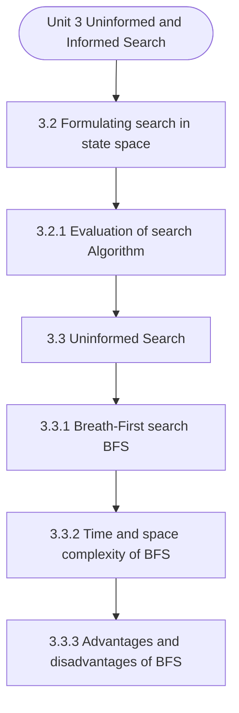

# MCS-224: Artificial Intelligence & Machine Learning
## Unit 3: Uninformed and Informed Search

> 📚 **Programme:** M.Sc. (Data Science and Analytics) | **Semester:** Semester 2  
> ⏱️ **Estimated Study Time:** ~86 mins | 📄 **Textbook Pages:** 52 Pages  
> 📥 **Original PDF:** [Download & View Authentic Textbook](../../../pdfs/Semester_2/MCS-224_Artificial_Intelligence_and_Machine_Learning/Unit-3_Uninformed_and_Informed_Search.pdf)

---

### 🎯 Executive Concept & Data Science Relevance
In modern data systems and advanced analytics, **Uninformed and Informed Search** forms a vital conceptual pillar. Artificial Intelligence models autonomous decision-making, while Machine Learning extracts predictive statistical patterns from data. From A* pathfinding in logistics to Deep Neural Networks powering Computer Vision and LLMs, AI/ML drives modern automated systems.

> [!NOTE]
> **Why this matters for your career:** Mastering uninformed and informed search equips you with the foundational principles required to reason mathematically about high-dimensional datasets, evaluate algorithm performance, and avoid statistical pitfalls in production machine learning pipelines.

### 🗺️ Visual Knowledge Architecture
The following concept map illustrates the structural hierarchy and learning trajectory of this module:



### 📖 Core Definitions & Terminology Cards

> 📌 **A* Search Algorithm**  
> - **Formal Definition:** Best-first graph search evaluating states by $f(n) = g(n) + h(n)$, where $g(n)$ is true cost from start to $n$, and $h(n)$ is heuristic estimate to goal. Guarantees optimal path if $h(n)$ is admissible ( $h(n) \le h^*(n)$ ).  
> - 💡 **Practical Intuition & Analogy:** *Finding the fastest route on GPS navigation without exploring irrelevant directions.*

> 📌 **Entropy and Information Gain**  
> - **Formal Definition:** Entropy $H(S) = -\sum p_i \log_2 p_i$ measures impurity. Information Gain $IG(S, A) = H(S) - \sum \frac{\vert S_v \vert}{\vert S \vert} H(S_v)$ measures reduction in entropy achieved by splitting on feature $A$.  
> - 💡 **Practical Intuition & Analogy:** *The mathematical criterion used by Decision Trees to select the most informative split attribute.*

> 📌 **Support Vector Machine (SVM) Margin**  
> - **Formal Definition:** Linear classifier finding the hyperplane maximizing the geometric margin $\frac{2}{\Vert\mathbf{w}\Vert}$ between classes, subject to $y_i(\mathbf{w}^T \mathbf{x}_i + b) \ge 1$. Non-linear data is separated using Kernel functions $K(\mathbf{x}, \mathbf{z}) = \phi(\mathbf{x})^T \phi(\mathbf{z})$.  
> - 💡 **Practical Intuition & Analogy:** *Finding the widest possible road separating positive and negative data clusters.*

> 📌 **Backpropagation Algorithm**  
> - **Formal Definition:** Iterative parameter optimization in neural networks utilizing the multivariate chain rule to propagate error gradients backwards from the loss function to update synaptic weights: $w_{ij} \leftarrow w_{ij} - \alpha \frac{\partial \mathcal{L}}{\partial w_{ij}}$.  
> - 💡 **Practical Intuition & Analogy:** *Automated blame assignment: adjusting each internal weight proportionally to how much it contributed to prediction error.*

### ⚡ Governing Mathematical Laws & Formula Cheatsheet
#### 🔹 A* Heuristic Evaluation Function
$$
f(n) = g(n) + h(n) \quad \text{Admissibility: } 0 \le h(n) \le h^*(n)
$$
- **Explanation:** If $h(n)$ never overestimates true remaining cost, A* tree search is guaranteed to return the optimal shortest path.

#### 🔹 Shannon Entropy Formula
$$
H(S) = -\sum_{i=1}^c p_i \log_2 p_i \quad \text{Gini Impurity: } 1 - \sum_{i=1}^c p_i^2
$$
- **Explanation:** Measures disorder in classification distributions; equals 0 when all samples belong to one class.

#### 🔹 Gradient Descent Weight Update Rule
$$
\mathbf{w}^{(t+1)} = \mathbf{w}^{(t)} - \alpha \nabla_{\mathbf{w}} \mathcal{L}(\mathbf{w})
$$
- **Explanation:** Stepping parameter vector opposite to the gradient vector scaled by learning rate $\alpha$.

#### 🔹 Neural Network Output Softmax Function
$$
\text{Softmax}(z_i) = \frac{e^{z_i}}{\sum_{j=1}^K e^{z_j}}
$$
- **Explanation:** Normalizes $K$ arbitrary logit outputs into a valid multi-class probability distribution summing to 1.

### ⚖️ Axiomatic Properties & Governing Laws
The mathematical formulations of this module are anchored by foundational algebraic and structural laws:

- **Heuristic Consistency Condition:** $h(n) \le c(n, a, n') + h(n') \implies \text{Monotonic (Guarantees A* optimality on graphs)}$
- **SVM Dual Formulation:** $\max_\alpha \sum \alpha_i - \frac{1}{2}\sum \alpha_i \alpha_j y_i y_j K(\mathbf{x}_i, \mathbf{x}_j)$
- **Universal Approximation Theorem:** A feedforward network with one non-linear hidden layer can approximate any continuous function on compact subsets of $\mathbb{R}^n$.

### 📌 Comprehensive Section-by-Section Study Breakdown
#### `3.2` Formulating search in state space

##### 📘 Theoretical Principles & Pedagogical Exposition
A state space is a graph, (V, E) where V is a set of nodes and E is a set of arcs, where each arc is directed from one node to another node.  V: a node is a data structure that contains state description, plus, optionally other information related to the parent of the node, operation to generate the node from that parent, and other bookkeeping data.

 E: Each arc corresponds to an applicable action/operation. The source and destination nodes are called as parent (immediate predecessor) and child (immediate successor) nodes with respect to each other. Ancestors(also called predecessors) and descendants (also called successors) node.

Each arc has a fixed, non-negative cost associated with it, corresponding to the cost of the action. Each node has a set of successor nodes. Corresponding to all operators (actions) that can apply at source node’s state. Expanding a node is generating successor nodes and adding them (and associated arcs) to the state-space graph.


##### ⚙️ Mathematical & Algorithmic Mechanics
- **Core Mechanism:** Asymptotic bounds evaluate algorithmic scalability as input size $n \to \infty$: upper bound $\mathcal{O}(g(n))$, lower bound $\Omega(g(n))$, and tight bound $\Theta(g(n))$. Recurrences are solved via the Master Theorem: $T(n) = a T(n/b) + f(n)$.
- **Boundary Conditions:** Degenerate input permutations (e.g. sorted inputs triggering $\mathcal{O}(n^2)$ worst-case Quicksort), and recursion call stack memory limits.

##### 📊 Practical Data Science & Production Relevance
- **Production Workflow:** Selecting optimal data structures (hash tables $\mathcal{O}(1)$ vs BSTs $\mathcal{O}(\log n)$), minimizing latency in real-time query engines, and optimizing Big Data batch workloads.
- **Real-World Pitfall:** Ignoring hardware cache locality and constant factors, or inadvertently nesting linear scans within iterative loops yielding hidden $\mathcal{O}(n^2)$ complexity.

> [!TIP]
> **Exam & Technical Interview Insight:** Solve recurrences step-by-step using substitution or Master Theorem; state tight $\mathcal{O}$, $\Omega$, and $\Theta$ bounds for best, average, and worst-case scenarios.

#### `3.2.1` Evaluation of search Algorithm

##### 📘 Theoretical Principles & Pedagogical Exposition
In any search algorithm, we select a node and generate its successor. Search strategies differ mainly on how to select an OPEN node for expansion at each step of search. Also, Insertion or deletion of any node from OPEN list depends on specific search strategy. Any search algorithms are commonly evaluated according to the following 4 criteria:It is the measure to evaluate the performance of the search algorithms:  Completeness: Guarantees finding a solution whenever one exists.

 Time Complexity: How long (worst or average case) does it take to find a solution? Usually measured in terms of the number of nodes expanded.  Space Complexity: How much space is used by the algorithm? Usually measured in terms of the maximum size that the “OPEN" list becomes during the search.

The Time and Space complexity are measured in terms of: The branching factor or maximum number of successors of any node and d: the depth of shallowest goal node (depth of the least cost solution) and m: The maximum depth (length) of any path in the state space (may be infinite).


##### ⚙️ Mathematical & Algorithmic Mechanics
- **Core Mechanism:** Asymptotic bounds evaluate algorithmic scalability as input size $n \to \infty$: upper bound $\mathcal{O}(g(n))$, lower bound $\Omega(g(n))$, and tight bound $\Theta(g(n))$. Recurrences are solved via the Master Theorem: $T(n) = a T(n/b) + f(n)$.
- **Boundary Conditions:** Degenerate input permutations (e.g. sorted inputs triggering $\mathcal{O}(n^2)$ worst-case Quicksort), and recursion call stack memory limits.

##### 📊 Practical Data Science & Production Relevance
- **Production Workflow:** Selecting optimal data structures (hash tables $\mathcal{O}(1)$ vs BSTs $\mathcal{O}(\log n)$), minimizing latency in real-time query engines, and optimizing Big Data batch workloads.
- **Real-World Pitfall:** Ignoring hardware cache locality and constant factors, or inadvertently nesting linear scans within iterative loops yielding hidden $\mathcal{O}(n^2)$ complexity.

> [!TIP]
> **Exam & Technical Interview Insight:** Solve recurrences step-by-step using substitution or Master Theorem; state tight $\mathcal{O}$, $\Omega$, and $\Theta$ bounds for best, average, and worst-case scenarios.

#### `3.3` Uninformed Search

##### 📘 Theoretical Principles & Pedagogical Exposition
The uninformed search does not contain any domain knowledge such as closeness, the location of the goal. It operates in a brute-force way as it only includes information about how to traverse the tree and how to identify leaf and goal nodes. Uninformed search applies a way in which searchtree is searched without any information about the search space like initial state operators and test for the goal, so it is also called blind search.

It examines each node of the tree until it achieves the goal node. Sometimes we may not get much relevant information to solve a problem. For Example, suppose we lost our car key, and we are not able to recall where we left, we have to search for the key with some information such as in which places, we used to place it.

It may be our pant pocket or may be the table drawer. If it is not there, then we must search the whole house to get it. The best solution would be to search in the places from the table to the wardrobe. Here we need to search blindly with less clue. This type of search is called uninformed search or blind search.


##### ⚙️ Mathematical & Algorithmic Mechanics
- **Core Mechanism:** Establishes analytical principles and computational workflows for uninformed and informed search.
- **Boundary Conditions:** Missing data values, extreme outliers, and non-standard data types.

##### 📊 Practical Data Science & Production Relevance
- **Production Workflow:** End-to-end data science processing stacks (Pandas, Scikit-learn, PyTorch).
- **Real-World Pitfall:** Failing to validate inputs before feeding data into production analytics pipelines.

> [!TIP]
> **Exam & Technical Interview Insight:** Define key concepts in uninformed search and articulate practical applications in real-world scenarios.

#### `3.3.1` Breath-First search (BFS)

##### 📘 Theoretical Principles & Pedagogical Exposition
It is the simplest form of blind search. In this technique the root node is expanded first, then all its successors are expanded and then their successors and so on. In general, in BFS, all nodes are expanded at a given depth in the search tree before any nodes at the next level are expanded.

It means that all immediate children of nodes are explored before any of the children’s children are considered. The search tree generated by BFS is shown below in Fig 2. Fig 2 Search tree for BFS Root A B C D E F G Goal Node Uninformed & Informed Search Note that BFS is a brute-search, so it generates all the nodes tor identifying the goal and note that we are using the convention that the alternatives are tried in the left-to-right order.

A BFS algorithm uses a data structure-queue that works on FIFO principle. This queue will hold all generated but still unexplored nodes. Please remember that the order in which nodes are placed on the queue or removal and exploration determines the type of search. We can implement it by using two lists called OPEN and CLOSED.


##### ⚙️ Mathematical & Algorithmic Mechanics
- **Core Mechanism:** Graph $G = (V, E)$ represented via Adjacency Matrix $\mathcal{O}(V^2)$ or Adjacency List $\mathcal{O}(V + E)$. BFS discovers shortest paths on unweighted graphs; Dijkstra greedily extracts minimum-distance vertices using priority queues; DFS detects cycles and topological orderings.
- **Boundary Conditions:** Disconnected subgraphs, negative weight cycles (violating Dijkstra preconditions), self-loops, and dense graph edge explosions $|E| \approx |V|^2$.

##### 📊 Practical Data Science & Production Relevance
- **Production Workflow:** Social network connection graphs, Graph Neural Networks (GNNs), dependency DAG resolution in build compilers, and routing optimization in supply chain logistics.
- **Real-World Pitfall:** Invoking Dijkstra's algorithm on graphs with negative edge weights instead of Bellman-Ford, resulting in erroneous distance derivations.

> [!TIP]
> **Exam & Technical Interview Insight:** Trace Dijkstra's algorithm or Kruskal's/Prim's MST algorithm table step-by-step; show vertex distance updates and predecessor pointers at each iteration.

#### `3.3.2` Time and space complexity of BFS

##### 📘 Theoretical Principles & Pedagogical Exposition
Consider a complete search tree of depth d where each non-leaf node has b children (i.e., branching factor), has a total of 1+b+b2+b3+⋯+bd = 1.(bd+1-1) nodes. (b-1) Time complexity is the number of nodes generated, so time complexity of BFS algorithm is O(bd) Open= D,E,D,G CLOSED={A,B,C} Open=C,F,B,F CLOSED={A,B,C,D,E.G} Step2: A is removed from open.

The node is expended, and its children B and C are generated. They are placed at the back of open. Step: 3: Node B is removed from open and is expended. Its children D, E are generated and put at the back of open. Step 4: Node C is removed from open and is expanded its children D and G are added to the back of open.

Step 6: Node E is removed from open. It has no children Step 7: D is expanded, B and F are put in OPEN. Step 8: G is selected for expansion. It is found to be a goal node. So, the algorithm returns the path ACG by following the parent pointers of the node corresponding to G. The algorithm terminates.


##### ⚙️ Mathematical & Algorithmic Mechanics
- **Core Mechanism:** Asymptotic bounds evaluate algorithmic scalability as input size $n \to \infty$: upper bound $\mathcal{O}(g(n))$, lower bound $\Omega(g(n))$, and tight bound $\Theta(g(n))$. Recurrences are solved via the Master Theorem: $T(n) = a T(n/b) + f(n)$.
- **Boundary Conditions:** Degenerate input permutations (e.g. sorted inputs triggering $\mathcal{O}(n^2)$ worst-case Quicksort), and recursion call stack memory limits.

##### 📊 Practical Data Science & Production Relevance
- **Production Workflow:** Selecting optimal data structures (hash tables $\mathcal{O}(1)$ vs BSTs $\mathcal{O}(\log n)$), minimizing latency in real-time query engines, and optimizing Big Data batch workloads.
- **Real-World Pitfall:** Ignoring hardware cache locality and constant factors, or inadvertently nesting linear scans within iterative loops yielding hidden $\mathcal{O}(n^2)$ complexity.

> [!TIP]
> **Exam & Technical Interview Insight:** Solve recurrences step-by-step using substitution or Master Theorem; state tight $\mathcal{O}$, $\Omega$, and $\Theta$ bounds for best, average, and worst-case scenarios.

#### `3.3.3` Advantages & disadvantages of BFS

##### 📘 Theoretical Principles & Pedagogical Exposition
Advantages: BFS has some advantages and are given below 1. BFS will never get trapped exploring bund alley. It is guaranteed to find a solution if one exists. Disadvantages: BFS has certain disadvantages also. They are given below- 1. Time complexity and Space complexity are both O(bd) i.e., exponential type.

This is very hurdle. All nodes are to be generated in BFS. So, even unwanted nodes are to be remembered (stored in queue) which is of no practical use of the search.


##### ⚙️ Mathematical & Algorithmic Mechanics
- **Core Mechanism:** Graph $G = (V, E)$ represented via Adjacency Matrix $\mathcal{O}(V^2)$ or Adjacency List $\mathcal{O}(V + E)$. BFS discovers shortest paths on unweighted graphs; Dijkstra greedily extracts minimum-distance vertices using priority queues; DFS detects cycles and topological orderings.
- **Boundary Conditions:** Disconnected subgraphs, negative weight cycles (violating Dijkstra preconditions), self-loops, and dense graph edge explosions $|E| \approx |V|^2$.

##### 📊 Practical Data Science & Production Relevance
- **Production Workflow:** Social network connection graphs, Graph Neural Networks (GNNs), dependency DAG resolution in build compilers, and routing optimization in supply chain logistics.
- **Real-World Pitfall:** Invoking Dijkstra's algorithm on graphs with negative edge weights instead of Bellman-Ford, resulting in erroneous distance derivations.

> [!TIP]
> **Exam & Technical Interview Insight:** Trace Dijkstra's algorithm or Kruskal's/Prim's MST algorithm table step-by-step; show vertex distance updates and predecessor pointers at each iteration.

#### `3.3.4` Depth First search (DFS)

##### 📘 Theoretical Principles & Pedagogical Exposition
A Depth-First Search (DFS) explores a path all the way to a leaf before backtracking and exploring another path. That is expand deepest unexpanded node (expand most recently generated deepest node first). The search tree generated by the DFS is show in figure below: Artificial Intelligence – Introduction Fig 4 Depth first search (DFS) tree In depth-first search we go as far down as possible into the search tree/graph before backing up and trying alternatives.

It works by always generating a descendent of the most recently expanded node until some depth cut off is reached and then backtracks to next most recently expanded node and generates one of its descendants. So only path of nodes from the initial node to the current node is stored, in order to execute the algorithm.

For example, consider the following tree and see how the nodes are expended using DFS algorithm. 5 Search tree for DFS Example1: After searching root node S, then A and C, the search backtracks and tries another path from A. Nodes are explored in the order S,A,C,D,B,E,F. Here again we use the list OPEN as a STACK to implement DFS.


##### ⚙️ Mathematical & Algorithmic Mechanics
- **Core Mechanism:** Graph $G = (V, E)$ represented via Adjacency Matrix $\mathcal{O}(V^2)$ or Adjacency List $\mathcal{O}(V + E)$. BFS discovers shortest paths on unweighted graphs; Dijkstra greedily extracts minimum-distance vertices using priority queues; DFS detects cycles and topological orderings.
- **Boundary Conditions:** Disconnected subgraphs, negative weight cycles (violating Dijkstra preconditions), self-loops, and dense graph edge explosions $|E| \approx |V|^2$.

##### 📊 Practical Data Science & Production Relevance
- **Production Workflow:** Social network connection graphs, Graph Neural Networks (GNNs), dependency DAG resolution in build compilers, and routing optimization in supply chain logistics.
- **Real-World Pitfall:** Invoking Dijkstra's algorithm on graphs with negative edge weights instead of Bellman-Ford, resulting in erroneous distance derivations.

> [!TIP]
> **Exam & Technical Interview Insight:** Trace Dijkstra's algorithm or Kruskal's/Prim's MST algorithm table step-by-step; show vertex distance updates and predecessor pointers at each iteration.

#### `3.3.5` Performance of DFS algorithm

##### 📘 Theoretical Principles & Pedagogical Exposition
 Time Required for DFS for tree of b branching factor and m depth (of shallowest goal node) is O(b^m).  Space (memory) requirement for a tree with b branching factor and m depth (of shallowest goal node) is also O(bm)  BFS algorithm is Complete (if b is finite).  BFS algorithm isnotOptimal.


##### ⚙️ Mathematical & Algorithmic Mechanics
- **Core Mechanism:** Asymptotic bounds evaluate algorithmic scalability as input size $n \to \infty$: upper bound $\mathcal{O}(g(n))$, lower bound $\Omega(g(n))$, and tight bound $\Theta(g(n))$. Recurrences are solved via the Master Theorem: $T(n) = a T(n/b) + f(n)$.
- **Boundary Conditions:** Degenerate input permutations (e.g. sorted inputs triggering $\mathcal{O}(n^2)$ worst-case Quicksort), and recursion call stack memory limits.

##### 📊 Practical Data Science & Production Relevance
- **Production Workflow:** Selecting optimal data structures (hash tables $\mathcal{O}(1)$ vs BSTs $\mathcal{O}(\log n)$), minimizing latency in real-time query engines, and optimizing Big Data batch workloads.
- **Real-World Pitfall:** Ignoring hardware cache locality and constant factors, or inadvertently nesting linear scans within iterative loops yielding hidden $\mathcal{O}(n^2)$ complexity.

> [!TIP]
> **Exam & Technical Interview Insight:** Solve recurrences step-by-step using substitution or Master Theorem; state tight $\mathcal{O}$, $\Omega$, and $\Theta$ bounds for best, average, and worst-case scenarios.

### 📐 Step-by-Step Solved Mathematical Examples
To solidify your theoretical understanding, work through these fully solved, step-by-step mathematical problems:

#### 🧮 Example 1: Shannon Entropy and Information Gain Calculation
> **Problem Statement:**  
> A training dataset $S$ has 14 instances: 9 Positive ($+$) and 5 Negative ($-$). An attribute $A$ splits $S$ into $S_1$ (6 $+$, 2 $-$) and $S_2$ (3 $+$, 3 $-$). Compute Entropy $H(S)$ and Information Gain $IG(S, A)$.

**Detailed Step-by-Step Solution:**

1. **Parent Entropy $H(S)$:**

$$
H(S) = -\left(\frac{9}{14} \log_2 \frac{9}{14} + \frac{5}{14} \log_2 \frac{5}{14}\right) \approx 0.940 \text{ bits}
$$


2. **Subset Entropies:**
- For $S_1$ (total 8): $H(S_1) = -\left(\frac{6}{8}\log_2\frac{6}{8} + \frac{2}{8}\log_2\frac{2}{8}\right) = 0.811 \text{ bits}$
- For $S_2$ (total 6): $H(S_2) = -\left(\frac{3}{6}\log_2\frac{3}{6} + \frac{3}{6}\log_2\frac{3}{6}\right) = 1.000 \text{ bits}$

3. **Weighted Child Entropy:**

$$
H(S, A) = \frac{8}{14}(0.811) + \frac{6}{14}(1.000) = 0.463 + 0.429 = 0.892 \text{ bits}
$$


4. **Information Gain:**

$$
IG(S, A) = H(S) - H(S, A) = 0.940 - 0.892 = 0.048 \text{ bits}
$$

(Attribute provides 0.048 bits of entropy reduction).

#### 🧮 Example 2: A* Search Step Evaluation
> **Problem Statement:**  
> In graph navigation, node $N$ has exact path cost from start $g(N) = 14$ and straight-line heuristic to goal $h(N) = 11$. For node $M$, $g(M) = 18, h(M) = 6$. Which node is expanded next by A*?

**Detailed Step-by-Step Solution:**

1. Compute $f(n) = g(n) + h(n)$:
- $f(N) = 14 + 11 = 25$
- $f(M) = 18 + 6 = 24$

2. Decision: A* selects the node with minimal $f(n)$. Since $f(M) = 24 < f(N) = 25$, **Node $M$ is expanded next**.

### 💻 Practical Data Science Implementation (Python)
Theory translates directly into production algorithms. Below is a self-contained, commented Python implementation illustrating the core operations of this unit:

```python
import numpy as np

# Decision Tree Entropy and Information Gain from scratch
def entropy(labels):
    counts = np.bincount(labels)
    probs = counts[counts > 0] / len(labels)
    return -np.sum(probs * np.log2(probs))

def information_gain(parent_labels, left_split, right_split):
    h_parent = entropy(parent_labels)
    n = len(parent_labels)
    h_children = (len(left_split)/n)*entropy(left_split) + (len(right_split)/n)*entropy(right_split)
    return h_parent - h_children

# Sample binary targets: 9 ones, 5 zeros
y_parent = np.array([1]*9 + [0]*5)
y_left = np.array([1]*6 + [0]*2)
y_right = np.array([1]*3 + [0]*3)

ig = information_gain(y_parent, y_left, y_right)
print(f"Parent Entropy: {entropy(y_parent):.4f}")
print(f"Information Gain: {ig:.4f} bits")
```

### 💡 Interactive Self-Assessment Checkpoints
Test your comprehension before proceeding. Tap each question to reveal the comprehensive explanation:

<details>
<summary><b>Checkpoint 1:</b> What condition must a heuristic $h(n)$ satisfy for A* search to be optimal? <i>(Tap to reveal answer)</i></summary>

> **Answer & Analysis:**  
> The heuristic must be **Admissible**, meaning it never overestimates the actual minimal cost to reach the goal state ( $h(n) \le h^*(n)$ ).
</details>

<details>
<summary><b>Checkpoint 2:</b> What is the formula for Information Gain used in Decision Trees? <i>(Tap to reveal answer)</i></summary>

> **Answer & Analysis:**  
> $IG(S, A) = H(S) - \sum_{v \in \text{Values}(A)} \frac{\vert S_v \vert}{\vert S \vert} H(S_v)$
</details>

<details>
<summary><b>Checkpoint 3:</b> Why is the Softmax function used in multi-class classification neural networks? <i>(Tap to reveal answer)</i></summary>

> **Answer & Analysis:**  
> It converts unconstrained real numbers (logits) into a valid probability distribution where each value is in $[0, 1]$ and all values sum strictly to 1.
</details>

### 🎯 Executive Module Wrap-Up
- **Central Idea:** Uninformed and Informed Search provides essential mathematical and algorithmic tools directly utilized in Data Science.
- **Mathematical Rigor:** Formulas and laws must be memorized with attention to boundary conditions and assumptions.
- **Full Textbook Coverage:** For exhaustive multi-page derivations, proofs, and supplementary exercises, consult the [Authentic IGNOU Textbook](../../../pdfs/Semester_2/MCS-224_Artificial_Intelligence_and_Machine_Learning/Unit-3_Uninformed_and_Informed_Search.pdf).

---
### 🧭 Navigation & Syllabus Index
[⬅ Previous: Unit 2](unit_02_Problem_Solving_Using_Search.md) | [📑 Course Index](README.md) | [Next: Unit 4 ➡](unit_04_Predicate_and_Propositional_Logic.md)
