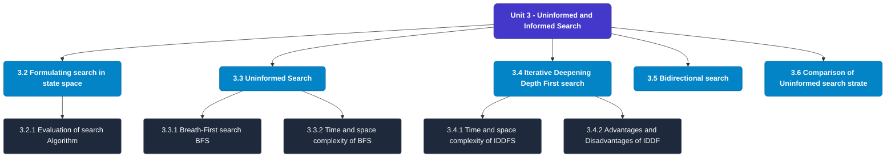

# MCS-224: Artificial Intelligence & Machine Learning
## Unit 3: Uninformed and Informed Search

> 📚 **Programme:** M.Sc. (Data Science and Analytics) | **Semester:** Semester 2  
> ⏱️ **Estimated Study Time:** ~86 mins | 📄 **Textbook Pages:** 52 Pages  
> 📥 **Original PDF:** [Download & View Textbook](../../../pdfs/Semester_2/MCS-224_Artificial_Intelligence_and_Machine_Learning/Unit-3_Uninformed_and_Informed_Search.pdf)

---

### 🎯 Executive Concept & Data Science Relevance
In modern data systems, **Uninformed and Informed Search** forms a vital conceptual pillar. Artificial Intelligence models autonomous decision-making, while Machine Learning extracts predictive statistical patterns from data. From A* pathfinding in logistics to Deep Neural Networks powering Computer Vision and LLMs, AI/ML drives modern automated systems.

> [!NOTE]
> **Why this matters for your career:** Mastering uninformed and informed search equips you with the foundational principles required to reason mathematically about high-dimensional datasets, evaluate algorithm performance, and avoid statistical pitfalls in production machine learning pipelines.

### 🗺️ Visual Knowledge Architecture
The following concept map illustrates the structural hierarchy and learning trajectory of this module:

### 📖 Core Definitions & Terminology Cards
| Term | Formal Mathematical / Technical Definition | Intuitive Analogy / Concrete Example |
| :--- | :--- | :--- |
| **A* Search Algorithm** | Best-first graph search evaluating states by $f(n) = g(n) + h(n)$, where $g(n)$ is true cost from start to $n$, and $h(n)$ is heuristic estimate to goal. Guarantees optimal path if $h(n)$ is admissible ($h(n) \le h^*(n)$). | *Finding the fastest route on GPS navigation without exploring irrelevant directions.* |
| **Entropy and Information Gain** | Entropy $H(S) = -\sum p_i \log_2 p_i$ measures impurity. Information Gain $IG(S, A) = H(S) - \sum \frac{\|S_v\|}{\|S\|} H(S_v)$ measures reduction in entropy achieved by splitting on feature $A$. | *The mathematical criterion used by Decision Trees to select the most informative split attribute.* |
| **Support Vector Machine (SVM) Margin** | Linear classifier finding the hyperplane maximizing the geometric margin $\frac{2}{\\|\mathbf{w}\\|}$ between classes, subject to $y_i(\mathbf{w}^T \mathbf{x}_i + b) \ge 1$. Non-linear data is separated using Kernel functions $K(\mathbf{x}, \mathbf{z}) = \phi(\mathbf{x})^T \phi(\mathbf{z})$. | *Finding the widest possible road separating positive and negative data clusters.* |
| **Backpropagation Algorithm** | Iterative parameter optimization in neural networks utilizing the multivariate chain rule to propagate error gradients backwards from the loss function to update synaptic weights: $w_{ij} \leftarrow w_{ij} - \alpha \frac{\partial \mathcal{L}}{\partial w_{ij}}$. | *Automated blame assignment: adjusting each internal weight proportionally to how much it contributed to prediction error.* |

### ⚡ Governing Mathematical Laws & Formula Cheatsheet
#### 🔹 A* Heuristic Evaluation Function
$$f(n) = g(n) + h(n) \quad \text{Admissibility: } 0 \le h(n) \le h^*(n)$$
- **Explanation:** If $h(n)$ never overestimates true remaining cost, A* tree search is guaranteed to return the optimal shortest path.

#### 🔹 Shannon Entropy Formula
$$H(S) = -\sum_{i=1}^c p_i \log_2 p_i \quad \text{Gini Impurity: } 1 - \sum_{i=1}^c p_i^2$$
- **Explanation:** Measures disorder in classification distributions; equals 0 when all samples belong to one class.

#### 🔹 Gradient Descent Weight Update Rule
$$\mathbf{w}^{(t+1)} = \mathbf{w}^{(t)} - \alpha \nabla_{\mathbf{w}} \mathcal{L}(\mathbf{w})$$
- **Explanation:** Stepping parameter vector opposite to the gradient vector scaled by learning rate $\alpha$.

#### 🔹 Neural Network Output Softmax Function
$$\text{Softmax}(z_i) = \frac{e^{z_i}}{\sum_{j=1}^K e^{z_j}}$$
- **Explanation:** Normalizes $K$ arbitrary logit outputs into a valid multi-class probability distribution summing to 1.

### 📌 Detailed Section-by-Section Study Breakdown
#### `3.2` Formulating search in state space
- **Core Concept:** A state space is a graph, (V, E) where V is a set of nodes and E is a set of arcs, where each arc is directed from one node to another node.
- **Core Concept:**  V: a node is a data structure that contains state description, plus, optionally other information related to the parent of the node, operation to generate the node from that parent, and other bookkeeping data.
- **Core Concept:**  E: Each arc corresponds to an applicable action/operation.
- **Data Science Application:** Provides foundational structures used directly in statistical modeling, query execution, and machine learning pipelines.

> [!TIP]
> **Exam & Interview Tip:** Be prepared to state the formal definition of formulating search in state space and derive its primary equations step-by-step.

#### `3.2.1` Evaluation of search Algorithm
- **Core Concept:** In any search algorithm, we select a node and generate its successor.
- **Core Concept:** Search strategies differ mainly on how to select an OPEN node for expansion at each step of search.
- **Core Concept:** Also, Insertion or deletion of any node from OPEN list depends on specific search strategy.
- **Data Science Application:** Provides foundational structures used directly in statistical modeling, query execution, and machine learning pipelines.

> [!TIP]
> **Exam & Interview Tip:** Be prepared to state the formal definition of evaluation of search algorithm and derive its primary equations step-by-step.

#### `3.3` Uninformed Search
- **Core Concept:** The uninformed search does not contain any domain knowledge such as closeness, the location of the goal.
- **Core Concept:** It operates in a brute-force way as it only includes information about how to traverse the tree and how to identify leaf and goal nodes.
- **Core Concept:** Uninformed search applies a way in which searchtree is searched without any information about the search space like initial state operators and test for the goal, so it is also called blind search.
- **Data Science Application:** Provides foundational structures used directly in statistical modeling, query execution, and machine learning pipelines.

> [!TIP]
> **Exam & Interview Tip:** Be prepared to state the formal definition of uninformed search and derive its primary equations step-by-step.

#### `3.3.1` Breath-First search (BFS)
- **Core Concept:** It is the simplest form of blind search.
- **Core Concept:** In this technique the root node is expanded first, then all its successors are expanded and then their successors and so on.
- **Core Concept:** In general, in BFS, all nodes are expanded at a given depth in the search tree before any nodes at the next level are expanded.
- **Data Science Application:** Provides foundational structures used directly in statistical modeling, query execution, and machine learning pipelines.

> [!TIP]
> **Exam & Interview Tip:** Be prepared to state the formal definition of breath-first search (bfs) and derive its primary equations step-by-step.

#### `3.3.2` Time and space complexity of BFS
- **Core Concept:** Consider a complete search tree of depth d where each non-leaf node has b children (i.e., branching factor), has a total of 1+b+b2+b3+⋯+bd = 1.(bd+1-1) nodes.
- **Core Concept:** (b-1) Time complexity is the number of nodes generated, so time complexity of BFS algorithm is O(bd) Open= D,E,D,G CLOSED={A,B,C} Open=C,F,B,F CLOSED={A,B,C,D,E.G} Step2: A is removed from open.
- **Core Concept:** The node is expended, and its children B and C are generated.
- **Data Science Application:** Provides foundational structures used directly in statistical modeling, query execution, and machine learning pipelines.

> [!TIP]
> **Exam & Interview Tip:** Be prepared to state the formal definition of time and space complexity of bfs and derive its primary equations step-by-step.

#### `3.3.3` Advantages & disadvantages of BFS
- **Core Concept:** Advantages: BFS has some advantages and are given below 1.
- **Core Concept:** BFS will never get trapped exploring bund alley.
- **Core Concept:** Disadvantages: BFS has certain disadvantages also.
- **Data Science Application:** Provides foundational structures used directly in statistical modeling, query execution, and machine learning pipelines.

> [!TIP]
> **Exam & Interview Tip:** Be prepared to state the formal definition of advantages & disadvantages of bfs and derive its primary equations step-by-step.

### 💡 Interactive Self-Assessment Checkpoints
Test your comprehension before proceeding. Tap each question to reveal the comprehensive explanation:

<b>Checkpoint 1:</b> What condition must a heuristic $h(n)$ satisfy for A* search to be optimal? <i>(Tap to reveal answer)</i>

> **Answer & Analysis:**  
> The heuristic must be **Admissible**, meaning it never overestimates the actual minimal cost to reach the goal state ($h(n) \le h^*(n)$).

<b>Checkpoint 2:</b> What is the formula for Information Gain used in Decision Trees? <i>(Tap to reveal answer)</i>

> **Answer & Analysis:**  
> $$IG(S, A) = H(S) - \sum_{v \in \text{Values}(A)} \frac{|S_v|}{|S|} H(S_v)$$

<b>Checkpoint 3:</b> Why is the Softmax function used in multi-class classification neural networks? <i>(Tap to reveal answer)</i>

> **Answer & Analysis:**  
> It converts unconstrained real numbers (logits) into a valid probability distribution where each value is in $[0, 1]$ and all values sum strictly to $1$.

<b>Checkpoint 4:</b> Q.5 Apply AO* algorithm on the following graph. Heuristic value is also given at every node and assume the edge cost value of each node is <i>(Tap to reveal answer)</i>

> **Answer & Analysis:**  
> This question tests your conceptual mastery of Uninformed and Informed Search. Review the governing formulas and section breakdowns above to formulate a complete, rigorous proof or derivation.

<b>Checkpoint 5:</b> Example 6: Given the 3 matrices A1, A2, A3 with their dimensions ( <i>(Tap to reveal answer)</i>

> **Answer & Analysis:**  
> This question tests your conceptual mastery of Uninformed and Informed Search. Review the governing formulas and section breakdowns above to formulate a complete, rigorous proof or derivation.

<b>Checkpoint 6:</b> ,(4×10),(10×1). Consider the problem of solving this chain matrix multiplication. Apply the concept of AND-OR graph and find a minimum cost solution tree. (Multiple choice Questions) Q. <i>(Tap to reveal answer)</i>

> **Answer & Analysis:**  
> This question tests your conceptual mastery of Uninformed and Informed Search. Review the governing formulas and section breakdowns above to formulate a complete, rigorous proof or derivation.

### 🎯 Executive Module Wrap-Up
- **Central Idea:** Uninformed and Informed Search provides essential mathematical and algorithmic tools directly utilized in Data Science.
- **Mathematical Rigor:** Formulas and laws must be memorized with attention to boundary conditions and assumptions.
- **Full Textbook Coverage:** For exhaustive multi-page derivations, proofs, and supplementary exercises, consult the [Authentic IGNOU Textbook](../../../pdfs/Semester_2/MCS-224_Artificial_Intelligence_and_Machine_Learning/Unit-3_Uninformed_and_Informed_Search.pdf).

---
### 🧭 Navigation & Syllabus Index
[⬅ Previous: Unit 2](unit_02_Problem_Solving_Using_Search.md) | [📑 Course Index](README.md) | [Next: Unit 4 ➡](unit_04_Predicate_and_Propositional_Logic.md)
