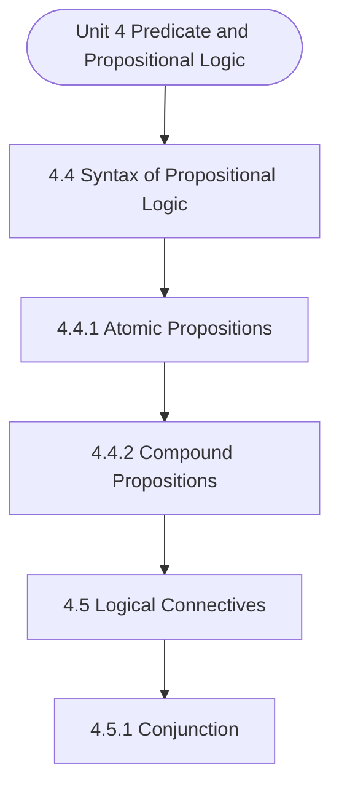

# MCS-224: Artificial Intelligence & Machine Learning
## Unit 4: Predicate and Propositional Logic

> 📚 **Programme:** M.Sc. (Data Science and Analytics) | **Semester:** Semester 2  
> ⏱️ **Estimated Study Time:** ~62 mins | 📄 **Textbook Pages:** 34 Pages  
> 📥 **Original PDF:** [Download & View Textbook](../../../pdfs/Semester_2/MCS-224_Artificial_Intelligence_and_Machine_Learning/Unit-4_Predicate_and_Propositional_Logic.pdf)

---

### 🎯 Executive Concept & Data Science Relevance
In modern data systems, **Predicate and Propositional Logic** forms a vital conceptual pillar. Artificial Intelligence models autonomous decision-making, while Machine Learning extracts predictive statistical patterns from data. From A* pathfinding in logistics to Deep Neural Networks powering Computer Vision and LLMs, AI/ML drives modern automated systems.

> [!NOTE]
> **Why this matters for your career:** Mastering predicate and propositional logic equips you with the foundational principles required to reason mathematically about high-dimensional datasets, evaluate algorithm performance, and avoid statistical pitfalls in production machine learning pipelines.

### 🗺️ Visual Knowledge Architecture
The following concept map illustrates the structural hierarchy and learning trajectory of this module:

### 📖 Core Definitions & Terminology Cards

> 📌 **A* Search Algorithm**  
> - **Formal Definition:** Best-first graph search evaluating states by $f(n) = g(n) + h(n)$, where $g(n)$ is true cost from start to $n$, and $h(n)$ is heuristic estimate to goal. Guarantees optimal path if $h(n)$ is admissible ( $h(n) \le h^*(n)$ ).  
> - 💡 **Practical Intuition & Analogy:** *Finding the fastest route on GPS navigation without exploring irrelevant directions.*

> 📌 **Entropy and Information Gain**  
> - **Formal Definition:** Entropy $H(S) = -\sum p_i \log_2 p_i$ measures impurity. Information Gain $IG(S, A) = H(S) - \sum \frac{\vert S_v \vert}{\vert S \vert} H(S_v)$ measures reduction in entropy achieved by splitting on feature $A$.  
> - 💡 **Practical Intuition & Analogy:** *The mathematical criterion used by Decision Trees to select the most informative split attribute.*

> 📌 **Support Vector Machine (SVM) Margin**  
> - **Formal Definition:** Linear classifier finding the hyperplane maximizing the geometric margin $\frac{2}{\Vert\mathbf{w}\Vert}$ between classes, subject to $y_i(\mathbf{w}^T \mathbf{x}_i + b) \ge 1$. Non-linear data is separated using Kernel functions $K(\mathbf{x}, \mathbf{z}) = \phi(\mathbf{x})^T \phi(\mathbf{z})$.  
> - 💡 **Practical Intuition & Analogy:** *Finding the widest possible road separating positive and negative data clusters.*

> 📌 **Backpropagation Algorithm**  
> - **Formal Definition:** Iterative parameter optimization in neural networks utilizing the multivariate chain rule to propagate error gradients backwards from the loss function to update synaptic weights: $w_{ij} \leftarrow w_{ij} - \alpha \frac{\partial \mathcal{L}}{\partial w_{ij}}$.  
> - 💡 **Practical Intuition & Analogy:** *Automated blame assignment: adjusting each internal weight proportionally to how much it contributed to prediction error.*

### ⚡ Governing Mathematical Laws & Formula Cheatsheet
#### 🔹 A* Heuristic Evaluation Function
$$
f(n) = g(n) + h(n) \quad \text{Admissibility: } 0 \le h(n) \le h^*(n)
$$
- **Explanation:** If $h(n)$ never overestimates true remaining cost, A* tree search is guaranteed to return the optimal shortest path.

#### 🔹 Shannon Entropy Formula
$$
H(S) = -\sum_{i=1}^c p_i \log_2 p_i \quad \text{Gini Impurity: } 1 - \sum_{i=1}^c p_i^2
$$
- **Explanation:** Measures disorder in classification distributions; equals 0 when all samples belong to one class.

#### 🔹 Gradient Descent Weight Update Rule
$$
\mathbf{w}^{(t+1)} = \mathbf{w}^{(t)} - \alpha \nabla_{\mathbf{w}} \mathcal{L}(\mathbf{w})
$$
- **Explanation:** Stepping parameter vector opposite to the gradient vector scaled by learning rate $\alpha$.

#### 🔹 Neural Network Output Softmax Function
$$
\text{Softmax}(z_i) = \frac{e^{z_i}}{\sum_{j=1}^K e^{z_j}}
$$
- **Explanation:** Normalizes $K$ arbitrary logit outputs into a valid multi-class probability distribution summing to 1.

### 📌 Detailed Section-by-Section Study Breakdown
#### `4.4` Syntax of Propositional Logic
- **Core Concept:** The syntax of propositional logic allows two types of sentences to represent knowledge.
- **Core Concept:** The two types are as follows: 4.4.1 Atomic Propositions These are simplest propositions containing a single proposition symbol and are either true or false.
- **Core Concept:** Some of the examples of atomic propositions are as follows: 1.
- **Data Science Application:** Provides foundational structures used directly in statistical modeling, query execution, and machine learning pipelines.

> [!TIP]
> **Exam & Interview Tip:** Be prepared to state the formal definition of syntax of propositional logic and derive its primary equations step-by-step.

#### `4.4.1` Atomic Propositions
- **Core Concept:** These are simplest propositions containing a single proposition symbol and are either true or false.
- **Core Concept:** Some of the examples of atomic propositions are as follows: 1.
- **Core Concept:** “Venus is the closest planet to the Sun in the solar system” is an atomic preposition since it is a false fact.
- **Data Science Application:** Provides foundational structures used directly in statistical modeling, query execution, and machine learning pipelines.

> [!TIP]
> **Exam & Interview Tip:** Be prepared to state the formal definition of atomic propositions and derive its primary equations step-by-step.

#### `4.4.2` Compound Propositions
- **Core Concept:** They are formed by a collection of atomic propositions joined with logical connectives or logical operators.
- **Core Concept:** Some of the examples of compound propositions are as follows: 1.
- **Core Concept:** The Sun is very bright today and its very hot outside.
- **Data Science Application:** Provides foundational structures used directly in statistical modeling, query execution, and machine learning pipelines.

> [!TIP]
> **Exam & Interview Tip:** Be prepared to state the formal definition of compound propositions and derive its primary equations step-by-step.

#### `4.5` Logical Connectives
- **Core Concept:** Logical connectives are the operators used to join two or more atomic propositions (operands).
- **Core Concept:** The joining should be done in a way that the logic and truth value of the obtained compound proposition is dependent on the input atomic propositions and the connective used.
- **Core Concept:** Conjunction A proposition “A ∧ B”with connective ∧ is known as conjunction of A and B.
- **Data Science Application:** Provides foundational structures used directly in statistical modeling, query execution, and machine learning pipelines.

> [!TIP]
> **Exam & Interview Tip:** Be prepared to state the formal definition of logical connectives and derive its primary equations step-by-step.

#### `4.5.1` Conjunction
- **Core Concept:** A proposition “A ∧ B”with connective ∧ is known as conjunction of A and B.
- **Core Concept:** It is a proposition (or operation) which is true only when both the constituent propositions are true.
- **Core Concept:** Even if one of the input propositions is false then the 142 Artificial Intelligence – Introduction output is also false.
- **Data Science Application:** Provides foundational structures used directly in statistical modeling, query execution, and machine learning pipelines.

> [!TIP]
> **Exam & Interview Tip:** Be prepared to state the formal definition of conjunction and derive its primary equations step-by-step.

#### `4.5.2` Disjunction
- **Core Concept:** A proposition “A ∨ B”with connective ∨ is known as disjunction of A and B.
- **Core Concept:** It is a proposition (or operation) which is true when at least one of the constituent propositions are true.
- **Core Concept:** The output is false only when both the input propositions are false.
- **Data Science Application:** Provides foundational structures used directly in statistical modeling, query execution, and machine learning pipelines.

> [!TIP]
> **Exam & Interview Tip:** Be prepared to state the formal definition of disjunction and derive its primary equations step-by-step.

### 💡 Interactive Self-Assessment Checkpoints
Test your comprehension before proceeding. Tap each question to reveal the comprehensive explanation:

<b>Checkpoint 1:</b> What condition must a heuristic $h(n)$ satisfy for A* search to be optimal? <i>(Tap to reveal answer)</i>

> **Answer & Analysis:**  
> The heuristic must be **Admissible**, meaning it never overestimates the actual minimal cost to reach the goal state ( $h(n) \le h^*(n)$ ).

<b>Checkpoint 2:</b> What is the formula for Information Gain used in Decision Trees? <i>(Tap to reveal answer)</i>

> **Answer & Analysis:**  
> $IG(S, A) = H(S) - \sum_{v \in \text{Values}(A)} \frac{\vert S_v \vert}{\vert S \vert} H(S_v)$

<b>Checkpoint 3:</b> Why is the Softmax function used in multi-class classification neural networks? <i>(Tap to reveal answer)</i>

> **Answer & Analysis:**  
> It converts unconstrained real numbers (logits) into a valid probability distribution where each value is in $[0, 1]$ and all values sum strictly to $1$.

<b>Checkpoint 4:</b> Sachin Tendulkar is one of the best cricketers in India. <i>(Tap to reveal answer)</i>

> **Answer & Analysis:**  
> This question tests your conceptual mastery of Predicate and Propositional Logic. Review the governing formulas and section breakdowns above to formulate a complete, rigorous proof or derivation.

<b>Checkpoint 5:</b> The honorable Ram Nath Kovind is the 10th and current president of India. <i>(Tap to reveal answer)</i>

> **Answer & Analysis:**  
> This question tests your conceptual mastery of Predicate and Propositional Logic. Review the governing formulas and section breakdowns above to formulate a complete, rigorous proof or derivation.

<b>Checkpoint 6:</b> Lord Ram of the kingdom of Ayodhya is an example of a people's king. <i>(Tap to reveal answer)</i>

> **Answer & Analysis:**  
> This question tests your conceptual mastery of Predicate and Propositional Logic. Review the governing formulas and section breakdowns above to formulate a complete, rigorous proof or derivation.

### 🎯 Executive Module Wrap-Up
- **Central Idea:** Predicate and Propositional Logic provides essential mathematical and algorithmic tools directly utilized in Data Science.
- **Mathematical Rigor:** Formulas and laws must be memorized with attention to boundary conditions and assumptions.
- **Full Textbook Coverage:** For exhaustive multi-page derivations, proofs, and supplementary exercises, consult the [Authentic IGNOU Textbook](../../../pdfs/Semester_2/MCS-224_Artificial_Intelligence_and_Machine_Learning/Unit-4_Predicate_and_Propositional_Logic.pdf).

---
### 🧭 Navigation & Syllabus Index
[⬅ Previous: Unit 3](unit_03_Uninformed_and_Informed_Search.md) | [📑 Course Index](README.md) | [Next: Unit 5 ➡](unit_05_First_Order_Logic.md)
