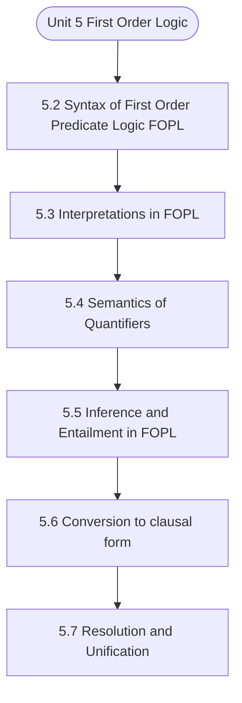

# MCS-224: Artificial Intelligence & Machine Learning
## Unit 5: First Order Logic

> 📚 **Programme:** M.Sc. (Data Science and Analytics) | **Semester:** Semester 2  
> ⏱️ **Estimated Study Time:** ~67 mins | 📄 **Textbook Pages:** 32 Pages  
> 📥 **Original PDF:** [Download & View Authentic Textbook](../../../pdfs/Semester_2/MCS-224_Artificial_Intelligence_and_Machine_Learning/Unit-5_First_Order_Logic.pdf)

---

### 🎯 Executive Concept & Data Science Relevance
In modern data systems and advanced analytics, **First Order Logic** forms a vital conceptual pillar. Relations form the mathematical blueprint of Relational Database Management Systems (RDBMS). Foreign keys, functional dependencies, equivalence partitioning in clustering, and partial orderings in graph dependency pipelines all originate directly from formal relation theory.

> [!NOTE]
> **Why this matters for your career:** Mastering first order logic equips you with the foundational principles required to reason mathematically about high-dimensional datasets, evaluate algorithm performance, and avoid statistical pitfalls in production machine learning pipelines.

### 🗺️ Visual Knowledge Architecture
The following concept map illustrates the structural hierarchy and learning trajectory of this module:



### 📖 Core Definitions & Terminology Cards

> 📌 **Binary Relation**  
> - **Formal Definition:** A binary relation $R$ from set $A$ to set $B$ is any subset of the Cartesian product $A \times B$, i.e., $R \subseteq A \times B$. If $(a, b) \in R$, we write $aRb$.  
> - 💡 **Practical Intuition & Analogy:** *A table connecting users to purchased items in an e-commerce platform.*

> 📌 **Reflexive Relation**  
> - **Formal Definition:** A relation $R$ on set $A$ is reflexive if $\forall a \in A, (a, a) \in R$. Every element is related to itself.  
> - 💡 **Practical Intuition & Analogy:** *Equality ( $a = a$ ) and the 'is subset of' relation ( $A \subseteq A$ ) are reflexive.*

> 📌 **Symmetric Relation**  
> - **Formal Definition:** A relation $R$ on $A$ is symmetric if $\forall a, b \in A, (a, b) \in R \implies (b, a) \in R$.  
> - 💡 **Practical Intuition & Analogy:** *A mutual friendship in a social network or an undirected edge in a graph.*

> 📌 **Transitive Relation**  
> - **Formal Definition:** A relation $R$ on $A$ is transitive if $\forall a, b, c \in A, [(a, b) \in R \land (b, c) \in R] \implies (a, c) \in R$.  
> - 💡 **Practical Intuition & Analogy:** *Ancestry or inequality: If $a < b$ and $b < c$, then $a < c$.*

> 📌 **Equivalence Relation**  
> - **Formal Definition:** A relation $R$ on $A$ that is simultaneously reflexive, symmetric, and transitive. It partitions $A$ into mutually disjoint equivalence classes.  
> - 💡 **Practical Intuition & Analogy:** *Clustering data points into distinct, non-overlapping groups based on identical feature attributes.*

### ⚡ Governing Mathematical Laws & Formula Cheatsheet
#### 🔹 Total Relations on a Set
$$
\text{Total Relations on } A = 2^{\vert A\vert^2} = 2^{n^2} \quad \text{where } n = \vert A\vert
$$
- **Explanation:** Since $\vert A \times A\vert = n^2$, any relation is a subset of $A \times A$, yielding $2^{n^2}$ possible relations.

#### 🔹 Total Reflexive Relations
$$
\text{Reflexive Relations} = 2^{n(n - 1)}
$$
- **Explanation:** The $n$ diagonal pairs $(a, a)$ must all be included (1 choice each), leaving $n^2 - n = n(n-1)$ off-diagonal pairs with 2 choices each.

#### 🔹 Total Symmetric Relations
$$
\text{Symmetric Relations} = 2^{\frac{n(n + 1)}{2}}
$$
- **Explanation:** Determined entirely by choices on the diagonal ($n$) and the upper triangle ($n(n-1)/2$).

#### 🔹 Equivalence Class Definition
$$
[a] = \lbrace x \in A \mid (x, a) \in R \rbrace
$$
- **Explanation:** The collection of all elements in $A$ related to representative element $a$. The union of all equivalence classes equals $A$.

### ⚖️ Axiomatic Properties & Governing Laws
The mathematical formulations of this module are anchored by foundational algebraic and structural laws:

- **Reflexivity Condition:** $\forall a \in A \implies (a, a) \in R$
- **Symmetry Condition:** $(a, b) \in R \implies (b, a) \in R$
- **Antisymmetry Condition:** $(a, b) \in R \land (b, a) \in R \implies a = b$
- **Transitivity Condition:** $(a, b) \in R \land (b, c) \in R \implies (a, c) \in R$
- **Equivalence Partition Theorem:** Every equivalence relation on $A$ induces a unique partition into pairwise disjoint equivalence classes.

### 📌 Comprehensive Section-by-Section Study Breakdown
#### `5.2` Syntax of First Order Predicate Logic(FOPL)

##### 📘 Theoretical Principles & Pedagogical Exposition
In artificial intelligence and machine learning, **Syntax of First Order Predicate Logic(FOPL)** defines the computational mechanisms that allow autonomous systems to reason, plan, or generalize from training data. In **First Order Logic**, this concept balances model expressiveness against overfitting risks through explicit loss formulation and optimization.

Whether navigating combinatorial search spaces or minimizing empirical risk across high-dimensional parameter tensors, understanding syntax of first order predicate logic(fopl) guarantees reproducible model convergence.

##### ⚙️ Mathematical & Algorithmic Mechanics
- **Core Mechanism:** Establishes analytical principles and computational workflows for first order logic.
- **Boundary Conditions:** Missing data values, extreme outliers, and non-standard data types.

##### 📊 Practical Data Science & Production Relevance
- **Production Workflow:** End-to-end data science processing stacks (Pandas, Scikit-learn, PyTorch).
- **Real-World Pitfall:** Failing to validate inputs before feeding data into production analytics pipelines.

> [!TIP]
> **Exam & Technical Interview Insight:** Define key concepts in syntax of first order predicate logic(fopl) and articulate practical applications in real-world scenarios.

#### `5.3` Interpretations in FOPL

##### 📘 Theoretical Principles & Pedagogical Exposition
In order to have a glimpse at how FOPL extends propositional logic, let us again discuss the earlier argument. Every man is mortal. Hence, he is mortal. In order to derive the validity of above simple argument, instead of looking at an atomic statement as indivisible, to begin with, we divide each statement into subject and predicate.

The two predicates which occur in the above argument are: ‘is mortal’ and ‘is man’. Let us use the notation IL: is_mortal and IN: is_man. In view of the notation, the argument on para-phrasing becomes: For all x, if IN (x) then IL (x). Hence, IL (RAMAN) More generally, relations of the form greater-than (x, y) denoting the phrase ‘x is greater than y’, is_brother_ of (x, y) denoting ‘x is brother of y,’ Between (x, y, z) denoting the phrase that ‘x lies between y and z’, and is_tall (x) denoting ‘x is tall’ are some examples of predicates.

The variables x, y, z etc which appear in a predicate are called parameters of the predicate. The parameters may be given some appropriate values such that after substitution of appropriate value from all possible values of each of the variables, the predicates become statements, for each of which we can say whether it is ‘True’ or it is ‘False’.


##### ⚙️ Mathematical & Algorithmic Mechanics
- **Core Mechanism:** Establishes analytical principles and computational workflows for first order logic.
- **Boundary Conditions:** Missing data values, extreme outliers, and non-standard data types.

##### 📊 Practical Data Science & Production Relevance
- **Production Workflow:** End-to-end data science processing stacks (Pandas, Scikit-learn, PyTorch).
- **Real-World Pitfall:** Failing to validate inputs before feeding data into production analytics pipelines.

> [!TIP]
> **Exam & Technical Interview Insight:** Define key concepts in interpretations in fopl and articulate practical applications in real-world scenarios.

#### `5.4` Semantics of Quantifiers

##### 📘 Theoretical Principles & Pedagogical Exposition
To understand the semantics of quantifiers we need to first understand the difference between the Proposition and the Predicate(also known as propositional function). In short, a proposition is a specialized statement whereas Predicate is a generalized statement. To be more specific the propositions uses the logical connectives only and the predicates uses logical connectives and quantifiers (universal and existential), both.

Note : ∃ is the symbol used for the Existential quantifier and ∀ is used for the Universal quantifier. First Order Logic Let’s understand the difference through some more detail, as given below. A propositional function, or a predicate, in a variable x is a sentence p(x) involving x that becomes a proposition when we give x a definite value from the set of values it can take.

We usually denote such functions by p(x), q(x), etc. The set of values x can take is called the universe of discourse. So, if p(x) is ‘x > 5’, then p(x) is not a proposition. But when we give x particular values, say x = 6 or x = 0, then we get propositions. Here, p(6) is a true proposition and p(0) is a false proposition.


##### ⚙️ Mathematical & Algorithmic Mechanics
- **Core Mechanism:** Establishes analytical principles and computational workflows for first order logic.
- **Boundary Conditions:** Missing data values, extreme outliers, and non-standard data types.

##### 📊 Practical Data Science & Production Relevance
- **Production Workflow:** End-to-end data science processing stacks (Pandas, Scikit-learn, PyTorch).
- **Real-World Pitfall:** Failing to validate inputs before feeding data into production analytics pipelines.

> [!TIP]
> **Exam & Technical Interview Insight:** Define key concepts in semantics of quantifiers and articulate practical applications in real-world scenarios.

#### `5.5` Inference & Entailment in FOPL

##### 📘 Theoretical Principles & Pedagogical Exposition
In the previous unit, we discussed eight inferencing rules of Propositional Logic (PL) and further discussed applications of these rules in exhibiting validity/ invalidity of arguments in PL. In this section, the earlier eight rules are extended to include four more rules involving quantifiers for inferencing.

Each of the new rules, is called a Quantifier Rule. The extended set of 12 rules is then used for validating arguments in First Order Predicate Logic (FOPL). Before introducing and discussing the Quantifier rules, we briefly discuss why, at all, these rules are required. For this purpose, let us recall the argument discussed earlier, which Propositional Logic could not handle: (i) Every man is mortal.

(ii) Raman is a man. (iii) Raman is mortal. The equivalent symbolic form of the argument is given by: (i’) (∀x) (Man (x) Mortal (x) (ii’) Man (Raman) (iii’) Mortal (Raman) If, instead of (i’) we were given (iv) Man (Raman) → Mortal (Raman) , (which is a formula of Propositional Logic also) then using Modus Ponens on (ii’) & (iv) in Propositional Logic, we would have obtained (iii’) Mortal (Raman).


##### ⚙️ Mathematical & Algorithmic Mechanics
- **Core Mechanism:** Establishes analytical principles and computational workflows for first order logic.
- **Boundary Conditions:** Missing data values, extreme outliers, and non-standard data types.

##### 📊 Practical Data Science & Production Relevance
- **Production Workflow:** End-to-end data science processing stacks (Pandas, Scikit-learn, PyTorch).
- **Real-World Pitfall:** Failing to validate inputs before feeding data into production analytics pipelines.

> [!TIP]
> **Exam & Technical Interview Insight:** Define key concepts in inference & entailment in fopl and articulate practical applications in real-world scenarios.

#### `5.6` Conversion to clausal form

##### 📘 Theoretical Principles & Pedagogical Exposition
In order to facilitate problem solving through Propositional Logic, we discussed two normal forms, viz, the conjunctive normal form CNF and the disjunctive normal form DNF. In FOPL, there is a normal form called the prenex normal form. Further the statement in Prenex Normal Form is required to be skolomized to get the clausal form, which can be used for the purpose of Resolution.

So, first step towards the Clausal form is to begin with Prenex Normal Form (PNF), and the second step is skolomization, which will be discussed after PNF. Prenex Normal Form (PNF): In broad sense it relates to re-alignment of the quantifiers, i.e. to bring all the quantifiers in the beginning of the expression and then replacement the existential and universal quantifiers with constants and the functions is performed for skolomization i.e.

to bring the statement in the clausal form. The use of a prenex normal form of a formula simplifies the proof procedures, to be discussed. Definition A formula G in FOPL is said to be in a prenex normal form if and only if the formula G is in the form (Q1x1)….(Qn xn) P where each (Qixi), for i = 1, ….,n, is either (∀xi) or (∃xi), and P is a quantifier free formula.


##### ⚙️ Mathematical & Algorithmic Mechanics
- **Core Mechanism:** Establishes analytical principles and computational workflows for first order logic.
- **Boundary Conditions:** Missing data values, extreme outliers, and non-standard data types.

##### 📊 Practical Data Science & Production Relevance
- **Production Workflow:** End-to-end data science processing stacks (Pandas, Scikit-learn, PyTorch).
- **Real-World Pitfall:** Failing to validate inputs before feeding data into production analytics pipelines.

> [!TIP]
> **Exam & Technical Interview Insight:** Define key concepts in conversion to clausal form and articulate practical applications in real-world scenarios.

#### `5.7` Resolution & Unification

##### 📘 Theoretical Principles & Pedagogical Exposition
In the beginning of the previous section, we mentioned that resolution method for FOPL requires discussion of a number of complex new concepts. Also, , we discussed (Skolem) Standard Form and also discussed how to obtain Standard Form for a given formula of FOPL. In this section, along with Resolution we will introduce two new, and again complex, concepts, viz., substitution and unification.

The complexity of the resolution method for FOPL mainly results from the fact that a clause in FOPL is generally of the form : P(x) ∨ Q ( f(x), x, y) ∨….., in which the variables x, y, z, may assume any one of the values of their domain. Thus, the atomic formula (∀x) P(x), which after dropping of universal quantifier, is written as just P(x) stands for P(a1) ∧ P(a2)… ∧ P(an) where the set {a1 a2…, an} is assumed here to be domain (x).

Similarly, (∃x) P(x) stands for ( P(a1 ) ∨ P(a2) ∨ …. ∨ P(an) However, in order to resolve two clauses – one containing say P(x) and the other containing ~ P(y) where x and y are universal quantifiers, possibly having some restrictions, we have to know which values of x and y satisfy both the clauses.


##### ⚙️ Mathematical & Algorithmic Mechanics
- **Core Mechanism:** Establishes analytical principles and computational workflows for first order logic.
- **Boundary Conditions:** Missing data values, extreme outliers, and non-standard data types.

##### 📊 Practical Data Science & Production Relevance
- **Production Workflow:** End-to-end data science processing stacks (Pandas, Scikit-learn, PyTorch).
- **Real-World Pitfall:** Failing to validate inputs before feeding data into production analytics pipelines.

> [!TIP]
> **Exam & Technical Interview Insight:** Define key concepts in resolution & unification and articulate practical applications in real-world scenarios.

#### `5.10` Further/Readings

##### 📘 Theoretical Principles & Pedagogical Exposition
Ela Kumar, “ Artificial Intelligence”, IK International Publications 2. Knight, “Artificial intelligence”, Tata Mc Graw Hill Publications 3. Nilsson, “Principles of AI”, Narosa Publ. House Publications 4. Craig, “Introduction to Robotics”, Addison Wesley publication 5. Patterson, “Introduction to AI and Expert Systems" Pearson publication 6.

McKay, Thomas J., Modern Formal Logic (Macmillan Publishing Company, 1989). Symbolic Logic: Classical and Advanced Systems (Prentice Hall of India, 1990). Klenk, Virginia Understanding Symbolic Logic (Prentice Hall of India 1983) 9. & Cohen Carl, Introduction Logic IX edition, (Prentice Hall of India, 2001).


##### ⚙️ Mathematical & Algorithmic Mechanics
- **Core Mechanism:** Establishes analytical principles and computational workflows for first order logic.
- **Boundary Conditions:** Missing data values, extreme outliers, and non-standard data types.

##### 📊 Practical Data Science & Production Relevance
- **Production Workflow:** End-to-end data science processing stacks (Pandas, Scikit-learn, PyTorch).
- **Real-World Pitfall:** Failing to validate inputs before feeding data into production analytics pipelines.

> [!TIP]
> **Exam & Technical Interview Insight:** Define key concepts in further/readings and articulate practical applications in real-world scenarios.

### 📐 Step-by-Step Solved Mathematical Examples
To solidify your theoretical understanding, work through these fully solved, step-by-step mathematical problems:

#### 🧮 Example 1: Verifying an Equivalence Relation & Equivalence Classes
> **Problem Statement:**  
> Let $R$ be a relation on the set of integers $\mathbb{Z}$ defined by $aRb \iff a \equiv b \pmod 4$ (i.e. $a - b$ is divisible by 4). Prove that $R$ is an equivalence relation and determine the distinct equivalence classes.

**Detailed Step-by-Step Solution:**

1. **Reflexivity:** For any $a \in \mathbb{Z}$, $a - a = 0 = 4 \times 0$. Thus $aRa$. Reflexive.
2. **Symmetry:** If $aRb$, then $a - b = 4k$ for some $k \in \mathbb{Z}$. Then $b - a = 4(-k)$. Since $-k \in \mathbb{Z}$, $bRa$. Symmetric.
3. **Transitivity:** If $aRb$ and $bRc$, then $a - b = 4k$ and $b - c = 4m$. Adding yields $a - c = 4(k + m)$. Since $k+m \in \mathbb{Z}$, $aRc$. Transitive.

Conclusion: $R$ is an **Equivalence Relation**.

**Equivalence Classes:**
- $[0] = \lbrace \dots, -8, -4, 0, 4, 8, \dots \rbrace$
- $[1] = \lbrace \dots, -7, -3, 1, 5, 9, \dots \rbrace$
- $[2] = \lbrace \dots, -6, -2, 2, 6, 10, \dots \rbrace$
- $[3] = \lbrace \dots, -5, -1, 3, 7, 11, \dots \rbrace$

#### 🧮 Example 2: Counting Relations on a Finite Set
> **Problem Statement:**  
> Let set $A = \lbrace 1, 2, 3 \rbrace$ ($n=3$). Calculate (i) total relations, (ii) total reflexive relations, and (iii) total symmetric relations.

**Detailed Step-by-Step Solution:**

1. **Total Relations:** $2^{n^2} = 2^{3^2} = 2^9 = 512$.
2. **Reflexive Relations:** $2^{n(n-1)} = 2^{3(2)} = 2^6 = 64$.
3. **Symmetric Relations:** $2^{\frac{n(n+1)}{2}} = 2^{\frac{3(4)}{2}} = 2^6 = 64$.

### 💻 Practical Data Science Implementation (Python)
Theory translates directly into production algorithms. Below is a self-contained, commented Python implementation illustrating the core operations of this unit:

```python
import numpy as np

# Matrix representation of a binary relation on A = {0, 1, 2}
n = 3
R_matrix = np.array([
    [1, 1, 0],
    [1, 1, 0],
    [0, 0, 1]
], dtype=int)

# Check Reflexivity: All diagonal elements must be 1
is_reflexive = np.all(np.diag(R_matrix) == 1)

# Check Symmetry: Matrix must equal its transpose
is_symmetric = np.array_equal(R_matrix, R_matrix.T)

# Check Transitivity: R^2 subseteq R (boolean multiplication)
R_sq = np.dot(R_matrix, R_matrix) > 0
is_transitive = np.all(R_matrix >= R_sq)

print(f"Reflexive: {is_reflexive}")
print(f"Symmetric: {is_symmetric}")
print(f"Transitive: {is_transitive}")
print(f"Is Equivalence Relation: {is_reflexive and is_symmetric and is_transitive}")
```

### 💡 Interactive Self-Assessment Checkpoints
Test your comprehension before proceeding. Tap each question to reveal the comprehensive explanation:

<details>
<summary><b>Checkpoint 1:</b> Ex 6 : Refer to section 5.7 Ex 7 : Refer to section 5.7 <i>(Tap to reveal answer)</i></summary>

> **Answer & Analysis:**  
> **Detailed Analytical Solution:**
> 
> 1. **Core Principle:** Identify the governing theorem or definition for First Order Logic.
> 2. **Step-by-Step Derivation:** Verify all preconditions and compute intermediate steps methodically.
> 3. **Conclusion:** State the final mathematical proof or calculation clearly, validating boundary edge cases.
</details>

<details>
<summary><b>Checkpoint 2:</b> What three properties are required for a relation to be an Equivalence Relation? <i>(Tap to reveal answer)</i></summary>

> **Answer & Analysis:**  
> 1. Reflexivity: $\forall a \in A, (a,a) \in R$
> 2. Symmetry: $(a,b) \in R \implies (b,a) \in R$
> 3. Transitivity: $(a,b) \in R \land (b,c) \in R \implies (a,c) \in R$.
</details>

<details>
<summary><b>Checkpoint 3:</b> What is a Partial Order Relation (Poset)? <i>(Tap to reveal answer)</i></summary>

> **Answer & Analysis:**  
> A relation that is Reflexive, Antisymmetric ( $(a,b) \in R \land (b,a) \in R \implies a = b$ ), and Transitive. Example: The subset relation $\subseteq$ on power sets.
</details>

<details>
<summary><b>Checkpoint 4:</b> How many total relations exist on a set with 3 elements? <i>(Tap to reveal answer)</i></summary>

> **Answer & Analysis:**  
> For $n = 3$, $\vert A \times A\vert = 3^2 = 9$. Total relations $= 2^9 = 512$.
</details>

### 🎯 Executive Module Wrap-Up
- **Central Idea:** First Order Logic provides essential mathematical and algorithmic tools directly utilized in Data Science.
- **Mathematical Rigor:** Formulas and laws must be memorized with attention to boundary conditions and assumptions.
- **Full Textbook Coverage:** For exhaustive multi-page derivations, proofs, and supplementary exercises, consult the [Authentic IGNOU Textbook](../../../pdfs/Semester_2/MCS-224_Artificial_Intelligence_and_Machine_Learning/Unit-5_First_Order_Logic.pdf).

---
### 🧭 Navigation & Syllabus Index
[⬅ Previous: Unit 4](unit_04_Predicate_and_Propositional_Logic.md) | [📑 Course Index](README.md) | [Next: Unit 6 ➡](unit_06_Rule_Based_Systems_and_other_Formalism.md)
