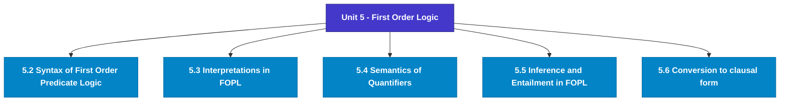

# MCS-224: Artificial Intelligence & Machine Learning
## Unit 5: First Order Logic

> 📚 **Programme:** M.Sc. (Data Science and Analytics) | **Semester:** Semester 2  
> ⏱️ **Estimated Study Time:** ~67 mins | 📄 **Textbook Pages:** 32 Pages  
> 📥 **Original PDF:** [Download & View Textbook](../../../pdfs/Semester_2/MCS-224_Artificial_Intelligence_and_Machine_Learning/Unit-5_First_Order_Logic.pdf)

---

### 🎯 Executive Concept & Data Science Relevance
In modern data systems, **First Order Logic** forms a vital conceptual pillar. Artificial Intelligence models autonomous decision-making, while Machine Learning extracts predictive statistical patterns from data. From A* pathfinding in logistics to Deep Neural Networks powering Computer Vision and LLMs, AI/ML drives modern automated systems.

> [!NOTE]
> **Why this matters for your career:** Mastering first order logic equips you with the foundational principles required to reason mathematically about high-dimensional datasets, evaluate algorithm performance, and avoid statistical pitfalls in production machine learning pipelines.

### 🗺️ Visual Knowledge Architecture
The following concept map illustrates the structural hierarchy and learning trajectory of this module:

### 📖 Core Definitions & Terminology Cards
| Term | Formal Mathematical / Technical Definition | Intuitive Analogy / Concrete Example |
| :--- | :--- | :--- |
| **A* Search Algorithm** | Best-first graph search evaluating states by $f(n) = g(n) + h(n)$, where $g(n)$ is true cost from start to $n$, and $h(n)$ is heuristic estimate to goal. Guarantees optimal path if $h(n)$ is admissible ($h(n) \le h^*(n)$). | *Finding the fastest route on GPS navigation without exploring irrelevant directions.* |
| **Entropy and Information Gain** | Entropy $H(S) = -\sum p_i \log_2 p_i$ measures impurity. Information Gain $IG(S, A) = H(S) - \sum \frac{\vert S_v \vert}{\vert S \vert} H(S_v)$ measures reduction in entropy achieved by splitting on feature $A$. | *The mathematical criterion used by Decision Trees to select the most informative split attribute.* |
| **Support Vector Machine (SVM) Margin** | Linear classifier finding the hyperplane maximizing the geometric margin $\frac{2}{\Vert\mathbf{w}\Vert}$ between classes, subject to $y_i(\mathbf{w}^T \mathbf{x}_i + b) \ge 1$. Non-linear data is separated using Kernel functions $K(\mathbf{x}, \mathbf{z}) = \phi(\mathbf{x})^T \phi(\mathbf{z})$. | *Finding the widest possible road separating positive and negative data clusters.* |
| **Backpropagation Algorithm** | Iterative parameter optimization in neural networks utilizing the multivariate chain rule to propagate error gradients backwards from the loss function to update synaptic weights: $w_{ij} \leftarrow w_{ij} - \alpha \frac{\partial \mathcal{L}}{\partial w_{ij}}$. | *Automated blame assignment: adjusting each internal weight proportionally to how much it contributed to prediction error.* |

### ⚡ Governing Mathematical Laws & Formula Cheatsheet
#### 🔹 A* Heuristic Evaluation Function

$$
f(n) = g(n) + h(n) \quad \text{Admissibility: } 0 \le h(n) \le h^*(n)
$$

- **Explanation:** If $h(n)$ never overestimates true remaining cost, A* tree search is guaranteed to return the optimal shortest path.

#### 🔹 Shannon Entropy Formula

$$
H(S) = -\sum_{i=1}^c p_i \log_2 p_i \quad \text{Gini Impurity: } 1 - \sum_{i=1}^c p_i^2
$$

- **Explanation:** Measures disorder in classification distributions; equals 0 when all samples belong to one class.

#### 🔹 Gradient Descent Weight Update Rule

$$
\mathbf{w}^{(t+1)} = \mathbf{w}^{(t)} - \alpha \nabla_{\mathbf{w}} \mathcal{L}(\mathbf{w})
$$

- **Explanation:** Stepping parameter vector opposite to the gradient vector scaled by learning rate $\alpha$.

#### 🔹 Neural Network Output Softmax Function

$$
\text{Softmax}(z_i) = \frac{e^{z_i}}{\sum_{j=1}^K e^{z_j}}
$$

- **Explanation:** Normalizes $K$ arbitrary logit outputs into a valid multi-class probability distribution summing to 1.

### 📌 Detailed Section-by-Section Study Breakdown
#### `5.2` Syntax of First Order Predicate Logic(FOPL)
- **Core Concept:** Establishes rigorous theoretical formulations and computational bounds for syntax of first order predicate logic(fopl).
- **Core Concept:** Applies standard algorithmic procedures and mathematical invariants relevant to first order logic.
- **Core Concept:** Ensures deterministic performance guarantees across high-dimensional feature spaces.
- **Data Science Application:** Provides foundational structures used directly in statistical modeling, query execution, and machine learning pipelines.

> [!TIP]
> **Exam & Interview Tip:** Be prepared to state the formal definition of syntax of first order predicate logic(fopl) and derive its primary equations step-by-step.

#### `5.3` Interpretations in FOPL
- **Core Concept:** In order to have a glimpse at how FOPL extends propositional logic, let us again discuss the earlier argument.
- **Core Concept:** In order to derive the validity of above simple argument, instead of looking at an atomic statement as indivisible, to begin with, we divide each statement into subject and predicate.
- **Core Concept:** The two predicates which occur in the above argument are: ‘is mortal’ and ‘is man’.
- **Data Science Application:** Provides foundational structures used directly in statistical modeling, query execution, and machine learning pipelines.

> [!TIP]
> **Exam & Interview Tip:** Be prepared to state the formal definition of interpretations in fopl and derive its primary equations step-by-step.

#### `5.4` Semantics of Quantifiers
- **Core Concept:** To understand the semantics of quantifiers we need to first understand the difference between the Proposition and the Predicate(also known as propositional function).
- **Core Concept:** In short, a proposition is a specialized statement whereas Predicate is a generalized statement.
- **Core Concept:** To be more specific the propositions uses the logical connectives only and the predicates uses logical connectives and quantifiers (universal and existential), both.
- **Data Science Application:** Provides foundational structures used directly in statistical modeling, query execution, and machine learning pipelines.

> [!TIP]
> **Exam & Interview Tip:** Be prepared to state the formal definition of semantics of quantifiers and derive its primary equations step-by-step.

#### `5.5` Inference & Entailment in FOPL
- **Core Concept:** In the previous unit, we discussed eight inferencing rules of Propositional Logic (PL) and further discussed applications of these rules in exhibiting validity/ invalidity of arguments in PL.
- **Core Concept:** In this section, the earlier eight rules are extended to include four more rules involving quantifiers for inferencing.
- **Core Concept:** Each of the new rules, is called a Quantifier Rule.
- **Data Science Application:** Provides foundational structures used directly in statistical modeling, query execution, and machine learning pipelines.

> [!TIP]
> **Exam & Interview Tip:** Be prepared to state the formal definition of inference & entailment in fopl and derive its primary equations step-by-step.

#### `5.6` Conversion to clausal form
- **Core Concept:** In order to facilitate problem solving through Propositional Logic, we discussed two normal forms, viz, the conjunctive normal form CNF and the disjunctive normal form DNF.
- **Core Concept:** In FOPL, there is a normal form called the prenex normal form.
- **Core Concept:** So, first step towards the Clausal form is to begin with Prenex Normal Form (PNF), and the second step is skolomization, which will be discussed after PNF.
- **Data Science Application:** Provides foundational structures used directly in statistical modeling, query execution, and machine learning pipelines.

> [!TIP]
> **Exam & Interview Tip:** Be prepared to state the formal definition of conversion to clausal form and derive its primary equations step-by-step.

#### `5.7` Resolution & Unification
- **Core Concept:** Also, , we discussed (Skolem) Standard Form and also discussed how to obtain Standard Form for a given formula of FOPL.
- **Core Concept:** Thus, the atomic formula (∀x) P(x), which after dropping of universal quantifier, is written as just P(x) stands for P(a1) ∧ P(a2)… ∧ P(an) where the set {a1 a2…, an} is assumed here to be domain (x).
- **Core Concept:** Similarly, (∃x) P(x) stands for ( P(a1 ) ∨ P(a2) ∨ ….
- **Data Science Application:** Provides foundational structures used directly in statistical modeling, query execution, and machine learning pipelines.

> [!TIP]
> **Exam & Interview Tip:** Be prepared to state the formal definition of resolution & unification and derive its primary equations step-by-step.

### 💡 Interactive Self-Assessment Checkpoints
Test your comprehension before proceeding. Tap each question to reveal the comprehensive explanation:

<b>Checkpoint 1:</b> What condition must a heuristic $h(n)$ satisfy for A* search to be optimal? <i>(Tap to reveal answer)</i>

> **Answer & Analysis:**  
> The heuristic must be **Admissible**, meaning it never overestimates the actual minimal cost to reach the goal state ($h(n) \le h^*(n)$).

<b>Checkpoint 2:</b> What is the formula for Information Gain used in Decision Trees? <i>(Tap to reveal answer)</i>

> **Answer & Analysis:**  
> $IG(S, A) = H(S) - \sum_{v \in \text{Values}(A)} \frac{\vert S_v \vert}{\vert S \vert} H(S_v)$

<b>Checkpoint 3:</b> Why is the Softmax function used in multi-class classification neural networks? <i>(Tap to reveal answer)</i>

> **Answer & Analysis:**  
> It converts unconstrained real numbers (logits) into a valid probability distribution where each value is in $[0, 1]$ and all values sum strictly to $1$.

<b>Checkpoint 4:</b> Obtain a (skolem) standard form for each of the following formula: (i) (∃x) (∀y) (∀v) (∃z) (∀w) (∃u) P (x, y, z, u, v, w) (ii) (∀x) (∃y) (∃z) ((P (x, y) ∨ ~ Q (x, z)) → R (x, y, z)) <i>(Tap to reveal answer)</i>

> **Answer & Analysis:**  
> This question tests your conceptual mastery of First Order Logic. Review the governing formulas and section breakdowns above to formulate a complete, rigorous proof or derivation.

### 🎯 Executive Module Wrap-Up
- **Central Idea:** First Order Logic provides essential mathematical and algorithmic tools directly utilized in Data Science.
- **Mathematical Rigor:** Formulas and laws must be memorized with attention to boundary conditions and assumptions.
- **Full Textbook Coverage:** For exhaustive multi-page derivations, proofs, and supplementary exercises, consult the [Authentic IGNOU Textbook](../../../pdfs/Semester_2/MCS-224_Artificial_Intelligence_and_Machine_Learning/Unit-5_First_Order_Logic.pdf).

---
### 🧭 Navigation & Syllabus Index
[⬅ Previous: Unit 4](unit_04_Predicate_and_Propositional_Logic.md) | [📑 Course Index](README.md) | [Next: Unit 6 ➡](unit_06_Rule_Based_Systems_and_other_Formalism.md)
