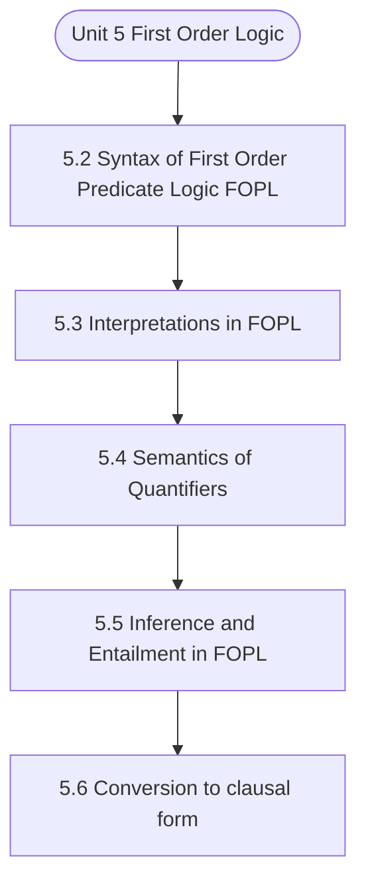

# MCS-224: Artificial Intelligence & Machine Learning
## Unit 5: First Order Logic

> 📚 **Programme:** M.Sc. (Data Science and Analytics) | **Semester:** Semester 2  
> ⏱️ **Estimated Study Time:** ~67 mins | 📄 **Textbook Pages:** 32 Pages  
> 📥 **Original PDF:** [Download & View Textbook](../../../pdfs/Semester_2/MCS-224_Artificial_Intelligence_and_Machine_Learning/Unit-5_First_Order_Logic.pdf)

---

### 🎯 Executive Concept & Data Science Relevance
In modern data systems, **First Order Logic** forms a vital conceptual pillar. Relations form the mathematical blueprint of Relational Database Management Systems (RDBMS). Foreign keys, functional dependencies, equivalence partitioning in clustering, and partial orderings in graph dependency pipelines all originate directly from formal relation theory.

> [!NOTE]
> **Why this matters for your career:** Mastering first order logic equips you with the foundational principles required to reason mathematically about high-dimensional datasets, evaluate algorithm performance, and avoid statistical pitfalls in production machine learning pipelines.

### 🗺️ Visual Knowledge Architecture
The following concept map illustrates the structural hierarchy and learning trajectory of this module:

### 📖 Core Definitions & Terminology Cards

> 📌 **Binary Relation**  
> - **Formal Definition:** A binary relation $R$ from set $A$ to set $B$ is any subset of the Cartesian product $A \times B$, i.e., $R \subseteq A \times B$. If $(a, b) \in R$, we write $aRb$.  
> - 💡 **Practical Intuition & Analogy:** *A table connecting users to purchased items in an e-commerce platform.*

> 📌 **Reflexive Relation**  
> - **Formal Definition:** A relation $R$ on set $A$ is reflexive if $\forall a \in A, (a, a) \in R$. Every element is related to itself.  
> - 💡 **Practical Intuition & Analogy:** *Equality ( $a = a$ ) and the 'is subset of' relation ( $A \subseteq A$ ) are reflexive.*

> 📌 **Symmetric Relation**  
> - **Formal Definition:** A relation $R$ on $A$ is symmetric if $\forall a, b \in A, (a, b) \in R \implies (b, a) \in R$.  
> - 💡 **Practical Intuition & Analogy:** *A mutual friendship in a social network or an undirected edge in a graph.*

> 📌 **Transitive Relation**  
> - **Formal Definition:** A relation $R$ on $A$ is transitive if $\forall a, b, c \in A, [(a, b) \in R \land (b, c) \in R] \implies (a, c) \in R$.  
> - 💡 **Practical Intuition & Analogy:** *Ancestry or inequality: If $a < b$ and $b < c$, then $a < c$.*

> 📌 **Equivalence Relation**  
> - **Formal Definition:** A relation $R$ on $A$ that is simultaneously reflexive, symmetric, and transitive. It partitions $A$ into mutually disjoint equivalence classes.  
> - 💡 **Practical Intuition & Analogy:** *Clustering data points into distinct, non-overlapping groups based on identical feature attributes.*

### ⚡ Governing Mathematical Laws & Formula Cheatsheet
#### 🔹 Total Relations on a Set
$$
\text{Total Relations on } A = 2^{\vert A\vert^2} = 2^{n^2} \quad \text{where } n = \vert A\vert
$$
- **Explanation:** Since $\vert A \times A \vert = n^2$, any relation is a subset of $A \times A$, yielding $2^{n^2}$ possible relations.

#### 🔹 Total Reflexive Relations
$$
\text{Reflexive Relations} = 2^{n(n - 1)}
$$
- **Explanation:** The $n$ diagonal pairs $(a, a)$ must all be included (1 choice each), leaving $n^2 - n = n(n-1)$ off-diagonal pairs with 2 choices each.

#### 🔹 Total Symmetric Relations
$$
\text{Symmetric Relations} = 2^{\frac{n(n + 1)}{2}}
$$
- **Explanation:** Determined entirely by choices on the diagonal ($n$) and the upper triangle ($n(n-1)/2$).

#### 🔹 Equivalence Class Definition
$$
[a] = \lbrace x \in A \mid (x, a) \in R \rbrace
$$
- **Explanation:** The collection of all elements in $A$ related to representative element $a$. The union of all equivalence classes equals $A$.

### 📌 Detailed Section-by-Section Study Breakdown
#### `5.2` Syntax of First Order Predicate Logic(FOPL)
- **Core Concept:** Establishes theoretical foundations, axiomatic formulations, and properties of syntax of first order predicate logic(fopl).
- **Core Concept:** Analyzes standard algorithmic workflows and mathematical transformations relevant to first order logic.
- **Core Concept:** Applies computational bounds and optimization guarantees across data processing workflows.
- **Data Science Application:** Provides foundational structures used directly in statistical modeling, query execution, and machine learning pipelines.

> [!TIP]
> **Exam & Interview Tip:** Be prepared to state the formal definition of syntax of first order predicate logic(fopl) and derive its primary equations step-by-step.

#### `5.3` Interpretations in FOPL
- **Core Concept:** In order to have a glimpse at how FOPL extends propositional logic, let us again discuss the earlier argument.
- **Core Concept:** In order to derive the validity of above simple argument, instead of looking at an atomic statement as indivisible, to begin with, we divide each statement into subject and predicate.
- **Core Concept:** The two predicates which occur in the above argument are: ‘is mortal’ and ‘is man’.
- **Data Science Application:** Provides foundational structures used directly in statistical modeling, query execution, and machine learning pipelines.

> [!TIP]
> **Exam & Interview Tip:** Be prepared to state the formal definition of interpretations in fopl and derive its primary equations step-by-step.

#### `5.4` Semantics of Quantifiers
- **Core Concept:** To understand the semantics of quantifiers we need to first understand the difference between the Proposition and the Predicate(also known as propositional function).
- **Core Concept:** In short, a proposition is a specialized statement whereas Predicate is a generalized statement.
- **Core Concept:** To be more specific the propositions uses the logical connectives only and the predicates uses logical connectives and quantifiers (universal and existential), both.
- **Data Science Application:** Provides foundational structures used directly in statistical modeling, query execution, and machine learning pipelines.

> [!TIP]
> **Exam & Interview Tip:** Be prepared to state the formal definition of semantics of quantifiers and derive its primary equations step-by-step.

#### `5.5` Inference & Entailment in FOPL
- **Core Concept:** In the previous unit, we discussed eight inferencing rules of Propositional Logic (PL) and further discussed applications of these rules in exhibiting validity/ invalidity of arguments in PL.
- **Core Concept:** In this section, the earlier eight rules are extended to include four more rules involving quantifiers for inferencing.
- **Core Concept:** Each of the new rules, is called a Quantifier Rule.
- **Data Science Application:** Provides foundational structures used directly in statistical modeling, query execution, and machine learning pipelines.

> [!TIP]
> **Exam & Interview Tip:** Be prepared to state the formal definition of inference & entailment in fopl and derive its primary equations step-by-step.

#### `5.6` Conversion to clausal form
- **Core Concept:** In order to facilitate problem solving through Propositional Logic, we discussed two normal forms, viz, the conjunctive normal form CNF and the disjunctive normal form DNF.
- **Core Concept:** In FOPL, there is a normal form called the prenex normal form.
- **Core Concept:** So, first step towards the Clausal form is to begin with Prenex Normal Form (PNF), and the second step is skolomization, which will be discussed after PNF.
- **Data Science Application:** Provides foundational structures used directly in statistical modeling, query execution, and machine learning pipelines.

> [!TIP]
> **Exam & Interview Tip:** Be prepared to state the formal definition of conversion to clausal form and derive its primary equations step-by-step.

#### `5.7` Resolution & Unification
- **Core Concept:** Also, , we discussed (Skolem) Standard Form and also discussed how to obtain Standard Form for a given formula of FOPL.
- **Core Concept:** Thus, the atomic formula (∀x) P(x), which after dropping of universal quantifier, is written as just P(x) stands for P(a1) ∧ P(a2)… ∧ P(an) where the set {a1 a2…, an} is assumed here to be domain (x).
- **Core Concept:** Similarly, (∃x) P(x) stands for ( P(a1 ) ∨ P(a2) ∨ ….
- **Data Science Application:** Provides foundational structures used directly in statistical modeling, query execution, and machine learning pipelines.

> [!TIP]
> **Exam & Interview Tip:** Be prepared to state the formal definition of resolution & unification and derive its primary equations step-by-step.

### 💡 Interactive Self-Assessment Checkpoints
Test your comprehension before proceeding. Tap each question to reveal the comprehensive explanation:

<b>Checkpoint 1:</b> What three properties are required for a relation to be an Equivalence Relation? <i>(Tap to reveal answer)</i>

> **Answer & Analysis:**  
> 1. Reflexivity: $\forall a \in A, (a,a) \in R$
2. Symmetry: $(a,b) \in R \implies (b,a) \in R$
3. Transitivity: $(a,b) \in R \land (b,c) \in R \implies (a,c) \in R$.

<b>Checkpoint 2:</b> What is a Partial Order Relation (Poset)? <i>(Tap to reveal answer)</i>

> **Answer & Analysis:**  
> A relation that is Reflexive, Antisymmetric ( $(a,b) \in R \land (b,a) \in R \implies a = b$ ), and Transitive. Example: The subset relation $\subseteq$ on power sets.

<b>Checkpoint 3:</b> How many total relations exist on a set with 3 elements? <i>(Tap to reveal answer)</i>

> **Answer & Analysis:**  
> For $n = 3$, $\vert A \times A \vert = 3^2 = 9$. Total relations $= 2^9 = 512$.

<b>Checkpoint 4:</b> Obtain a (skolem) standard form for each of the following formula: (i) (∃x) (∀y) (∀v) (∃z) (∀w) (∃u) P (x, y, z, u, v, w) (ii) (∀x) (∃y) (∃z) ((P (x, y) ∨ ~ Q (x, z)) → R (x, y, z)) <i>(Tap to reveal answer)</i>

> **Answer & Analysis:**  
> This question tests your conceptual mastery of First Order Logic. Review the governing formulas and section breakdowns above to formulate a complete, rigorous proof or derivation.

### 🎯 Executive Module Wrap-Up
- **Central Idea:** First Order Logic provides essential mathematical and algorithmic tools directly utilized in Data Science.
- **Mathematical Rigor:** Formulas and laws must be memorized with attention to boundary conditions and assumptions.
- **Full Textbook Coverage:** For exhaustive multi-page derivations, proofs, and supplementary exercises, consult the [Authentic IGNOU Textbook](../../../pdfs/Semester_2/MCS-224_Artificial_Intelligence_and_Machine_Learning/Unit-5_First_Order_Logic.pdf).

---
### 🧭 Navigation & Syllabus Index
[⬅ Previous: Unit 4](unit_04_Predicate_and_Propositional_Logic.md) | [📑 Course Index](README.md) | [Next: Unit 6 ➡](unit_06_Rule_Based_Systems_and_other_Formalism.md)
