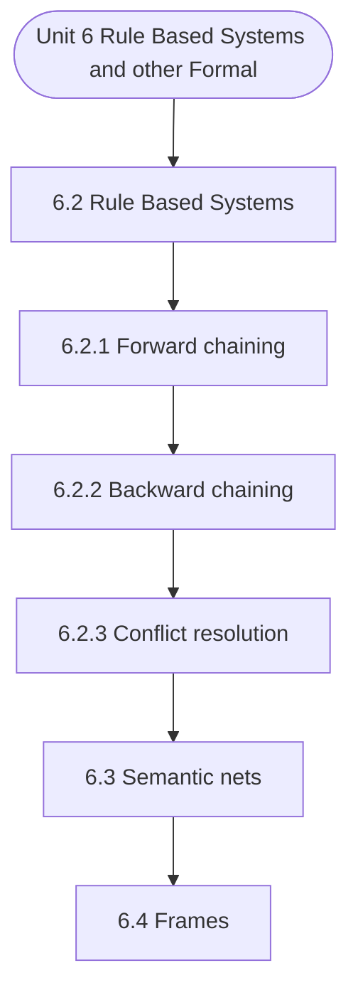

# MCS-224: Artificial Intelligence & Machine Learning
## Unit 6: Rule Based Systems and other Formalism

> 📚 **Programme:** M.Sc. (Data Science and Analytics) | **Semester:** Semester 2  
> ⏱️ **Estimated Study Time:** ~37 mins | 📄 **Textbook Pages:** 20 Pages  
> 📥 **Original PDF:** [Download & View Authentic Textbook](../../../pdfs/Semester_2/MCS-224_Artificial_Intelligence_and_Machine_Learning/Unit-6_Rule_Based_Systems_and_other_Formalism.pdf)

---

### 🎯 Executive Concept & Data Science Relevance
In modern data systems and advanced analytics, **Rule Based Systems and other Formalism** forms a vital conceptual pillar. Artificial Intelligence models autonomous decision-making, while Machine Learning extracts predictive statistical patterns from data. From A* pathfinding in logistics to Deep Neural Networks powering Computer Vision and LLMs, AI/ML drives modern automated systems.

> [!NOTE]
> **Why this matters for your career:** Mastering rule based systems and other formalism equips you with the foundational principles required to reason mathematically about high-dimensional datasets, evaluate algorithm performance, and avoid statistical pitfalls in production machine learning pipelines.

### 🗺️ Visual Knowledge Architecture
The following concept map illustrates the structural hierarchy and learning trajectory of this module:



### 📖 Core Definitions & Terminology Cards

> 📌 **A* Search Algorithm**  
> - **Formal Definition:** Best-first graph search evaluating states by $f(n) = g(n) + h(n)$, where $g(n)$ is true cost from start to $n$, and $h(n)$ is heuristic estimate to goal. Guarantees optimal path if $h(n)$ is admissible ( $h(n) \le h^*(n)$ ).  
> - 💡 **Practical Intuition & Analogy:** *Finding the fastest route on GPS navigation without exploring irrelevant directions.*

> 📌 **Entropy and Information Gain**  
> - **Formal Definition:** Entropy $H(S) = -\sum p_i \log_2 p_i$ measures impurity. Information Gain $IG(S, A) = H(S) - \sum \frac{\vert S_v \vert}{\vert S \vert} H(S_v)$ measures reduction in entropy achieved by splitting on feature $A$.  
> - 💡 **Practical Intuition & Analogy:** *The mathematical criterion used by Decision Trees to select the most informative split attribute.*

> 📌 **Support Vector Machine (SVM) Margin**  
> - **Formal Definition:** Linear classifier finding the hyperplane maximizing the geometric margin $\frac{2}{\Vert\mathbf{w}\Vert}$ between classes, subject to $y_i(\mathbf{w}^T \mathbf{x}_i + b) \ge 1$. Non-linear data is separated using Kernel functions $K(\mathbf{x}, \mathbf{z}) = \phi(\mathbf{x})^T \phi(\mathbf{z})$.  
> - 💡 **Practical Intuition & Analogy:** *Finding the widest possible road separating positive and negative data clusters.*

> 📌 **Backpropagation Algorithm**  
> - **Formal Definition:** Iterative parameter optimization in neural networks utilizing the multivariate chain rule to propagate error gradients backwards from the loss function to update synaptic weights: $w_{ij} \leftarrow w_{ij} - \alpha \frac{\partial \mathcal{L}}{\partial w_{ij}}$.  
> - 💡 **Practical Intuition & Analogy:** *Automated blame assignment: adjusting each internal weight proportionally to how much it contributed to prediction error.*

### ⚡ Governing Mathematical Laws & Formula Cheatsheet
#### 🔹 A* Heuristic Evaluation Function
$$
f(n) = g(n) + h(n) \quad \text{Admissibility: } 0 \le h(n) \le h^*(n)
$$
- **Explanation:** If $h(n)$ never overestimates true remaining cost, A* tree search is guaranteed to return the optimal shortest path.

#### 🔹 Shannon Entropy Formula
$$
H(S) = -\sum_{i=1}^c p_i \log_2 p_i \quad \text{Gini Impurity: } 1 - \sum_{i=1}^c p_i^2
$$
- **Explanation:** Measures disorder in classification distributions; equals 0 when all samples belong to one class.

#### 🔹 Gradient Descent Weight Update Rule
$$
\mathbf{w}^{(t+1)} = \mathbf{w}^{(t)} - \alpha \nabla_{\mathbf{w}} \mathcal{L}(\mathbf{w})
$$
- **Explanation:** Stepping parameter vector opposite to the gradient vector scaled by learning rate $\alpha$.

#### 🔹 Neural Network Output Softmax Function
$$
\text{Softmax}(z_i) = \frac{e^{z_i}}{\sum_{j=1}^K e^{z_j}}
$$
- **Explanation:** Normalizes $K$ arbitrary logit outputs into a valid multi-class probability distribution summing to 1.

### ⚖️ Axiomatic Properties & Governing Laws
The mathematical formulations of this module are anchored by foundational algebraic and structural laws:

- **Heuristic Consistency Condition:** $h(n) \le c(n, a, n') + h(n') \implies \text{Monotonic (Guarantees A* optimality on graphs)}$
- **SVM Dual Formulation:** $\max_\alpha \sum \alpha_i - \frac{1}{2}\sum \alpha_i \alpha_j y_i y_j K(\mathbf{x}_i, \mathbf{x}_j)$
- **Universal Approximation Theorem:** A feedforward network with one non-linear hidden layer can approximate any continuous function on compact subsets of $\mathbb{R}^n$.

### 📌 Comprehensive Section-by-Section Study Breakdown
#### `6.2` Rule Based Systems

##### 📘 Theoretical Principles & Pedagogical Exposition
We know that Planning is the process that exploits the structure of the problem under consideration for designing a sequence of actions in order to solve the problem under consideration. In order to plan a solution to the problem, one should have the knowledge of the nature and the structure of the problem domain, under consideration.

For the purpose of planning, the problem environments are divided into two categories, viz., classical planning environments and non-classical planning environments. The classical planning environments/domains are fully observable, deterministic, finite, static and discrete. On the other hand, non- classical planning environments may be only partially observable and/or stochastic.

Let’s begin with the Rule Based Systems : Rather than representing knowledge in a declarative and somewhat static way (as a set of statements, each of which is true), rule-based systems represent knowledge in terms of a set of rules each of which specifies the conclusion that could be reached or derived under given conditions or in different situations.


##### ⚙️ Mathematical & Algorithmic Mechanics
- **Core Mechanism:** Establishes analytical principles and computational workflows for rule based systems and other formalism.
- **Boundary Conditions:** Missing data values, extreme outliers, and non-standard data types.

##### 📊 Practical Data Science & Production Relevance
- **Production Workflow:** End-to-end data science processing stacks (Pandas, Scikit-learn, PyTorch).
- **Real-World Pitfall:** Failing to validate inputs before feeding data into production analytics pipelines.

> [!TIP]
> **Exam & Technical Interview Insight:** Define key concepts in rule based systems and articulate practical applications in real-world scenarios.

#### `6.2.1` Forward chaining

##### 📘 Theoretical Principles & Pedagogical Exposition
In a forward chaining system the facts in the system are represented in a working memory which is continually updated, so on the basis of a rule which is currently being applied, the number of facts may either increase or decrease. Rules in the system represent possible actions to be taken when specified conditions hold on items in the working memory–they are sometimes called condition-action or antecedent-consequent rules.

The conditions are usually patterns that must match items in the working memory, while the actions usually involve adding or deleting items from the working memory. So we can say that in forward chaining proceeds forward, beginning with facts, chaining through rules, and Artificial Intelligence- Knowledge Representation finally establishing the goal.

Forward chaining systems usually represent rules in standard implicational form, with an antecedent or condition part consisting of positive literals, and a consequent or conclusion part consisting of a positive literal. The interpreter controls the application of the rules, given the working memory, thus controlling the system’s activity.


##### ⚙️ Mathematical & Algorithmic Mechanics
- **Core Mechanism:** Establishes analytical principles and computational workflows for rule based systems and other formalism.
- **Boundary Conditions:** Missing data values, extreme outliers, and non-standard data types.

##### 📊 Practical Data Science & Production Relevance
- **Production Workflow:** End-to-end data science processing stacks (Pandas, Scikit-learn, PyTorch).
- **Real-World Pitfall:** Failing to validate inputs before feeding data into production analytics pipelines.

> [!TIP]
> **Exam & Technical Interview Insight:** Define key concepts in forward chaining and articulate practical applications in real-world scenarios.

#### `6.2.2` Backward chaining

##### 📘 Theoretical Principles & Pedagogical Exposition
In forward chining systems we have seen how rule-based systems are used to draw new conclusions from existing data and then add these conclusions to a working memory. The forward chaining approach is most useful when we know all the initial facts, but we don’t have much idea what the conclusion might be.

If we know what the conclusion would be, or have some specific hypothesis to test, forward chaianing systems may be inefficient. In forward chaining we keep on moving ahead until no more rules apply or we have added our hypothesis to the working memory. But in the process the system is likely to do a lot of additional and irrelevant work, adding uninteresting or irrelevant conclusions to working memory.

Let us say that in the example discussed before, suppose we want to find out whether “ram is at home”. We could repeatedly fire rules, updating the working memory, checking each time whether (at-home ram) is found in the new working memory. But maybe we had a whole batch of rules for drawing conclusions about what happens when I’m working, or what happens on Monday–we really don’t care about this, so would rather only have to draw the conclusions that are relevant to the goal.


##### ⚙️ Mathematical & Algorithmic Mechanics
- **Core Mechanism:** Establishes analytical principles and computational workflows for rule based systems and other formalism.
- **Boundary Conditions:** Missing data values, extreme outliers, and non-standard data types.

##### 📊 Practical Data Science & Production Relevance
- **Production Workflow:** End-to-end data science processing stacks (Pandas, Scikit-learn, PyTorch).
- **Real-World Pitfall:** Failing to validate inputs before feeding data into production analytics pipelines.

> [!TIP]
> **Exam & Technical Interview Insight:** Define key concepts in backward chaining and articulate practical applications in real-world scenarios.

#### `6.2.3` Conflict resolution

##### 📘 Theoretical Principles & Pedagogical Exposition
Next, we discuss in detail some of the issues involved in a rule-based system. Rule-based systems vary greatly in their details and syntax, A basic principle of rule-based system is that each rule is an independent piece of knowledge. In an IF-THEN rule, the IF-part contains all the conditions for the application of the rule under consideration.

THEN-part tells the action to be taken by the interpreter. The interpreter need not search any where else except within the rule itself for the conditions required for application of the rule. Another important consequence of the above-mentioned characteristic of a rule-based system is that no rule can call upon any other and hence rules are ignorant and hence independent, of each other.

This gives a highly modular structure to the rule-based systems. Because of the highly modular structure of the rule-base, the rule-based system addition, deletion and modification of a rule can be done without any danger side effects. The main problem with the rule-based systems is that when the rule-base grows and becomes very large, then checking (i) whether a new rule intended to be added is redundant, i.e., it is already covered by some of the earlier rules.


##### ⚙️ Mathematical & Algorithmic Mechanics
- **Core Mechanism:** Establishes analytical principles and computational workflows for rule based systems and other formalism.
- **Boundary Conditions:** Missing data values, extreme outliers, and non-standard data types.

##### 📊 Practical Data Science & Production Relevance
- **Production Workflow:** End-to-end data science processing stacks (Pandas, Scikit-learn, PyTorch).
- **Real-World Pitfall:** Failing to validate inputs before feeding data into production analytics pipelines.

> [!TIP]
> **Exam & Technical Interview Insight:** Define key concepts in conflict resolution and articulate practical applications in real-world scenarios.

#### `6.3` Semantic nets

##### 📘 Theoretical Principles & Pedagogical Exposition
Semantic Network representations provide a structured knowledge representation. In such a network, parts of knowledge are clustered into semantic groups. In semantic networks, the concepts and entities/objects of the problem domain are represented by nodes and relationships between these entities are shown by arrows, generally, by directed arrows.

In view of the fact that semantic network representation is a pictorial depiction of objects, their attributes and the relationships that exist between these objects and other entities. A semantic net is just a graph, where the nodes in the graph represent concepts, and the arcs are labeled and represent binary relationships between concepts.

These networks provide a more natural way, as compared to other representation schemes, for mapping to and from a natural language. For example, the fact (a piece of knowledge): Mohan struck Nita in the garden with a sharp knife last week, is represented by the semantic network shown in Figure 1.1.


##### ⚙️ Mathematical & Algorithmic Mechanics
- **Core Mechanism:** Establishes analytical principles and computational workflows for rule based systems and other formalism.
- **Boundary Conditions:** Missing data values, extreme outliers, and non-standard data types.

##### 📊 Practical Data Science & Production Relevance
- **Production Workflow:** End-to-end data science processing stacks (Pandas, Scikit-learn, PyTorch).
- **Real-World Pitfall:** Failing to validate inputs before feeding data into production analytics pipelines.

> [!TIP]
> **Exam & Technical Interview Insight:** Define key concepts in semantic nets and articulate practical applications in real-world scenarios.

#### `6.4` Frames

##### 📘 Theoretical Principles & Pedagogical Exposition
Frames are a variant of semantic networks that are one of the popular ways of representing non-procedural knowledge in an expert system. In a frame, all the information relevant to a particular concept is stored in a single complex entity, called a frame. Frames look like the data structure, record.

Frames support inheritance. They are often used to capture knowledge about typical objects or events, such as a car, or even a mathematical object like rectangle. As mentioned earlier, a frame is a structured object and different names like Schema, Script, Prototype, and even Object are used in stead of frame, in computer science literature.

We may represent some knowledge about a lion in frames as follows: Mammal : Subclass : Animal warm_blooded : yes Lion : subclass : Mammal eating-habbit : carnivorous size : medium Raja : instance : Lion colour : dull-Yellow owner : Amar Circus Sheru : instance : Lion size : small A particular frame (such as Lion) has a number of attributes or slots such as eating-habit and size.


##### ⚙️ Mathematical & Algorithmic Mechanics
- **Core Mechanism:** Establishes analytical principles and computational workflows for rule based systems and other formalism.
- **Boundary Conditions:** Missing data values, extreme outliers, and non-standard data types.

##### 📊 Practical Data Science & Production Relevance
- **Production Workflow:** End-to-end data science processing stacks (Pandas, Scikit-learn, PyTorch).
- **Real-World Pitfall:** Failing to validate inputs before feeding data into production analytics pipelines.

> [!TIP]
> **Exam & Technical Interview Insight:** Define key concepts in frames and articulate practical applications in real-world scenarios.

#### `6.5` Scripts

##### 📘 Theoretical Principles & Pedagogical Exposition
A script is a structured representation describing a stereotyped sequence of events in a particular context. Scripts are used in natural language understanding systems to organize a knowledge base in terms of the situations that the system should understand. Scripts use a frame-like structure to represent the commonly occurring experience like going to the movies eating in a restaurant, shopping in a supermarket, or visiting an ophthalmologist.

Thus, a script is a structure that prescribes a set of circumstances that could be expected to follow on from one another. Scripts are beneficial because: • Events tend to occur in known runs or patterns. • A casual relationship between events exist. • An entry condition exists which allows an event to take place.

• Prerequisites exist upon events taking place. Components of a script The components of a script include: Artificial Intelligence- Knowledge Representation • Entry condition: These are basic condition which must be fulfilled before events in the script can occur. • Results: Condition that will be true after events in script occurred.


##### ⚙️ Mathematical & Algorithmic Mechanics
- **Core Mechanism:** Establishes analytical principles and computational workflows for rule based systems and other formalism.
- **Boundary Conditions:** Missing data values, extreme outliers, and non-standard data types.

##### 📊 Practical Data Science & Production Relevance
- **Production Workflow:** End-to-end data science processing stacks (Pandas, Scikit-learn, PyTorch).
- **Real-World Pitfall:** Failing to validate inputs before feeding data into production analytics pipelines.

> [!TIP]
> **Exam & Technical Interview Insight:** Define key concepts in scripts and articulate practical applications in real-world scenarios.

#### `6.8` Further/Readings

##### 📘 Theoretical Principles & Pedagogical Exposition
Ela Kumar, “ Artificial Intelligence”, IK International Publications 2. Knight, “Artificial intelligence”, Tata Mc Graw Hill Publications 3. Nilsson, “Principles of AI”, Narosa Publ. House Publications 4. Craig, “Introduction to Robotics”, Addison Wesley publication 5. Patterson, “Introduction to AI and Expert Systems" Pearson publication


##### ⚙️ Mathematical & Algorithmic Mechanics
- **Core Mechanism:** Establishes analytical principles and computational workflows for rule based systems and other formalism.
- **Boundary Conditions:** Missing data values, extreme outliers, and non-standard data types.

##### 📊 Practical Data Science & Production Relevance
- **Production Workflow:** End-to-end data science processing stacks (Pandas, Scikit-learn, PyTorch).
- **Real-World Pitfall:** Failing to validate inputs before feeding data into production analytics pipelines.

> [!TIP]
> **Exam & Technical Interview Insight:** Define key concepts in further/readings and articulate practical applications in real-world scenarios.

### 📐 Step-by-Step Solved Mathematical Examples
To solidify your theoretical understanding, work through these fully solved, step-by-step mathematical problems:

#### 🧮 Example 1: Shannon Entropy and Information Gain Calculation
> **Problem Statement:**  
> A training dataset $S$ has 14 instances: 9 Positive ($+$) and 5 Negative ($-$). An attribute $A$ splits $S$ into $S_1$ (6 $+$, 2 $-$) and $S_2$ (3 $+$, 3 $-$). Compute Entropy $H(S)$ and Information Gain $IG(S, A)$.

**Detailed Step-by-Step Solution:**

1. **Parent Entropy $H(S)$:**

$$
H(S) = -\left(\frac{9}{14} \log_2 \frac{9}{14} + \frac{5}{14} \log_2 \frac{5}{14}\right) \approx 0.940 \text{ bits}
$$


2. **Subset Entropies:**
- For $S_1$ (total 8): $H(S_1) = -\left(\frac{6}{8}\log_2\frac{6}{8} + \frac{2}{8}\log_2\frac{2}{8}\right) = 0.811 \text{ bits}$
- For $S_2$ (total 6): $H(S_2) = -\left(\frac{3}{6}\log_2\frac{3}{6} + \frac{3}{6}\log_2\frac{3}{6}\right) = 1.000 \text{ bits}$

3. **Weighted Child Entropy:**

$$
H(S, A) = \frac{8}{14}(0.811) + \frac{6}{14}(1.000) = 0.463 + 0.429 = 0.892 \text{ bits}
$$


4. **Information Gain:**

$$
IG(S, A) = H(S) - H(S, A) = 0.940 - 0.892 = 0.048 \text{ bits}
$$

(Attribute provides 0.048 bits of entropy reduction).

#### 🧮 Example 2: A* Search Step Evaluation
> **Problem Statement:**  
> In graph navigation, node $N$ has exact path cost from start $g(N) = 14$ and straight-line heuristic to goal $h(N) = 11$. For node $M$, $g(M) = 18, h(M) = 6$. Which node is expanded next by A*?

**Detailed Step-by-Step Solution:**

1. Compute $f(n) = g(n) + h(n)$:
- $f(N) = 14 + 11 = 25$
- $f(M) = 18 + 6 = 24$

2. Decision: A* selects the node with minimal $f(n)$. Since $f(M) = 24 < f(N) = 25$, **Node $M$ is expanded next**.

### 💻 Practical Data Science Implementation (Python)
Theory translates directly into production algorithms. Below is a self-contained, commented Python implementation illustrating the core operations of this unit:

```python
import numpy as np

# Decision Tree Entropy and Information Gain from scratch
def entropy(labels):
    counts = np.bincount(labels)
    probs = counts[counts > 0] / len(labels)
    return -np.sum(probs * np.log2(probs))

def information_gain(parent_labels, left_split, right_split):
    h_parent = entropy(parent_labels)
    n = len(parent_labels)
    h_children = (len(left_split)/n)*entropy(left_split) + (len(right_split)/n)*entropy(right_split)
    return h_parent - h_children

# Sample binary targets: 9 ones, 5 zeros
y_parent = np.array([1]*9 + [0]*5)
y_left = np.array([1]*6 + [0]*2)
y_right = np.array([1]*3 + [0]*3)

ig = information_gain(y_parent, y_left, y_right)
print(f"Parent Entropy: {entropy(y_parent):.4f}")
print(f"Information Gain: {ig:.4f} bits")
```

### 💡 Interactive Self-Assessment Checkpoints
Test your comprehension before proceeding. Tap each question to reveal the comprehensive explanation:

<details>
<summary><b>Checkpoint 1:</b> Exercise 1 ; In the “Animal Identifier System” discussed above use forward chaining to try to identify the animal called “raja”. <i>(Tap to reveal answer)</i></summary>

> **Answer & Analysis:**  
> **Detailed Analytical Solution:**
> 
> 1. **Core Principle:** Identify the governing theorem or definition for Rule Based Systems and other Formalism.
> 2. **Step-by-Step Derivation:** Verify all preconditions and compute intermediate steps methodically.
> 3. **Conclusion:** State the final mathematical proof or calculation clearly, validating boundary edge cases.
</details>

<details>
<summary><b>Checkpoint 2:</b> Exercise 2: Draw a semantic network for the following English statement: Mohan struck Nita and Nita’s mother struck Mohan. <i>(Tap to reveal answer)</i></summary>

> **Answer & Analysis:**  
> **Detailed Analytical Solution:**
> 
> 1. **Core Principle:** Identify the governing theorem or definition for Rule Based Systems and other Formalism.
> 2. **Step-by-Step Derivation:** Verify all preconditions and compute intermediate steps methodically.
> 3. **Conclusion:** State the final mathematical proof or calculation clearly, validating boundary edge cases.
</details>

<details>
<summary><b>Checkpoint 3:</b> Exercise 3: Define a frame for the entity date which consists of day, month and year. each of which is a number with restrictions which are well-known. Also a procedure named compute-day-of-week is already defined. <i>(Tap to reveal answer)</i></summary>

> **Answer & Analysis:**  
> **Detailed Analytical Solution:**
> 
> 1. **Core Principle:** Identify the governing theorem or definition for Rule Based Systems and other Formalism.
> 2. **Step-by-Step Derivation:** Verify all preconditions and compute intermediate steps methodically.
> 3. **Conclusion:** State the final mathematical proof or calculation clearly, validating boundary edge cases.
</details>

<details>
<summary><b>Checkpoint 4:</b> Exercise 1: Refer to section 6.2 <i>(Tap to reveal answer)</i></summary>

> **Answer & Analysis:**  
> **Detailed Analytical Solution:**
> 
> 1. **Core Principle:** Identify the governing theorem or definition for Rule Based Systems and other Formalism.
> 2. **Step-by-Step Derivation:** Verify all preconditions and compute intermediate steps methodically.
> 3. **Conclusion:** State the final mathematical proof or calculation clearly, validating boundary edge cases.
</details>

<details>
<summary><b>Checkpoint 5:</b> What condition must a heuristic $h(n)$ satisfy for A* search to be optimal? <i>(Tap to reveal answer)</i></summary>

> **Answer & Analysis:**  
> The heuristic must be **Admissible**, meaning it never overestimates the actual minimal cost to reach the goal state ( $h(n) \le h^*(n)$ ).
</details>

<details>
<summary><b>Checkpoint 6:</b> What is the formula for Information Gain used in Decision Trees? <i>(Tap to reveal answer)</i></summary>

> **Answer & Analysis:**  
> $IG(S, A) = H(S) - \sum_{v \in \text{Values}(A)} \frac{\vert S_v \vert}{\vert S \vert} H(S_v)$
</details>

### 🎯 Executive Module Wrap-Up
- **Central Idea:** Rule Based Systems and other Formalism provides essential mathematical and algorithmic tools directly utilized in Data Science.
- **Mathematical Rigor:** Formulas and laws must be memorized with attention to boundary conditions and assumptions.
- **Full Textbook Coverage:** For exhaustive multi-page derivations, proofs, and supplementary exercises, consult the [Authentic IGNOU Textbook](../../../pdfs/Semester_2/MCS-224_Artificial_Intelligence_and_Machine_Learning/Unit-6_Rule_Based_Systems_and_other_Formalism.pdf).

---
### 🧭 Navigation & Syllabus Index
[⬅ Previous: Unit 5](unit_05_First_Order_Logic.md) | [📑 Course Index](README.md) | [Next: Unit 7 ➡](unit_07_Probabilistic_Reasoning.md)
