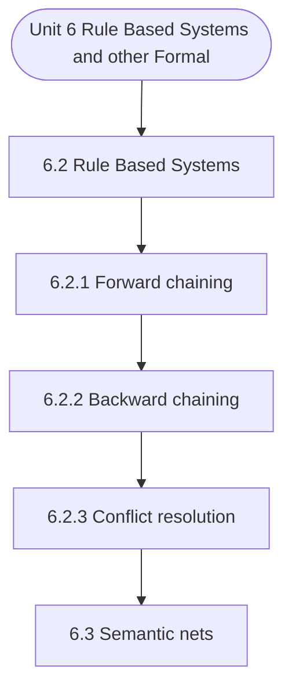

# MCS-224: Artificial Intelligence & Machine Learning
## Unit 6: Rule Based Systems and other Formalism

> 📚 **Programme:** M.Sc. (Data Science and Analytics) | **Semester:** Semester 2  
> ⏱️ **Estimated Study Time:** ~37 mins | 📄 **Textbook Pages:** 20 Pages  
> 📥 **Original PDF:** [Download & View Textbook](../../../pdfs/Semester_2/MCS-224_Artificial_Intelligence_and_Machine_Learning/Unit-6_Rule_Based_Systems_and_other_Formalism.pdf)

---

### 🎯 Executive Concept & Data Science Relevance
In modern data systems, **Rule Based Systems and other Formalism** forms a vital conceptual pillar. Artificial Intelligence models autonomous decision-making, while Machine Learning extracts predictive statistical patterns from data. From A* pathfinding in logistics to Deep Neural Networks powering Computer Vision and LLMs, AI/ML drives modern automated systems.

> [!NOTE]
> **Why this matters for your career:** Mastering rule based systems and other formalism equips you with the foundational principles required to reason mathematically about high-dimensional datasets, evaluate algorithm performance, and avoid statistical pitfalls in production machine learning pipelines.

### 🗺️ Visual Knowledge Architecture
The following concept map illustrates the structural hierarchy and learning trajectory of this module:

### 📖 Core Definitions & Terminology Cards

> 📌 **A* Search Algorithm**  
> - **Formal Definition:** Best-first graph search evaluating states by $f(n) = g(n) + h(n)$, where $g(n)$ is true cost from start to $n$, and $h(n)$ is heuristic estimate to goal. Guarantees optimal path if $h(n)$ is admissible ( $h(n) \le h^*(n)$ ).  
> - 💡 **Practical Intuition & Analogy:** *Finding the fastest route on GPS navigation without exploring irrelevant directions.*

> 📌 **Entropy and Information Gain**  
> - **Formal Definition:** Entropy $H(S) = -\sum p_i \log_2 p_i$ measures impurity. Information Gain $IG(S, A) = H(S) - \sum \frac{\vert S_v \vert}{\vert S \vert} H(S_v)$ measures reduction in entropy achieved by splitting on feature $A$.  
> - 💡 **Practical Intuition & Analogy:** *The mathematical criterion used by Decision Trees to select the most informative split attribute.*

> 📌 **Support Vector Machine (SVM) Margin**  
> - **Formal Definition:** Linear classifier finding the hyperplane maximizing the geometric margin $\frac{2}{\Vert\mathbf{w}\Vert}$ between classes, subject to $y_i(\mathbf{w}^T \mathbf{x}_i + b) \ge 1$. Non-linear data is separated using Kernel functions $K(\mathbf{x}, \mathbf{z}) = \phi(\mathbf{x})^T \phi(\mathbf{z})$.  
> - 💡 **Practical Intuition & Analogy:** *Finding the widest possible road separating positive and negative data clusters.*

> 📌 **Backpropagation Algorithm**  
> - **Formal Definition:** Iterative parameter optimization in neural networks utilizing the multivariate chain rule to propagate error gradients backwards from the loss function to update synaptic weights: $w_{ij} \leftarrow w_{ij} - \alpha \frac{\partial \mathcal{L}}{\partial w_{ij}}$.  
> - 💡 **Practical Intuition & Analogy:** *Automated blame assignment: adjusting each internal weight proportionally to how much it contributed to prediction error.*

### ⚡ Governing Mathematical Laws & Formula Cheatsheet
#### 🔹 A* Heuristic Evaluation Function
$$
f(n) = g(n) + h(n) \quad \text{Admissibility: } 0 \le h(n) \le h^*(n)
$$
- **Explanation:** If $h(n)$ never overestimates true remaining cost, A* tree search is guaranteed to return the optimal shortest path.

#### 🔹 Shannon Entropy Formula
$$
H(S) = -\sum_{i=1}^c p_i \log_2 p_i \quad \text{Gini Impurity: } 1 - \sum_{i=1}^c p_i^2
$$
- **Explanation:** Measures disorder in classification distributions; equals 0 when all samples belong to one class.

#### 🔹 Gradient Descent Weight Update Rule
$$
\mathbf{w}^{(t+1)} = \mathbf{w}^{(t)} - \alpha \nabla_{\mathbf{w}} \mathcal{L}(\mathbf{w})
$$
- **Explanation:** Stepping parameter vector opposite to the gradient vector scaled by learning rate $\alpha$.

#### 🔹 Neural Network Output Softmax Function
$$
\text{Softmax}(z_i) = \frac{e^{z_i}}{\sum_{j=1}^K e^{z_j}}
$$
- **Explanation:** Normalizes $K$ arbitrary logit outputs into a valid multi-class probability distribution summing to 1.

### 📌 Detailed Section-by-Section Study Breakdown
#### `6.2` Rule Based Systems
- **Core Concept:** We know that Planning is the process that exploits the structure of the problem under consideration for designing a sequence of actions in order to solve the problem under consideration.
- **Core Concept:** For the purpose of planning, the problem environments are divided into two categories, viz., classical planning environments and non-classical planning environments.
- **Core Concept:** The classical planning environments/domains are fully observable, deterministic, finite, static and discrete.
- **Data Science Application:** Provides foundational structures used directly in statistical modeling, query execution, and machine learning pipelines.

> [!TIP]
> **Exam & Interview Tip:** Be prepared to state the formal definition of rule based systems and derive its primary equations step-by-step.

#### `6.2.1` Forward chaining
- **Core Concept:** In a forward chaining system the facts in the system are represented in a working memory which is continually updated, so on the basis of a rule which is currently being applied, the number of facts may either increase or decrease.
- **Core Concept:** Rules in the system represent possible actions to be taken when specified conditions hold on items in the working memory–they are sometimes called condition-action or antecedent-consequent rules.
- **Core Concept:** The conditions are usually patterns that must match items in the working memory, while the actions usually involve adding or deleting items from the working memory.
- **Data Science Application:** Provides foundational structures used directly in statistical modeling, query execution, and machine learning pipelines.

> [!TIP]
> **Exam & Interview Tip:** Be prepared to state the formal definition of forward chaining and derive its primary equations step-by-step.

#### `6.2.2` Backward chaining
- **Core Concept:** In forward chining systems we have seen how rule-based systems are used to draw new conclusions from existing data and then add these conclusions to a working memory.
- **Core Concept:** The forward chaining approach is most useful when we know all the initial facts, but we don’t have much idea what the conclusion might be.
- **Core Concept:** If we know what the conclusion would be, or have some specific hypothesis to test, forward chaianing systems may be inefficient.
- **Data Science Application:** Provides foundational structures used directly in statistical modeling, query execution, and machine learning pipelines.

> [!TIP]
> **Exam & Interview Tip:** Be prepared to state the formal definition of backward chaining and derive its primary equations step-by-step.

#### `6.2.3` Conflict resolution
- **Core Concept:** Next, we discuss in detail some of the issues involved in a rule-based system.
- **Core Concept:** Rule-based systems vary greatly in their details and syntax, A basic principle of rule-based system is that each rule is an independent piece of knowledge.
- **Core Concept:** In an IF-THEN rule, the IF-part contains all the conditions for the application of the rule under consideration.
- **Data Science Application:** Provides foundational structures used directly in statistical modeling, query execution, and machine learning pipelines.

> [!TIP]
> **Exam & Interview Tip:** Be prepared to state the formal definition of conflict resolution and derive its primary equations step-by-step.

#### `6.3` Semantic nets
- **Core Concept:** Semantic Network representations provide a structured knowledge representation.
- **Core Concept:** In such a network, parts of knowledge are clustered into semantic groups.
- **Core Concept:** In semantic networks, the concepts and entities/objects of the problem domain are represented by nodes and relationships between these entities are shown by arrows, generally, by directed arrows.
- **Data Science Application:** Provides foundational structures used directly in statistical modeling, query execution, and machine learning pipelines.

> [!TIP]
> **Exam & Interview Tip:** Be prepared to state the formal definition of semantic nets and derive its primary equations step-by-step.

#### `6.4` Frames
- **Core Concept:** Frames are a variant of semantic networks that are one of the popular ways of representing non-procedural knowledge in an expert system.
- **Core Concept:** In a frame, all the information relevant to a particular concept is stored in a single complex entity, called a frame.
- **Core Concept:** Frames look like the data structure, record.
- **Data Science Application:** Provides foundational structures used directly in statistical modeling, query execution, and machine learning pipelines.

> [!TIP]
> **Exam & Interview Tip:** Be prepared to state the formal definition of frames and derive its primary equations step-by-step.

### 💡 Interactive Self-Assessment Checkpoints
Test your comprehension before proceeding. Tap each question to reveal the comprehensive explanation:

<b>Checkpoint 1:</b> What condition must a heuristic $h(n)$ satisfy for A* search to be optimal? <i>(Tap to reveal answer)</i>

> **Answer & Analysis:**  
> The heuristic must be **Admissible**, meaning it never overestimates the actual minimal cost to reach the goal state ( $h(n) \le h^*(n)$ ).

<b>Checkpoint 2:</b> What is the formula for Information Gain used in Decision Trees? <i>(Tap to reveal answer)</i>

> **Answer & Analysis:**  
> $IG(S, A) = H(S) - \sum_{v \in \text{Values}(A)} \frac{\vert S_v \vert}{\vert S \vert} H(S_v)$

<b>Checkpoint 3:</b> Why is the Softmax function used in multi-class classification neural networks? <i>(Tap to reveal answer)</i>

> **Answer & Analysis:**  
> It converts unconstrained real numbers (logits) into a valid probability distribution where each value is in $[0, 1]$ and all values sum strictly to $1$.

### 🎯 Executive Module Wrap-Up
- **Central Idea:** Rule Based Systems and other Formalism provides essential mathematical and algorithmic tools directly utilized in Data Science.
- **Mathematical Rigor:** Formulas and laws must be memorized with attention to boundary conditions and assumptions.
- **Full Textbook Coverage:** For exhaustive multi-page derivations, proofs, and supplementary exercises, consult the [Authentic IGNOU Textbook](../../../pdfs/Semester_2/MCS-224_Artificial_Intelligence_and_Machine_Learning/Unit-6_Rule_Based_Systems_and_other_Formalism.pdf).

---
### 🧭 Navigation & Syllabus Index
[⬅ Previous: Unit 5](unit_05_First_Order_Logic.md) | [📑 Course Index](README.md) | [Next: Unit 7 ➡](unit_07_Probabilistic_Reasoning.md)
