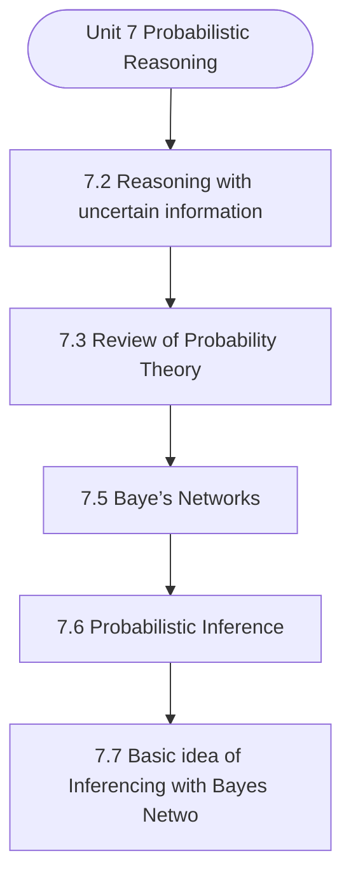

# MCS-224: Artificial Intelligence & Machine Learning
## Unit 7: Probabilistic Reasoning

> 📚 **Programme:** M.Sc. (Data Science and Analytics) | **Semester:** Semester 2  
> ⏱️ **Estimated Study Time:** ~37 mins | 📄 **Textbook Pages:** 17 Pages  
> 📥 **Original PDF:** [Download & View Authentic Textbook](../../../pdfs/Semester_2/MCS-224_Artificial_Intelligence_and_Machine_Learning/Unit-7_Probabilistic_Reasoning.pdf)

---

### 🎯 Executive Concept & Data Science Relevance
In modern data systems, **Probabilistic Reasoning** forms a vital conceptual pillar. Artificial Intelligence models autonomous decision-making, while Machine Learning extracts predictive statistical patterns from data. From A* pathfinding in logistics to Deep Neural Networks powering Computer Vision and LLMs, AI/ML drives modern automated systems.

> [!NOTE]
> **Why this matters for your career:** Mastering probabilistic reasoning equips you with the foundational principles required to reason mathematically about high-dimensional datasets, evaluate algorithm performance, and avoid statistical pitfalls in production machine learning pipelines.

### 🗺️ Visual Knowledge Architecture
The following concept map illustrates the structural hierarchy and learning trajectory of this module:



### 📖 Core Definitions & Terminology Cards

> 📌 **A* Search Algorithm**  
> - **Formal Definition:** Best-first graph search evaluating states by $f(n) = g(n) + h(n)$, where $g(n)$ is true cost from start to $n$, and $h(n)$ is heuristic estimate to goal. Guarantees optimal path if $h(n)$ is admissible ( $h(n) \le h^*(n)$ ).  
> - 💡 **Practical Intuition & Analogy:** *Finding the fastest route on GPS navigation without exploring irrelevant directions.*

> 📌 **Entropy and Information Gain**  
> - **Formal Definition:** Entropy $H(S) = -\sum p_i \log_2 p_i$ measures impurity. Information Gain $IG(S, A) = H(S) - \sum \frac{\vert S_v \vert}{\vert S \vert} H(S_v)$ measures reduction in entropy achieved by splitting on feature $A$.  
> - 💡 **Practical Intuition & Analogy:** *The mathematical criterion used by Decision Trees to select the most informative split attribute.*

> 📌 **Support Vector Machine (SVM) Margin**  
> - **Formal Definition:** Linear classifier finding the hyperplane maximizing the geometric margin $\frac{2}{\Vert\mathbf{w}\Vert}$ between classes, subject to $y_i(\mathbf{w}^T \mathbf{x}_i + b) \ge 1$. Non-linear data is separated using Kernel functions $K(\mathbf{x}, \mathbf{z}) = \phi(\mathbf{x})^T \phi(\mathbf{z})$.  
> - 💡 **Practical Intuition & Analogy:** *Finding the widest possible road separating positive and negative data clusters.*

> 📌 **Backpropagation Algorithm**  
> - **Formal Definition:** Iterative parameter optimization in neural networks utilizing the multivariate chain rule to propagate error gradients backwards from the loss function to update synaptic weights: $w_{ij} \leftarrow w_{ij} - \alpha \frac{\partial \mathcal{L}}{\partial w_{ij}}$.  
> - 💡 **Practical Intuition & Analogy:** *Automated blame assignment: adjusting each internal weight proportionally to how much it contributed to prediction error.*

### ⚡ Governing Mathematical Laws & Formula Cheatsheet
#### 🔹 A* Heuristic Evaluation Function
$$
f(n) = g(n) + h(n) \quad \text{Admissibility: } 0 \le h(n) \le h^*(n)
$$
- **Explanation:** If $h(n)$ never overestimates true remaining cost, A* tree search is guaranteed to return the optimal shortest path.

#### 🔹 Shannon Entropy Formula
$$
H(S) = -\sum_{i=1}^c p_i \log_2 p_i \quad \text{Gini Impurity: } 1 - \sum_{i=1}^c p_i^2
$$
- **Explanation:** Measures disorder in classification distributions; equals 0 when all samples belong to one class.

#### 🔹 Gradient Descent Weight Update Rule
$$
\mathbf{w}^{(t+1)} = \mathbf{w}^{(t)} - \alpha \nabla_{\mathbf{w}} \mathcal{L}(\mathbf{w})
$$
- **Explanation:** Stepping parameter vector opposite to the gradient vector scaled by learning rate $\alpha$.

#### 🔹 Neural Network Output Softmax Function
$$
\text{Softmax}(z_i) = \frac{e^{z_i}}{\sum_{j=1}^K e^{z_j}}
$$
- **Explanation:** Normalizes $K$ arbitrary logit outputs into a valid multi-class probability distribution summing to 1.

### ⚖️ Axiomatic Properties & Governing Laws
The mathematical formulations of this module are anchored by foundational algebraic and structural laws:

- **Heuristic Consistency Condition:** $h(n) \le c(n, a, n') + h(n') \implies \text{Monotonic (Guarantees A* optimality on graphs)}$
- **SVM Dual Formulation:** $\max_\alpha \sum \alpha_i - \frac{1}{2}\sum \alpha_i \alpha_j y_i y_j K(\mathbf{x}_i, \mathbf{x}_j)$
- **Universal Approximation Theorem:** A feedforward network with one non-linear hidden layer can approximate any continuous function on compact subsets of $\mathbb{R}^n$.

### 📌 Comprehensive Section-by-Section Study Breakdown
#### `7.2` Reasoning with uncertain information
##### 📘 Theoretical Principles & In-Depth Exposition
The section on **Reasoning with uncertain information** establishes rigorous theoretical foundations necessary for advanced computational modeling. It introduces formal mathematical structures and symbolic notations that guarantee consistency across proofs and algorithms.

In the broader scope of **Probabilistic Reasoning**, understanding reasoning with uncertain information is essential to formalizing data representations, verifying boundary constraints, and ensuring computational determinism across multidimensional feature spaces.

##### ⚙️ Mathematical & Algorithmic Mechanics
- **Formal Mechanics:** Establishes symbolic transformations and state invariants governing reasoning with uncertain information.
- **Boundary Invariants:** Ensures robust error-handling, non-empty set guarantees, and strict asymptotic bounds.

##### 📊 Practical Data Science & Production Relevance
- **Industry Application:** Directly implemented in production workflows such as SQL query filters, pandas vectorized operations, and feature transformation pipelines.
- **Production Pitfall:** Failing to verify membership bounds or missing edge cases in reasoning with uncertain information can cause silent data corruption or performance bottlenecks.

> [!TIP]
> **Key Exam & Technical Interview Takeaway:** Be prepared to define reasoning with uncertain information formally, cite its core mathematical invariants, and solve step-by-step numerical/proof questions.

#### `7.3` Review of Probability Theory
##### 📘 Theoretical Principles & In-Depth Exposition
Let ζ be the sample space corresponding to an experiment and E and F are two events of ζ Suppose the experiment is performed and the outcome is known only partially to the effect that the event F has taken place. Thus there still remains a scope for speculation about the occurrence of the other event E.

Keeping this additional piece of information confirming the occurrence of F in view, it would be appropriate to modify the probability of occurrence of E suitably. That such modifications would be necessary can be readily appreciated through two simple instances as follows: Example 5: Suppose, E and F are such that F E so that occurrence of F would automatically imply the occurrence of E.

Thus with the information that the event F has taken place in view, it is plausible to assign probability 1 to the occurrence of E irrespective of its original probability. E and F are two mutually exclusive events and thus they cannot occur together. Thus whenever we come to know that the event F has taken place, we can rule out the occurrence of E.

##### ⚙️ Mathematical & Algorithmic Mechanics
- **Formal Mechanics:** Establishes symbolic transformations and state invariants governing review of probability theory.
- **Boundary Invariants:** Ensures robust error-handling, non-empty set guarantees, and strict asymptotic bounds.

##### 📊 Practical Data Science & Production Relevance
- **Industry Application:** Directly implemented in production workflows such as SQL query filters, pandas vectorized operations, and feature transformation pipelines.
- **Production Pitfall:** Failing to verify membership bounds or missing edge cases in review of probability theory can cause silent data corruption or performance bottlenecks.

> [!TIP]
> **Key Exam & Technical Interview Takeaway:** Be prepared to define review of probability theory formally, cite its core mathematical invariants, and solve step-by-step numerical/proof questions.

#### `7.5` Baye’s Networks
##### 📘 Theoretical Principles & In-Depth Exposition
The probabilistic models are being used in defining the relationships among variables and are used to calculate probabilities.The Bayes’ network is a simpler form of applying Bayes’ theorem to complex real world problems. This uses a probabilistic graphical model which captures the conditional dependence explicitly and is represented using directed edges in a graph.

Here if we take fully conditional models, we may need a big amount of data to address all possible events/ cases and in such scenario probabilities may not be calculated practically. On the other hand, simple assumptions like conditional independence of random variables may turn out to be effective, giving a way for Bayes’ Network.

While representing a Bayes’ Network graphically, nodes represent the distribution of probabilities for random variables. The edges in the graph represent the relationship among random variables. The key benefits of a Bayes’ Network are model visualization, relationships among random variables and computations of complex probabilities.

##### ⚙️ Mathematical & Algorithmic Mechanics
- **Formal Mechanics:** Establishes symbolic transformations and state invariants governing baye’s networks.
- **Boundary Invariants:** Ensures robust error-handling, non-empty set guarantees, and strict asymptotic bounds.

##### 📊 Practical Data Science & Production Relevance
- **Industry Application:** Directly implemented in production workflows such as SQL query filters, pandas vectorized operations, and feature transformation pipelines.
- **Production Pitfall:** Failing to verify membership bounds or missing edge cases in baye’s networks can cause silent data corruption or performance bottlenecks.

> [!TIP]
> **Key Exam & Technical Interview Takeaway:** Be prepared to define baye’s networks formally, cite its core mathematical invariants, and solve step-by-step numerical/proof questions.

#### `7.6` Probabilistic Inference
##### 📘 Theoretical Principles & In-Depth Exposition
The probabilistic inference is very much dependent on the conditional probability of the specified events provided the information of occurrence of other events is available. For example, two events E and F such that P(F)>0, the conditional probability of event E when F has occurred can be written as : Probabilistic Reasoning (P(E ∩ F)) P(E/F) = __________ (P(F)) When an experiment is repeated a large number of times (say n), the above expression can be given a frequency interpretation.

Let the number of occurrences of an event F is represented as No. (F) and the probability of a joint event of E and F as No. The relative frequencies of both these events can be computed as f_r: (No.(E∩F)) fr (E ∩ F) = __________ and similarly, n Here, if n is large, the ratio of above two expressions represent the proportion of times the event E occurs relative to the occurrence of F.

This can also be understood as the approximate conditional occurrence of event F with E. fr (E ∩ F) / fr (F) ≃ P(E ∩ F) / P(F) We can also write the conditional probability of event F while it is given that event E has already occurred, as P(E / F) = P( E ∩ F) / P(F) Using above two equations we can also write P(F / E) = P( E / F) P(F) / P(E) The above expression is also one form of Bayes’ Rule.

##### ⚙️ Mathematical & Algorithmic Mechanics
- **Formal Mechanics:** Establishes symbolic transformations and state invariants governing probabilistic inference.
- **Boundary Invariants:** Ensures robust error-handling, non-empty set guarantees, and strict asymptotic bounds.

##### 📊 Practical Data Science & Production Relevance
- **Industry Application:** Directly implemented in production workflows such as SQL query filters, pandas vectorized operations, and feature transformation pipelines.
- **Production Pitfall:** Failing to verify membership bounds or missing edge cases in probabilistic inference can cause silent data corruption or performance bottlenecks.

> [!TIP]
> **Key Exam & Technical Interview Takeaway:** Be prepared to define probabilistic inference formally, cite its core mathematical invariants, and solve step-by-step numerical/proof questions.

#### `7.7` Basic idea of Inferencing with Bayes Networks
##### 📘 Theoretical Principles & In-Depth Exposition
BAYE’S NETWORKS We are now aware of the Bayes theorem, probability and Bayes networks. Let’s now talk about how inferences can be made using Bayes networks.A network here represents the degree of belief of proposition and their causal interdependence. The inference in a network can be done by propagating the given probabilities of related information through the network giving the output to one of the conclusion nodes.

The network representation also reduces the time and space requirements for huge computations involving the probabilities of uncertain knowledge of propositional variables. Further, one can not make the inference from such a large data in real time. The solution to such a problem can be found using the network representation.

Here the network of nodes represents variables connected by edges which represents causal influences (dependencies) among nodes. Here the edge weights can be used to represent the strength of influences or in other terms the conditional probabilities. To use this type of probabilistic inference model, one first needs to assign probabilities to all basic facts in the underlying knowledge base.

##### ⚙️ Mathematical & Algorithmic Mechanics
- **Formal Mechanics:** Establishes symbolic transformations and state invariants governing basic idea of inferencing with bayes networks.
- **Boundary Invariants:** Ensures robust error-handling, non-empty set guarantees, and strict asymptotic bounds.

##### 📊 Practical Data Science & Production Relevance
- **Industry Application:** Directly implemented in production workflows such as SQL query filters, pandas vectorized operations, and feature transformation pipelines.
- **Production Pitfall:** Failing to verify membership bounds or missing edge cases in basic idea of inferencing with bayes networks can cause silent data corruption or performance bottlenecks.

> [!TIP]
> **Key Exam & Technical Interview Takeaway:** Be prepared to define basic idea of inferencing with bayes networks formally, cite its core mathematical invariants, and solve step-by-step numerical/proof questions.

#### `7.8` Other Paradigm of Uncertain Reasoning
##### 📘 Theoretical Principles & In-Depth Exposition
REASONING The other ways of dealing with uncertainty are the ones with no theoretical proof. These are mostly based on intuition. These are selected over formal methods as a pragmatic solution to a particular problem, when the formal methods impose difficult or impossible conditions.

One such ad hoc procedure is used to diagnose meningitis and infectious blood disease, the system is called MYCIN. The MYCIN uses If and then rules to assess various forms of patient evidence. It also measures both belief and disbelief to represent degree of confirmation and disconfirmation respectively in a given hypothesis.

The ad hoc methods have been used in a larger number of knowledge-based systems than formal methods. This is due to the difficulties encountered in acquiring a large number of reliable probabilities related to the given domain and to the complexities to the ensuing calculations. One other paradigm is to use Heuristic reasoning methods.

##### ⚙️ Mathematical & Algorithmic Mechanics
- **Formal Mechanics:** Establishes symbolic transformations and state invariants governing other paradigm of uncertain reasoning.
- **Boundary Invariants:** Ensures robust error-handling, non-empty set guarantees, and strict asymptotic bounds.

##### 📊 Practical Data Science & Production Relevance
- **Industry Application:** Directly implemented in production workflows such as SQL query filters, pandas vectorized operations, and feature transformation pipelines.
- **Production Pitfall:** Failing to verify membership bounds or missing edge cases in other paradigm of uncertain reasoning can cause silent data corruption or performance bottlenecks.

> [!TIP]
> **Key Exam & Technical Interview Takeaway:** Be prepared to define other paradigm of uncertain reasoning formally, cite its core mathematical invariants, and solve step-by-step numerical/proof questions.

#### `7.9` Dempster Scheffer Theory
##### 📘 Theoretical Principles & In-Depth Exposition
Let us now discuss a mathematical theory based only on the evidence, known as Dempster-Schafer (D-S) theory given by Dempster and extended by Shafer in “Mathematical Theory of Evidences”. This uses a belief function to combine separate and independent evidence pieces to quantify the belief in a statement.

The D-S theory is a generalization of Bayesian probability theory where multiple possible events are assigned probabilities opposed to mutually exclusive singletons. The D-S theory assumes the existence of ignorance in knowledge creating uncertainty which in turn induces belief. Here, uncertainty of the hypothesis is represented by the belief function.

The main characteristic of the theory is: 1. Multiple possible events are permitted to assign probabilities. These events should be exhaustive and exclusive. Here, the multiple sources of information are assigned some degree of belief and then aggregated using the D-S combination rule.

##### ⚙️ Mathematical & Algorithmic Mechanics
- **Formal Mechanics:** Establishes symbolic transformations and state invariants governing dempster scheffer theory.
- **Boundary Invariants:** Ensures robust error-handling, non-empty set guarantees, and strict asymptotic bounds.

##### 📊 Practical Data Science & Production Relevance
- **Industry Application:** Directly implemented in production workflows such as SQL query filters, pandas vectorized operations, and feature transformation pipelines.
- **Production Pitfall:** Failing to verify membership bounds or missing edge cases in dempster scheffer theory can cause silent data corruption or performance bottlenecks.

> [!TIP]
> **Key Exam & Technical Interview Takeaway:** Be prepared to define dempster scheffer theory formally, cite its core mathematical invariants, and solve step-by-step numerical/proof questions.

### 📐 Step-by-Step Solved Mathematical Examples
To solidify your theoretical understanding, work through these fully solved, step-by-step mathematical problems:

#### 🧮 Example 1: Shannon Entropy and Information Gain Calculation
> **Problem Statement:**  
> A training dataset $S$ has 14 instances: 9 Positive ($+$) and 5 Negative ($-$). An attribute $A$ splits $S$ into $S_1$ (6 $+$, 2 $-$) and $S_2$ (3 $+$, 3 $-$). Compute Entropy $H(S)$ and Information Gain $IG(S, A)$.

**Detailed Step-by-Step Solution:**

1. **Parent Entropy $H(S)$:**
$$
H(S) = -\left(\frac{9}{14} \log_2 \frac{9}{14} + \frac{5}{14} \log_2 \frac{5}{14}\right) \approx 0.940 \text{ bits}
$$

2. **Subset Entropies:**
- For $S_1$ (total 8): $H(S_1) = -\left(\frac{6}{8}\log_2\frac{6}{8} + \frac{2}{8}\log_2\frac{2}{8}\right) = 0.811 \text{ bits}$
- For $S_2$ (total 6): $H(S_2) = -\left(\frac{3}{6}\log_2\frac{3}{6} + \frac{3}{6}\log_2\frac{3}{6}\right) = 1.000 \text{ bits}$

3. **Weighted Child Entropy:**
$$
H(S, A) = \frac{8}{14}(0.811) + \frac{6}{14}(1.000) = 0.463 + 0.429 = 0.892 \text{ bits}
$$

4. **Information Gain:**
$$
IG(S, A) = H(S) - H(S, A) = 0.940 - 0.892 = 0.048 \text{ bits}
$$
(Attribute provides 0.048 bits of entropy reduction).

#### 🧮 Example 2: A* Search Step Evaluation
> **Problem Statement:**  
> In graph navigation, node $N$ has exact path cost from start $g(N) = 14$ and straight-line heuristic to goal $h(N) = 11$. For node $M$, $g(M) = 18, h(M) = 6$. Which node is expanded next by A*?

**Detailed Step-by-Step Solution:**

1. Compute $f(n) = g(n) + h(n)$:
- $f(N) = 14 + 11 = 25$
- $f(M) = 18 + 6 = 24$

2. Decision: A* selects the node with minimal $f(n)$. Since $f(M) = 24 < f(N) = 25$, **Node $M$ is expanded next**.

### 💻 Practical Data Science Implementation (Python)
Theory translates directly into production algorithms. Below is a self-contained, commented Python implementation illustrating the core operations of this unit:

```python
import numpy as np

# Decision Tree Entropy and Information Gain from scratch
def entropy(labels):
    counts = np.bincount(labels)
    probs = counts[counts > 0] / len(labels)
    return -np.sum(probs * np.log2(probs))

def information_gain(parent_labels, left_split, right_split):
    h_parent = entropy(parent_labels)
    n = len(parent_labels)
    h_children = (len(left_split)/n)*entropy(left_split) + (len(right_split)/n)*entropy(right_split)
    return h_parent - h_children

# Sample binary targets: 9 ones, 5 zeros
y_parent = np.array([1]*9 + [0]*5)
y_left = np.array([1]*6 + [0]*2)
y_right = np.array([1]*3 + [0]*3)

ig = information_gain(y_parent, y_left, y_right)
print(f"Parent Entropy: {entropy(y_parent):.4f}")
print(f"Information Gain: {ig:.4f} bits")
```

### 💡 Interactive Self-Assessment Checkpoints
Test your comprehension before proceeding. Tap each question to reveal the comprehensive explanation:

<details>
<summary><b>Checkpoint 1:</b> What condition must a heuristic $h(n)$ satisfy for A* search to be optimal? <i>(Tap to reveal answer)</i></summary>

> **Answer & Analysis:**  
> The heuristic must be **Admissible**, meaning it never overestimates the actual minimal cost to reach the goal state ( $h(n) \le h^*(n)$ ).
</details>

<details>
<summary><b>Checkpoint 2:</b> What is the formula for Information Gain used in Decision Trees? <i>(Tap to reveal answer)</i></summary>

> **Answer & Analysis:**  
> $IG(S, A) = H(S) - \sum_{v \in \text{Values}(A)} \frac{\vert S_v \vert}{\vert S \vert} H(S_v)$
</details>

<details>
<summary><b>Checkpoint 3:</b> Why is the Softmax function used in multi-class classification neural networks? <i>(Tap to reveal answer)</i></summary>

> **Answer & Analysis:**  
> It converts unconstrained real numbers (logits) into a valid probability distribution where each value is in $[0, 1]$ and all values sum strictly to 1.
</details>

<details>
<summary><b>Checkpoint 4:</b> A card is drawn, its number noted and the card is replaced. Another card is drawn and its number is noted. Problem <i>(Tap to reveal answer)</i></summary>

> **Answer & Analysis:**  
> This question tests your conceptual mastery of Probabilistic Reasoning. Review the governing formulas and section breakdowns above to formulate a complete, rigorous proof or derivation.
</details>

<details>
<summary><b>Checkpoint 5:</b> What are different type of evidences? Give suitable example of each. <i>(Tap to reveal answer)</i></summary>

> **Answer & Analysis:**  
> This question tests your conceptual mastery of Probabilistic Reasoning. Review the governing formulas and section breakdowns above to formulate a complete, rigorous proof or derivation.
</details>

<details>
<summary><b>Checkpoint 6:</b> A card is drawn, its number noted and the card is replaced. Another card is drawn and its number is noted. Solution - *Please refer to section <i>(Tap to reveal answer)</i></summary>

> **Answer & Analysis:**  
> This question tests your conceptual mastery of Probabilistic Reasoning. Review the governing formulas and section breakdowns above to formulate a complete, rigorous proof or derivation.
</details>

### 🎯 Executive Module Wrap-Up
- **Central Idea:** Probabilistic Reasoning provides essential mathematical and algorithmic tools directly utilized in Data Science.
- **Mathematical Rigor:** Formulas and laws must be memorized with attention to boundary conditions and assumptions.
- **Full Textbook Coverage:** For exhaustive multi-page derivations, proofs, and supplementary exercises, consult the [Authentic IGNOU Textbook](../../../pdfs/Semester_2/MCS-224_Artificial_Intelligence_and_Machine_Learning/Unit-7_Probabilistic_Reasoning.pdf).

---
### 🧭 Navigation & Syllabus Index
[⬅ Previous: Unit 6](unit_06_Rule_Based_Systems_and_other_Formalism.md) | [📑 Course Index](README.md) | [Next: Unit 8 ➡](unit_08_Fuzzy_and_Rough_Set.md)
