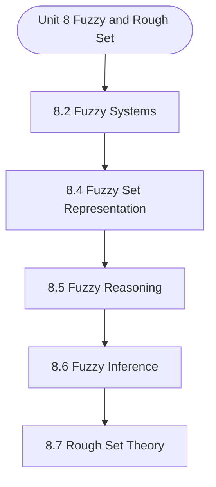

# MCS-224: Artificial Intelligence & Machine Learning
## Unit 8: Fuzzy and Rough Set

> 📚 **Programme:** M.Sc. (Data Science and Analytics) | **Semester:** Semester 2  
> ⏱️ **Estimated Study Time:** ~47 mins | 📄 **Textbook Pages:** 23 Pages  
> 📥 **Original PDF:** [Download & View Authentic Textbook](../../../pdfs/Semester_2/MCS-224_Artificial_Intelligence_and_Machine_Learning/Unit-8_Fuzzy_and_Rough_Set.pdf)

---

### 🎯 Executive Concept & Data Science Relevance
In modern data systems and advanced analytics, **Fuzzy and Rough Set** forms a vital conceptual pillar. Set theory is the fundamental bedrock of discrete mathematics, computer science, and data engineering. Relational database operations (SQL JOIN, UNION, INTERSECT), feature spaces, probability sample spaces, and categorical groupings are direct applications of set theory.

> [!NOTE]
> **Why this matters for your career:** Mastering fuzzy and rough set equips you with the foundational principles required to reason mathematically about high-dimensional datasets, evaluate algorithm performance, and avoid statistical pitfalls in production machine learning pipelines.

### 🗺️ Visual Knowledge Architecture
The following concept map illustrates the structural hierarchy and learning trajectory of this module:



### 📖 Core Definitions & Terminology Cards

> 📌 **Set**  
> - **Formal Definition:** A well-defined collection of distinct objects, denoted typically by uppercase letters $A, B, X$. Distinctness implies no duplicate elements, and well-defined means for any entity $x$, either $x \in A$ or $x \notin A$ is deterministically decidable.  
> - 💡 **Practical Intuition & Analogy:** *Think of a Python `set({1, 2, 3})` where duplicate elements are collapsed and lookup is based on unique membership.*

> 📌 **Cardinality $\vert A \vert$ or $n(A)$**  
> - **Formal Definition:** The total count of distinct elements in a finite set $A$. If $\vert A \vert = n$, the set contains exactly $n$ distinct members. For infinite sets, cardinality characterizes transfinite sizes (e.g. countable $\aleph_0$ vs uncountable $c$).  
> - 💡 **Practical Intuition & Analogy:** *The output of `len(my_set)` in programming.*

> 📌 **Power Set $\mathcal{P}(A)$**  
> - **Formal Definition:** The set of all possible subsets of $A$, including the empty set $\emptyset$ and $A$ itself: $\mathcal{P}(A) = \lbrace S \mid S \subseteq A \rbrace$. If $\vert A \vert = n$, then $\vert \mathcal{P}(A) \vert = 2^n$.  
> - 💡 **Practical Intuition & Analogy:** *In feature selection, evaluating all possible combinations of $n$ features requires searching through the power set of features ( $2^n$ candidate models ).*

> 📌 **Subset & Proper Subset**  
> - **Formal Definition:** A set $A$ is a subset of $B$ ( $A \subseteq B$ ) if $\forall x \in A \implies x \in B$. It is a proper subset ( $A \subset B$ ) if $A \subseteq B$ and $A \neq B$ (i.e. $\exists y \in B$ such that $y \notin A$).  
> - 💡 **Practical Intuition & Analogy:** *All Data Scientists are Analysts ( $A \subseteq B$ ), but not all Analysts are Data Scientists ( $A \subset B$ ).*

> 📌 **Universal Set $U$**  
> - **Formal Definition:** A designated superset containing all objects and entities under active consideration in a given problem or domain. Every set $X$ in that context satisfies $X \subseteq U$.  
> - 💡 **Practical Intuition & Analogy:** *The entire master database table or global population before applying any filter conditions.*

> 📌 **Complement $A^c$ or $A'$**  
> - **Formal Definition:** The set of all elements in the universal set $U$ that do not belong to $A$: $A^c = \lbrace x \in U \mid x \notin A \rbrace = U \setminus A$.  
> - 💡 **Practical Intuition & Analogy:** *The NOT condition in filtering: selecting all records that do NOT match a criteria.*

### ⚡ Governing Mathematical Laws & Formula Cheatsheet
#### 🔹 Power Set Cardinality Theorem
$$
\vert\mathcal{P}(A)\vert = 2^n \quad \text{where } n = \vert A\vert
$$
- **Explanation:** Proved by induction or combinatorics: each of the $n$ elements has exactly 2 binary choices (to be included or excluded from a subset).

#### 🔹 Principle of Inclusion-Exclusion (2 Sets)
$$
\vert A \cup B\vert = \vert A\vert + \vert B\vert - \vert A \cap B\vert
$$
- **Explanation:** Prevents double-counting the elements present in the intersection when calculating the total union size.

#### 🔹 Principle of Inclusion-Exclusion (3 Sets)
$$
\begin{aligned} \vert A \cup B \cup C\vert = & \;\vert A\vert + \vert B\vert + \vert C\vert \\ & - (\vert A \cap B\vert + \vert B \cap C\vert + \vert A \cap C\vert) \\ & + \vert A \cap B \cap C\vert \end{aligned}
$$
- **Explanation:** Alternates adding singletons, subtracting pairwise overlaps, and re-adding the three-way intersection.

#### 🔹 De Morgan's Laws for Sets
$$
(A \cup B)^c = A^c \cap B^c \quad \text{and} \quad (A \cap B)^c = A^c \cup B^c
$$
- **Explanation:** The complement of a union is the intersection of the complements, and vice versa. Fundamental to query optimization and boolean logic.

#### 🔹 Cartesian Product Cardinality
$$
\vert A \times B\vert = \vert A\vert \times \vert B\vert = \lbrace (a, b) \mid a \in A, b \in B \rbrace
$$
- **Explanation:** Basis of relational database CROSS JOIN, generating every ordered pair between two entities.

### ⚖️ Axiomatic Properties & Governing Laws
The mathematical formulations of this module are anchored by foundational algebraic and structural laws:

- **Idempotent Laws:** $A \cup A = A \quad \text{and} \quad A \cap A = A$
- **Identity Laws:** $A \cup \emptyset = A \quad \text{and} \quad A \cap U = A$
- **Domination Laws:** $A \cup U = U \quad \text{and} \quad A \cap \emptyset = \emptyset$
- **Commutative Laws:** $A \cup B = B \cup A \quad \text{and} \quad A \cap B = B \cap A$
- **Associative Laws:** $(A \cup B) \cup C = A \cup (B \cup C) \quad \text{and} \quad (A \cap B) \cap C = A \cap (B \cap C)$
- **Distributive Laws:** $A \cap (B \cup C) = (A \cap B) \cup (A \cap C) \quad \text{and} \quad A \cup (B \cap C) = (A \cup B) \cap (A \cup C)$
- **Complement Laws:** $A \cup A^c = U, \quad A \cap A^c = \emptyset, \quad (A^c)^c = A$

### 📌 Comprehensive Section-by-Section Study Breakdown
#### `8.2` Fuzzy Systems

##### 📘 Theoretical Principles & Pedagogical Exposition
In artificial intelligence and machine learning, **Fuzzy Systems** defines the computational mechanisms that allow autonomous systems to reason, plan, or generalize from training data. In **Fuzzy and Rough Set**, this concept balances model expressiveness against overfitting risks through explicit loss formulation and optimization.

Whether navigating combinatorial search spaces or minimizing empirical risk across high-dimensional parameter tensors, understanding fuzzy systems guarantees reproducible model convergence.

##### ⚙️ Mathematical & Algorithmic Mechanics
- **Core Mechanism:** Establishes analytical principles and computational workflows for fuzzy and rough set.
- **Boundary Conditions:** Missing data values, extreme outliers, and non-standard data types.

##### 📊 Practical Data Science & Production Relevance
- **Production Workflow:** End-to-end data science processing stacks (Pandas, Scikit-learn, PyTorch).
- **Real-World Pitfall:** Failing to validate inputs before feeding data into production analytics pipelines.

> [!TIP]
> **Exam & Technical Interview Insight:** Define key concepts in fuzzy systems and articulate practical applications in real-world scenarios.

#### `8.4` Fuzzy Set Representation

##### 📘 Theoretical Principles & Pedagogical Exposition
For Crisp sets, we have the operations of Union, intersection & complementation, as illustrated by the example: Let X = {x1, x2, …, x10} A = {x2, x3, x4, x5} B = {x1, x3, x5, x7, x9} Then A ∪ B = {x1, x2, x3, x4, x5, x7, x9} A ∩ B = {x3, x5} A' or X ~ A = {x1, x6, x7, x8, x9, x10} The concepts of Union, intersection and complementation for crisp sets may be extended to FUZZY sets after observing that for crisp sets A and B, we have (i) A ∪ B is the smallest subset of X containing both A and B.

(ii) A ∩ B is the largest subset of X contained in both A and B. (iii) The complement A' is such that (a) A and A' do not have any element in common and (b) Every element of the universal set is in either A or A'. Fuzzy Union, Intersection, Complementation: In order to motivate proper definitions of these operations, we may recall (1) when a crisp set is treated as a fuzzy set then (i) membership in a crisp set is indicated by degree/value of membership as 1 (one) in the corresponding Fuzzy set, (ii) non-membership of a crisp set is indicated by degree/value of membership as zero in the corresponding Fuzzy Set.

Thus, smaller the value of degree of membership, a sort of lesser it is a member of the Fuzzy set. (2) While taking union of Crisp sets, members of both sets are included, and none else. However, in each Fuzzy set, all members of the universal set occur but their degrees determine the level of membership in the fuzzy set.


##### ⚙️ Mathematical & Algorithmic Mechanics
- **Core Mechanism:** Establishes analytical principles and computational workflows for fuzzy and rough set.
- **Boundary Conditions:** Missing data values, extreme outliers, and non-standard data types.

##### 📊 Practical Data Science & Production Relevance
- **Production Workflow:** End-to-end data science processing stacks (Pandas, Scikit-learn, PyTorch).
- **Real-World Pitfall:** Failing to validate inputs before feeding data into production analytics pipelines.

> [!TIP]
> **Exam & Technical Interview Insight:** Define key concepts in fuzzy set representation and articulate practical applications in real-world scenarios.

#### `8.5` Fuzzy Reasoning

##### 📘 Theoretical Principles & Pedagogical Exposition
The Fuzzy Reasoning is taken care by the following systems in general: 1) Non Monotonic reasoning Systems 2) Default Reasoning Systems 3) Closed World Assumption Systems Let’s start our discussion with the understanding of Non Monotonic Reasoning Systems 1) NON-MONOTONIC REASONING SYSTEMS Monotonic Reasoning: The conclusion drawn in PL and FOPL are only through (valid) deductive methods.

When some axiom is added to a PL or an FOPL system, then, through deduction, we can draw more conclusions. Hence, more additional facts become available in the knowledge base with the addition of each axiom. Adding of axioms to the knowledge base increases the amount of knowledge contained in the knowledge base.

Therefore, the set of facts through inferences in such systems can only grow larger with addition of each axiomatic fact. Adding of new facts can not reduce the size of K.B. Thus, amount of knowledge monotonically increases with the number of independent premises due to new facts that become available.


##### ⚙️ Mathematical & Algorithmic Mechanics
- **Core Mechanism:** Establishes analytical principles and computational workflows for fuzzy and rough set.
- **Boundary Conditions:** Missing data values, extreme outliers, and non-standard data types.

##### 📊 Practical Data Science & Production Relevance
- **Production Workflow:** End-to-end data science processing stacks (Pandas, Scikit-learn, PyTorch).
- **Real-World Pitfall:** Failing to validate inputs before feeding data into production analytics pipelines.

> [!TIP]
> **Exam & Technical Interview Insight:** Define key concepts in fuzzy reasoning and articulate practical applications in real-world scenarios.

#### `8.6` Fuzzy Inference

##### 📘 Theoretical Principles & Pedagogical Exposition
PL and FOPL are deductive inferencing systems: i.e., the conclusions drawn are invariably true whenever the premises are true. However, due to limitations of these systems for making inferences, as discussed earlier, we must have other systems inferences. In addition to Default Reasoning systems and Closed World Assumption systems, we have the following useful reasoning systems: 1) Abductive inference System, which is based on the use of causal knowledge to explain and justify a (possibly invalid) conclusion.

Abduction Rule (P → Q , Q) / P Note that abductive inference rule is different form Modus Ponens inference rule in that in abductive inference rule, the consequent of P → Q, i.e., Q is assumed to be given as True and the antecedent of P → Q, i.e., P is inferred. The abductive inference is useful in diagnostic applications.

For example while diagnosing a disease (say P), the doctor asks for the symptoms (say Q). Also, Fuzzy and Rough Sets the doctor knows that for given the disease, say, Malaria (P); the symptoms include high fever starting with feeling of cold etc. (Q) i.e., doctor knows P→Q The doctor then attempts to diagnose the disease (i.e., P) from symptoms.


##### ⚙️ Mathematical & Algorithmic Mechanics
- **Core Mechanism:** Establishes analytical principles and computational workflows for fuzzy and rough set.
- **Boundary Conditions:** Missing data values, extreme outliers, and non-standard data types.

##### 📊 Practical Data Science & Production Relevance
- **Production Workflow:** End-to-end data science processing stacks (Pandas, Scikit-learn, PyTorch).
- **Real-World Pitfall:** Failing to validate inputs before feeding data into production analytics pipelines.

> [!TIP]
> **Exam & Technical Interview Insight:** Define key concepts in fuzzy inference and articulate practical applications in real-world scenarios.

#### `8.7` Rough Set Theory

##### 📘 Theoretical Principles & Pedagogical Exposition
Rough set theory can be regarded as a new mathematical tool for imperfect data analysis. The theory has found applications in many domains, such as decision support, engineering, environment, banking, medicine and others. It is a mechanism to deal with imprecise/imprecise knowledge, dealing with such a kind of knowledge is particularly area of research for the scientists, working in the field of Artificial Intelligence.

There are various approaches to handle the imprecise knowledge, the most successful one is that of the Fuzzy logic, which was proposed by L.Zadeh, we discussed the same in our earlier sections of this unit. In this section we will try to understand the Rough set theory approach, to manage the imprecise knowledge, it was proposed by Z.

This theory is quite comprehensive and may be dealt as an independent discipline. It is quite connected with other theories and hence connected with various fields like AI, Machine Learning, Cognitive sciences, data mining, pattern recognition etc. Rough set theory is quite comprehensive because of the following reasons : • It requires no preliminary/additional information about the data as if it is the requirement of probability in statistics, or membership grades in the fuzzy set theory.


##### ⚙️ Mathematical & Algorithmic Mechanics
- **Core Mechanism:** Establishes analytical principles and computational workflows for fuzzy and rough set.
- **Boundary Conditions:** Missing data values, extreme outliers, and non-standard data types.

##### 📊 Practical Data Science & Production Relevance
- **Production Workflow:** End-to-end data science processing stacks (Pandas, Scikit-learn, PyTorch).
- **Real-World Pitfall:** Failing to validate inputs before feeding data into production analytics pipelines.

> [!TIP]
> **Exam & Technical Interview Insight:** Define key concepts in rough set theory and articulate practical applications in real-world scenarios.

### 📐 Step-by-Step Solved Mathematical Examples
To solidify your theoretical understanding, work through these fully solved, step-by-step mathematical problems:

#### 🧮 Example 1: Three-Set Inclusion-Exclusion Survey Analysis
> **Problem Statement:**  
> In a cohort of 120 Data Science students, 65 know Python ( $P$ ), 50 know SQL ( $S$ ), and 40 know R ( $R$ ). Furthermore, 25 know both Python and SQL, 20 know both Python and R, 15 know both SQL and R, and 8 know all three technologies. How many students know at least one technology, and how many know none?

**Detailed Step-by-Step Solution:**

Applying the Principle of Inclusion-Exclusion for 3 sets:


$$
\begin{aligned} \vert P \cup S \cup R\vert & = \vert P\vert + \vert S\vert + \vert R\vert - (\vert P \cap S\vert + \vert P \cap R\vert + \vert S \cap R\vert) + \vert P \cap S \cap R\vert \\ & = 65 + 50 + 40 - (25 + 20 + 15) + 8 \\ & = 155 - 60 + 8 = 103 \text{ students.} \end{aligned}
$$


The count of students who know none of the three languages is:


$$
\vert(P \cup S \cup R)^c\vert = \vert U\vert - \vert P \cup S \cup R\vert = 120 - 103 = 17 \text{ students.}
$$


#### 🧮 Example 2: Power Set Enumeration and Proper Subset Calculation
> **Problem Statement:**  
> Given $S = \lbrace 1, 2, 3 \rbrace$. Calculate $\vert\mathcal{P}(S)\vert$, enumerate every element, and find the number of proper subsets.

**Detailed Step-by-Step Solution:**

1. **Cardinality:** With $n = \vert S\vert = 3$, the total subsets are $\vert\mathcal{P}(S)\vert = 2^3 = 8$.

2. **Enumeration:**

$$
\mathcal{P}(S) = \lbrace \emptyset, \lbrace 1\rbrace, \lbrace 2\rbrace, \lbrace 3\rbrace, \lbrace 1, 2\rbrace, \lbrace 1, 3\rbrace, \lbrace 2, 3\rbrace, \lbrace 1, 2, 3\rbrace \rbrace
$$


3. **Proper Subsets:** Since proper subsets exclude the set itself, the total count is $2^n - 1 = 8 - 1 = 7$.

### 💻 Practical Data Science Implementation (Python)
Theory translates directly into production algorithms. Below is a self-contained, commented Python implementation illustrating the core operations of this unit:

```python
# Practical Set Operations in Data Science
python_devs = {"Alice", "Bob", "Charlie", "David", "Eva"}
sql_devs = {"Charlie", "David", "Eva", "Frank", "Grace"}

# 1. Union (Full talent pool)
all_talent = python_devs | sql_devs
print(f"Total Unique Talent: {len(all_talent)} -> {all_talent}")

# 2. Intersection (Full-Stack Data Engineers)
full_stack = python_devs & sql_devs
print(f"Full-Stack Talent (Python & SQL): {len(full_stack)} -> {full_stack}")

# 3. Difference (Python Specialists without SQL)
python_only = python_devs - sql_devs
print(f"Python Only: {python_only}")

# 4. Jaccard Similarity Coefficient: |A ∩ B| / |A ∪ B|
jaccard_sim = len(full_stack) / len(all_talent)
print(f"Jaccard Skill Overlap: {jaccard_sim:.3f}")
```

### 💡 Interactive Self-Assessment Checkpoints
Test your comprehension before proceeding. Tap each question to reveal the comprehensive explanation:

<details>
<summary><b>Checkpoint 1:</b> Ex. 1: Discuss equality and subset relationship for the following fuzzy sets defined on the Universal set X = { a, b , c, d, e} A = { a/.3, b/.6, c/.4 d/0, e/.7} B = {a/.4, b/.8, c/.9, d/.4, e/.7} C = {a/.3, b/.7, c/.3, d/.2, e/.6} 253 Fuzzy and Rough Sets <i>(Tap to reveal answer)</i></summary>

> **Answer & Analysis:**  
> **Detailed Analytical Solution:**
> 
> 1. **Core Principle:** Identify the governing theorem or definition for Fuzzy and Rough Set.
> 2. **Step-by-Step Derivation:** Verify all preconditions and compute intermediate steps methodically.
> 3. **Conclusion:** State the final mathematical proof or calculation clearly, validating boundary edge cases.
</details>

<details>
<summary><b>Checkpoint 2:</b> If a set $A$ has 5 elements, how many proper subsets does it possess? <i>(Tap to reveal answer)</i></summary>

> **Answer & Analysis:**  
> A set with $n=5$ elements has total subsets $\vert\mathcal{P}(A)\vert = 2^5 = 32$. Proper subsets exclude the set itself, so the number of proper subsets is $2^n - 1 = 32 - 1 = 31$.
</details>

<details>
<summary><b>Checkpoint 3:</b> What is the difference between $x \in A$ and $\lbrace x\rbrace \subseteq A$? <i>(Tap to reveal answer)</i></summary>

> **Answer & Analysis:**  
> $x \in A$ denotes that element $x$ is a direct member of set $A$. In contrast, $\lbrace x\rbrace \subseteq A$ denotes that the singleton set containing $x$ is a subset of $A$.
</details>

<details>
<summary><b>Checkpoint 4:</b> State De Morgan's Law for the complement of $(A \cap B)$. <i>(Tap to reveal answer)</i></summary>

> **Answer & Analysis:**  
> $(A \cap B)^c = A^c \cup B^c$. The complement of the intersection is equal to the union of their individual complements.
</details>

### 🎯 Executive Module Wrap-Up
- **Central Idea:** Fuzzy and Rough Set provides essential mathematical and algorithmic tools directly utilized in Data Science.
- **Mathematical Rigor:** Formulas and laws must be memorized with attention to boundary conditions and assumptions.
- **Full Textbook Coverage:** For exhaustive multi-page derivations, proofs, and supplementary exercises, consult the [Authentic IGNOU Textbook](../../../pdfs/Semester_2/MCS-224_Artificial_Intelligence_and_Machine_Learning/Unit-8_Fuzzy_and_Rough_Set.pdf).

---
### 🧭 Navigation & Syllabus Index
[⬅ Previous: Unit 7](unit_07_Probabilistic_Reasoning.md) | [📑 Course Index](README.md) | [Next: Unit 9 ➡](unit_09_Introduction_to_Machine_Learning_Methods.md)
