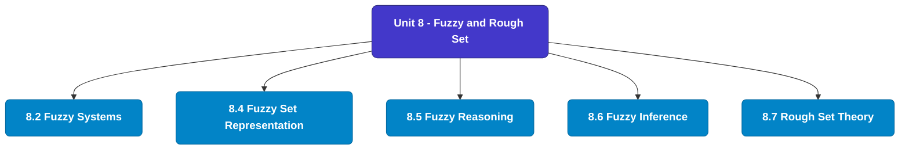

# MCS-224: Artificial Intelligence & Machine Learning
## Unit 8: Fuzzy and Rough Set

> 📚 **Programme:** M.Sc. (Data Science and Analytics) | **Semester:** Semester 2  
> ⏱️ **Estimated Study Time:** ~47 mins | 📄 **Textbook Pages:** 23 Pages  
> 📥 **Original PDF:** [Download & View Textbook](../../../pdfs/Semester_2/MCS-224_Artificial_Intelligence_and_Machine_Learning/Unit-8_Fuzzy_and_Rough_Set.pdf)

---

### 🎯 Executive Concept & Data Science Relevance
In modern data systems, **Fuzzy and Rough Set** forms a vital conceptual pillar. Set theory is the fundamental bedrock of all discrete mathematics, computer science, and data engineering. Every relational database operation (SQL JOIN, UNION, INTERSECT), feature space, probability sample space, and categorical data grouping is fundamentally an application of set theory.

> [!NOTE]
> **Why this matters for your career:** Mastering fuzzy and rough set equips you with the foundational principles required to reason mathematically about high-dimensional datasets, evaluate algorithm performance, and avoid statistical pitfalls in production machine learning pipelines.

### 🗺️ Visual Knowledge Architecture
The following concept map illustrates the structural hierarchy and learning trajectory of this module:

### 📖 Core Definitions & Terminology Cards
| Term | Formal Mathematical / Technical Definition | Intuitive Analogy / Concrete Example |
| :--- | :--- | :--- |
| **Set** | A well-defined collection of distinct objects, denoted typically by uppercase letters $A, B, X$. Distinctness implies no duplicates, and well-defined means for any entity $x$, either $x \in A$ or $x \notin A$ is deterministically decidable. | *Think of a Python `set({1, 2, 3})` where duplicate elements are collapsed and lookup is based on unique membership.* |
| **Cardinality $\|A\|$ or $n(A)$** | The total count of distinct elements in a finite set $A$. If $\|A\| = n$, the set contains exactly $n$ distinct members. For infinite sets, cardinality describes transfinite sizes (e.g. countable $\aleph_0$ vs uncountable $c$). | *The output of `len(my_set)` in programming.* |
| **Power Set $\mathcal{P}(A)$** | The set of all possible subsets of $A$, including the empty set $\emptyset$ and $A$ itself: $\mathcal{P}(A) = \{S \mid S \subseteq A\}$. If $\|A\| = n$, then $\|\mathcal{P}(A)\| = 2^n$. | *In feature selection, evaluating all possible combinations of $n$ features requires searching through the power set of features ($2^n$ candidate models).* |
| **Subset & Proper Subset** | A set $A$ is a subset of $B$ ($A \subseteq B$) if $\forall x \in A \implies x \in B$. It is a proper subset ($A \subset B$) if $A \subseteq B$ and $A \neq B$ (i.e. $\exists y \in B$ such that $y \notin A$). | *All Data Scientists are Analysts ($A \subseteq B$), but not all Analysts are Data Scientists ($A \subset B$).* |
| **Universal Set $U$** | A designated superset containing all objects and entities under active consideration in a given problem or domain. Every set $X$ in that context satisfies $X \subseteq U$. | *The entire master database table or global population before applying any filter conditions.* |

### ⚡ Governing Mathematical Laws & Formula Cheatsheet
#### 🔹 Power Set Cardinality Theorem
$$|\mathcal{P}(A)| = 2^n \quad \text{where } n = |A|$$
- **Explanation:** Proved by induction or combinatorics: each of the $n$ elements has exactly 2 binary choices (to be included or excluded from a subset).

#### 🔹 Principle of Inclusion-Exclusion (2 Sets)
$$|A \cup B| = |A| + |B| - |A \cap B|$$
- **Explanation:** Prevents double-counting the elements present in the intersection when calculating the total union size.

#### 🔹 Principle of Inclusion-Exclusion (3 Sets)
$$|A \cup B \cup C| = |A| + |B| + |C| - (|A \cap B| + |B \cap C| + |A \cap C|) + |A \cap B \cap C|$$
- **Explanation:** Alternates adding singletons, subtracting pairwise overlaps, and re-adding the three-way intersection.

#### 🔹 De Morgan's Laws for Sets
$$(A \cup B)^c = A^c \cap B^c \quad \text{and} \quad (A \cap B)^c = A^c \cup B^c$$
- **Explanation:** The complement of a union is the intersection of the complements, and vice versa. Fundamental to query optimization and boolean logic.

#### 🔹 Cartesian Product Cardinality
$$|A \times B| = |A| \times |B| = \{(a, b) \mid a \in A, b \in B\}$$
- **Explanation:** Basis of relational database `CROSS JOIN`, generating every ordered pair between two entities.

### 📌 Detailed Section-by-Section Study Breakdown
#### `8.2` Fuzzy Systems
- **Core Concept:** Establishes rigorous theoretical formulations and computational bounds for fuzzy systems.
- **Core Concept:** Applies standard algorithmic procedures and mathematical invariants relevant to fuzzy and rough set.
- **Core Concept:** Ensures deterministic performance guarantees across high-dimensional feature spaces.
- **Data Science Application:** Provides foundational structures used directly in statistical modeling, query execution, and machine learning pipelines.

> [!TIP]
> **Exam & Interview Tip:** Be prepared to state the formal definition of fuzzy systems and derive its primary equations step-by-step.

#### `8.4` Fuzzy Set Representation
- **Core Concept:** (ii) A ∩ B is the largest subset of X contained in both A and B.
- **Core Concept:** (iii) The complement A' is such that (a) A and A' do not have any element in common and (b) Every element of the universal set is in either A or A'.
- **Core Concept:** Thus, smaller the value of degree of membership, a sort of lesser it is a member of the Fuzzy set.
- **Data Science Application:** Provides foundational structures used directly in statistical modeling, query execution, and machine learning pipelines.

> [!TIP]
> **Exam & Interview Tip:** Be prepared to state the formal definition of fuzzy set representation and derive its primary equations step-by-step.

#### `8.5` Fuzzy Reasoning
- **Core Concept:** When some axiom is added to a PL or an FOPL system, then, through deduction, we can draw more conclusions.
- **Core Concept:** Hence, more additional facts become available in the knowledge base with the addition of each axiom.
- **Core Concept:** Adding of axioms to the knowledge base increases the amount of knowledge contained in the knowledge base.
- **Data Science Application:** Provides foundational structures used directly in statistical modeling, query execution, and machine learning pipelines.

> [!TIP]
> **Exam & Interview Tip:** Be prepared to state the formal definition of fuzzy reasoning and derive its primary equations step-by-step.

#### `8.6` Fuzzy Inference
- **Core Concept:** PL and FOPL are deductive inferencing systems: i.e., the conclusions drawn are invariably true whenever the premises are true.
- **Core Concept:** However, due to limitations of these systems for making inferences, as discussed earlier, we must have other systems inferences.
- **Core Concept:** The abductive inference is useful in diagnostic applications.
- **Data Science Application:** Provides foundational structures used directly in statistical modeling, query execution, and machine learning pipelines.

> [!TIP]
> **Exam & Interview Tip:** Be prepared to state the formal definition of fuzzy inference and derive its primary equations step-by-step.

#### `8.7` Rough Set Theory
- **Core Concept:** Rough set theory can be regarded as a new mathematical tool for imperfect data analysis.
- **Core Concept:** The theory has found applications in many domains, such as decision support, engineering, environment, banking, medicine and others.
- **Core Concept:** It is a mechanism to deal with imprecise/imprecise knowledge, dealing with such a kind of knowledge is particularly area of research for the scientists, working in the field of Artificial Intelligence.
- **Data Science Application:** Provides foundational structures used directly in statistical modeling, query execution, and machine learning pipelines.

> [!TIP]
> **Exam & Interview Tip:** Be prepared to state the formal definition of rough set theory and derive its primary equations step-by-step.

### 💡 Interactive Self-Assessment Checkpoints
Test your comprehension before proceeding. Tap each question to reveal the comprehensive explanation:

<b>Checkpoint 1:</b> If a set $A$ has 5 elements, how many proper subsets does it possess? <i>(Tap to reveal answer)</i>

> **Answer & Analysis:**  
> A set with $n=5$ elements has total subsets $|\mathcal{P}(A)| = 2^5 = 32$. Proper subsets exclude the set itself, so the number of proper subsets is $2^n - 1 = 32 - 1 = 31$.

<b>Checkpoint 2:</b> What is the difference between $x \in A$ and $\{x\} \subseteq A$? <i>(Tap to reveal answer)</i>

> **Answer & Analysis:**  
> $x \in A$ denotes that element $x$ is a direct member of set $A$. In contrast, $\{x\} \subseteq A$ denotes that the singleton set containing $x$ is a subset of $A$.

<b>Checkpoint 3:</b> State De Morgan's Law for the complement of $(A \cap B)$. <i>(Tap to reveal answer)</i>

> **Answer & Analysis:**  
> $(A \cap B)^c = A^c \cup B^c$. The complement of the intersection is equal to the union of their individual complements.

<b>Checkpoint 4:</b> Explain Russell's Paradox in naive set theory. <i>(Tap to reveal answer)</i>

> **Answer & Analysis:**  
> Let $R = \{X \mid X \notin X\}$ be the set of all sets that do not contain themselves. If $R \in R$, then by definition $R \notin R$. If $R \notin R$, then by definition $R \in R$. This contradiction proves that naive unrestricted set comprehension leads to paradoxes, necessitating axiomatic set theory (ZFC).

<b>Checkpoint 5:</b> Concentration of a set A is defined as CON (A) = {x/m <i>(Tap to reveal answer)</i>

> **Answer & Analysis:**  
> This question tests your conceptual mastery of Fuzzy and Rough Set. Review the governing formulas and section breakdowns above to formulate a complete, rigorous proof or derivation.

<b>Checkpoint 6:</b> Dilation (Opposite of Concentration) of a fuzzy set A is defined as DIL (A) = Example: If A = {Mohan/. <i>(Tap to reveal answer)</i>

> **Answer & Analysis:**  
> This question tests your conceptual mastery of Fuzzy and Rough Set. Review the governing formulas and section breakdowns above to formulate a complete, rigorous proof or derivation.

### 🎯 Executive Module Wrap-Up
- **Central Idea:** Fuzzy and Rough Set provides essential mathematical and algorithmic tools directly utilized in Data Science.
- **Mathematical Rigor:** Formulas and laws must be memorized with attention to boundary conditions and assumptions.
- **Full Textbook Coverage:** For exhaustive multi-page derivations, proofs, and supplementary exercises, consult the [Authentic IGNOU Textbook](../../../pdfs/Semester_2/MCS-224_Artificial_Intelligence_and_Machine_Learning/Unit-8_Fuzzy_and_Rough_Set.pdf).

---
### 🧭 Navigation & Syllabus Index
[⬅ Previous: Unit 7](unit_07_Probabilistic_Reasoning.md) | [📑 Course Index](README.md) | [Next: Unit 9 ➡](unit_09_Introduction_to_Machine_Learning_Methods.md)
