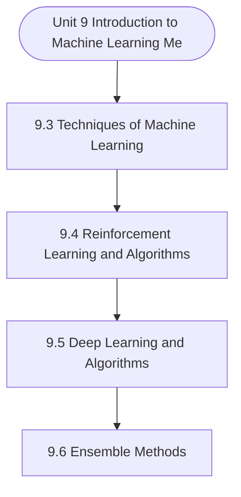

# MCS-224: Artificial Intelligence & Machine Learning
## Unit 9: Introduction to Machine Learning Methods

> 📚 **Programme:** M.Sc. (Data Science and Analytics) | **Semester:** Semester 2  
> ⏱️ **Estimated Study Time:** ~60 mins | 📄 **Textbook Pages:** 30 Pages  
> 📥 **Original PDF:** [Download & View Authentic Textbook](../../../pdfs/Semester_2/MCS-224_Artificial_Intelligence_and_Machine_Learning/Unit-9_Introduction_to_Machine_Learning_Methods.pdf)

---

### 🎯 Executive Concept & Data Science Relevance
In modern data systems and advanced analytics, **Introduction to Machine Learning Methods** forms a vital conceptual pillar. Artificial Intelligence models autonomous decision-making, while Machine Learning extracts predictive statistical patterns from data. From A* pathfinding in logistics to Deep Neural Networks powering Computer Vision and LLMs, AI/ML drives modern automated systems.

> [!NOTE]
> **Why this matters for your career:** Mastering introduction to machine learning methods equips you with the foundational principles required to reason mathematically about high-dimensional datasets, evaluate algorithm performance, and avoid statistical pitfalls in production machine learning pipelines.

### 🗺️ Visual Knowledge Architecture
The following concept map illustrates the structural hierarchy and learning trajectory of this module:



### 📖 Core Definitions & Terminology Cards

> 📌 **A* Search Algorithm**  
> - **Formal Definition:** Best-first graph search evaluating states by $f(n) = g(n) + h(n)$, where $g(n)$ is true cost from start to $n$, and $h(n)$ is heuristic estimate to goal. Guarantees optimal path if $h(n)$ is admissible ( $h(n) \le h^*(n)$ ).  
> - 💡 **Practical Intuition & Analogy:** *Finding the fastest route on GPS navigation without exploring irrelevant directions.*

> 📌 **Entropy and Information Gain**  
> - **Formal Definition:** Entropy $H(S) = -\sum p_i \log_2 p_i$ measures impurity. Information Gain $IG(S, A) = H(S) - \sum \frac{\vert S_v \vert}{\vert S \vert} H(S_v)$ measures reduction in entropy achieved by splitting on feature $A$.  
> - 💡 **Practical Intuition & Analogy:** *The mathematical criterion used by Decision Trees to select the most informative split attribute.*

> 📌 **Support Vector Machine (SVM) Margin**  
> - **Formal Definition:** Linear classifier finding the hyperplane maximizing the geometric margin $\frac{2}{\Vert\mathbf{w}\Vert}$ between classes, subject to $y_i(\mathbf{w}^T \mathbf{x}_i + b) \ge 1$. Non-linear data is separated using Kernel functions $K(\mathbf{x}, \mathbf{z}) = \phi(\mathbf{x})^T \phi(\mathbf{z})$.  
> - 💡 **Practical Intuition & Analogy:** *Finding the widest possible road separating positive and negative data clusters.*

> 📌 **Backpropagation Algorithm**  
> - **Formal Definition:** Iterative parameter optimization in neural networks utilizing the multivariate chain rule to propagate error gradients backwards from the loss function to update synaptic weights: $w_{ij} \leftarrow w_{ij} - \alpha \frac{\partial \mathcal{L}}{\partial w_{ij}}$.  
> - 💡 **Practical Intuition & Analogy:** *Automated blame assignment: adjusting each internal weight proportionally to how much it contributed to prediction error.*

### ⚡ Governing Mathematical Laws & Formula Cheatsheet
#### 🔹 A* Heuristic Evaluation Function
$$
f(n) = g(n) + h(n) \quad \text{Admissibility: } 0 \le h(n) \le h^*(n)
$$
- **Explanation:** If $h(n)$ never overestimates true remaining cost, A* tree search is guaranteed to return the optimal shortest path.

#### 🔹 Shannon Entropy Formula
$$
H(S) = -\sum_{i=1}^c p_i \log_2 p_i \quad \text{Gini Impurity: } 1 - \sum_{i=1}^c p_i^2
$$
- **Explanation:** Measures disorder in classification distributions; equals 0 when all samples belong to one class.

#### 🔹 Gradient Descent Weight Update Rule
$$
\mathbf{w}^{(t+1)} = \mathbf{w}^{(t)} - \alpha \nabla_{\mathbf{w}} \mathcal{L}(\mathbf{w})
$$
- **Explanation:** Stepping parameter vector opposite to the gradient vector scaled by learning rate $\alpha$.

#### 🔹 Neural Network Output Softmax Function
$$
\text{Softmax}(z_i) = \frac{e^{z_i}}{\sum_{j=1}^K e^{z_j}}
$$
- **Explanation:** Normalizes $K$ arbitrary logit outputs into a valid multi-class probability distribution summing to 1.

### ⚖️ Axiomatic Properties & Governing Laws
The mathematical formulations of this module are anchored by foundational algebraic and structural laws:

- **Heuristic Consistency Condition:** $h(n) \le c(n, a, n') + h(n') \implies \text{Monotonic (Guarantees A* optimality on graphs)}$
- **SVM Dual Formulation:** $\max_\alpha \sum \alpha_i - \frac{1}{2}\sum \alpha_i \alpha_j y_i y_j K(\mathbf{x}_i, \mathbf{x}_j)$
- **Universal Approximation Theorem:** A feedforward network with one non-linear hidden layer can approximate any continuous function on compact subsets of $\mathbb{R}^n$.

### 📌 Comprehensive Section-by-Section Study Breakdown
#### `9.3` Techniques of Machine Learning

##### 📘 Theoretical Principles & Pedagogical Exposition
Machine learning uses various algorithms to improve, describe, and predict outcomes by repeated learning from data. It is possible to make models that are more accurate as the algorithms learn from the training data. A machine learning model is what you get when you use data to train your machine learning algorithm.

After it has been trained, a model will give you an output when you give it an input. A predictive model is made, for example, by a predictive algorithm. Then, when you put data into the predictive model, you'll get a prediction based on the data that was used to train the model.

At the moment, analytics models can't be made without machine learning. Machine learning approaches are needed to make prediction models more accurate. Depending on the type and amount of data and the business problem Machine Learning - I being solved, there are different ways to approach the problem.


##### ⚙️ Mathematical & Algorithmic Mechanics
- **Core Mechanism:** Supervised algorithms learn function approximations $f: \mathcal{X} \to \mathcal{Y}$ minimizing empirical loss. Unsupervised clustering minimizes intra-cluster inertia $\sum ||x_i - \mu_k||^2$. The Bias-Variance Tradeoff balances underfitting against overfitting.
- **Boundary Conditions:** Curse of dimensionality in high dimensions, severe class imbalance (requiring SMOTE or class-weighted loss), and poor centroid initialization in K-Means.

##### 📊 Practical Data Science & Production Relevance
- **Production Workflow:** Customer segmentation, churn prediction, recommendation systems, automated fraud scoring, and cross-validated model selection with regularization ($L_1, L_2$).
- **Real-World Pitfall:** Data leakage during preprocessing prior to train-test splits, producing falsely inflated validation scores that fail in production deployment.

> [!TIP]
> **Exam & Technical Interview Insight:** Calculate precision, recall, F1-score, and ROC-AUC; explain the mathematical difference between generative and discriminative models; trace K-Means iterations.

#### `9.4` Reinforcement Learning and Algorithms

##### 📘 Theoretical Principles & Pedagogical Exposition
ALGORITHMS According to what we observed in the previous section, learning can be broken down into three main categories: supervised, unsupervised, and semi- supervised. However, in addition to these two categories, there are also other types of learning, such as reinforcement learning (RL), deep learning (DL), adaptive learning, and so on.

The graph shown below, depicts the various branches and sub-branches of Machine learning, including the various algorithms involved in each sub- branch. Let’s understand them in brief, as the entire coverage of the said Machine Learning techniques is out of the scope of this unit.

We will begin our discussion with Reinforcement learning. Introduction to Machine Learning Methods In Reinforcement Learning (RL), algorithms get a set of instructions and rules and then figure out how to handle a task by trying things out and seeing what works and what doesn't. As a way to help the AI find the best way to solve a problem, decisions are either rewarded or punished.


##### ⚙️ Mathematical & Algorithmic Mechanics
- **Core Mechanism:** Asymptotic bounds evaluate algorithmic scalability as input size $n \to \infty$: upper bound $\mathcal{O}(g(n))$, lower bound $\Omega(g(n))$, and tight bound $\Theta(g(n))$. Recurrences are solved via the Master Theorem: $T(n) = a T(n/b) + f(n)$.
- **Boundary Conditions:** Degenerate input permutations (e.g. sorted inputs triggering $\mathcal{O}(n^2)$ worst-case Quicksort), and recursion call stack memory limits.

##### 📊 Practical Data Science & Production Relevance
- **Production Workflow:** Selecting optimal data structures (hash tables $\mathcal{O}(1)$ vs BSTs $\mathcal{O}(\log n)$), minimizing latency in real-time query engines, and optimizing Big Data batch workloads.
- **Real-World Pitfall:** Ignoring hardware cache locality and constant factors, or inadvertently nesting linear scans within iterative loops yielding hidden $\mathcal{O}(n^2)$ complexity.

> [!TIP]
> **Exam & Technical Interview Insight:** Solve recurrences step-by-step using substitution or Master Theorem; state tight $\mathcal{O}$, $\Omega$, and $\Theta$ bounds for best, average, and worst-case scenarios.

#### `9.5` Deep Learning and Algorithms

##### 📘 Theoretical Principles & Pedagogical Exposition
Deep learning is a type of machine learning that uses artificial neural networks and representation learning. It is also called deep structured learning or differential programming.Deep learning is a way for machines to learn through Introduction to Machine Learning Methods deep neural networks.

It is used a lot to solve practical problems in fields like computer vision (image), natural language processing (text), and automated speech recognition (audio). Machine learning is often thought of as a tool with several algorithms. However, deep learning is actually just a subset of approaches that mostly use neural networks, which are a type of algorithm loosely based on the human brain.

A deep learning model learns to solve classification tasks directly from images, text, or sound. A neural network architecture is commonly used to implement deep learning. The number of layers in a network defines the depth of the network; the more layers, the deeper the network.


##### ⚙️ Mathematical & Algorithmic Mechanics
- **Core Mechanism:** Asymptotic bounds evaluate algorithmic scalability as input size $n \to \infty$: upper bound $\mathcal{O}(g(n))$, lower bound $\Omega(g(n))$, and tight bound $\Theta(g(n))$. Recurrences are solved via the Master Theorem: $T(n) = a T(n/b) + f(n)$.
- **Boundary Conditions:** Degenerate input permutations (e.g. sorted inputs triggering $\mathcal{O}(n^2)$ worst-case Quicksort), and recursion call stack memory limits.

##### 📊 Practical Data Science & Production Relevance
- **Production Workflow:** Selecting optimal data structures (hash tables $\mathcal{O}(1)$ vs BSTs $\mathcal{O}(\log n)$), minimizing latency in real-time query engines, and optimizing Big Data batch workloads.
- **Real-World Pitfall:** Ignoring hardware cache locality and constant factors, or inadvertently nesting linear scans within iterative loops yielding hidden $\mathcal{O}(n^2)$ complexity.

> [!TIP]
> **Exam & Technical Interview Insight:** Solve recurrences step-by-step using substitution or Master Theorem; state tight $\mathcal{O}$, $\Omega$, and $\Theta$ bounds for best, average, and worst-case scenarios.

#### `9.6` Ensemble Methods

##### 📘 Theoretical Principles & Pedagogical Exposition
Ensemble learning is a general meta approach to machine learning that combines predictions from different models to improve predictive performance. Although you can create an apparently infinite number of ensembles for any predictive modelling problem, the subject of ensemble learning is dominated by three methods.

Bagging, stacking, and boosting. They are the three primary classes of ensemble learning methods, and it's essential to understand each one thoroughly. • Bagging Ensemble learning is the process of fitting multiple decision trees to various samples of the same dataset and averaging the results.

• Stacking Ensemble learning is fitting multiple types of models to the same data and then using another model to learn how to combine the predictions in the best way possible. • Boosting Ensemble Learning entails successively adding ensemble members that correct prior model predictions and produce a weighted average of the predictions.


##### ⚙️ Mathematical & Algorithmic Mechanics
- **Core Mechanism:** Supervised algorithms learn function approximations $f: \mathcal{X} \to \mathcal{Y}$ minimizing empirical loss. Unsupervised clustering minimizes intra-cluster inertia $\sum ||x_i - \mu_k||^2$. The Bias-Variance Tradeoff balances underfitting against overfitting.
- **Boundary Conditions:** Curse of dimensionality in high dimensions, severe class imbalance (requiring SMOTE or class-weighted loss), and poor centroid initialization in K-Means.

##### 📊 Practical Data Science & Production Relevance
- **Production Workflow:** Customer segmentation, churn prediction, recommendation systems, automated fraud scoring, and cross-validated model selection with regularization ($L_1, L_2$).
- **Real-World Pitfall:** Data leakage during preprocessing prior to train-test splits, producing falsely inflated validation scores that fail in production deployment.

> [!TIP]
> **Exam & Technical Interview Insight:** Calculate precision, recall, F1-score, and ROC-AUC; explain the mathematical difference between generative and discriminative models; trace K-Means iterations.

### 📐 Step-by-Step Solved Mathematical Examples
To solidify your theoretical understanding, work through these fully solved, step-by-step mathematical problems:

#### 🧮 Example 1: Shannon Entropy and Information Gain Calculation
> **Problem Statement:**  
> A training dataset $S$ has 14 instances: 9 Positive ($+$) and 5 Negative ($-$). An attribute $A$ splits $S$ into $S_1$ (6 $+$, 2 $-$) and $S_2$ (3 $+$, 3 $-$). Compute Entropy $H(S)$ and Information Gain $IG(S, A)$.

**Detailed Step-by-Step Solution:**

1. **Parent Entropy $H(S)$:**

$$
H(S) = -\left(\frac{9}{14} \log_2 \frac{9}{14} + \frac{5}{14} \log_2 \frac{5}{14}\right) \approx 0.940 \text{ bits}
$$


2. **Subset Entropies:**
- For $S_1$ (total 8): $H(S_1) = -\left(\frac{6}{8}\log_2\frac{6}{8} + \frac{2}{8}\log_2\frac{2}{8}\right) = 0.811 \text{ bits}$
- For $S_2$ (total 6): $H(S_2) = -\left(\frac{3}{6}\log_2\frac{3}{6} + \frac{3}{6}\log_2\frac{3}{6}\right) = 1.000 \text{ bits}$

3. **Weighted Child Entropy:**

$$
H(S, A) = \frac{8}{14}(0.811) + \frac{6}{14}(1.000) = 0.463 + 0.429 = 0.892 \text{ bits}
$$


4. **Information Gain:**

$$
IG(S, A) = H(S) - H(S, A) = 0.940 - 0.892 = 0.048 \text{ bits}
$$

(Attribute provides 0.048 bits of entropy reduction).

#### 🧮 Example 2: A* Search Step Evaluation
> **Problem Statement:**  
> In graph navigation, node $N$ has exact path cost from start $g(N) = 14$ and straight-line heuristic to goal $h(N) = 11$. For node $M$, $g(M) = 18, h(M) = 6$. Which node is expanded next by A*?

**Detailed Step-by-Step Solution:**

1. Compute $f(n) = g(n) + h(n)$:
- $f(N) = 14 + 11 = 25$
- $f(M) = 18 + 6 = 24$

2. Decision: A* selects the node with minimal $f(n)$. Since $f(M) = 24 < f(N) = 25$, **Node $M$ is expanded next**.

### 💻 Practical Data Science Implementation (Python)
Theory translates directly into production algorithms. Below is a self-contained, commented Python implementation illustrating the core operations of this unit:

```python
import numpy as np

# Decision Tree Entropy and Information Gain from scratch
def entropy(labels):
    counts = np.bincount(labels)
    probs = counts[counts > 0] / len(labels)
    return -np.sum(probs * np.log2(probs))

def information_gain(parent_labels, left_split, right_split):
    h_parent = entropy(parent_labels)
    n = len(parent_labels)
    h_children = (len(left_split)/n)*entropy(left_split) + (len(right_split)/n)*entropy(right_split)
    return h_parent - h_children

# Sample binary targets: 9 ones, 5 zeros
y_parent = np.array([1]*9 + [0]*5)
y_left = np.array([1]*6 + [0]*2)
y_right = np.array([1]*3 + [0]*3)

ig = information_gain(y_parent, y_left, y_right)
print(f"Parent Entropy: {entropy(y_parent):.4f}")
print(f"Information Gain: {ig:.4f} bits")
```

### 💡 Interactive Self-Assessment Checkpoints
Test your comprehension before proceeding. Tap each question to reveal the comprehensive explanation:

<details>
<summary><b>Checkpoint 1:</b> Q1 How machine learning differs from Artificial intelligence ?    Q2 Briefly discuss the major function or use of Machine learning algorithms. <i>(Tap to reveal answer)</i></summary>

> **Answer & Analysis:**  
> **Detailed Analytical Solution:**
> 
> 1. **Core Principle:** Identify the governing theorem or definition for Introduction to Machine Learning Methods.
> 2. **Step-by-Step Derivation:** Verify all preconditions and compute intermediate steps methodically.
> 3. **Conclusion:** State the final mathematical proof or calculation clearly, validating boundary edge cases.
</details>

<details>
<summary><b>Checkpoint 2:</b> Q3 Discuss the various phases of Machine Learning.     Q4 When should we use machine learning ?     Q5 Compare the concept of Classification, Regression and Clustering? List the algorithms in respective categories. <i>(Tap to reveal answer)</i></summary>

> **Answer & Analysis:**  
> **Detailed Analytical Solution:**
> 
> 1. **Core Principle:** Identify the governing theorem or definition for Introduction to Machine Learning Methods.
> 2. **Step-by-Step Derivation:** Verify all preconditions and compute intermediate steps methodically.
> 3. **Conclusion:** State the final mathematical proof or calculation clearly, validating boundary edge cases.
</details>

<details>
<summary><b>Checkpoint 3:</b> Q6 What is Reinforcement Learning ? List the components involved in it.    Q7 Briefly discuss the various algorithms of Reinforcement Learning. <i>(Tap to reveal answer)</i></summary>

> **Answer & Analysis:**  
> **Detailed Analytical Solution:**
> 
> 1. **Core Principle:** Identify the governing theorem or definition for Introduction to Machine Learning Methods.
> 2. **Step-by-Step Derivation:** Verify all preconditions and compute intermediate steps methodically.
> 3. **Conclusion:** State the final mathematical proof or calculation clearly, validating boundary edge cases.
</details>

<details>
<summary><b>Checkpoint 4:</b> Q8 What is Deep Learning ?How Deep learning relates to AI & ML.     294 Machine Learning - I Q9 Briefly discuss the various algorithms of Reinforcement Learning. <i>(Tap to reveal answer)</i></summary>

> **Answer & Analysis:**  
> **Detailed Analytical Solution:**
> 
> 1. **Core Principle:** Identify the governing theorem or definition for Introduction to Machine Learning Methods.
> 2. **Step-by-Step Derivation:** Verify all preconditions and compute intermediate steps methodically.
> 3. **Conclusion:** State the final mathematical proof or calculation clearly, validating boundary edge cases.
</details>

<details>
<summary><b>Checkpoint 5:</b> What condition must a heuristic $h(n)$ satisfy for A* search to be optimal? <i>(Tap to reveal answer)</i></summary>

> **Answer & Analysis:**  
> The heuristic must be **Admissible**, meaning it never overestimates the actual minimal cost to reach the goal state ( $h(n) \le h^*(n)$ ).
</details>

<details>
<summary><b>Checkpoint 6:</b> What is the formula for Information Gain used in Decision Trees? <i>(Tap to reveal answer)</i></summary>

> **Answer & Analysis:**  
> $IG(S, A) = H(S) - \sum_{v \in \text{Values}(A)} \frac{\vert S_v \vert}{\vert S \vert} H(S_v)$
</details>

### 🎯 Executive Module Wrap-Up
- **Central Idea:** Introduction to Machine Learning Methods provides essential mathematical and algorithmic tools directly utilized in Data Science.
- **Mathematical Rigor:** Formulas and laws must be memorized with attention to boundary conditions and assumptions.
- **Full Textbook Coverage:** For exhaustive multi-page derivations, proofs, and supplementary exercises, consult the [Authentic IGNOU Textbook](../../../pdfs/Semester_2/MCS-224_Artificial_Intelligence_and_Machine_Learning/Unit-9_Introduction_to_Machine_Learning_Methods.pdf).

---
### 🧭 Navigation & Syllabus Index
[⬅ Previous: Unit 8](unit_08_Fuzzy_and_Rough_Set.md) | [📑 Course Index](README.md) | [Next: Unit 10 ➡](unit_10_Classification.md)
