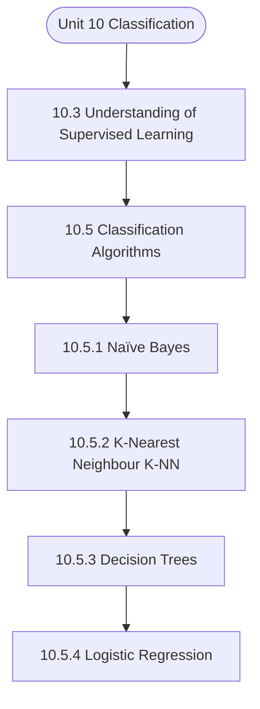

# MCS-224: Artificial Intelligence & Machine Learning
## Unit 10: Classification

> 📚 **Programme:** M.Sc. (Data Science and Analytics) | **Semester:** Semester 2  
> ⏱️ **Estimated Study Time:** ~79 mins | 📄 **Textbook Pages:** 44 Pages  
> 📥 **Original PDF:** [Download & View Authentic Textbook](../../../pdfs/Semester_2/MCS-224_Artificial_Intelligence_and_Machine_Learning/Unit-10_Classification.pdf)

---

### 🎯 Executive Concept & Data Science Relevance
In modern data systems and advanced analytics, **Classification** forms a vital conceptual pillar. Artificial Intelligence models autonomous decision-making, while Machine Learning extracts predictive statistical patterns from data. From A* pathfinding in logistics to Deep Neural Networks powering Computer Vision and LLMs, AI/ML drives modern automated systems.

> [!NOTE]
> **Why this matters for your career:** Mastering classification equips you with the foundational principles required to reason mathematically about high-dimensional datasets, evaluate algorithm performance, and avoid statistical pitfalls in production machine learning pipelines.

### 🗺️ Visual Knowledge Architecture
The following concept map illustrates the structural hierarchy and learning trajectory of this module:



### 📖 Core Definitions & Terminology Cards

> 📌 **A* Search Algorithm**  
> - **Formal Definition:** Best-first graph search evaluating states by $f(n) = g(n) + h(n)$, where $g(n)$ is true cost from start to $n$, and $h(n)$ is heuristic estimate to goal. Guarantees optimal path if $h(n)$ is admissible ( $h(n) \le h^*(n)$ ).  
> - 💡 **Practical Intuition & Analogy:** *Finding the fastest route on GPS navigation without exploring irrelevant directions.*

> 📌 **Entropy and Information Gain**  
> - **Formal Definition:** Entropy $H(S) = -\sum p_i \log_2 p_i$ measures impurity. Information Gain $IG(S, A) = H(S) - \sum \frac{\vert S_v \vert}{\vert S \vert} H(S_v)$ measures reduction in entropy achieved by splitting on feature $A$.  
> - 💡 **Practical Intuition & Analogy:** *The mathematical criterion used by Decision Trees to select the most informative split attribute.*

> 📌 **Support Vector Machine (SVM) Margin**  
> - **Formal Definition:** Linear classifier finding the hyperplane maximizing the geometric margin $\frac{2}{\Vert\mathbf{w}\Vert}$ between classes, subject to $y_i(\mathbf{w}^T \mathbf{x}_i + b) \ge 1$. Non-linear data is separated using Kernel functions $K(\mathbf{x}, \mathbf{z}) = \phi(\mathbf{x})^T \phi(\mathbf{z})$.  
> - 💡 **Practical Intuition & Analogy:** *Finding the widest possible road separating positive and negative data clusters.*

> 📌 **Backpropagation Algorithm**  
> - **Formal Definition:** Iterative parameter optimization in neural networks utilizing the multivariate chain rule to propagate error gradients backwards from the loss function to update synaptic weights: $w_{ij} \leftarrow w_{ij} - \alpha \frac{\partial \mathcal{L}}{\partial w_{ij}}$.  
> - 💡 **Practical Intuition & Analogy:** *Automated blame assignment: adjusting each internal weight proportionally to how much it contributed to prediction error.*

### ⚡ Governing Mathematical Laws & Formula Cheatsheet
#### 🔹 A* Heuristic Evaluation Function
$$
f(n) = g(n) + h(n) \quad \text{Admissibility: } 0 \le h(n) \le h^*(n)
$$
- **Explanation:** If $h(n)$ never overestimates true remaining cost, A* tree search is guaranteed to return the optimal shortest path.

#### 🔹 Shannon Entropy Formula
$$
H(S) = -\sum_{i=1}^c p_i \log_2 p_i \quad \text{Gini Impurity: } 1 - \sum_{i=1}^c p_i^2
$$
- **Explanation:** Measures disorder in classification distributions; equals 0 when all samples belong to one class.

#### 🔹 Gradient Descent Weight Update Rule
$$
\mathbf{w}^{(t+1)} = \mathbf{w}^{(t)} - \alpha \nabla_{\mathbf{w}} \mathcal{L}(\mathbf{w})
$$
- **Explanation:** Stepping parameter vector opposite to the gradient vector scaled by learning rate $\alpha$.

#### 🔹 Neural Network Output Softmax Function
$$
\text{Softmax}(z_i) = \frac{e^{z_i}}{\sum_{j=1}^K e^{z_j}}
$$
- **Explanation:** Normalizes $K$ arbitrary logit outputs into a valid multi-class probability distribution summing to 1.

### ⚖️ Axiomatic Properties & Governing Laws
The mathematical formulations of this module are anchored by foundational algebraic and structural laws:

- **Heuristic Consistency Condition:** $h(n) \le c(n, a, n') + h(n') \implies \text{Monotonic (Guarantees A* optimality on graphs)}$
- **SVM Dual Formulation:** $\max_\alpha \sum \alpha_i - \frac{1}{2}\sum \alpha_i \alpha_j y_i y_j K(\mathbf{x}_i, \mathbf{x}_j)$
- **Universal Approximation Theorem:** A feedforward network with one non-linear hidden layer can approximate any continuous function on compact subsets of $\mathbb{R}^n$.

### 📌 Comprehensive Section-by-Section Study Breakdown
#### `10.3` Understanding of Supervised Learning

##### 📘 Theoretical Principles & Pedagogical Exposition
LEARNING To use machine learning techniques effectively, you need to know how they work. You can't just use them without knowing how they work and expect to get good results. Different techniques work for different kinds of problems, but it's not always clear which techniques will work in a given situation.

You need to know something about the different kinds of solutions. Every workflow for machine learning starts with the following three questions: • What kind of data do you have available to work with? • What kinds of realisations are you hoping to arrive at as a result of it? • In what ways and contexts will those realisations be utilised?

CLASSIFICATION CLUSTERING REGRESSION MACHINE LEARNING Supervised Learning Develop predictive model based on both input and output data Unsupervised Learning Group and interpret data based on input data Machine Learning Techniques Classification Your responses to these questions will assist you in determining whether supervised or unsupervised learning is best for you.


##### ⚙️ Mathematical & Algorithmic Mechanics
- **Core Mechanism:** Supervised algorithms learn function approximations $f: \mathcal{X} \to \mathcal{Y}$ minimizing empirical loss. Unsupervised clustering minimizes intra-cluster inertia $\sum ||x_i - \mu_k||^2$. The Bias-Variance Tradeoff balances underfitting against overfitting.
- **Boundary Conditions:** Curse of dimensionality in high dimensions, severe class imbalance (requiring SMOTE or class-weighted loss), and poor centroid initialization in K-Means.

##### 📊 Practical Data Science & Production Relevance
- **Production Workflow:** Customer segmentation, churn prediction, recommendation systems, automated fraud scoring, and cross-validated model selection with regularization ($L_1, L_2$).
- **Real-World Pitfall:** Data leakage during preprocessing prior to train-test splits, producing falsely inflated validation scores that fail in production deployment.

> [!TIP]
> **Exam & Technical Interview Insight:** Calculate precision, recall, F1-score, and ROC-AUC; explain the mathematical difference between generative and discriminative models; trace K-Means iterations.

#### `10.5` Classification Algorithms

##### 📘 Theoretical Principles & Pedagogical Exposition
The Classification algorithm is a type of Supervised Learning that uses the training data to figure out the category of new observations. This method is used to figure out what kind of thing a new observation is. Classification is the process by which a computer programme learns from a set of data or observations and then sorts new observations into different classes or groups.

"Yes" or "No," "0" or "1," "Spam" or "Not Spam," "Cat or Dog," and so on are all good examples. Classes are the same thing that have different names, like categories, objectives, and labels. In classification, the output variable is not a value but a category, such as "Green or Blue," "Fruit or Animal," etc.

This is different from regression, where the output variable is a value. Since the classification method is a supervised learning method, it needs data that has been labelled in order to work. This means that the implementation of the algorithm includes both the input and the output that go with it.


##### ⚙️ Mathematical & Algorithmic Mechanics
- **Core Mechanism:** Asymptotic bounds evaluate algorithmic scalability as input size $n \to \infty$: upper bound $\mathcal{O}(g(n))$, lower bound $\Omega(g(n))$, and tight bound $\Theta(g(n))$. Recurrences are solved via the Master Theorem: $T(n) = a T(n/b) + f(n)$.
- **Boundary Conditions:** Degenerate input permutations (e.g. sorted inputs triggering $\mathcal{O}(n^2)$ worst-case Quicksort), and recursion call stack memory limits.

##### 📊 Practical Data Science & Production Relevance
- **Production Workflow:** Selecting optimal data structures (hash tables $\mathcal{O}(1)$ vs BSTs $\mathcal{O}(\log n)$), minimizing latency in real-time query engines, and optimizing Big Data batch workloads.
- **Real-World Pitfall:** Ignoring hardware cache locality and constant factors, or inadvertently nesting linear scans within iterative loops yielding hidden $\mathcal{O}(n^2)$ complexity.

> [!TIP]
> **Exam & Technical Interview Insight:** Solve recurrences step-by-step using substitution or Master Theorem; state tight $\mathcal{O}$, $\Omega$, and $\Theta$ bounds for best, average, and worst-case scenarios.

#### `10.5.1` Naïve Bayes

##### 📘 Theoretical Principles & Pedagogical Exposition
This is an example of a statistical classification, which estimates the likelihood that a particular sample belongs to a particular group given the sample in question. The Bayes theorem provides the foundation for it. When used to big databases, the Bayesian classification demonstrates both improved accuracy and increased speed.

In this section, we will talk about the most basic kind of Bayesian categorization. "The effect of a given attribute value on a certain class is unaffected by the values of other attributes, i.e. both are independent," is one of the fundamental underlying assumptions that underpin the native Bayesian classification, which is the simplest form of Bayesian classification.

Class conditional independence is another name for this basic assumption. Let's go into greater depth about the naïve Bayesian classification, shall we? But before we get into it, let's take a moment to define the fundamental theorem that underpins this classification i.e. Bayes Theorem: In order to understand this theorem firstly lets understand the meaning of the following symbols or assumptions, they are as follows : • X is an example of a data set whose class needs to be determined.


##### ⚙️ Mathematical & Algorithmic Mechanics
- **Core Mechanism:** Probability measure satisfying Kolmogorov axioms: $P(S)=1, P(A) \ge 0$, and countable additivity. Bayes' Theorem computes posterior probability: $P(A \mid B) = \frac{P(B \mid A)P(A)}{P(B)}$. Variance measures dispersion: $\text{Var}(X) = \mathbb{E}[X^2] - (\mathbb{E}[X])^2$.
- **Boundary Conditions:** Zero probability conditioning events ($P(B) = 0$), distinguishing mutually exclusive events ($A \cap B = \emptyset$) from independent events ($P(A \cap B) = P(A)P(B)$), and heavy-tailed infinite variance.

##### 📊 Practical Data Science & Production Relevance
- **Production Workflow:** A/B test statistical significance, Naive Bayes spam classifiers, Bayesian hyperparameter optimization, and stochastic risk quantification in financial algorithms.
- **Real-World Pitfall:** Confusing conditional probability $P(A \mid B)$ with $P(B \mid A)$ (the Prosecutor's Fallacy), or falsely assuming independence between correlated feature variables.

> [!TIP]
> **Exam & Technical Interview Insight:** Calculate conditional probabilities using the Law of Total Probability and Bayes' Theorem; calculate expectation $\mathbb{E}[X]$ and variance for discrete and continuous random variables.

#### `10.5.2` K-Nearest Neighbour (K-NN)

##### 📘 Theoretical Principles & Pedagogical Exposition
This approach, places items in the class to which they are “closest” to their neighbour.It must determine distance between an item and a class. Classes are represented by centroid (Central value) and the individual points.One of the algorithms that is used is K-Nearest Neighbors.

We know that The classification task maps data into predefined groups or classes. Given database/dataset D={t1,t2,…,tn} and a set of classes C={C1,… ,Cm}, the classification Problem is to define a mapping f:D→C where each ti is assigned to one class, that is, it divides database/dataset D into classes specified in the Set C.

A few very simple examples to elucidate classification could be: • Teachers classify students’ marks data into a set of grades as A, B, C, D, or F. • Classification of the height of a set of persons into the classes tall, medium or short. The basic approaches to classification are: • To create specific models by, evaluating training data, which is basically the old data, that has already been classified by using the domain of the experts’ knowledge.


##### ⚙️ Mathematical & Algorithmic Mechanics
- **Core Mechanism:** Supervised algorithms learn function approximations $f: \mathcal{X} \to \mathcal{Y}$ minimizing empirical loss. Unsupervised clustering minimizes intra-cluster inertia $\sum ||x_i - \mu_k||^2$. The Bias-Variance Tradeoff balances underfitting against overfitting.
- **Boundary Conditions:** Curse of dimensionality in high dimensions, severe class imbalance (requiring SMOTE or class-weighted loss), and poor centroid initialization in K-Means.

##### 📊 Practical Data Science & Production Relevance
- **Production Workflow:** Customer segmentation, churn prediction, recommendation systems, automated fraud scoring, and cross-validated model selection with regularization ($L_1, L_2$).
- **Real-World Pitfall:** Data leakage during preprocessing prior to train-test splits, producing falsely inflated validation scores that fail in production deployment.

> [!TIP]
> **Exam & Technical Interview Insight:** Calculate precision, recall, F1-score, and ROC-AUC; explain the mathematical difference between generative and discriminative models; trace K-Means iterations.

#### `10.5.3` Decision Trees

##### 📘 Theoretical Principles & Pedagogical Exposition
Given a data set D = {t1,t2 …, tn} where ti=<ti1, …, tih>, that is, each tuple is represented by h attributes, assume that, the database schema contains attributes as {A1, A2, …, Ah}. Also, let us suppose that the classes are C={C1, …., Cm}, then: Decision or Classification Tree is a tree associated with D such that • Each internal node is labeled with attribute, Ai • Each arc is labeled with the predicate which can be applied to the attribute at the parent node.

• Each leaf node is labeled with a class, Cj Basics steps in the Decision Tree are as follows: • Building the tree by using the training set dataset/database. • Applying the tree to the new dataset/database. Decision Tree Induction is the process of learning about the classification using the inductive approach.

During this process, we create a decision tree from the training data. This decision tree can, then be used, for making classifications. To define this we need to define the following. Let us assume that we are given probabilities p1, p2, .., ps whose sum is 1. Let us also define the term Entropy, which is the measure of the amount of randomness or surprise or uncertainty.


##### ⚙️ Mathematical & Algorithmic Mechanics
- **Core Mechanism:** Hierarchical acyclic data structure. Binary Search Trees enforce $\text{left} < \text{root} \le \text{right}$. Self-balancing AVL and Red-Black trees execute pointer rotations to maintain $\mathcal{O}(\log n)$ depth invariants.
- **Boundary Conditions:** Degenerate skewed trees degenerating to $\mathcal{O}(n)$ singly linked lists, empty roots, and deletions of nodes with two children requiring in-order successor replacements.

##### 📊 Practical Data Science & Production Relevance
- **Production Workflow:** B+ tree indexing in SQL relational databases, ensemble decision trees (Random Forest, XGBoost), and Min/Max Heaps in priority queues for top-$k$ recommendation retrieval.
- **Real-World Pitfall:** Unbalanced sequential insertions degrading search times from $\mathcal{O}(\log n)$ to $\mathcal{O}(n)$, or failing to update parent pointers during tree rebalancing.

> [!TIP]
> **Exam & Technical Interview Insight:** Draw step-by-step tree insertion and deletion states; write recursive traversals (Pre-order, In-order, Post-order); illustrate AVL single/double rotations.

#### `10.5.4` Logistic Regression

##### 📘 Theoretical Principles & Pedagogical Exposition
Logistic Regression in Machine Learning • Logistic regression, which is part of the Supervised Learning method, is one of the most popular Machine Learning algorithms. It is used to predict the categorical dependent variable based on a set of independent variables. • Logistic regression predicts the outcome of a dependent variable that has a "yes" or "no" answer.

Because of this, the result must be a discrete or categorical value. It can be Yes or No, 0 or 1, true or false, etc., but instead of giving the exact value as 0 or 1, it gives the probabilistic values that lie between 0 and 1. • Logistic Regression is a lot like Linear Regression, but the way they are used is different.

Linear regression is used to solve regression problems, while logistic regression is used to solve classification problems. • In logistic regression, we fit a "S"-shaped logistic function, which predicts two maximum values, instead of a regression line (0 or 1). • The curve from the logistic function shows how likely something is, like whether the cells are cancerous or not, whether a mouse is overweight or not based on its weight, etc.


##### ⚙️ Mathematical & Algorithmic Mechanics
- **Core Mechanism:** Ordinary Least Squares (OLS) minimizes residual sum of squares: $\min_\beta \sum (y_i - x_i^T \beta)^2$. Normal equation analytical solution: $\hat{\beta} = (X^T X)^{-1} X^T y$. Logistic regression applies sigmoid link $\sigma(z) = \frac{1}{1 + e^{-z}}$ optimizing log-likelihood.
- **Boundary Conditions:** Perfect multicollinearity causing singular non-invertible $X^T X$, heteroscedasticity (non-constant residual variance), and high-leverage outlier leverage points.

##### 📊 Practical Data Science & Production Relevance
- **Production Workflow:** Predictive target forecasting, econometric attribution modeling, risk scoring models, and baseline benchmark modeling in data science pipelines.
- **Real-World Pitfall:** High multicollinearity inflating coefficient standard errors, or fitting linear models without verifying residual normality and homoscedasticity plots.

> [!TIP]
> **Exam & Technical Interview Insight:** Derive OLS normal equations; interpret slope $\beta_1$ and intercept $\beta_0$; calculate $R^2 = 1 - \frac{SS_{\text{res}}}{SS_{\text{tot}}}$ and conduct $F$-tests for overall model significance.

#### `10.5.5` Support Vector Machines

##### 📘 Theoretical Principles & Pedagogical Exposition
Support Vector Machine, also called Support Vector Classification, is a supervised and linear Machine Learning technique that is most often used to solve classification problems. In this section, we will take a look at Support Vector Machines, a new approach for categorising data that has a lot of potential and can be used for both linear and nonlinear datasets.

A support vector machine, often known as an SVM, is a type of algorithm that transforms the primary training data into a new format that has a higher dimension by making use of a nonlinear mapping. It searches for the ideal linear separating hyperplane in this additional dimension.

This hyperplane is referred to as a "decision boundary" since it separates the tuples of one class from those of another. A hyperplane can always be used to split data from two classes if the appropriate nonlinear mapping to a high enough dimension is used. This hyperplane is located by the SVM through the use of support vectors, also known as important training tuples, and margins (defined by the support vectors).


##### ⚙️ Mathematical & Algorithmic Mechanics
- **Core Mechanism:** Linear transformations represented by $A \in \mathbb{R}^{m \times n}$. Matrix invertibility requires non-zero determinant $\det(A) \neq 0$ and full column/row rank. Eigen-decomposition $A v = \lambda v$ identifies invariant directional axes and scaling factors.
- **Boundary Conditions:** Singular matrices (det = 0), ill-conditioned matrices with condition number $\kappa(A) \gg 1$, and rank deficiency under collinear feature dimensions.

##### 📊 Practical Data Science & Production Relevance
- **Production Workflow:** Principal Component Analysis (PCA covariance decomposition), Ordinary Least Squares (OLS) normal equations $(X^T X)^{-1} X^T y$, and embedding projection transformations in transformers.
- **Real-World Pitfall:** Inverting ill-conditioned matrices directly instead of using singular value decomposition (SVD) or QR decomposition, triggering catastrophic floating-point cancellation.

> [!TIP]
> **Exam & Technical Interview Insight:** Practice row reduction to Row Echelon Form (REF) to find matrix rank, determinant expansion by minors, and computing characteristic equations $\det(A - \lambda I) = 0$.

### 📐 Step-by-Step Solved Mathematical Examples
To solidify your theoretical understanding, work through these fully solved, step-by-step mathematical problems:

#### 🧮 Example 1: Shannon Entropy and Information Gain Calculation
> **Problem Statement:**  
> A training dataset $S$ has 14 instances: 9 Positive ($+$) and 5 Negative ($-$). An attribute $A$ splits $S$ into $S_1$ (6 $+$, 2 $-$) and $S_2$ (3 $+$, 3 $-$). Compute Entropy $H(S)$ and Information Gain $IG(S, A)$.

**Detailed Step-by-Step Solution:**

1. **Parent Entropy $H(S)$:**

$$
H(S) = -\left(\frac{9}{14} \log_2 \frac{9}{14} + \frac{5}{14} \log_2 \frac{5}{14}\right) \approx 0.940 \text{ bits}
$$


2. **Subset Entropies:**
- For $S_1$ (total 8): $H(S_1) = -\left(\frac{6}{8}\log_2\frac{6}{8} + \frac{2}{8}\log_2\frac{2}{8}\right) = 0.811 \text{ bits}$
- For $S_2$ (total 6): $H(S_2) = -\left(\frac{3}{6}\log_2\frac{3}{6} + \frac{3}{6}\log_2\frac{3}{6}\right) = 1.000 \text{ bits}$

3. **Weighted Child Entropy:**

$$
H(S, A) = \frac{8}{14}(0.811) + \frac{6}{14}(1.000) = 0.463 + 0.429 = 0.892 \text{ bits}
$$


4. **Information Gain:**

$$
IG(S, A) = H(S) - H(S, A) = 0.940 - 0.892 = 0.048 \text{ bits}
$$

(Attribute provides 0.048 bits of entropy reduction).

#### 🧮 Example 2: A* Search Step Evaluation
> **Problem Statement:**  
> In graph navigation, node $N$ has exact path cost from start $g(N) = 14$ and straight-line heuristic to goal $h(N) = 11$. For node $M$, $g(M) = 18, h(M) = 6$. Which node is expanded next by A*?

**Detailed Step-by-Step Solution:**

1. Compute $f(n) = g(n) + h(n)$:
- $f(N) = 14 + 11 = 25$
- $f(M) = 18 + 6 = 24$

2. Decision: A* selects the node with minimal $f(n)$. Since $f(M) = 24 < f(N) = 25$, **Node $M$ is expanded next**.

### 💻 Practical Data Science Implementation (Python)
Theory translates directly into production algorithms. Below is a self-contained, commented Python implementation illustrating the core operations of this unit:

```python
import numpy as np

# Decision Tree Entropy and Information Gain from scratch
def entropy(labels):
    counts = np.bincount(labels)
    probs = counts[counts > 0] / len(labels)
    return -np.sum(probs * np.log2(probs))

def information_gain(parent_labels, left_split, right_split):
    h_parent = entropy(parent_labels)
    n = len(parent_labels)
    h_children = (len(left_split)/n)*entropy(left_split) + (len(right_split)/n)*entropy(right_split)
    return h_parent - h_children

# Sample binary targets: 9 ones, 5 zeros
y_parent = np.array([1]*9 + [0]*5)
y_left = np.array([1]*6 + [0]*2)
y_right = np.array([1]*3 + [0]*3)

ig = information_gain(y_parent, y_left, y_right)
print(f"Parent Entropy: {entropy(y_parent):.4f}")
print(f"Information Gain: {ig:.4f} bits")
```

### 💡 Interactive Self-Assessment Checkpoints
Test your comprehension before proceeding. Tap each question to reveal the comprehensive explanation:

<details>
<summary><b>Checkpoint 1:</b> Compare between Supervised and Un-Supervised Learning. <i>(Tap to reveal answer)</i></summary>

> **Answer & Analysis:**  
> **Detailed Analytical Solution:**
> 
> 1. **Core Principle:** Identify the governing theorem or definition for Classification.
> 2. **Step-by-Step Derivation:** Verify all preconditions and compute intermediate steps methodically.
> 3. **Conclusion:** State the final mathematical proof or calculation clearly, validating boundary edge cases.
</details>

<details>
<summary><b>Checkpoint 2:</b> List the Steps Involved in Supervised Learning <i>(Tap to reveal answer)</i></summary>

> **Answer & Analysis:**  
> **Detailed Analytical Solution:**
> 
> 1. **Core Principle:** Identify the governing theorem or definition for Classification.
> 2. **Step-by-Step Derivation:** Verify all preconditions and compute intermediate steps methodically.
> 3. **Conclusion:** State the final mathematical proof or calculation clearly, validating boundary edge cases.
</details>

<details>
<summary><b>Checkpoint 3:</b> What are the Common Issues Faced While Using Supervised Learning <i>(Tap to reveal answer)</i></summary>

> **Answer & Analysis:**  
> **Detailed Analytical Solution:**
> 
> 1. **Core Principle:** Identify the governing theorem or definition for Classification.
> 2. **Step-by-Step Derivation:** Verify all preconditions and compute intermediate steps methodically.
> 3. **Conclusion:** State the final mathematical proof or calculation clearly, validating boundary edge cases.
</details>

<details>
<summary><b>Checkpoint 4:</b> Compare between Multi Class and Multi Label Classification <i>(Tap to reveal answer)</i></summary>

> **Answer & Analysis:**  
> **Detailed Analytical Solution:**
> 
> 1. **Core Principle:** Identify the governing theorem or definition for Classification.
> 2. **Step-by-Step Derivation:** Verify all preconditions and compute intermediate steps methodically.
> 3. **Conclusion:** State the final mathematical proof or calculation clearly, validating boundary edge cases.
</details>

<details>
<summary><b>Checkpoint 5:</b> What condition must a heuristic $h(n)$ satisfy for A* search to be optimal? <i>(Tap to reveal answer)</i></summary>

> **Answer & Analysis:**  
> The heuristic must be **Admissible**, meaning it never overestimates the actual minimal cost to reach the goal state ( $h(n) \le h^*(n)$ ).
</details>

<details>
<summary><b>Checkpoint 6:</b> What is the formula for Information Gain used in Decision Trees? <i>(Tap to reveal answer)</i></summary>

> **Answer & Analysis:**  
> $IG(S, A) = H(S) - \sum_{v \in \text{Values}(A)} \frac{\vert S_v \vert}{\vert S \vert} H(S_v)$
</details>

### 🎯 Executive Module Wrap-Up
- **Central Idea:** Classification provides essential mathematical and algorithmic tools directly utilized in Data Science.
- **Mathematical Rigor:** Formulas and laws must be memorized with attention to boundary conditions and assumptions.
- **Full Textbook Coverage:** For exhaustive multi-page derivations, proofs, and supplementary exercises, consult the [Authentic IGNOU Textbook](../../../pdfs/Semester_2/MCS-224_Artificial_Intelligence_and_Machine_Learning/Unit-10_Classification.pdf).

---
### 🧭 Navigation & Syllabus Index
[⬅ Previous: Unit 9](unit_09_Introduction_to_Machine_Learning_Methods.md) | [📑 Course Index](README.md) | [Next: Unit 11 ➡](unit_11_Regression.md)
