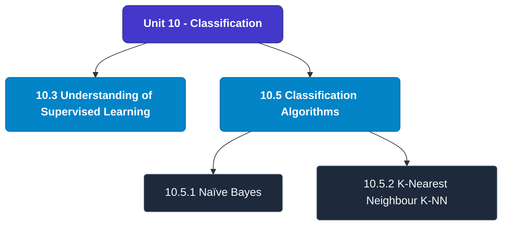

# MCS-224: Artificial Intelligence & Machine Learning
## Unit 10: Classification

> 📚 **Programme:** M.Sc. (Data Science and Analytics) | **Semester:** Semester 2  
> ⏱️ **Estimated Study Time:** ~79 mins | 📄 **Textbook Pages:** 44 Pages  
> 📥 **Original PDF:** [Download & View Textbook](../../../pdfs/Semester_2/MCS-224_Artificial_Intelligence_and_Machine_Learning/Unit-10_Classification.pdf)

---

### 🎯 Executive Concept & Data Science Relevance
In modern data systems, **Classification** forms a vital conceptual pillar. Artificial Intelligence models autonomous decision-making, while Machine Learning extracts predictive statistical patterns from data. From A* pathfinding in logistics to Deep Neural Networks powering Computer Vision and LLMs, AI/ML drives modern automated systems.

> [!NOTE]
> **Why this matters for your career:** Mastering classification equips you with the foundational principles required to reason mathematically about high-dimensional datasets, evaluate algorithm performance, and avoid statistical pitfalls in production machine learning pipelines.

### 🗺️ Visual Knowledge Architecture
The following concept map illustrates the structural hierarchy and learning trajectory of this module:

### 📖 Core Definitions & Terminology Cards
| Term | Formal Mathematical / Technical Definition | Intuitive Analogy / Concrete Example |
| :--- | :--- | :--- |
| **A* Search Algorithm** | Best-first graph search evaluating states by $f(n) = g(n) + h(n)$, where $g(n)$ is true cost from start to $n$, and $h(n)$ is heuristic estimate to goal. Guarantees optimal path if $h(n)$ is admissible ($h(n) \le h^*(n)$). | *Finding the fastest route on GPS navigation without exploring irrelevant directions.* |
| **Entropy and Information Gain** | Entropy $H(S) = -\sum p_i \log_2 p_i$ measures impurity. Information Gain $IG(S, A) = H(S) - \sum \frac{\|S_v\|}{\|S\|} H(S_v)$ measures reduction in entropy achieved by splitting on feature $A$. | *The mathematical criterion used by Decision Trees to select the most informative split attribute.* |
| **Support Vector Machine (SVM) Margin** | Linear classifier finding the hyperplane maximizing the geometric margin $\frac{2}{\\|\mathbf{w}\\|}$ between classes, subject to $y_i(\mathbf{w}^T \mathbf{x}_i + b) \ge 1$. Non-linear data is separated using Kernel functions $K(\mathbf{x}, \mathbf{z}) = \phi(\mathbf{x})^T \phi(\mathbf{z})$. | *Finding the widest possible road separating positive and negative data clusters.* |
| **Backpropagation Algorithm** | Iterative parameter optimization in neural networks utilizing the multivariate chain rule to propagate error gradients backwards from the loss function to update synaptic weights: $w_{ij} \leftarrow w_{ij} - \alpha \frac{\partial \mathcal{L}}{\partial w_{ij}}$. | *Automated blame assignment: adjusting each internal weight proportionally to how much it contributed to prediction error.* |

### ⚡ Governing Mathematical Laws & Formula Cheatsheet
#### 🔹 A* Heuristic Evaluation Function
$$f(n) = g(n) + h(n) \quad \text{Admissibility: } 0 \le h(n) \le h^*(n)$$
- **Explanation:** If $h(n)$ never overestimates true remaining cost, A* tree search is guaranteed to return the optimal shortest path.

#### 🔹 Shannon Entropy Formula
$$H(S) = -\sum_{i=1}^c p_i \log_2 p_i \quad \text{Gini Impurity: } 1 - \sum_{i=1}^c p_i^2$$
- **Explanation:** Measures disorder in classification distributions; equals 0 when all samples belong to one class.

#### 🔹 Gradient Descent Weight Update Rule
$$\mathbf{w}^{(t+1)} = \mathbf{w}^{(t)} - \alpha \nabla_{\mathbf{w}} \mathcal{L}(\mathbf{w})$$
- **Explanation:** Stepping parameter vector opposite to the gradient vector scaled by learning rate $\alpha$.

#### 🔹 Neural Network Output Softmax Function
$$\text{Softmax}(z_i) = \frac{e^{z_i}}{\sum_{j=1}^K e^{z_j}}$$
- **Explanation:** Normalizes $K$ arbitrary logit outputs into a valid multi-class probability distribution summing to 1.

### 📌 Detailed Section-by-Section Study Breakdown
#### `10.3` Understanding of Supervised Learning
- **Core Concept:** To use machine learning techniques effectively, you need to know how they work.
- **Core Concept:** You can't just use them without knowing how they work and expect to get good results.
- **Core Concept:** Different techniques work for different kinds of problems, but it's not always clear which techniques will work in a given situation.
- **Data Science Application:** Provides foundational structures used directly in statistical modeling, query execution, and machine learning pipelines.

> [!TIP]
> **Exam & Interview Tip:** Be prepared to state the formal definition of understanding of supervised learning and derive its primary equations step-by-step.

#### `10.5` Classification Algorithms
- **Core Concept:** Classification is the process by which a computer programme learns from a set of data or observations and then sorts new observations into different classes or groups.
- **Core Concept:** "Yes" or "No," "0" or "1," "Spam" or "Not Spam," "Cat or Dog," and so on are all good examples.
- **Core Concept:** Classes are the same thing that have different names, like categories, objectives, and labels.
- **Data Science Application:** Provides foundational structures used directly in statistical modeling, query execution, and machine learning pipelines.

> [!TIP]
> **Exam & Interview Tip:** Be prepared to state the formal definition of classification algorithms and derive its primary equations step-by-step.

#### `10.5.1` Naïve Bayes
- **Core Concept:** This is an example of a statistical classification, which estimates the likelihood that a particular sample belongs to a particular group given the sample in question.
- **Core Concept:** The Bayes theorem provides the foundation for it.
- **Core Concept:** When used to big databases, the Bayesian classification demonstrates both improved accuracy and increased speed.
- **Data Science Application:** Provides foundational structures used directly in statistical modeling, query execution, and machine learning pipelines.

> [!TIP]
> **Exam & Interview Tip:** Be prepared to state the formal definition of naïve bayes and derive its primary equations step-by-step.

#### `10.5.2` K-Nearest Neighbour (K-NN)
- **Core Concept:** This approach, places items in the class to which they are “closest” to their neighbour.It must determine distance between an item and a class.
- **Core Concept:** Classes are represented by centroid (Central value) and the individual points.One of the algorithms that is used is K-Nearest Neighbors.
- **Core Concept:** We know that The classification task maps data into predefined groups or classes.
- **Data Science Application:** Provides foundational structures used directly in statistical modeling, query execution, and machine learning pipelines.

> [!TIP]
> **Exam & Interview Tip:** Be prepared to state the formal definition of k-nearest neighbour (k-nn) and derive its primary equations step-by-step.

#### `10.5.3` Decision Trees
- **Core Concept:** Given a data set D = {t1,t2 …, tn} where ti=<ti1, …, tih>, that is, each tuple is represented by h attributes, assume that, the database schema contains attributes as {A1, A2, …, Ah}.
- **Core Concept:** • Each leaf node is labeled with a class, Cj Basics steps in the Decision Tree are as follows: • Building the tree by using the training set dataset/database.
- **Core Concept:** • Applying the tree to the new dataset/database.
- **Data Science Application:** Provides foundational structures used directly in statistical modeling, query execution, and machine learning pipelines.

> [!TIP]
> **Exam & Interview Tip:** Be prepared to state the formal definition of decision trees and derive its primary equations step-by-step.

#### `10.5.4` Logistic Regression
- **Core Concept:** Logistic Regression in Machine Learning • Logistic regression, which is part of the Supervised Learning method, is one of the most popular Machine Learning algorithms.
- **Core Concept:** It is used to predict the categorical dependent variable based on a set of independent variables.
- **Core Concept:** • Logistic regression predicts the outcome of a dependent variable that has a "yes" or "no" answer.
- **Data Science Application:** Provides foundational structures used directly in statistical modeling, query execution, and machine learning pipelines.

> [!TIP]
> **Exam & Interview Tip:** Be prepared to state the formal definition of logistic regression and derive its primary equations step-by-step.

### 💡 Interactive Self-Assessment Checkpoints
Test your comprehension before proceeding. Tap each question to reveal the comprehensive explanation:

<b>Checkpoint 1:</b> What condition must a heuristic $h(n)$ satisfy for A* search to be optimal? <i>(Tap to reveal answer)</i>

> **Answer & Analysis:**  
> The heuristic must be **Admissible**, meaning it never overestimates the actual minimal cost to reach the goal state ($h(n) \le h^*(n)$).

<b>Checkpoint 2:</b> What is the formula for Information Gain used in Decision Trees? <i>(Tap to reveal answer)</i>

> **Answer & Analysis:**  
> $$IG(S, A) = H(S) - \sum_{v \in \text{Values}(A)} \frac{|S_v|}{|S|} H(S_v)$$

<b>Checkpoint 3:</b> Why is the Softmax function used in multi-class classification neural networks? <i>(Tap to reveal answer)</i>

> **Answer & Analysis:**  
> It converts unconstrained real numbers (logits) into a valid probability distribution where each value is in $[0, 1]$ and all values sum strictly to $1$.

<b>Checkpoint 4:</b> Compare between Supervised and Un-Supervised Learning. <i>(Tap to reveal answer)</i>

> **Answer & Analysis:**  
> This question tests your conceptual mastery of Classification. Review the governing formulas and section breakdowns above to formulate a complete, rigorous proof or derivation.

<b>Checkpoint 5:</b> List the Steps Involved in Supervised Learning <i>(Tap to reveal answer)</i>

> **Answer & Analysis:**  
> This question tests your conceptual mastery of Classification. Review the governing formulas and section breakdowns above to formulate a complete, rigorous proof or derivation.

<b>Checkpoint 6:</b> What are the Common Issues Faced While Using Supervised Learning <i>(Tap to reveal answer)</i>

> **Answer & Analysis:**  
> This question tests your conceptual mastery of Classification. Review the governing formulas and section breakdowns above to formulate a complete, rigorous proof or derivation.

### 🎯 Executive Module Wrap-Up
- **Central Idea:** Classification provides essential mathematical and algorithmic tools directly utilized in Data Science.
- **Mathematical Rigor:** Formulas and laws must be memorized with attention to boundary conditions and assumptions.
- **Full Textbook Coverage:** For exhaustive multi-page derivations, proofs, and supplementary exercises, consult the [Authentic IGNOU Textbook](../../../pdfs/Semester_2/MCS-224_Artificial_Intelligence_and_Machine_Learning/Unit-10_Classification.pdf).

---
### 🧭 Navigation & Syllabus Index
[⬅ Previous: Unit 9](unit_09_Introduction_to_Machine_Learning_Methods.md) | [📑 Course Index](README.md) | [Next: Unit 11 ➡](unit_11_Regression.md)
