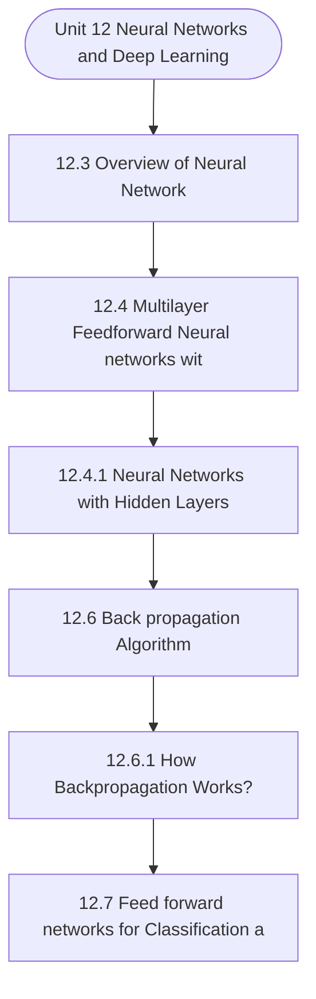

# MCS-224: Artificial Intelligence & Machine Learning
## Unit 12: Neural Networks and Deep Learning

> 📚 **Programme:** M.Sc. (Data Science and Analytics) | **Semester:** Semester 2  
> ⏱️ **Estimated Study Time:** ~45 mins | 📄 **Textbook Pages:** 26 Pages  
> 📥 **Original PDF:** [Download & View Authentic Textbook](../../../pdfs/Semester_2/MCS-224_Artificial_Intelligence_and_Machine_Learning/Unit-12_Neural_Networks_and_Deep_Learning.pdf)

---

### 🎯 Executive Concept & Data Science Relevance
In modern data systems and advanced analytics, **Neural Networks and Deep Learning** forms a vital conceptual pillar. Artificial Intelligence models autonomous decision-making, while Machine Learning extracts predictive statistical patterns from data. From A* pathfinding in logistics to Deep Neural Networks powering Computer Vision and LLMs, AI/ML drives modern automated systems.

> [!NOTE]
> **Why this matters for your career:** Mastering neural networks and deep learning equips you with the foundational principles required to reason mathematically about high-dimensional datasets, evaluate algorithm performance, and avoid statistical pitfalls in production machine learning pipelines.

### 🗺️ Visual Knowledge Architecture
The following concept map illustrates the structural hierarchy and learning trajectory of this module:



### 📖 Core Definitions & Terminology Cards

> 📌 **A* Search Algorithm**  
> - **Formal Definition:** Best-first graph search evaluating states by $f(n) = g(n) + h(n)$, where $g(n)$ is true cost from start to $n$, and $h(n)$ is heuristic estimate to goal. Guarantees optimal path if $h(n)$ is admissible ( $h(n) \le h^*(n)$ ).  
> - 💡 **Practical Intuition & Analogy:** *Finding the fastest route on GPS navigation without exploring irrelevant directions.*

> 📌 **Entropy and Information Gain**  
> - **Formal Definition:** Entropy $H(S) = -\sum p_i \log_2 p_i$ measures impurity. Information Gain $IG(S, A) = H(S) - \sum \frac{\vert S_v \vert}{\vert S \vert} H(S_v)$ measures reduction in entropy achieved by splitting on feature $A$.  
> - 💡 **Practical Intuition & Analogy:** *The mathematical criterion used by Decision Trees to select the most informative split attribute.*

> 📌 **Support Vector Machine (SVM) Margin**  
> - **Formal Definition:** Linear classifier finding the hyperplane maximizing the geometric margin $\frac{2}{\Vert\mathbf{w}\Vert}$ between classes, subject to $y_i(\mathbf{w}^T \mathbf{x}_i + b) \ge 1$. Non-linear data is separated using Kernel functions $K(\mathbf{x}, \mathbf{z}) = \phi(\mathbf{x})^T \phi(\mathbf{z})$.  
> - 💡 **Practical Intuition & Analogy:** *Finding the widest possible road separating positive and negative data clusters.*

> 📌 **Backpropagation Algorithm**  
> - **Formal Definition:** Iterative parameter optimization in neural networks utilizing the multivariate chain rule to propagate error gradients backwards from the loss function to update synaptic weights: $w_{ij} \leftarrow w_{ij} - \alpha \frac{\partial \mathcal{L}}{\partial w_{ij}}$.  
> - 💡 **Practical Intuition & Analogy:** *Automated blame assignment: adjusting each internal weight proportionally to how much it contributed to prediction error.*

### ⚡ Governing Mathematical Laws & Formula Cheatsheet
#### 🔹 A* Heuristic Evaluation Function
$$
f(n) = g(n) + h(n) \quad \text{Admissibility: } 0 \le h(n) \le h^*(n)
$$
- **Explanation:** If $h(n)$ never overestimates true remaining cost, A* tree search is guaranteed to return the optimal shortest path.

#### 🔹 Shannon Entropy Formula
$$
H(S) = -\sum_{i=1}^c p_i \log_2 p_i \quad \text{Gini Impurity: } 1 - \sum_{i=1}^c p_i^2
$$
- **Explanation:** Measures disorder in classification distributions; equals 0 when all samples belong to one class.

#### 🔹 Gradient Descent Weight Update Rule
$$
\mathbf{w}^{(t+1)} = \mathbf{w}^{(t)} - \alpha \nabla_{\mathbf{w}} \mathcal{L}(\mathbf{w})
$$
- **Explanation:** Stepping parameter vector opposite to the gradient vector scaled by learning rate $\alpha$.

#### 🔹 Neural Network Output Softmax Function
$$
\text{Softmax}(z_i) = \frac{e^{z_i}}{\sum_{j=1}^K e^{z_j}}
$$
- **Explanation:** Normalizes $K$ arbitrary logit outputs into a valid multi-class probability distribution summing to 1.

### ⚖️ Axiomatic Properties & Governing Laws
The mathematical formulations of this module are anchored by foundational algebraic and structural laws:

- **Heuristic Consistency Condition:** $h(n) \le c(n, a, n') + h(n') \implies \text{Monotonic (Guarantees A* optimality on graphs)}$
- **SVM Dual Formulation:** $\max_\alpha \sum \alpha_i - \frac{1}{2}\sum \alpha_i \alpha_j y_i y_j K(\mathbf{x}_i, \mathbf{x}_j)$
- **Universal Approximation Theorem:** A feedforward network with one non-linear hidden layer can approximate any continuous function on compact subsets of $\mathbb{R}^n$.

### 📌 Comprehensive Section-by-Section Study Breakdown
#### `12.3` Overview of Neural Network

##### 📘 Theoretical Principles & Pedagogical Exposition
In artificial intelligence and machine learning, **Overview of Neural Network** defines the computational mechanisms that allow autonomous systems to reason, plan, or generalize from training data. In **Neural Networks and Deep Learning**, this concept balances model expressiveness against overfitting risks through explicit loss formulation and optimization.

Whether navigating combinatorial search spaces or minimizing empirical risk across high-dimensional parameter tensors, understanding overview of neural network guarantees reproducible model convergence.

##### ⚙️ Mathematical & Algorithmic Mechanics
- **Core Mechanism:** Neural networks compose non-linear parametric transformations: $h^{(l)} = \sigma(W^{(l)} h^{(l-1)} + b^{(l)})$. Backpropagation utilizes the multivariable chain rule to propagate error gradients $\frac{\partial \mathcal{L}}{\partial W}$ backwards to update weights via gradient descent.
- **Boundary Conditions:** Vanishing/exploding gradients in deep networks, dying ReLU neurons caused by negative biases, and non-convex loss landscapes with local saddles.

##### 📊 Practical Data Science & Production Relevance
- **Production Workflow:** Computer vision architectures (CNNs), natural language modeling (Transformers), speech recognition, and GPU-accelerated PyTorch/TensorFlow distributed inference.
- **Real-World Pitfall:** Training deep models without learning rate warmup or normalization layers (BatchNorm, LayerNorm), causing gradient explosion or stalled convergence.

> [!TIP]
> **Exam & Technical Interview Insight:** Derive weight updates for a single artificial neuron; explain the role of non-linear activation functions; compute forward pass activations and backward error deltas.

#### `12.4` Multilayer Feedforward Neural networks with Sigmoid activation

##### 📘 Theoretical Principles & Pedagogical Exposition
NETWORKS WITH SIGMOID ACTIVATION FUNCTIONS A multilayer feed forward neural network consists of the interconnection of various layers, named input, hidden layer, and output layer. The number of hidden layers is not fixed. It depends upon the requirements and complexity of the problem.

The simple neural network is one with a single input layer and an output layer is known as perceptrons. A Perceptron accepts inputs, moderates them with certain weight values, then applies the transformation function to output the final result. The word perceptron is used here because every connection has a certain weight, and through these connections, one layer is connected to the next layer.

The model's working is defined as follows: All inputs usually are multiplied by the weight, and this weighted sum is calculated. After it, this sum is applied to the activation function, and it is the output of an individual layer. This output becomes the input to the next layer.


##### ⚙️ Mathematical & Algorithmic Mechanics
- **Core Mechanism:** Neural networks compose non-linear parametric transformations: $h^{(l)} = \sigma(W^{(l)} h^{(l-1)} + b^{(l)})$. Backpropagation utilizes the multivariable chain rule to propagate error gradients $\frac{\partial \mathcal{L}}{\partial W}$ backwards to update weights via gradient descent.
- **Boundary Conditions:** Vanishing/exploding gradients in deep networks, dying ReLU neurons caused by negative biases, and non-convex loss landscapes with local saddles.

##### 📊 Practical Data Science & Production Relevance
- **Production Workflow:** Computer vision architectures (CNNs), natural language modeling (Transformers), speech recognition, and GPU-accelerated PyTorch/TensorFlow distributed inference.
- **Real-World Pitfall:** Training deep models without learning rate warmup or normalization layers (BatchNorm, LayerNorm), causing gradient explosion or stalled convergence.

> [!TIP]
> **Exam & Technical Interview Insight:** Derive weight updates for a single artificial neuron; explain the role of non-linear activation functions; compute forward pass activations and backward error deltas.

#### `12.4.1` Neural Networks with Hidden Layers

##### 📘 Theoretical Principles & Pedagogical Exposition
Figure 3 describes the hidden layers of a neural network by adding more neurons in between the input and output layers. There may be a single hidden layer or multiple hidden layers. Figure 3: Neural network with a hidden layer Data/ input is labeled in the input layer using x valuewith 1, 2, 3, …, m as the subscript, while neurons in the hidden layer are labeled as h with subscripts 1, 2, 3, …, n...

this n and m may be different as the hidden layer neurons, and the input neurons may have different values. Also, as several hidden layers may be multiple, the first hidden layer has superscript 1, while the second hidden layer has superscript 2, and so on. Output is labeled as y with a hat i.e.,y ̂.

The input data/ features with m dimension represented as (x1, x2, …, xm). You may say that a feature is nothing, but it is only a dependent variable that significantly influences a specific outcome/ dependent variable. Now, we multiply m features (x1, x2, …, xm) with (w1, w2, …, wm) as a weight matrix, and then the sum is computed by adding these multiplicative terms.


##### ⚙️ Mathematical & Algorithmic Mechanics
- **Core Mechanism:** Neural networks compose non-linear parametric transformations: $h^{(l)} = \sigma(W^{(l)} h^{(l-1)} + b^{(l)})$. Backpropagation utilizes the multivariable chain rule to propagate error gradients $\frac{\partial \mathcal{L}}{\partial W}$ backwards to update weights via gradient descent.
- **Boundary Conditions:** Vanishing/exploding gradients in deep networks, dying ReLU neurons caused by negative biases, and non-convex loss landscapes with local saddles.

##### 📊 Practical Data Science & Production Relevance
- **Production Workflow:** Computer vision architectures (CNNs), natural language modeling (Transformers), speech recognition, and GPU-accelerated PyTorch/TensorFlow distributed inference.
- **Real-World Pitfall:** Training deep models without learning rate warmup or normalization layers (BatchNorm, LayerNorm), causing gradient explosion or stalled convergence.

> [!TIP]
> **Exam & Technical Interview Insight:** Derive weight updates for a single artificial neuron; explain the role of non-linear activation functions; compute forward pass activations and backward error deltas.

#### `12.6` Back propagation Algorithm:

##### 📘 Theoretical Principles & Pedagogical Exposition
The Backpropagation algorithm is a supervised learning algorithm for training the neural network model. This algorithm was first introduced in the 1960s, it was not popular, and in 1989 it gets popularized by Rumelhart, Hinton, and Williams, who have used this concept in a paper titled "Learning representations by back-propagating errors." It is one of the most fundamental building blocks of any neural network., if you have multiple layers in the neural network.

Then it is used to adjust the weight in the backward direction. When designing a neural network, we initially need to initialize the weights and biases with some random values. We initially gave some random values for weight and bias, but our model, through the backpropagation algorithm, will adjust these values and get the output if the difference between our actual output and predicted output is a large, more significant error.

This algorithm trains the neural network model based on chain rule method. In simple terms, you can say that after every forward pass through a network, the backpropagation algorithm works to perform a backward pass to adjust the weights and biased parameters of the model. It repeatedly adjusts the weights and biases of all the edges among all the layers so that Error i.e., the difference between predicted output and real output, should be minimum.


##### ⚙️ Mathematical & Algorithmic Mechanics
- **Core Mechanism:** Asymptotic bounds evaluate algorithmic scalability as input size $n \to \infty$: upper bound $\mathcal{O}(g(n))$, lower bound $\Omega(g(n))$, and tight bound $\Theta(g(n))$. Recurrences are solved via the Master Theorem: $T(n) = a T(n/b) + f(n)$.
- **Boundary Conditions:** Degenerate input permutations (e.g. sorted inputs triggering $\mathcal{O}(n^2)$ worst-case Quicksort), and recursion call stack memory limits.

##### 📊 Practical Data Science & Production Relevance
- **Production Workflow:** Selecting optimal data structures (hash tables $\mathcal{O}(1)$ vs BSTs $\mathcal{O}(\log n)$), minimizing latency in real-time query engines, and optimizing Big Data batch workloads.
- **Real-World Pitfall:** Ignoring hardware cache locality and constant factors, or inadvertently nesting linear scans within iterative loops yielding hidden $\mathcal{O}(n^2)$ complexity.

> [!TIP]
> **Exam & Technical Interview Insight:** Solve recurrences step-by-step using substitution or Master Theorem; state tight $\mathcal{O}$, $\Omega$, and $\Theta$ bounds for best, average, and worst-case scenarios.

#### `12.6.1` How Backpropagation Works?

##### 📘 Theoretical Principles & Pedagogical Exposition
Now you may consider below Neural Network for a better understanding: Figure 12: Neural Network Example This network contains: 1. Three input layers 2. Two layersof hidden neurons 3. Two neurons at the output layer. i1 h1 o1 i2 h2 o2 j I .05 .10 .15w1 .4w5 .20w2 .45w6 .3w4 .5w7 .99 .01 b1.35 b2.60 .55w8 .25w3 Neural Networks and Deep Learning The following steps are used in the Backpropagation: Step1: We need to use forward propagation Step 2: After that, we have to follow backward propagation Step 3: We put all the values to calculate the updated weight Step 1: We use forward propagation We start the working with forwarding propagation 1Output net 0


##### ⚙️ Mathematical & Algorithmic Mechanics
- **Core Mechanism:** Neural networks compose non-linear parametric transformations: $h^{(l)} = \sigma(W^{(l)} h^{(l-1)} + b^{(l)})$. Backpropagation utilizes the multivariable chain rule to propagate error gradients $\frac{\partial \mathcal{L}}{\partial W}$ backwards to update weights via gradient descent.
- **Boundary Conditions:** Vanishing/exploding gradients in deep networks, dying ReLU neurons caused by negative biases, and non-convex loss landscapes with local saddles.

##### 📊 Practical Data Science & Production Relevance
- **Production Workflow:** Computer vision architectures (CNNs), natural language modeling (Transformers), speech recognition, and GPU-accelerated PyTorch/TensorFlow distributed inference.
- **Real-World Pitfall:** Training deep models without learning rate warmup or normalization layers (BatchNorm, LayerNorm), causing gradient explosion or stalled convergence.

> [!TIP]
> **Exam & Technical Interview Insight:** Derive weight updates for a single artificial neuron; explain the role of non-linear activation functions; compute forward pass activations and backward error deltas.

#### `12.7` Feed forward networks for Classification and Regression

##### 📘 Theoretical Principles & Pedagogical Exposition
CLASSIFICATION AND REGRESSION Feed forward neural network is used for various problems, including classification , regression, and pattern encoding. In the first case, the web returns a value called z=f(w,x), which is very close to the target value y. While in the second case, the target becomes the input itself v(x,y,f(w,x)).To deal with multi-classification, we can use either of the techniques.

Figure 13: Multi-classification The above-mentioned left-hand side network is a modular architecture. Here, every class connects with three distinct hidden neurons. While mentioned right- hand side network defines a fully connected network, which is used for a richer classification process.

The left-side network is advantageous as it is modular and supports the classifiers' gradual construction. Whenever we feel to add a new class, the fully connected network requires further training, while the modular network only involves training for a new module. The same issue also holds for regression.


##### ⚙️ Mathematical & Algorithmic Mechanics
- **Core Mechanism:** Ordinary Least Squares (OLS) minimizes residual sum of squares: $\min_\beta \sum (y_i - x_i^T \beta)^2$. Normal equation analytical solution: $\hat{\beta} = (X^T X)^{-1} X^T y$. Logistic regression applies sigmoid link $\sigma(z) = \frac{1}{1 + e^{-z}}$ optimizing log-likelihood.
- **Boundary Conditions:** Perfect multicollinearity causing singular non-invertible $X^T X$, heteroscedasticity (non-constant residual variance), and high-leverage outlier leverage points.

##### 📊 Practical Data Science & Production Relevance
- **Production Workflow:** Predictive target forecasting, econometric attribution modeling, risk scoring models, and baseline benchmark modeling in data science pipelines.
- **Real-World Pitfall:** High multicollinearity inflating coefficient standard errors, or fitting linear models without verifying residual normality and homoscedasticity plots.

> [!TIP]
> **Exam & Technical Interview Insight:** Derive OLS normal equations; interpret slope $\beta_1$ and intercept $\beta_0$; calculate $R^2 = 1 - \frac{SS_{\text{res}}}{SS_{\text{tot}}}$ and conduct $F$-tests for overall model significance.

#### `12.8` Deep Learning

##### 📘 Theoretical Principles & Pedagogical Exposition
Deep learning is a subset of artificial intelligence, commonly called AI, that tells us the workings of the human brain to process data and patterns defining for decision making. Deep learning has capable of learning unsupervised from unstructured data or unlabeled data. Deep learning is further classified as an AI function that is used to simulate the workings of the human brain in processing data to detect objects, recognize speech, translate languages, and make decisions.


##### ⚙️ Mathematical & Algorithmic Mechanics
- **Core Mechanism:** Neural networks compose non-linear parametric transformations: $h^{(l)} = \sigma(W^{(l)} h^{(l-1)} + b^{(l)})$. Backpropagation utilizes the multivariable chain rule to propagate error gradients $\frac{\partial \mathcal{L}}{\partial W}$ backwards to update weights via gradient descent.
- **Boundary Conditions:** Vanishing/exploding gradients in deep networks, dying ReLU neurons caused by negative biases, and non-convex loss landscapes with local saddles.

##### 📊 Practical Data Science & Production Relevance
- **Production Workflow:** Computer vision architectures (CNNs), natural language modeling (Transformers), speech recognition, and GPU-accelerated PyTorch/TensorFlow distributed inference.
- **Real-World Pitfall:** Training deep models without learning rate warmup or normalization layers (BatchNorm, LayerNorm), causing gradient explosion or stalled convergence.

> [!TIP]
> **Exam & Technical Interview Insight:** Derive weight updates for a single artificial neuron; explain the role of non-linear activation functions; compute forward pass activations and backward error deltas.

#### `12.8.1` How Deep Learning Works

##### 📘 Theoretical Principles & Pedagogical Exposition
Initially, there was a limitation of computing resources, and the concept of deep learning was not so popular. Once these resources were available, deep learning took the attention of the researchers. Deep Learning can handle all forms of data from all world regions. This data is available in massive amounts, termed big data, and is taken from various sources, including social media, search engines, different e-platforms, and others multimedia sources.

Big data is accessible through multiple fintech applications such as cloud computing. However, this data is so vast and primarily considered unstructured that it could take decades or centuries for humans to understand or find meaningful decisions. As mentioned earlier, the deep learning model's work is similar to the multilayer perceptron models.

We have various models, such as convolution neural network (CNN) and long short term Model (LSTM). The exact working of CNN and LSTM is out of scope, but you can refer to the working of multilayer perception to understand the working of the deep learning model.


##### ⚙️ Mathematical & Algorithmic Mechanics
- **Core Mechanism:** Neural networks compose non-linear parametric transformations: $h^{(l)} = \sigma(W^{(l)} h^{(l-1)} + b^{(l)})$. Backpropagation utilizes the multivariable chain rule to propagate error gradients $\frac{\partial \mathcal{L}}{\partial W}$ backwards to update weights via gradient descent.
- **Boundary Conditions:** Vanishing/exploding gradients in deep networks, dying ReLU neurons caused by negative biases, and non-convex loss landscapes with local saddles.

##### 📊 Practical Data Science & Production Relevance
- **Production Workflow:** Computer vision architectures (CNNs), natural language modeling (Transformers), speech recognition, and GPU-accelerated PyTorch/TensorFlow distributed inference.
- **Real-World Pitfall:** Training deep models without learning rate warmup or normalization layers (BatchNorm, LayerNorm), causing gradient explosion or stalled convergence.

> [!TIP]
> **Exam & Technical Interview Insight:** Derive weight updates for a single artificial neuron; explain the role of non-linear activation functions; compute forward pass activations and backward error deltas.

### 📐 Step-by-Step Solved Mathematical Examples
To solidify your theoretical understanding, work through these fully solved, step-by-step mathematical problems:

#### 🧮 Example 1: Shannon Entropy and Information Gain Calculation
> **Problem Statement:**  
> A training dataset $S$ has 14 instances: 9 Positive ($+$) and 5 Negative ($-$). An attribute $A$ splits $S$ into $S_1$ (6 $+$, 2 $-$) and $S_2$ (3 $+$, 3 $-$). Compute Entropy $H(S)$ and Information Gain $IG(S, A)$.

**Detailed Step-by-Step Solution:**

1. **Parent Entropy $H(S)$:**

$$
H(S) = -\left(\frac{9}{14} \log_2 \frac{9}{14} + \frac{5}{14} \log_2 \frac{5}{14}\right) \approx 0.940 \text{ bits}
$$


2. **Subset Entropies:**
- For $S_1$ (total 8): $H(S_1) = -\left(\frac{6}{8}\log_2\frac{6}{8} + \frac{2}{8}\log_2\frac{2}{8}\right) = 0.811 \text{ bits}$
- For $S_2$ (total 6): $H(S_2) = -\left(\frac{3}{6}\log_2\frac{3}{6} + \frac{3}{6}\log_2\frac{3}{6}\right) = 1.000 \text{ bits}$

3. **Weighted Child Entropy:**

$$
H(S, A) = \frac{8}{14}(0.811) + \frac{6}{14}(1.000) = 0.463 + 0.429 = 0.892 \text{ bits}
$$


4. **Information Gain:**

$$
IG(S, A) = H(S) - H(S, A) = 0.940 - 0.892 = 0.048 \text{ bits}
$$

(Attribute provides 0.048 bits of entropy reduction).

#### 🧮 Example 2: A* Search Step Evaluation
> **Problem Statement:**  
> In graph navigation, node $N$ has exact path cost from start $g(N) = 14$ and straight-line heuristic to goal $h(N) = 11$. For node $M$, $g(M) = 18, h(M) = 6$. Which node is expanded next by A*?

**Detailed Step-by-Step Solution:**

1. Compute $f(n) = g(n) + h(n)$:
- $f(N) = 14 + 11 = 25$
- $f(M) = 18 + 6 = 24$

2. Decision: A* selects the node with minimal $f(n)$. Since $f(M) = 24 < f(N) = 25$, **Node $M$ is expanded next**.

### 💻 Practical Data Science Implementation (Python)
Theory translates directly into production algorithms. Below is a self-contained, commented Python implementation illustrating the core operations of this unit:

```python
import numpy as np

# Decision Tree Entropy and Information Gain from scratch
def entropy(labels):
    counts = np.bincount(labels)
    probs = counts[counts > 0] / len(labels)
    return -np.sum(probs * np.log2(probs))

def information_gain(parent_labels, left_split, right_split):
    h_parent = entropy(parent_labels)
    n = len(parent_labels)
    h_children = (len(left_split)/n)*entropy(left_split) + (len(right_split)/n)*entropy(right_split)
    return h_parent - h_children

# Sample binary targets: 9 ones, 5 zeros
y_parent = np.array([1]*9 + [0]*5)
y_left = np.array([1]*6 + [0]*2)
y_right = np.array([1]*3 + [0]*3)

ig = information_gain(y_parent, y_left, y_right)
print(f"Parent Entropy: {entropy(y_parent):.4f}")
print(f"Information Gain: {ig:.4f} bits")
```

### 💡 Interactive Self-Assessment Checkpoints
Test your comprehension before proceeding. Tap each question to reveal the comprehensive explanation:

<details>
<summary><b>Checkpoint 1:</b> Question -1: Below is a diagram if a single artificial neuron (unit): Figure A-1: Single unit with three inputs. The node has three inputs x = (x1, x2) that receive only binary signals (either 0 or 1). How many different input patterns this node can receive? <i>(Tap to reveal answer)</i></summary>

> **Answer & Analysis:**  
> **Detailed Analytical Solution:**
> 
> 1. **Core Principle:** Identify the governing theorem or definition for Neural Networks and Deep Learning.
> 2. **Step-by-Step Derivation:** Verify all preconditions and compute intermediate steps methodically.
> 3. **Conclusion:** State the final mathematical proof or calculation clearly, validating boundary edge cases.
</details>

<details>
<summary><b>Checkpoint 2:</b> Discuss the utility of Sigmoid function in neural networks. Compare Sigmoid function with the Binary Step function. <i>(Tap to reveal answer)</i></summary>

> **Answer & Analysis:**  
> **Detailed Analytical Solution:**
> 
> 1. **Core Principle:** Identify the governing theorem or definition for Neural Networks and Deep Learning.
> 2. **Step-by-Step Derivation:** Verify all preconditions and compute intermediate steps methodically.
> 3. **Conclusion:** State the final mathematical proof or calculation clearly, validating boundary edge cases.
</details>

<details>
<summary><b>Checkpoint 3:</b> Write Back Propagation algorithm, and showcase its execution on a neural network of your choice (make suitable assumptions if any)    5 5 Etotal Etotal out net o1 = <i>(Tap to reveal answer)</i></summary>

> **Answer & Analysis:**  
> **Detailed Analytical Solution:**
> 
> 1. **Core Principle:** Identify the governing theorem or definition for Neural Networks and Deep Learning.
> 2. **Step-by-Step Derivation:** Verify all preconditions and compute intermediate steps methodically.
> 3. **Conclusion:** State the final mathematical proof or calculation clearly, validating boundary edge cases.
</details>

<details>
<summary><b>Checkpoint 4:</b> can only receive binary values (either 0 or 1). Calculate the output of the network (y5 and y6) for each of the input patterns: Pattern : P1 P2 P3 P4 Node 1 : 0 1 0 1 Node 2 : 0 0 1 1    386 Machine Learning - I <i>(Tap to reveal answer)</i></summary>

> **Answer & Analysis:**  
> **Detailed Analytical Solution:**
> 
> 1. **Core Principle:** Identify the governing theorem or definition for Neural Networks and Deep Learning.
> 2. **Step-by-Step Derivation:** Verify all preconditions and compute intermediate steps methodically.
> 3. **Conclusion:** State the final mathematical proof or calculation clearly, validating boundary edge cases.
</details>

<details>
<summary><b>Checkpoint 5:</b> What condition must a heuristic $h(n)$ satisfy for A* search to be optimal? <i>(Tap to reveal answer)</i></summary>

> **Answer & Analysis:**  
> The heuristic must be **Admissible**, meaning it never overestimates the actual minimal cost to reach the goal state ( $h(n) \le h^*(n)$ ).
</details>

<details>
<summary><b>Checkpoint 6:</b> What is the formula for Information Gain used in Decision Trees? <i>(Tap to reveal answer)</i></summary>

> **Answer & Analysis:**  
> $IG(S, A) = H(S) - \sum_{v \in \text{Values}(A)} \frac{\vert S_v \vert}{\vert S \vert} H(S_v)$
</details>

### 🎯 Executive Module Wrap-Up
- **Central Idea:** Neural Networks and Deep Learning provides essential mathematical and algorithmic tools directly utilized in Data Science.
- **Mathematical Rigor:** Formulas and laws must be memorized with attention to boundary conditions and assumptions.
- **Full Textbook Coverage:** For exhaustive multi-page derivations, proofs, and supplementary exercises, consult the [Authentic IGNOU Textbook](../../../pdfs/Semester_2/MCS-224_Artificial_Intelligence_and_Machine_Learning/Unit-12_Neural_Networks_and_Deep_Learning.pdf).

---
### 🧭 Navigation & Syllabus Index
[⬅ Previous: Unit 11](unit_11_Regression.md) | [📑 Course Index](README.md) | [Next: Unit 13 ➡](unit_13_Feature_selection_and_Extraction.md)
