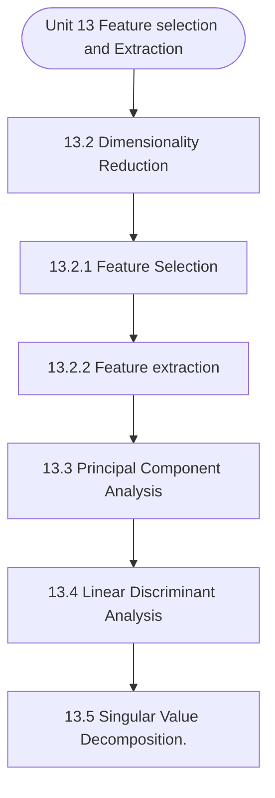

# MCS-224: Artificial Intelligence & Machine Learning
## Unit 13: Feature selection and Extraction

> 📚 **Programme:** M.Sc. (Data Science and Analytics) | **Semester:** Semester 2  
> ⏱️ **Estimated Study Time:** ~47 mins | 📄 **Textbook Pages:** 24 Pages  
> 📥 **Original PDF:** [Download & View Authentic Textbook](../../../pdfs/Semester_2/MCS-224_Artificial_Intelligence_and_Machine_Learning/Unit-13_Feature_selection_and_Extraction.pdf)

---

### 🎯 Executive Concept & Data Science Relevance
In modern data systems and advanced analytics, **Feature selection and Extraction** forms a vital conceptual pillar. Artificial Intelligence models autonomous decision-making, while Machine Learning extracts predictive statistical patterns from data. From A* pathfinding in logistics to Deep Neural Networks powering Computer Vision and LLMs, AI/ML drives modern automated systems.

> [!NOTE]
> **Why this matters for your career:** Mastering feature selection and extraction equips you with the foundational principles required to reason mathematically about high-dimensional datasets, evaluate algorithm performance, and avoid statistical pitfalls in production machine learning pipelines.

### 🗺️ Visual Knowledge Architecture
The following concept map illustrates the structural hierarchy and learning trajectory of this module:



### 📖 Core Definitions & Terminology Cards

> 📌 **A* Search Algorithm**  
> - **Formal Definition:** Best-first graph search evaluating states by $f(n) = g(n) + h(n)$, where $g(n)$ is true cost from start to $n$, and $h(n)$ is heuristic estimate to goal. Guarantees optimal path if $h(n)$ is admissible ( $h(n) \le h^*(n)$ ).  
> - 💡 **Practical Intuition & Analogy:** *Finding the fastest route on GPS navigation without exploring irrelevant directions.*

> 📌 **Entropy and Information Gain**  
> - **Formal Definition:** Entropy $H(S) = -\sum p_i \log_2 p_i$ measures impurity. Information Gain $IG(S, A) = H(S) - \sum \frac{\vert S_v \vert}{\vert S \vert} H(S_v)$ measures reduction in entropy achieved by splitting on feature $A$.  
> - 💡 **Practical Intuition & Analogy:** *The mathematical criterion used by Decision Trees to select the most informative split attribute.*

> 📌 **Support Vector Machine (SVM) Margin**  
> - **Formal Definition:** Linear classifier finding the hyperplane maximizing the geometric margin $\frac{2}{\Vert\mathbf{w}\Vert}$ between classes, subject to $y_i(\mathbf{w}^T \mathbf{x}_i + b) \ge 1$. Non-linear data is separated using Kernel functions $K(\mathbf{x}, \mathbf{z}) = \phi(\mathbf{x})^T \phi(\mathbf{z})$.  
> - 💡 **Practical Intuition & Analogy:** *Finding the widest possible road separating positive and negative data clusters.*

> 📌 **Backpropagation Algorithm**  
> - **Formal Definition:** Iterative parameter optimization in neural networks utilizing the multivariate chain rule to propagate error gradients backwards from the loss function to update synaptic weights: $w_{ij} \leftarrow w_{ij} - \alpha \frac{\partial \mathcal{L}}{\partial w_{ij}}$.  
> - 💡 **Practical Intuition & Analogy:** *Automated blame assignment: adjusting each internal weight proportionally to how much it contributed to prediction error.*

### ⚡ Governing Mathematical Laws & Formula Cheatsheet
#### 🔹 A* Heuristic Evaluation Function
$$
f(n) = g(n) + h(n) \quad \text{Admissibility: } 0 \le h(n) \le h^*(n)
$$
- **Explanation:** If $h(n)$ never overestimates true remaining cost, A* tree search is guaranteed to return the optimal shortest path.

#### 🔹 Shannon Entropy Formula
$$
H(S) = -\sum_{i=1}^c p_i \log_2 p_i \quad \text{Gini Impurity: } 1 - \sum_{i=1}^c p_i^2
$$
- **Explanation:** Measures disorder in classification distributions; equals 0 when all samples belong to one class.

#### 🔹 Gradient Descent Weight Update Rule
$$
\mathbf{w}^{(t+1)} = \mathbf{w}^{(t)} - \alpha \nabla_{\mathbf{w}} \mathcal{L}(\mathbf{w})
$$
- **Explanation:** Stepping parameter vector opposite to the gradient vector scaled by learning rate $\alpha$.

#### 🔹 Neural Network Output Softmax Function
$$
\text{Softmax}(z_i) = \frac{e^{z_i}}{\sum_{j=1}^K e^{z_j}}
$$
- **Explanation:** Normalizes $K$ arbitrary logit outputs into a valid multi-class probability distribution summing to 1.

### ⚖️ Axiomatic Properties & Governing Laws
The mathematical formulations of this module are anchored by foundational algebraic and structural laws:

- **Heuristic Consistency Condition:** $h(n) \le c(n, a, n') + h(n') \implies \text{Monotonic (Guarantees A* optimality on graphs)}$
- **SVM Dual Formulation:** $\max_\alpha \sum \alpha_i - \frac{1}{2}\sum \alpha_i \alpha_j y_i y_j K(\mathbf{x}_i, \mathbf{x}_j)$
- **Universal Approximation Theorem:** A feedforward network with one non-linear hidden layer can approximate any continuous function on compact subsets of $\mathbb{R}^n$.

### 📌 Comprehensive Section-by-Section Study Breakdown
#### `13.2` Dimensionality Reduction

##### 📘 Theoretical Principles & Pedagogical Exposition
The Data mining and Machine Learning methodologies both have processing challenges when working with big amounts of data (many attributes). In point of fact, the dimensions of the feature space utilised by the approach, often referred to as the model attributes, play the most important function.

Processing algorithms grow more difficult and time-consuming to implement as the dimensionality of the processing space increases. These elements, also known as the model attributes, are the fundamental qualities, and they can either be variables or features. When there are more features, it is more difficult to see them all, and as a result, the work on the training set becomes more complex as well.

This complexity was further increased when a significant number of characteristics were linked; hence, the classification became irrelevant as a result. In circumstances like these, the strategies for decreasing the number of dimensions can prove to be highly beneficial. In a nutshell, "the process of making a set of major variables from a huge number of random variables is what is referred to as dimension reduction." When conducting data mining, the step of dimension reduction can be helpful as a preprocessing step to lessen the negative effects of noise, correlation, and excessive dimensionality.


##### ⚙️ Mathematical & Algorithmic Mechanics
- **Core Mechanism:** Establishes analytical principles and computational workflows for feature selection and extraction.
- **Boundary Conditions:** Missing data values, extreme outliers, and non-standard data types.

##### 📊 Practical Data Science & Production Relevance
- **Production Workflow:** End-to-end data science processing stacks (Pandas, Scikit-learn, PyTorch).
- **Real-World Pitfall:** Failing to validate inputs before feeding data into production analytics pipelines.

> [!TIP]
> **Exam & Technical Interview Insight:** Define key concepts in dimensionality reduction and articulate practical applications in real-world scenarios.

#### `13.2.1` Feature Selection

##### 📘 Theoretical Principles & Pedagogical Exposition
It is the process of selecting some attributes from a given collection of prospective features, and then discarding the rest of the attributes that were considered. The use of feature selection can be done for one of two reasons: either to get a limited number of characteristics in order to prevent overfitting or to avoid having features that are redundant or irrelevant.

For data scientists, the ability to pick features is a vital asset. It is essential to the success of the machine learning algorithm that you have a solid understanding of how to choose the most relevant features to analyse. Features that are irrelevant, redundant, or noisy can contaminate an algorithm, which can have a detrimental impact on the learning performance, accuracy, and computing cost.

The importance of feature selection is only going to increase as the size and complexity of the typical dataset continues to balloon at an exponential rate. Feature Selection Methods: Feature selection methods can be divided into two categories: supervised, which are appropriate for use with labelled data, and unsupervised, which are appropriate for use with unlabeled data.


##### ⚙️ Mathematical & Algorithmic Mechanics
- **Core Mechanism:** Establishes analytical principles and computational workflows for feature selection and extraction.
- **Boundary Conditions:** Missing data values, extreme outliers, and non-standard data types.

##### 📊 Practical Data Science & Production Relevance
- **Production Workflow:** End-to-end data science processing stacks (Pandas, Scikit-learn, PyTorch).
- **Real-World Pitfall:** Failing to validate inputs before feeding data into production analytics pipelines.

> [!TIP]
> **Exam & Technical Interview Insight:** Define key concepts in feature selection and articulate practical applications in real-world scenarios.

#### `13.2.2` Feature extraction

##### 📘 Theoretical Principles & Pedagogical Exposition
The process of reducing the amount of resources needed to describe a large amount of data is called "feature extraction." One of the main problems with doing complicated data analysis is that there are a lot of variables to keep track of. A large number of variables requires a lot of memory and processing power, and it can also cause a classification algorithm to overfit to training examples and fail to generalise to new samples.

Feature extraction is a broad term for different ways to combine variables to get around these problems while still giving a true picture of the data. Many people who work with machine learning think that extracting features in the best way possible is the key to making good models.

The data's information must be shown by the features in a way that fits the needs of the algorithm that will be used to solve the problem. Some "inherent" features can be taken straight from the raw data, but most of the time, we need to use these "inherent" features to find "relevant" features that we can use to solve the problem.


##### ⚙️ Mathematical & Algorithmic Mechanics
- **Core Mechanism:** Establishes analytical principles and computational workflows for feature selection and extraction.
- **Boundary Conditions:** Missing data values, extreme outliers, and non-standard data types.

##### 📊 Practical Data Science & Production Relevance
- **Production Workflow:** End-to-end data science processing stacks (Pandas, Scikit-learn, PyTorch).
- **Real-World Pitfall:** Failing to validate inputs before feeding data into production analytics pipelines.

> [!TIP]
> **Exam & Technical Interview Insight:** Define key concepts in feature extraction and articulate practical applications in real-world scenarios.

#### `13.3` Principal Component Analysis

##### 📘 Theoretical Principles & Pedagogical Exposition
Karl Pearson was the first person to come up with this plan. It is based on the idea that when data from a higher-dimensional space is put into a lower-dimensional space, the lower-dimensional space should have the most variation. In simple terms, principal component analysis (PCA) is a way to get important variables (in the form of components) from a large set of variables in a data set.

It tends to find the direction in which the data is most spread out. PCA is more useful when you have data with three or more dimensions. When applying the PCA method, the following are the primary steps that should be followed: 1. Obtain the dataset you need. Calculate the mean of the vectors ().

Deduct the mean of the given data from the total. Complete the computation for the covariance matrix. Determine the eigenvectors and eigenvalues of the matrix that represents the covariance matrix. Creating a feature vector and deciding which components would be the major ones i.e.


##### ⚙️ Mathematical & Algorithmic Mechanics
- **Core Mechanism:** Establishes analytical principles and computational workflows for feature selection and extraction.
- **Boundary Conditions:** Missing data values, extreme outliers, and non-standard data types.

##### 📊 Practical Data Science & Production Relevance
- **Production Workflow:** End-to-end data science processing stacks (Pandas, Scikit-learn, PyTorch).
- **Real-World Pitfall:** Failing to validate inputs before feeding data into production analytics pipelines.

> [!TIP]
> **Exam & Technical Interview Insight:** Define key concepts in principal component analysis and articulate practical applications in real-world scenarios.

#### `13.4` Linear Discriminant Analysis

##### 📘 Theoretical Principles & Pedagogical Exposition
In most cases, the application of logistic regression has been restricted to problems involving two classes of subjects. On the other hand, the Linear Discriminant Analysis is the linear classification method that is recommended to use when there are more than two classes. The algorithm for linear classification known as logistic regression is known for being both straightforward and robust.

On the other hand, there are a few restrictions or faults in the system that highlight the requirement for more complex linear classification algorithms. The following is a list of some of the problems: • Binary class Problems. Concerns regarding the binary class is that the Logistic regression is utilised for issues that involve binary classification or two classes.

It is possible to enhance it such that it can manage multiple- class categorization, but in practise, this is not very common. • Unstable, but with well-defined classes. When the classes are extremely distinct from one another, logistic regression may become unstable. • It is prone to instability when there are only a few occurrences.


##### ⚙️ Mathematical & Algorithmic Mechanics
- **Core Mechanism:** Linear transformations represented by $A \in \mathbb{R}^{m \times n}$. Matrix invertibility requires non-zero determinant $\det(A) \neq 0$ and full column/row rank. Eigen-decomposition $A v = \lambda v$ identifies invariant directional axes and scaling factors.
- **Boundary Conditions:** Singular matrices (det = 0), ill-conditioned matrices with condition number $\kappa(A) \gg 1$, and rank deficiency under collinear feature dimensions.

##### 📊 Practical Data Science & Production Relevance
- **Production Workflow:** Principal Component Analysis (PCA covariance decomposition), Ordinary Least Squares (OLS) normal equations $(X^T X)^{-1} X^T y$, and embedding projection transformations in transformers.
- **Real-World Pitfall:** Inverting ill-conditioned matrices directly instead of using singular value decomposition (SVD) or QR decomposition, triggering catastrophic floating-point cancellation.

> [!TIP]
> **Exam & Technical Interview Insight:** Practice row reduction to Row Echelon Form (REF) to find matrix rank, determinant expansion by minors, and computing characteristic equations $\det(A - \lambda I) = 0$.

#### `13.5` Singular Value Decomposition.

##### 📘 Theoretical Principles & Pedagogical Exposition
The Singular Value Decomposition (SVD) method is a well-known technique for decomposing a matrix into a large number of component matrices. This method is valuable since it reveals many of the interesting and helpful characteristics of the initial matrix. We can use SVD to discover the optimal lower-rank approximation to the matrix, determine the rank of the matrix, or test a linear system's sensitivity to numerical error.

Singular value decomposition is a method of decomposing a matrix into three smaller matrices. A = U∑VT Where: • A : is an m × n matrix • U : is an m × n orthogonal matrix • S : is an n × n diagonal matrix • V : is an n × n orthogonal matrix Below is a practice problems based on single value decomposition Problem-03.

Find the SVD of the matrix A = 1 1 0 1 1 1         −   Solution : Let U ∑ VT be the Singular Value Decomposition (SVD) of the Matrix A, so need to compute V, ∑ and U, the steps are as follows Step 1 : To find the SVD of A , we need to determine matrix V then we will find VT In order to find matrix V firstly we need to Find AT A Then we are required to find the Eigen values (⋋) of AT A The procedure of finding the Eigen values (⋋) of AT A is as follows: Let ⋋2 + S1⋋ + S2 = 0 be the characteristic equation of AT A, Where, S1 = Trace of AT A = Tr(AT A ) = (2+3) = 5 Note : Trace implies the sum of diagonal elements And S2 = Determinant of AT A = 2 0 0 3 = 6 T 1 1 1 0 -1 2 0 A A = x 0 1 = 1 1 1 0 3 -1 1                       Machine Learning - II Hence by substituting the values of S1 & S2 in the characteristic equation of AT A i.e.


##### ⚙️ Mathematical & Algorithmic Mechanics
- **Core Mechanism:** Establishes analytical principles and computational workflows for feature selection and extraction.
- **Boundary Conditions:** Missing data values, extreme outliers, and non-standard data types.

##### 📊 Practical Data Science & Production Relevance
- **Production Workflow:** End-to-end data science processing stacks (Pandas, Scikit-learn, PyTorch).
- **Real-World Pitfall:** Failing to validate inputs before feeding data into production analytics pipelines.

> [!TIP]
> **Exam & Technical Interview Insight:** Define key concepts in singular value decomposition. and articulate practical applications in real-world scenarios.

### 📐 Step-by-Step Solved Mathematical Examples
To solidify your theoretical understanding, work through these fully solved, step-by-step mathematical problems:

#### 🧮 Example 1: Shannon Entropy and Information Gain Calculation
> **Problem Statement:**  
> A training dataset $S$ has 14 instances: 9 Positive ($+$) and 5 Negative ($-$). An attribute $A$ splits $S$ into $S_1$ (6 $+$, 2 $-$) and $S_2$ (3 $+$, 3 $-$). Compute Entropy $H(S)$ and Information Gain $IG(S, A)$.

**Detailed Step-by-Step Solution:**

1. **Parent Entropy $H(S)$:**

$$
H(S) = -\left(\frac{9}{14} \log_2 \frac{9}{14} + \frac{5}{14} \log_2 \frac{5}{14}\right) \approx 0.940 \text{ bits}
$$


2. **Subset Entropies:**
- For $S_1$ (total 8): $H(S_1) = -\left(\frac{6}{8}\log_2\frac{6}{8} + \frac{2}{8}\log_2\frac{2}{8}\right) = 0.811 \text{ bits}$
- For $S_2$ (total 6): $H(S_2) = -\left(\frac{3}{6}\log_2\frac{3}{6} + \frac{3}{6}\log_2\frac{3}{6}\right) = 1.000 \text{ bits}$

3. **Weighted Child Entropy:**

$$
H(S, A) = \frac{8}{14}(0.811) + \frac{6}{14}(1.000) = 0.463 + 0.429 = 0.892 \text{ bits}
$$


4. **Information Gain:**

$$
IG(S, A) = H(S) - H(S, A) = 0.940 - 0.892 = 0.048 \text{ bits}
$$

(Attribute provides 0.048 bits of entropy reduction).

#### 🧮 Example 2: A* Search Step Evaluation
> **Problem Statement:**  
> In graph navigation, node $N$ has exact path cost from start $g(N) = 14$ and straight-line heuristic to goal $h(N) = 11$. For node $M$, $g(M) = 18, h(M) = 6$. Which node is expanded next by A*?

**Detailed Step-by-Step Solution:**

1. Compute $f(n) = g(n) + h(n)$:
- $f(N) = 14 + 11 = 25$
- $f(M) = 18 + 6 = 24$

2. Decision: A* selects the node with minimal $f(n)$. Since $f(M) = 24 < f(N) = 25$, **Node $M$ is expanded next**.

### 💻 Practical Data Science Implementation (Python)
Theory translates directly into production algorithms. Below is a self-contained, commented Python implementation illustrating the core operations of this unit:

```python
import numpy as np

# Decision Tree Entropy and Information Gain from scratch
def entropy(labels):
    counts = np.bincount(labels)
    probs = counts[counts > 0] / len(labels)
    return -np.sum(probs * np.log2(probs))

def information_gain(parent_labels, left_split, right_split):
    h_parent = entropy(parent_labels)
    n = len(parent_labels)
    h_children = (len(left_split)/n)*entropy(left_split) + (len(right_split)/n)*entropy(right_split)
    return h_parent - h_children

# Sample binary targets: 9 ones, 5 zeros
y_parent = np.array([1]*9 + [0]*5)
y_left = np.array([1]*6 + [0]*2)
y_right = np.array([1]*3 + [0]*3)

ig = information_gain(y_parent, y_left, y_right)
print(f"Parent Entropy: {entropy(y_parent):.4f}")
print(f"Information Gain: {ig:.4f} bits")
```

### 💡 Interactive Self-Assessment Checkpoints
Test your comprehension before proceeding. Tap each question to reveal the comprehensive explanation:

<details>
<summary><b>Checkpoint 1:</b> Qn1. Define the term feature selection. Qn2. What is the purpose of feature extraction in machine learning? Qn3. Expand the following terms : PCA,LDA,GDA Qn4. Name components of dimensionality reduction. <i>(Tap to reveal answer)</i></summary>

> **Answer & Analysis:**  
> **Detailed Analytical Solution:**
> 
> 1. **Core Principle:** Identify the governing theorem or definition for Feature selection and Extraction.
> 2. **Step-by-Step Derivation:** Verify all preconditions and compute intermediate steps methodically.
> 3. **Conclusion:** State the final mathematical proof or calculation clearly, validating boundary edge cases.
</details>

<details>
<summary><b>Checkpoint 2:</b> Qn1. What are the advantages of dimensionality reduction? Qn2. What are the disadvantages of dimensionality reduction? <i>(Tap to reveal answer)</i></summary>

> **Answer & Analysis:**  
> **Detailed Analytical Solution:**
> 
> 1. **Core Principle:** Identify the governing theorem or definition for Feature selection and Extraction.
> 2. **Step-by-Step Derivation:** Verify all preconditions and compute intermediate steps methodically.
> 3. **Conclusion:** State the final mathematical proof or calculation clearly, validating boundary edge cases.
</details>

<details>
<summary><b>Checkpoint 3:</b> Write any two limitations of LDA.    [ ] T 1 1 w 1 2 2 V <i>(Tap to reveal answer)</i></summary>

> **Answer & Analysis:**  
> **Detailed Analytical Solution:**
> 
> 1. **Core Principle:** Identify the governing theorem or definition for Feature selection and Extraction.
> 2. **Step-by-Step Derivation:** Verify all preconditions and compute intermediate steps methodically.
> 3. **Conclusion:** State the final mathematical proof or calculation clearly, validating boundary edge cases.
</details>

<details>
<summary><b>Checkpoint 4:</b> What condition must a heuristic $h(n)$ satisfy for A* search to be optimal? <i>(Tap to reveal answer)</i></summary>

> **Answer & Analysis:**  
> The heuristic must be **Admissible**, meaning it never overestimates the actual minimal cost to reach the goal state ( $h(n) \le h^*(n)$ ).
</details>

<details>
<summary><b>Checkpoint 5:</b> What is the formula for Information Gain used in Decision Trees? <i>(Tap to reveal answer)</i></summary>

> **Answer & Analysis:**  
> $IG(S, A) = H(S) - \sum_{v \in \text{Values}(A)} \frac{\vert S_v \vert}{\vert S \vert} H(S_v)$
</details>

<details>
<summary><b>Checkpoint 6:</b> Why is the Softmax function used in multi-class classification neural networks? <i>(Tap to reveal answer)</i></summary>

> **Answer & Analysis:**  
> It converts unconstrained real numbers (logits) into a valid probability distribution where each value is in $[0, 1]$ and all values sum strictly to 1.
</details>

### 🎯 Executive Module Wrap-Up
- **Central Idea:** Feature selection and Extraction provides essential mathematical and algorithmic tools directly utilized in Data Science.
- **Mathematical Rigor:** Formulas and laws must be memorized with attention to boundary conditions and assumptions.
- **Full Textbook Coverage:** For exhaustive multi-page derivations, proofs, and supplementary exercises, consult the [Authentic IGNOU Textbook](../../../pdfs/Semester_2/MCS-224_Artificial_Intelligence_and_Machine_Learning/Unit-13_Feature_selection_and_Extraction.pdf).

---
### 🧭 Navigation & Syllabus Index
[⬅ Previous: Unit 12](unit_12_Neural_Networks_and_Deep_Learning.md) | [📑 Course Index](README.md) | [Next: Unit 14 ➡](unit_14_Association_Rules.md)
